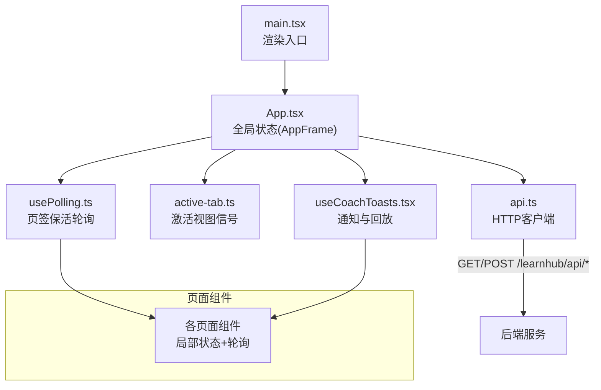
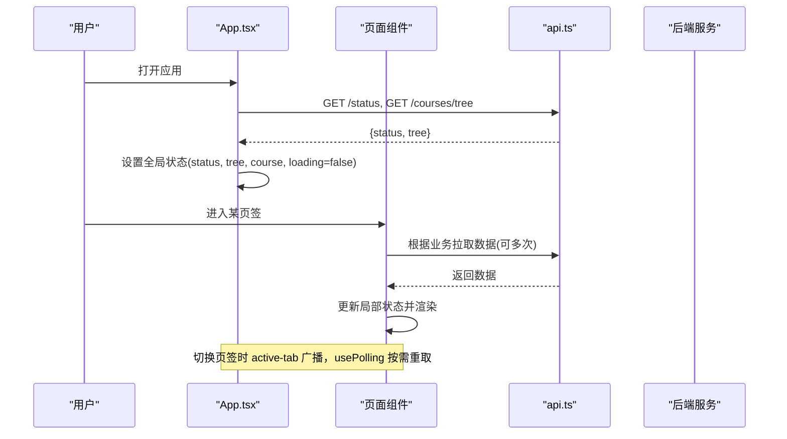
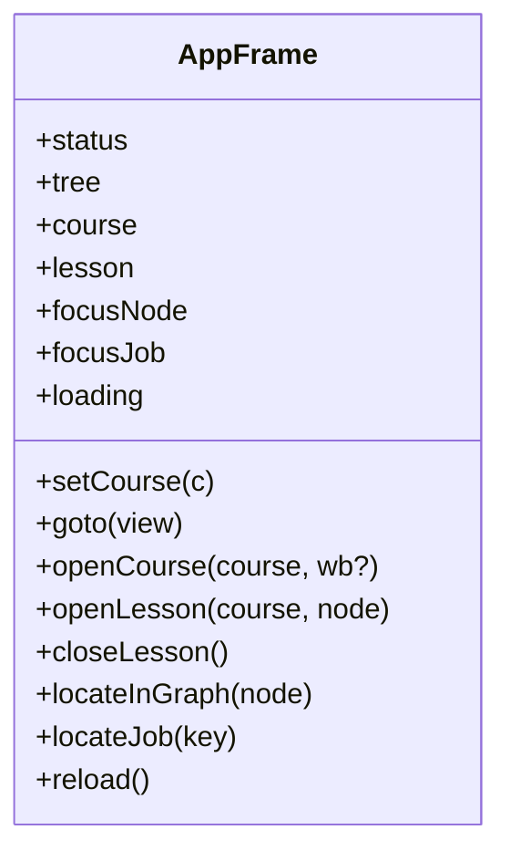
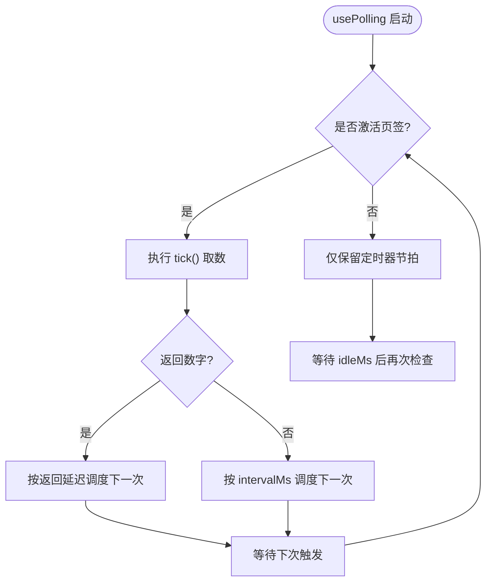
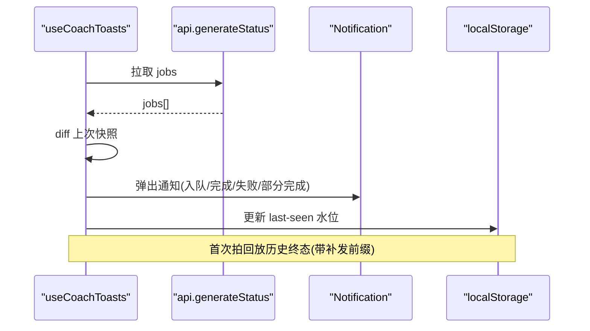
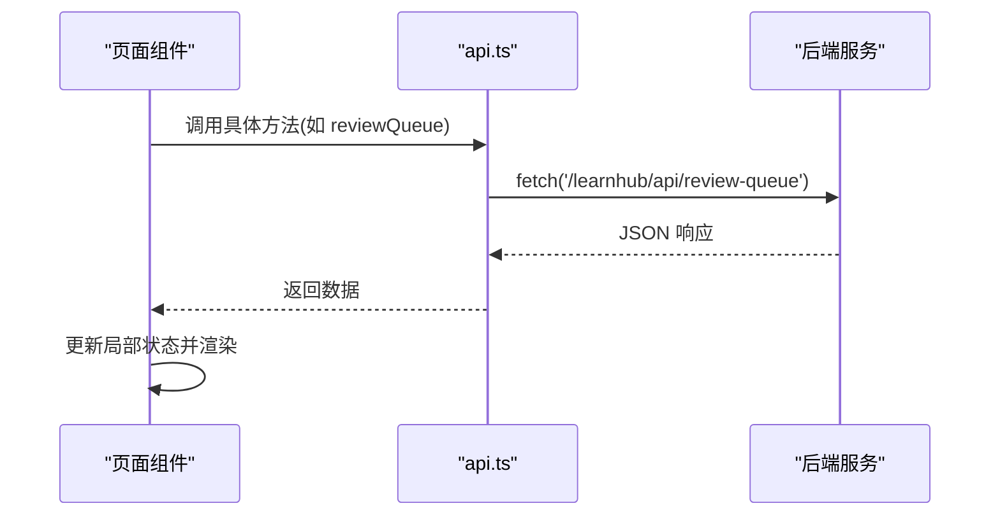
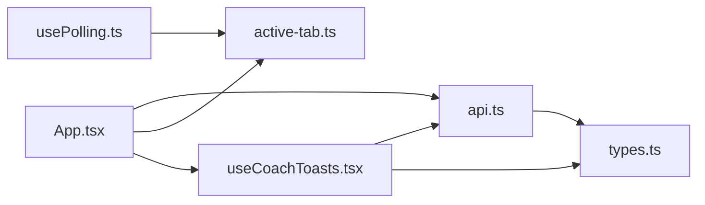

# 状态管理

<cite>
**本文引用的文件**
- [App.tsx](file://ui/src/App.tsx)
- [main.tsx](file://ui/src/main.tsx)
- [api.ts](file://ui/src/api.ts)
- [useCoachToasts.tsx](file://ui/src/useCoachToasts.tsx)
- [usePolling.ts](file://ui/src/hooks/usePolling.ts)
- [active-tab.ts](file://ui/src/active-tab.ts)
- [types.ts](file://ui/src/types.ts)
</cite>

## 目录
1. [简介](#简介)
2. [项目结构](#项目结构)
3. [核心组件](#核心组件)
4. [架构总览](#架构总览)
5. [详细组件分析](#详细组件分析)
6. [依赖关系分析](#依赖关系分析)
7. [性能考量](#性能考量)
8. [故障排查指南](#故障排查指南)
9. [结论](#结论)
10. [附录](#附录)

## 简介
本文件聚焦前端状态管理策略与实现，覆盖局部状态、全局状态与服务器状态的协同方式；重点解析 AppFrame 全局状态的设计与更新机制，API 数据获取与缓存策略（含轮询与错误处理），通知系统与用户反馈方案；并提供最佳实践与性能优化建议，以及调试方法。

## 项目结构
前端采用 React + Vite 构建，入口为 main.tsx，根组件 App.tsx 维护应用级全局状态（AppFrame）并协调路由、主题、加载态与致命错误态。页面通过 api.ts 访问后端 /learnhub/api/* 接口，使用 usePolling.ts 在激活页签时进行轻量轮询，使用 useCoachToasts.tsx 提供系统通知与回放能力。active-tab.ts 提供“当前激活视图”信号，配合 keep-alive 场景下的取数时机控制。

图表来源
- [main.tsx:1-16](file://ui/src/main.tsx#L1-L16)
- [App.tsx:1-180](file://ui/src/App.tsx#L1-L180)
- [api.ts:1-370](file://ui/src/api.ts#L1-L370)
- [active-tab.ts:1-38](file://ui/src/active-tab.ts#L1-L38)
- [useCoachToasts.tsx:1-205](file://ui/src/useCoachToasts.tsx#L1-L205)
- [usePolling.ts:1-48](file://ui/src/hooks/usePolling.ts#L1-L48)

章节来源
- [main.tsx:1-16](file://ui/src/main.tsx#L1-L16)
- [App.tsx:1-180](file://ui/src/App.tsx#L1-L180)

## 核心组件
- AppFrame：应用级共享状态与导航能力的集中定义，包含 status、tree、course、lesson、focusNode、focusJob、loading 等关键状态，以及 setCourse、goto、openCourse、openLesson、closeLesson、locateInGraph、locateJob、reload 等方法，用于跨组件共享上下文与统一导航。
- API 客户端：封装所有 HTTP 请求，统一错误处理与参数序列化，暴露 typed 方法供页面调用。
- 轮询机制：usePolling 提供“激活即取数、非激活降频、切回补取”的统一轮询模式；App 内还内置教练通知的独立轮询（生成任务与复诊结算）。
- 通知系统：useCoachToasts 基于注册表 diff 与消费水位（localStorage）实现“新事件弹条 + 面板打开回放”，支持失败重试与目标跳转。
- 激活视图信号：active-tab 模块维护当前激活视图键，配合 onTabActive 事件，使 keep-alive 组件也能感知“进入页面即取数”。

章节来源
- [App.tsx:17-38](file://ui/src/App.tsx#L17-L38)
- [App.tsx:47-180](file://ui/src/App.tsx#L47-L180)
- [api.ts:1-370](file://ui/src/api.ts#L1-L370)
- [usePolling.ts:1-48](file://ui/src/hooks/usePolling.ts#L1-L48)
- [useCoachToasts.tsx:1-205](file://ui/src/useCoachToasts.tsx#L1-L205)
- [active-tab.ts:1-38](file://ui/src/active-tab.ts#L1-L38)

## 架构总览
前端状态分层清晰：
- 局部状态：页面组件内部 useState 管理的 UI 状态（如 loading、表单输入、展开态等）。
- 全局状态：AppFrame 提供的跨组件共享状态与导航能力，由 App 组件维护并通过 props 注入到 ZoneBody 及子组件。
- 服务器状态：通过 api.ts 拉取的远端数据（status、tree、reviewQueue、generateStatus 等），以局部或全局状态形式缓存于前端。

数据流与控制流：
- 初始化：App 挂载后并行拉取 status 与 coursesTree，设置 loading/fatal，并默认选择课程。
- 导航：路由变化同步写 URL hash 与 active-tab 信号，子组件据此决定是否取数。
- 轮询：页面使用 usePolling 在激活时按 intervalMs 定时取数；隐藏时仅保留节拍不取数。
- 通知：useCoachToasts 定期拉取 generateStatus 与 probation，diff 出终态边沿弹出通知，并在首次拍回放历史终态。

图表来源
- [App.tsx:62-81](file://ui/src/App.tsx#L62-L81)
- [App.tsx:109-117](file://ui/src/App.tsx#L109-L117)
- [usePolling.ts:15-47](file://ui/src/hooks/usePolling.ts#L15-L47)
- [api.ts:43-50](file://ui/src/api.ts#L43-L50)

## 详细组件分析

### AppFrame 全局状态设计与实现
- 职责边界：AppFrame 作为“状态总览 + 课程树 + 当前课程 + 视图/学习视图跳转”的单一事实源，避免分散的 prop drilling。
- 状态字段：
  - status：后端状态（含 LLM 配置），用于全局展示与条件判断。
  - tree：课程树，用于导航与空课守卫。
  - course：当前课程，影响后续导航与数据拉取范围。
  - lesson：单课学习视图定位（course/node）。
  - focusNode / focusJob：图页高亮与队列任务定位。
  - loading / fatal：加载与致命错误态，控制骨架屏与错误界面。
- 更新策略：
  - 初始化：Promise.all 并发拉取 status 与 coursesTree，成功后重置 fatal，默认课程回退逻辑保证可用性。
  - 导航：setCourse、goto、openCourse、openLesson/closeLesson、locateInGraph/locateJob 均通过 React setState 更新，并同步写 URL hash。
  - 刷新：reload 重新拉取状态与树，保持全局一致性。
- 与路由的关系：路由权威在 location.hash，渲染态是它的投影；App 在路由变化时同步两侧，确保前进/后退/深链直达一致。

图表来源
- [App.tsx:17-38](file://ui/src/App.tsx#L17-L38)
- [App.tsx:142-157](file://ui/src/App.tsx#L142-L157)

章节来源
- [App.tsx:17-38](file://ui/src/App.tsx#L17-L38)
- [App.tsx:47-180](file://ui/src/App.tsx#L47-L180)

### 轮询机制与页签保活
- usePolling：统一封装 setInterval + isActiveTab 门，支持自定义延迟与 idle 模式；监听 learnhub:tab 事件，切回立即补取。
- 适用场景：各页面主数据（如图、推荐、复习队列）在激活页签时高频取数，隐藏时降频节省资源。
- 与 App 的关系：App 在路由变化时调用 setActiveTab，将当前视图键写入模块态并广播事件，保证 keep-alive 组件能感知“进入页面即取数”。

图表来源
- [usePolling.ts:15-47](file://ui/src/hooks/usePolling.ts#L15-L47)
- [active-tab.ts:15-27](file://ui/src/active-tab.ts#L15-L27)

章节来源
- [usePolling.ts:1-48](file://ui/src/hooks/usePolling.ts#L1-L48)
- [active-tab.ts:1-38](file://ui/src/active-tab.ts#L1-L38)

### 通知系统与用户反馈
- 生成任务通知：useCoachToasts 定期拉取 generateStatus，对比上次快照，当出现入队/运行/完成/失败/取消等终态边沿时弹出通知；产物类任务跳转提案收件箱，过程类跳转生成队列。
- 复诊结算通知：定期拉取 probation，检测节点在途消失或三率增量，弹出信息提示。
- 回放机制：首次拍读取 localStorage 中的 last-seen 水位，回放面板关闭期间完成的终态（带“补发”前缀），并推进水位。
- 失败重试：生长批失败通知附带“重试”按钮，点击重新下发面板生长命令，结果以消息提示反馈。

图表来源
- [useCoachToasts.tsx:51-205](file://ui/src/useCoachToasts.tsx#L51-L205)
- [api.ts:205-210](file://ui/src/api.ts#L205-L210)

章节来源
- [useCoachToasts.tsx:1-205](file://ui/src/useCoachToasts.tsx#L1-L205)

### API 数据获取与缓存策略
- 统一客户端：api.ts 封装 http 方法，统一 JSON 序列化、错误码处理与错误对象构造（ApiError）。
- 查询参数：q 工具函数将对象序列化为 URLSearchParams，过滤 undefined/空串。
- 典型流程：
  - 初始化：App 并发拉取 status 与 coursesTree，设置全局状态。
  - 页面数据：各页面在 usePolling 驱动下按需拉取，结合本地状态缓存。
  - 写操作：questionAnswer、generate、errorAnswer 等写操作后，通常伴随读操作刷新列表或状态。
- 缓存策略：
  - 无显式内存缓存层，依赖 React 组件状态与轮询频率控制。
  - 通知回放使用 localStorage 持久化 last-seen 水位，避免错过面板关闭期间的终态。
  - 主题偏好使用 localStorage 持久化 learnhub-theme。

图表来源
- [api.ts:13-32](file://ui/src/api.ts#L13-L32)
- [api.ts:43-353](file://ui/src/api.ts#L43-L353)

章节来源
- [api.ts:1-370](file://ui/src/api.ts#L1-L370)

### 错误处理与用户反馈
- 网络错误：http 方法在非 ok 响应时抛出 ApiError，携带 status 与错误消息；页面捕获并显示 Message.error。
- 致命错误：App 在初始加载失败时设置 fatal，展示 Result 错误页并提供重试按钮。
- 业务错误：各页面在 catch 分支中统一使用 errorMessage 提取可读消息，并以 Message.error 提示。
- 通知错误：useCoachToasts 在重试失败时以 Message.error 反馈，不影响主流程。

章节来源
- [App.tsx:62-81](file://ui/src/App.tsx#L62-L81)
- [api.ts:7-32](file://ui/src/api.ts#L7-L32)

## 依赖关系分析
- App.tsx 依赖：
  - api.ts：获取 status、coursesTree、各类业务数据。
  - active-tab.ts：同步路由变化到激活视图信号。
  - useCoachToasts.tsx：订阅生成任务与复诊结算通知。
  - lib/router：路由解析与导航。
- usePolling.ts 依赖：
  - active-tab.ts：isActiveTab 门控。
- useCoachToasts.tsx 依赖：
  - api.ts：generateStatus、probation。
  - types.ts：GenJobItem 类型。
- 类型体系：
  - types.ts 集中导出引擎视图类型、宿主返回类型与 UI 专有类型，减少手工镜像。

图表来源
- [App.tsx:1-180](file://ui/src/App.tsx#L1-L180)
- [usePolling.ts:1-48](file://ui/src/hooks/usePolling.ts#L1-L48)
- [useCoachToasts.tsx:1-205](file://ui/src/useCoachToasts.tsx#L1-L205)
- [api.ts:1-370](file://ui/src/api.ts#L1-L370)
- [types.ts:1-93](file://ui/src/types.ts#L1-L93)

章节来源
- [App.tsx:1-180](file://ui/src/App.tsx#L1-L180)
- [usePolling.ts:1-48](file://ui/src/hooks/usePolling.ts#L1-L48)
- [useCoachToasts.tsx:1-205](file://ui/src/useCoachToasts.tsx#L1-L205)
- [api.ts:1-370](file://ui/src/api.ts#L1-L370)
- [types.ts:1-93](file://ui/src/types.ts#L1-L93)

## 性能考量
- 并发拉取：App 初始化使用 Promise.all 并发拉取 status 与 coursesTree，缩短首屏时间。
- 页签保活：usePolling 在非激活页签仅保留节拍不取数，降低后台开销；激活时立即补取，避免数据陈旧。
- 通知节流：useCoachToasts 对生成任务与复诊结算分别设置不同轮询间隔（10s/60s），平衡实时性与负载。
- 回放水位：localStorage 记录 last-seen，避免重复弹条与过度回放。
- 错误快速失败：http 层统一抛错，页面快速降级并提示，避免长时间阻塞。

[本节为通用指导，无需特定文件引用]

## 故障排查指南
- 初始加载失败：
  - 现象：显示“面板加载失败”并带重试按钮。
  - 排查：检查 /status 与 /courses/tree 可达性；查看控制台 ApiError 的 status 与 message。
  - 参考路径：[App.tsx:62-81](file://ui/src/App.tsx#L62-L81)、[App.tsx:130-140](file://ui/src/App.tsx#L130-L140)
- 通知未弹出：
  - 现象：生成任务完成无通知。
  - 排查：确认 generateStatus 返回 jobs 是否包含有效 phase；检查 last-seen 水位是否已推进；查看浏览器控制台是否有网络错误。
  - 参考路径：[useCoachToasts.tsx:118-162](file://ui/src/useCoachToasts.tsx#L118-L162)
- 轮询不生效：
  - 现象：页面数据不更新。
  - 排查：确认 isActiveTab 返回值；检查 usePolling 的 intervalMs 与 idleMs；查看 learnhub:tab 事件是否触发。
  - 参考路径：[usePolling.ts:23-46](file://ui/src/hooks/usePolling.ts#L23-L46)、[active-tab.ts:17-27](file://ui/src/active-tab.ts#L17-L27)
- 写操作失败：
  - 现象：提交后无反馈或报错。
  - 排查：查看 ApiError 的 status；确认请求体字段是否符合后端契约；检查对应路由是否可用。
  - 参考路径：[api.ts:13-32](file://ui/src/api.ts#L13-L32)

章节来源
- [App.tsx:62-81](file://ui/src/App.tsx#L62-L81)
- [useCoachToasts.tsx:118-162](file://ui/src/useCoachToasts.tsx#L118-L162)
- [usePolling.ts:23-46](file://ui/src/hooks/usePolling.ts#L23-L46)
- [active-tab.ts:17-27](file://ui/src/active-tab.ts#L17-L27)
- [api.ts:13-32](file://ui/src/api.ts#L13-L32)

## 结论
本项目的前端状态管理采用“局部状态 + AppFrame 全局状态 + 服务器状态”的分层设计，配合统一的轮询与通知机制，实现了高效、可维护且用户体验友好的状态同步。AppFrame 作为全局状态与导航中枢，确保了跨组件的一致性与可预测性；usePolling 与 active-tab 保障了资源利用与数据新鲜度；useCoachToasts 提供了可靠的通知与回放能力。遵循本文的最佳实践与调试方法，可有效提升开发效率与系统稳定性。

[本节为总结性内容，无需特定文件引用]

## 附录
- 最佳实践
  - 将跨组件共享的状态集中在 AppFrame，避免 prop drilling。
  - 使用 usePolling 统一管理轮询，避免在各页面重复实现。
  - 对写操作后的读操作进行必要刷新，保持前后端一致。
  - 使用 localStorage 持久化用户偏好与消费水位，提升体验连续性。
  - 统一错误处理与提示，确保用户感知清晰。
- 调试方法
  - 使用浏览器开发者工具的 Network 面板检查 API 请求与响应。
  - 在 Console 中监听 learnhub:tab 事件，验证页签切换行为。
  - 检查 localStorage 中的 learnhub-coach-notif-lastseen 与 learnhub-theme，确认持久化状态。
  - 对于通知问题，打印 generateStatus 与 probation 的返回数据，定位 diff 逻辑。

[本节为补充说明，无需特定文件引用]