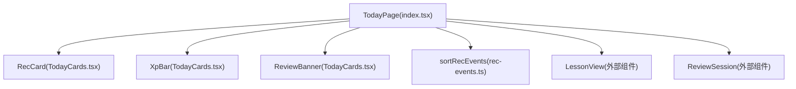
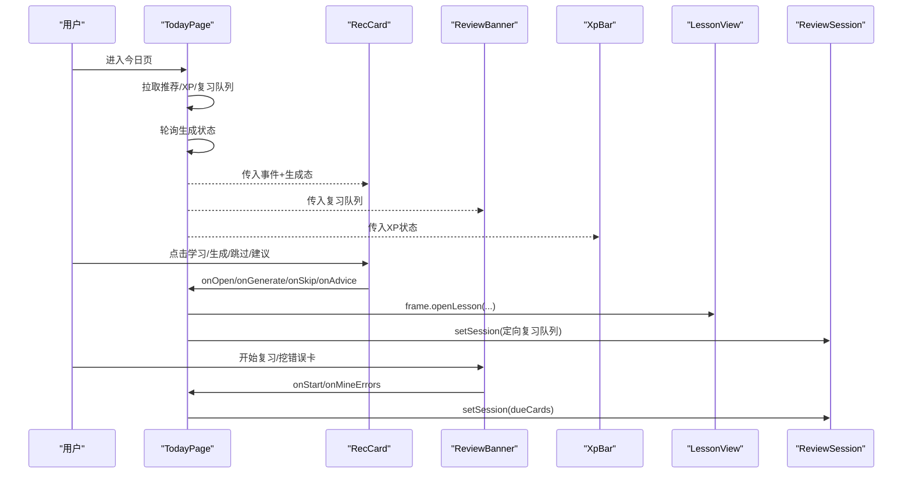
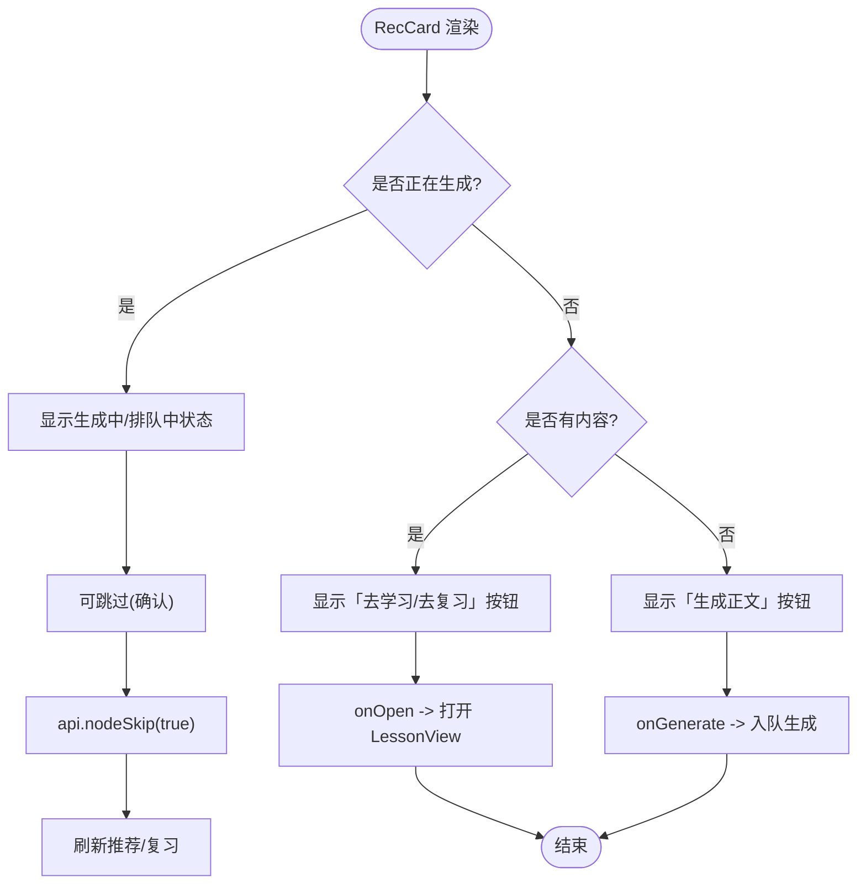
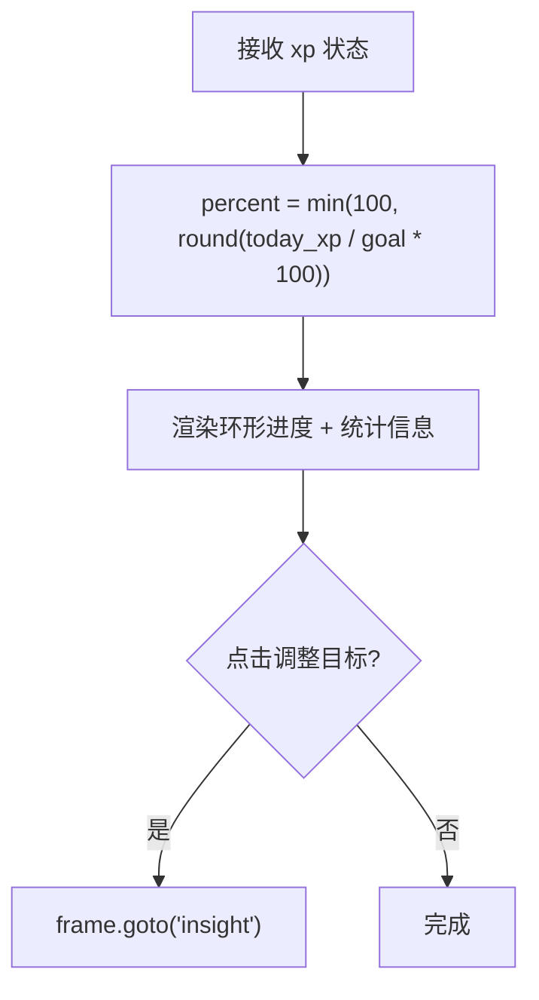
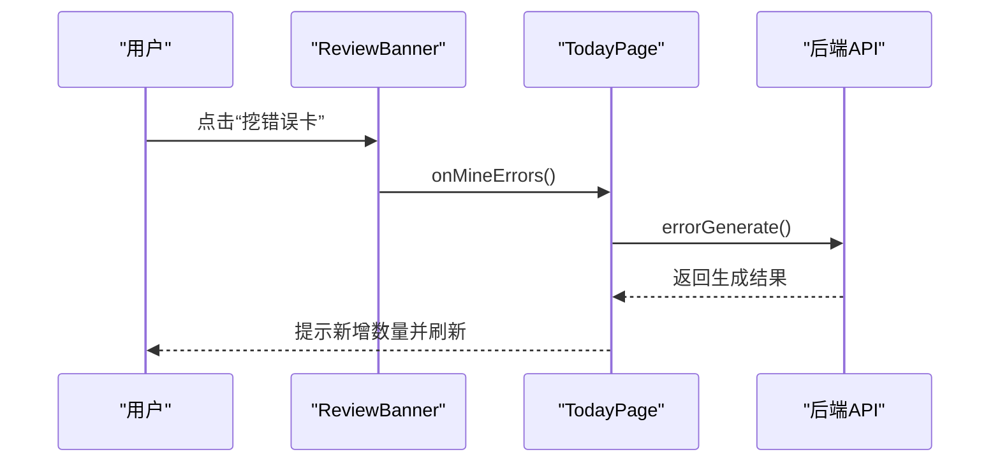
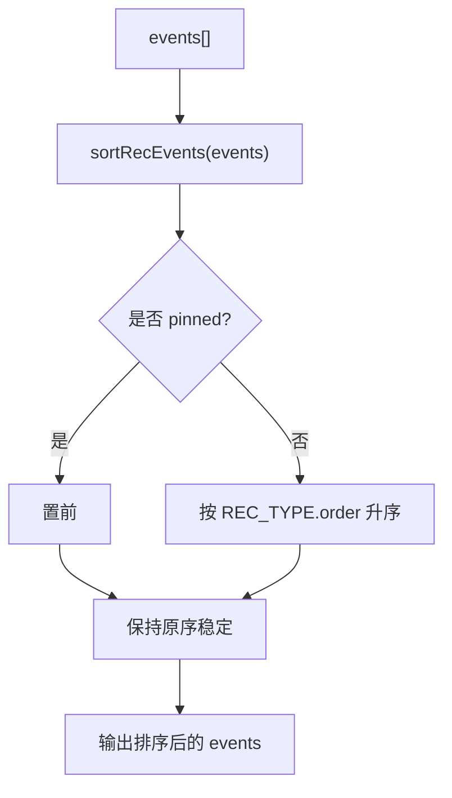
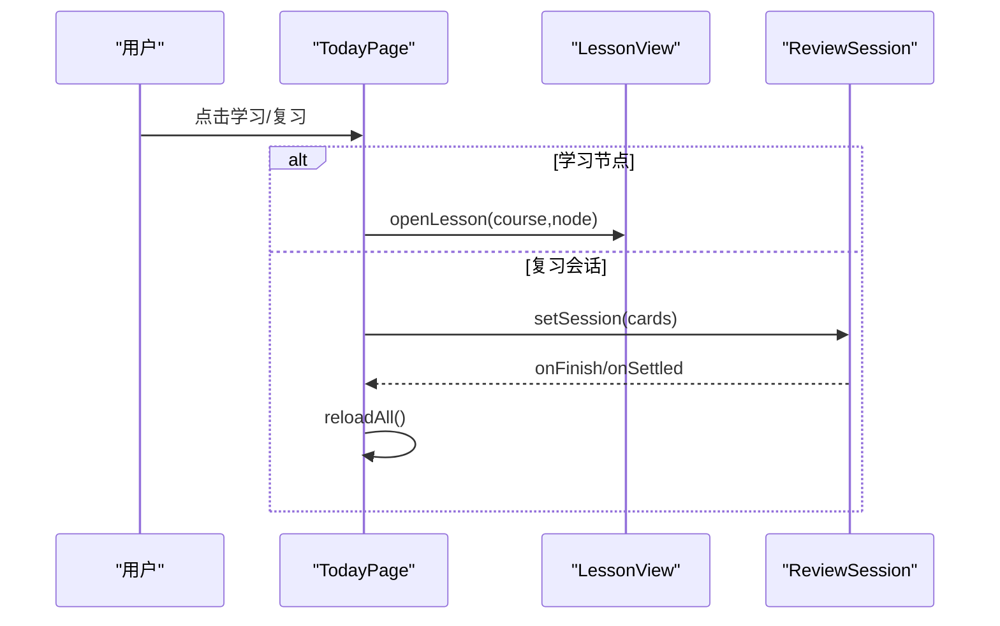
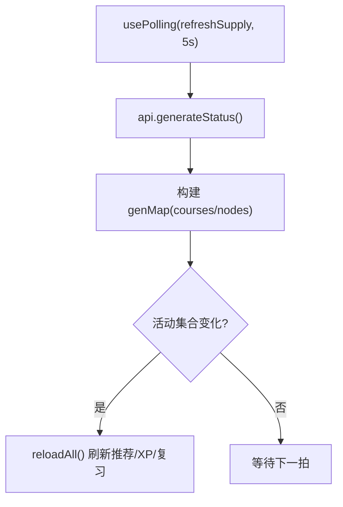
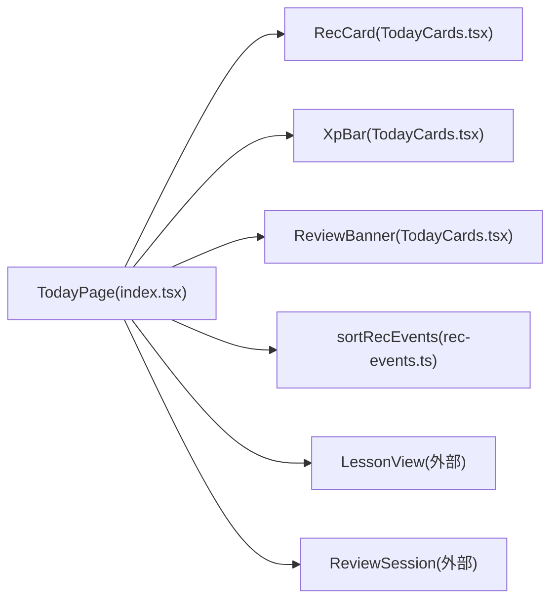

# 今日任务卡片

<cite>
**本文引用的文件**
- [TodayCards.tsx](file://ui/src/pages/TodayPage/TodayCards.tsx)
- [index.tsx](file://ui/src/pages/TodayPage/index.tsx)
- [rec-events.ts](file://ui/src/lib/rec-events.ts)
</cite>

## 目录
1. [简介](#简介)
2. [项目结构](#项目结构)
3. [核心组件](#核心组件)
4. [架构总览](#架构总览)
5. [详细组件分析](#详细组件分析)
6. [依赖关系分析](#依赖关系分析)
7. [性能考量](#性能考量)
8. [故障排查指南](#故障排查指南)
9. [结论](#结论)
10. [附录](#附录)

## 简介
本文件聚焦“今日任务卡片”的前端实现与交互，围绕 RecCard 推荐学习节点卡片、XpBar XP进度条、ReviewBanner复习横幅与错误对比卡挖掘机制展开。文档说明推荐事件的排序算法、节点学习视图的集成方式、会话状态管理，并给出扩展自定义推荐策略与卡片渲染的实践建议。

## 项目结构
- 页面级入口：TodayPage（负责数据加载、轮询、会话切换、弹窗与抽屉）
- 卡片组件：RecCard、XpBar、ReviewBanner（位于 TodayCards.tsx）
- 推荐事件排序：sortRecEvents（位于 rec-events.ts）

图表来源
- [index.tsx:17-26](file://ui/src/pages/TodayPage/index.tsx#L17-L26)
- [TodayCards.tsx:16-104](file://ui/src/pages/TodayPage/TodayCards.tsx#L16-L104)
- [rec-events.ts:20-25](file://ui/src/lib/rec-events.ts#L20-L25)

章节来源
- [index.tsx:1-287](file://ui/src/pages/TodayPage/index.tsx#L1-L287)
- [TodayCards.tsx:1-232](file://ui/src/pages/TodayPage/TodayCards.tsx#L1-L232)
- [rec-events.ts:1-26](file://ui/src/lib/rec-events.ts#L1-L26)

## 核心组件
- XpBar：展示今日XP、每日目标环与连续学习天数，支持调整目标跳转洞察页。
- ReviewBanner：展示待复习张数、开始复习、挖错误卡；处理笔记源漂移/挂起状态的直达动作。
- RecCard：推荐学习节点大卡，承载生成状态（排队/生成中）、跳过、A3建议项定向复习、诊断重写等。

章节来源
- [TodayCards.tsx:16-104](file://ui/src/pages/TodayPage/TodayCards.tsx#L16-L104)
- [TodayCards.tsx:106-232](file://ui/src/pages/TodayPage/TodayCards.tsx#L106-L232)

## 架构总览
今日页作为聚合层，负责：
- 拉取推荐流、XP、复习队列
- 轮询生成状态，维护节点生成态映射
- 将推荐事件排序后渲染为 RecCard
- 在二级视图打开 LessonView 或启动 ReviewSession
- 通过回调桥接各卡片动作到 API 调用与状态更新

图表来源
- [index.tsx:36-118](file://ui/src/pages/TodayPage/index.tsx#L36-L118)
- [index.tsx:130-199](file://ui/src/pages/TodayPage/index.tsx#L130-L199)
- [index.tsx:201-266](file://ui/src/pages/TodayPage/index.tsx#L201-L266)
- [TodayCards.tsx:129-232](file://ui/src/pages/TodayPage/TodayCards.tsx#L129-L232)

## 详细组件分析

### RecCard：推荐学习节点卡片
- 展示信息：类型标签、置顶标识、节点名、课程/区域/原因、计划意图、生成状态标签、已生成标记。
- 生成状态管理：
  - 未生成且不在生成中：显示“生成正文”按钮，触发入队全局队列。
  - 生成中/排队中：主按钮禁用或显示对应状态文本，避免重复操作。
- 跳过功能（nodeSkip）：确认后将该节点视同已通过，不再出现在推荐与阻塞判定；可在节点学习页取消跳过。
- A3建议项定向复习：点击“定向复习”，拉取目标节点的复习队列并直接进入 ReviewSession。
- 诊断重写：当事件携带 diagnostics，提供“重写此节”入口，走单节重写管线（版本+1），不改动题库与复习计划。

图表来源
- [TodayCards.tsx:129-232](file://ui/src/pages/TodayPage/TodayCards.tsx#L129-L232)
- [index.tsx:130-149](file://ui/src/pages/TodayPage/index.tsx#L130-L149)

章节来源
- [TodayCards.tsx:106-232](file://ui/src/pages/TodayPage/TodayCards.tsx#L106-L232)
- [index.tsx:130-149](file://ui/src/pages/TodayPage/index.tsx#L130-L149)

### XpBar：XP进度条
- 计算逻辑：按今日XP与目标的百分比绘制环形进度，上限100%。
- 展示信息：今日XP、目标、连续学习天数。
- 交互：点击“调整每日目标”跳转洞察页进行设置。

图表来源
- [TodayCards.tsx:16-37](file://ui/src/pages/TodayPage/TodayCards.tsx#L16-L37)
- [index.tsx:223-224](file://ui/src/pages/TodayPage/index.tsx#L223-L224)

章节来源
- [TodayCards.tsx:16-37](file://ui/src/pages/TodayPage/TodayCards.tsx#L16-L37)
- [index.tsx:223-224](file://ui/src/pages/TodayPage/index.tsx#L223-L224)

### ReviewBanner：复习横幅与错误对比卡挖掘
- 复习入口：根据到期张数启用“开始复习”，直接启动 ReviewSession。
- 错误对比卡挖掘：调用错误卡生成接口，成功后提示新增数量并刷新。
- 笔记源状态行：
  - 漂移：提供“重新出题”（确认当前内容，旧题保留）与“归档旧题”。
  - 挂起：提供“重新注册”与“管理笔记源”。

图表来源
- [TodayCards.tsx:39-104](file://ui/src/pages/TodayPage/TodayCards.tsx#L39-L104)
- [index.tsx:151-166](file://ui/src/pages/TodayPage/index.tsx#L151-L166)

章节来源
- [TodayCards.tsx:39-104](file://ui/src/pages/TodayPage/TodayCards.tsx#L39-L104)
- [index.tsx:151-166](file://ui/src/pages/TodayPage/index.tsx#L151-L166)

### 推荐事件排序算法
- 排序规则：置顶（pinned）优先 → 事件类型顺序（REC_TYPE.order）升序 → 原序稳定。
- 未知类型：order=9，标签回退为原始 type。

图表来源
- [rec-events.ts:6-18](file://ui/src/lib/rec-events.ts#L6-L18)
- [rec-events.ts:20-25](file://ui/src/lib/rec-events.ts#L20-L25)
- [index.tsx:245](file://ui/src/pages/TodayPage/index.tsx#L245)

章节来源
- [rec-events.ts:1-26](file://ui/src/lib/rec-events.ts#L1-L26)
- [index.tsx:245](file://ui/src/pages/TodayPage/index.tsx#L245)

### 节点学习视图集成与会话状态管理
- 节点学习：点击 RecCard 的学习按钮，调用 frame.openLesson 打开 LessonView。
- 复习会话：从复习横幅或 A3建议项启动 ReviewSession，传入 dueCards 或定向复习队列。
- 会话关闭/完成：统一刷新推荐、XP与复习队列，保证数据一致性。

图表来源
- [index.tsx:201-204](file://ui/src/pages/TodayPage/index.tsx#L201-L204)
- [index.tsx:225-230](file://ui/src/pages/TodayPage/index.tsx#L225-L230)
- [index.tsx:261-266](file://ui/src/pages/TodayPage/index.tsx#L261-L266)

章节来源
- [index.tsx:201-266](file://ui/src/pages/TodayPage/index.tsx#L201-L266)

### 生成状态管理与轮询
- 轮询频率：每5秒调用 generateStatus，维护运行中/排队中的作业集合。
- 状态映射：course/node → {state:'running'|'queued', progress?}，用于 RecCard 内联进度展示。
- 边沿检测：活动作业集合变化时触发推荐流重拉，确保“已生成”标识及时点亮。

图表来源
- [index.tsx:74-118](file://ui/src/pages/TodayPage/index.tsx#L74-L118)

章节来源
- [index.tsx:74-118](file://ui/src/pages/TodayPage/index.tsx#L74-L118)

## 依赖关系分析
- TodayPage 依赖：
  - 组件：RecCard、XpBar、ReviewBanner
  - 工具：sortRecEvents
  - 外部视图：LessonView、ReviewSession
  - 命令与轮询：useCommand、usePolling
- TodayCards 依赖：
  - UI 库：@arco-design/web-react
  - 本地 API：../../api
  - 类型定义：../../types
  - 推荐元信息：../../lib/rec-events

图表来源
- [index.tsx:17-32](file://ui/src/pages/TodayPage/index.tsx#L17-L32)
- [TodayCards.tsx:5-13](file://ui/src/pages/TodayPage/TodayCards.tsx#L5-L13)
- [rec-events.ts:1-26](file://ui/src/lib/rec-events.ts#L1-L26)

章节来源
- [index.tsx:1-32](file://ui/src/pages/TodayPage/index.tsx#L1-L32)
- [TodayCards.tsx:1-13](file://ui/src/pages/TodayPage/TodayCards.tsx#L1-L13)
- [rec-events.ts:1-26](file://ui/src/lib/rec-events.ts#L1-L26)

## 性能考量
- 轮询节流：5秒间隔避免频繁请求；仅在活动作业集合变化时触发全量刷新，减少不必要重绘。
- 局部状态：RecCard 内部仅维护重写按钮的 loading 状态，避免整卡重渲染。
- 稳定排序：使用稳定排序保持相同优先级下的原序，提升列表体验一致性。
- 条件渲染：无课程时显示空态，减少无效DOM。

[本节为通用指导，无需特定文件引用]

## 故障排查指南
- 推荐流加载失败：页面处于失败态，检查 useCommand 返回值与网络连通性。
- 生成状态不同步：确认轮询是否生效（usePolling），检查 generateStatus 返回的作业集合。
- 跳过无效：确认 nodeSkip 调用成功，并在节点学习页查看是否可取消跳过。
- 错误卡挖掘无产出：可能本次未发现高频错误模式，属正常情况；可重试或检查错误流水。
- 笔记源异常：漂移需重新出题；挂起需重新注册；完成后刷新以更新卡片池。

章节来源
- [index.tsx:130-199](file://ui/src/pages/TodayPage/index.tsx#L130-L199)
- [index.tsx:74-118](file://ui/src/pages/TodayPage/index.tsx#L74-L118)
- [TodayCards.tsx:141-151](file://ui/src/pages/TodayPage/TodayCards.tsx#L141-L151)

## 结论
今日任务卡片通过 RecCard、XpBar、ReviewBanner 三件套，结合推荐事件排序与生成状态轮询，实现了“学/复习/生成/跳过/建议”的一体化工作流。页面采用轻量状态与稳定排序，保障交互一致性与性能。通过回调上抛与外部视图集成，形成清晰的数据流与控制流边界。

[本节为总结性内容，无需特定文件引用]

## 附录
- 扩展自定义推荐策略：
  - 在 sortRecEvents 基础上扩展事件类型与权重，或在上层对 events 做二次过滤/分组后再排序。
  - 通过注入新的 e.type 与 recTypeMeta 映射，即可改变展示顺序与标签颜色。
- 扩展卡片渲染：
  - 在 RecCard 中增加新字段分支（如 e.customFlag），复用现有 Tag/Button 组合进行展示。
  - 若需更复杂布局，可将 RecCard 拆分为子组件（头部、主体、底部动作区），由 TodayPage 编排。
- 扩展复习流程：
  - 在 ReviewBanner 中增加新的复习入口（如专题复习），复用 startAdviceReview 的模式拉取队列并进入 ReviewSession。
  - 如需自定义难度带或自适应策略，可在 ReviewSession 启动前注入 calibrationHint 或其他参数。

[本节为概念性扩展建议，无需特定文件引用]