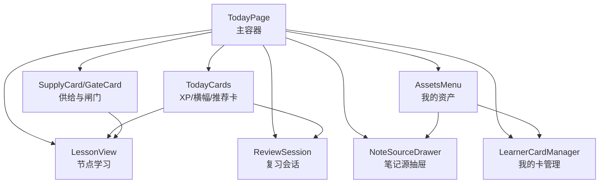
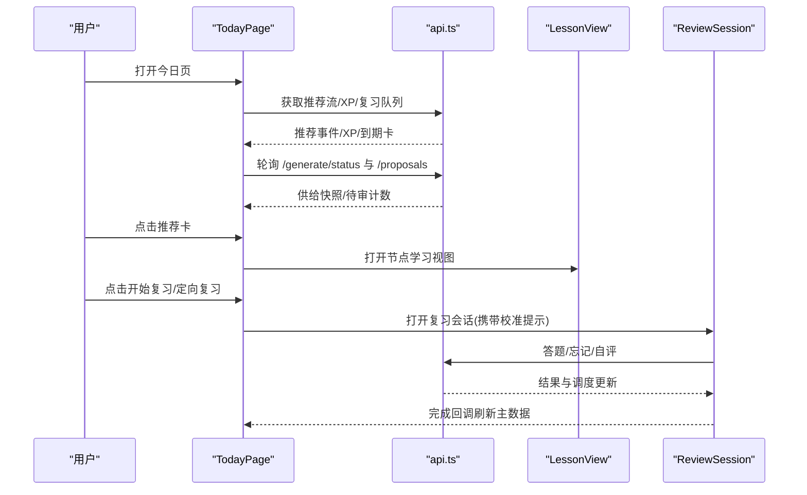
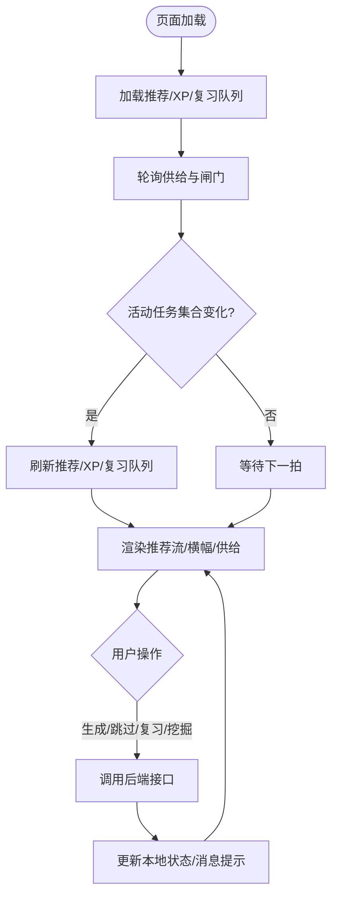
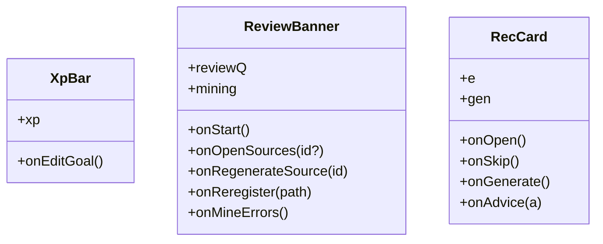
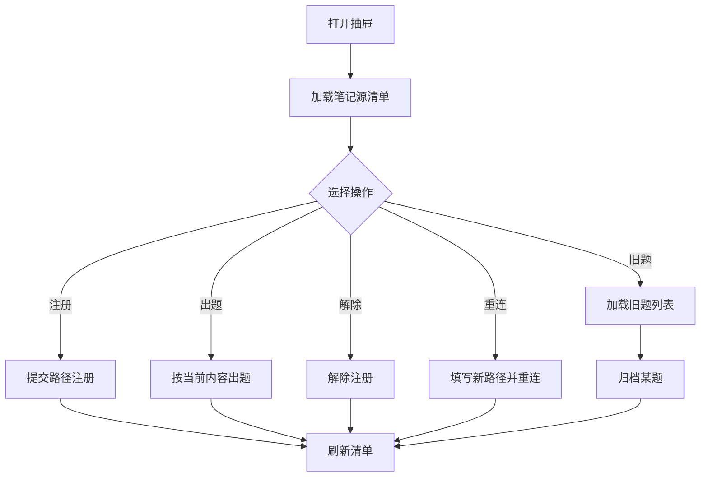
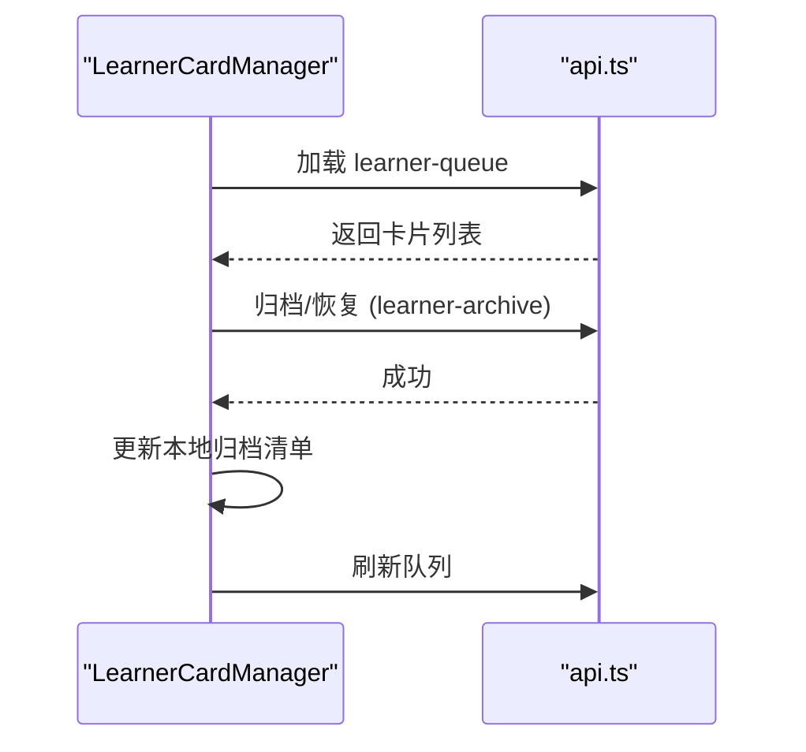
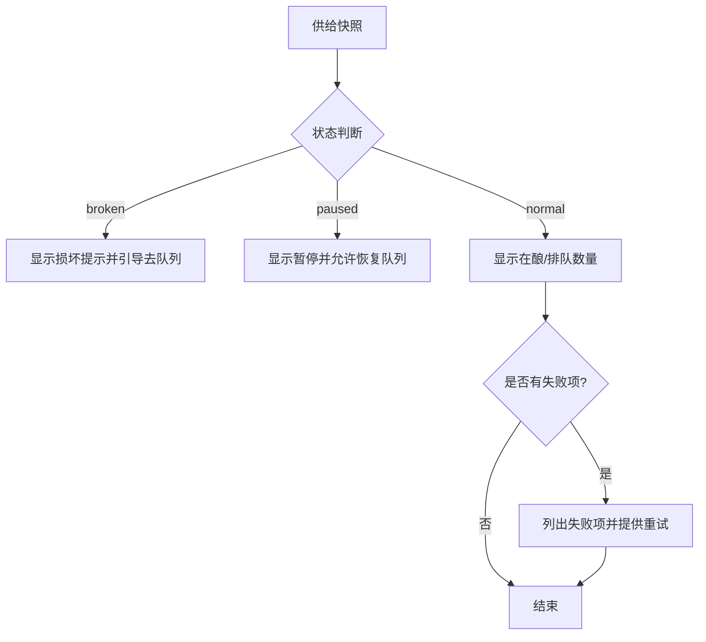
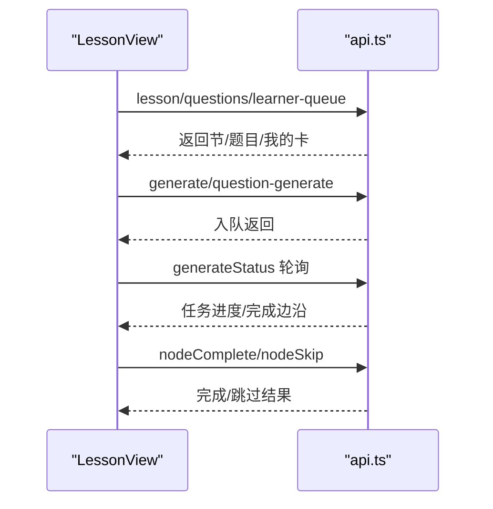
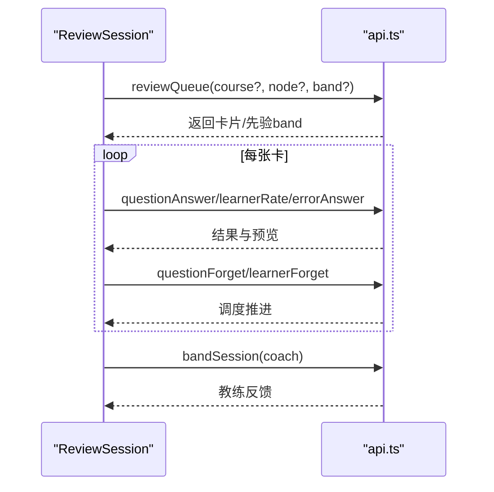
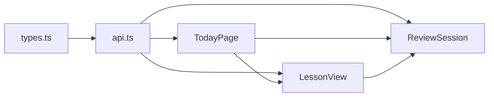

# 今日学习页面

<cite>
**本文引用的文件**
- [ui/src/pages/TodayPage/index.tsx](file://ui/src/pages/TodayPage/index.tsx)
- [ui/src/pages/TodayPage/TodayCards.tsx](file://ui/src/pages/TodayPage/TodayCards.tsx)
- [ui/src/pages/TodayPage/LearnerCardManager.tsx](file://ui/src/pages/TodayPage/LearnerCardManager.tsx)
- [ui/src/pages/TodayPage/NoteSourceDrawer.tsx](file://ui/src/pages/TodayPage/NoteSourceDrawer.tsx)
- [ui/src/pages/TodayPage/AssetsMenu.tsx](file://ui/src/pages/TodayPage/AssetsMenu.tsx)
- [ui/src/pages/TodayPage/SupplyCard.tsx](file://ui/src/pages/TodayPage/SupplyCard.tsx)
- [ui/src/components/LessonView.tsx](file://ui/src/components/LessonView.tsx)
- [ui/src/components/ReviewSession.tsx](file://ui/src/components/ReviewSession.tsx)
- [ui/src/types.ts](file://ui/src/types.ts)
- [ui/src/api.ts](file://ui/src/api.ts)
</cite>

## 目录
1. [简介](#简介)
2. [项目结构](#项目结构)
3. [核心组件](#核心组件)
4. [架构总览](#架构总览)
5. [详细组件分析](#详细组件分析)
6. [依赖关系分析](#依赖关系分析)
7. [性能与可用性](#性能与可用性)
8. [故障排查指南](#故障排查指南)
9. [结论](#结论)
10. [附录：扩展与自定义](#附录：扩展与自定义)

## 简介
今日学习页面是日常学习的统一入口，聚合了学习进度（XP/连续天数）、复习入口、推荐学习流、供给状态（生成队列/停摆/失败重试）以及待审闸门计数。它通过轮询与命令封装，将“推荐流”作为主数据源，其他辅助信息（XP、复习横幅、供给、闸门）失败时降级为空态，避免单点故障导致整页崩溃。用户可在本页面完成“开始复习”“定向复习”“生成正文”“跳过节点”“挖错误卡”“管理笔记源/我的卡”等关键动作，并无缝进入节点学习视图或复习会话。

## 项目结构
今日学习页面由一个主容器与多个子模块组成：
- 主容器 TodayPage：负责数据获取、轮询、状态编排与路由切换
- 卡片组 TodayCards：XP 条、复习横幅、推荐大卡
- 资产菜单 AssetsMenu：打开笔记源抽屉与我的卡管理抽屉
- 笔记源抽屉 NoteSourceDrawer：注册/出题/解除注册/重连/旧题归档
- 我的卡管理 LearnerCardManager：查看/归档/恢复自注卡
- 供给卡片 SupplyCard + GateCard：课程供给状态与待审提案计数
- 二级视图 LessonView：节点学习（正文阅读、练习、完成确认）
- 复习会话 ReviewSession：Anki 式刷卡队列（含自适应难度带、JOL、教练反馈）

图表来源
- [ui/src/pages/TodayPage/index.tsx:36-287](file://ui/src/pages/TodayPage/index.tsx#L36-L287)
- [ui/src/pages/TodayPage/TodayCards.tsx:16-232](file://ui/src/pages/TodayPage/TodayCards.tsx#L16-L232)
- [ui/src/pages/TodayPage/AssetsMenu.tsx:6-22](file://ui/src/pages/TodayPage/AssetsMenu.tsx#L6-L22)
- [ui/src/pages/TodayPage/NoteSourceDrawer.tsx:12-212](file://ui/src/pages/TodayPage/NoteSourceDrawer.tsx#L12-L212)
- [ui/src/pages/TodayPage/LearnerCardManager.tsx:12-91](file://ui/src/pages/TodayPage/LearnerCardManager.tsx#L12-L91)
- [ui/src/pages/TodayPage/SupplyCard.tsx:17-132](file://ui/src/pages/TodayPage/SupplyCard.tsx#L17-L132)
- [ui/src/components/LessonView.tsx:40-480](file://ui/src/components/LessonView.tsx#L40-L480)
- [ui/src/components/ReviewSession.tsx:33-347](file://ui/src/components/ReviewSession.tsx#L33-L347)

章节来源
- [ui/src/pages/TodayPage/index.tsx:36-287](file://ui/src/pages/TodayPage/index.tsx#L36-L287)

## 核心组件
- TodayPage：聚合推荐流、XP、复习队列、供给快照与待审提案数；维护本地会话级状态（如最近归档的我的卡），并通过 usePolling 每 5 秒刷新供给与闸门；从学习视图返回后刷新主数据。
- TodayCards：展示 XP 进度、到期复习数量与操作入口；推荐卡支持“生成正文”“去学习/去复习”“跳过”“诊断重写”“建议先复习”。
- AssetsMenu：提供“笔记源管理”和“我的卡管理”两个入口。
- NoteSourceDrawer：注册笔记源、按当前内容重新出题、解除注册、缺失源重连、展开旧题逐题归档。
- LearnerCardManager：加载“我的卡”队列，支持归档/恢复，并在本次会话内保留已归档清单以便恢复。
- SupplyCard/GateCard：显示在酿/排队/暂停/损坏/失败的任务状态，提供恢复队列与重试；GateCard 显示待审提案数并跳转收件箱。
- LessonView：节点学习主界面，包含正文折叠、PracticeFlow 练习、AI 出题/补题、完成确认、失败处理与续跑。
- ReviewSession：复习会话，支持自适应难度带、JOL 预测、教练反馈、错误对比卡作答、我的卡自评/忘记申报。

章节来源
- [ui/src/pages/TodayPage/index.tsx:36-287](file://ui/src/pages/TodayPage/index.tsx#L36-L287)
- [ui/src/pages/TodayPage/TodayCards.tsx:16-232](file://ui/src/pages/TodayPage/TodayCards.tsx#L16-L232)
- [ui/src/pages/TodayPage/AssetsMenu.tsx:6-22](file://ui/src/pages/TodayPage/AssetsMenu.tsx#L6-L22)
- [ui/src/pages/TodayPage/NoteSourceDrawer.tsx:12-212](file://ui/src/pages/TodayPage/NoteSourceDrawer.tsx#L12-L212)
- [ui/src/pages/TodayPage/LearnerCardManager.tsx:12-91](file://ui/src/pages/TodayPage/LearnerCardManager.tsx#L12-L91)
- [ui/src/pages/TodayPage/SupplyCard.tsx:17-132](file://ui/src/pages/TodayPage/SupplyCard.tsx#L17-L132)
- [ui/src/components/LessonView.tsx:40-480](file://ui/src/components/LessonView.tsx#L40-L480)
- [ui/src/components/ReviewSession.tsx:33-347](file://ui/src/components/ReviewSession.tsx#L33-L347)

## 架构总览
今日学习页面的数据流以“推荐流”为核心，辅以 XP、复习队列、供给快照与待审提案数。所有网络请求通过 api.ts 统一封装，使用 useCommand/usePolling 进行命令化取数与轮询。页面根据 frame.lesson 是否存在切换至二级视图（LessonView）。复习会话以 ReviewSession 弹窗形式承载，完成后回调刷新主数据。

图表来源
- [ui/src/pages/TodayPage/index.tsx:39-118](file://ui/src/pages/TodayPage/index.tsx#L39-L118)
- [ui/src/components/LessonView.tsx:88-125](file://ui/src/components/LessonView.tsx#L88-L125)
- [ui/src/components/ReviewSession.tsx:96-165](file://ui/src/components/ReviewSession.tsx#L96-L165)
- [ui/src/api.ts:50-107](file://ui/src/api.ts#L50-L107)

## 详细组件分析

### TodayPage（主容器）
- 数据获取：useCommand 拉取 recommend、xp、reviewQueue；usePolling 每 5 秒刷新 generateStatus 与 proposals，计算 running/queued/paused/broken/failed 并映射到 RecGenState。
- 边沿检测：当活动任务集合变化时触发 reloadAll，使推荐流中对应节点的“已生成”标识点亮。
- 交互：生成正文、跳过节点、挖错误卡、笔记源漂移/挂起修复、定向复习启动。
- 视图切换：frame.lesson 存在时渲染 LessonView；否则渲染主布局（XP/横幅/供给/推荐流/复习会话/抽屉）。
- 悬浮指示：后台有运行任务时显示悬浮条，点击跳转到生成队列页。

图表来源
- [ui/src/pages/TodayPage/index.tsx:63-118](file://ui/src/pages/TodayPage/index.tsx#L63-L118)
- [ui/src/pages/TodayPage/index.tsx:131-199](file://ui/src/pages/TodayPage/index.tsx#L131-L199)

章节来源
- [ui/src/pages/TodayPage/index.tsx:36-287](file://ui/src/pages/TodayPage/index.tsx#L36-L287)

### TodayCards（XP/横幅/推荐卡）
- XpBar：展示今日 XP、目标、连续天数，支持调整每日目标。
- ReviewBanner：展示到期张数、开始复习、挖错误卡；对漂移/挂起的笔记源提供直达修复入口。
- RecCard：推荐项卡片，支持“生成正文”“去学习/去复习”“跳过”“诊断重写”“建议先复习”；根据生成状态显示排队/生成中/已生成标签。

图表来源
- [ui/src/pages/TodayPage/TodayCards.tsx:16-232](file://ui/src/pages/TodayPage/TodayCards.tsx#L16-L232)

章节来源
- [ui/src/pages/TodayPage/TodayCards.tsx:16-232](file://ui/src/pages/TodayPage/TodayCards.tsx#L16-L232)

### NoteSourceDrawer（笔记源抽屉）
- 功能：注册笔记源（文件或文件夹）、按当前内容重新出题、解除注册、缺失源重连、展开旧题逐题归档。
- 状态：正常/漂移/缺失/镜像不一致，分别给出不同文案与操作。
- 交互：输入路径注册；点击“旧题管理”加载该源的题目列表；可对旧题归档；缺失源可填写新路径重连。

图表来源
- [ui/src/pages/TodayPage/NoteSourceDrawer.tsx:21-121](file://ui/src/pages/TodayPage/NoteSourceDrawer.tsx#L21-L121)
- [ui/src/pages/TodayPage/NoteSourceDrawer.tsx:146-206](file://ui/src/pages/TodayPage/NoteSourceDrawer.tsx#L146-L206)

章节来源
- [ui/src/pages/TodayPage/NoteSourceDrawer.tsx:12-212](file://ui/src/pages/TodayPage/NoteSourceDrawer.tsx#L12-L212)

### LearnerCardManager（我的卡管理）
- 功能：加载“我的卡”队列，支持归档/恢复；会话级保留“本次已归档”清单用于恢复。
- 交互：点击归档弹出确认；恢复则从本地清单移除并刷新。

图表来源
- [ui/src/pages/TodayPage/LearnerCardManager.tsx:23-47](file://ui/src/pages/TodayPage/LearnerCardManager.tsx#L23-L47)
- [ui/src/api.ts:124-139](file://ui/src/api.ts#L124-L139)

章节来源
- [ui/src/pages/TodayPage/LearnerCardManager.tsx:12-91](file://ui/src/pages/TodayPage/LearnerCardManager.tsx#L12-L91)

### AssetsMenu（资产菜单）
- 功能：提供“笔记源管理”和“我的卡管理”两个入口，集中资产管理能力。
- 交互：点击下拉菜单项打开对应抽屉。

章节来源
- [ui/src/pages/TodayPage/AssetsMenu.tsx:6-22](file://ui/src/pages/TodayPage/AssetsMenu.tsx#L6-L22)

### SupplyCard/GateCard（供给卡片与闸门计数）
- SupplyCard：展示在酿/排队/暂停/损坏/失败的任务状态；提供恢复队列与重试按钮；失败行附带机制提示（断点续跑/重新裁决/重新入队）。
- GateCard：展示待审提案数，点击跳转收件箱。
- 数据来源：/generate/status 与 /proposals，与生成队列页共享事实源。

图表来源
- [ui/src/pages/TodayPage/SupplyCard.tsx:53-116](file://ui/src/pages/TodayPage/SupplyCard.tsx#L53-L116)

章节来源
- [ui/src/pages/TodayPage/SupplyCard.tsx:17-132](file://ui/src/pages/TodayPage/SupplyCard.tsx#L17-L132)

### LessonView（节点学习视图）
- 功能：加载课程节点信息、题库、我的卡；支持生成正文、AI 出题/补题、完成确认、跳过/取消跳过、单节重写、失败处理与续跑。
- 轮询：running 时 3 秒、空闲 15 秒；任务完成边沿静默刷新；内容版本变化时冻结语义下仅轻提示。
- 完成门禁：正确率低于及格线默认拒绝，可 force 旁路。

图表来源
- [ui/src/components/LessonView.tsx:88-125](file://ui/src/components/LessonView.tsx#L88-L125)
- [ui/src/components/LessonView.tsx:127-240](file://ui/src/components/LessonView.tsx#L127-L240)
- [ui/src/components/LessonView.tsx:252-476](file://ui/src/components/LessonView.tsx#L252-L476)

章节来源
- [ui/src/components/LessonView.tsx:40-480](file://ui/src/components/LessonView.tsx#L40-L480)

### ReviewSession（复习会话）
- 功能：Anki 式扁平队列，一卡一票；正面作答或 5 秒忘记；背面自评 Hard/Good/Easy；支持自适应难度带、JOL 预测、教练反馈、错误对比卡作答、我的卡自评/忘记申报。
- 数据：支持单节点定向复习（响应带 Mastery 先验 band）；会话结束落难度带日志并拉教练反馈。

图表来源
- [ui/src/components/ReviewSession.tsx:65-165](file://ui/src/components/ReviewSession.tsx#L65-L165)
- [ui/src/components/ReviewSession.tsx:216-232](file://ui/src/components/ReviewSession.tsx#L216-L232)
- [ui/src/api.ts:82-98](file://ui/src/api.ts#L82-L98)

章节来源
- [ui/src/components/ReviewSession.tsx:33-347](file://ui/src/components/ReviewSession.tsx#L33-L347)

## 依赖关系分析
- 类型定义集中在 types.ts，统一从引擎视图与宿主模块派生，避免手工镜像。
- 网络层 api.ts 提供统一客户端，所有页面通过此层访问后端。
- 页面间通过 AppFrame 进行导航与全局刷新（reload/goto/closeLesson）。
- 轮询与命令封装（usePolling/useCommand）保证数据一致性与时序控制。

图表来源
- [ui/src/types.ts:1-93](file://ui/src/types.ts#L1-L93)
- [ui/src/api.ts:1-200](file://ui/src/api.ts#L1-L200)
- [ui/src/pages/TodayPage/index.tsx:36-287](file://ui/src/pages/TodayPage/index.tsx#L36-L287)
- [ui/src/components/LessonView.tsx:40-480](file://ui/src/components/LessonView.tsx#L40-L480)
- [ui/src/components/ReviewSession.tsx:33-347](file://ui/src/components/ReviewSession.tsx#L33-L347)

章节来源
- [ui/src/types.ts:1-93](file://ui/src/types.ts#L1-L93)
- [ui/src/api.ts:1-200](file://ui/src/api.ts#L1-L200)

## 性能与可用性
- 主数据优先：推荐流失败视为页面失败态；XP/复习横幅/供给/闸门失败按空处理，不翻整页。
- 轮询策略：供给与闸门 5 秒一拍；节点学习视图 running 时 3 秒、空闲 15 秒；非激活页签降低频率。
- 边沿优化：活动任务集合变化才触发推荐流刷新；内容版本变化在会话存续中冻结热替换，仅轻提示。
- 用户体验：失败/警告/成功消息即时反馈；关键操作提供二次确认（如跳过、重写、归档）。

[本节为通用指导，不直接分析具体文件]

## 故障排查指南
- 推荐流加载失败：检查 /recommend 接口；确认 CommandBoundary 是否显示失败态。
- 供给状态异常：查看 /generate/status 返回的 broken/failed；必要时前往生成队列页修复。
- 笔记源漂移/缺失：在复习横幅或笔记源抽屉中执行“重新出题”或“重连”；若仍失败，检查 vault 路径与权限。
- 我的卡无法归档/恢复：确认 learner-queue 与 learner-archive 接口可用；检查本地归档清单是否同步。
- 复习会话卡顿：检查 review-queue 与 question-answer/rate/forget 接口；确认 JOL/校准提示配置。

章节来源
- [ui/src/pages/TodayPage/index.tsx:39-118](file://ui/src/pages/TodayPage/index.tsx#L39-L118)
- [ui/src/pages/TodayPage/NoteSourceDrawer.tsx:56-121](file://ui/src/pages/TodayPage/NoteSourceDrawer.tsx#L56-L121)
- [ui/src/components/LessonView.tsx:88-125](file://ui/src/components/LessonView.tsx#L88-L125)
- [ui/src/components/ReviewSession.tsx:96-165](file://ui/src/components/ReviewSession.tsx#L96-L165)

## 结论
今日学习页面以推荐流为核心，结合 XP、复习队列、供给状态与闸门计数，形成完整的学习日入口。通过命令化取数与轮询，确保数据一致性与容错性；通过丰富的交互（生成、跳过、复习、挖掘、管理）提升学习效率。二级视图 LessonView 与 ReviewSession 分别承载深度学习与复习流程，形成闭环。

[本节为总结，不直接分析具体文件]

## 附录：扩展与自定义
- 自定义推荐策略：通过修改 recommend 接口逻辑或前端排序（sortRecEvents）实现个性化推荐。
- 扩展供给状态：在 SupplyCard 中增加新的任务阶段或提示文案，保持与生成队列页语义一致。
- 扩展我的卡类型：在 LearnerCardManager 中新增 kind 标签与行为，同时更新 ReviewSession 的渲染分支。
- 扩展笔记源能力：在 NoteSourceDrawer 中增加批量操作、导入导出、校验规则等。
- 自定义复习会话：在 ReviewSession 中调整难度带算法、JOL 策略、教练反馈呈现方式。

[本节为概念性指导，不直接分析具体文件]