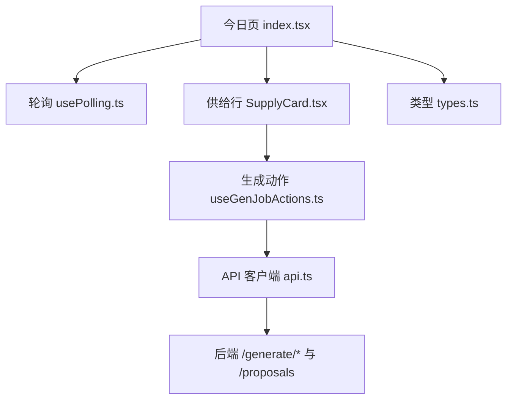
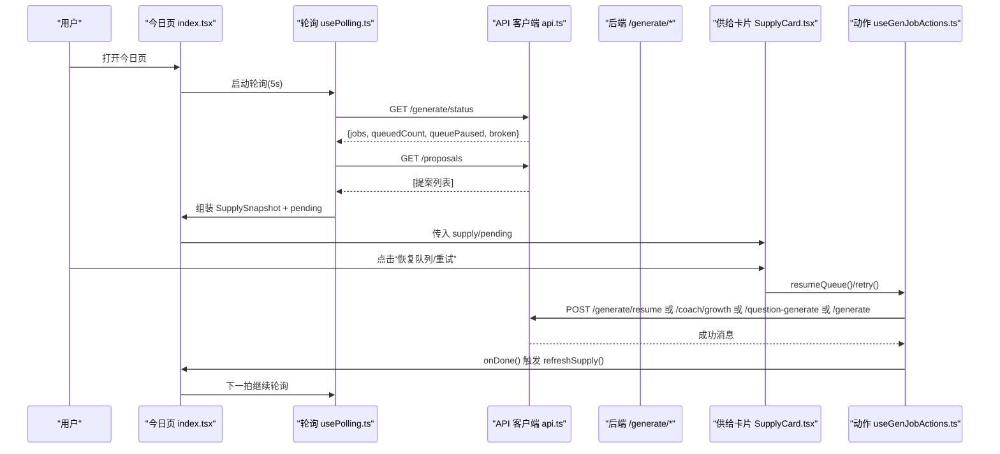
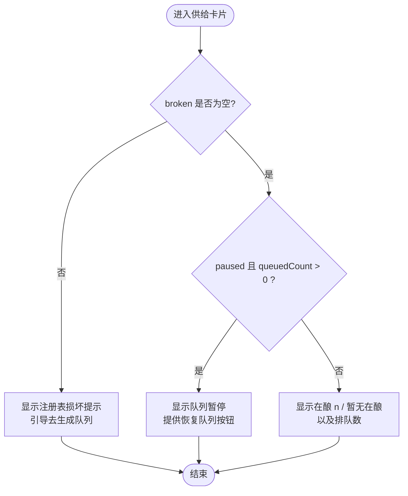
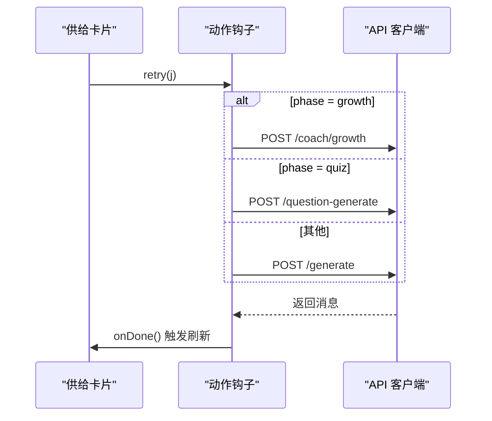
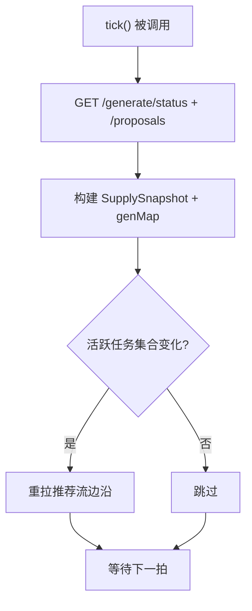
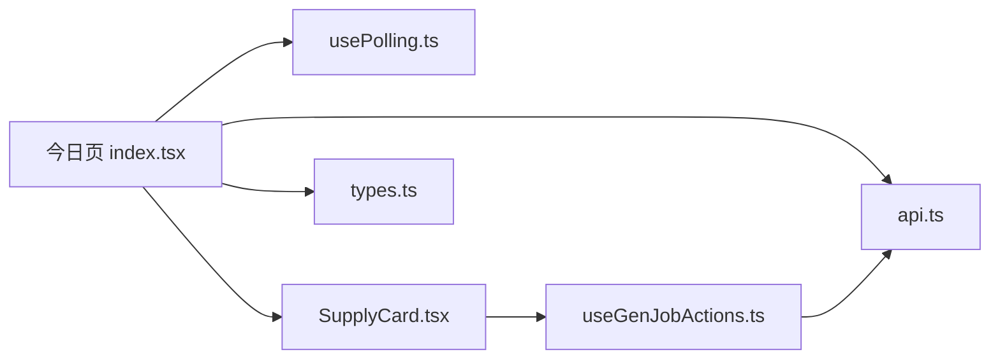

# 供给卡片

<cite>
**本文引用的文件**
- [SupplyCard.tsx](file://ui/src/pages/TodayPage/SupplyCard.tsx)
- [useGenJobActions.ts](file://ui/src/hooks/useGenJobActions.ts)
- [index.tsx（今日页）](file://ui/src/pages/TodayPage/index.tsx)
- [usePolling.ts](file://ui/src/hooks/usePolling.ts)
- [api.ts](file://ui/src/api.ts)
- [types.ts](file://ui/src/types.ts)
</cite>

## 目录
1. [简介](#简介)
2. [项目结构](#项目结构)
3. [核心组件与数据结构](#核心组件与数据结构)
4. [架构总览](#架构总览)
5. [详细组件分析](#详细组件分析)
6. [依赖关系分析](#依赖关系分析)
7. [性能考量](#性能考量)
8. [故障排查指南](#故障排查指南)
9. [结论](#结论)
10. [附录：扩展方法](#附录扩展方法)

## 简介
本文件面向“供给卡片”这一用户界面与数据流，系统性说明课程供给状态展示、待审闸门计数、生成队列监控、恢复与重试机制、边沿检测与轮询刷新，以及如何扩展自定义供给类型、状态指示器样式与通知机制。目标是让读者在不深入源码的情况下也能理解并安全地扩展该功能。

## 项目结构
供给卡片由今日页聚合渲染，数据通过统一的轮询缝获取，动作通过共享的生成任务动作钩子执行，后端接口集中在 API 客户端中。关键文件职责如下：
- 今日页：负责轮询、边沿检测、组合供给快照与闸门计数，并在推荐流中映射生成进度。
- 供给卡片：纯呈现+动作触发，显示在酿/停摆/失败等状态，提供恢复与重试入口。
- 生成任务动作钩子：统一实现失败重试与队列恢复，屏蔽路由差异。
- 轮询钩子：管理页签保活、定时节拍与切回补取。
- API 客户端：封装 /generate/status、/generate/resume、/proposals 等接口。
- 类型定义：从宿主模块派生生成状态类型，避免手工镜像。

图表来源
- [index.tsx（今日页）:74-118](file://ui/src/pages/TodayPage/index.tsx#L74-L118)
- [usePolling.ts:15-46](file://ui/src/hooks/usePolling.ts#L15-L46)
- [SupplyCard.tsx:51-131](file://ui/src/pages/TodayPage/SupplyCard.tsx#L51-L131)
- [useGenJobActions.ts:26-63](file://ui/src/hooks/useGenJobActions.ts#L26-L63)
- [api.ts:205-210](file://ui/src/api.ts#L205-L210)

章节来源
- [index.tsx（今日页）:1-118](file://ui/src/pages/TodayPage/index.tsx#L1-L118)
- [usePolling.ts:1-48](file://ui/src/hooks/usePolling.ts#L1-L48)
- [SupplyCard.tsx:1-132](file://ui/src/pages/TodayPage/SupplyCard.tsx#L1-L132)
- [useGenJobActions.ts:1-64](file://ui/src/hooks/useGenJobActions.ts#L1-L64)
- [api.ts:205-210](file://ui/src/api.ts#L205-L210)
- [types.ts:56-59](file://ui/src/types.ts#L56-L59)

## 核心组件与数据结构
- SupplySnapshot（供给快照）
  - running：当前运行或取消中的任务列表
  - queuedCount：排队任务数量
  - paused：是否处于“停摆”（重启后队列暂停，不自动开跑）
  - broken：任务注册表损坏原因（硬停）
  - failed：失败或部分完成的任务列表
- GenJobItem（生成任务项）
  - key、course、node、phase、status、progress 等字段，来源于宿主 generationStatus 返回类型
- RecGenState（推荐卡上的生成进度态）
  - state：queued 或 running
  - progress：逐节进度 done/total/current

这些结构由今日页从 /generate/status 响应拼装为 SupplySnapshot，并用于供给卡片与推荐卡的进度展示。

章节来源
- [SupplyCard.tsx:17-27](file://ui/src/pages/TodayPage/SupplyCard.tsx#L17-L27)
- [types.ts:56-59](file://ui/src/types.ts#L56-L59)
- [index.tsx（今日页）:78-103](file://ui/src/pages/TodayPage/index.tsx#L78-L103)
- [TodayCards.tsx:106-111](file://ui/src/pages/TodayPage/TodayCards.tsx#L106-L111)

## 架构总览
供给卡片的数据流遵循“轮询 → 边沿检测 → 状态更新 → 动作 → 立即刷新”的闭环：
- 每 5 秒调用 /generate/status 与 /proposals，得到任务注册表与待审提案数
- 对比活跃任务集合变化（边沿），若发生终态变更则重拉推荐流
- 供给卡片根据 paused/broken/failed 等分支渲染不同提示与操作
- 恢复/重试动作通过共享钩子调用对应后端接口，成功后立即 onRefresh

图表来源
- [index.tsx（今日页）:74-118](file://ui/src/pages/TodayPage/index.tsx#L74-L118)
- [usePolling.ts:15-46](file://ui/src/hooks/usePolling.ts#L15-L46)
- [api.ts:205-210](file://ui/src/api.ts#L205-L210)
- [useGenJobActions.ts:26-63](file://ui/src/hooks/useGenJobActions.ts#L26-L63)
- [SupplyCard.tsx:51-131](file://ui/src/pages/TodayPage/SupplyCard.tsx#L51-L131)

## 详细组件分析

### 供给行与供给卡片
- SupplyRow：将 SupplyCard 与 GateCard（待审闸门计数）并排展示，构成今日页“六件之二”。
- SupplyCard：
  - 在酿：显示 running 数量与提示文案
  - 停摆：当 paused=true 且存在排队任务时，显示“队列暂停”，并提供“恢复队列”按钮
  - 失败：列出 failed 任务，支持按 phase 区分语义的重试
  - 注册表损坏：显示 broken 原因并引导至生成队列修复
- GateCard：展示待审提案数，点击跳转收件箱；0 条时给出中性提示

图表来源
- [SupplyCard.tsx:68-91](file://ui/src/pages/TodayPage/SupplyCard.tsx#L68-L91)

章节来源
- [SupplyCard.tsx:29-131](file://ui/src/pages/TodayPage/SupplyCard.tsx#L29-L131)

### 生成任务动作（恢复与重试）
- retry：
  - growth：走教练生长一步（显式重新裁决）
  - quiz：入队出题
  - 其他内容生成：断点续跑（已就绪的节不重来）
- resumeQueue：恢复全局队列，遗留排队任务按序执行
- busyKey：防止重复点击，按钮 loading 反馈

图表来源
- [useGenJobActions.ts:26-63](file://ui/src/hooks/useGenJobActions.ts#L26-L63)
- [api.ts:314-318](file://ui/src/api.ts#L314-L318)
- [api.ts:198-210](file://ui/src/api.ts#L198-L210)

章节来源
- [useGenJobActions.ts:1-64](file://ui/src/hooks/useGenJobActions.ts#L1-L64)
- [api.ts:198-210](file://ui/src/api.ts#L198-L210)

### 轮询刷新与边沿检测
- 轮询：使用 usePolling，每 5 秒调用 refreshSupply
- refreshSupply：
  - 拉取 /generate/status 与 /proposals
  - 计算 activeKeys（running/cancelling 的任务键集合）
  - 与上一拍 activeKeysRef 比较，若出现任务终态退出（边沿），则重拉推荐流
  - 设置 runningJobs、queuedJobs、genMap、supply、pendingProps
- 切回页签：通过 learnhub:tab 事件立即补取，避免错过边沿

图表来源
- [index.tsx（今日页）:74-118](file://ui/src/pages/TodayPage/index.tsx#L74-L118)
- [usePolling.ts:15-46](file://ui/src/hooks/usePolling.ts#L15-L46)

章节来源
- [index.tsx（今日页）:74-118](file://ui/src/pages/TodayPage/index.tsx#L74-L118)
- [usePolling.ts:1-48](file://ui/src/hooks/usePolling.ts#L1-L48)

### 推荐卡上的生成进度映射
- 将 jobs 中 running/cancelling 的任务映射到 RecGenState，供推荐卡显示“生成中/排队中”及逐节进度
- 未生成节点可内联触发生成正文，生成中禁用打开学习

章节来源
- [index.tsx（今日页）:81-96](file://ui/src/pages/TodayPage/index.tsx#L81-L96)
- [TodayCards.tsx:106-118](file://ui/src/pages/TodayPage/TodayCards.tsx#L106-L118)

## 依赖关系分析
- 今日页依赖：
  - usePolling：页签保活与定时节拍
  - api：/generate/status、/generate/resume、/proposals、/generate、/question-generate、/coach/growth
  - SupplyRow/SupplyCard/GateCard：UI 呈现与交互
  - useGenJobActions：统一动作实现
- 类型依赖：
  - GenStatusDoc/GenJobItem 从宿主 generationStatus 派生，保证前后端契约一致

图表来源
- [index.tsx（今日页）:74-118](file://ui/src/pages/TodayPage/index.tsx#L74-L118)
- [useGenJobActions.ts:26-63](file://ui/src/hooks/useGenJobActions.ts#L26-L63)
- [api.ts:205-210](file://ui/src/api.ts#L205-L210)
- [types.ts:56-59](file://ui/src/types.ts#L56-L59)

章节来源
- [index.tsx（今日页）:74-118](file://ui/src/pages/TodayPage/index.tsx#L74-L118)
- [useGenJobActions.ts:1-64](file://ui/src/hooks/useGenJobActions.ts#L1-L64)
- [api.ts:205-210](file://ui/src/api.ts#L205-L210)
- [types.ts:56-59](file://ui/src/types.ts#L56-L59)

## 性能考量
- 轮询间隔：默认 5 秒，适合后台任务状态监控；非激活页签仅保留定时器，减少请求
- 边沿检测：仅在活跃任务集合发生变化时重拉推荐流，避免无意义刷新
- 动作后立即刷新：onDone 回调触发 refreshSupply，缩短用户感知延迟
- 推荐卡进度：仅对 running 任务携带 progress，降低不必要的数据传输

[本节为通用指导，无需特定文件引用]

## 故障排查指南
- 任务注册表损坏（broken 非空）
  - 现象：供给卡片显示“任务注册表损坏，队列已停止接受新任务”，并引导至生成队列
  - 处理：前往生成队列进行修复；供给卡片仅提供指引
- 队列停摆（paused=true）
  - 现象：显示“队列暂停”，有排队任务不会自动开跑
  - 处理：点击“恢复队列”，调用 /generate/resume 恢复整条队列
- 失败/部分完成
  - 现象：失败行显示“失败/部分完成”，带 phase 标签与重试按钮
  - 处理：根据 phase 选择重试语义（growth=重新裁决；quiz=重新入队；内容=断点续跑）
- 轮询失败
  - 现象：供给快照置空，推荐卡不显示生成进度
  - 处理：检查网络与后端 /generate/status、/proposals；页面会降级为空态

章节来源
- [SupplyCard.tsx:68-106](file://ui/src/pages/TodayPage/SupplyCard.tsx#L68-L106)
- [useGenJobActions.ts:26-63](file://ui/src/hooks/useGenJobActions.ts#L26-L63)
- [index.tsx（今日页）:78-118](file://ui/src/pages/TodayPage/index.tsx#L78-L118)

## 结论
供给卡片以最小侵入的方式整合了课程供给状态、待审闸门计数与生成队列监控，通过轮询与边沿检测确保信息及时准确，并通过共享动作钩子统一恢复与重试流程。其设计兼顾可读性与可操作性，便于后续扩展新的供给类型与状态指示。

[本节为总结性内容，无需特定文件引用]

## 附录：扩展方法
- 自定义供给类型
  - 在 SupplySnapshot 中添加新字段（如 customState），并在 SupplyCard 中增加相应分支渲染
  - 在 refreshSupply 中从 /generate/status 或其他数据源解析新字段
  - 如需新动作，可在 useGenJobActions 中新增方法并暴露给 SupplyCard
- 状态指示器样式
  - 复用 GEN_PHASE_META 的 label/color 模式，为新 phase 添加展示元数据
  - 在失败行或推荐卡上通过 Tag/Progress 展示颜色与文本
- 通知机制
  - 使用 Message.success/info/warning/error 反馈结果
  - 对于队列恢复与重试，已在动作钩子中内置提示；可按需扩展更丰富的通知（如持久化日志）

章节来源
- [SupplyCard.tsx:17-27](file://ui/src/pages/TodayPage/SupplyCard.tsx#L17-L27)
- [useGenJobActions.ts:12-24](file://ui/src/hooks/useGenJobActions.ts#L12-L24)
- [index.tsx（今日页）:78-118](file://ui/src/pages/TodayPage/index.tsx#L78-L118)