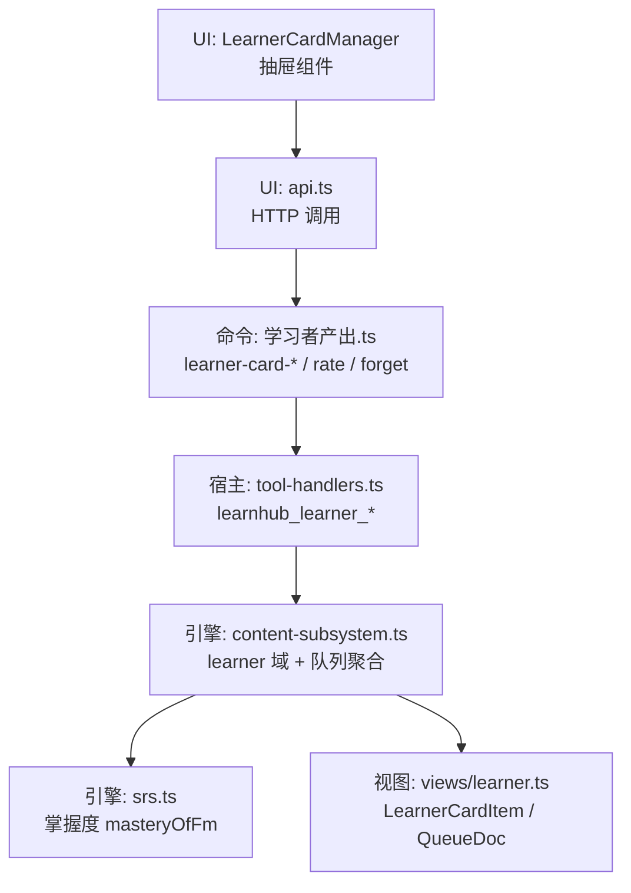
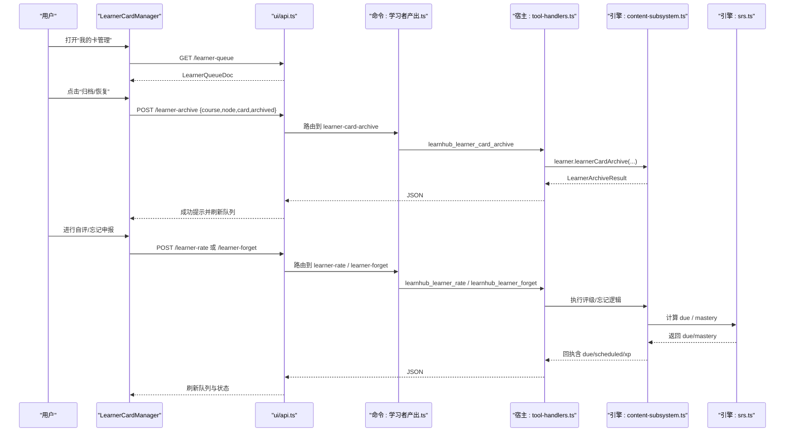
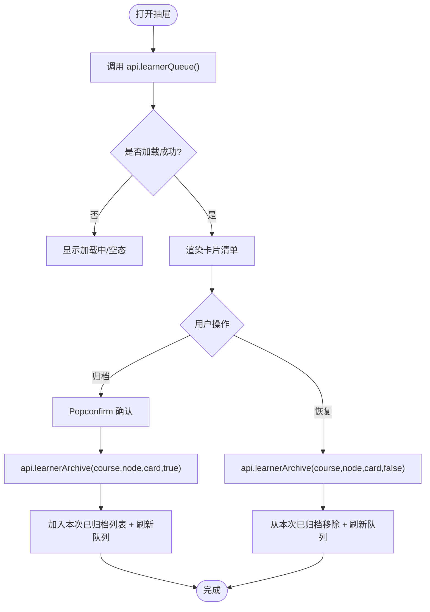
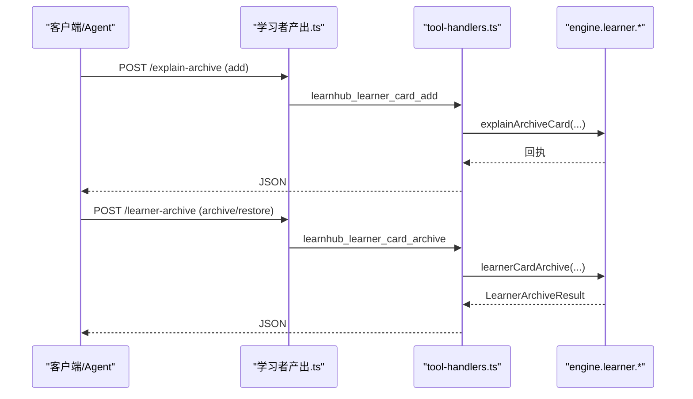
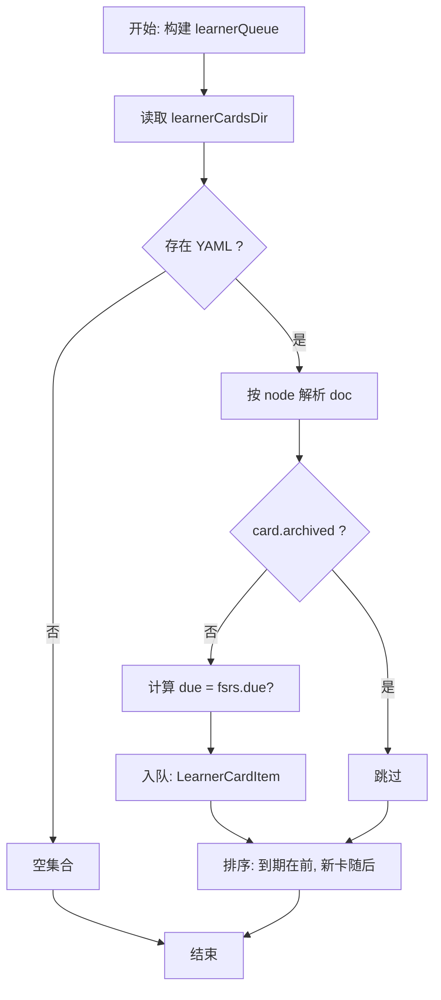
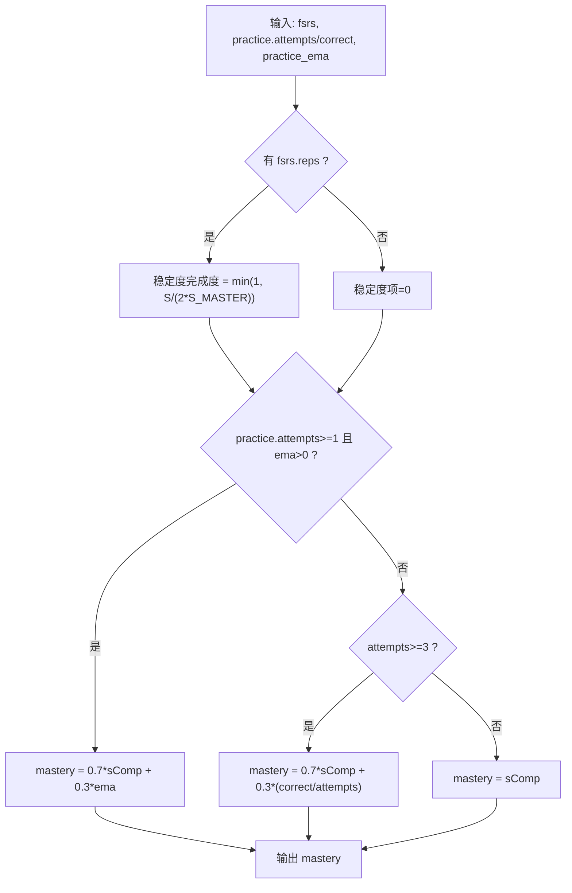
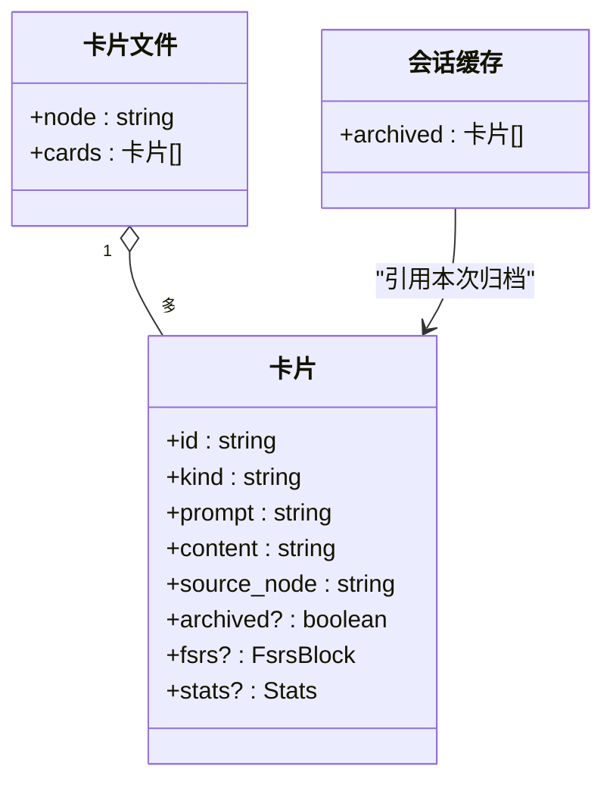
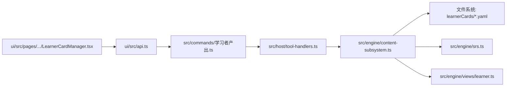

# 学习者卡片管理

<cite>
**本文引用的文件**
- [LearnerCardManager.tsx](file://ui/src/pages/TodayPage/LearnerCardManager.tsx)
- [api.ts](file://ui/src/api.ts)
- [学习者产出.ts](file://src/commands/学习者产出.ts)
- [tool-handlers.ts](file://src/host/tool-handlers.ts)
- [content-subsystem.ts](file://src/engine/content-subsystem.ts)
- [views/learner.ts](file://src/engine/views/learner.ts)
- [srs.ts](file://src/engine/srs.ts)
- [views.ts](file://src/engine/views.ts)
- [types.ts](file://src/engine/types.ts)
- [error-cards.ts](file://src/engine/error-cards.ts)
- [learner-cards.test.ts](file://tests/learner-cards.test.ts)
</cite>

## 目录
1. [简介](#简介)
2. [项目结构](#项目结构)
3. [核心组件](#核心组件)
4. [架构总览](#架构总览)
5. [详细组件分析](#详细组件分析)
6. [依赖关系分析](#依赖关系分析)
7. [性能考虑](#性能考虑)
8. [故障排查指南](#故障排查指南)
9. [结论](#结论)
10. [附录](#附录)

## 简介
本文件面向“学习者卡片管理器”（E1「我的卡」）的完整技术文档，聚焦 LearnerCardManager 组件及其在引擎侧的实现。内容涵盖：
- 学习者卡片的创建、编辑、删除与管理操作
- 卡片与知识图谱节点的关联关系
- 掌握度评估的显示与更新机制
- 归档功能的实现原理、最近归档记录的维护与本地存储策略
- 批量操作、导入导出能力与自定义卡片类型的扩展方法

## 项目结构
学习者卡片管理涉及 UI 层、命令通道、宿主工具处理器与引擎子系统：
- UI 层：学习页内的“我的卡管理”抽屉组件负责展示队列、触发归档/恢复
- 命令通道：定义 learner-card-add / learner-card-archive / learner-rate / learner-forget 等命令
- 宿主工具：将面板请求转发到引擎 learner 域
- 引擎：内容子系统聚合复习队列；SRS 提供掌握度计算；视图类型统一对外暴露

**图示来源**
- [LearnerCardManager.tsx:1-91](file://ui/src/pages/TodayPage/LearnerCardManager.tsx#L1-L91)
- [api.ts:137-152](file://ui/src/api.ts#L137-L152)
- [学习者产出.ts:434-500](file://src/commands/学习者产出.ts#L434-L500)
- [tool-handlers.ts:179-194](file://src/host/tool-handlers.ts#L179-L194)
- [content-subsystem.ts:558-585](file://src/engine/content-subsystem.ts#L558-L585)
- [srs.ts:165-183](file://src/engine/srs.ts#L165-L183)
- [views/learner.ts:98-117](file://src/engine/views/learner.ts#L98-L117)

**章节来源**
- [LearnerCardManager.tsx:1-91](file://ui/src/pages/TodayPage/LearnerCardManager.tsx#L1-L91)
- [api.ts:137-152](file://ui/src/api.ts#L137-L152)
- [学习者产出.ts:434-500](file://src/commands/学习者产出.ts#L434-L500)
- [tool-handlers.ts:179-194](file://src/host/tool-handlers.ts#L179-L194)
- [content-subsystem.ts:558-585](file://src/engine/content-subsystem.ts#L558-L585)
- [srs.ts:165-183](file://src/engine/srs.ts#L165-L183)
- [views/learner.ts:98-117](file://src/engine/views/learner.ts#L98-L117)

## 核心组件
- LearnerCardManager（UI 抽屉）
  - 加载 learnerQueue，展示未归档卡片清单
  - 支持单卡归档/恢复，维护本次会话的“已归档可恢复”列表
  - 通过 api.learnerArchive 调用后端接口
- 命令与工具
  - learner-card-add：存档学习者自述为 E1 卡片（recall_cue / cloze_rewrite），零 XP、不写回掌握度或节点调度
  - learner-card-archive：归档/恢复一张 E1 卡片（管理面，canonical 零写入）
  - learner-rate / learner-forget：自评结算或忘记申报，走跨课程复习队列，按日限制推进
- 引擎内容子系统
  - 构建 learnerQueue：读取课程下 learnerCards 目录 YAML，过滤 archived，合并到期/新卡顺序
  - 与 FSRS 默认参数通道联动，仅影响队列与无绑定 XP
- 视图与类型
  - LearnerCardItem / LearnerQueueDoc：卡片条目与全量清单
  - 掌握度：masteryOfFm 基于 FSRS 稳定度与练习证据 EMA 派生，不落盘

**章节来源**
- [LearnerCardManager.tsx:12-47](file://ui/src/pages/TodayPage/LearnerCardManager.tsx#L12-L47)
- [学习者产出.ts:434-500](file://src/commands/学习者产出.ts#L434-L500)
- [content-subsystem.ts:558-585](file://src/engine/content-subsystem.ts#L558-L585)
- [views/learner.ts:98-117](file://src/engine/views/learner.ts#L98-L117)
- [srs.ts:165-183](file://src/engine/srs.ts#L165-L183)

## 架构总览
下图展示了从 UI 到引擎的数据流与控制流，包括归档、自评、忘记申报与队列聚合。

**图示来源**
- [LearnerCardManager.tsx:23-47](file://ui/src/pages/TodayPage/LearnerCardManager.tsx#L23-L47)
- [api.ts:137-152](file://ui/src/api.ts#L137-L152)
- [学习者产出.ts:434-500](file://src/commands/学习者产出.ts#L434-L500)
- [tool-handlers.ts:179-194](file://src/host/tool-handlers.ts#L179-L194)
- [content-subsystem.ts:558-585](file://src/engine/content-subsystem.ts#L558-L585)
- [srs.ts:165-183](file://src/engine/srs.ts#L165-L183)

## 详细组件分析

### 组件：LearnerCardManager（UI 抽屉）
职责
- 打开时拉取 learnerQueue，渲染未归档卡片清单
- 对单卡执行归档/恢复，维护本次会话的“已归档可恢复”列表
- 通过 api.learnerArchive 调用后端，成功后刷新队列与父级回调

交互要点
- 使用 Popconfirm 二次确认归档
- 消息提示成功/失败，错误信息经 errorMessage 处理
- 归档后卡片不再进入“我的卡”队列，但历史保留在卡文件中

**图示来源**
- [LearnerCardManager.tsx:23-47](file://ui/src/pages/TodayPage/LearnerCardManager.tsx#L23-L47)
- [api.ts:137-152](file://ui/src/api.ts#L137-L152)

**章节来源**
- [LearnerCardManager.tsx:12-47](file://ui/src/pages/TodayPage/LearnerCardManager.tsx#L12-L47)

### 组件：命令与工具通道（学习者产出.ts / tool-handlers.ts）
职责
- 暴露 learner-card-add / learner-card-archive / learner-rate / learner-forget 等命令
- 通过 agent 工具与 panel 路由双通道对外提供服务
- 宿主工具处理器校验参数并转发至引擎 learner 域

关键行为
- learner-card-add：创建 E1 卡片，零 XP，不写回掌握度或节点调度；同一节点重复内容拒绝
- learner-card-archive：归档/恢复单卡，canonical 零写入
- learner-rate / learner-forget：每日每卡一次推进；忘记申报 rating=1，XP=0

**图示来源**
- [学习者产出.ts:434-500](file://src/commands/学习者产出.ts#L434-L500)
- [tool-handlers.ts:179-194](file://src/host/tool-handlers.ts#L179-L194)

**章节来源**
- [学习者产出.ts:434-500](file://src/commands/学习者产出.ts#L434-L500)
- [tool-handlers.ts:179-194](file://src/host/tool-handlers.ts#L179-L194)

### 组件：引擎内容子系统（content-subsystem.ts）
职责
- 聚合复习队列：扫描课程 learnerCards 目录 YAML，过滤 archived，合并到期/新卡顺序
- 与 FSRS 默认参数通道联动，仅影响队列与无绑定 XP，不污染题库/节点调度
- 构建 LearnerCardItem 视图项（prompt/content/due/attempts/source_section）

数据流
- 读取 learnerCardsDir -> 解析每个 node 的 doc -> 遍历 cards -> 过滤 archived -> 计算 due（fsrs.due）-> 入队

**图示来源**
- [content-subsystem.ts:558-585](file://src/engine/content-subsystem.ts#L558-L585)

**章节来源**
- [content-subsystem.ts:558-585](file://src/engine/content-subsystem.ts#L558-L585)

### 组件：视图与类型（views/learner.ts / types.ts）
- LearnerCardKind：'recall_cue' | 'cloze_rewrite' | 'self_explain'
- LearnerCardItem：包含 course/node/id/kind/prompt/content/source_section/due/attempts
- LearnerQueueDoc：date/total/due_count/cards
- 结果类型：LearnerRateResult / LearnerForgetResult / LearnerArchiveResult

这些类型作为 UI 与引擎之间的契约，确保队列呈现与结算回执一致。

**章节来源**
- [views/learner.ts:98-117](file://src/engine/views/learner.ts#L98-L117)
- [views.ts:160-204](file://src/engine/views.ts#L160-L204)
- [types.ts:325-329](file://src/engine/types.ts#L325-L329)

### 组件：掌握度评估（srs.ts）
- masteryValue：0.7·稳定度完成度 + 0.3·练习证据（EMA 或正确率）
- masteryOfFm：唯一 canonical 入口，读 frontmatter 派生，不落盘
- 对 E1 卡片：自评通过产生无绑定 XP，但不改变节点掌握度；卡片自身 FSRS 块随评级/忘记推进

**图示来源**
- [srs.ts:165-183](file://src/engine/srs.ts#L165-L183)

**章节来源**
- [srs.ts:165-183](file://src/engine/srs.ts#L165-L183)

### 组件：归档与本地存储策略
- 归档语义：archived=true 使卡片离开 learnerQueue，但历史保留在卡文件中；恢复则移除 archived 标记
- 本地存储：卡片以 YAML 形式存放于课程 learnerCards 目录，文件名对应 node 名
- 最近归档记录：UI 维护本次会话的“已归档可恢复”列表，便于快速恢复；持久化由引擎写入卡片文件

**图示来源**
- [content-subsystem.ts:558-585](file://src/engine/content-subsystem.ts#L558-L585)
- [LearnerCardManager.tsx:30-47](file://ui/src/pages/TodayPage/LearnerCardManager.tsx#L30-L47)

**章节来源**
- [content-subsystem.ts:558-585](file://src/engine/content-subsystem.ts#L558-L585)
- [LearnerCardManager.tsx:30-47](file://ui/src/pages/TodayPage/LearnerCardManager.tsx#L30-L47)

### 组件：与知识图谱节点的关联
- 卡片通过 source_node 字段关联到课程节点，用于定位与上下文展示
- 内容子系统在构建队列时按 node 过滤与分组，保证卡片与节点一一对应
- 节点掌握度由 srs.masteryOfFm 派生，不受 E1 卡片直接修改

**章节来源**
- [views/learner.ts:98-117](file://src/engine/views/learner.ts#L98-L117)
- [content-subsystem.ts:558-585](file://src/engine/content-subsystem.ts#L558-L585)
- [srs.ts:165-183](file://src/engine/srs.ts#L165-L183)

### 组件：批量操作、导入导出与扩展
- 批量操作：当前命令以单卡为主（添加/归档/恢复/评级/忘记）。批量可通过循环调用命令实现
- 导入导出：卡片以 YAML 文件形式落盘，可直接复制/迁移；建议通过脚本批量读写 learnerCards 目录
- 自定义卡片类型：LearnerCardKind 白名单位于 types.ts；新增类型需：
  - 扩展 LEARNER_CARD_KINDS
  - 在 UI 中增加 kindLabel 映射
  - 在验证器 validateLearnerCards 中补充规则（长度/挖空/控制字符等）
  - 在内容子系统中确保新类型能正确入队与展示

注意：错误对比卡（C-3）与 E1 不同，其归档逻辑参考 error-cards.ts 的 archiveCard 实现。

**章节来源**
- [types.ts:325-329](file://src/engine/types.ts#L325-L329)
- [learner-cards.test.ts:68-108](file://tests/learner-cards.test.ts#L68-L108)
- [error-cards.ts:339-351](file://src/engine/error-cards.ts#L339-L351)
- [LearnerCardManager.tsx:49-49](file://ui/src/pages/TodayPage/LearnerCardManager.tsx#L49-L49)

## 依赖关系分析
- UI 依赖 ui/api.ts 提供的 HTTP 封装
- 命令层依赖宿主工具处理器进行参数校验与转发
- 引擎内容子系统依赖 learnerCards 文件系统与 FSRS 调度
- 视图类型解耦 UI 与引擎，避免运行时模块耦合

**图示来源**
- [LearnerCardManager.tsx:1-91](file://ui/src/pages/TodayPage/LearnerCardManager.tsx#L1-L91)
- [api.ts:137-152](file://ui/src/api.ts#L137-L152)
- [学习者产出.ts:434-500](file://src/commands/学习者产出.ts#L434-L500)
- [tool-handlers.ts:179-194](file://src/host/tool-handlers.ts#L179-L194)
- [content-subsystem.ts:558-585](file://src/engine/content-subsystem.ts#L558-L585)
- [srs.ts:165-183](file://src/engine/srs.ts#L165-L183)
- [views/learner.ts:98-117](file://src/engine/views/learner.ts#L98-L117)

**章节来源**
- [LearnerCardManager.tsx:1-91](file://ui/src/pages/TodayPage/LearnerCardManager.tsx#L1-L91)
- [api.ts:137-152](file://ui/src/api.ts#L137-L152)
- [学习者产出.ts:434-500](file://src/commands/学习者产出.ts#L434-L500)
- [tool-handlers.ts:179-194](file://src/host/tool-handlers.ts#L179-L194)
- [content-subsystem.ts:558-585](file://src/engine/content-subsystem.ts#L558-L585)
- [srs.ts:165-183](file://src/engine/srs.ts#L165-L183)
- [views/learner.ts:98-117](file://src/engine/views/learner.ts#L98-L117)

## 性能考虑
- 队列构建：按课程 learnerCards 目录扫描，YAML 数量通常较小；若课程规模大，建议分页或按需加载
- 归档/恢复：单卡操作，O(1) 文件写入；批量场景建议合并写入以减少 IO
- 掌握度计算：masteryOfFm 为纯函数，复杂度 O(1)；仅在评级/忘记后需要重新计算
- UI 渲染：抽屉打开时一次性加载队列；频繁切换建议缓存

[本节为通用指导，无需特定文件来源]

## 故障排查指南
常见问题与定位
- 归档失败：检查 archived 参数是否为布尔值；确认 card id 存在
- 队列为空：确认 learnerCards 目录下是否存在 YAML；检查卡片是否被 archived
- 重复内容：同一节点重复内容会被拒绝；先恢复再修改
- 掌握度异常：E1 卡片不影响节点掌握度；查看 FSRS 块与练习证据

参考实现与断言
- 参数校验与错误信息：tool-handlers 中对 archived 显式校验
- 队列构建与过滤：content-subsystem 中 archived 过滤与 due 计算
- 卡片 schema 门禁：validateLearnerCards 对 kind/长度/挖空/控制字符等进行校验

**章节来源**
- [tool-handlers.ts:179-194](file://src/host/tool-handlers.ts#L179-L194)
- [content-subsystem.ts:558-585](file://src/engine/content-subsystem.ts#L558-L585)
- [learner-cards.test.ts:68-108](file://tests/learner-cards.test.ts#L68-L108)

## 结论
学习者卡片管理器围绕 E1「我的卡」构建了完整的创建、管理与复习闭环：
- UI 提供直观的归档/恢复与队列浏览
- 命令与工具通道保障安全与一致性
- 引擎内容子系统负责队列聚合与 FSRS 联动
- 掌握度采用唯一 canonical 派生口径，避免歧义
- 归档与本地存储策略清晰，支持会话内快速恢复与持久化留痕
- 扩展点明确，便于未来引入批量操作、导入导出与自定义卡片类型

[本节为总结性内容，无需特定文件来源]

## 附录
- 相关命令路径
  - 添加卡片：POST /explain-archive
  - 归档/恢复：POST /learner-archive
  - 自评结算：POST /learner-rate
  - 忘记申报：POST /learner-forget
- 视图类型
  - LearnerCardItem / LearnerQueueDoc
  - LearnerRateResult / LearnerForgetResult / LearnerArchiveResult

[本节为附加信息，无需特定文件来源]