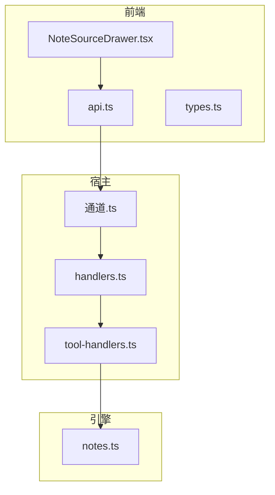
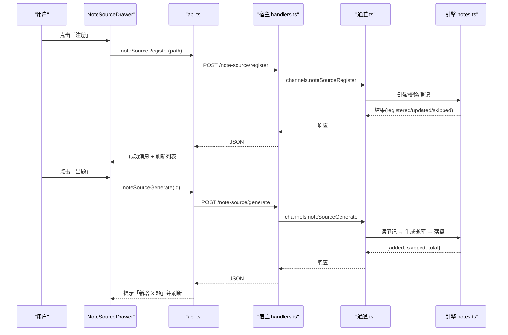
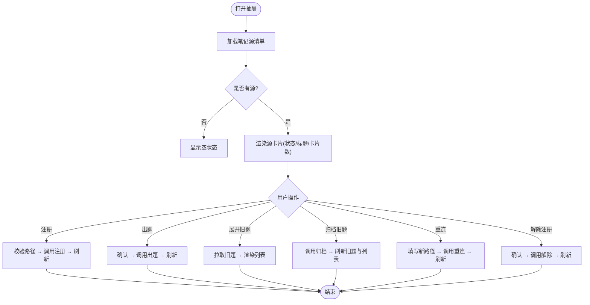
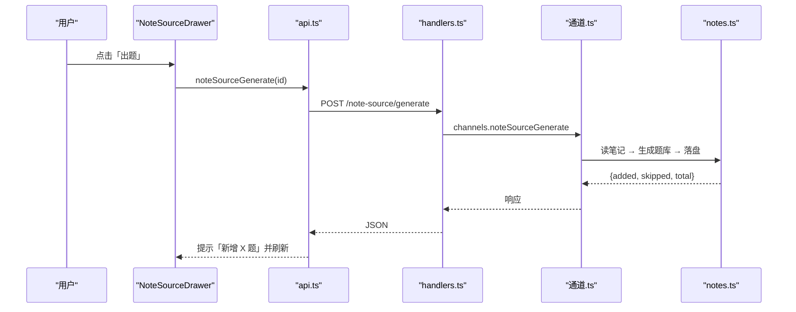
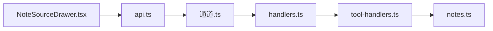

# 笔记源管理抽屉

<cite>
**本文引用的文件**
- [NoteSourceDrawer.tsx](file://ui/src/pages/TodayPage/NoteSourceDrawer.tsx)
- [api.ts](file://ui/src/api.ts)
- [types.ts](file://ui/src/types.ts)
- [通道.ts](file://src/commands/通道.ts)
- [notes.ts](file://src/engine/notes.ts)
- [handlers.ts](file://src/host/handlers.ts)
- [tool-handlers.ts](file://src/host/tool-handlers.ts)
- [note-source.test.ts](file://tests/note-source.test.ts)
</cite>

## 目录
1. [简介](#简介)
2. [项目结构](#项目结构)
3. [核心组件](#核心组件)
4. [架构总览](#架构总览)
5. [详细组件分析](#详细组件分析)
6. [依赖关系分析](#依赖关系分析)
7. [性能考量](#性能考量)
8. [故障排查指南](#故障排查指南)
9. [结论](#结论)
10. [附录](#附录)

## 简介
本章节面向“笔记源管理抽屉”（NoteSourceDrawer）的完整实现与使用。该抽屉用于在“学习页”中管理个人笔记到复习题的映射：注册笔记或文件夹、按当前内容重新出题、归档旧题、重连漂移/缺失路径，并展示状态监控（正常、漂移、缺失、镜像不一致）。其前端通过统一的 API 客户端与宿主服务交互，后端将请求路由至引擎通道，完成笔记文件读取、frontmatter 校验、题库生成与归档等逻辑。

## 项目结构
- 前端 UI 层
  - NoteSourceDrawer.tsx：抽屉组件，负责用户交互、状态管理与消息提示。
  - api.ts：统一 HTTP 客户端，封装所有面板到宿主的接口调用。
  - types.ts：类型定义，集中 re-export 引擎视图类型（如 NoteSourceDoc、QuestionItem 等）。
- 宿主与服务层
  - 通道.ts：命令注册表，声明笔记源相关命令及路由绑定（/note-sources、/note-source/register 等）。
  - handlers.ts：HTTP 处理器，将 /note-source/generate 等路由转发给引擎通道。
  - tool-handlers.ts：工具面处理器，暴露 agent 可消费的 noteSourceList/noteSourceGenerate 等方法。
- 引擎与数据层
  - notes.ts：课程笔记 frontmatter 读写、解析与校验；提供 load/save/update/stateMap 等能力。
- 测试
  - note-source.test.ts：覆盖注册、出题、解除注册、重连、缺失场景等关键流程。

图表来源
- [NoteSourceDrawer.tsx:1-212](file://ui/src/pages/TodayPage/NoteSourceDrawer.tsx#L1-L212)
- [api.ts:140-170](file://ui/src/api.ts#L140-L170)
- [通道.ts:114-227](file://src/commands/通道.ts#L114-L227)
- [handlers.ts:440-460](file://src/host/handlers.ts#L440-L460)
- [tool-handlers.ts:240-260](file://src/host/tool-handlers.ts#L240-L260)
- [notes.ts:65-74](file://src/engine/notes.ts#L65-L74)

章节来源
- [NoteSourceDrawer.tsx:1-212](file://ui/src/pages/TodayPage/NoteSourceDrawer.tsx#L1-L212)
- [api.ts:140-170](file://ui/src/api.ts#L140-L170)
- [通道.ts:114-227](file://src/commands/通道.ts#L114-L227)

## 核心组件
- NoteSourceDrawer 组件
  - 功能：列出已注册的笔记源、显示状态标签（正常/漂移/缺失/镜象不一致）、注册新源、按当前内容重新出题、展开旧题清单并逐题归档、对缺失源进行路径重连。
  - 状态：doc（源清单）、path（输入路径）、busy（操作忙态）、expanded（展开的源 id）、oldQs（旧题列表）、relinkPaths（缺失源的重连路径缓存）。
  - 交互：注册、出题、解除注册、归档旧题、重连路径。
- API 客户端
  - 提供 noteSources、noteSourceRegister、noteSourceUnregister、noteSourceRelink、noteSourceGenerate、questions、questionArchive 等方法，统一走 /learnhub/api/*。
- 类型系统
  - 集中 re-export 引擎视图类型（如 NoteSourceDoc、NoteSourceItem、QuestionItem），保证前后端类型一致。

章节来源
- [NoteSourceDrawer.tsx:12-212](file://ui/src/pages/TodayPage/NoteSourceDrawer.tsx#L12-L212)
- [api.ts:153-166](file://ui/src/api.ts#L153-L166)
- [types.ts:34-52](file://ui/src/types.ts#L34-L52)

## 架构总览
笔记源管理的数据流从 UI 发起，经 API 客户端到宿主路由，再进入引擎通道，最终访问文件系统与题库存储。

图表来源
- [NoteSourceDrawer.tsx:56-84](file://ui/src/pages/TodayPage/NoteSourceDrawer.tsx#L56-L84)
- [api.ts:155-166](file://ui/src/api.ts#L155-L166)
- [通道.ts:134-166](file://src/commands/通道.ts#L134-L166)
- [handlers.ts:440-460](file://src/host/handlers.ts#L440-L460)
- [notes.ts:65-74](file://src/engine/notes.ts#L65-L74)

## 详细组件分析

### 组件：NoteSourceDrawer
- 职责
  - 加载并展示笔记源清单（含状态、卡片数、到期信息）。
  - 注册笔记或文件夹（支持 vault 相对/绝对路径）。
  - 按当前内容重新出题（旧题保留，新卡进入复习队列）。
  - 展开某源的旧题清单，支持逐题归档。
  - 对缺失源提供“重连”能力（改名/移动后恢复，保留卡池与调度）。
  - 解除注册（移除注册与镜像题库，不影响用户笔记）。
- 关键状态与副作用
  - open/focusId：控制抽屉可见性与聚焦展开。
  - busy：全局按钮 loading 态。
  - expanded/oldQs：展开某源时拉取旧题列表。
  - relinkPaths：按源 id 记录待重连的新路径。
- 错误处理与反馈
  - 使用 Message.success/warning/error 进行用户反馈。
  - 异常捕获后通过 errorMessage 提取错误信息。

图表来源
- [NoteSourceDrawer.tsx:21-121](file://ui/src/pages/TodayPage/NoteSourceDrawer.tsx#L21-L121)
- [NoteSourceDrawer.tsx:130-208](file://ui/src/pages/TodayPage/NoteSourceDrawer.tsx#L130-L208)

章节来源
- [NoteSourceDrawer.tsx:12-212](file://ui/src/pages/TodayPage/NoteSourceDrawer.tsx#L12-L212)

### 组件：API 客户端（笔记源相关）
- 方法
  - noteSources()：GET /note-sources，返回 NoteSourceDoc。
  - noteSourceRegister(path)：POST /note-source/register，返回注册结果。
  - noteSourceUnregister(id)：POST /note-source/unregister，返回移除数量。
  - noteSourceRelink(id, path)：POST /note-source/relink，返回重连结果。
  - noteSourceGenerate(id, count=6)：POST /note-source/generate，返回新增/跳过/总数。
  - questions(course='笔记源', node=id)：GET /questions，返回旧题列表（不含答案）。
  - questionArchive(course='笔记源', node=id, qid, archived=true)：POST /question-archive，归档旧题。
- 错误处理
  - 非 2xx 响应抛出 ApiError，携带 status 与错误消息。

章节来源
- [api.ts:153-166](file://ui/src/api.ts#L153-L166)
- [api.ts:54-55](file://ui/src/api.ts#L54-L55)
- [api.ts:237-239](file://ui/src/api.ts#L237-L239)

### 组件：命令与路由（通道.ts）
- 命令定义
  - note-source-list：列出已注册源（包含 excludes 排除列表）。
  - note-source-register：注册单篇 .md 或文件夹（批量登记 .md）。
  - note-source-unregister：解除注册（移除注册项、镜像清单、镜像题库、池镜像 md）。
  - note-source-relink：重连到新路径（保持卡池与 FSRS 调度不变）。
  - note-source-generate：按当前内容出题（读正文 → 模型 → validateBank 门禁落盘）。
- 路由绑定
  - 面板通道：/note-sources、/note-source/register、/note-source/unregister、/note-source/relink、/note-source/generate。
  - Agent 通道：对应工具函数 learnhub_note_source_*。

章节来源
- [通道.ts:114-227](file://src/commands/通道.ts#L114-L227)

### 组件：宿主处理器（handlers.ts / tool-handlers.ts）
- handlers.ts
  - 将 /note-source/generate 转发到 engine.channels.noteSourceGenerate。
- tool-handlers.ts
  - 暴露 noteSourceList、noteSourceGenerate 等工具方法供 agent 消费。

章节来源
- [handlers.ts:440-460](file://src/host/handlers.ts#L440-L460)
- [tool-handlers.ts:240-260](file://src/host/tool-handlers.ts#L240-L260)

### 组件：引擎笔记处理（notes.ts）
- frontmatter 读写
  - loadNote：读取 Markdown 文件，分离 frontmatter 与正文。
  - saveNote：原子写入 frontmatter + 正文。
  - updateNote：就地 patch 更新 frontmatter，正文不动。
  - stateMap：遍历课程目录，产出 {node: Fm} 的状态映射与 broken 列表。
- frontmatter 校验
  - validateNoteFrontmatter：校验核心调度字段（node/stage/fsrs/mastery/practice_ema/content/practice），未知顶层键作为用户元数据放行。
  - parseFmBlock：解析 YAML frontmatter，失败返回原因。
- 扫描与审计
  - scanCourseNotes：递归扫描 .md，分类为合法状态/Broken（带位置与原因）。
  - scanAll：兼容旧签名包装。

章节来源
- [notes.ts:65-74](file://src/engine/notes.ts#L65-L74)
- [notes.ts:96-119](file://src/engine/notes.ts#L96-L119)
- [notes.ts:235-245](file://src/engine/notes.ts#L235-L245)
- [notes.ts:247-303](file://src/engine/notes.ts#L247-L303)
- [notes.ts:315-335](file://src/engine/notes.ts#L315-L335)

### 重新出题流程（regenerateSource）工作原理
- 触发点：用户在抽屉中对某源点击「出题」。
- 流程
  - 前端调用 noteSourceGenerate(id)。
  - 宿主路由转发到 channels.noteSourceGenerate。
  - 引擎读取笔记正文，执行题目生成与校验（validateBank 门禁），将新题写入镜像题库。
  - 旧题保留，新卡进入复习队列（course=笔记源）。
  - 前端收到 {added, skipped, total} 并提示，同时刷新列表。
- 旧题保留策略
  - 默认不删除旧题；如需替换，需手动归档旧题后再出题。
- 用户反馈
  - 成功：Message.success 提示新增题数与后续行为。
  - 失败：Message.error 提示错误原因。

图表来源
- [NoteSourceDrawer.tsx:73-84](file://ui/src/pages/TodayPage/NoteSourceDrawer.tsx#L73-L84)
- [api.ts:164-166](file://ui/src/api.ts#L164-L166)
- [通道.ts:96-110](file://src/commands/通道.ts#L96-L110)
- [handlers.ts:440-460](file://src/host/handlers.ts#L440-L460)
- [notes.ts:65-74](file://src/engine/notes.ts#L65-L74)

章节来源
- [NoteSourceDrawer.tsx:73-84](file://ui/src/pages/TodayPage/NoteSourceDrawer.tsx#L73-L84)
- [通道.ts:96-110](file://src/commands/通道.ts#L96-L110)
- [handlers.ts:440-460](file://src/host/handlers.ts#L440-L460)

### 笔记文件路径解析与 frontmatter 元数据处理
- 路径解析
  - 支持 vault 相对路径与绝对路径；注册前会校验存在性、是否在排除列表、是否在学习中心内部（除特定区域）。
- frontmatter 元数据
  - 核心字段：node、stage、fsrs、mastery（只读派生）、practice_ema、content（version/status/sections/tier）、practice（attempts/correct）。
  - 校验规则：严格检查必填与取值范围；未知顶层键作为用户自定义元数据保留。
  - 读写：loadNote 分离 frontmatter 与正文；saveNote 原子写入；updateNote 仅 patch frontmatter。

章节来源
- [notes.ts:96-119](file://src/engine/notes.ts#L96-L119)
- [notes.ts:235-245](file://src/engine/notes.ts#L235-L245)
- [notes.ts:315-335](file://src/engine/notes.ts#L315-L335)

### 内容提取机制
- 读取 Markdown 文件，分离 frontmatter 与正文。
- 正文由生成管线消费（例如 LLM 出卡），frontmatter 作为调度事实源持久化。
- 扫描目录时，仅处理 .md 文件，忽略目录与其他扩展名。

章节来源
- [notes.ts:65-74](file://src/engine/notes.ts#L65-L74)
- [notes.ts:247-303](file://src/engine/notes.ts#L247-L303)

### 笔记源格式规范
- 文件：Markdown（.md）。
- frontmatter：必须包含 node（唯一标识节点名）；其他调度字段遵循校验规则。
- 内容：任意正文，供生成管线提取。
- 约束：不得位于学习中心内部（除允许的学习者文档区）；不得在用户排除列表中。

章节来源
- [notes.ts:96-119](file://src/engine/notes.ts#L96-L119)
- [notes.ts:247-303](file://src/engine/notes.ts#L247-L303)

### 自定义解析器与批量操作的扩展方法
- 自定义解析器
  - 通过引擎的 notes.ts 扩展 frontmatter 校验与正文提取逻辑（如增加新的元数据字段或解析规则）。
  - 在扫描阶段（scanCourseNotes）可加入过滤或增强逻辑（例如忽略特定目录/文件名模式）。
- 批量操作
  - 注册文件夹：自动登记其下全部 .md 文件。
  - 批量归档：可通过外部脚本或工具面调用 questionArchive 对多个 qid 进行归档。
  - 批量重连：对多个缺失源逐一调用 noteSourceRelink。

章节来源
- [notes.ts:247-303](file://src/engine/notes.ts#L247-L303)
- [api.ts:237-239](file://ui/src/api.ts#L237-L239)

### 状态监控与漂移治理
- 状态标签
  - ok：正常；drifted：漂移（笔记编辑后未重新出题）；missing：缺失（文件被删除/移动）；inconsistent：镜像不一致。
- 漂移提示
  - 当检测到漂移或缺失时，UI 给出提示并提供「出题」或「重连」入口。
- 重连机制
  - 对缺失源，用户输入新路径后调用 noteSourceRelink，恢复同一 source id 与新路径的关联，保留卡池与 FSRS 调度。

章节来源
- [NoteSourceDrawer.tsx:123-186](file://ui/src/pages/TodayPage/NoteSourceDrawer.tsx#L123-L186)
- [通道.ts:157-179](file://src/commands/通道.ts#L157-L179)

### 用户反馈机制
- 成功：Message.success 显示具体结果（如新增题数、恢复注册数量、归档成功）。
- 警告：Message.warning 提示输入不完整或潜在风险。
- 错误：Message.error 显示错误原因（来自 errorMessage）。

章节来源
- [NoteSourceDrawer.tsx:56-121](file://ui/src/pages/TodayPage/NoteSourceDrawer.tsx#L56-L121)

## 依赖关系分析
- 前端依赖
  - NoteSourceDrawer 依赖 api.ts 提供的笔记源方法与 types.ts 的类型。
- 宿主依赖
  - handlers.ts 将路由绑定到引擎通道；tool-handlers.ts 暴露工具方法。
- 引擎依赖
  - notes.ts 提供 frontmatter 读写与扫描能力；测试用例验证关键流程。

图表来源
- [NoteSourceDrawer.tsx:1-212](file://ui/src/pages/TodayPage/NoteSourceDrawer.tsx#L1-L212)
- [api.ts:153-166](file://ui/src/api.ts#L153-L166)
- [通道.ts:114-227](file://src/commands/通道.ts#L114-L227)
- [handlers.ts:440-460](file://src/host/handlers.ts#L440-L460)
- [tool-handlers.ts:240-260](file://src/host/tool-handlers.ts#L240-L260)
- [notes.ts:65-74](file://src/engine/notes.ts#L65-L74)

章节来源
- [通道.ts:114-227](file://src/commands/通道.ts#L114-L227)
- [note-source.test.ts:119-246](file://tests/note-source.test.ts#L119-L246)

## 性能考量
- 注册与扫描
  - 注册文件夹时递归扫描 .md，注意大仓库下的 I/O 开销；建议分批或增量扫描。
- 出题流程
  - 生成题库可能涉及 LLM 调用，耗时较长；前端采用 loading 态与入队即返回策略（若启用任务化）。
- 旧题列表
  - 展开旧题时拉取 /questions，避免一次性加载过多数据；可按需分页或限制条数。
- 原子写入
  - frontmatter 写回使用原子写入，确保调度状态一致性，避免并发损坏。

[本节为通用指导，无需引用具体文件]

## 故障排查指南
- 常见问题
  - 路径无效：注册时报错，检查是否为 vault 相对/绝对路径且存在。
  - 文件缺失：状态为 missing，使用「重连」填入新路径。
  - 漂移提示：笔记修改后需重新出题以清除漂移标记。
  - 旧题归档：归档后不再进入复习队列；如需替换，先归档旧题再出题。
- 调试步骤
  - 查看抽屉中的状态标签与提示消息。
  - 通过 /note-sources 获取当前注册源与排除列表。
  - 检查 notes.ts 的扫描与校验日志（如有）。
- 测试参考
  - note-source.test.ts 覆盖了注册、出题、解除注册、重连、缺失等场景，可作为回归依据。

章节来源
- [NoteSourceDrawer.tsx:56-121](file://ui/src/pages/TodayPage/NoteSourceDrawer.tsx#L56-L121)
- [note-source.test.ts:119-246](file://tests/note-source.test.ts#L119-L246)

## 结论
笔记源管理抽屉提供了从个人笔记到复习题的完整闭环：注册、出题、归档、重连与状态监控。前端通过清晰的交互与反馈，结合宿主与引擎的稳定实现，确保笔记变更可安全地转化为复习内容，并在漂移或缺失时提供明确的修复路径。扩展方面，可通过 notes.ts 自定义 frontmatter 校验与内容提取，利用批量操作提升效率。

[本节为总结，无需引用具体文件]

## 附录
- 关键 API 速查
  - GET /note-sources：列出笔记源。
  - POST /note-source/register：注册笔记或文件夹。
  - POST /note-source/unregister：解除注册。
  - POST /note-source/relink：重连新路径。
  - POST /note-source/generate：按当前内容出题。
  - GET /questions?course=笔记源&node=<id>：获取旧题列表。
  - POST /question-archive?course=笔记源&node=<id>&qid=<qid>&archived=true：归档旧题。

章节来源
- [api.ts:153-166](file://ui/src/api.ts#L153-L166)
- [api.ts:54-55](file://ui/src/api.ts#L54-L55)
- [api.ts:237-239](file://ui/src/api.ts#L237-L239)