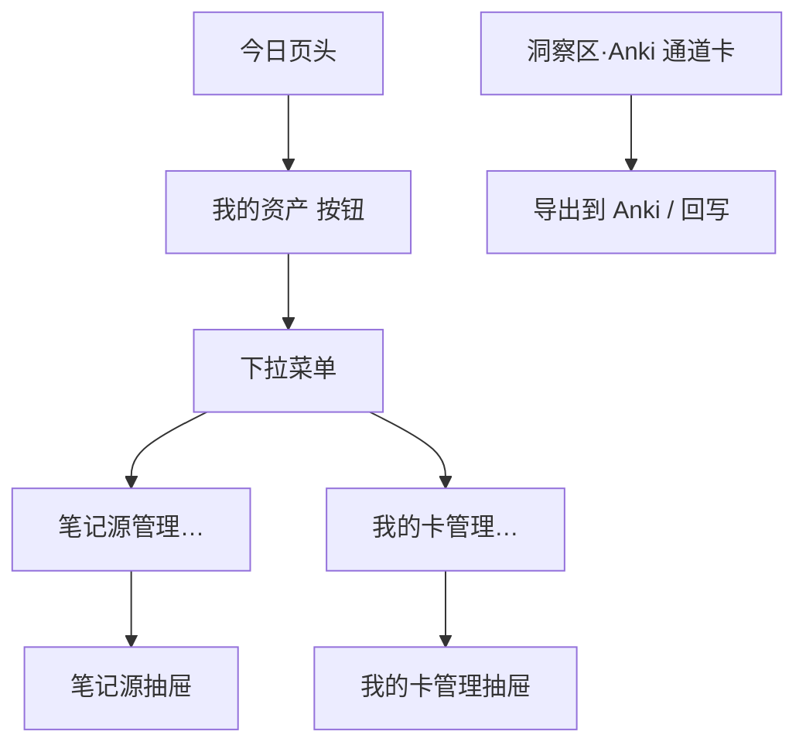
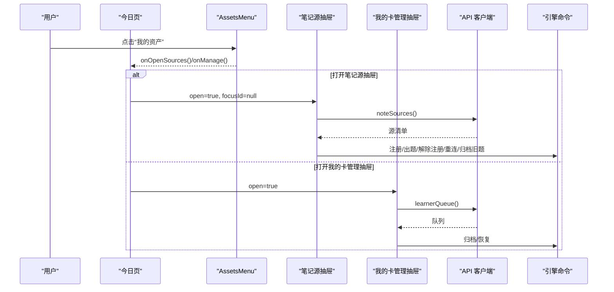
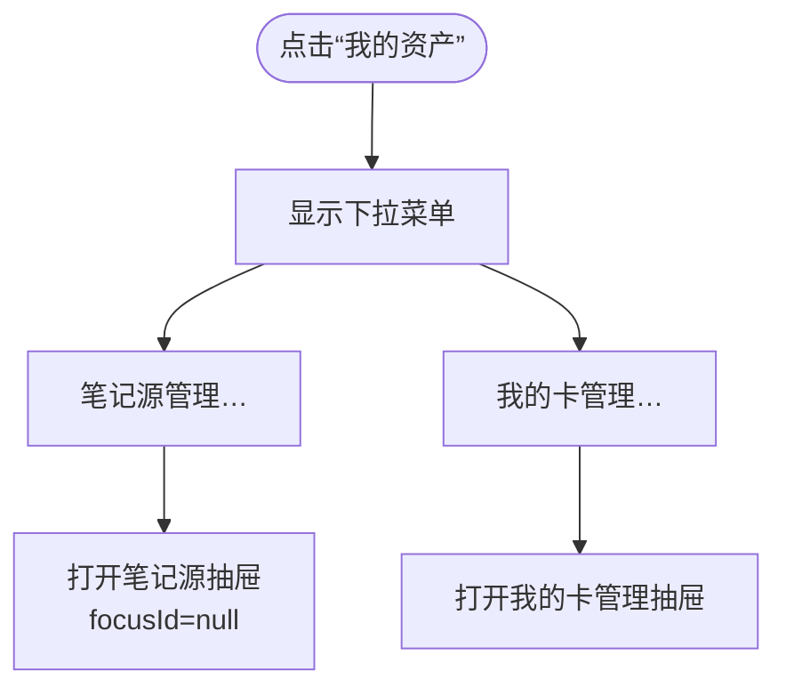
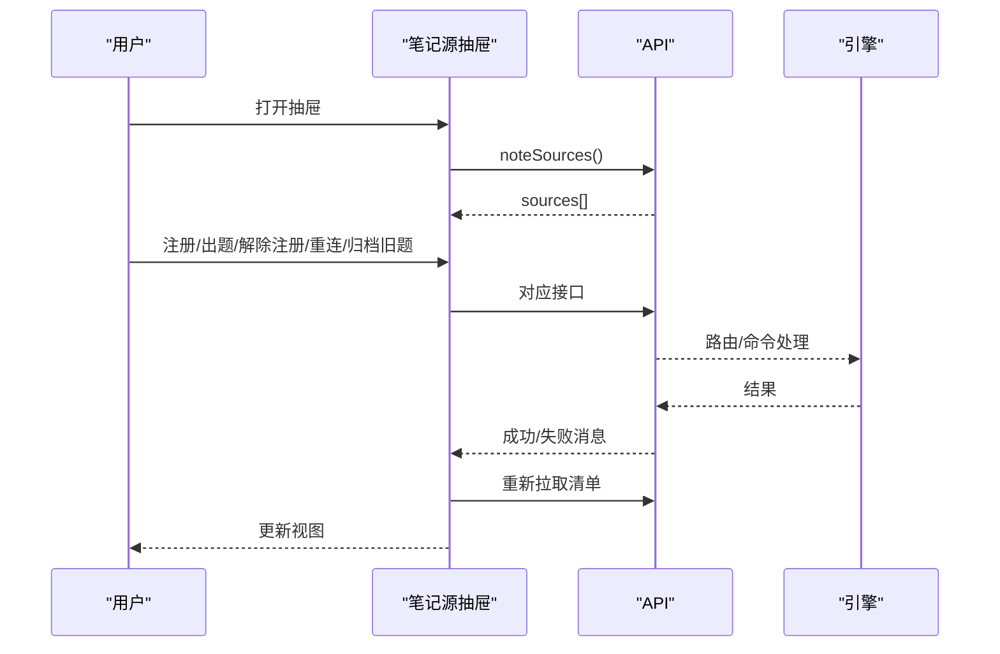
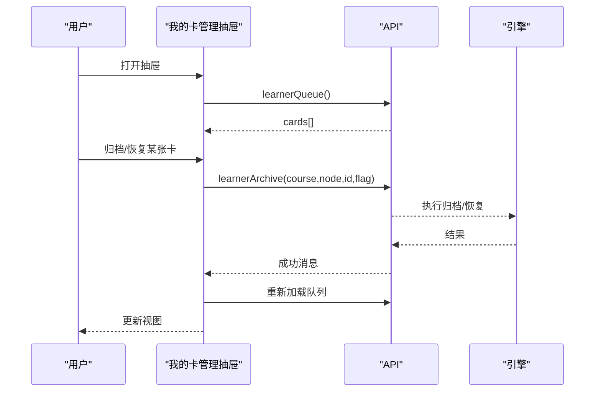
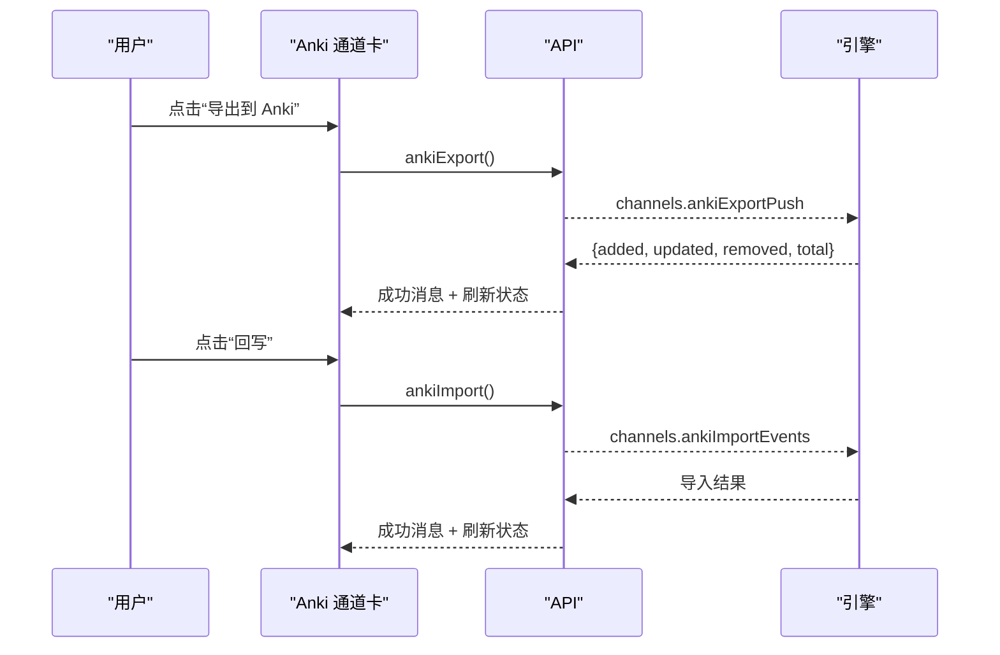
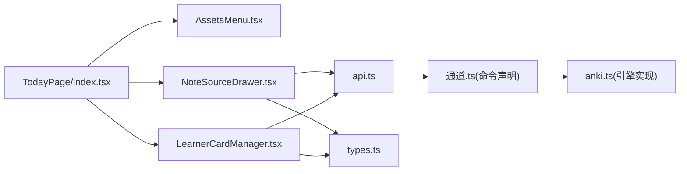

# 资产菜单

<cite>
**本文引用的文件**
- [AssetsMenu.tsx](file://ui/src/pages/TodayPage/AssetsMenu.tsx)
- [TodayPage/index.tsx](file://ui/src/pages/TodayPage/index.tsx)
- [NoteSourceDrawer.tsx](file://ui/src/pages/TodayPage/NoteSourceDrawer.tsx)
- [LearnerCardManager.tsx](file://ui/src/pages/TodayPage/LearnerCardManager.tsx)
- [AnkiChannelCard.tsx](file://ui/src/pages/InsightPage/AnkiChannelCard.tsx)
- [anki.ts](file://src/engine/anki.ts)
- [通道.ts](file://src/commands/通道.ts)
- [api.ts](file://ui/src/api.ts)
- [types.ts](file://ui/src/types.ts)
</cite>

## 目录
1. [简介](#简介)
2. [项目结构](#项目结构)
3. [核心组件](#核心组件)
4. [架构总览](#架构总览)
5. [详细组件分析](#详细组件分析)
6. [依赖关系分析](#依赖关系分析)
7. [性能与体验优化](#性能与体验优化)
8. [故障排查指南](#故障排查指南)
9. [结论](#结论)
10. [附录：扩展方法](#附录：扩展方法)

## 简介
本文件围绕“我的资产”菜单（AssetsMenu）展开，说明其在“今日页”中的定位、菜单项的动态生成、权限控制与用户导航逻辑；解释与“学习者卡片管理器”和“笔记源抽屉”的交互方式、状态同步机制与用户体验优化；并给出菜单定制、新工具集成与主题适配的扩展方法。同时明确 Anki 导出功能在洞察区的通道卡中提供，不在资产菜单内直接暴露。

## 项目结构
“我的资产”菜单位于“今日页”头部区域，点击后通过下拉菜单打开两个抽屉：
- 笔记源管理：注册/出题/解除注册/重连/旧题归档
- 我的卡管理：查看到期队列、归档/恢复自注理解卡

Anki 导出/回写入口统一放在洞察区通道卡，避免与学习动作拥挤在同一行。

图表来源
- [AssetsMenu.tsx:1-22](file://ui/src/pages/TodayPage/AssetsMenu.tsx#L1-L22)
- [TodayPage/index.tsx:210-216](file://ui/src/pages/TodayPage/index.tsx#L210-L216)
- [AnkiChannelCard.tsx:1-25](file://ui/src/pages/InsightPage/AnkiChannelCard.tsx#L1-L25)

章节来源
- [AssetsMenu.tsx:1-22](file://ui/src/pages/TodayPage/AssetsMenu.tsx#L1-L22)
- [TodayPage/index.tsx:1-14](file://ui/src/pages/TodayPage/index.tsx#L1-L14)

## 核心组件
- AssetsMenu：渲染“我的资产”按钮与下拉菜单，包含“笔记源管理…”和“我的卡管理…”两项。
- NoteSourceDrawer：笔记源抽屉，负责注册/出题/解除注册/重连/旧题归档等。
- LearnerCardManager：我的卡管理抽屉，负责加载队列、归档/恢复卡片。
- AnkiChannelCard：洞察区通道卡，负责 Anki 导出/回写与状态展示。

章节来源
- [AssetsMenu.tsx:1-22](file://ui/src/pages/TodayPage/AssetsMenu.tsx#L1-L22)
- [NoteSourceDrawer.tsx:1-212](file://ui/src/pages/TodayPage/NoteSourceDrawer.tsx#L1-L212)
- [LearnerCardManager.tsx:1-91](file://ui/src/pages/TodayPage/LearnerCardManager.tsx#L1-L91)
- [AnkiChannelCard.tsx:1-25](file://ui/src/pages/InsightPage/AnkiChannelCard.tsx#L1-L25)

## 架构总览
“我的资产”菜单是“今日页”的入口之一，通过回调打开对应抽屉；抽屉内部调用 API 与引擎命令进行数据读写；Anki 导出/回写在洞察区通道卡完成，遵循“vault 是唯一调度器”的原则，Anki 仅作为作答通道。

图表来源
- [TodayPage/index.tsx:210-216](file://ui/src/pages/TodayPage/index.tsx#L210-L216)
- [NoteSourceDrawer.tsx:21-33](file://ui/src/pages/TodayPage/NoteSourceDrawer.tsx#L21-L33)
- [LearnerCardManager.tsx:23-28](file://ui/src/pages/TodayPage/LearnerCardManager.tsx#L23-L28)
- [api.ts:153-174](file://ui/src/api.ts#L153-L174)
- [通道.ts:9-72](file://src/commands/通道.ts#L9-L72)

## 详细组件分析

### AssetsMenu：菜单项与导航
- 菜单项固定为两项：笔记源管理、我的卡管理。
- 通过 Tooltip 提示“Anki 通道在洞察区”，引导用户前往洞察区执行导出/回写。
- 点击后由今日页维护抽屉开关与焦点定位（如从横幅直达时携带 focusId）。

图表来源
- [AssetsMenu.tsx:10-20](file://ui/src/pages/TodayPage/AssetsMenu.tsx#L10-L20)
- [TodayPage/index.tsx:210-216](file://ui/src/pages/TodayPage/index.tsx#L210-L216)

章节来源
- [AssetsMenu.tsx:1-22](file://ui/src/pages/TodayPage/AssetsMenu.tsx#L1-L22)
- [TodayPage/index.tsx:210-216](file://ui/src/pages/TodayPage/index.tsx#L210-L216)

### 笔记源抽屉：注册/出题/解除注册/重连/旧题归档
- 打开时拉取笔记源清单，支持按 id 展开旧题列表。
- 注册路径支持单篇或文件夹；出题会读当前内容并生成新题，旧题保留可逐题归档。
- 缺失/漂移/不一致等状态以标签与提示呈现；缺失时可输入新路径重连，保留卡池与调度。
- 所有操作成功后刷新清单并通知父组件重载。

图表来源
- [NoteSourceDrawer.tsx:21-33](file://ui/src/pages/TodayPage/NoteSourceDrawer.tsx#L21-L33)
- [NoteSourceDrawer.tsx:56-121](file://ui/src/pages/TodayPage/NoteSourceDrawer.tsx#L56-L121)
- [api.ts:153-166](file://ui/src/api.ts#L153-L166)

章节来源
- [NoteSourceDrawer.tsx:1-212](file://ui/src/pages/TodayPage/NoteSourceDrawer.tsx#L1-L212)
- [api.ts:153-166](file://ui/src/api.ts#L153-L166)

### 我的卡管理抽屉：队列加载、归档/恢复
- 打开时加载“我的卡”队列；无库卡时显示空态提示。
- 对每张卡提供“归档”确认；本次会话已归档的卡在抽屉底部集中展示并可恢复。
- 归档/恢复均调用引擎接口，成功后刷新队列并通知父组件重载。

图表来源
- [LearnerCardManager.tsx:23-47](file://ui/src/pages/TodayPage/LearnerCardManager.tsx#L23-L47)
- [api.ts:124-139](file://ui/src/api.ts#L124-L139)

章节来源
- [LearnerCardManager.tsx:1-91](file://ui/src/pages/TodayPage/LearnerCardManager.tsx#L1-L91)
- [api.ts:124-139](file://ui/src/api.ts#L124-L139)

### Anki 导出/回写：洞察区通道卡
- 导出：根据 vault 到期集校准/重建镜象卡组，新增/更新/移除卡片，推送至桌面 Anki。
- 回写：拉取上次导入以来的作答事件，按 vault 调度规则重算，写入练习流与复习日志。
- 状态：显示镜象规模、最近推送/导入时间、到期分布、AnkiConnect 可达性。

图表来源
- [AnkiChannelCard.tsx:14-25](file://ui/src/pages/InsightPage/AnkiChannelCard.tsx#L14-L25)
- [api.ts:167-174](file://ui/src/api.ts#L167-L174)
- [通道.ts:9-72](file://src/commands/通道.ts#L9-L72)
- [anki.ts:76-147](file://src/engine/anki.ts#L76-L147)

章节来源
- [AnkiChannelCard.tsx:1-25](file://ui/src/pages/InsightPage/AnkiChannelCard.tsx#L1-L25)
- [通道.ts:9-72](file://src/commands/通道.ts#L9-L72)
- [anki.ts:76-147](file://src/engine/anki.ts#L76-L147)

## 依赖关系分析
- 今日页持有抽屉开关与最近归档列表，向子组件传递回调与状态。
- 两个抽屉各自维护本地 loading/busy 状态，并通过 api 模块调用后端。
- 类型定义集中在 types.ts，UI 类型来自引擎视图与命令输出派生，保证前后端契约一致。
- Anki 相关能力由引擎命令与 anki.ts 实现，面板侧通过 API 暴露。

图表来源
- [TodayPage/index.tsx:210-270](file://ui/src/pages/TodayPage/index.tsx#L210-L270)
- [api.ts:153-174](file://ui/src/api.ts#L153-L174)
- [通道.ts:9-72](file://src/commands/通道.ts#L9-L72)
- [anki.ts:76-147](file://src/engine/anki.ts#L76-L147)
- [types.ts:1-93](file://ui/src/types.ts#L1-L93)

章节来源
- [TodayPage/index.tsx:210-270](file://ui/src/pages/TodayPage/index.tsx#L210-L270)
- [api.ts:153-174](file://ui/src/api.ts#L153-L174)
- [通道.ts:9-72](file://src/commands/通道.ts#L9-L72)
- [anki.ts:76-147](file://src/engine/anki.ts#L76-L147)
- [types.ts:1-93](file://ui/src/types.ts#L1-L93)

## 性能与体验优化
- 主数据与次要数据分离：推荐流为主数据，失败则页面失败态；XP/复习横幅/供给/闸门等为次要数据，失败按空处理，避免整页崩溃。
- 轮询与边沿检测：供给/进度/提案数统一轮询，出现终态边沿触发推荐流与复习队列重载，减少重复请求。
- 抽屉懒加载：抽屉仅在打开时拉取数据，关闭时卸载，降低首屏压力。
- 本地忙态与确认：关键写操作使用 loading 与 Popconfirm，防止误操作与重复提交。
- 会话级恢复清单：本次已归档的卡片在抽屉底部集中展示，便于快速恢复，提升可用性。

[本节为通用指导，不直接分析具体文件]

## 故障排查指南
- 笔记源“缺失/漂移/不一致”：
  - 缺失：输入新路径重连，保留卡池与调度；若仍失败，检查 vault 路径与权限。
  - 漂移：点击“出题”以当前内容为准，清除漂移标记。
  - 不一致：核对镜像题库与笔记内容，必要时重新出题。
- 我的卡无法归档/恢复：
  - 检查网络与 API 响应；关注 Message 错误信息；重试后刷新队列。
- Anki 导出/回写失败：
  - 确认 Anki 运行且 AnkiConnect 可用；检查 endpoint；先导入再导出，避免重复推送。
  - 查看通道卡状态：镜象规模、最近推送/导入时间与到期分布。

章节来源
- [NoteSourceDrawer.tsx:108-121](file://ui/src/pages/TodayPage/NoteSourceDrawer.tsx#L108-L121)
- [LearnerCardManager.tsx:30-47](file://ui/src/pages/TodayPage/LearnerCardManager.tsx#L30-L47)
- [AnkiChannelCard.tsx:14-25](file://ui/src/pages/InsightPage/AnkiChannelCard.tsx#L14-L25)
- [通道.ts:9-72](file://src/commands/通道.ts#L9-L72)

## 结论
“我的资产”菜单将“笔记源管理”和“我的卡管理”收拢于今日页头，提供清晰、低干扰的入口；Anki 导出/回写统一置于洞察区通道卡，遵循“vault 唯一调度”的设计原则。通过抽屉懒加载、轮询与边沿检测、本地忙态与确认等机制，兼顾性能与用户体验。后续扩展可在菜单中增加新工具入口，或通过洞察区通道卡集成更多外部工具。

[本节为总结性内容，不直接分析具体文件]

## 附录：扩展方法

### 菜单定制
- 新增菜单项：在 AssetsMenu 中添加新的 Menu.Item，并在 TodayPage 中绑定回调以打开对应抽屉或跳转页面。
- 动态生成：可根据用户角色或配置过滤/排序菜单项；例如基于权限标志决定是否显示某项。
- 导航逻辑：复用 TodayPage 的 frame.goto/openLesson 等能力进行页面跳转或打开学习视图。

章节来源
- [AssetsMenu.tsx:10-20](file://ui/src/pages/TodayPage/AssetsMenu.tsx#L10-L20)
- [TodayPage/index.tsx:210-216](file://ui/src/pages/TodayPage/index.tsx#L210-L216)

### 新工具集成
- 通过 API 新增后端能力，并在 TodayPage 或洞察区通道卡中暴露入口。
- 若为新抽屉，参考 NoteSourceDrawer/LearnerCardManager 的实现模式：打开时拉取数据、写操作带忙态与确认、成功后刷新并通知父组件重载。
- 若为外部工具（如 Anki），遵循“通道卡”模式：状态只读、操作幂等、失败可重试。

章节来源
- [NoteSourceDrawer.tsx:21-33](file://ui/src/pages/TodayPage/NoteSourceDrawer.tsx#L21-L33)
- [LearnerCardManager.tsx:23-47](file://ui/src/pages/TodayPage/LearnerCardManager.tsx#L23-L47)
- [AnkiChannelCard.tsx:14-25](file://ui/src/pages/InsightPage/AnkiChannelCard.tsx#L14-L25)
- [api.ts:153-174](file://ui/src/api.ts#L153-L174)

### 主题适配
- 使用 Arco Design 提供的样式类与主题变量，确保抽屉、按钮、标签等元素与整体主题一致。
- 如需自定义宽度/间距，可通过 CSS 类名（如 lh-*）进行微调，保持与现有布局系统兼容。

[本节为通用指导，不直接分析具体文件]