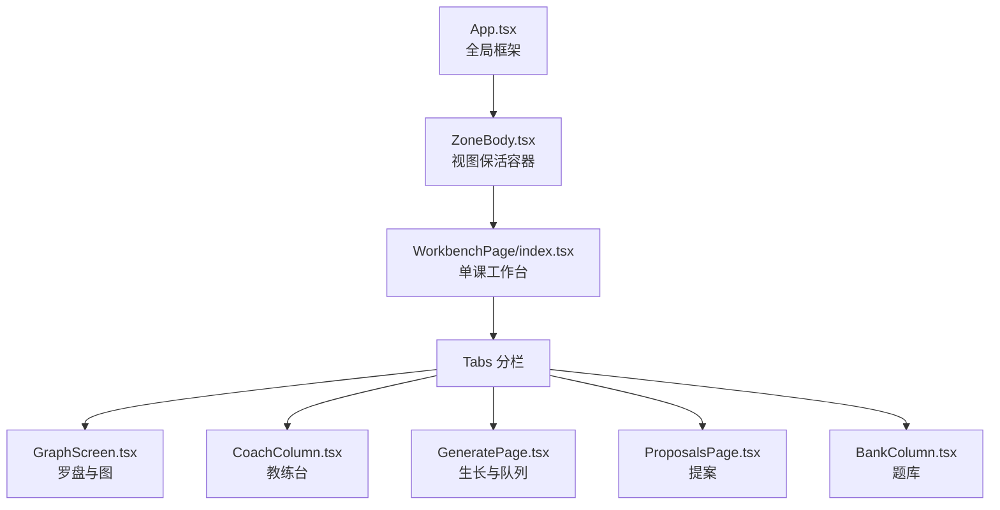
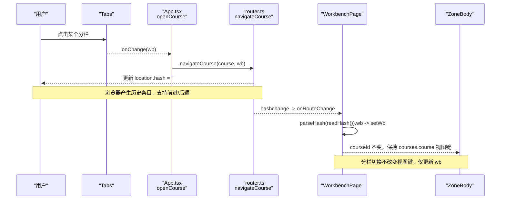
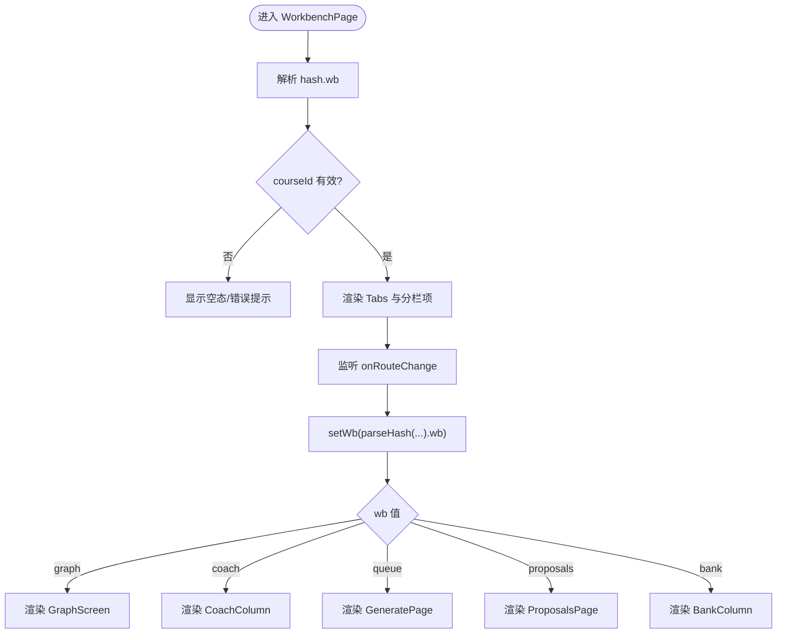
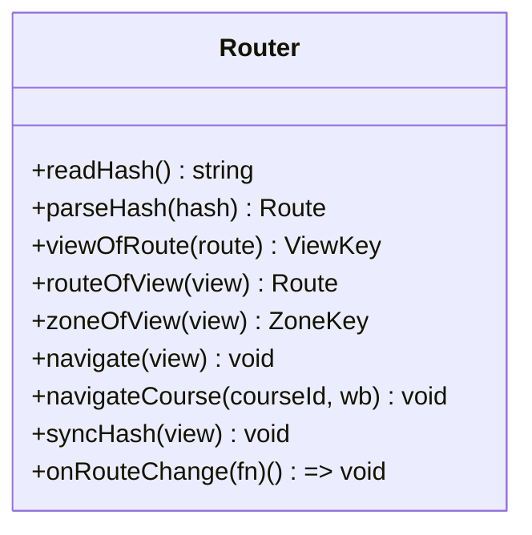
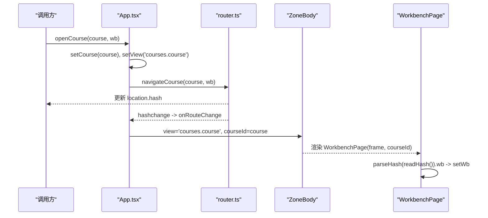
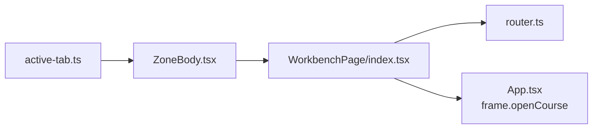

# 工作区布局与导航

<cite>
**本文引用的文件**
- [ui/src/pages/WorkbenchPage/index.tsx](file://ui/src/pages/WorkbenchPage/index.tsx)
- [ui/src/lib/router.ts](file://ui/src/lib/router.ts)
- [ui/src/App.tsx](file://ui/src/App.tsx)
- [ui/src/components/ZoneBody.tsx](file://ui/src/components/ZoneBody.tsx)
- [ui/src/active-tab.ts](file://ui/src/active-tab.ts)
- [ui/src/pages/WorkbenchPage/GraphScreen.tsx](file://ui/src/pages/WorkbenchPage/GraphScreen.tsx)
- [ui/src/pages/WorkbenchPage/CoachColumn.tsx](file://ui/src/pages/WorkbenchPage/CoachColumn.tsx)
- [ui/src/pages/WorkbenchPage/BankColumn.tsx](file://ui/src/pages/WorkbenchPage/BankColumn.tsx)
</cite>

## 目录
1. [简介](#简介)
2. [项目结构](#项目结构)
3. [核心组件](#核心组件)
4. [架构总览](#架构总览)
5. [详细组件分析](#详细组件分析)
6. [依赖关系分析](#依赖关系分析)
7. [性能考量](#性能考量)
8. [故障排查指南](#故障排查指南)
9. [结论](#结论)
10. [附录：定制与扩展指南](#附录定制与扩展指南)

## 简介
本文件聚焦“课程工作台”主容器 WorkbenchPage 的布局与导航设计，围绕分栏式布局、路由状态管理、页面切换机制展开。重点说明：
- WORKBENCH_ITEMS 配置项的定义与顺序控制
- Tabs 组件的分栏切换逻辑
- frame.openCourse 的路由更新机制（含深链、前进后退）
- 课程验证与空态处理
- 工作区定制与扩展的开发指南

## 项目结构
WorkbenchPage 位于 ui/src/pages/WorkbenchPage，作为单课工作台的主容器，负责：
- 渲染顶部标题与返回按钮
- 通过 Tabs 展示分栏（罗盘与图、教练台、生长与队列、提案、题库）
- 根据当前分栏 wb 渲染对应子视图
- 监听路由变化并同步本地分栏状态
- 统一轮询生成任务状态，向各分栏提供数据

图表来源
- [ui/src/App.tsx:47-179](file://ui/src/App.tsx#L47-L179)
- [ui/src/components/ZoneBody.tsx:21-42](file://ui/src/components/ZoneBody.tsx#L21-L42)
- [ui/src/pages/WorkbenchPage/index.tsx:33-84](file://ui/src/pages/WorkbenchPage/index.tsx#L33-L84)

章节来源
- [ui/src/pages/WorkbenchPage/index.tsx:1-84](file://ui/src/pages/WorkbenchPage/index.tsx#L1-L84)
- [ui/src/components/ZoneBody.tsx:1-42](file://ui/src/components/ZoneBody.tsx#L1-L42)
- [ui/src/App.tsx:47-179](file://ui/src/App.tsx#L47-L179)

## 核心组件
- WorkbenchPage：单课工作台主容器，维护当前分栏 wb，渲染 Tabs 与对应子视图，统一轮询生成任务。
- router.ts：hash 路由解析与跳转，支持参数段 #/course/<id>/<wb>，提供 navigateCourse、parseHash、onRouteChange 等能力。
- App.tsx：全局框架，定义 AppFrame 接口，实现 openCourse 方法，桥接路由与视图状态。
- ZoneBody.tsx：视图保活容器，按 visited 集合挂载视图，隐藏视图保留状态。
- active-tab.ts：当前激活视图信号，用于跨视图保活与轮询门控。

章节来源
- [ui/src/pages/WorkbenchPage/index.tsx:24-84](file://ui/src/pages/WorkbenchPage/index.tsx#L24-L84)
- [ui/src/lib/router.ts:1-164](file://ui/src/lib/router.ts#L1-L164)
- [ui/src/App.tsx:17-38](file://ui/src/App.tsx#L17-L38)
- [ui/src/components/ZoneBody.tsx:1-42](file://ui/src/components/ZoneBody.tsx#L1-L42)
- [ui/src/active-tab.ts:1-38](file://ui/src/active-tab.ts#L1-L38)

## 架构总览
WorkbenchPage 采用“分栏式布局 + 参数段路由”的设计：
- 分栏项由 WORKBENCH_ITEMS 定义，顺序即可见序，且与测试表对账。
- 路由权威为 location.hash；工作台使用参数段 #/course/<id>/<wb>，wb ∈ {graph, coach, queue, proposals, bank}。
- 分栏切换通过 Tabs onChange 调用 frame.openCourse(course, wb)，写入完整 hash，从而支持前进/后退与深链直达。
- 路由变化通过 onRouteChange 回调回灌到 WorkbenchPage 的本地 wb 状态，保证外部导航（浏览器前进/后退、手改 hash）与 UI 一致。

图表来源
- [ui/src/pages/WorkbenchPage/index.tsx:74-81](file://ui/src/pages/WorkbenchPage/index.tsx#L74-L81)
- [ui/src/App.tsx:91-96](file://ui/src/App.tsx#L91-L96)
- [ui/src/lib/router.ts:140-143](file://ui/src/lib/router.ts#L140-L143)
- [ui/src/lib/router.ts:158-163](file://ui/src/lib/router.ts#L158-L163)

章节来源
- [ui/src/pages/WorkbenchPage/index.tsx:33-84](file://ui/src/pages/WorkbenchPage/index.tsx#L33-L84)
- [ui/src/lib/router.ts:77-104](file://ui/src/lib/router.ts#L77-L104)
- [ui/src/App.tsx:91-96](file://ui/src/App.tsx#L91-L96)

## 详细组件分析

### WorkbenchPage：分栏式布局与路由状态管理
- 分栏项定义：WORKBENCH_ITEMS 数组定义了分栏 key 与标题，顺序即为 Tabs 渲染顺序，且与测试用例三表门对账。
- 初始 wb：从当前 hash 解析得到 wb，确保刷新或深链直达时正确显示目标分栏。
- 路由回灌：onRouteChange 监听 hashchange，仅在工作台路由上更新 wb，避免其他视图误改分栏。
- 课程验证：若 courseId 为空或课程不存在，显示警告结果页并提供返回入口。
- 统一轮询：usePolling 获取 generateStatus，过滤出本课节点的任务，供 GraphScreen 与 CoachColumn 消费。

图表来源
- [ui/src/pages/WorkbenchPage/index.tsx:24-39](file://ui/src/pages/WorkbenchPage/index.tsx#L24-L39)
- [ui/src/pages/WorkbenchPage/index.tsx:54-81](file://ui/src/pages/WorkbenchPage/index.tsx#L54-L81)

章节来源
- [ui/src/pages/WorkbenchPage/index.tsx:24-84](file://ui/src/pages/WorkbenchPage/index.tsx#L24-L84)

### router.ts：参数段路由与深链支持
- URL 文法：#/course/<id>/<wb>，id 经 encodeURIComponent，wb 缺省为 graph。
- 解析规则：
  - 首段为 course 时，次段为课程 id（decodeURIComponent 容错），第三段命中 WORKBENCH_SUBS 否则默认 graph。
  - 无 id 的 #/course 回落我的课程。
  - 旧键深链（如 #/courses/graph、#/courses/bank）回落我的课程（已知断裂）。
- 跳转函数：
  - navigate(view)：非参数化视图跳转。
  - navigateCourse(courseId, wb)：写完整参数段 hash，支持前进/后退与深链。
- 规范化：syncHash 在视图漂移时用 replaceState 修正 URL，避免非法形残留。

图表来源
- [ui/src/lib/router.ts:72-163](file://ui/src/lib/router.ts#L72-L163)

章节来源
- [ui/src/lib/router.ts:1-164](file://ui/src/lib/router.ts#L1-L164)

### App.tsx：frame.openCourse 与全局路由桥接
- AppFrame 暴露 openCourse(course, wb?)：设置当前课程、切换到 courses.course 视图，并通过 navigateCourse 写入完整参数段 hash。
- 路由事件回灌：onRouteChange 将解析后的视图键同步到 view 状态，同时更新 courseId（仅当 zone=courses 时）。
- 视图保活：setActiveTab(view) 通知各页轮询门控，隐藏视图跳过取数但保留定时节拍。

图表来源
- [ui/src/App.tsx:91-96](file://ui/src/App.tsx#L91-L96)
- [ui/src/App.tsx:109-117](file://ui/src/App.tsx#L109-L117)
- [ui/src/components/ZoneBody.tsx:21-42](file://ui/src/components/ZoneBody.tsx#L21-L42)
- [ui/src/pages/WorkbenchPage/index.tsx:33-39](file://ui/src/pages/WorkbenchPage/index.tsx#L33-L39)

章节来源
- [ui/src/App.tsx:47-179](file://ui/src/App.tsx#L47-L179)
- [ui/src/components/ZoneBody.tsx:21-42](file://ui/src/components/ZoneBody.tsx#L21-L42)

### 分栏子视图概览
- GraphScreen：首屏罗盘与学习图，支持终点面板、推荐条、节点选择进入学习视图。
- CoachColumn：机器仪表，包含 CoachCockpit 与 ThermostatCard，提供建课/生长一步等操作。
- BankColumn：题库分栏，支持浏览、筛选、编辑、自建、归档、难度建议与维护体检。

章节来源
- [ui/src/pages/WorkbenchPage/GraphScreen.tsx:1-383](file://ui/src/pages/WorkbenchPage/GraphScreen.tsx#L1-L383)
- [ui/src/pages/WorkbenchPage/CoachColumn.tsx:1-48](file://ui/src/pages/WorkbenchPage/CoachColumn.tsx#L1-L48)
- [ui/src/pages/WorkbenchPage/BankColumn.tsx:1-366](file://ui/src/pages/WorkbenchPage/BankColumn.tsx#L1-L366)

## 依赖关系分析
- WorkbenchPage 依赖 router.ts 进行路由解析与监听，依赖 App.tsx 提供的 frame.openCourse 进行分栏跳转。
- ZoneBody 根据 VIEW_KEYS 与 visited 集合挂载视图，WorkbenchPage 仅在 courses.course 视图下渲染。
- active-tab.ts 提供 isActiveTab/onTabActive，配合 ZoneBody 的保活策略，避免隐藏视图重复取数。

图表来源
- [ui/src/pages/WorkbenchPage/index.tsx:33-84](file://ui/src/pages/WorkbenchPage/index.tsx#L33-L84)
- [ui/src/components/ZoneBody.tsx:21-42](file://ui/src/components/ZoneBody.tsx#L21-L42)
- [ui/src/active-tab.ts:1-38](file://ui/src/active-tab.ts#L1-L38)

章节来源
- [ui/src/pages/WorkbenchPage/index.tsx:33-84](file://ui/src/pages/WorkbenchPage/index.tsx#L33-L84)
- [ui/src/components/ZoneBody.tsx:21-42](file://ui/src/components/ZoneBody.tsx#L21-L42)
- [ui/src/active-tab.ts:1-38](file://ui/src/active-tab.ts#L1-L38)

## 性能考量
- 统一轮询：WorkbenchPage 内 usePolling 获取 generateStatus，避免各分栏重复请求，降低网络开销。
- 视图保活：ZoneBody 基于 visited 集合挂载视图，隐藏视图保留状态；active-tab 信号让轮询门控跳过取数，减少无效请求。
- 路由规范化：syncHash 使用 replaceState 修正 URL，避免多余历史条目与非法形残留。

[本节为通用性能讨论，不直接分析具体代码行]

## 故障排查指南
- 深链无法直达：检查 URL 是否符合 #/course/<id>/<wb> 格式；确认 wb 是否在 WORKBENCH_SUBS 中；若无 id，将回落我的课程。
- 前进/后退异常：确认 navigateCourse 写入完整 hash；onRouteChange 已订阅 hashchange；WorkbenchPage 内部 setWb 已响应路由变化。
- 课程不存在：WorkbenchPage 会显示警告结果页；检查 tree.courses 是否包含该课程名；必要时返回我的课程。
- 分栏未切换：确认 Tabs onChange 调用 frame.openCourse；检查 router.navigateCourse 是否正确编码 courseId。

章节来源
- [ui/src/pages/WorkbenchPage/index.tsx:54-63](file://ui/src/pages/WorkbenchPage/index.tsx#L54-L63)
- [ui/src/lib/router.ts:81-104](file://ui/src/lib/router.ts#L81-L104)
- [ui/src/lib/router.ts:140-143](file://ui/src/lib/router.ts#L140-L143)

## 结论
WorkbenchPage 以分栏式布局承载单课工作台，结合参数段路由与 AppFrame 的 openCourse 方法，实现了：
- 清晰的顺序控制（WORKBENCH_ITEMS）
- 稳定的分栏切换（Tabs + navigateCourse）
- 完整的深链与前进后退支持（parseHash + onRouteChange）
- 安全的课程验证与空态处理
- 高效的轮询与视图保活（usePolling + active-tab）

该设计在保证可维护性的同时，提供了良好的用户体验与扩展性。

[本节为总结性内容，不直接分析具体代码行]

## 附录：定制与扩展指南
- 新增分栏：
  - 在 WORKBENCH_ITEMS 中添加新项（key 需属于 WorkbenchSub），并在 WorkbenchPage 的条件渲染分支中增加对应子视图。
  - 确保 router.ts 的 WORKBENCH_SUBS 包含新 key，以便路由解析与跳转生效。
- 修改分栏顺序：
  - 调整 WORKBENCH_ITEMS 的顺序即可，Tabs 将按数组顺序渲染。
- 自定义路由行为：
  - 如需扩展参数段，修改 router.ts 的 parseHash/navigateCourse/syncHash，并确保 WorkbenchPage 的 onRouteChange 能正确回灌新字段。
- 集成第三方组件：
  - 在对应分栏子视图中引入组件，并通过 frame 接口与全局状态交互（如 openLesson、locateJob 等）。
- 测试对齐：
  - 新增或修改分栏后，需同步更新 tests/ui-router.test.ts 中的三表门对账，确保字面量表一致。

章节来源
- [ui/src/pages/WorkbenchPage/index.tsx:24-31](file://ui/src/pages/WorkbenchPage/index.tsx#L24-L31)
- [ui/src/lib/router.ts:41-47](file://ui/src/lib/router.ts#L41-L47)
- [ui/src/lib/router.ts:81-104](file://ui/src/lib/router.ts#L81-L104)