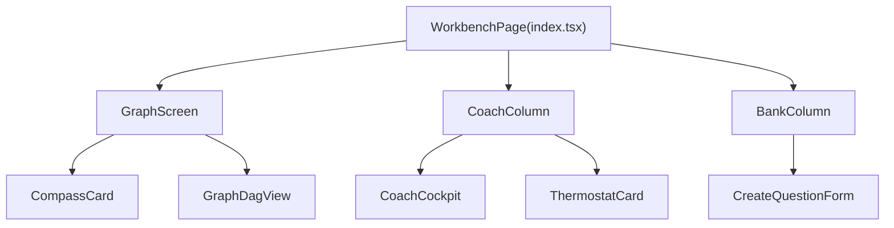
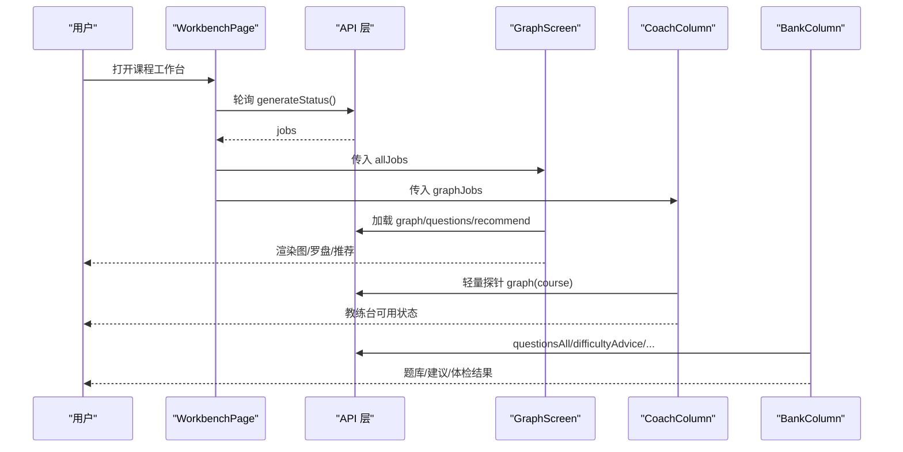
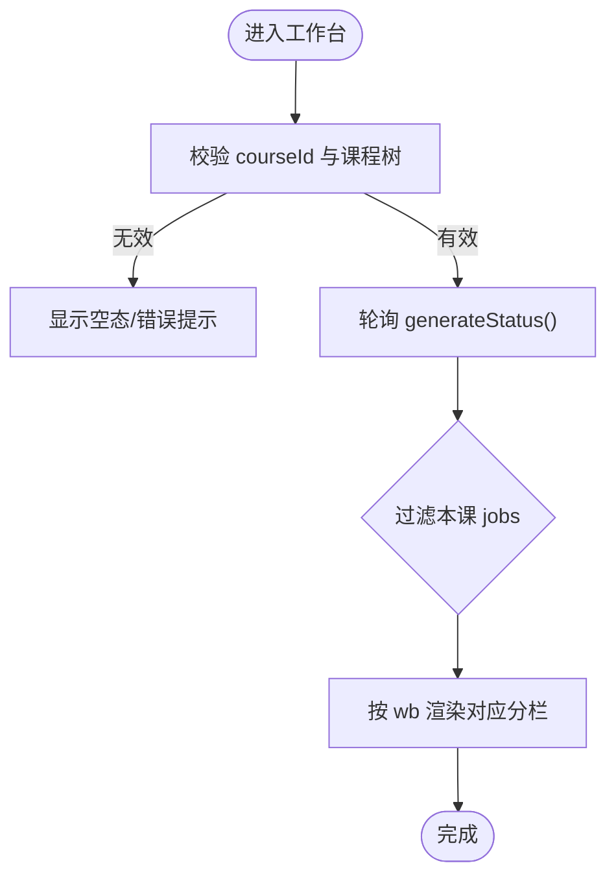
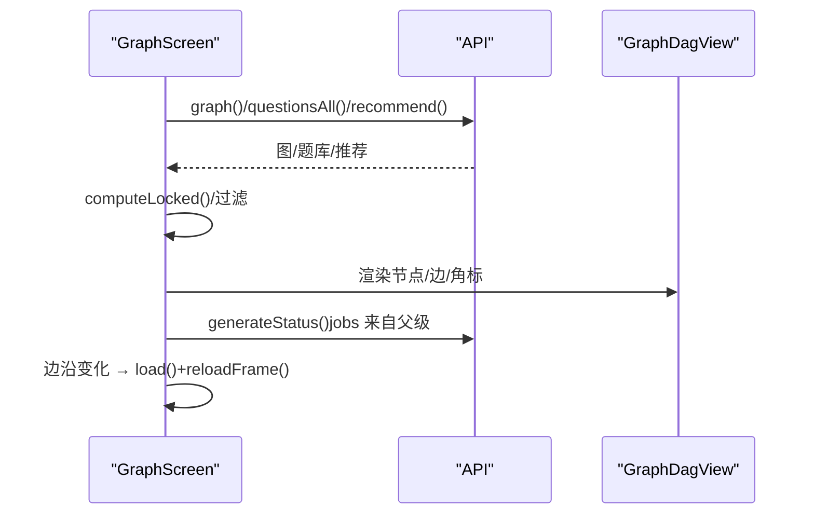
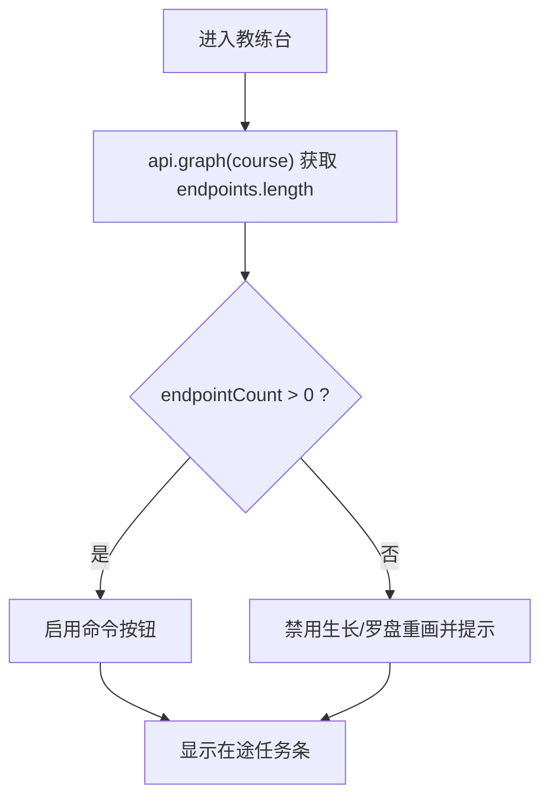
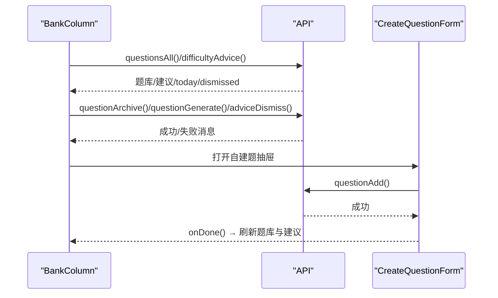
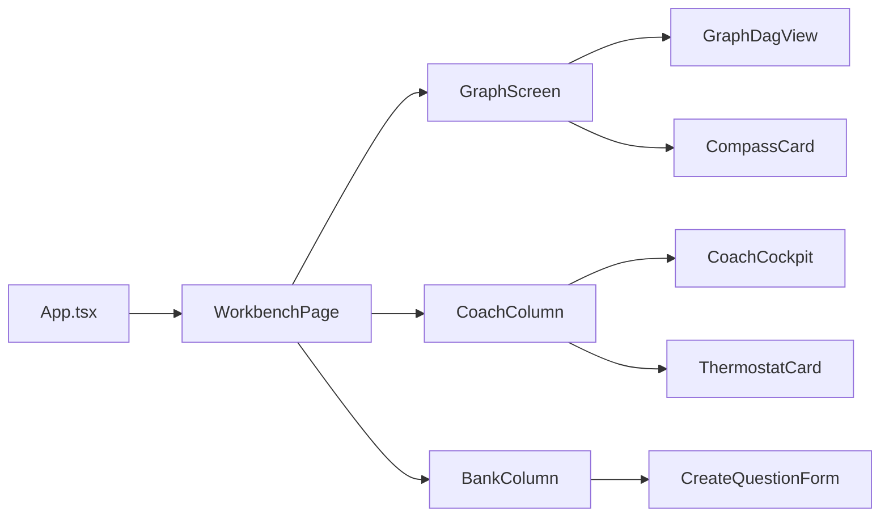

# 工作区页面

<cite>
**本文引用的文件**
- [ui/src/pages/WorkbenchPage/index.tsx](file://ui/src/pages/WorkbenchPage/index.tsx)
- [ui/src/pages/WorkbenchPage/BankColumn.tsx](file://ui/src/pages/WorkbenchPage/BankColumn.tsx)
- [ui/src/pages/WorkbenchPage/CoachColumn.tsx](file://ui/src/pages/WorkbenchPage/CoachColumn.tsx)
- [ui/src/pages/WorkbenchPage/GraphScreen.tsx](file://ui/src/pages/WorkbenchPage/GraphScreen.tsx)
- [ui/src/pages/WorkbenchPage/CreateQuestionForm.tsx](file://ui/src/pages/WorkbenchPage/CreateQuestionForm.tsx)
- [ui/src/components/CoachCockpit.tsx](file://ui/src/components/CoachCockpit.tsx)
- [ui/src/components/GraphDagView.tsx](file://ui/src/components/GraphDagView.tsx)
- [ui/src/pages/WorkbenchPage/CompassCard.tsx](file://ui/src/pages/WorkbenchPage/CompassCard.tsx)
- [ui/src/pages/WorkbenchPage/ThermostatCard.tsx](file://ui/src/pages/WorkbenchPage/ThermostatCard.tsx)
- [ui/src/App.tsx](file://ui/src/App.tsx)
</cite>

## 目录
1. [简介](#简介)
2. [项目结构](#项目结构)
3. [核心组件](#核心组件)
4. [架构总览](#架构总览)
5. [详细组件分析](#详细组件分析)
6. [依赖关系分析](#依赖关系分析)
7. [性能考量](#性能考量)
8. [故障排查指南](#故障排查指南)
9. [结论](#结论)
10. [附录：定制与扩展指南](#附录：定制与扩展指南)

## 简介
本文件面向“工作区页面”（单课工作台）的全面文档，围绕 WorkbenchPage 作为主要工作界面的复杂功能展开，覆盖题库管理（BankColumn）、教练工具（CoachColumn）、知识图谱可视化（GraphScreen）、题目创建表单（CreateQuestionForm）等核心模块。文档将说明各子组件的协作关系、数据流传递、用户交互流程，解释工作区的布局设计、状态管理与性能优化策略，并提供定制与扩展的开发指南。

## 项目结构
工作区页面位于 ui/src/pages/WorkbenchPage 下，由 index.tsx 作为路由入口，按 Tabs 分栏组织五个子视图：罗盘与图、教练台、生长与队列、提案、题库。其中：
- GraphScreen：首屏学习图与罗盘、终点面板、推荐条、DAG 可视化。
- CoachColumn：教练台入口卡片（CoachCockpit）+ 挑战点恒温器（ThermostatCard）。
- BankColumn：题库浏览/筛选/编辑/自建/归档 + 难度建议 + 体检与清理。
- CreateQuestionForm：九题型动态字段自建题表单。
- CompassCard：只读罗盘展示（路线草图、批注、ETA）。
- GraphDagView：基于 React Flow + dagre 的学习图 DAG 渲染。

图表来源
- [ui/src/pages/WorkbenchPage/index.tsx:24-81](file://ui/src/pages/WorkbenchPage/index.tsx#L24-L81)
- [ui/src/pages/WorkbenchPage/GraphScreen.tsx:149-383](file://ui/src/pages/WorkbenchPage/GraphScreen.tsx#L149-L383)
- [ui/src/pages/WorkbenchPage/CoachColumn.tsx:14-47](file://ui/src/pages/WorkbenchPage/CoachColumn.tsx#L14-L47)
- [ui/src/pages/WorkbenchPage/BankColumn.tsx:19-366](file://ui/src/pages/WorkbenchPage/BankColumn.tsx#L19-L366)

章节来源
- [ui/src/pages/WorkbenchPage/index.tsx:1-85](file://ui/src/pages/WorkbenchPage/index.tsx#L1-L85)

## 核心组件
- WorkbenchPage：统一路由与分栏切换；唯一轮询生成任务注册表，向 GraphScreen 与 CoachColumn 下发 jobs；根据 courseId 校验课程存在性并处理空态。
- GraphScreen：加载学习图、题库、推荐；过滤与锁定计算；生成角标投影；EndpointPanel 管理终点；CompassCard 展示罗盘；GraphDagView 渲染 DAG。
- CoachColumn：读取 endpointCount 探针，驱动 CoachCockpit 按钮禁用逻辑；透传 jobs 到 CoachCockpit。
- BankColumn：题库 CRUD、难度建议、体检与一键清理、自建题抽屉、编辑抽屉。
- CreateQuestionForm：九题型动态字段提交，调用 API 落库。
- CoachCockpit：建课、生长一步、罗盘重画、回填、就绪深度、复诊、在途任务条。
- ThermostatCard：跨区观测仪表与建议确认生效。
- CompassCard：只读罗盘（路线、批注、ETA）。
- GraphDagView：节点五态色板、掌握度底色、推荐高亮、锁定虚线、MiniMap、视口裁剪。

章节来源
- [ui/src/pages/WorkbenchPage/index.tsx:24-81](file://ui/src/pages/WorkbenchPage/index.tsx#L24-L81)
- [ui/src/pages/WorkbenchPage/GraphScreen.tsx:149-383](file://ui/src/pages/WorkbenchPage/GraphScreen.tsx#L149-L383)
- [ui/src/pages/WorkbenchPage/CoachColumn.tsx:14-47](file://ui/src/pages/WorkbenchPage/CoachColumn.tsx#L14-L47)
- [ui/src/pages/WorkbenchPage/BankColumn.tsx:19-366](file://ui/src/pages/WorkbenchPage/BankColumn.tsx#L19-L366)
- [ui/src/pages/WorkbenchPage/CreateQuestionForm.tsx:14-95](file://ui/src/pages/WorkbenchPage/CreateQuestionForm.tsx#L14-L95)
- [ui/src/components/CoachCockpit.tsx:142-253](file://ui/src/components/CoachCockpit.tsx#L142-L253)
- [ui/src/pages/WorkbenchPage/ThermostatCard.tsx:14-103](file://ui/src/pages/WorkbenchPage/ThermostatCard.tsx#L14-L103)
- [ui/src/pages/WorkbenchPage/CompassCard.tsx:15-79](file://ui/src/pages/WorkbenchPage/CompassCard.tsx#L15-L79)
- [ui/src/components/GraphDagView.tsx:232-317](file://ui/src/components/GraphDagView.tsx#L232-L317)

## 架构总览
工作区采用“单一轮询源 + 多视图消费”的数据流模式：
- App.tsx 提供全局 frame（status/tree/course/lesson/focusNode/focusJob），并通过 openCourse/openLesson/locateInGraph/locateJob 协调导航与定位。
- WorkbenchPage 使用 usePolling 以 tab='courses.course' 轮询 generateStatus，得到 allJobs，再按 course 与 phase 过滤出 graphJobs，分别传给 GraphScreen 与 CoachColumn。
- GraphScreen 负责主数据（图、题库、推荐）加载与三态显示（加载中/失败/空），并将 jobs 投影为节点角标；当活动任务边沿变化时触发 load 与 reloadFrame。
- CoachColumn 通过轻量探针 api.graph(course) 获取 endpointCount，控制 CoachCockpit 的“生长一步/罗盘重画”可用性。
- BankColumn 独立维护题库列表、难度建议、体检与清理预览，支持自建题与编辑抽屉。

图表来源
- [ui/src/pages/WorkbenchPage/index.tsx:41-53](file://ui/src/pages/WorkbenchPage/index.tsx#L41-L53)
- [ui/src/pages/WorkbenchPage/GraphScreen.tsx:164-184](file://ui/src/pages/WorkbenchPage/GraphScreen.tsx#L164-L184)
- [ui/src/pages/WorkbenchPage/CoachColumn.tsx:22-33](file://ui/src/pages/WorkbenchPage/CoachColumn.tsx#L22-L33)
- [ui/src/pages/WorkbenchPage/BankColumn.tsx:40-61](file://ui/src/pages/WorkbenchPage/BankColumn.tsx#L40-L61)

## 详细组件分析

### WorkbenchPage（工作台入口）
- 路由与分栏：WORKBENCH_ITEMS 定义顺序与标题；Tabs 切换通过 frame.openCourse 写完整 hash，前进后退可穿越分栏。
- 轮询与共享：usePolling(tab='courses.course') 统一拉取 generateStatus，避免重复请求；allJobs 用于 GraphScreen 与 CoachColumn。
- 课程校验：courseId 为空或不存在时返回 Result 提示并引导回“我的课程”。

图表来源
- [ui/src/pages/WorkbenchPage/index.tsx:33-81](file://ui/src/pages/WorkbenchPage/index.tsx#L33-L81)

章节来源
- [ui/src/pages/WorkbenchPage/index.tsx:24-81](file://ui/src/pages/WorkbenchPage/index.tsx#L24-L81)

### GraphScreen（学习图与罗盘）
- 数据加载：并发加载 graph、questions、recommend；失败显式记录 graphError，区分空图合法态。
- 生成角标：从 jobs 投影 queued/running 状态至节点；当活动集合变化时触发 load 与 reloadFrame。
- 过滤与锁定：region/search/readyOnly 过滤；computeLocked 计算前置未达导致的锁定节点集。
- 终点面板：添加/删除终点（纯声明不触发生成），显示交汇节点与最后台阶。
- 推荐条：点击直接跳转学习视图。
- DAG 渲染：GraphDagView 接收 doc/recommended/lockedIds/bankSet/genStates/focusNode/onSelect/onGenerate。

图表来源
- [ui/src/pages/WorkbenchPage/GraphScreen.tsx:164-202](file://ui/src/pages/WorkbenchPage/GraphScreen.tsx#L164-L202)
- [ui/src/pages/WorkbenchPage/GraphScreen.tsx:204-247](file://ui/src/pages/WorkbenchPage/GraphScreen.tsx#L204-L247)
- [ui/src/pages/WorkbenchPage/GraphScreen.tsx:253-383](file://ui/src/pages/WorkbenchPage/GraphScreen.tsx#L253-L383)

章节来源
- [ui/src/pages/WorkbenchPage/GraphScreen.tsx:149-383](file://ui/src/pages/WorkbenchPage/GraphScreen.tsx#L149-L383)

### CoachColumn（教练台）
- endpointCount 探针：挂载即探，监听 learnhub:reload 事件刷新；零终点时禁用生长/罗盘重画并给出提示。
- 透传 jobs：将 graphJobs 传给 CoachCockpit，用于在途任务条展示与点击定位。

图表来源
- [ui/src/pages/WorkbenchPage/CoachColumn.tsx:19-33](file://ui/src/pages/WorkbenchPage/CoachColumn.tsx#L19-L33)
- [ui/src/components/CoachCockpit.tsx:208-226](file://ui/src/components/CoachCockpit.tsx#L208-L226)

章节来源
- [ui/src/pages/WorkbenchPage/CoachColumn.tsx:14-47](file://ui/src/pages/WorkbenchPage/CoachColumn.tsx#L14-L47)
- [ui/src/components/CoachCockpit.tsx:142-253](file://ui/src/components/CoachCockpit.tsx#L142-L253)

### BankColumn（题库管理）
- 数据：questionsAll 与 difficultyAdvice 并行加载；today 用于到期列着色；dismissed 计数持久忽略条目。
- 操作：归档/恢复、校准重出（入队 quiz 任务并轮询终态）、忽略/恢复忽略、体检与一键清理预览确认。
- 自建题：Drawer 内嵌 CreateQuestionForm，完成后刷新题库与建议。
- 定位：从难度建议点击 locate，表格过滤并高亮目标行。

图表来源
- [ui/src/pages/WorkbenchPage/BankColumn.tsx:40-185](file://ui/src/pages/WorkbenchPage/BankColumn.tsx#L40-L185)
- [ui/src/pages/WorkbenchPage/BankColumn.tsx:349-363](file://ui/src/pages/WorkbenchPage/BankColumn.tsx#L349-L363)
- [ui/src/pages/WorkbenchPage/CreateQuestionForm.tsx:25-51](file://ui/src/pages/WorkbenchPage/CreateQuestionForm.tsx#L25-L51)

章节来源
- [ui/src/pages/WorkbenchPage/BankColumn.tsx:19-366](file://ui/src/pages/WorkbenchPage/BankColumn.tsx#L19-L366)
- [ui/src/pages/WorkbenchPage/CreateQuestionForm.tsx:14-95](file://ui/src/pages/WorkbenchPage/CreateQuestionForm.tsx#L14-L95)

### CreateQuestionForm（题目创建表单）
- 九题型动态字段：单选/多选/填空/判断/数值/排序/配对/反思/开放问题；选项、答案、容差、解析按需显示。
- 提交：构造 question 对象，调用 api.questionAdd，成功后提示并回调 onDone。

章节来源
- [ui/src/pages/WorkbenchPage/CreateQuestionForm.tsx:14-95](file://ui/src/pages/WorkbenchPage/CreateQuestionForm.tsx#L14-L95)

### CompassCard（罗盘卡）
- 只读展示：路线草图、学习者批注、沙盘 ETA；Missing 表示未初画，不伪装内容。
- 事件：监听 learnhub:reload 自动刷新。

章节来源
- [ui/src/pages/WorkbenchPage/CompassCard.tsx:15-79](file://ui/src/pages/WorkbenchPage/CompassCard.tsx#L15-L79)

### GraphDagView（知识图谱可视化）
- 节点五态色板与掌握度底色插值；推荐琥珀描边；锁定虚线半透明；终点品红双描边与角标。
- 布局：dagre BT 分层；节点固定宽高；边端点对齐。
- 性能：节点数 > 300 开启 onlyRenderVisibleElements 视口裁剪；key 绑定节点数以结构变化时重挂载 fitView。
- 交互：onNodeClick 进入学习视图；hover 工具条便捷生成（非终点）；MiniMap 快速导航。

章节来源
- [ui/src/components/GraphDagView.tsx:26-230](file://ui/src/components/GraphDagView.tsx#L26-L230)
- [ui/src/components/GraphDagView.tsx:232-317](file://ui/src/components/GraphDagView.tsx#L232-L317)

## 依赖关系分析
- App.tsx 提供 frame 上下文，WorkbenchPage 通过 frame.openCourse/openLesson/locateInGraph/locateJob 进行导航与定位。
- WorkbenchPage 是唯一 generateStatus 轮询源，向 GraphScreen 与 CoachColumn 分发 jobs。
- GraphScreen 依赖 GraphDagView 渲染图；依赖 CompassCard 展示罗盘；依赖 EndpointPanel 管理终点。
- CoachColumn 依赖 CoachCockpit 与 ThermostatCard；CoachCockpit 内部使用 SeedFormModal 新建课程。
- BankColumn 依赖 CreateQuestionForm 与 QuestionEditDrawer（外部组件）；依赖 api.questionsAll/difficultyAdvice/questionArchive/questionGenerate/adviceDismiss/questionAudit/bankCleanupPreview/bankCleanupApply。

图表来源
- [ui/src/App.tsx:17-38](file://ui/src/App.tsx#L17-L38)
- [ui/src/pages/WorkbenchPage/index.tsx:24-81](file://ui/src/pages/WorkbenchPage/index.tsx#L24-L81)

章节来源
- [ui/src/App.tsx:17-38](file://ui/src/App.tsx#L17-L38)
- [ui/src/pages/WorkbenchPage/index.tsx:24-81](file://ui/src/pages/WorkbenchPage/index.tsx#L24-L81)

## 性能考量
- 统一轮询：WorkbenchPage 以 tab='courses.course' 统一轮询 generateStatus，避免各分栏重复请求。
- 轻量探针：CoachColumn 仅用 api.graph(course) 获取 endpoints.length，减少负载。
- 视口裁剪：GraphDagView 在节点数 > 300 时启用 onlyRenderVisibleElements，保持大图流畅。
- 并发加载：GraphScreen 并发加载 graph/questions/recommend，失败降级不影响主图。
- 过滤与锁定：前端 useMemo 缓存过滤结果与锁定集合，减少重渲染开销。
- 低频率轮询：ThermostatCard/ProbationCard 使用低频轮询（60s/30s），避免频繁请求。

[本节为通用性能讨论，不直接分析具体文件]

## 故障排查指南
- 课程不存在或已删除：WorkbenchPage 返回 Result 提示并引导回“我的课程”。
- 学习图加载失败：GraphScreen 显示失败态与重试按钮；失败原因来自 errorMessage(err)。
- 罗盘加载失败：CompassCard 捕获错误并显示“引擎暂不可达”。
- 生成任务失败：GraphScreen 与 CoachCockpit 在途任务条显示失败标签与消息；可点击跳转到生成队列定位任务。
- 题库操作失败：BankColumn 所有 API 调用均包裹 try/catch，使用 Message.error 提示错误信息。
- 无终点导致命令禁用：CoachCockpit 在 endpointCount=0 时禁用生长/罗盘重画并提示先添加终点。

章节来源
- [ui/src/pages/WorkbenchPage/index.tsx:54-63](file://ui/src/pages/WorkbenchPage/index.tsx#L54-L63)
- [ui/src/pages/WorkbenchPage/GraphScreen.tsx:177-181](file://ui/src/pages/WorkbenchPage/GraphScreen.tsx#L177-L181)
- [ui/src/pages/WorkbenchPage/GraphScreen.tsx:276-289](file://ui/src/pages/WorkbenchPage/GraphScreen.tsx#L276-L289)
- [ui/src/pages/WorkbenchPage/CompassCard.tsx:18-25](file://ui/src/pages/WorkbenchPage/CompassCard.tsx#L18-L25)
- [ui/src/components/CoachCockpit.tsx:208-226](file://ui/src/components/CoachCockpit.tsx#L208-L226)
- [ui/src/pages/WorkbenchPage/BankColumn.tsx:40-185](file://ui/src/pages/WorkbenchPage/BankColumn.tsx#L40-L185)

## 结论
工作区页面以 WorkbenchPage 为中心，通过统一轮询与分栏组织，将学习图可视化、教练工具、题库管理与题目创建整合在同一界面。其数据流清晰、状态管理集中、性能优化到位，具备良好的可扩展性与可维护性。通过合理的错误处理与用户反馈机制，保证了复杂场景下的稳定性与易用性。

[本节为总结性内容，不直接分析具体文件]

## 附录：定制与扩展指南
- 新增分栏：
  - 在 WORKBENCH_ITEMS 中添加 key/title。
  - 在 WorkbenchPage 中按 wb 条件渲染新分栏组件。
  - 如需轮询数据，复用 usePolling(tab='courses.course') 模式。
- 自定义题目类型：
  - 在 CreateQuestionForm 的 KIND_LABEL 与 switch 分支中添加新题型字段与提交逻辑。
  - 确保后端 schema 支持新字段。
- 扩展图谱交互：
  - 在 GraphDagView 的 DagNodeInner 中添加新的角标或工具条动作。
  - 在 layoutDag 中扩展节点 data 字段，并在 GraphScreen 中传入相应 props。
- 调整轮询策略：
  - 修改 usePolling 的 intervalMs 或 tab，注意避免过度请求。
- 主题与样式：
  - 使用 Arco Design token 与 lh-* 类名保持一致风格；必要时扩展 global.css。

[本节为概念性指导，不直接分析具体文件]