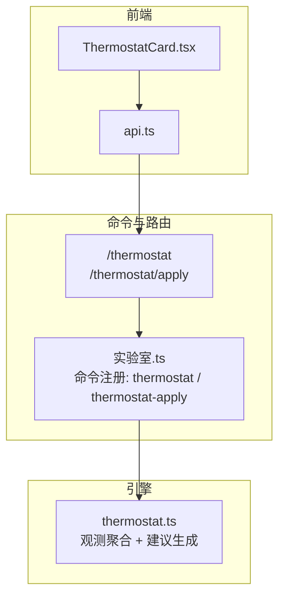
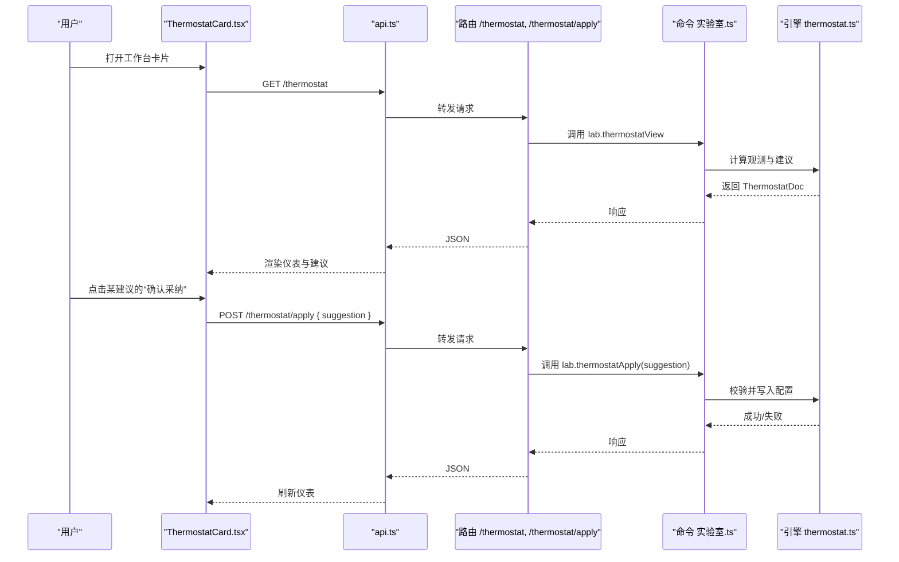
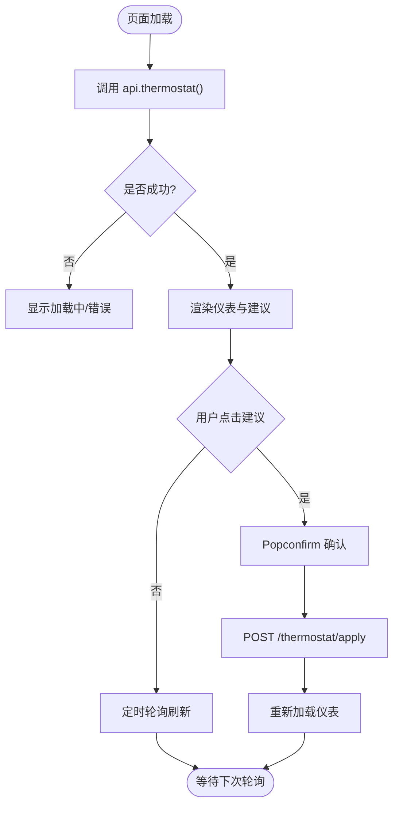
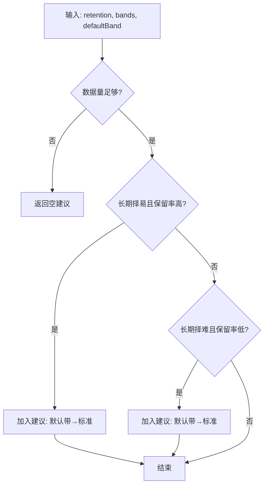
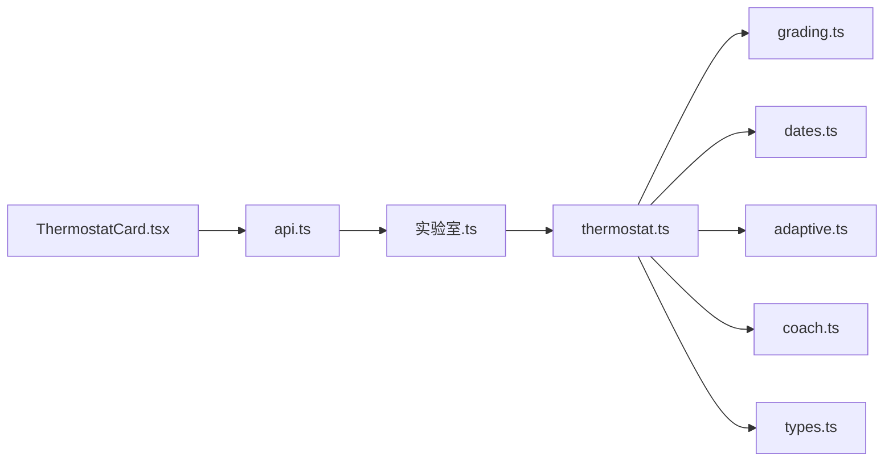

# 恒温器卡片

<cite>
**本文引用的文件**
- [ThermostatCard.tsx](file://ui/src/pages/WorkbenchPage/ThermostatCard.tsx)
- [thermostat.ts](file://src/engine/thermostat.ts)
- [实验室.ts](file://src/commands/实验室.ts)
- [api.ts](file://ui/src/api.ts)
- [types.ts](file://ui/src/types.ts)
- [0024-challenge-point-thermostat-propose-only.md](file://docs/adr/0024-challenge-point-thermostat-propose-only.md)
- [CONTEXT.md](file://CONTEXT.md)
- [host-routes-snapshot.json](file://tests/fixtures/host-routes-snapshot.json)
</cite>

## 目录
1. [简介](#简介)
2. [项目结构](#项目结构)
3. [核心组件](#核心组件)
4. [架构总览](#架构总览)
5. [详细组件分析](#详细组件分析)
6. [依赖关系分析](#依赖关系分析)
7. [性能与实时性](#性能与实时性)
8. [故障排查](#故障排查)
9. [结论](#结论)
10. [附录：调优指南与自定义配置](#附录：调优指南与自定义配置)

## 简介
恒温器卡片（ThermostatCard）是“挑战点恒温器”的学习强度调节器前端呈现。它作为跨区只读仪表，聚合课程区真实保留率、难度带长期选择分布、无界区执行事件评级以及项目区信息，并基于这些观测给出至多三条“建议”。关键原则来自 ADR-0024：恒温器不是自动控制器，任何参数调整必须由学习者显式确认后才生效。卡片通过低频轮询获取数据，展示当前状态与建议；用户点击“确认采纳”后，调用后端应用接口完成一次单一建议的落地。

## 项目结构
恒温器卡片涉及三层：
- 前端 UI：工作台的卡片组件，负责展示与交互
- 命令与路由：将前端请求映射到引擎入口，并提供 HTTP 路由
- 引擎算法：纯函数实现跨区观测聚合与建议生成

图表来源
- [ThermostatCard.tsx:14-39](file://ui/src/pages/WorkbenchPage/ThermostatCard.tsx#L14-L39)
- [api.ts:248-251](file://ui/src/api.ts#L248-L251)
- [实验室.ts:173-215](file://src/commands/实验室.ts#L173-L215)
- [thermostat.ts:20-139](file://src/engine/thermostat.ts#L20-L139)

章节来源
- [ThermostatCard.tsx:1-103](file://ui/src/pages/WorkbenchPage/ThermostatCard.tsx#L1-L103)
- [api.ts:248-251](file://ui/src/api.ts#L248-L251)
- [实验室.ts:173-215](file://src/commands/实验室.ts#L173-L215)
- [thermostat.ts:20-139](file://src/engine/thermostat.ts#L20-L139)

## 核心组件
- 前端卡片 ThermostatCard：加载数据、展示三区观测、旋钮状态与建议；提供“确认采纳”的显式操作入口
- 引擎恒温器 thermostat.ts：定义观测窗口、低数据阈值、保留率带划分、难度带选择分布、执行事件评级分布与建议生成逻辑
- 命令与路由：暴露 GET /thermostat 与 POST /thermostat/apply，分别用于读取仪表与接受单条建议
- API 客户端：封装对 /thermostat 与 /thermostat/apply 的调用
- 类型定义：ThermostatDoc 由命令输出派生，保证前后端契约一致

章节来源
- [ThermostatCard.tsx:14-39](file://ui/src/pages/WorkbenchPage/ThermostatCard.tsx#L14-L39)
- [thermostat.ts:20-139](file://src/engine/thermostat.ts#L20-L139)
- [实验室.ts:173-215](file://src/commands/实验室.ts#L173-L215)
- [api.ts:248-251](file://ui/src/api.ts#L248-L251)
- [types.ts:71-72](file://ui/src/types.ts#L71-L72)

## 架构总览
恒温器遵循“提议面”设计：引擎仅产出只读建议，写侧零自动调整；所有变更需学习者确认后走既有配置入口。

图表来源
- [ThermostatCard.tsx:18-39](file://ui/src/pages/WorkbenchPage/ThermostatCard.tsx#L18-L39)
- [api.ts:248-251](file://ui/src/api.ts#L248-L251)
- [实验室.ts:173-215](file://src/commands/实验室.ts#L173-L215)
- [thermostat.ts:86-117](file://src/engine/thermostat.ts#L86-L117)

## 详细组件分析

### 前端卡片：ThermostatCard.tsx
- 数据加载：挂载即拉取一次，随后按标签页切换进行低频轮询（60秒），避免频繁请求
- 展示内容：
  - 课程区：真实保留率及“难度带长期选择”占比（简单/标准/挑战）
  - 无界区：执行事件评级计数（尚未上线时为提示空态）
  - 项目区：项目列表与档位（v1 为占位信息）
  - 旋钮状态：当前可观察到的旋钮项（如目标难度带默认值等）
  - 建议清单：至多三条，逐条显示“确认采纳”，使用 Popconfirm 二次确认
- 交互流程：
  - 点击“确认采纳”→ 调用 api.thermostatApply(suggestion.id) → 成功后刷新仪表
  - 错误处理：统一捕获并显示错误消息

图表来源
- [ThermostatCard.tsx:18-39](file://ui/src/pages/WorkbenchPage/ThermostatCard.tsx#L18-L39)
- [ThermostatCard.tsx:78-95](file://ui/src/pages/WorkbenchPage/ThermostatCard.tsx#L78-L95)

章节来源
- [ThermostatCard.tsx:14-103](file://ui/src/pages/WorkbenchPage/ThermostatCard.tsx#L14-L103)

### 引擎算法：thermostat.ts
- 观测窗口与门槛：
  - 窗口：30 天（THERMOSTAT_WINDOW_DAYS）
  - 低数据静默：会话数、作答量、真实保留推进量低于阈值时不产生建议
- 指标计算：
  - 保留率带：根据真实保留率分三段（很高/适中/偏低/无数据）
  - 难度带选择分布：统计窗口内各带占比（easy/standard/hard）
  - 执行事件评级分布：统计 rating_source='execution' 的评级分布
- 建议生成规则（≤3 条）：
  - 长期择易且保留率很高 → 建议将默认难度带从非标准提升到标准
  - 长期择难且保留率偏低 → 建议将默认难度带回落到标准
  - 同向不重复：若当前默认已是目标值则沉默
- 数据结构：
  - ThermostatDoc：包含课程区、无界区、项目区、旋钮状态与建议清单
  - ThermostatSuggestion：每条建议含 id、knob、标题、文本与 apply 动作

图表来源
- [thermostat.ts:20-34](file://src/engine/thermostat.ts#L20-L34)
- [thermostat.ts:36-69](file://src/engine/thermostat.ts#L36-L69)
- [thermostat.ts:86-117](file://src/engine/thermostat.ts#L86-L117)

章节来源
- [thermostat.ts:20-139](file://src/engine/thermostat.ts#L20-L139)

### 命令与路由：实验室.ts
- 命令定义：
  - thermostat：GET /thermostat → 引擎 lab.thermostatView
  - thermostat-apply：POST /thermostat/apply → 引擎 lab.thermostatApply(suggestion)
- 通道：同时支持 agent 工具与面板路由
- 约束：仅接受当前仪表提供的 suggestion id，防止伪造或过期 id 生效

章节来源
- [实验室.ts:173-215](file://src/commands/实验室.ts#L173-L215)
- [host-routes-snapshot.json:1862-1883](file://tests/fixtures/host-routes-snapshot.json#L1862-L1883)

### API 客户端与类型：api.ts、types.ts
- api.ts 暴露：
  - thermostat(): GET /thermostat
  - thermostatApply(suggestion): POST /thermostat/apply
- types.ts 中 ThermostatDoc 与 ThermostatSuggestion 从命令输出派生，确保前后端类型一致

章节来源
- [api.ts:248-251](file://ui/src/api.ts#L248-L251)
- [types.ts:71-72](file://ui/src/types.ts#L71-L72)

## 依赖关系分析
- 前端依赖：
  - @arco-design/web-react 组件库（Card、Alert、Button、Popconfirm、Typography）
  - 本地 hooks：usePolling 用于低频轮询
  - 本地 api 模块：封装 HTTP 请求
- 命令层依赖：
  - 命令注册表：将 /thermostat 与 /thermostat/apply 绑定到引擎入口
- 引擎层依赖：
  - grading.ts：round2、pctOf 等数值工具
  - dates.ts：DAY_MS、calendarDayOf 时间工具
  - adaptive.ts：BandPref 类型（easy/standard/hard）
  - coach.ts：BandRec 类型（难度带记录）
  - types.ts：ReviewRec 类型（复习日志）

图表来源
- [ThermostatCard.tsx:5-10](file://ui/src/pages/WorkbenchPage/ThermostatCard.tsx#L5-L10)
- [api.ts:248-251](file://ui/src/api.ts#L248-L251)
- [实验室.ts:173-215](file://src/commands/实验室.ts#L173-L215)
- [thermostat.ts:14-18](file://src/engine/thermostat.ts#L14-L18)

章节来源
- [thermostat.ts:14-18](file://src/engine/thermostat.ts#L14-L18)
- [实验室.ts:173-215](file://src/commands/实验室.ts#L173-L215)

## 性能与实时性
- 轮询策略：60 秒低频轮询，仅在课程标签激活时轮询，减少不必要请求
- 低数据静默：当窗口内数据不足时不产生建议，避免误报与无效刷新
- 只读仪表：引擎仅做聚合计算，无复杂模型推理，响应轻量
- 建议确认门控：仅接受仪表提供的 suggestion id，降低无效写入与重试开销

[本节为通用指导，不直接分析具体文件]

## 故障排查
- 无法加载仪表：
  - 检查网络与 /learnhub/api/thermostat 可达性
  - 查看浏览器控制台错误与 API 响应体中的 error 字段
- 建议未出现：
  - 可能处于低数据静默期（会话数/作答量/真实保留推进量不足）
  - 检查最近 30 天的难度带选择与到期复习数据是否充足
- 确认采纳失败：
  - 确认 suggestion id 是否为当前仪表提供（过时或伪造会被拒绝）
  - 检查 POST /thermostat/apply 的请求体是否包含必填字段 suggestion
- 无界区执行事件为空：
  - v1 阶段该通道尚未上线，属于预期空态

章节来源
- [host-routes-snapshot.json:1862-1883](file://tests/fixtures/host-routes-snapshot.json#L1862-L1883)
- [thermostat.ts:20-34](file://src/engine/thermostat.ts#L20-L34)

## 结论
恒温器卡片以“提议面”为核心，提供跨区只读仪表与保守建议，确保学习者在知情与可控的前提下调整学习强度。其优势在于：
- 不破坏现有调度与评测体系（零新度量、零自动调整）
- 低数据静默避免误导
- 明确的用户确认门控保障安全
- 前端简洁直观，便于理解与操作

[本节为总结性内容，不直接分析具体文件]

## 附录：调优指南与自定义配置
- 调优目标：
  - 保持“可用的困难”在舒适与挑战之间平衡，避免长期过易或过难
  - 依据真实保留率与难度带选择分布微调默认难度带
- 操作步骤：
  - 观察课程区真实保留率与难度带选择分布
  - 若长期择易且保留率很高，考虑采纳“默认难度带→标准”的建议
  - 若长期择难且保留率偏低，考虑采纳“默认难度带→标准”的建议
  - 每次仅采纳一条建议，观察后续变化再决定是否继续
- 注意事项：
  - 建议仅在当前仪表提供时有效，不可手动构造 suggestion id
  - 每会话仍可显式覆盖默认难度带，不影响最终体验
  - 无界区与项目区数据随后续版本逐步完善，v1 以课程区为主
- 参考概念：
  - 难度带：会话级偏好（简单/标准/挑战），影响 A1 自动选题的带权偏好
  - 挑战点：功能任务难度与学习者技能的个体化交点，因人而异、随水平移动

章节来源
- [CONTEXT.md:223-229](file://CONTEXT.md#L223-L229)
- [0024-challenge-point-thermostat-propose-only.md:1-13](file://docs/adr/0024-challenge-point-thermostat-propose-only.md#L1-L13)
- [thermostat.ts:86-117](file://src/engine/thermostat.ts#L86-L117)