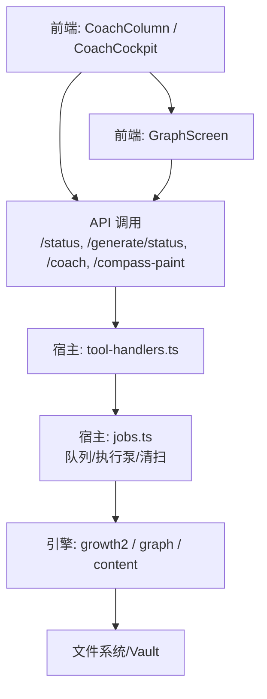
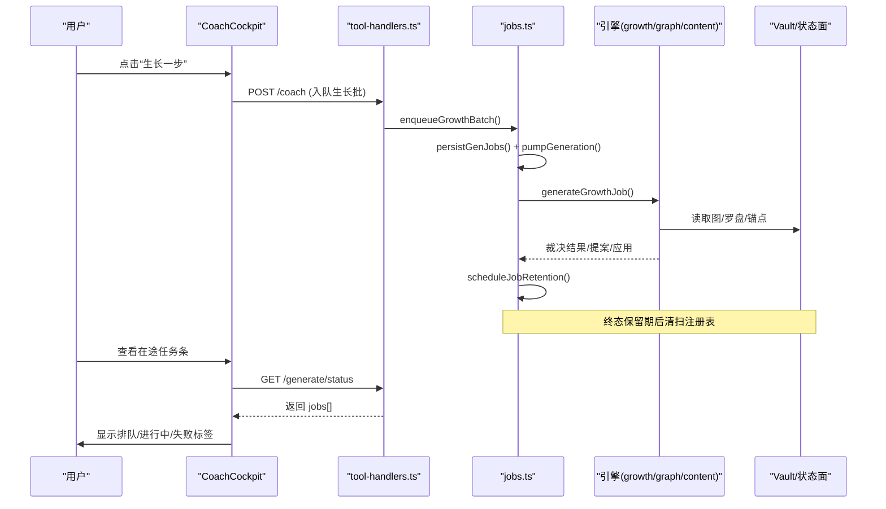
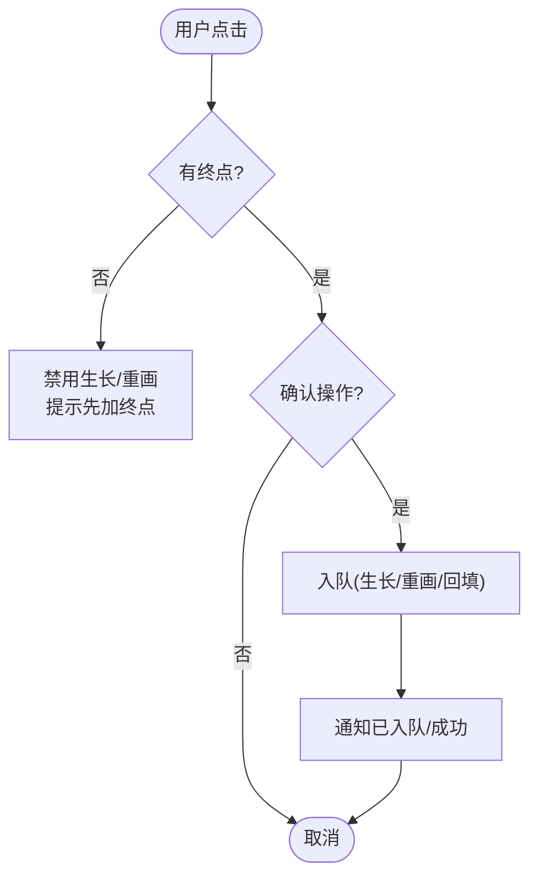
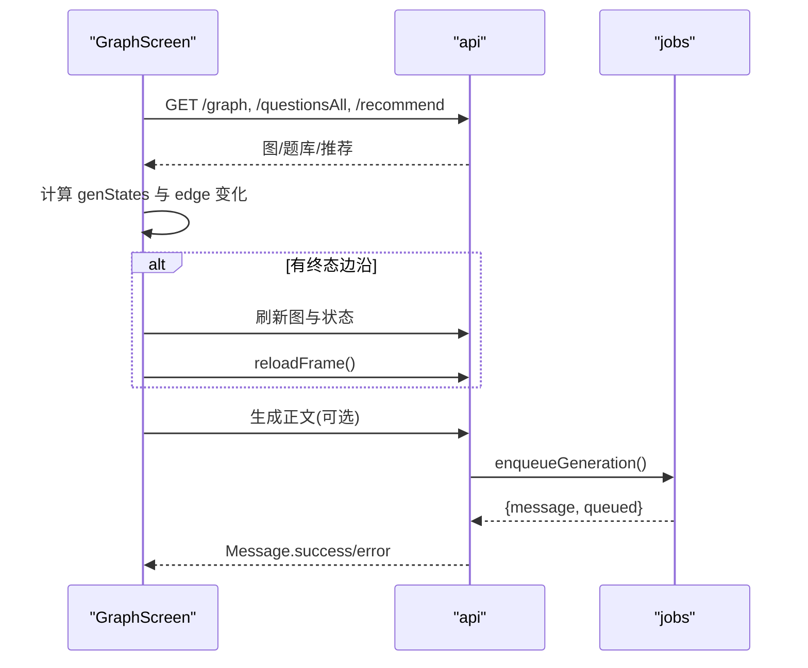
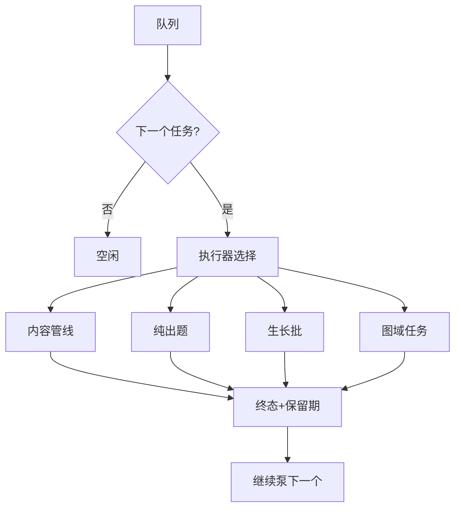
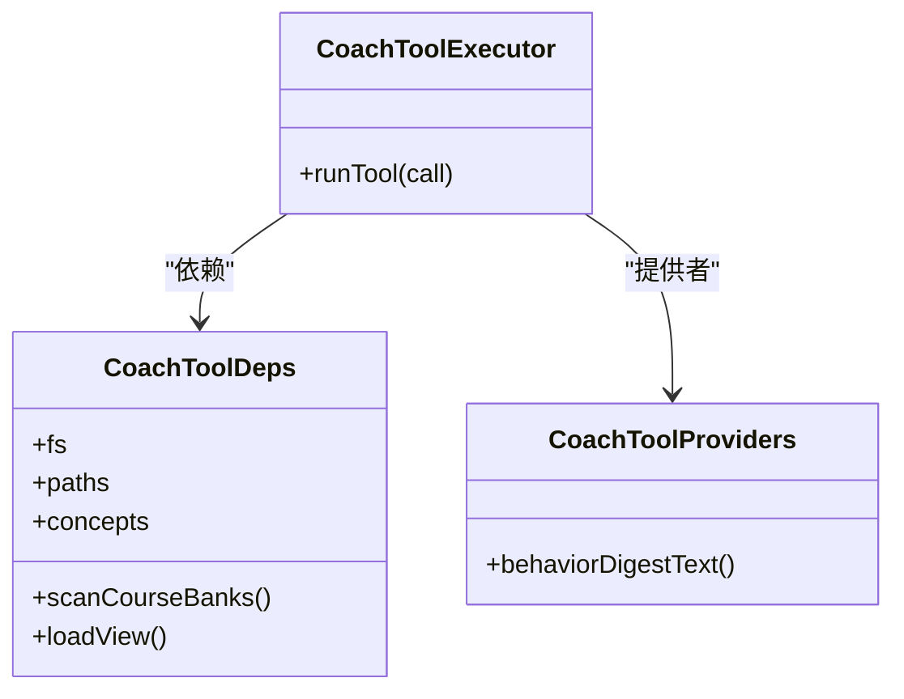
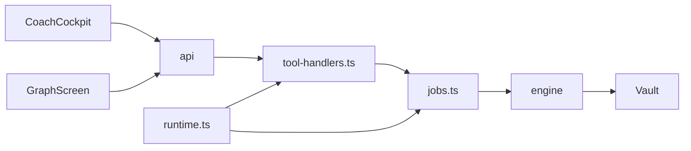

# 教练工具列

<cite>
**本文引用的文件**
- [CoachColumn.tsx](file://ui/src/pages/WorkbenchPage/CoachColumn.tsx)
- [CoachCockpit.tsx](file://ui/src/components/CoachCockpit.tsx)
- [GraphScreen.tsx](file://ui/src/pages/WorkbenchPage/GraphScreen.tsx)
- [coach-tools.ts](file://src/engine/coach-tools.ts)
- [jobs.ts](file://src/host/jobs.ts)
- [tool-handlers.ts](file://src/host/tool-handlers.ts)
- [runtime.ts](file://src/host/runtime.ts)
- [usePolling.ts](file://ui/src/hooks/usePolling.ts)
- [types.ts](file://ui/src/types.ts)
</cite>

## 目录
1. [简介](#简介)
2. [项目结构](#项目结构)
3. [核心组件](#核心组件)
4. [架构总览](#架构总览)
5. [详细组件分析](#详细组件分析)
6. [依赖关系分析](#依赖关系分析)
7. [性能考量](#性能考量)
8. [故障排查指南](#故障排查指南)
9. [结论](#结论)
10. [附录：扩展与自定义配置](#附录：扩展与自定义配置)

## 简介
本文件面向“教练工具列”（CoachColumn）的完整文档，聚焦课程生成与管理的核心界面。内容涵盖：
- 生成任务的注册、轮询、状态更新与错误处理
- 与 GraphScreen 的数据共享与任务队列管理
- 用户操作的反馈机制
- 教练工具的只读视图白名单与执行器
- 扩展开发与自定义配置指南

## 项目结构
教练工具列由前端页面、组件与宿主后端协作完成：
- 前端页面 CoachColumn 负责承载教练台卡片，并注入就绪深度、终点数探针等上下文
- 组件 CoachCockpit 提供建课、生长一步、罗盘重画、回填等操作入口，以及就绪深度与复诊卡片
- GraphScreen 展示学习图、终点面板、推荐条与节点生成态角标，并与 CoachColumn 共享 jobs
- 宿主 jobs.ts 维护全局生成队列、任务注册表、执行泵与清理策略
- tool-handlers.ts 暴露 agent/面板可调用接口，将操作入队或等待终态
- coach-tools.ts 定义教练只读工具面（七件），用于裁决前证据采集
- runtime.ts 提供运行时对象（引擎、agent、语料捕获、任务表、标志位）
- usePolling.ts 提供页签保活轮询钩子，统一轮询节拍与事件补取

图表来源
- [CoachColumn.tsx:14-47](file://ui/src/pages/WorkbenchPage/CoachColumn.tsx#L14-L47)
- [CoachCockpit.tsx:142-253](file://ui/src/components/CoachCockpit.tsx#L142-L253)
- [GraphScreen.tsx:149-383](file://ui/src/pages/WorkbenchPage/GraphScreen.tsx#L149-L383)
- [tool-handlers.ts:23-288](file://src/host/tool-handlers.ts#L23-L288)
- [jobs.ts:269-740](file://src/host/jobs.ts#L269-L740)

章节来源
- [CoachColumn.tsx:14-47](file://ui/src/pages/WorkbenchPage/CoachColumn.tsx#L14-L47)
- [GraphScreen.tsx:149-383](file://ui/src/pages/WorkbenchPage/GraphScreen.tsx#L149-L383)
- [jobs.ts:269-740](file://src/host/jobs.ts#L269-L740)

## 核心组件
- CoachColumn：课程维度的教练台容器，注入 course、jobs、endpointCount，并委托 CoachCockpit 渲染具体能力
- CoachCockpit：教练台核心交互区，包含：
  - 就绪深度卡（教练回合判据可视化）
  - 复诊卡（插入边实验状态与结算）
  - 在途任务条（点击跳转生成队列定位任务）
  - 建课/生长一步/罗盘重画/回填按钮
- GraphScreen：学习图主屏，展示终点面板、推荐条、DAG 图，并在节点上显示排队/运行角标；当活动任务出现终态边沿时刷新图与状态面
- jobs.ts：全局生成队列与任务注册表，单并发 FIFO 执行泵，支持内容管线、纯出题、生长批、图域任务；提供入队、等待终态、保留期清扫、失败补标等能力
- tool-handlers.ts：工具面处理器，将面板/agent 请求映射到入队或同步等待终态
- coach-tools.ts：教练只读工具面（七件），为裁决提供图面、节点卡、概念登记、行为摘要、题库概况、罗盘、终点锚等视图
- runtime.ts：运行时对象，集中引擎、agent、语料捕获、任务表、标志位与配置校验
- usePolling.ts：页签保活轮询钩子，统一轮询节拍与切回补取

章节来源
- [CoachCockpit.tsx:142-253](file://ui/src/components/CoachCockpit.tsx#L142-L253)
- [GraphScreen.tsx:149-383](file://ui/src/pages/WorkbenchPage/GraphScreen.tsx#L149-L383)
- [jobs.ts:269-740](file://src/host/jobs.ts#L269-L740)
- [tool-handlers.ts:23-288](file://src/host/tool-handlers.ts#L23-L288)
- [coach-tools.ts:30-304](file://src/engine/coach-tools.ts#L30-L304)
- [runtime.ts:23-133](file://src/host/runtime.ts#L23-L133)
- [usePolling.ts:1-48](file://ui/src/hooks/usePolling.ts#L1-L48)

## 架构总览
教练工具列通过“面板→宿主→队列→引擎→存储”的分层架构实现：
- 面板发起操作（如“生长一步”“罗盘重画”“生成正文”）
- 宿主 tool-handlers 将操作转为入队或同步等待终态
- jobs.ts 的单并发执行泵按 FIFO 顺序执行任务，记录状态与消息
- 引擎子系统（growth/graph/content）执行业务逻辑，必要时落盘 Vault
- 前端通过 /status 与 /generate/status 轮询获取状态，使用 usePolling 保证页签保活与切回补取

图表来源
- [CoachCockpit.tsx:153-181](file://ui/src/components/CoachCockpit.tsx#L153-L181)
- [tool-handlers.ts:72-80](file://src/host/tool-handlers.ts#L72-L80)
- [jobs.ts:454-479](file://src/host/jobs.ts#L454-L479)
- [jobs.ts:640-688](file://src/host/jobs.ts#L640-L688)
- [jobs.ts:378-392](file://src/host/jobs.ts#L378-L392)

## 详细组件分析

### 教练台容器：CoachColumn
- 作用：为指定课程渲染教练台卡片，注入 endpointCount（轻量探针：读取图 doc 的 endpoints 长度），并将 onOpenJob 回调至 frame.locateJob
- 关键点：
  - 监听 learnhub:reload 事件以刷新 endpointCount
  - 从 frame.status.courses 中取出该课程的 coach 就绪深度信息
  - 将 jobs 透传给 CoachCockpit，用于在途任务条展示

章节来源
- [CoachColumn.tsx:14-47](file://ui/src/pages/WorkbenchPage/CoachColumn.tsx#L14-L47)

### 教练台交互：CoachCockpit
- 就绪深度卡：基于 StatusCourse.coach 计算进度条与告警，区分冷启动首周与尾段前沿清空（exhausted）
- 复诊卡：低频轮询（30s）加载 probation 数据，支持立即结算
- 在途任务条：展示 jobs 列表，点击跳转到生成队列对应任务
- 操作入口：
  - 新建课程：打开 SeedFormModal
  - 生长一步：确认弹窗后调用 api.coachGrowth，成功后通知已入队
  - 罗盘重画：调用 api.compassPaint，入队并提示
  - 回填成分技能边：调用 api.encBackfill，提示见提案收件箱
- 零终点保护：无终点时禁用“生长一步”和“罗盘重画”，并给出引导文案

图表来源
- [CoachCockpit.tsx:153-226](file://ui/src/components/CoachCockpit.tsx#L153-L226)

章节来源
- [CoachCockpit.tsx:28-135](file://ui/src/components/CoachCockpit.tsx#L28-L135)
- [CoachCockpit.tsx:142-253](file://ui/src/components/CoachCockpit.tsx#L142-L253)

### 学习图与任务投影：GraphScreen
- 数据加载：优先加载图（失败显式失败态+重试），题库与推荐缺省为空
- 生成角标：根据 jobs 投影本课节点的 queued/running 状态；当活动任务出现终态边沿时触发 load 与 reloadFrame
- 过滤与锁定：支持按区域、搜索、只看进行中过滤；计算 lockedIds 防止对未就绪节点编辑
- 便捷生成：未生成直接入队；已生成需确认覆盖正文（题库保留）
- 终点面板：添加/删除终点，立即写盘不触发生成；显示交汇节点与最后台阶

图表来源
- [GraphScreen.tsx:164-202](file://ui/src/pages/WorkbenchPage/GraphScreen.tsx#L164-L202)
- [GraphScreen.tsx:255-274](file://ui/src/pages/WorkbenchPage/GraphScreen.tsx#L255-L274)
- [jobs.ts:292-322](file://src/host/jobs.ts#L292-L322)

章节来源
- [GraphScreen.tsx:149-383](file://ui/src/pages/WorkbenchPage/GraphScreen.tsx#L149-L383)

### 生成队列与执行泵：jobs.ts
- 入队：
  - 内容生成：enqueueGeneration，拒绝终点节点，幂等重复入队
  - 纯出题：enqueueQuizGeneration，复用队列，互斥同节点
  - 生长批：enqueueGrowthBatch，阻尼防循环，支持 inject/force 豁免
  - 图域任务：enqueueGraphJob，phase=seed/compass/decompile/plan/milestone
- 执行泵：pumpGeneration，单并发 FIFO，按 phase 分发到不同执行器
- 终态保留与清扫：scheduleJobRetention，按状态保留期（成功30分钟，失败24小时）后清出注册表；sweepGenJobs 清理悬空任务
- 教练触点：sessionStartCheckpoint、coachTriggerDetached 在会话开始与队列空闲时检查就绪深度并自动拉批
- 失败补标：failCorpus 将最近一条捕获的失败标注到语料站，便于回溯

图表来源
- [jobs.ts:269-322](file://src/host/jobs.ts#L269-L322)
- [jobs.ts:324-350](file://src/host/jobs.ts#L324-L350)
- [jobs.ts:454-479](file://src/host/jobs.ts#L454-L479)
- [jobs.ts:549-567](file://src/host/jobs.ts#L549-L567)
- [jobs.ts:690-740](file://src/host/jobs.ts#L690-L740)
- [jobs.ts:378-437](file://src/host/jobs.ts#L378-L437)

章节来源
- [jobs.ts:269-740](file://src/host/jobs.ts#L269-L740)

### 工具面处理器：tool-handlers.ts
- 将面板/agent 请求映射到宿主能力：
  - learnhub_generate → enqueueGeneration
  - learnhub_question_generate → enqueueQuizGeneration + waitForGenJob
  - learnhub_compass_paint → enqueueGraphJob(phase=compass) + waitForGenJob
  - learnhub_coach → 教练建议
  - learnhub_probation → 复诊状态/结算
  - 其他：跳过/完成/推荐/今日钉/睡眠配置/图提案/应用/项目/技能/习惯/Anki/数据检查/参数优化等
- 关键特性：
  - 所有长耗时操作均走队列，避免阻塞
  - 部分工具同步等待终态（如 compass paint、question generate），适合 agent 场景
  - apply 出口联动清扫悬空任务记录

章节来源
- [tool-handlers.ts:23-288](file://src/host/tool-handlers.ts#L23-L288)

### 教练只读工具面：coach-tools.ts
- 白名单七件：graph_view、node_card、concept_registry、behavior_digest、bank_overview、compass_read、endpoint_anchor
- 执行器：coachToolExecutor，仅读视图，白名单外调用 fail loud（isError 回灌）
- 依赖注入：CoachToolDeps（fs、paths、concepts、scanCourseBanks、loadView）、CoachToolProviders（behaviorDigestText）
- 用途：裁决前证据采集，确保 ops 的节点名、pre 引用、region/block 等来自事实源

图表来源
- [coach-tools.ts:219-304](file://src/engine/coach-tools.ts#L219-L304)

章节来源
- [coach-tools.ts:30-304](file://src/engine/coach-tools.ts#L30-L304)

### 运行时与类型：runtime.ts、types.ts
- runtime.ts：HostRuntime 集中引擎、agent、语料捕获、任务表、标志位；createHostRuntime 装配路径、模型、抽样率等
- types.ts：UI 类型来源单一事实源（引擎 views、命令 output、宿主 generationStatus），避免手工镜像

章节来源
- [runtime.ts:23-133](file://src/host/runtime.ts#L23-L133)
- [types.ts:1-93](file://ui/src/types.ts#L1-L93)

## 依赖关系分析
- 前端依赖：
  - CoachColumn → CoachCockpit、ThermostatCard、api、AppFrame
  - GraphScreen → GraphDagView、CompassCard、api、hooks
  - CoachCockpit → SeedFormModal、api、usePolling、useCommand
- 宿主依赖：
  - tool-handlers → jobs、llm、corpus、runtime
  - jobs → engine（growth2/graph/content/bank/sched）、generation-jobs、llm、corpus
  - runtime → engine、agent、vault-fs、clock、corpus
- 耦合与内聚：
  - 队列与执行泵高度内聚于 jobs.ts，对外暴露清晰入队/等待/清扫接口
  - 工具面解耦：coach-tools.ts 通过依赖注入访问引擎视图，避免环依赖
  - 前端状态投影：GraphScreen 仅消费 jobs prop，不直接修改队列

图表来源
- [CoachCockpit.tsx:142-253](file://ui/src/components/CoachCockpit.tsx#L142-L253)
- [GraphScreen.tsx:149-383](file://ui/src/pages/WorkbenchPage/GraphScreen.tsx#L149-L383)
- [tool-handlers.ts:23-288](file://src/host/tool-handlers.ts#L23-L288)
- [jobs.ts:269-740](file://src/host/jobs.ts#L269-L740)
- [runtime.ts:118-133](file://src/host/runtime.ts#L118-L133)

章节来源
- [jobs.ts:269-740](file://src/host/jobs.ts#L269-L740)
- [tool-handlers.ts:23-288](file://src/host/tool-handlers.ts#L23-L288)
- [runtime.ts:118-133](file://src/host/runtime.ts#L118-L133)

## 性能考量
- 单并发执行泵：避免资源竞争与写冲突，保证队列有序
- 任务保留期：成功30分钟、失败24小时，平衡可观测性与内存占用
- 轮询节流：usePolling 支持页签激活/闲置差异化间隔，减少无效请求
- 视图裁剪：coach-tools.ts 对图名与列表设置上限（GRAPH_NAMES_CAP/LIST_CAP），防止膨胀
- 失败补标：failCorpus 将最近一条捕获标注到语料站，便于离线复盘而不影响主流程

[本节为通用性能讨论，无需特定文件引用]

## 故障排查指南
- 生成任务档损坏（broken）：
  - 现象：入队/恢复队列被拒绝，提示任务档损坏原因与修复指引
  - 处理：修复任务档后重启，清扫延后至修档重启
  - 参考：assertQueueWritable、sweepGenJobs
- 终点禁止生成：
  - 现象：对终点节点生成被拒，带 ENDPOINT_GENERATION_FORBIDDEN 码
  - 处理：终点是方向标记，不被学习调度；如需调整请通过教练回合裁决
- 任务超时：
  - 现象：waitForGenJob 等待超时
  - 处理：稍后在生成队列查看结果，或重试
- 轮询异常：
  - 现象：页签切换后状态未更新
  - 处理：usePolling 会在切回时补取；检查 learnhub:tab 事件与 isActiveTab

章节来源
- [jobs.ts:271-286](file://src/host/jobs.ts#L271-L286)
- [jobs.ts:292-302](file://src/host/jobs.ts#L292-L302)
- [jobs.ts:353-376](file://src/host/jobs.ts#L353-L376)
- [usePolling.ts:1-48](file://ui/src/hooks/usePolling.ts#L1-L48)

## 结论
教练工具列通过清晰的职责分层与严格的队列纪律，实现了课程生成与管理的可靠闭环：
- 前端提供直观的操作入口与实时状态反馈
- 宿主队列保障执行有序与可追溯
- 引擎裁决与只读工具面确保决策依据充分
- 轮询与保留期机制提升用户体验与可观测性

[本节为总结，无需特定文件引用]

## 附录：扩展与自定义配置

### 扩展教练只读工具面
- 新增工具步骤：
  1. 在 COACH_TOOL_NAMES 中添加新工具名
  2. 在 coachToolSpecs 中声明 JSON Schema 参数
  3. 在 coachToolExecutor 的 switch 分支中实现执行逻辑
  4. 通过 CoachToolDeps/CoachToolProviders 注入所需依赖
- 约束：
  - 仅允许只读视图，写路径必须走提案→受理门→apply
  - 白名单外调用 fail loud，错误回灌给模型可见

章节来源
- [coach-tools.ts:30-35](file://src/engine/coach-tools.ts#L30-L35)
- [coach-tools.ts:235-249](file://src/engine/coach-tools.ts#L235-L249)
- [coach-tools.ts:251-297](file://src/engine/coach-tools.ts#L251-L297)

### 自定义配置项（LearnhubConfig）
- vault：学习中心根目录绝对路径（必填）
- centerRel：学习中心相对路径（默认“学习中心”）
- provider/model：AI 生成/判卷的 provider 与模型
- fastEffort/deepEffort：思考档位（off/low），高复杂度节点用 deep
- quizAuditRate：出题第二意见门抽样率（0–1，0=关门）
- corpusDir：生成语料落盘目录覆盖

章节来源
- [runtime.ts:23-44](file://src/host/runtime.ts#L23-L44)
- [runtime.ts:138-193](file://src/host/runtime.ts#L138-L193)

### 队列与任务扩展
- 新增图域任务 phase：
  - 在 GRAPH_JOB_PHASES 中添加 phase
  - 在 GRAPH_JOB_STATIONS 中映射语料站名
  - 在 generateGraphJob 中实现执行逻辑
- 入队保护：
  - assertQueueWritable 防止 broken 态写入
  - 同键在途防重入，终态覆盖语义

章节来源
- [jobs.ts:549-567](file://src/host/jobs.ts#L549-L567)
- [jobs.ts:569-638](file://src/host/jobs.ts#L569-L638)
- [jobs.ts:690-740](file://src/host/jobs.ts#L690-L740)

### 前端轮询与状态投影
- 使用 usePolling 统一轮询节拍，支持页签激活/闲置差异与切回补取
- GraphScreen 通过 jobs prop 投影节点生成态，并在终态边沿触发刷新
- CoachCockpit 在途任务条点击跳转生成队列定位任务

章节来源
- [usePolling.ts:1-48](file://ui/src/hooks/usePolling.ts#L1-L48)
- [GraphScreen.tsx:186-202](file://ui/src/pages/WorkbenchPage/GraphScreen.tsx#L186-L202)
- [CoachCockpit.tsx:227-246](file://ui/src/components/CoachCockpit.tsx#L227-L246)