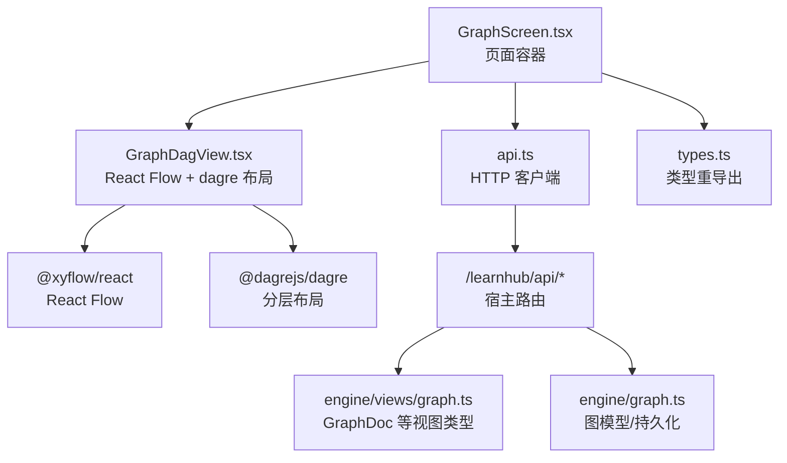
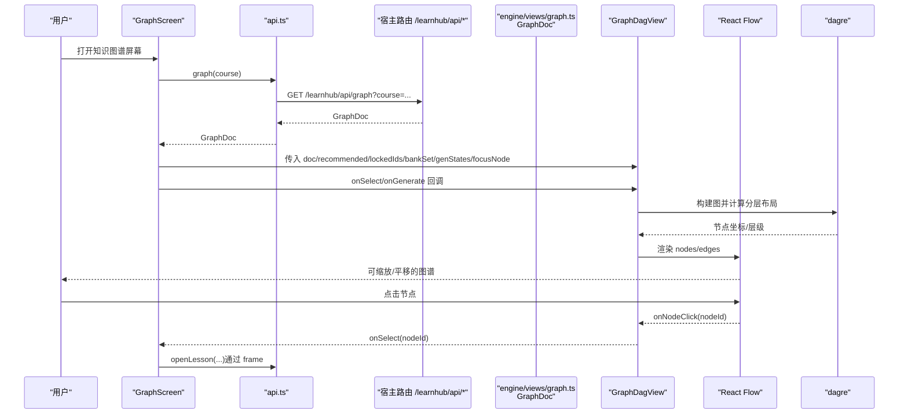
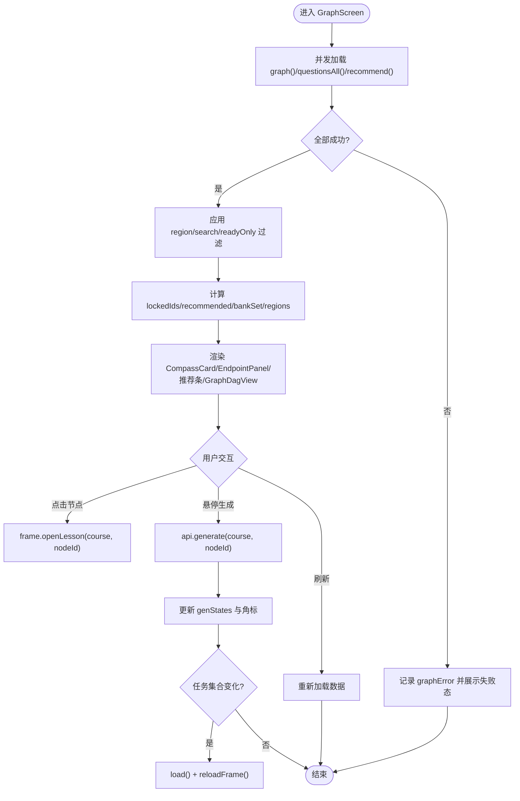
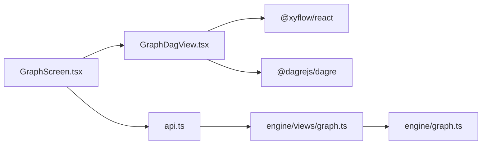

# 知识图谱屏幕

<cite>
**本文引用的文件**
- [GraphScreen.tsx](file://ui/src/pages/WorkbenchPage/GraphScreen.tsx)
- [GraphDagView.tsx](file://ui/src/components/GraphDagView.tsx)
- [graph.ts（视图类型）](file://src/engine/views/graph.ts)
- [graph.ts（图模型与持久化）](file://src/engine/graph.ts)
- [api.ts](file://ui/src/api.ts)
- [types.ts](file://ui/src/types.ts)
</cite>

## 目录
1. [简介](#简介)
2. [项目结构](#项目结构)
3. [核心组件](#核心组件)
4. [架构总览](#架构总览)
5. [详细组件分析](#详细组件分析)
6. [依赖关系分析](#依赖关系分析)
7. [性能考量](#性能考量)
8. [故障排查指南](#故障排查指南)
9. [结论](#结论)
10. [附录](#附录)

## 简介
本文件面向“知识图谱屏幕”，围绕 GraphScreen 组件作为学习图可视化核心界面，系统说明：
- 图谱渲染、节点交互、边关系展示
- 图谱数据加载与处理流程
- Canvas/SVG 渲染引擎选择与权衡
- 性能优化策略（视口裁剪、布局计算、最小重绘）
- 节点的拖拽、缩放、平移能力
- 与生成任务的联动机制（排队/运行态角标、终态边沿刷新）
- 图谱定制扩展与第三方库集成指南（React Flow + dagre）

## 项目结构
知识图谱屏幕由“页面容器 GraphScreen”与“可视化组件 GraphDagView”组成，数据来自宿主 API，类型定义统一从引擎视图导出。

图表来源
- [GraphScreen.tsx:149-383](file://ui/src/pages/WorkbenchPage/GraphScreen.tsx#L149-L383)
- [GraphDagView.tsx:1-317](file://ui/src/components/GraphDagView.tsx#L1-L317)
- [api.ts:43-50](file://ui/src/api.ts#L43-L50)
- [graph.ts（视图类型）:77-137](file://src/engine/views/graph.ts#L77-L137)
- [graph.ts（图模型与持久化）:198-443](file://src/engine/graph.ts#L198-L443)

章节来源
- [GraphScreen.tsx:149-383](file://ui/src/pages/WorkbenchPage/GraphScreen.tsx#L149-L383)
- [GraphDagView.tsx:1-317](file://ui/src/components/GraphDagView.tsx#L1-L317)
- [api.ts:43-50](file://ui/src/api.ts#L43-L50)
- [types.ts:34-52](file://ui/src/types.ts#L34-L52)

## 核心组件
- GraphScreen：页面级容器，负责数据加载、过滤、状态管理、与生成任务联动、终点面板、推荐条、罗盘卡片、以及将数据传递给 GraphDagView。
- GraphDagView：基于 React Flow 的 DAG 可视化组件，使用 dagre 进行分层布局，提供节点样式、边高亮、MiniMap、视口控制、定位聚焦等功能。

章节来源
- [GraphScreen.tsx:149-383](file://ui/src/pages/WorkbenchPage/GraphScreen.tsx#L149-L383)
- [GraphDagView.tsx:1-317](file://ui/src/components/GraphDagView.tsx#L1-L317)

## 架构总览
下图展示了从页面到可视化的完整调用链与数据流。

图表来源
- [GraphScreen.tsx:164-184](file://ui/src/pages/WorkbenchPage/GraphScreen.tsx#L164-L184)
- [GraphScreen.tsx:253-274](file://ui/src/pages/WorkbenchPage/GraphScreen.tsx#L253-L274)
- [GraphDagView.tsx:179-230](file://ui/src/components/GraphDagView.tsx#L179-L230)
- [GraphDagView.tsx:274-305](file://ui/src/components/GraphDagView.tsx#L274-L305)
- [api.ts:47-50](file://ui/src/api.ts#L47-L50)

## 详细组件分析

### GraphScreen：页面容器与业务编排
职责
- 数据加载：并发拉取图谱、题库、推荐；失败态显式区分（#158）。
- 过滤与派生：按区域、搜索词、就绪开关裁剪子图；计算锁定集合（前置未达则锁）、推荐集合、题库集合、区域列表。
- 生成任务联动：接收 jobs prop，投影为节点角标（queued/running），当活动任务集合变化时自动刷新图与框架状态。
- 交互入口：节点点击进入学习视图；悬停工具条触发“生成正文/重新生成”。
- 终点面板：添加/删除终点（纯声明落盘，不触发生成），显示每终点状态、最后台阶、交汇节点信息。
- 三态展示：加载中、失败、空图（零节点合法）分别渲染不同 UI。

关键流程
- 加载流程：先加载主数据 graph()，再并行加载 questionsAll() 与 recommend()，任一失败不影响次要数据。
- 过滤流程：region/readyOnly/search 组合过滤节点，同时裁剪边以保持一致性。
- 锁定计算：根据前置阶段判断是否锁定（跳过视为已通过）。
- 生成联动：维护 activeKeysRef 检测任务边沿变化，触发 load() 与 reloadFrame()。

章节来源
- [GraphScreen.tsx:164-202](file://ui/src/pages/WorkbenchPage/GraphScreen.tsx#L164-L202)
- [GraphScreen.tsx:204-247](file://ui/src/pages/WorkbenchPage/GraphScreen.tsx#L204-L247)
- [GraphScreen.tsx:253-274](file://ui/src/pages/WorkbenchPage/GraphScreen.tsx#L253-L274)
- [GraphScreen.tsx:276-324](file://ui/src/pages/WorkbenchPage/GraphScreen.tsx#L276-L324)
- [GraphScreen.tsx:326-383](file://ui/src/pages/WorkbenchPage/GraphScreen.tsx#L326-L383)

### GraphDagView：可视化与交互
职责
- 布局：使用 dagre 进行自底向上（BT）分层布局，固定节点尺寸，确保边端点正确对齐。
- 渲染：基于 React Flow 渲染节点与边，支持背景网格、控件、MiniMap、视口 fitView。
- 视觉编码：五态色板、掌握度底色深浅、推荐琥珀描边、锁定虚线半透明、终点品红双边框与“⚑终”角标、内容三态角标（文/队/生）。
- 交互：节点点击跳转学习视图；支持缩放、平移；可选视口裁剪提升大图性能；焦点节点居中定位。

关键实现
- 布局函数 layoutDag：构造 dagre 图，设置 rankdir=BT、间距、边箭头样式，映射为 React Flow elements。
- 节点样式：根据 stage/mastery/isEndpoint/recommended/locked 动态决定边框、底色、角标与工具条。
- 性能开关：当节点数超过阈值时启用 onlyRenderVisibleElements 仅渲染可见元素，避免大图卡顿。
- 定位聚焦：onInit 与 useEffect 中调用 setCenter 将画布居中到 focusNode。

章节来源
- [GraphDagView.tsx:29-58](file://ui/src/components/GraphDagView.tsx#L29-L58)
- [GraphDagView.tsx:89-173](file://ui/src/components/GraphDagView.tsx#L89-L173)
- [GraphDagView.tsx:179-230](file://ui/src/components/GraphDagView.tsx#L179-L230)
- [GraphDagView.tsx:249-305](file://ui/src/components/GraphDagView.tsx#L249-L305)

### 数据模型与视图契约
- GraphDoc：包含 endpoints、stats、nodes、edges、schema 等，是图谱视图的核心数据结构。
- Stage/ContentStatus：节点阶段与内容状态枚举，用于可视化编码。
- 类型来源：UI 层 types.ts 统一 re-export 引擎视图类型，保证前后端契约一致。

章节来源
- [graph.ts（视图类型）:77-137](file://src/engine/views/graph.ts#L77-L137)
- [types.ts:21-23](file://ui/src/types.ts#L21-L23)
- [types.ts:34-52](file://ui/src/types.ts#L34-L52)

### 数据加载与处理流程

图表来源
- [GraphScreen.tsx:164-184](file://ui/src/pages/WorkbenchPage/GraphScreen.tsx#L164-L184)
- [GraphScreen.tsx:204-247](file://ui/src/pages/WorkbenchPage/GraphScreen.tsx#L204-L247)
- [GraphScreen.tsx:253-274](file://ui/src/pages/WorkbenchPage/GraphScreen.tsx#L253-L274)
- [GraphScreen.tsx:276-324](file://ui/src/pages/WorkbenchPage/GraphScreen.tsx#L276-L324)

## 依赖关系分析
- GraphScreen 依赖 api.ts 获取图谱、题库、推荐数据；依赖 types.ts 的类型重导出；依赖 GraphDagView 完成可视化。
- GraphDagView 依赖 @xyflow/react（React Flow）进行渲染与交互，依赖 @dagrejs/dagre 进行布局。
- 引擎侧提供 GraphDoc 等视图类型，底层图模型在 engine/graph.ts 中负责解析 YAML、拓扑排序、连通分量、传递约简边等。

图表来源
- [GraphScreen.tsx:149-383](file://ui/src/pages/WorkbenchPage/GraphScreen.tsx#L149-L383)
- [GraphDagView.tsx:1-317](file://ui/src/components/GraphDagView.tsx#L1-L317)
- [api.ts:43-50](file://ui/src/api.ts#L43-L50)
- [graph.ts（视图类型）:77-137](file://src/engine/views/graph.ts#L77-L137)
- [graph.ts（图模型与持久化）:198-443](file://src/engine/graph.ts#L198-L443)

章节来源
- [GraphScreen.tsx:149-383](file://ui/src/pages/WorkbenchPage/GraphScreen.tsx#L149-L383)
- [GraphDagView.tsx:1-317](file://ui/src/components/GraphDagView.tsx#L1-L317)
- [api.ts:43-50](file://ui/src/api.ts#L43-L50)
- [graph.ts（视图类型）:77-137](file://src/engine/views/graph.ts#L77-L137)
- [graph.ts（图模型与持久化）:198-443](file://src/engine/graph.ts#L198-L443)

## 性能考量
- 视口裁剪：当节点数超过阈值时启用 onlyRenderVisibleElements，减少不可见元素的渲染开销，保持大图流畅。
- 布局计算：使用 dagre 一次性计算分层布局，固定节点宽高，避免重复测量导致的抖动。
- 最小重绘：通过 useMemo 缓存 filtered/doc 派生数据；key 绑定 flowNodes.length 在结构变化时重挂载以重置 fitView。
- 边绘制优化：对推荐入边高亮，其余边使用极淡灰；non-scaling-stroke 防止低缩放下线条消失。
- 并发加载：主数据与次要数据（题库/推荐）并行请求，失败隔离，避免阻塞。
- 任务边沿刷新：仅在活动任务集合变化时触发重拉图与框架刷新，降低无效刷新频率。

章节来源
- [GraphDagView.tsx:249-305](file://ui/src/components/GraphDagView.tsx#L249-L305)
- [GraphDagView.tsx:179-230](file://ui/src/components/GraphDagView.tsx#L179-L230)
- [GraphScreen.tsx:164-184](file://ui/src/pages/WorkbenchPage/GraphScreen.tsx#L164-L184)
- [GraphScreen.tsx:186-202](file://ui/src/pages/WorkbenchPage/GraphScreen.tsx#L186-L202)

## 故障排查指南
- 加载失败：GraphScreen 在首载失败时显式错误态并提供重试按钮，避免伪装为空图。
- 空图合法态：零节点课程会引导添加终点，而非报错；确认是否已添加终点或需前往教练台生长。
- 生成任务异常：若节点处于 queued/running 状态，检查生成队列与宿主任务；活动任务结束后自动刷新。
- 节点锁定：若节点被锁定（前置未完成），需完成前置节点或标记为复习/掌握/跳过才能解锁。
- 推荐与题库缺失：次要数据（题库/推荐）缺省按空处理，不影响主图渲染；可刷新重试。

章节来源
- [GraphScreen.tsx:276-324](file://ui/src/pages/WorkbenchPage/GraphScreen.tsx#L276-L324)
- [GraphScreen.tsx:186-202](file://ui/src/pages/WorkbenchPage/GraphScreen.tsx#L186-L202)
- [GraphScreen.tsx:204-247](file://ui/src/pages/WorkbenchPage/GraphScreen.tsx#L204-L247)

## 结论
GraphScreen 作为知识图谱屏幕的核心，通过清晰的页面编排与健壮的数据流，结合 GraphDagView 的可视化能力，实现了高效、直观的学习图展示与交互。其采用 React Flow + dagre 的组合，兼顾了易用性与可扩展性；通过视口裁剪、并发加载、任务边沿刷新等策略保障性能。终点面板与生成任务联动完善了“方向声明—教练生长—生成管线”的闭环。未来可按需扩展节点样式、边关系表达与更多交互动作。

## 附录

### 渲染引擎选择与对比
- 当前方案：React Flow（SVG 渲染）+ dagre（分层布局）
  - 优点：生态成熟、交互丰富（缩放/平移/MiniMap/控件）、易于定制节点样式、社区支持好。
  - 适用场景：中等规模图（数百节点）；需要丰富的交互与可视化能力。
- 备选方案：Canvas 渲染（如自定义 Canvas/D3-Force 等）
  - 优点：大规模图（数千节点）下性能更优。
  - 缺点：开发成本更高、交互实现更复杂。
- 建议：当前代码已针对 >300 节点开启视口裁剪；若后续节点规模显著增长，可评估迁移至 Canvas 方案或引入虚拟化增强。

章节来源
- [GraphDagView.tsx:249-305](file://ui/src/components/GraphDagView.tsx#L249-L305)

### 节点交互与手势
- 点击节点：进入学习视图（frame.openLesson）。
- 缩放/平移：React Flow 内置控件与手势支持；minZoom/maxZoom 限制范围。
- 定位聚焦：focusNode 参数使画布居中到目标节点，便于“在图中查看”跳转。
- 拖拽：当前禁用节点拖拽（nodesDraggable=false），避免与布局冲突；如需自定义拖拽，可在节点内部实现。

章节来源
- [GraphDagView.tsx:274-305](file://ui/src/components/GraphDagView.tsx#L274-L305)
- [GraphScreen.tsx:253-274](file://ui/src/pages/WorkbenchPage/GraphScreen.tsx#L253-L274)

### 与生成任务的联动机制
- 角标显示：queued/running 状态对应“队/生”角标；hasContent 对应“文”角标。
- 任务边沿刷新：当活动任务集合发生变化时，自动触发 load() 与 reloadFrame()，确保图与状态面同步。
- 便捷生成：悬停工具条提供“生成正文/重新生成”，已生成节点需二次确认以避免覆盖。

章节来源
- [GraphScreen.tsx:186-202](file://ui/src/pages/WorkbenchPage/GraphScreen.tsx#L186-L202)
- [GraphScreen.tsx:253-274](file://ui/src/pages/WorkbenchPage/GraphScreen.tsx#L253-L274)
- [GraphDagView.tsx:136-153](file://ui/src/components/GraphDagView.tsx#L136-L153)

### 图谱定制与扩展指南
- 节点样式扩展：在 DagNodeInner 中扩展 data 字段与样式逻辑（如新增标签、颜色、角标）。
- 边关系表达：在 layoutDag 中调整边样式与高亮规则（如推荐入边高亮）。
- 布局参数调优：修改 dagre 配置（rankdir、nodesep、ranksep、marginx/y）以适配不同课程结构。
- 第三方库集成：
  - React Flow：利用 nodeTypes、edgeTypes、proOptions 扩展能力。
  - dagre：通过 Graph 对象自定义布局算法或后处理。
- 数据源扩展：在 GraphScreen 中增加新的过滤维度或派生字段（如难度带、认知层级）。

章节来源
- [GraphDagView.tsx:89-173](file://ui/src/components/GraphDagView.tsx#L89-L173)
- [GraphDagView.tsx:179-230](file://ui/src/components/GraphDagView.tsx#L179-L230)
- [GraphScreen.tsx:204-247](file://ui/src/pages/WorkbenchPage/GraphScreen.tsx#L204-L247)