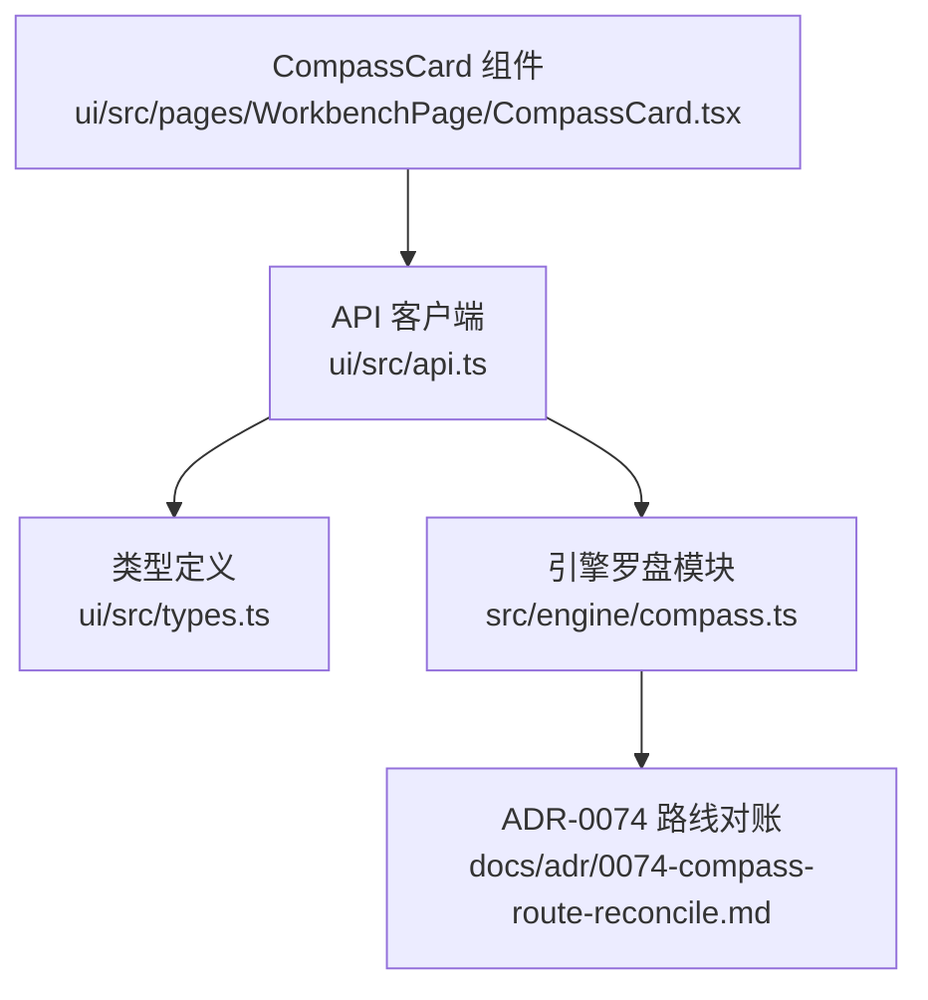
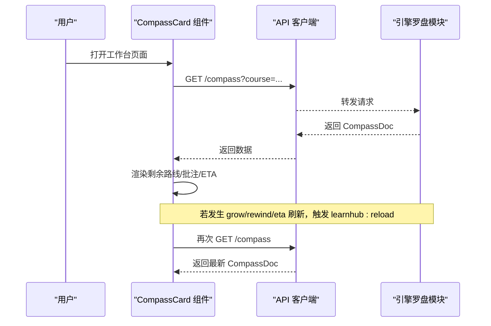
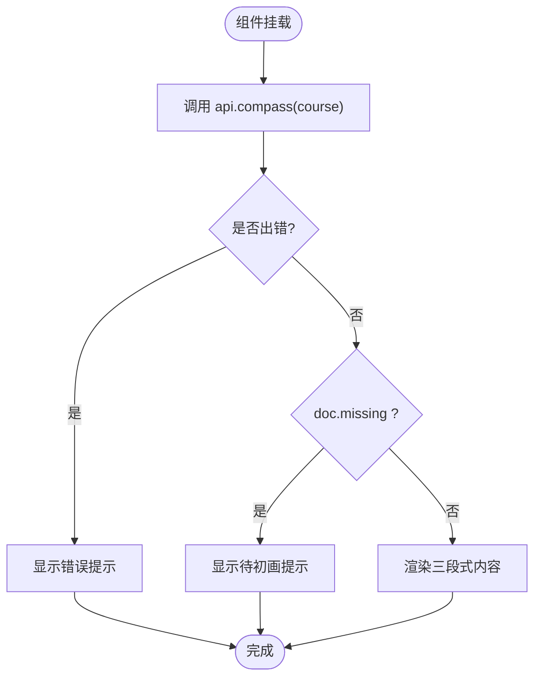
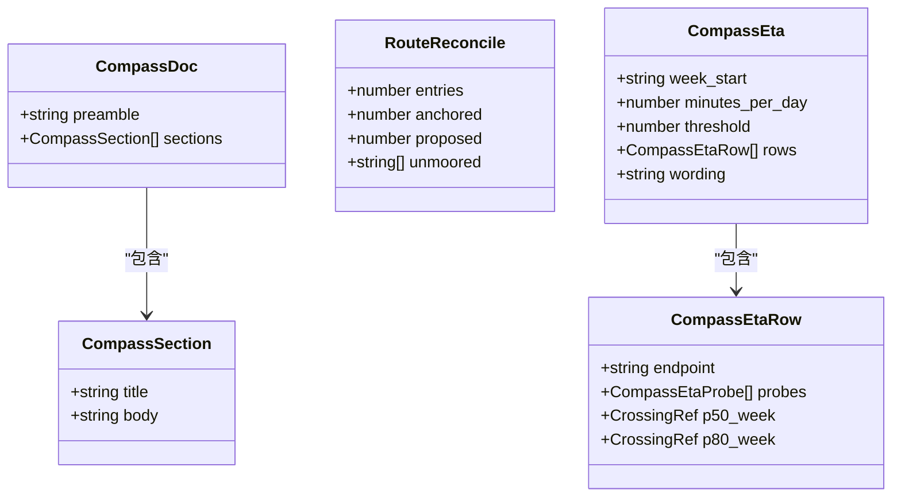
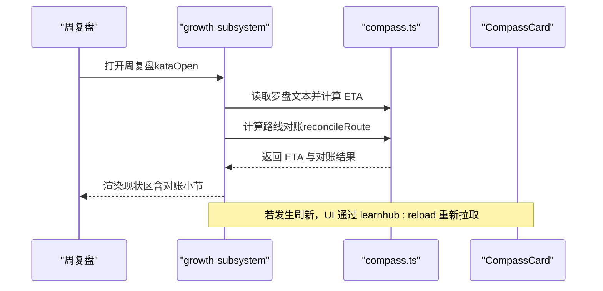
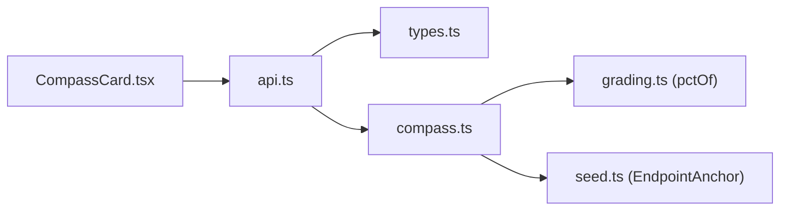

# 罗盘卡片

<cite>
**本文引用的文件**
- [CompassCard.tsx](file://ui/src/pages/WorkbenchPage/CompassCard.tsx)
- [compass.ts](file://src/engine/compass.ts)
- [types.ts](file://ui/src/types.ts)
- [api.ts](file://ui/src/api.ts)
- [0074-compass-route-reconcile.md](file://docs/adr/0074-compass-route-reconcile.md)
</cite>

## 目录
1. [简介](#简介)
2. [项目结构](#项目结构)
3. [核心组件](#核心组件)
4. [架构总览](#架构总览)
5. [详细组件分析](#详细组件分析)
6. [依赖关系分析](#依赖关系分析)
7. [性能考量](#性能考量)
8. [故障排查指南](#故障排查指南)
9. [结论](#结论)
10. [附录：定制与主题适配](#附录定制与主题适配)

## 简介
本文件面向“罗盘卡片”这一学习进度可视化能力，系统性说明其数据模型、渲染逻辑、用户交互以及与知识图谱的关联。罗盘卡片用于展示课程根常驻的非承诺路线草图（剩余路线）、学习者批注区（软输入）以及每周挂载的沙盘 ETA（模型推演，非承诺）。它通过只读接口获取引擎返回的罗盘视图，并在前端以 Markdown 形式呈现，配合标签提示终点类型与状态，帮助学习者理解学习路径、掌握度趋势与目标进度。

## 项目结构
- 前端展示层：工作台页面中的 CompassCard 组件负责拉取并渲染罗盘内容。
- 类型定义：统一从引擎视图与命令输出派生类型，避免手工镜像。
- API 客户端：封装 /learnhub/api/* 请求，提供 compass 读取入口。
- 引擎实现：compass.ts 定义罗盘文档结构、段落解析与合并、ETA 计算与渲染、路线对账等核心逻辑。
- ADR 设计决策：ADR-0074 明确路线对账的三态判据与挂载点。

**图表来源**
- [CompassCard.tsx:15-79](file://ui/src/pages/WorkbenchPage/CompassCard.tsx#L15-L79)
- [api.ts:43-50](file://ui/src/api.ts#L43-L50)
- [types.ts:78-79](file://ui/src/types.ts#L78-L79)
- [compass.ts:44-78](file://src/engine/compass.ts#L44-L78)
- [0074-compass-route-reconcile.md:1-52](file://docs/adr/0074-compass-route-reconcile.md#L1-L52)

**章节来源**
- [CompassCard.tsx:1-79](file://ui/src/pages/WorkbenchPage/CompassCard.tsx#L1-L79)
- [api.ts:1-370](file://ui/src/api.ts#L1-L370)
- [types.ts:1-93](file://ui/src/types.ts#L1-L93)
- [compass.ts:1-289](file://src/engine/compass.ts#L1-L289)
- [0074-compass-route-reconcile.md:1-52](file://docs/adr/0074-compass-route-reconcile.md#L1-L52)

## 核心组件
- CompassCard 组件
  - 职责：加载并展示罗盘卡片；监听全局 reload 事件刷新；根据 doc.missing 显示空态或三段式内容（剩余路线、学习者批注、沙盘 ETA）。
  - 关键行为：调用 api.compass(course) 获取数据；错误时显示错误提示；加载时显示占位文案；成功时渲染各段 Markdown。
  - 交互：仅读展示；通过额外区域标签显示覆盖锚定与终点信息。
- 引擎罗盘模块（compass.ts）
  - 职责：定义罗盘文档结构与段落切分/合并；提供初画脚手架、路线校验、路线对账、ETA 探测与渲染、批注区检测等。
  - 关键概念：三段式（剩余路线、学习者批注区、沙盘 ETA）；机器段与手编段共存；缺失为合法空态；ETA 周标记幂等。
- 类型与 API
  - types.ts：将 CompassDoc 定义为引擎 compassRead 的返回类型，确保前后端一致。
  - api.ts：暴露 api.compass(course) 对应 GET /compass，透传引擎视图。

**章节来源**
- [CompassCard.tsx:15-79](file://ui/src/pages/WorkbenchPage/CompassCard.tsx#L15-L79)
- [compass.ts:44-102](file://src/engine/compass.ts#L44-L102)
- [types.ts:78-79](file://ui/src/types.ts#L78-L79)
- [api.ts:48-49](file://ui/src/api.ts#L48-L49)

## 架构总览
罗盘卡片的数据流遵循“前端只读 + 引擎权威”的设计：
- 前端发起 GET /compass 请求，获取 CompassDoc。
- 引擎按段落解析罗盘文本，组合路线、批注与 ETA 视图。
- 前端以 Markdown 渲染各段，并通过标签提示终点与覆盖锚定。
- 当发生跨页流程（如生长批应用、罗盘重画完成），通过 learnhub:reload 事件触发重新加载。

**图表来源**
- [CompassCard.tsx:18-31](file://ui/src/pages/WorkbenchPage/CompassCard.tsx#L18-L31)
- [api.ts:48-49](file://ui/src/api.ts#L48-L49)
- [compass.ts:44-78](file://src/engine/compass.ts#L44-L78)

## 详细组件分析

### CompassCard 组件分析
- 数据加载与错误处理
  - 使用 useCallback 包装 load，避免重复创建；useEffect 在挂载时调用；捕获异常并设置 error 状态。
  - 支持 learnhub:reload 事件监听，保证跨页流程后自动刷新。
- 渲染分支
  - 错误态：显示错误消息。
  - 加载中：显示加载文案。
  - 空态（doc.missing）：显示“待初画”提示，引导教练台操作。
  - 正常态：三段式内容（剩余路线、学习者批注、沙盘 ETA），均通过 MdView 渲染 Markdown。
- 标签与提示
  - 根据 anchors 的 goal_type 显示“覆盖锚定”。
  - 列出所有终点 endpoint，无终点时显示“还没有终点”。

**图表来源**
- [CompassCard.tsx:18-79](file://ui/src/pages/WorkbenchPage/CompassCard.tsx#L18-L79)

**章节来源**
- [CompassCard.tsx:15-79](file://ui/src/pages/WorkbenchPage/CompassCard.tsx#L15-L79)

### 引擎罗盘模块分析（compass.ts）
- 文档结构与解析
  - parseCompass：按 `## ` 标题切分，保留 preamble 与 sections 顺序。
  - renderCompass：将文档还原为文本。
  - withSectionText：段级替换合并，目标段整体替换，其余字节保留；不存在则追加末尾。
- 路线相关
  - validateRouteBody：限制正文为空、禁止携带 `## ` 标题、字符上限 ROUTE_MAX_CHARS。
  - hasPaintedRoute：判断是否已画出路线（排除占位与空白）。
  - reconcileRoute：条目三态判定（有锚/标候选/无锚），生成 RouteReconcile。
- ETA 相关
  - COMPASS_ETA_PROBE_WEEKS：探测档（4/8/12/18/24 周）。
  - etaMarkerOf/etaHorizonOf/crossingText：周标记解析、地平线上界、越阈措辞。
  - renderEtaBody：生成带机器标记、基准与逐终点行的 ETA 正文。
- 批注区
  - hasLearnerAnnotations：判断学习者是否写过批注（排除引导文案）。
- 初画上下文
  - compassPaintContext：组装终点锚、起点与当前图节点预览、批注区软输入，供模板使用。

**图表来源**
- [compass.ts:40-42](file://src/engine/compass.ts#L40-L42)
- [compass.ts:131-140](file://src/engine/compass.ts#L131-L140)
- [compass.ts:184-206](file://src/engine/compass.ts#L184-L206)

**章节来源**
- [compass.ts:44-102](file://src/engine/compass.ts#L44-L102)
- [compass.ts:111-173](file://src/engine/compass.ts#L111-L173)
- [compass.ts:175-240](file://src/engine/compass.ts#L175-L240)
- [compass.ts:242-289](file://src/engine/compass.ts#L242-L289)

### 与知识图谱的关联与学习状态更新
- 路线对账（ADR-0074）
  - 目的：在不改变权威写权的前提下，提供“路线是否与图面节点一致”的非权威读数。
  - 机制：reconcileRoute 逐条比对条目与图面节点名集合，产出三态结果；未画路线不进入对账。
  - 挂载点：周复盘现状区在 ETA 旁挂处顺带显示对账结论与漂移证据行。
- 学习状态实时更新
  - 前端通过 learnhub:reload 事件触发重新加载，保证在生长批应用、罗盘重画完成后及时刷新。
  - 引擎侧 ETA 每周刷新，基于蒙特卡洛分位带估算到达阈值的时间区间。

**图表来源**
- [0074-compass-route-reconcile.md:25-43](file://docs/adr/0074-compass-route-reconcile.md#L25-L43)
- [compass.ts:156-166](file://src/engine/compass.ts#L156-L166)
- [CompassCard.tsx:27-31](file://ui/src/pages/WorkbenchPage/CompassCard.tsx#L27-L31)

**章节来源**
- [0074-compass-route-reconcile.md:1-52](file://docs/adr/0074-compass-route-reconcile.md#L1-L52)
- [compass.ts:156-173](file://src/engine/compass.ts#L156-L173)
- [CompassCard.tsx:27-31](file://ui/src/pages/WorkbenchPage/CompassCard.tsx#L27-L31)

### 个性化学习建议的展示
- 学习者批注区作为“软输入”，在初画与教练上下文中被读取，形成个性化参考。
- 引擎在初画上下文（compassPaintContext）中注入批注区内容，使 LLM 能结合学习者期望调整路线草案。
- 前端在卡片中以 Markdown 展示批注区，便于学习者维护与回顾。

**章节来源**
- [compass.ts:242-282](file://src/engine/compass.ts#L242-L282)
- [CompassCard.tsx:60-65](file://ui/src/pages/WorkbenchPage/CompassCard.tsx#L60-L65)

## 依赖关系分析
- 前端依赖
  - CompassCard 依赖 api.compass 获取数据，依赖 types.CompassDoc 进行类型约束。
  - 通过 MdView 渲染 Markdown，使用 Arco Design 的 Card、Tag、Typography 等组件。
- 引擎依赖
  - compass.ts 依赖 grading.pctOf 进行百分比格式化，依赖 seed.EndpointAnchor 描述终点锚。
  - 与 growth-subsystem、kata 等模块协作，完成 ETA 与对账的挂载与呈现。

**图表来源**
- [CompassCard.tsx:8-11](file://ui/src/pages/WorkbenchPage/CompassCard.tsx#L8-L11)
- [api.ts:48-49](file://ui/src/api.ts#L48-L49)
- [types.ts:78-79](file://ui/src/types.ts#L78-L79)
- [compass.ts:14-16](file://src/engine/compass.ts#L14-L16)

**章节来源**
- [CompassCard.tsx:8-11](file://ui/src/pages/WorkbenchPage/CompassCard.tsx#L8-L11)
- [api.ts:48-49](file://ui/src/api.ts#L48-L49)
- [types.ts:78-79](file://ui/src/types.ts#L78-L79)
- [compass.ts:14-16](file://src/engine/compass.ts#L14-L16)

## 性能考量
- 只读拉取与事件驱动刷新：仅在挂载与 learnhub:reload 时拉取，避免频繁轮询。
- 段落级合并：withSectionText 仅替换目标段，减少全文重写开销。
- 路线长度限制：ROUTE_MAX_CHARS 防止上下文膨胀，降低 LLM 调用成本与渲染压力。
- ETA 探测档有限：COMPASS_ETA_PROBE_WEEKS 控制计算范围，提前停以减少计算量。

[本节为通用指导，无需具体文件引用]

## 故障排查指南
- 加载失败
  - 现象：显示“罗盘加载失败——引擎暂不可达”。
  - 排查：检查网络连通性与后端服务状态；确认 course 参数正确。
- 空态提示
  - 现象：显示“罗盘还没有初画”。
  - 处理：在教练台执行“罗盘初画/重画”，或等待首个生长批自动重写。
- 路线漂移
  - 现象：周复盘现状区出现“路线漂移”告警。
  - 处理：核对条目是否标注“候选”或引用图面节点名；必要时由教练调整路线。
- ETA 未刷新
  - 现象：ETA 段仍显示“待刷新”。
  - 处理：确认周复盘已触发；检查 ETA 机器标记是否存在；等待下次周复盘刷新。

**章节来源**
- [CompassCard.tsx:22-24](file://ui/src/pages/WorkbenchPage/CompassCard.tsx#L22-L24)
- [CompassCard.tsx:50-58](file://ui/src/pages/WorkbenchPage/CompassCard.tsx#L50-L58)
- [compass.ts:111-123](file://src/engine/compass.ts#L111-L123)
- [compass.ts:175-182](file://src/engine/compass.ts#L175-L182)
- [0074-compass-route-reconcile.md:29-43](file://docs/adr/0074-compass-route-reconcile.md#L29-L43)

## 结论
罗盘卡片以“非承诺路线草图”为核心，结合学习者批注与沙盘 ETA，提供清晰的学习路径可视化与进度跟踪。通过严格的段落解析与合并策略、路线对账与 ETA 探测，系统在保持灵活性的同时确保了可读性与可维护性。前端采用只读模式与事件驱动刷新，保障用户体验与系统稳定性。

[本节为总结性内容，无需具体文件引用]

## 附录：定制与主题适配
- 组件样式
  - 使用 Arco Design 的 Card、Tag、Typography 等组件，可通过 className 扩展样式（如 lh-card、lh-full）。
  - 可根据主题变量调整颜色与字号，保持可读性。
- 内容定制
  - 路线正文需遵守 validateRouteBody 约束（非空、无 `## ` 标题、不超过 ROUTE_MAX_CHARS）。
  - 批注区可作为个性化建议输入，引擎会在初画上下文中读取。
  - ETA 段由引擎每周刷新，前端仅展示，不建议手动修改机器标记。
- 主题适配建议
  - 保持标签颜色对比度，确保在不同主题下可读。
  - 对于长 Markdown 内容，考虑分页或折叠以提升性能与体验。

[本节为通用指导，无需具体文件引用]