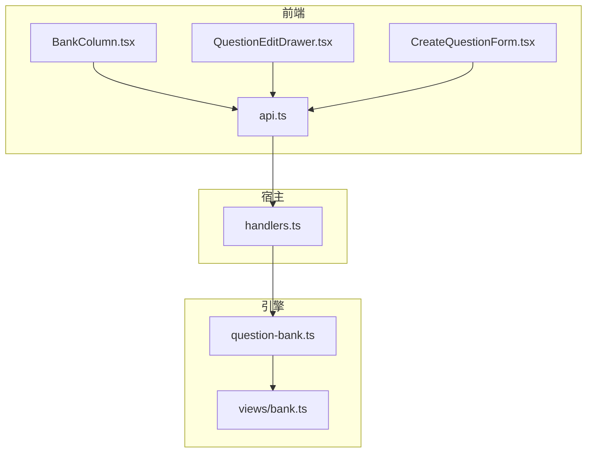
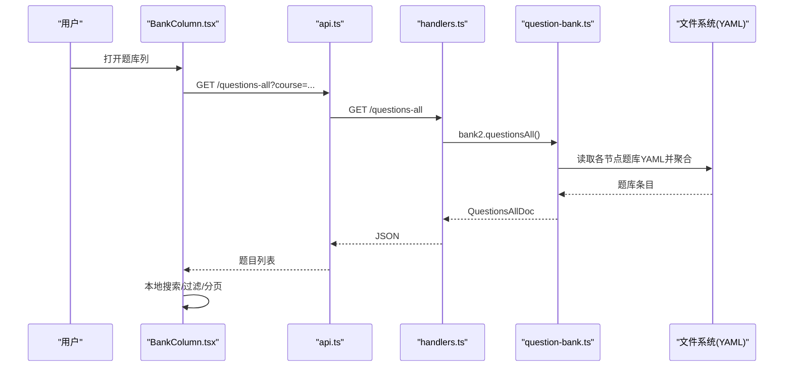
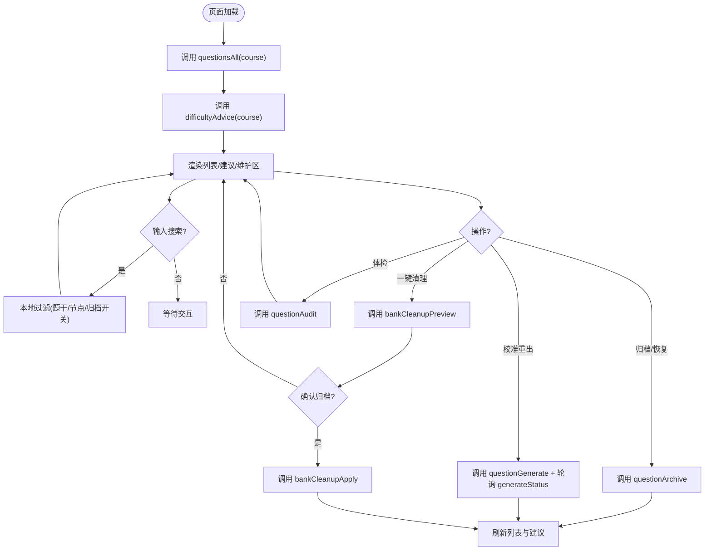
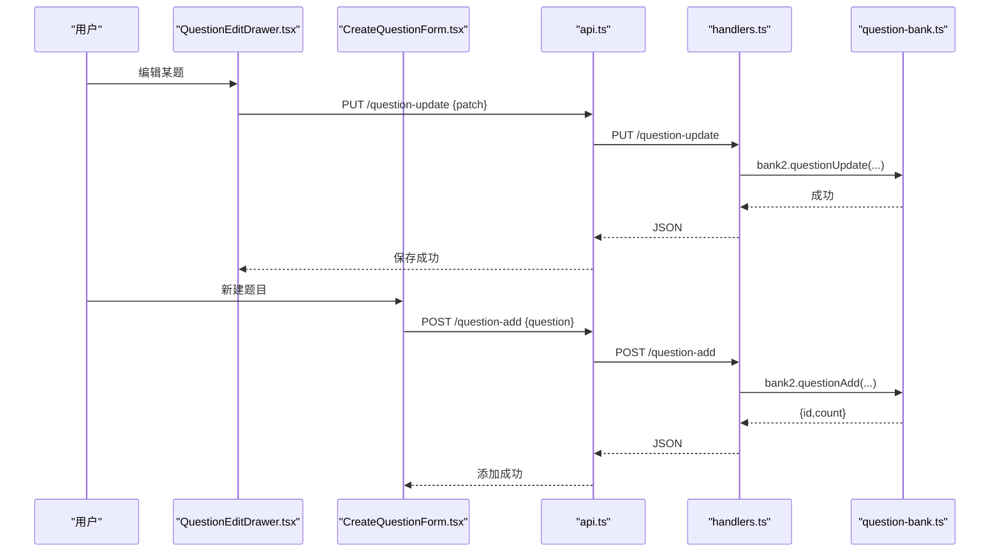
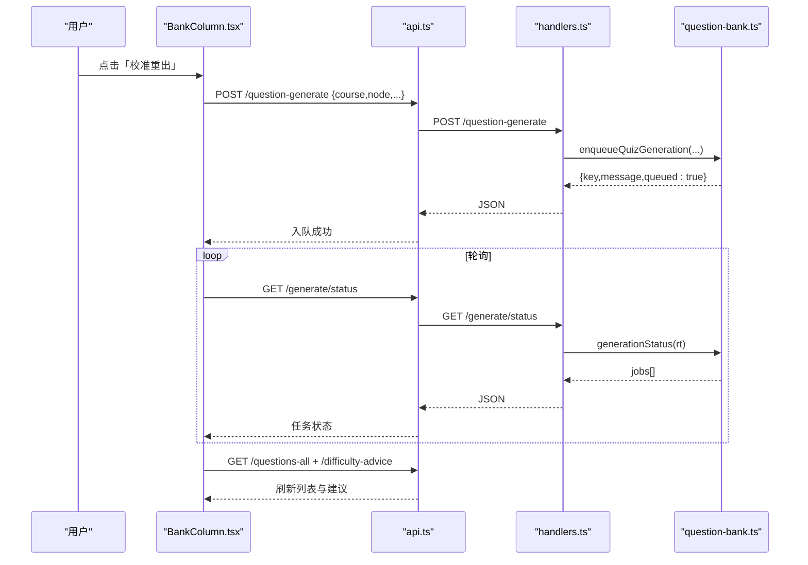
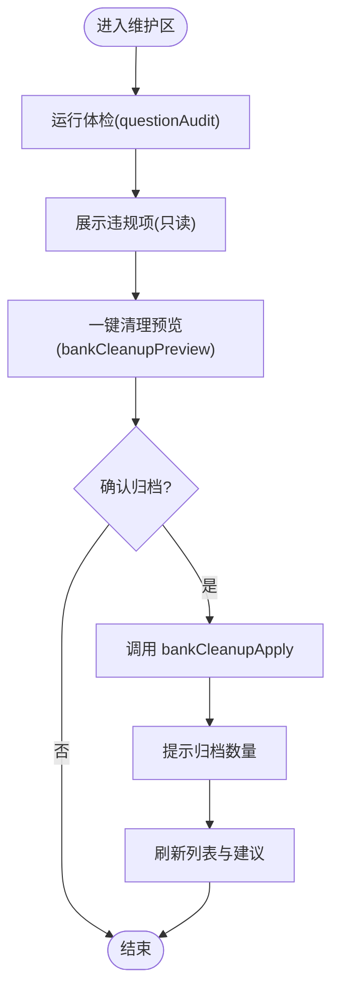
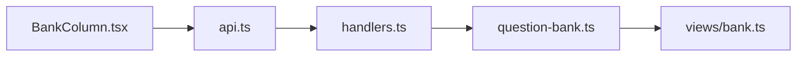

# 题库管理列

<cite>
**本文引用的文件**
- [BankColumn.tsx](file://ui/src/pages/WorkbenchPage/BankColumn.tsx)
- [api.ts](file://ui/src/api.ts)
- [QuestionEditDrawer.tsx](file://ui/src/components/QuestionEditDrawer.tsx)
- [CreateQuestionForm.tsx](file://ui/src/pages/WorkbenchPage/CreateQuestionForm.tsx)
- [question-bank.ts](file://src/engine/question-bank.ts)
- [bank.ts（视图类型）](file://src/engine/views/bank.ts)
- [handlers.ts](file://src/host/handlers.ts)
- [题库.ts（命令注册）](file://src/commands/题库.ts)
</cite>

## 目录
1. [简介](#简介)
2. [项目结构](#项目结构)
3. [核心组件](#核心组件)
4. [架构总览](#架构总览)
5. [详细组件分析](#详细组件分析)
6. [依赖关系分析](#依赖关系分析)
7. [性能与缓存](#性能与缓存)
8. [故障排查指南](#故障排查指南)
9. [结论](#结论)
10. [附录：API 与数据模型](#附录api-与数据模型)

## 简介
本章节面向“题库管理列”的完整实现，围绕 BankColumn 组件展开，覆盖题目列表展示、搜索过滤、批量操作、难度建议、体检与清理、编辑与自建题、状态实时更新以及与后端 API 的交互方式。文档同时解释题目的分类、标签管理与质量评估显示，并提供用户操作流程与开发集成要点。

## 项目结构
题库管理列由前端 UI 组件与后端引擎/宿主路由共同构成：
- 前端：BankColumn 作为工作台分栏，聚合题目列表、搜索、归档/恢复、编辑抽屉、自建题表单、难度建议区、题库维护区（体检与一键清理）。
- 客户端 API：统一封装到 api.ts，提供 questionsAll、difficultyAdvice、questionArchive、questionGenerate、generateStatus、bankCleanupPreview/Apply、questionAudit 等调用。
- 后端：host handlers 将 HTTP 路由映射到引擎能力；engine question-bank 负责题库读写、校验、调度、建议、清理、审计等核心逻辑；views/bank 定义对外视图类型。

图表来源
- [BankColumn.tsx:1-366](file://ui/src/pages/WorkbenchPage/BankColumn.tsx#L1-L366)
- [api.ts:1-370](file://ui/src/api.ts#L1-L370)
- [handlers.ts:1-742](file://src/host/handlers.ts#L1-L742)
- [question-bank.ts:1-800](file://src/engine/question-bank.ts#L1-L800)
- [bank.ts（视图类型）:1-229](file://src/engine/views/bank.ts#L1-L229)

章节来源
- [BankColumn.tsx:1-366](file://ui/src/pages/WorkbenchPage/BankColumn.tsx#L1-L366)
- [api.ts:1-370](file://ui/src/api.ts#L1-L370)
- [handlers.ts:1-742](file://src/host/handlers.ts#L1-L742)
- [question-bank.ts:1-800](file://src/engine/question-bank.ts#L1-L800)
- [bank.ts（视图类型）:1-229](file://src/engine/views/bank.ts#L1-L229)

## 核心组件
- BankColumn：工作台的题库分栏，承载题目列表、搜索、归档/恢复、编辑、自建题、难度建议、题库维护（体检与清理）。
- QuestionEditDrawer：单题编辑抽屉，复用题库管理与会话内编辑场景，支持按题型动态填写答案与解析。
- CreateQuestionForm：九种题型的自建题表单，提交后走 validateBank 门禁落库。
- 引擎 question-bank：题库读写的权威实现，包含 schema 校验、归档、批量归档、难度建议、清理预览与应用、审计等。
- 宿主 handlers：HTTP 路由到引擎能力的桥接层，暴露 /questions-all、/difficulty-advice、/question-archive、/question-generate、/generate/status、/bank-cleanup*、/question-audit 等端点。
- 视图类型 views/bank：对外暴露的数据契约（如 BankEntry、DifficultyAdviceDoc、CleanupPreviewDoc 等）。

章节来源
- [BankColumn.tsx:1-366](file://ui/src/pages/WorkbenchPage/BankColumn.tsx#L1-L366)
- [QuestionEditDrawer.tsx:1-103](file://ui/src/components/QuestionEditDrawer.tsx#L1-L103)
- [CreateQuestionForm.tsx:1-95](file://ui/src/pages/WorkbenchPage/CreateQuestionForm.tsx#L1-L95)
- [question-bank.ts:1-800](file://src/engine/question-bank.ts#L1-L800)
- [bank.ts（视图类型）:1-229](file://src/engine/views/bank.ts#L1-L229)
- [handlers.ts:1-742](file://src/host/handlers.ts#L1-L742)

## 架构总览
题库管理列采用“前端组件 → 客户端 API → 宿主路由 → 引擎域”的分层架构。前端通过 api.ts 发起请求，宿主 handlers 将路由转发至 engine 的 BankSubsystem/QuestionBank，最终持久化到课程根下的题库 YAML 文件。

图表来源
- [BankColumn.tsx:40-72](file://ui/src/pages/WorkbenchPage/BankColumn.tsx#L40-L72)
- [api.ts:231-232](file://ui/src/api.ts#L231-L232)
- [handlers.ts:504-529](file://src/host/handlers.ts#L504-L529)
- [question-bank.ts:756-788](file://src/engine/question-bank.ts#L756-L788)

章节来源
- [BankColumn.tsx:40-72](file://ui/src/pages/WorkbenchPage/BankColumn.tsx#L40-L72)
- [api.ts:231-232](file://ui/src/api.ts#L231-L232)
- [handlers.ts:504-529](file://src/host/handlers.ts#L504-L529)
- [question-bank.ts:756-788](file://src/engine/question-bank.ts#L756-L788)

## 详细组件分析

### BankColumn 组件
- 功能概览
  - 题目列表展示：分页表格，显示节点、题型、题干、到期时间、状态（在库/已归档）、操作（编辑、归档/恢复）。
  - 搜索与过滤：支持按题干/节点模糊搜索；可切换显示已归档题目。
  - 批量操作：通过“一键清理休眠题”预览分组确认后再归档，不删除、可逆。
  - 难度建议：只读检测，展示失衡节点与过于简单题目，支持“校准重出”“归档”“忽略/恢复全部”。
  - 题库维护：运行体检报告，查看违规项；一键清理预览与确认归档。
  - 自建题与编辑：内置表单创建新题；共享编辑抽屉修改题干、答案、解析、难度。
- 数据获取与刷新
  - 初始化加载：调用 questionsAll(course) 拉取当前课程所有题目；调用 difficultyAdvice(course) 获取难度建议与学习日。
  - 操作后刷新：归档/恢复、生成任务完成、清理应用后，重新拉取列表与建议。
- 到期着色与定位
  - 以引擎学习日为基准对到期列着色；支持从难度建议点击定位到具体题目行（含已归档）。
- 错误处理
  - 使用 Message.error 提示失败；错误信息来自 errorMessage(err)。

图表来源
- [BankColumn.tsx:40-185](file://ui/src/pages/WorkbenchPage/BankColumn.tsx#L40-L185)
- [api.ts:178-205](file://ui/src/api.ts#L178-L205)

章节来源
- [BankColumn.tsx:1-366](file://ui/src/pages/WorkbenchPage/BankColumn.tsx#L1-L366)
- [api.ts:178-205](file://ui/src/api.ts#L178-L205)

### 题目编辑与自建
- 编辑抽屉（QuestionEditDrawer）
  - 根据题型动态提示答案格式；支持留空不改答案；保存时走 questionUpdate 白名单合并与 validateBank 校验。
- 自建题表单（CreateQuestionForm）
  - 九种题型字段动态渲染；提交前进行基础校验；成功后返回新增题 id 与题库总数。

图表来源
- [QuestionEditDrawer.tsx:43-65](file://ui/src/components/QuestionEditDrawer.tsx#L43-L65)
- [CreateQuestionForm.tsx:25-51](file://ui/src/pages/WorkbenchPage/CreateQuestionForm.tsx#L25-L51)
- [handlers.ts:277-280](file://src/host/handlers.ts#L277-L280)
- [handlers.ts:586-590](file://src/host/handlers.ts#L586-L590)
- [question-bank.ts:337-376](file://src/engine/question-bank.ts#L337-L376)

章节来源
- [QuestionEditDrawer.tsx:1-103](file://ui/src/components/QuestionEditDrawer.tsx#L1-L103)
- [CreateQuestionForm.tsx:1-95](file://ui/src/pages/WorkbenchPage/CreateQuestionForm.tsx#L1-L95)
- [handlers.ts:277-280](file://src/host/handlers.ts#L277-L280)
- [handlers.ts:586-590](file://src/host/handlers.ts#L586-L590)
- [question-bank.ts:337-376](file://src/engine/question-bank.ts#L337-L376)

### 难度建议与任务化出题
- 难度建议
  - 只读检测：扫描题库 stats/fsrs 与掌握度，产出“低掌握需校准”和“过于简单可归档”两类建议；被忽略的建议不计入 nodes，仅以 dismissed 计数带出。
  - 交互：支持“校准重出”（入队 quiz 任务并轮询终态）、“归档过于简单题”、“忽略/恢复全部忽略”。
- 任务化出题
  - 入队即返回，后台串行队列执行；UI 轮询 generateStatus 直到终态，完成后刷新列表与建议。

图表来源
- [BankColumn.tsx:82-109](file://ui/src/pages/WorkbenchPage/BankColumn.tsx#L82-L109)
- [api.ts:195-205](file://ui/src/api.ts#L195-L205)
- [handlers.ts:504-529](file://src/host/handlers.ts#L504-L529)
- [handlers.ts:167-169](file://src/host/handlers.ts#L167-L169)

章节来源
- [BankColumn.tsx:82-109](file://ui/src/pages/WorkbenchPage/BankColumn.tsx#L82-L109)
- [api.ts:195-205](file://ui/src/api.ts#L195-L205)
- [handlers.ts:167-169](file://src/host/handlers.ts#L167-L169)
- [handlers.ts:504-529](file://src/host/handlers.ts#L504-L529)

### 题库维护：体检与一键清理
- 体检（只读）
  - 扫描所有题库与笔记源镜像，标记违反契约的题目（如填空答案数值化、LaTeX 不规范、YAML 转义损坏、解析过长等），返回 findings 列表。
- 一键清理（归档式、可逆）
  - 预览：按节点分组统计候选（跳过节点的未归档题 + 已完成节点学完后从未调度的休眠题），展示题面摘录样本。
  - 应用：确认后批量归档，reason=cleanup，可在列表“显示已归档”中按原因恢复。

图表来源
- [BankColumn.tsx:148-185](file://ui/src/pages/WorkbenchPage/BankColumn.tsx#L148-L185)
- [api.ts:185-192](file://ui/src/api.ts#L185-L192)
- [handlers.ts:255-258](file://src/host/handlers.ts#L255-L258)

章节来源
- [BankColumn.tsx:148-185](file://ui/src/pages/WorkbenchPage/BankColumn.tsx#L148-L185)
- [api.ts:185-192](file://ui/src/api.ts#L185-L192)
- [handlers.ts:255-258](file://src/host/handlers.ts#L255-L258)

## 依赖关系分析
- 前端依赖
  - BankColumn 依赖 api.ts 提供的题库相关方法；依赖 QuestionEditDrawer 与 CreateQuestionForm 进行编辑与自建。
- 宿主依赖
  - handlers.ts 将面板路由绑定到引擎能力，如 /questions-all、/difficulty-advice、/question-archive、/question-generate、/generate/status、/bank-cleanup*、/question-audit。
- 引擎依赖
  - question-bank.ts 实现题库读写、校验、归档、建议、清理、审计等；views/bank.ts 定义对外数据结构。

图表来源
- [BankColumn.tsx:1-366](file://ui/src/pages/WorkbenchPage/BankColumn.tsx#L1-L366)
- [api.ts:1-370](file://ui/src/api.ts#L1-L370)
- [handlers.ts:1-742](file://src/host/handlers.ts#L1-L742)
- [question-bank.ts:1-800](file://src/engine/question-bank.ts#L1-L800)
- [bank.ts（视图类型）:1-229](file://src/engine/views/bank.ts#L1-L229)

章节来源
- [BankColumn.tsx:1-366](file://ui/src/pages/WorkbenchPage/BankColumn.tsx#L1-L366)
- [api.ts:1-370](file://ui/src/api.ts#L1-L370)
- [handlers.ts:1-742](file://src/host/handlers.ts#L1-L742)
- [question-bank.ts:1-800](file://src/engine/question-bank.ts#L1-L800)
- [bank.ts（视图类型）:1-229](file://src/engine/views/bank.ts#L1-L229)

## 性能与缓存
- 前端缓存
  - 列表与建议在组件内存中缓存（useState），仅在必要时刷新；搜索与过滤为本地操作，无网络开销。
- 后端缓存
  - 引擎侧存在课程调度器实例缓存（FSRS），用于写回后失效控制；题库读取直接扫描 YAML 文件，保证一致性。
- 任务化与轮询
  - 出题任务后台串行执行，前端轮询 generateStatus 避免阻塞；超时保护（15 分钟）防止无限等待。
- 批量操作
  - 批量归档一次 load-validate-write，减少文件重写次数，提升写入效率。

[本节为通用性能讨论，不直接分析具体代码行]

## 故障排查指南
- 常见问题
  - 列表为空：检查课程是否启用、是否存在题库 YAML；确认 coursesTree/graph 是否正确。
  - 搜索无结果：确认搜索关键词是否匹配题干或节点；检查“显示已归档”开关。
  - 归档失败：确认 qid/node/course 正确；查看服务端错误信息（Message.error）。
  - 生成任务卡住：检查 generateStatus 中任务状态；必要时取消或重试。
  - 清理预览为空：说明没有可清理的候选（跳过节点残留或休眠题）。
- 调试建议
  - 使用浏览器开发者工具查看网络请求与响应；核对 API 路径与参数。
  - 在引擎侧关注 validateBank 报错信息，确保 YAML 结构与字段合法。
  - 对于难度建议异常，检查学习日与 FSRS 数据是否一致。

章节来源
- [BankColumn.tsx:40-185](file://ui/src/pages/WorkbenchPage/BankColumn.tsx#L40-L185)
- [api.ts:13-32](file://ui/src/api.ts#L13-L32)
- [question-bank.ts:139-262](file://src/engine/question-bank.ts#L139-L262)

## 结论
题库管理列通过 BankColumn 组件整合了题目浏览、搜索、编辑、自建、难度建议、体检与清理等功能，形成完整的题目生命周期管理能力。前后端分层清晰，数据流与状态更新明确，具备可扩展性与可维护性。建议在生产环境中结合监控与日志，持续优化任务队列与轮询策略，保障用户体验。

[本节为总结性内容，不直接分析具体代码行]

## 附录：API 与数据模型
- 关键 API（前端 → 宿主）
  - GET /questions-all：获取全量题目（不含答案，带到期与统计）。
  - GET /difficulty-advice：获取难度建议（只读，含 dismissed 计数）。
  - POST /question-archive：归档/恢复单题（支持 reason）。
  - POST /question-generate：入队出题任务（phase=quiz）。
  - GET /generate/status：查询生成任务状态。
  - GET /bank-cleanup：清理预览（只读）。
  - POST /bank-cleanup/apply：应用清理（批量归档）。
  - GET /question-audit：题库体检（只读）。
- 数据模型（视图类型）
  - BankEntry：题目条目（课程、节点、qid、题型、题干、难度、标签、归档状态、到期、上次复习等）。
  - DifficultyAdviceDoc/Node：难度建议文档与节点级建议（校准建议、过于简单标注）。
  - CleanupPreviewDoc/Group：清理预览文档与分组统计（题面摘录样本）。
  - QuestionGetDoc：单题全量读取（含答案/解析，供修订用）。

章节来源
- [api.ts:178-205](file://ui/src/api.ts#L178-L205)
- [api.ts:231-239](file://ui/src/api.ts#L231-L239)
- [bank.ts（视图类型）:7-27](file://src/engine/views/bank.ts#L7-L27)
- [bank.ts（视图类型）:79-91](file://src/engine/views/bank.ts#L79-L91)
- [bank.ts（视图类型）:58-74](file://src/engine/views/bank.ts#L58-L74)
- [bank.ts（视图类型）:207-217](file://src/engine/views/bank.ts#L207-L217)