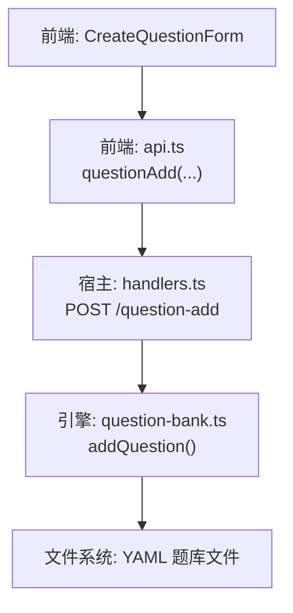
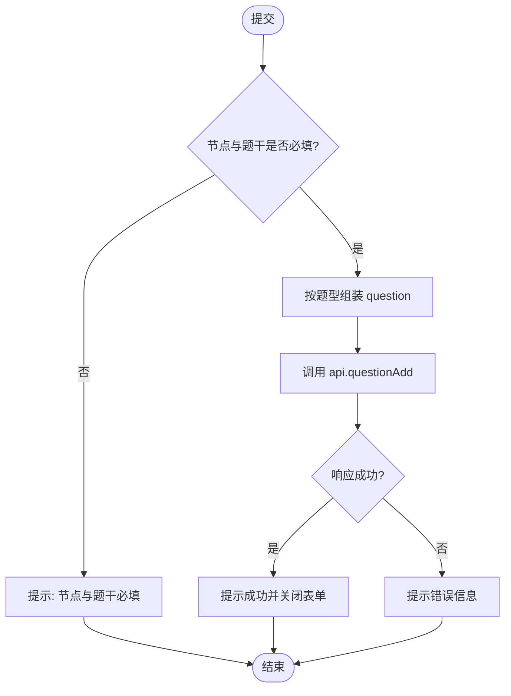
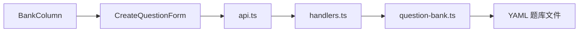
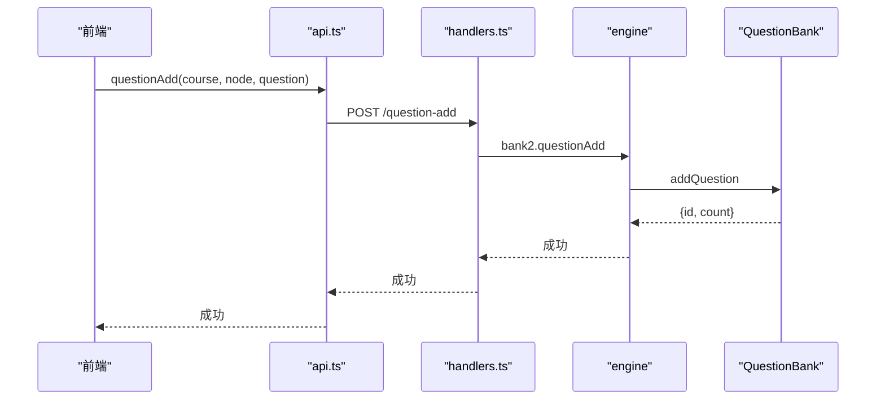

# 题目创建表单

<cite>
**本文引用的文件**
- [CreateQuestionForm.tsx](file://ui/src/pages/WorkbenchPage/CreateQuestionForm.tsx)
- [BankColumn.tsx](file://ui/src/pages/WorkbenchPage/BankColumn.tsx)
- [api.ts](file://ui/src/api.ts)
- [handlers.ts](file://src/host/handlers.ts)
- [question-bank.ts](file://src/engine/question-bank.ts)
- [bank.ts](file://src/engine/views/bank.ts)
</cite>

## 目录
1. [简介](#简介)
2. [项目结构](#项目结构)
3. [核心组件](#核心组件)
4. [架构总览](#架构总览)
5. [详细组件分析](#详细组件分析)
6. [依赖关系分析](#依赖关系分析)
7. [性能与可用性](#性能与可用性)
8. [故障排查指南](#故障排查指南)
9. [结论](#结论)
10. [附录：API 调用与自动化流程](#附录api-调用与自动化流程)

## 简介
本文件面向“题目创建表单”功能，系统性说明 CreateQuestionForm 组件的用户界面、交互逻辑、表单验证规则、数据提交流程与错误处理机制；并阐述与题库系统的集成方式、题目模板使用、批量导入能力（通过引擎侧生成通道），以及题目创建的自动化流程与 API 调用指南。目标是帮助开发者快速理解从前端到后端的完整链路，并在实际项目中正确扩展与维护该功能。

## 项目结构
- 前端 UI 层
  - 工作台分栏 BankColumn 提供“自建题”入口，打开 CreateQuestionForm 抽屉表单。
  - CreateQuestionForm 负责题型选择、题干编辑、选项配置、答案与解析输入、难度选择与提交。
  - api.ts 封装了 /learnhub/api/* 的 HTTP 客户端方法，包括 questionAdd。
- 宿主路由与处理器
  - handlers.ts 暴露 POST /question-add 路由，将请求转发至引擎 bank2.questionAdd。
- 引擎题库子系统
  - question-bank.ts 实现题库 schema 校验、单题追加、更新、归档等核心逻辑，并通过 validateBank 进行强约束。
  - views/bank.ts 定义题库视图类型，供前后端契约对齐。



图表来源
- [CreateQuestionForm.tsx:14-95](file://ui/src/pages/WorkbenchPage/CreateQuestionForm.tsx#L14-L95)
- [api.ts:233-234](file://ui/src/api.ts#L233-L234)
- [handlers.ts:586-590](file://src/host/handlers.ts#L586-L590)
- [question-bank.ts:337-352](file://src/engine/question-bank.ts#L337-L352)

章节来源
- [CreateQuestionForm.tsx:14-95](file://ui/src/pages/WorkbenchPage/CreateQuestionForm.tsx#L14-L95)
- [BankColumn.tsx:349-353](file://ui/src/pages/WorkbenchPage/BankColumn.tsx#L349-L353)
- [api.ts:233-234](file://ui/src/api.ts#L233-L234)
- [handlers.ts:586-590](file://src/host/handlers.ts#L586-L590)
- [question-bank.ts:337-352](file://src/engine/question-bank.ts#L337-L352)

## 核心组件
- CreateQuestionForm
  - 支持九种题型：单选、多选、填空、判断、数值、排序、配对、反思、开放。
  - 动态字段：根据题型显示选项、答案占位提示、容差（数值题）、解析、难度。
  - 提交前本地校验：节点与题干必填；按题型组装 answer/options/tol/explanation/difficulty。
  - 提交后反馈：成功显示新增题 id 与题库总数；失败显示错误信息。
- BankColumn
  - 提供“自建题”入口，打开 CreateQuestionForm 抽屉。
  - 提交成功后刷新题库列表。
- api.ts
  - 封装 questionAdd(course, node, question) 调用 POST /question-add。
- handlers.ts
  - 路由 POST /question-add，参数校验后将请求转给 engine.bank2.questionAdd。
- question-bank.ts
  - addQuestion：为指定节点追加一道题，生成 id（若未提供），执行 schema 校验，写入 YAML。
  - validateBank：对题型、答案、选项、容差等进行严格校验。

章节来源
- [CreateQuestionForm.tsx:9-95](file://ui/src/pages/WorkbenchPage/CreateQuestionForm.tsx#L9-L95)
- [BankColumn.tsx:349-353](file://ui/src/pages/WorkbenchPage/BankColumn.tsx#L349-L353)
- [api.ts:233-234](file://ui/src/api.ts#L233-L234)
- [handlers.ts:586-590](file://src/host/handlers.ts#L586-L590)
- [question-bank.ts:139-262](file://src/engine/question-bank.ts#L139-L262)
- [question-bank.ts:337-352](file://src/engine/question-bank.ts#L337-L352)

## 架构总览
下图展示从用户点击“添加”到落盘的完整调用链，包含前端状态管理、HTTP 请求、宿主路由分发、引擎校验与持久化。

```mermaid
sequenceDiagram
participant U as "用户"
participant F as "CreateQuestionForm"
participant A as "api.ts"
participant H as "handlers.ts"
participant E as "question-bank.ts"
participant FS as "YAML 题库文件"
U->>F : 选择题型/填写题干/选项/答案/难度
F->>F : 本地校验(节点+题干必填; 题型相关拼装)
F->>A : questionAdd(course, node, question)
A->>H : POST /question-add {course,node,question}
H->>E : bank2.questionAdd(course, node, question)
E->>E : validateBank(question)
alt 校验通过
E->>FS : atomicWrite(YAML)
FS-->>E : 成功
E-->>H : {id, count}
H-->>A : {id, count}
A-->>F : 返回结果
F->>U : 成功消息(已添加 qid，题库共 N 题)
else 校验失败
E-->>H : 抛出错误
H-->>A : 错误响应
A-->>F : 抛出 ApiError
F->>U : 错误提示
end
```

图表来源
- [CreateQuestionForm.tsx:25-51](file://ui/src/pages/WorkbenchPage/CreateQuestionForm.tsx#L25-L51)
- [api.ts:233-234](file://ui/src/api.ts#L233-L234)
- [handlers.ts:586-590](file://src/host/handlers.ts#L586-L590)
- [question-bank.ts:337-352](file://src/engine/question-bank.ts#L337-L352)

## 详细组件分析

### CreateQuestionForm 组件
- 界面与交互
  - 节点选择：下拉框绑定课程节点列表。
  - 题型选择：下拉框映射 KIND_LABEL，驱动后续字段可见性与占位符。
  - 题干编辑：多行文本，支持 LaTeX。
  - 选项配置：当题型需要选项时显示（单选、多选、排序、配对）。
  - 答案输入：根据题型动态占位提示（如 true/false、用 | 分隔多个答案、数值、排序项、配对右列等）。
  - 容差：仅数值题显示 tol 输入。
  - 解析与难度：可选解析；难度 1-3。
  - 提交按钮：loading 态防重复提交。
- 表单验证规则
  - 必填：node 与 q（trim 非空）。
  - 题型相关：
    - 单选：options 每行一个；answer 为选项字母。
    - 多选：options 每行一个；answer 为正确选项字母数组（| 分隔）。
    - 填空：answer 可接受答案，用 | 分隔多个。
    - 判断：answer 为布尔或等价字符串。
    - 数值：answer 为数值；tol 为正数时写入。
    - 排序：options 乱序项；answer 为同一组项的正确顺序（| 分隔）。
    - 配对：options 左列；answer 为与左列一一对应的右列文本（| 分隔）。
    - 反思/开放：answer 为要点文本（开放可省略）。
- 数据提交流程
  - 组装 question 对象（kind/q/answer/options/tol/explanation/difficulty）。
  - 调用 api.questionAdd 发送请求。
  - 成功：Message 提示并回调 onDone 关闭抽屉，父组件刷新列表。
  - 失败：捕获异常并显示错误信息。
- 错误处理机制
  - 前端：try/catch 包裹提交逻辑，统一通过 Message.error(errorMessage(err)) 提示。
  - 后端：schema 校验失败抛错，经宿主路由透传为 HTTP 错误，前端 ApiError 捕获。



图表来源
- [CreateQuestionForm.tsx:25-51](file://ui/src/pages/WorkbenchPage/CreateQuestionForm.tsx#L25-L51)

章节来源
- [CreateQuestionForm.tsx:9-95](file://ui/src/pages/WorkbenchPage/CreateQuestionForm.tsx#L9-L95)

### 题库系统校验与落盘
- 校验策略
  - validateBank 对每个题目进行 schema 校验，覆盖 kind、q、answer、options、tol、section、invokes 等字段。
  - 针对 multi_choice 额外要求至少两个合法选项字母作为答案。
- 写入策略
  - addQuestion 会读取现有题库文档（缺失则新建），分配 id（若未提供），合并新题，再次 validateBank 通过后原子写入 YAML。
  - 写回路径：courseRoot/题库/<safeFilename(node)>.yaml。

```mermaid
classDiagram
class QuestionBank {
+addQuestion(courseRoot, node, question) Promise~{id,count}~
+updateQuestion(courseRoot, node, qid, patch) Promise~void~
+archiveQuestion(courseRoot, node, qid, archived, reason) Promise~void~
-loadDoc(courseRoot, node) Promise~Record|null~
-writeDoc(courseRoot, node, doc) Promise~void~
}
class Validate {
+validateBank(doc, expectedNode) {errors?, spec?}
+questionAnswerShapeError(q) string?
}
QuestionBank --> Validate : "调用"
```

图表来源
- [question-bank.ts:139-262](file://src/engine/question-bank.ts#L139-L262)
- [question-bank.ts:337-352](file://src/engine/question-bank.ts#L337-L352)

章节来源
- [question-bank.ts:139-262](file://src/engine/question-bank.ts#L139-L262)
- [question-bank.ts:337-352](file://src/engine/question-bank.ts#L337-L352)

### 与题库系统的集成
- 前端集成
  - BankColumn 提供“自建题”入口，打开 CreateQuestionForm 抽屉，提交成功后刷新题库列表。
  - 题型标签 KIND_LABEL 用于列表展示与表单选择。
- 后端集成
  - handlers.ts 将 POST /question-add 请求转发到 engine.bank2.questionAdd。
  - 引擎内部完成 schema 校验与落盘，返回新增题 id 与题库总数。
- 视图类型
  - views/bank.ts 定义了 BankEntry、BankQuestionView 等类型，确保前后端契约一致。

章节来源
- [BankColumn.tsx:349-353](file://ui/src/pages/WorkbenchPage/BankColumn.tsx#L349-L353)
- [handlers.ts:586-590](file://src/host/handlers.ts#L586-L590)
- [bank.ts:7-49](file://src/engine/views/bank.ts#L7-L49)

## 依赖关系分析
- 组件依赖
  - CreateQuestionForm 依赖 @arco-design/web-react 的 UI 组件与前端 api.ts。
  - BankColumn 依赖 CreateQuestionForm 与 QuestionEditDrawer。
- 运行时依赖
  - handlers.ts 依赖 engine.bank2 与参数校验工具。
  - question-bank.ts 依赖 YAML 解析、文件系统接口、评分与调度模块。
- 外部依赖
  - 文件系统：YAML 题库文件存储。
  - LLM/队列：批量出题与自动生成走独立队列（见附录）。



图表来源
- [CreateQuestionForm.tsx:14-95](file://ui/src/pages/WorkbenchPage/CreateQuestionForm.tsx#L14-L95)
- [api.ts:233-234](file://ui/src/api.ts#L233-L234)
- [handlers.ts:586-590](file://src/host/handlers.ts#L586-L590)
- [question-bank.ts:337-352](file://src/engine/question-bank.ts#L337-L352)

章节来源
- [CreateQuestionForm.tsx:14-95](file://ui/src/pages/WorkbenchPage/CreateQuestionForm.tsx#L14-L95)
- [api.ts:233-234](file://ui/src/api.ts#L233-L234)
- [handlers.ts:586-590](file://src/host/handlers.ts#L586-L590)
- [question-bank.ts:337-352](file://src/engine/question-bank.ts#L337-L352)

## 性能与可用性
- 前端性能
  - 提交时使用 loading 防止重复提交。
  - 选项与答案采用简单字符串分割与过滤，复杂度 O(n)，n 为行数，适合小中型题库。
- 后端性能
  - 每次单题追加会读取并校验整个题库文档，再原子写入；对于大题库可能带来 I/O 压力。建议在高并发场景下考虑批量化或增量写入优化。
- 可用性
  - 明确的占位提示与必填校验降低误操作。
  - 错误信息通过统一错误处理呈现，便于定位问题。

[本节为通用指导，不直接分析具体文件]

## 故障排查指南
- 常见错误
  - 节点或题干为空：前端提示“节点与题干必填”。
  - 题型答案格式不符：后端 validateBank 报错，例如 multi_choice 需至少两个合法选项字母。
  - 数值题 tol 非法：必须为正数。
  - 排序/配对题 options 与 answer 不一致：需满足集合相等或一一对应。
- 定位步骤
  - 检查前端表单输入是否符合题型要求。
  - 查看后端日志中的 schema 校验错误详情。
  - 确认题库 YAML 文件格式与字段类型。
- 恢复措施
  - 修正答案格式或选项内容后重试。
  - 如需批量修复，可使用引擎提供的批量归档/恢复或重新生成通道。

章节来源
- [CreateQuestionForm.tsx:25-51](file://ui/src/pages/WorkbenchPage/CreateQuestionForm.tsx#L25-L51)
- [question-bank.ts:139-262](file://src/engine/question-bank.ts#L139-L262)

## 结论
CreateQuestionForm 提供了直观的题目创建界面，结合严格的表单校验与后端 schema 门禁，确保入库题目的质量。通过 handlers 与 engine 的协作，实现了从前端到文件系统的可靠落盘。对于批量导入与自动化流程，可通过引擎的生成通道与队列机制实现高效产出与治理。

[本节为总结性内容，不直接分析具体文件]

## 附录：API 调用与自动化流程

### 手动添加题目（单题）
- 前端调用
  - api.questionAdd(course, node, question)
- 后端路由
  - POST /question-add
- 引擎处理
  - engine.bank2.questionAdd → QuestionBank.addQuestion → validateBank → atomicWrite



图表来源
- [api.ts:233-234](file://ui/src/api.ts#L233-L234)
- [handlers.ts:586-590](file://src/host/handlers.ts#L586-L590)
- [question-bank.ts:337-352](file://src/engine/question-bank.ts#L337-L352)

### 批量导入与自动化
- 批量导入
  - 当前表单为单题添加；批量导入可通过引擎的“笔记源出题”或“错误对比卡生成”等通道实现。
  - 笔记源出题：POST /note-source/generate，读笔记正文 → 模型 → validateBank 落镜像题库。
  - 错误对比卡生成：POST /error-generate，挖矿 → 模型出卡 → schema 门禁落盘。
- 自动化流程
  - 出题任务化：POST /question-generate，入队即返回，后台串行队列执行，支持取消与恢复。
  - 生成完成后刷新题库与建议，确保一致性。

章节来源
- [handlers.ts:447-452](file://src/host/handlers.ts#L447-L452)
- [handlers.ts:475-484](file://src/host/handlers.ts#L475-L484)
- [handlers.ts:504-529](file://src/host/handlers.ts#L504-L529)
- [api.ts:164-166](file://ui/src/api.ts#L164-L166)
- [api.ts:143-146](file://ui/src/api.ts#L143-L146)
- [api.ts:195-204](file://ui/src/api.ts#L195-L204)