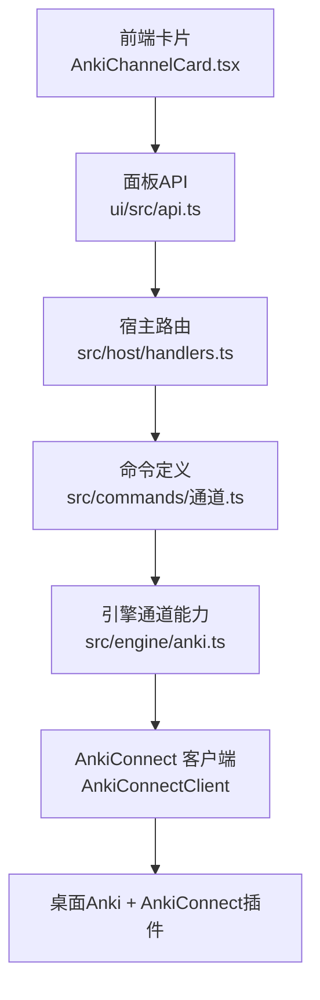
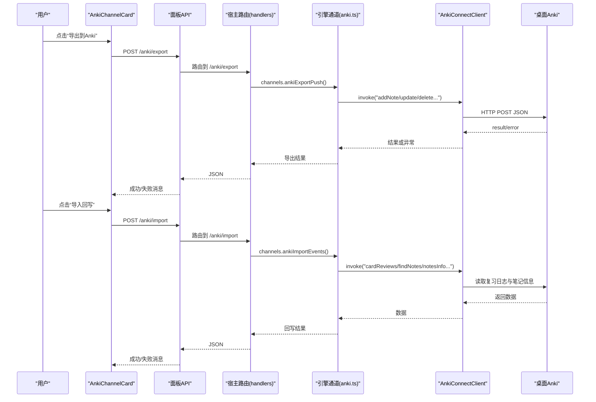
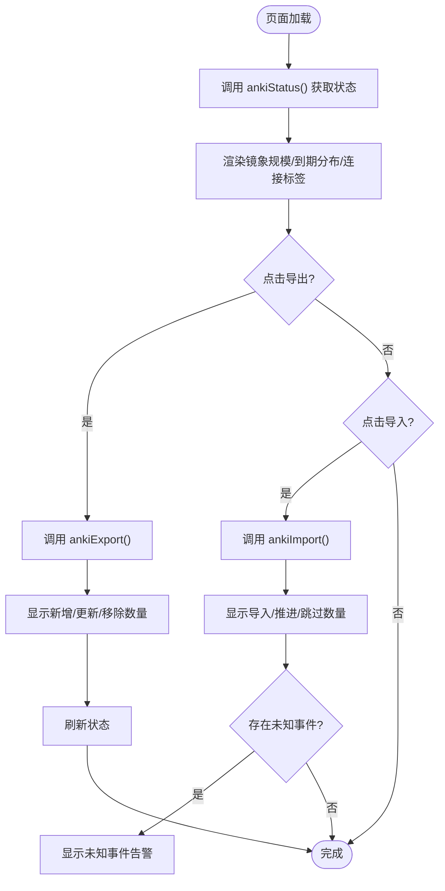
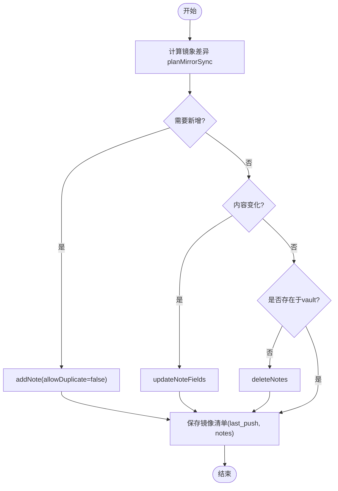
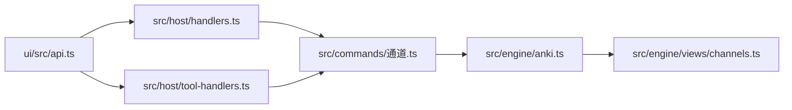

# Anki通道卡片

<cite>
**本文引用的文件**
- [AnkiChannelCard.tsx](file://ui/src/pages/InsightPage/AnkiChannelCard.tsx)
- [anki.ts](file://src/engine/anki.ts)
- [通道.ts](file://src/commands/通道.ts)
- [channels.ts（视图类型）](file://src/engine/views/channels.ts)
- [handlers.ts](file://src/host/handlers.ts)
- [tool-handlers.ts](file://src/host/tool-handlers.ts)
- [api.ts](file://ui/src/api.ts)
- [types.ts（UI 类型）](file://ui/src/types.ts)
- [anki.test.ts](file://tests/anki.test.ts)
</cite>

## 目录
1. [简介](#简介)
2. [项目结构](#项目结构)
3. [核心组件](#核心组件)
4. [架构总览](#架构总览)
5. [详细组件分析](#详细组件分析)
6. [依赖关系分析](#依赖关系分析)
7. [性能考量](#性能考量)
8. [故障诊断与排错](#故障诊断与排错)
9. [结论](#结论)
10. [附录：插件安装与配置指南](#附录插件安装与配置指南)

## 简介
本文件面向“Anki通道卡片”这一用户界面与后端通道的完整集成，说明如何通过 AnkiChannelCard 组件管理外部 Anki 同步通道。内容涵盖：
- Anki 集成的配置方法、连接建立与可达性检测
- 导出到 Anki（推送到期卡至镜象卡组）与导入回写（将作答事件写回 vault 并重新调度）
- 同步状态监控、日志与异常提示
- 错误处理与重试策略建议
- 常见集成问题定位与解决方案

## 项目结构
Anki 通道由前端卡片、命令路由、引擎能力与 AnkiConnect 客户端共同组成：
- 前端卡片：展示状态、触发导出/导入
- 命令与路由：暴露 /anki/status、/anki/export、/anki/import
- 引擎能力：计算镜象差异、调用 AnkiConnect、写入镜像清单、回写作答事件
- 传输层：通过 AnkiConnectClient 访问桌面 Anki（默认 http://127.0.0.1:8765）

**图表来源**
- [AnkiChannelCard.tsx:14-44](file://ui/src/pages/InsightPage/AnkiChannelCard.tsx#L14-L44)
- [api.ts:167-174](file://ui/src/api.ts#L167-L174)
- [handlers.ts:179,457,463:179-179](file://src/host/handlers.ts#L179-L179)
- [通道.ts:10-72](file://src/commands/通道.ts#L10-L72)
- [anki.ts:193-211](file://src/engine/anki.ts#L193-L211)

**章节来源**
- [AnkiChannelCard.tsx:14-44](file://ui/src/pages/InsightPage/AnkiChannelCard.tsx#L14-L44)
- [api.ts:167-174](file://ui/src/api.ts#L167-L174)
- [通道.ts:10-72](file://src/commands/通道.ts#L10-L72)
- [anki.ts:193-211](file://src/engine/anki.ts#L193-L211)

## 核心组件
- 前端卡片 AnkiChannelCard：拉取状态、执行导出/导入、展示连接状态与统计信息
- 命令与路由：anki-export、anki-import、anki-status
- 引擎能力 anki.ts：镜象 diff、AnkiConnect 调用、镜像清单持久化、作答事件映射与同日去重
- 视图类型 channels.ts：AnkiStatusDoc 等读视图形状

关键职责边界：
- 前端仅负责交互与消息提示
- 路由将 HTTP 请求转发到引擎通道
- 引擎负责与 Anki 的协议交互与数据一致性
- 传输层通过可注入的 AnkiTransport 抽象，便于测试与替换

**章节来源**
- [AnkiChannelCard.tsx:14-44](file://ui/src/pages/InsightPage/AnkiChannelCard.tsx#L14-L44)
- [通道.ts:10-72](file://src/commands/通道.ts#L10-L72)
- [anki.ts:120-143](file://src/engine/anki.ts#L120-L143)
- [channels.ts:7-14](file://src/engine/views/channels.ts#L7-L14)

## 架构总览
下图展示了从用户点击到 Anki 侧变更的端到端流程，以及回写时的事件流向。

**图表来源**
- [AnkiChannelCard.tsx:19-44](file://ui/src/pages/InsightPage/AnkiChannelCard.tsx#L19-L44)
- [api.ts:167-174](file://ui/src/api.ts#L167-L174)
- [handlers.ts:179,457,463:179-179](file://src/host/handlers.ts#L179-L179)
- [anki.ts:193-211](file://src/engine/anki.ts#L193-L211)
- [anki.ts:279-316](file://src/engine/anki.ts#L279-L316)

## 详细组件分析

### 前端卡片 AnkiChannelCard
- 功能
  - 拉取 Anki 通道状态（镜象规模、上次导出/回写时间、到期分布、AnkiConnect 连通性）
  - 触发导出到 Anki（推送到期卡到 learnhub::课程 镜象卡组）
  - 触发导入回写（拉取上次导入以来的作答事件，写回 vault 并重新调度）
  - 展示未知事件告警（无法归属的事件列表）
- 交互要点
  - 使用 useCommand 封装异步命令，统一加载态与错误提示
  - 操作成功后刷新状态，保证 UI 与后端一致
  - 按钮带 loading 态，避免重复提交

**图表来源**
- [AnkiChannelCard.tsx:14-44](file://ui/src/pages/InsightPage/AnkiChannelCard.tsx#L14-L44)
- [AnkiChannelCard.tsx:46-92](file://ui/src/pages/InsightPage/AnkiChannelCard.tsx#L46-L92)

**章节来源**
- [AnkiChannelCard.tsx:14-44](file://ui/src/pages/InsightPage/AnkiChannelCard.tsx#L14-L44)
- [AnkiChannelCard.tsx:46-92](file://ui/src/pages/InsightPage/AnkiChannelCard.tsx#L46-L92)

### 命令与路由
- 命令定义
  - anki-export：导出到期卡到 Anki（POST /anki/export）
  - anki-import：导入作答事件并写回（POST /anki/import）
  - anki-status：查询通道状态（GET /anki/status）
- 路由绑定
  - 面板通道：HTTP 路由
  - Agent 工具面：工具名称 learnhub_anki_export/import/status

**章节来源**
- [通道.ts:10-72](file://src/commands/通道.ts#L10-L72)
- [handlers.ts:179,457,463:179-179](file://src/host/handlers.ts#L179-L179)
- [tool-handlers.ts:257-263](file://src/host/tool-handlers.ts#L257-L263)

### 引擎能力与数据传输机制
- 导出流程
  - 计算当前 vault 到期集与现有镜象的差异（planMirrorSync）
  - 对新增/更新/删除分别调用 AnkiConnect（addNote/updateNoteFields/deleteNotes）
  - 更新本地镜像清单（last_push、notes），用于后续增量同步
- 导入流程
  - 读取上次导入水位以来的 cardReviews
  - 通过 notesInfo/findNotes 结合“来源字段”恢复归属（即使镜象丢失也能回补）
  - 将作答事件映射为 vault 语义（Again→答错；Hard/Good/Easy→自评档）
  - 同日已推进事件不重复调度，仅归档记录
- 镜象与一致性
  - 镜象是可丢弃派生状态，不一致时以 vault 为准
  - 缺失/损坏的镜像清单会静默重建，不会标记 Broken

**图表来源**
- [anki.ts:120-143](file://src/engine/anki.ts#L120-L143)
- [anki.ts:254-272](file://src/engine/anki.ts#L254-L272)

**章节来源**
- [anki.ts:120-143](file://src/engine/anki.ts#L120-L143)
- [anki.ts:254-272](file://src/engine/anki.ts#L254-L272)

### 连接建立与可达性检测
- 默认端点：http://127.0.0.1:8765
- 连接探测：通过 AnkiConnectClient.invoke 发送轻量请求，捕获网络错误与 HTTP 非 200
- 错误信息：包含端点与具体错误原因，便于用户排查（如未启动桌面 Anki、未安装插件、端口占用等）

**章节来源**
- [anki.ts:22-23](file://src/engine/anki.ts#L22-L23)
- [anki.ts:193-211](file://src/engine/anki.ts#L193-L211)
- [anki.test.ts:388-404](file://tests/anki.test.ts#L388-L404)

### 错误处理与重试策略
- 连接错误
  - 抛出明确错误，包含端点与原因；建议在 UI 层提示用户检查 Anki 与插件状态
- 业务错误
  - AnkiConnect 返回 error 字段时透传；重复添加时返回 null（调用方走来源字段检索）
  - 笔记不存在时提供 isAnkiNoteMissing 判断，支持安全重建
- 重试建议
  - 网络抖动：指数退避重试（例如 1s、2s、4s…），限制最大次数
  - 业务错误：区分可重试（超时/连接中断）与不可重试（参数错误/模型不存在）
  - 幂等性：导出基于指纹 diff，重复执行不会产生重复数据

**章节来源**
- [anki.ts:193-211](file://src/engine/anki.ts#L193-L211)
- [anki.ts:254-277](file://src/engine/anki.ts#L254-L277)
- [anki.test.ts:388-404](file://tests/anki.test.ts#L388-L404)

### 同步日志查看与性能监控
- 日志位置
  - 镜像清单：记录 last_push、last_import、notes（key/note_id/fp/deck）
  - 实践流水：导入事件落盘 practice 流（judge=review，时间戳来自 Anki 作答时间）
- 监控指标
  - 镜象规模（entries）、到期总数（due.total）、按卡组分布（by_deck）
  - 连接状态（connected/error）
  - 导入统计（imported/advanced/skipped_same_day/skipped_unknown）
- 性能优化
  - 使用指纹（FNV-1a）进行内容变更判定，减少不必要更新
  - 批量操作（如 deleteNotes 空数组保护）
  - 按需读取 reviews 区间，避免全量扫描

**章节来源**
- [anki.ts:96-118](file://src/engine/anki.ts#L96-L118)
- [anki.ts:311-323](file://src/engine/anki.ts#L311-L323)
- [channels.ts:7-14](file://src/engine/views/channels.ts#L7-L14)

## 依赖关系分析
- 前端依赖
  - ui/src/api.ts：封装 /anki/status、/anki/export、/anki/import
  - ui/src/types.ts：导出 AnkiExportResult、AnkiImportResult 等类型
- 宿主层
  - src/host/handlers.ts：路由到引擎 channels
  - src/host/tool-handlers.ts：工具面入口
- 引擎层
  - src/engine/anki.ts：核心逻辑（镜象、传输、映射、持久化）
  - src/commands/通道.ts：命令注册与路由声明
  - src/engine/views/channels.ts：读视图类型

**图表来源**
- [api.ts:167-174](file://ui/src/api.ts#L167-L174)
- [handlers.ts:179,457,463:179-179](file://src/host/handlers.ts#L179-L179)
- [tool-handlers.ts:257-263](file://src/host/tool-handlers.ts#L257-L263)
- [通道.ts:10-72](file://src/commands/通道.ts#L10-L72)
- [anki.ts:120-143](file://src/engine/anki.ts#L120-L143)
- [channels.ts:7-14](file://src/engine/views/channels.ts#L7-L14)

**章节来源**
- [api.ts:167-174](file://ui/src/api.ts#L167-L174)
- [handlers.ts:179,457,463:179-179](file://src/host/handlers.ts#L179-L179)
- [tool-handlers.ts:257-263](file://src/host/tool-handlers.ts#L257-L263)
- [通道.ts:10-72](file://src/commands/通道.ts#L10-L72)
- [anki.ts:120-143](file://src/engine/anki.ts#L120-L143)
- [channels.ts:7-14](file://src/engine/views/channels.ts#L7-L14)

## 性能考量
- 导出阶段
  - 使用 planMirrorSync 做 O(n) 差异计算，避免全量覆盖
  - 指纹比较减少不必要的 updateNoteFields 调用
- 导入阶段
  - 仅拉取上次导入后的 reviews，降低网络与解析开销
  - 同日已推进事件直接归档，避免重复调度
- 存储与 IO
  - 镜像清单原子写入，避免并发损坏
  - 批量删除空数组保护，减少无效请求

[本节为通用指导，不直接分析具体文件]

## 故障诊断与排错
- 连接失败
  - 现象：Anki 未连接，错误包含 ECONNREFUSED 或 HTTP 非 200
  - 排查：确认桌面 Anki 已启动、已安装 AnkiConnect 插件、端口 8765 未被占用
  - 参考：连接错误包装与透传
- 重复添加失败
  - 现象：addNote 返回 null 或报错 duplicate
  - 处理：调用方通过来源字段检索并更新已有笔记
- 笔记不存在
  - 现象：更新/删除时报 not found
  - 处理：isAnkiNoteMissing 判断后走重建流程
- 无法归属事件
  - 现象：导入后 unknown 列表非空
  - 处理：检查来源字段是否完整；必要时重建镜象清单

**章节来源**
- [anki.ts:193-211](file://src/engine/anki.ts#L193-L211)
- [anki.ts:254-277](file://src/engine/anki.ts#L254-L277)
- [anki.test.ts:388-404](file://tests/anki.test.ts#L388-L404)

## 结论
Anki 通道卡片提供了直观的状态监控与一键导出/回写能力，配合引擎层的镜象差异计算与稳健的错误处理，确保 vault 作为唯一调度者的原则不被破坏。通过清晰的连接检测、日志与指标，用户可以快速定位问题并进行修复。建议在生产环境引入指数退避重试与更细粒度的错误分类，以提升鲁棒性与用户体验。

[本节为总结，不直接分析具体文件]

## 附录：插件安装与配置指南
- 安装要求
  - 桌面版 Anki 已安装并运行
  - 安装 AnkiConnect 插件（默认监听 http://127.0.0.1:8765）
- 配置步骤
  - 无需额外配置即可使用默认端点；如需自定义，可在工具面传入 endpoint 参数
  - 首次使用时，先执行“导出到 Anki”，再在 Anki 中作答，最后执行“导入回写”
- 常见问题
  - 连接失败：检查 Anki 与插件是否启动、端口是否被占用
  - 模型/卡组不存在：系统会自动创建 learnhub 模型与 learnhub::课程 卡组
  - 重复推送：系统基于指纹去重，不会重复创建相同内容

**章节来源**
- [anki.ts:22-28](file://src/engine/anki.ts#L22-L28)
- [anki.ts:219-244](file://src/engine/anki.ts#L219-L244)
- [anki.ts:193-211](file://src/engine/anki.ts#L193-L211)