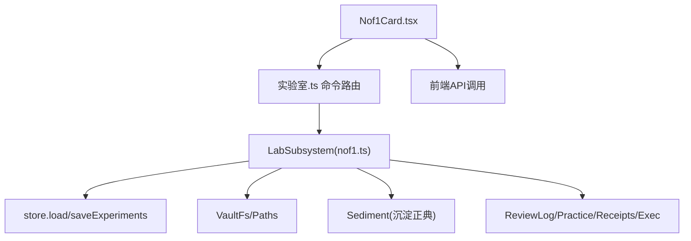
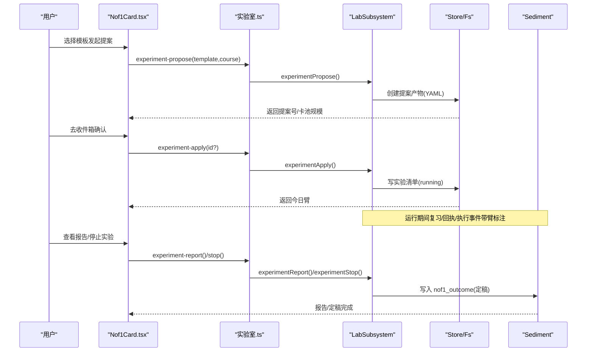
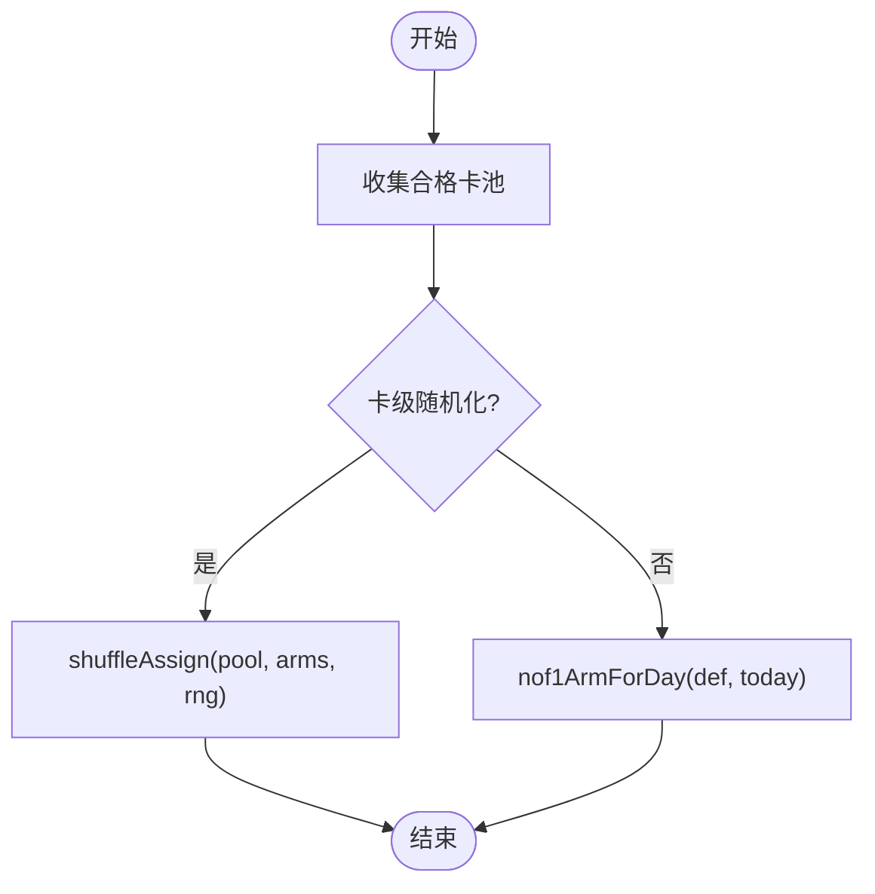
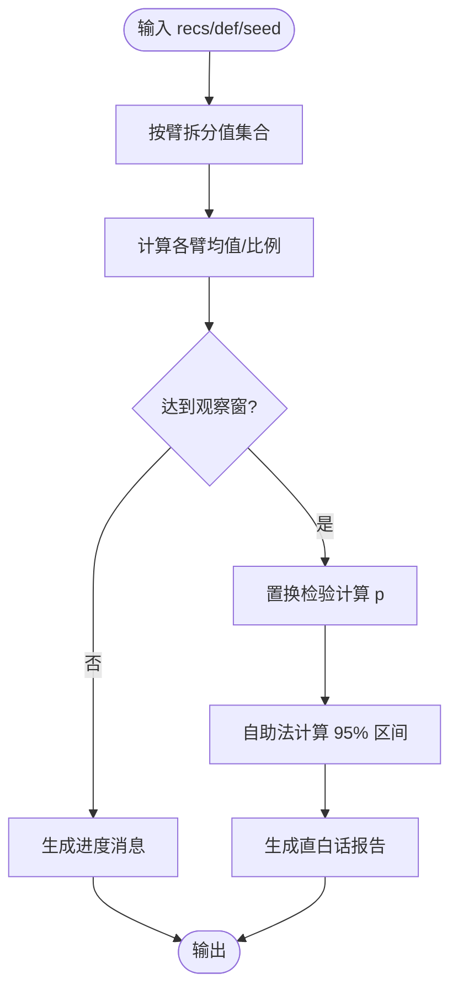
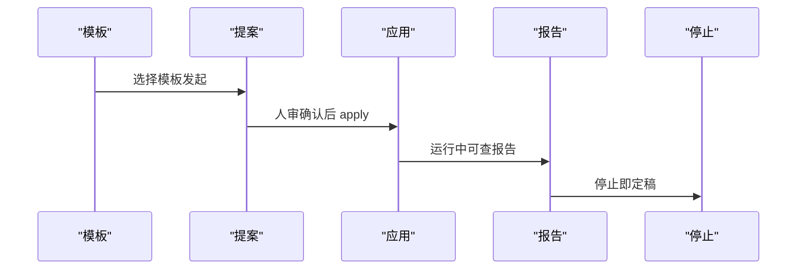
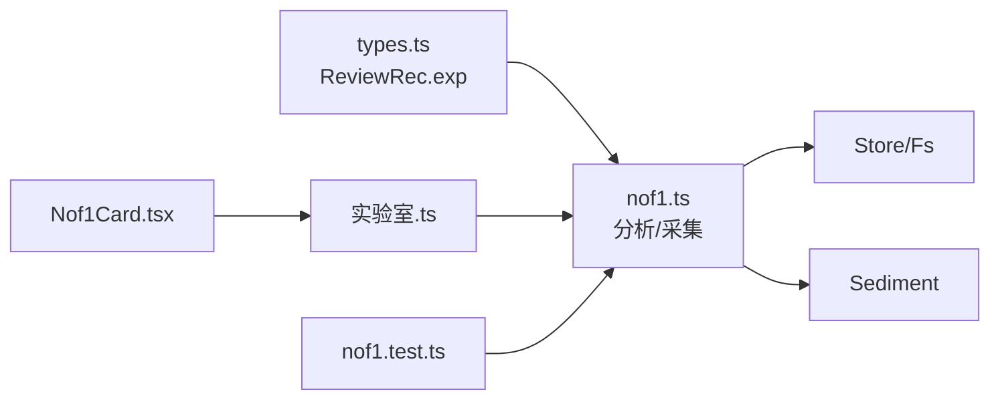

# N-of-1 实验卡片

<cite>
**本文引用的文件**
- [src/engine/nof1.ts](file://src/engine/nof1.ts)
- [ui/src/pages/InsightPage/Nof1Card.tsx](file://ui/src/pages/InsightPage/Nof1Card.tsx)
- [docs/adr/0023-n-of-1-experiment.md](file://docs/adr/0023-n-of-1-experiment.md)
- [docs/adr/0057-nof1-receipt-review-mode-variable.md](file://docs/adr/0057-nof1-receipt-review-mode-variable.md)
- [tests/nof1.test.ts](file://tests/nof1.test.ts)
- [src/engine/types.ts](file://src/engine/types.ts)
- [src/commands/实验室.ts](file://src/commands/实验室.ts)
</cite>

## 目录
1. [简介](#简介)
2. [项目结构](#项目结构)
3. [核心组件](#核心组件)
4. [架构总览](#架构总览)
5. [详细组件分析](#详细组件分析)
6. [依赖关系分析](#依赖关系分析)
7. [性能与统计特性](#性能与统计特性)
8. [故障排查指南](#故障排查指南)
9. [结论](#结论)
10. [附录：实践清单与最佳实践](#附录实践清单与最佳实践)

## 简介
N-of-1 实验卡片是“在自己身上做对照”的个人化实验研究入口。它基于单主体内随机化的自我实验设计，将同一批合格对象（题卡、节点或会话）按预登记方案分臂，用真实学习结果评估干预效果。系统提供模板库、提案-确认制开跑、数据标注、纯函数分析与直白话报告，并在停止时落盘定稿结局事件，重建学习者档案投影。

关键原则（来自 ADR-0023）：
- 实验变量白名单：仅允许引擎可控的内容/课程设计参数；调度核心（FSRS 转移、推进门、XP 账本语义）永不作实验变量。
- 随机化：v1 支持卡级随机化与批次交替；不建 ABAB/洗脱期等序列设计。
- 统计口径：主结局预登记；分析为臂间比较 + 置换检验 + 自助法 95% 区间；最短观察窗每臂 ≥N 次事件；不做序贯监控；开停手动。
- 启动通道：从模板发起 → 生成提案 → 人审确认后开跑。
- 数据边界：复习日志带 exp 标注；零 XP；不进 Mastery；FSRS 优化器默认混训不特判。

练习侧结局（#135/#203）：
- 练习侧结局 = 逐次练习评分事件（交互作答、回执量表评审、执行事件回流），按事件发生学习日归当日臂；只配批次交替（跨卡折叠，卡级分臂会污染）。
- 回执评审模式（receipt_review_mode）作为首个练习侧变量，双变体 ai/self，受接口不变式约束。

**章节来源**
- [docs/adr/0023-n-of-1-experiment.md:1-20](file://docs/adr/0023-n-of-1-experiment.md#L1-L20)
- [docs/adr/0057-nof1-receipt-review-mode-variable.md:1-14](file://docs/adr/0057-nof1-receipt-review-mode-variable.md#L1-L14)

## 项目结构
N-of-1 实验能力由“引擎层 + UI 卡片 + 命令路由 + 测试用例”构成：
- 引擎层：src/engine/nof1.ts 实现模板库、提案-确认、分臂策略、统计分析与 LabSubsystem 门面。
- UI 层：ui/src/pages/InsightPage/Nof1Card.tsx 提供模板发起、待确认提案提示、运行中实验状态与停止操作。
- 命令路由：src/commands/实验室.ts 暴露 experiment-propose / apply / stop / report 等命令。
- 类型与契约：src/engine/types.ts 定义 ReviewRec.exp 等字段，确保实验标注可追溯。
- 测试：tests/nof1.test.ts 覆盖纯函数、全链路、练习侧结局与回执评审模式。

**图表来源**
- [ui/src/pages/InsightPage/Nof1Card.tsx:1-170](file://ui/src/pages/InsightPage/Nof1Card.tsx#L1-L170)
- [src/commands/实验室.ts:25-56](file://src/commands/实验室.ts#L25-L56)
- [src/engine/nof1.ts:476-712](file://src/engine/nof1.ts#L476-L712)

**章节来源**
- [ui/src/pages/InsightPage/Nof1Card.tsx:1-170](file://ui/src/pages/InsightPage/Nof1Card.tsx#L1-L170)
- [src/commands/实验室.ts:25-56](file://src/commands/实验室.ts#L25-L56)
- [src/engine/nof1.ts:476-712](file://src/engine/nof1.ts#L476-L712)

## 核心组件
- 模板库与白名单：NOF1_TEMPLATES 与 NOF1_VARIABLE_WHITELIST，限定可实验的参数范围与已解锁项。
- 分臂策略：
  - 卡级随机化：shuffleAssign(pool, arms, rng)，播种确定，均分余数给前臂。
  - 批次交替：nof1ArmForDay(def, today) 按学习日序数轮臂。
  - 会话组成混排：interleaveBySource(cards) 将我的卡/笔记源均匀摊入题卡序列。
- 统计分析：analyzeNof1(recs, def, seed) 输出 per_arm、diff、ci95、p、message；未达观察窗仅报进度。
- 结局采集：
  - 调度侧：nof1Outcomes(logs, expId) 取 auto/self 首次推进的真实保留率二元值。
  - 练习侧：nof1PracticeOutcomes(def, streams, cutoff) 合并 practice/receipts/exec 三股流，按学习日归臂。
- LabSubsystem：experimentPropose/experimentApply/experimentStop/experimentReport，串联提案-确认、分臂、标注、报告与定稿。
- 回执评审模式：receiptReviewMode/setReceiptReviewMode/receiptReviewEffect，支持实验覆盖默认档。

**章节来源**
- [src/engine/nof1.ts:56-148](file://src/engine/nof1.ts#L56-L148)
- [src/engine/nof1.ts:161-222](file://src/engine/nof1.ts#L161-L222)
- [src/engine/nof1.ts:224-342](file://src/engine/nof1.ts#L224-L342)
- [src/engine/nof1.ts:344-429](file://src/engine/nof1.ts#L344-L429)
- [src/engine/nof1.ts:476-712](file://src/engine/nof1.ts#L476-L712)
- [src/engine/nof1.ts:715-765](file://src/engine/nof1.ts#L715-L765)

## 架构总览
N-of-1 实验在“提议-确认-运行-报告-停止-定稿”的闭环中运行：
- 提议：选择模板 → 计算合格卡池 → 写入提案产物（YAML）→ 进入待确认收件箱。
- 确认：重新校验产物与模板一致性 → 生成 ExperimentDef（含 assignment 分臂）→ 写实验清单并标记 running。
- 运行：复习队列/回执提交等路径读取当日生效臂，写入复习日志 exp 标注。
- 报告：按预登记结局聚合数据，输出直白话与统计指标。
- 停止：写入 nof1_outcome 沉淀事件（含 ready/diff/ci/p/message），更新实验状态为 stopped，重建学习者档案投影。

**图表来源**
- [ui/src/pages/InsightPage/Nof1Card.tsx:50-118](file://ui/src/pages/InsightPage/Nof1Card.tsx#L50-L118)
- [src/commands/实验室.ts:25-56](file://src/commands/实验室.ts#L25-L56)
- [src/engine/nof1.ts:537-619](file://src/engine/nof1.ts#L537-L619)
- [src/engine/nof1.ts:627-678](file://src/engine/nof1.ts#L627-L678)

**章节来源**
- [src/engine/nof1.ts:537-678](file://src/engine/nof1.ts#L537-L678)
- [ui/src/pages/InsightPage/Nof1Card.tsx:50-118](file://ui/src/pages/InsightPage/Nof1Card.tsx#L50-L118)

## 详细组件分析

### 模板库与白名单
- 模板包含 id、variable、arms、arm_labels、outcome、unit、unlocked 等字段，描述研究问题与干预方式。
- 白名单限制实验变量为内容/课程设计参数，避免触碰调度核心。
- 已解锁模板包括难度带默认、会话组成、回执评审模式等；PS-I/检索点模板随后续交付解锁。

**章节来源**
- [src/engine/nof1.ts:56-148](file://src/engine/nof1.ts#L56-L148)
- [tests/nof1.test.ts:109-129](file://tests/nof1.test.ts#L109-L129)

### 分臂与交替
- 卡级随机化：使用确定性 RNG（mulberry32）对合格卡池进行 Fisher–Yates 洗牌并均分入臂，保证可复现与审计。
- 批次交替：按学习日序数对臂序取模，无需计数器即可决定当日臂。
- 会话组成混排：将我的卡/笔记源均匀插入题卡序列，保持两列内部顺序。

**图表来源**
- [src/engine/nof1.ts:161-222](file://src/engine/nof1.ts#L161-L222)

**章节来源**
- [src/engine/nof1.ts:161-222](file://src/engine/nof1.ts#L161-L222)

### 统计分析
- analyzeNof1 统一处理二元比例差与连续均值差，输出 per_arm、diff、ci95、p、message。
- 未达最短观察窗（每臂 ≥N 次事件）时 ready=false，仅报进度。
- 采用置换检验（PERM_ITERS=9999）与自助法百分位区间（BOOT_ITERS=9999），播种确定。

**图表来源**
- [src/engine/nof1.ts:224-342](file://src/engine/nof1.ts#L224-L342)

**章节来源**
- [src/engine/nof1.ts:224-342](file://src/engine/nof1.ts#L224-L342)
- [tests/nof1.test.ts:67-90](file://tests/nof1.test.ts#L67-L90)

### 结局采集
- 调度侧：nof1Outcomes 过滤 auto/self、有 stability_before、同卡同日去重，映射 rating≥2 为 1，否则 0。
- 练习侧：nof1PracticeOutcomes 合并 practice/receipts/exec 三股流，按学习日归臂，窗口为 started_day 至 stopped_day，scope_course 约束课程附着流。

**章节来源**
- [src/engine/nof1.ts:344-429](file://src/engine/nof1.ts#L344-L429)
- [tests/nof1.test.ts:183-234](file://tests/nof1.test.ts#L183-L234)

### 提案-确认-运行-停止
- propose：校验模板与白名单，检查无运行实验，计算合格卡池，写入 YAML 提案产物。
- apply：重新解析产物并与模板逐项一致，生成 ExperimentDef（assignment 含 batch order 或 card map），写实验清单并标记 running。
- report：按结局聚合数据，输出直白话与统计指标。
- stop：写入 nof1_outcome 沉淀事件（含 ready/diff/ci/p/message），更新状态为 stopped，重建学习者档案投影。

**图表来源**
- [src/engine/nof1.ts:537-619](file://src/engine/nof1.ts#L537-L619)
- [src/engine/nof1.ts:627-678](file://src/engine/nof1.ts#L627-L678)

**章节来源**
- [src/engine/nof1.ts:537-678](file://src/engine/nof1.ts#L537-L678)
- [tests/nof1.test.ts:239-342](file://tests/nof1.test.ts#L239-L342)

### 回执评审模式（练习侧变量）
- 白名单增补 receipt_review_mode，双变体 ai/self。
- 配置默认档与实验覆盖：当实验变量匹配且为批次交替时，当日臂覆盖全局默认。
- 自评臂不调 LLM，review_mode='brief'，source='self'，与 AI 臂同权入 EMA。

**章节来源**
- [docs/adr/0057-nof1-receipt-review-mode-variable.md:1-14](file://docs/adr/0057-nof1-receipt-review-mode-variable.md#L1-L14)
- [src/engine/nof1.ts:715-765](file://src/engine/nof1.ts#L715-L765)
- [tests/nof1.test.ts:537-616](file://tests/nof1.test.ts#L537-L616)

## 依赖关系分析
- 类型契约：ReviewRec.exp 携带实验 id 与 arm，用于归档与归因。
- 存储与文件系统：通过 VaultFs/Paths 读写实验清单、提案产物、沉淀事件。
- 命令路由：实验室.ts 将 UI 动作映射到 engine.lab.* 方法。
- 测试用例：覆盖纯函数、全链路、练习侧结局与回执评审模式，保障行为稳定。

**图表来源**
- [src/engine/types.ts:168-200](file://src/engine/types.ts#L168-L200)
- [src/engine/nof1.ts:476-712](file://src/engine/nof1.ts#L476-L712)
- [src/commands/实验室.ts:25-56](file://src/commands/实验室.ts#L25-L56)
- [tests/nof1.test.ts:239-342](file://tests/nof1.test.ts#L239-L342)

**章节来源**
- [src/engine/types.ts:168-200](file://src/engine/types.ts#L168-L200)
- [src/engine/nof1.ts:476-712](file://src/engine/nof1.ts#L476-L712)
- [src/commands/实验室.ts:25-56](file://src/commands/实验室.ts#L25-L56)
- [tests/nof1.test.ts:239-342](file://tests/nof1.test.ts#L239-L342)

## 性能与统计特性
- 确定性 RNG：mulberry32 播种自实验 id，保证分臂与分析可复现。
- 统计复杂度：置换检验与自助法迭代次数固定（9999），适合个人实验场景。
- 读侧派生：练习侧结局从 practice/receipts/exec 三股流纯读侧聚合，避免写侧标注开销。
- 观察窗：每臂 ≥N 次事件（调度侧为真实推进，练习侧为练习评分事件），未达窗仅报进度。

**章节来源**
- [src/engine/nof1.ts:161-173](file://src/engine/nof1.ts#L161-L173)
- [src/engine/nof1.ts:224-342](file://src/engine/nof1.ts#L224-L342)
- [src/engine/nof1.ts:344-429](file://src/engine/nof1.ts#L344-L429)
- [tests/nof1.test.ts:67-90](file://tests/nof1.test.ts#L67-L90)

## 故障排查指南
- 模板未解锁/白名单外：propose 直接报错，需等待解锁或使用已解锁模板。
- 已有实验在跑：v1 一次一个实验，需先停止再发起新实验。
- 提案产物不一致：apply 拒绝，需重新发起提案。
- 练习侧模板接口违规：practice_ema 必须 unit=batch，否则 fail loud。
- 回执评审模式非法参数：self_score 越界或 force_full 在自评臂被拒。

**章节来源**
- [src/engine/nof1.ts:537-569](file://src/engine/nof1.ts#L537-L569)
- [src/engine/nof1.ts:573-619](file://src/engine/nof1.ts#L573-L619)
- [src/engine/nof1.ts:374-384](file://src/engine/nof1.ts#L374-L384)
- [tests/nof1.test.ts:239-273](file://tests/nof1.test.ts#L239-L273)
- [tests/nof1.test.ts:537-581](file://tests/nof1.test.ts#L537-L581)

## 结论
N-of-1 实验卡片提供了从模板发起、提案确认、运行标注、数据分析到停止定稿的完整闭环。它以白名单约束实验变量，以纯函数统计保证可复现与透明，以沉淀正典记录结局，帮助学习者在自身情境下科学评估干预效果。

## 附录：实践清单与最佳实践
- 实验设计指导
  - 选择已解锁模板，明确研究问题与主结局（真实保留率或练习评分 EMA）。
  - 理解分臂方式：卡级随机化 vs 批次交替；练习侧结局仅限批次交替。
  - 设定范围：可按课程 scope 限定实验范围。
- 实施步骤
  - 发起提案 → 前往收件箱确认 → 运行期间关注报告进度 → 达到观察窗后停止定稿。
- 数据记录规范
  - 复习日志自动带 exp 标注；练习侧三股流按学习日归臂；勘误净值已处理。
- 结果解读方法
  - 关注 diff、ci95、p 与直白话 message；未达观察窗仅看进度；个体效应口径，不做人群结论。
- 实验组与控制组设置
  - 通过模板 arms/arm_labels 定义两臂（如标准/挑战、分组/混排、AI/自评）；批次交替按学习日轮转。
- 审核流程与结果追踪
  - 提案-确认制：确认前零副作用；确认后才开跑；停止即定稿并写入沉淀正典。

**章节来源**
- [ui/src/pages/InsightPage/Nof1Card.tsx:50-118](file://ui/src/pages/InsightPage/Nof1Card.tsx#L50-L118)
- [src/engine/nof1.ts:537-678](file://src/engine/nof1.ts#L537-L678)
- [docs/adr/0023-n-of-1-experiment.md:1-20](file://docs/adr/0023-n-of-1-experiment.md#L1-L20)
- [docs/adr/0057-nof1-receipt-review-mode-variable.md:1-14](file://docs/adr/0057-nof1-receipt-review-mode-variable.md#L1-L14)
- [tests/nof1.test.ts:239-342](file://tests/nof1.test.ts#L239-L342)