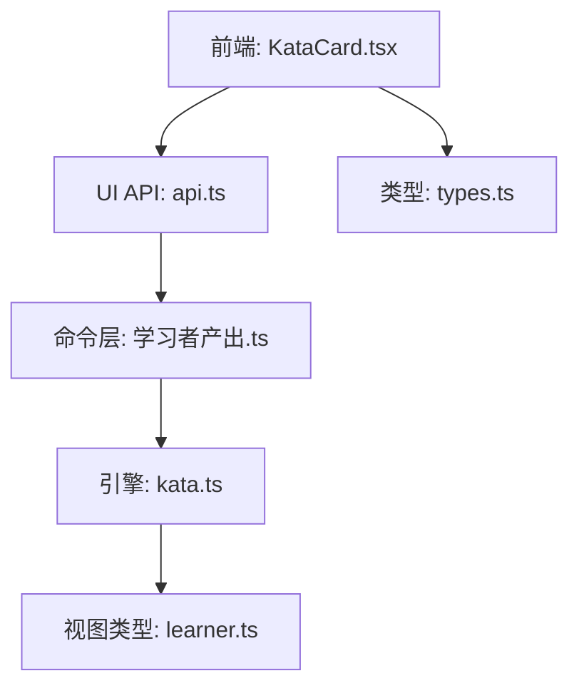
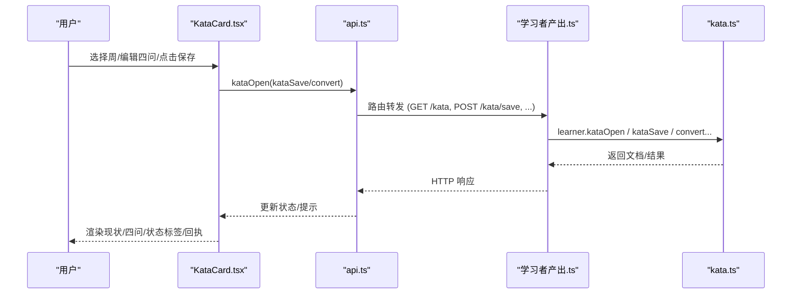
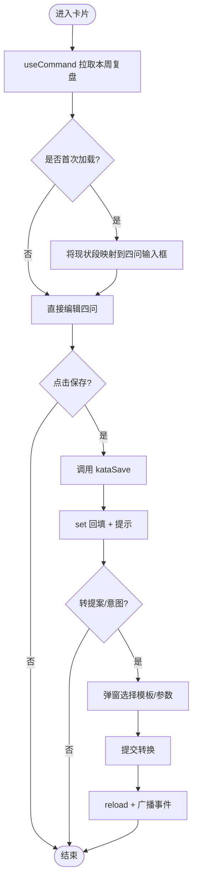
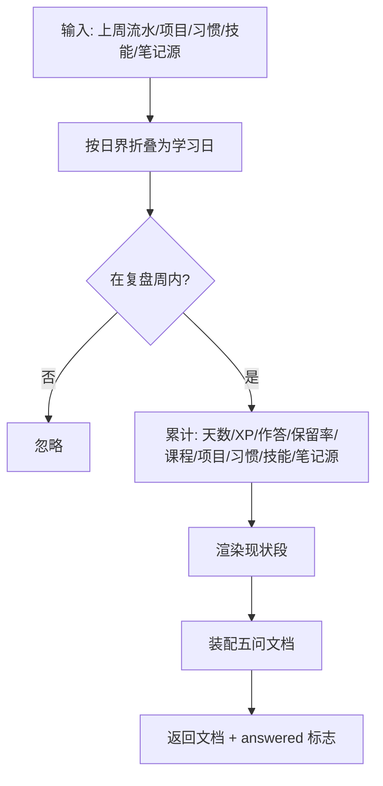
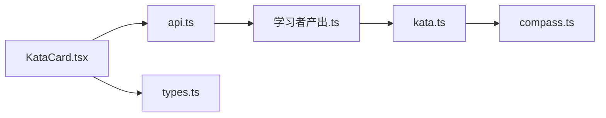

# 周复盘卡片

<cite>
**本文引用的文件**
- [KataCard.tsx](file://ui/src/pages/InsightPage/KataCard.tsx)
- [kata.ts](file://src/engine/kata.ts)
- [learner.ts](file://src/engine/views/learner.ts)
- [api.ts](file://ui/src/api.ts)
- [types.ts](file://ui/src/types.ts)
- [学习者产出.ts](file://src/commands/学习者产出.ts)
- [weekly-kata.test.ts](file://tests/weekly-kata.test.ts)
- [CONTEXT.md](file://CONTEXT.md)
</cite>

## 目录
1. [简介](#简介)
2. [项目结构](#项目结构)
3. [核心组件](#核心组件)
4. [架构总览](#架构总览)
5. [详细组件分析](#详细组件分析)
6. [依赖关系分析](#依赖关系分析)
7. [性能考量](#性能考量)
8. [故障排查指南](#故障排查指南)
9. [结论](#结论)
10. [附录](#附录)

## 简介
本文件围绕“周复盘卡片”（Weekly Kata）展开，聚焦前端 KataCard 组件与后端引擎的协作方式，解释每周五问复盘的生成逻辑、完成状态跟踪、进度统计、目标设置与管理、以及通过“下一实验”出口将反思转化为可执行的 N-of-1 提案或执行意图。该功能属于 Learner Output 域：零 XP、不进掌握度、不做 FSRS 卡；无推送、缺勤不罚；入口常驻于洞察区（周视图家）。

## 项目结构
周复盘卡片由前端 UI 组件、API 客户端、命令注册表与引擎实现共同构成：
- 前端：KataCard 组件负责展示与交互（选择周、作答四问、保存、转提案/意图）。
- API：封装 GET /kata、POST /kata/save、POST /kata/convert/experiment、POST /kata/convert/intention。
- 命令层：暴露 kata-open、kata-save、kata-convert-experiment、kata-convert-intention，并绑定面板路由与工具通道。
- 引擎：kata.ts 提供现状聚合、渲染、文档装配与解析；views/learner.ts 定义返回类型；测试覆盖关键行为。

图表来源
- [KataCard.tsx:1-198](file://ui/src/pages/InsightPage/KataCard.tsx#L1-L198)
- [api.ts:300-313](file://ui/src/api.ts#L300-L313)
- [学习者产出.ts:383-428](file://src/commands/学习者产出.ts#L383-L428)
- [kata.ts:1-346](file://src/engine/kata.ts#L1-L346)
- [learner.ts:1-26](file://src/engine/views/learner.ts#L1-L26)
- [types.ts:74-93](file://ui/src/types.ts#L74-L93)

章节来源
- [KataCard.tsx:1-198](file://ui/src/pages/InsightPage/KataCard.tsx#L1-L198)
- [api.ts:300-313](file://ui/src/api.ts#L300-L313)
- [学习者产出.ts:383-428](file://src/commands/学习者产出.ts#L383-L428)
- [kata.ts:1-346](file://src/engine/kata.ts#L1-L346)
- [learner.ts:1-26](file://src/engine/views/learner.ts#L1-L26)
- [types.ts:74-93](file://ui/src/types.ts#L74-L93)

## 核心组件
- 前端组件 KataCard：
  - 使用 useCommand 调用 api.kataOpen(week)，按周切换时自动重取数据。
  - 将引擎返回的“现状”段只读渲染；四问（目标条件/障碍/下一实验/预期所学）由用户编辑。
  - 保存后通过 set 回填，不打断输入；完成后显示“四问已齐”标签。
  - “下一实验”支持一键转 N-of-1 提案或挂执行意图，并在本地持久化回执与直达入口。
- 引擎 kata.ts：
  - 构建上周学习日的真实数据聚合（XP、作答次数与正确率、保留率、项目过点、习惯重复、技能执行、笔记源复习）。
  - 渲染现状段（含可选的沙盘 ETA 与罗盘对账旁挂）。
  - 装配/解析五问记录，判定 answered 状态。
- 命令与路由：
  - kata-open：打开某周复盘（默认上一完整学习周），返回文档与清单。
  - kata-save：保存四问作答（现状不可写）。
  - kata-convert-experiment / kata-convert-intention：从“下一实验”导出为提案或执行意图。

章节来源
- [KataCard.tsx:18-98](file://ui/src/pages/InsightPage/KataCard.tsx#L18-L98)
- [kata.ts:79-183](file://src/engine/kata.ts#L79-L183)
- [kata.ts:229-316](file://src/engine/kata.ts#L229-L316)
- [学习者产出.ts:383-428](file://src/commands/学习者产出.ts#L383-L428)

## 架构总览
下图展示了从前端到引擎的关键调用链路与数据流向。

图表来源
- [KataCard.tsx:27-98](file://ui/src/pages/InsightPage/KataCard.tsx#L27-L98)
- [api.ts:300-313](file://ui/src/api.ts#L300-L313)
- [学习者产出.ts:383-428](file://src/commands/学习者产出.ts#L383-L428)
- [kata.ts:289-316](file://src/engine/kata.ts#L289-L316)

## 详细组件分析

### 前端组件：KataCard.tsx
- 数据获取与状态管理
  - 使用 useCommand 拉取当前周的复盘文档；周切换触发重新加载。
  - 首次拿到文档时，将引擎“现状”段映射到四问输入框的初始值（占位处理）。
  - 保存成功后通过 set 回填，避免打断输入体验。
- 交互流程
  - 保存四问：调用 kataSave，成功则提示“四问已齐”或“还有未答的问”。
  - 转 N-of-1 提案：弹出模板与课程范围选择，发起提案后刷新页面并广播 reload，使收件箱入口即时可见。
  - 转执行意图：填写课程、节点、线索与行动，提交后提示“今日目标偏好已挂”，并刷新。
- 状态与反馈
  - 顶部 Tag 根据 answered 显示“四问已齐/待作答”。
  - 转换提案后显示常驻回执与直达入口（若传入 onOpenInbox）。

图表来源
- [KataCard.tsx:27-98](file://ui/src/pages/InsightPage/KataCard.tsx#L27-L98)
- [KataCard.tsx:100-158](file://ui/src/pages/InsightPage/KataCard.tsx#L100-L158)

章节来源
- [KataCard.tsx:18-98](file://ui/src/pages/InsightPage/KataCard.tsx#L18-L98)
- [KataCard.tsx:100-198](file://ui/src/pages/InsightPage/KataCard.tsx#L100-L198)

### 引擎实现：kata.ts
- 学习周折叠与归属
  - 以周一为周起点，结合日界（凌晨学习日归属）计算“上一完整学习周”。
- 现状聚合（buildKataReality）
  - 统计学习天数、XP、作答次数与正确率、到期复习次数与真实保留率。
  - 分课程统计作答与 XP；项目维度统计过点里程碑与执行事件均值；无界维度统计习惯重复与技能执行；笔记源复习计数并输出个人笔记出链。
- 现状渲染（renderKataReality）
  - 输出总览、有界·课程、可选的沙盘 ETA、可选的罗盘对账、有界·项目、无界、笔记源等小节。
- 文档装配与解析
  - assembleKataDoc：将现状与四问组装为 Markdown 文档。
  - parseKataBody：从正文解析各问内容。
  - kataAnswered：判断四问是否全部作答（占位视为未答）。
  - kataMonday：校验 week_start 必须为某周周一。

图表来源
- [kata.ts:79-183](file://src/engine/kata.ts#L79-L183)
- [kata.ts:229-316](file://src/engine/kata.ts#L229-L316)
- [kata.ts:331-346](file://src/engine/kata.ts#L331-L346)

章节来源
- [kata.ts:1-346](file://src/engine/kata.ts#L1-L346)

### 命令与路由：学习者产出.ts
- 命令注册
  - kata-open：GET /kata，绑定 agent 工具 learnhub_kata_open。
  - kata-save：POST /kata/save，绑定 agent 工具 learnhub_kata_save。
  - 转换接口：POST /kata/convert/experiment 与 /kata/convert/intention。
- 语义约束
  - 现状由引擎填充，保存仅写入四问；空字符串重置为未答。
  - 周参数需为周一；仅允许最近完整学习周。

章节来源
- [学习者产出.ts:383-428](file://src/commands/学习者产出.ts#L383-L428)

### 视图类型：learner.ts 与 types.ts
- KataDoc 描述打开/保存返回的结构：包含周起止、文件路径、是否新建、现状段、五问段落、answered 标志与已有清单。
- 前端类型通过 CommandOutput 派生，保证与命令输出一致。

章节来源
- [learner.ts:1-26](file://src/engine/views/learner.ts#L1-L26)
- [types.ts:74-93](file://ui/src/types.ts#L74-L93)

## 依赖关系分析
- 前端依赖
  - ui/src/pages/InsightPage/KataCard.tsx 依赖 ui/src/api.ts 提供的 API 方法。
  - ui/src/types.ts 提供 KataDoc 等类型，确保前后端契约一致。
- 命令层依赖
  - src/commands/学习者产出.ts 将面板路由与 agent 工具绑定到引擎入口。
- 引擎依赖
  - src/engine/kata.ts 聚合多源数据（practice/journal/review-log/habits/skills/note-sources/projects），并渲染现状段。
  - 与 compass 模块集成，注入沙盘 ETA 与路线对账摘要。

图表来源
- [KataCard.tsx:1-198](file://ui/src/pages/InsightPage/KataCard.tsx#L1-L198)
- [api.ts:300-313](file://ui/src/api.ts#L300-L313)
- [学习者产出.ts:383-428](file://src/commands/学习者产出.ts#L383-L428)
- [kata.ts:186-227](file://src/engine/kata.ts#L186-L227)
- [types.ts:74-93](file://ui/src/types.ts#L74-L93)

章节来源
- [KataCard.tsx:1-198](file://ui/src/pages/InsightPage/KataCard.tsx#L1-L198)
- [api.ts:300-313](file://ui/src/api.ts#L300-L313)
- [学习者产出.ts:383-428](file://src/commands/学习者产出.ts#L383-L428)
- [kata.ts:186-227](file://src/engine/kata.ts#L186-L227)
- [types.ts:74-93](file://ui/src/types.ts#L74-L93)

## 性能考量
- 现状聚合为纯函数，按周过滤与分组，时间复杂度与流水量线性相关；建议保持数据分区与索引以提升查询效率。
- 前端采用 useCommand 缓存与按需重载，减少重复请求；保存后通过 set 回填避免全量刷新。
- 转换提案/意图后触发 reload 与事件广播，确保同页其他卡片即时同步，但应避免频繁触发导致抖动。

[本节为通用指导，无需特定文件引用]

## 故障排查指南
- 无法保存或报错
  - 确认先调用 kata-open 打开对应周，再保存；非周一或未完成周会被拒绝。
  - 检查 answers 是否为空对象或字段缺失；空字符串会重置为未答。
- 状态未更新
  - 保存后应看到“四问已齐”标签；如未更新，检查 set 回填与 Message 提示。
  - 转换提案后需 reload；若未生效，检查窗口事件广播与收件箱入口。
- 日志与验证
  - 参考 weekly-kata.test.ts 中的用例，验证周折叠、现状聚合、保存与转换行为是否符合预期。

章节来源
- [weekly-kata.test.ts:92-143](file://tests/weekly-kata.test.ts#L92-L143)
- [weekly-kata.test.ts:145-161](file://tests/weekly-kata.test.ts#L145-L161)

## 结论
周复盘卡片通过“现状自动填 + 四问作答 + 下一实验出口”形成闭环：既沉淀学习事实，又驱动持续改进。其设计遵循 Learner Output 域纪律（零 XP、不进掌握度、不做 FSRS 卡），并通过提案-确认制与执行意图机制，将反思落地为可追踪的行动。前端交互简洁直观，引擎聚合严谨可靠，测试覆盖关键路径，便于长期维护与扩展。

[本节为总结性内容，无需特定文件引用]

## 附录

### 使用最佳实践
- 每周一固定时间打开卡片，回顾上周“现状”，明确“目标条件/障碍/下一实验/预期所学”。
- “下一实验”尽量具体、可操作；优先选择小步快跑的实验模板，降低试错成本。
- 将复盘文档注册为笔记源，以便后续复习与回溯。
- 利用“执行意图”将微小行动锚定到日常线索，提升执行力。

[本节为通用指导，无需特定文件引用]

### 常见问题解决方案
- 问题：本周尚未完结，无法打开
  - 解决：等待本周结束后再打开；或指定历史周一日期查看。
- 问题：保存后仍显示“待作答”
  - 解决：确认四问均已填写且不为占位；必要时重新打开文档核对。
- 问题：转换提案后未见收件箱入口
  - 解决：确保触发 reload 与事件广播；或在收件箱中查找最新提案。

[本节为通用指导，无需特定文件引用]