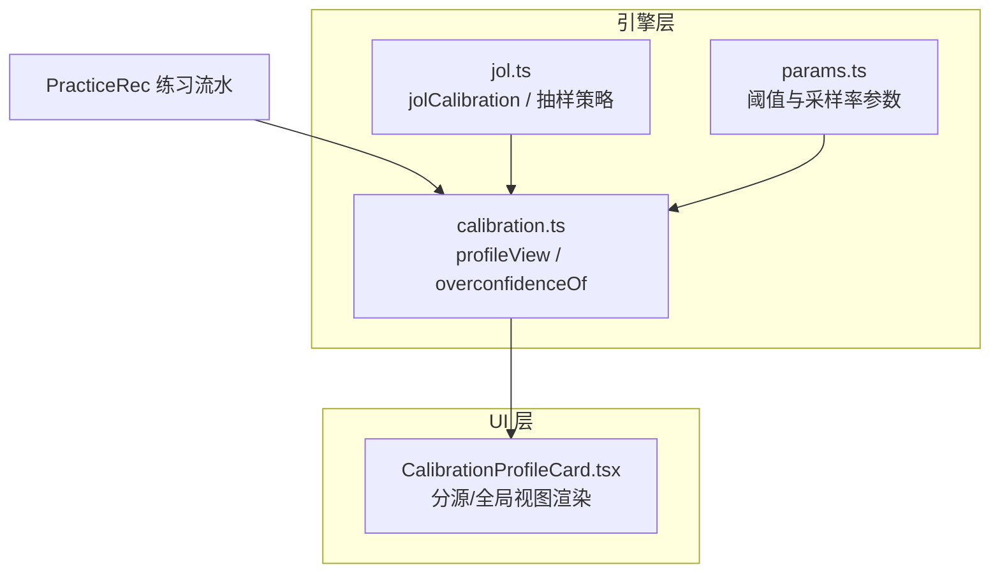
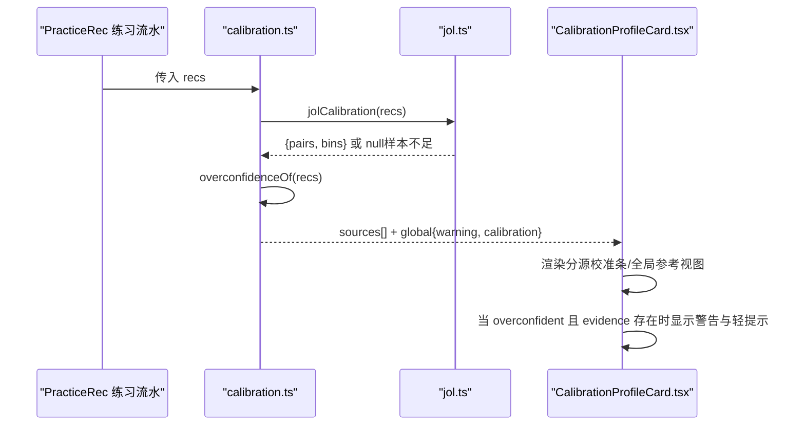
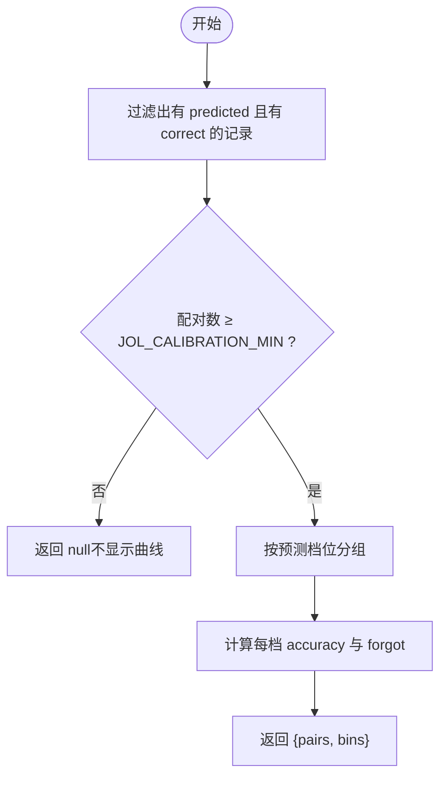
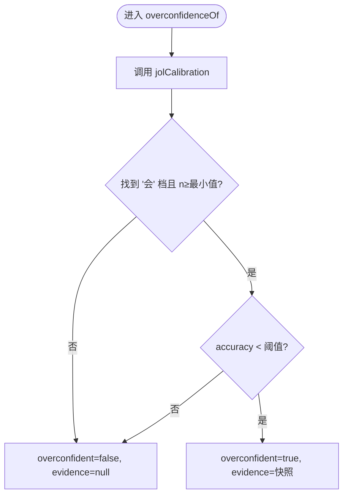
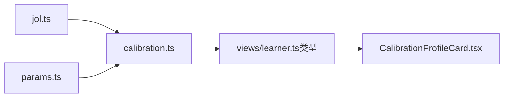

# 校准画像卡片

<cite>
**本文引用的文件**
- [CalibrationProfileCard.tsx](file://ui/src/pages/InsightPage/CalibrationProfileCard.tsx)
- [calibration.ts](file://src/engine/calibration.ts)
- [jol.ts](file://src/engine/jol.ts)
- [params.ts](file://src/engine/params.ts)
- [learner.ts（视图类型）](file://src/engine/views/learner.ts)
- [0022-self-calibration-profile.md（ADR-0022）](file://docs/adr/0022-self-calibration-profile.md)
</cite>

## 目录
1. [简介](#简介)
2. [项目结构](#项目结构)
3. [核心组件](#核心组件)
4. [架构总览](#架构总览)
5. [详细组件分析](#详细组件分析)
6. [依赖关系分析](#依赖关系分析)
7. [性能与数据门槛](#性能与数据门槛)
8. [故障排查指南](#故障排查指南)
9. [结论](#结论)
10. [附录：可视化与解读要点](#附录可视化与解读要点)

## 简介
本文件面向“校准画像卡片”的完整实现与使用，聚焦于学习者自评（如 JOL 预测：会/不会/没把握）与真实表现之间的差异分析。内容涵盖：
- 校准曲线的绘制原理与数据来源
- 置信区间与显著性说明（当前实现的边界）
- 校准偏差的解读方式（过度自信、信心不足）
- 识别学习模式并提供改进建议
- 数据的获取、处理与前端可视化的实现细节

该功能遵循 ADR-0022 的设计约束：只读派生、不进成绩度量、不改变 canonical 状态；以分源自省为主，全局聚合仅作为参考并附带域特异警戒提示。

## 项目结构
校准画像卡片由“引擎层计算 + UI 展示”两部分组成：
- 引擎层：从练习流水中抽取带自评档与客观结果的配对，按源聚合生成校准曲线与过信判定
- UI 层：渲染分源校准条、全局参考视图、过信警告与轻提示



图表来源
- [calibration.ts:74-103](file://src/engine/calibration.ts#L74-L103)
- [jol.ts:61-78](file://src/engine/jol.ts#L61-L78)
- [params.ts:39-41](file://src/engine/params.ts#L39-L41)
- [CalibrationProfileCard.tsx:11-93](file://ui/src/pages/InsightPage/CalibrationProfileCard.tsx#L11-L93)

章节来源
- [calibration.ts:1-111](file://src/engine/calibration.ts#L1-L111)
- [jol.ts:1-79](file://src/engine/jol.ts#L1-L79)
- [params.ts:1-59](file://src/engine/params.ts#L1-L59)
- [CalibrationProfileCard.tsx:1-94](file://ui/src/pages/InsightPage/CalibrationProfileCard.tsx#L1-L94)

## 核心组件
- 校准画像视图（引擎）：将 PracticeRec 中的自评与结果配对，按源聚合为校准曲线，并输出过信判定与时间戳区间
- 过信检测（引擎）：在“会”档样本量达标时，若实际正确率低于阈值则判定系统性过信，并产出证据快照
- 校准卡片（UI）：渲染分源校准条、全局参考视图、过信标签与轻提示文案

章节来源
- [calibration.ts:25-67](file://src/engine/calibration.ts#L25-L67)
- [calibration.ts:74-103](file://src/engine/calibration.ts#L74-L103)
- [CalibrationProfileCard.tsx:11-93](file://ui/src/pages/InsightPage/CalibrationProfileCard.tsx#L11-L93)

## 架构总览
下图展示了从练习流水到卡片展示的端到端流程，包括数据过滤、聚合、过信判定与 UI 呈现。



图表来源
- [calibration.ts:74-103](file://src/engine/calibration.ts#L74-L103)
- [jol.ts:61-78](file://src/engine/jol.ts#L61-L78)
- [CalibrationProfileCard.tsx:17-56](file://ui/src/pages/InsightPage/CalibrationProfileCard.tsx#L17-L56)

## 详细组件分析

### 校准曲线绘制原理
- 数据来源：PracticeRec 中携带 predicted（自评档）与 correct（客观对错）的记录构成“配对”。v1 仅接入 jol 源
- 聚合口径：按预测档位（会/不会/没把握）分组，统计每组内的实际正确率与忘记次数
- 数据门槛：配对数不足 JOL_CALIBRATION_MIN（默认 10）时，返回 null 且不伪造曲线
- 输出结构：每个 bin 包含 label、n、accuracy、forgot；整体包含 pairs 总数



图表来源
- [jol.ts:61-78](file://src/engine/jol.ts#L61-L78)
- [calibration.ts:84-98](file://src/engine/calibration.ts#L84-L98)

章节来源
- [jol.ts:1-79](file://src/engine/jol.ts#L1-L79)
- [calibration.ts:74-103](file://src/engine/calibration.ts#L74-L103)

### 置信区间的计算方法
- 当前实现未提供置信区间或统计检验；仅输出点估计（每档的实际正确率）
- 设计理由：保持轻量与稳健，避免在小样本下产生误导性区间；同时遵循“低数据静默”原则
- 扩展建议：如需置信区间，可在 bins 上增加基于二项分布的区间估计（例如 Wilson 区间），并在 UI 中以误差条形式呈现

章节来源
- [jol.ts:61-78](file://src/engine/jol.ts#L61-L78)
- [calibration.ts:74-103](file://src/engine/calibration.ts#L74-L103)

### 校准偏差的解读方式
- 过信检测：针对“会”档，当样本量达标且实际正确率低于阈值（CALIBRATION_OVERCONF_THRESHOLD，默认 0.6）时，判定为系统性过信
- 信心不足：若“不会”或“没把握”档的实际正确率高于宣称水平，可视为相对保守或信心不足
- 证据呈现：过信时附带证据快照（source、self、n、accuracy、threshold），便于用户理解判断依据



图表来源
- [calibration.ts:51-67](file://src/engine/calibration.ts#L51-L67)
- [params.ts:39-41](file://src/engine/params.ts#L39-L41)

章节来源
- [calibration.ts:25-67](file://src/engine/calibration.ts#L25-L67)
- [params.ts:39-41](file://src/engine/params.ts#L39-L41)

### 通过校准画像识别学习模式与建议
- 过度自信模式：
  - 特征：“会”档实际正确率持续偏低（低于阈值），但自评偏高
  - 建议：复习时将这些卡当作“没把握”处理；降低预测出口的预期；加强反思与错题复盘
- 信心不足模式：
  - 特征：“不会/没把握”档实际正确率高于预期，或“会”档准确率接近或超过阈值
  - 建议：适度提升自我评估的乐观度；在预测出口更贴近真实把握；关注易错点而非整体能力
- 干预机制：
  - 当检测到过信且提示开启时，可在自评出口给出轻提示，并提高后续 JOL 抽查密度（从 1/3 提升到 1/2），帮助更快校准

章节来源
- [calibration.ts:105-110](file://src/engine/calibration.ts#L105-L110)
- [params.ts:39-41](file://src/engine/params.ts#L39-L41)
- [CalibrationProfileCard.tsx:21-50](file://ui/src/pages/InsightPage/CalibrationProfileCard.tsx#L21-L50)

### 数据的获取、处理与可视化实现细节
- 数据获取：
  - 入口函数 calibrationProfileView 接收 PracticeRec 数组，按源枚举（v1 为 jol）进行聚合
  - 时间戳区间：first_ts/last_pair_ts 取该源配对集合的最早/最晚 ts（字符串序即时间序）
- 数据处理：
  - 复用 jolCalibration 完成配对筛选、分组与准确率计算
  - overconfidenceOf 负责过信判定与证据快照生成
- 可视化：
  - 分源视图：逐档显示预测标签与实际正确率的条形图，标注样本量与忘记次数
  - 全局参考视图：折叠区域展示跨源合并的参考曲线，并附带“域特异，仅供参考”的警告
  - 过信标记：当 overconfident 且 evidence 存在时，显示橙色标签与警告信息

```mermaid
classDiagram
class CalibrationSourceProfile {
+string source
+string first_ts
+string last_pair_ts
+calibration : {pairs; bins} | null
+overconfidence : {overconfident; evidence}
}
class CalibrationProfileDoc {
+sources : CalibrationSourceProfile[]
+global : {calibration; warning}
}
class JolBin {
+string label
+number n
+number|accuracy
+number forgot
}
CalibrationProfileDoc --> CalibrationSourceProfile : "包含"
CalibrationSourceProfile --> JolBin : "bins[]"
```

图表来源
- [learner.ts:130-147](file://src/engine/views/learner.ts#L130-L147)
- [calibration.ts:74-103](file://src/engine/calibration.ts#L74-L103)
- [jol.ts:59-78](file://src/engine/jol.ts#L59-L78)

章节来源
- [calibration.ts:74-103](file://src/engine/calibration.ts#L74-L103)
- [learner.ts:130-147](file://src/engine/views/learner.ts#L130-L147)
- [CalibrationProfileCard.tsx:17-88](file://ui/src/pages/InsightPage/CalibrationProfileCard.tsx#L17-L88)

## 依赖关系分析
- 引擎层依赖：
  - jol.ts：提供配对筛选、分组与准确率计算；定义抽样策略与数据门槛
  - params.ts：提供过信阈值与抽样增强比例等可调参数
- UI 层依赖：
  - 视图类型来自 engine/views/learner.ts，确保前后端契约一致
  - 卡片组件消费 profile 数据并渲染分源/全局视图与警告



图表来源
- [calibration.ts:20-23](file://src/engine/calibration.ts#L20-L23)
- [jol.ts:1-79](file://src/engine/jol.ts#L1-L79)
- [params.ts:39-41](file://src/engine/params.ts#L39-L41)
- [learner.ts:130-147](file://src/engine/views/learner.ts#L130-L147)
- [CalibrationProfileCard.tsx:11-93](file://ui/src/pages/InsightPage/CalibrationProfileCard.tsx#L11-L93)

章节来源
- [calibration.ts:20-23](file://src/engine/calibration.ts#L20-L23)
- [jol.ts:1-79](file://src/engine/jol.ts#L1-L79)
- [params.ts:39-41](file://src/engine/params.ts#L39-L41)
- [learner.ts:130-147](file://src/engine/views/learner.ts#L130-L147)
- [CalibrationProfileCard.tsx:11-93](file://ui/src/pages/InsightPage/CalibrationProfileCard.tsx#L11-L93)

## 性能与数据门槛
- 数据门槛：配对数不足 JOL_CALIBRATION_MIN（默认 10）时，曲线与过信判定均静默，避免小样本误导
- 计算复杂度：对 PracticeRec 进行线性扫描与分组，时间复杂度 O(n)，空间复杂度 O(k)（k 为预测档数量，固定为 3）
- 抽样策略：JOL 抽查默认约 1/3 复习卡，过信检出时可提升至 1/2，以提升校准反馈频率
- 零写入约束：画像为只读派生，不修改 canonical 状态，不影响 FSRS 评分与掌握度/XP

章节来源
- [jol.ts:15-19](file://src/engine/jol.ts#L15-L19)
- [params.ts:39-41](file://src/engine/params.ts#L39-L41)
- [calibration.ts:15-18](file://src/engine/calibration.ts#L15-L18)

## 故障排查指南
- 曲线不显示：
  - 检查配对数是否达到最小门槛（JOL_CALIBRATION_MIN）
  - 确认 PracticeRec 中是否存在 predicted 与 correct 字段
- 过信未检出：
  - 核对“会”档样本量与 actual accuracy 是否低于阈值（CALIBRATION_OVERCONF_THRESHOLD）
  - 确认提示开关是否启用（hints_enabled）
- 全局视图与分源不一致：
  - 全局视图为参考，应以分源为准；注意域特异警戒文案
- 轻提示未出现：
  - 仅在 overconfident 且 evidence 存在时才会生成提示文本

章节来源
- [jol.ts:61-78](file://src/engine/jol.ts#L61-L78)
- [calibration.ts:51-67](file://src/engine/calibration.ts#L51-L67)
- [calibration.ts:105-110](file://src/engine/calibration.ts#L105-L110)
- [CalibrationProfileCard.tsx:21-56](file://ui/src/pages/InsightPage/CalibrationProfileCard.tsx#L21-L56)

## 结论
校准画像卡片以“分源自省为主、全局参考为辅”的方式，帮助学习者识别自评与真实表现之间的差异。其核心优势在于：
- 严格的数据门槛与只读派生，保证稳健性与公平性
- 清晰的过信检测与轻提示，提供即时反馈与行为引导
- 可扩展的源接入契约，便于未来引入更多自评来源

建议在后续迭代中考虑加入置信区间与统计检验，以进一步增强可视化与诊断能力。

## 附录：可视化与解读要点
- 分源校准条：横轴为预测档位，纵轴为实际正确率；样本量与忘记次数辅助判断可靠性
- 全局参考视图：用于概览，需结合“域特异，仅供参考”的警告谨慎解读
- 过信标签与警告：当“会”档准确率持续偏低时，提示复习策略调整与预测出口保守化
- 改进建议：
  - 过度自信：降低预测乐观度，强化错题复盘与反思
  - 信心不足：适度提升预测乐观度，关注易错点而非整体能力

章节来源
- [CalibrationProfileCard.tsx:17-88](file://ui/src/pages/InsightPage/CalibrationProfileCard.tsx#L17-L88)
- [calibration.ts:48-67](file://src/engine/calibration.ts#L48-L67)
- [0022-self-calibration-profile.md:1-27](file://docs/adr/0022-self-calibration-profile.md#L1-L27)