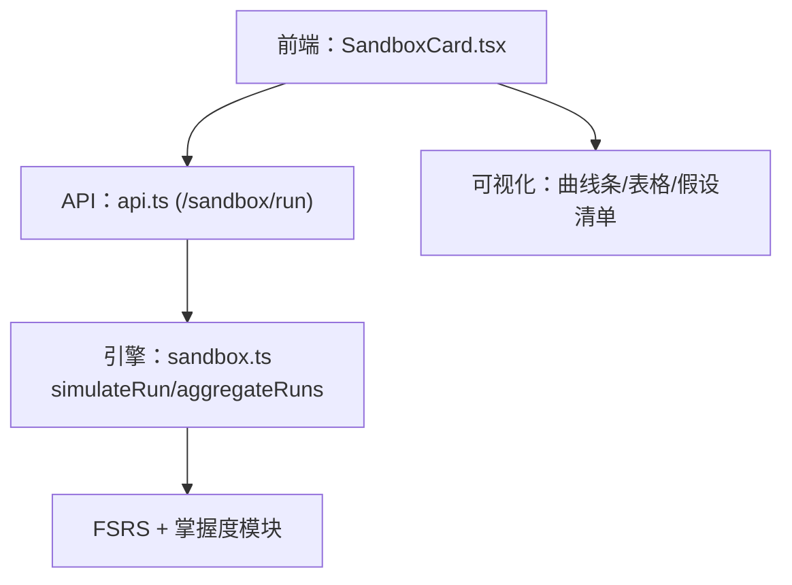
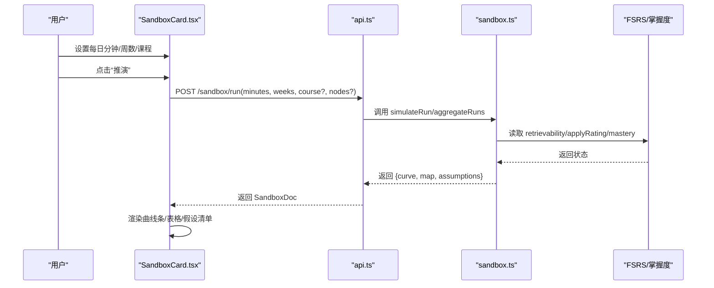
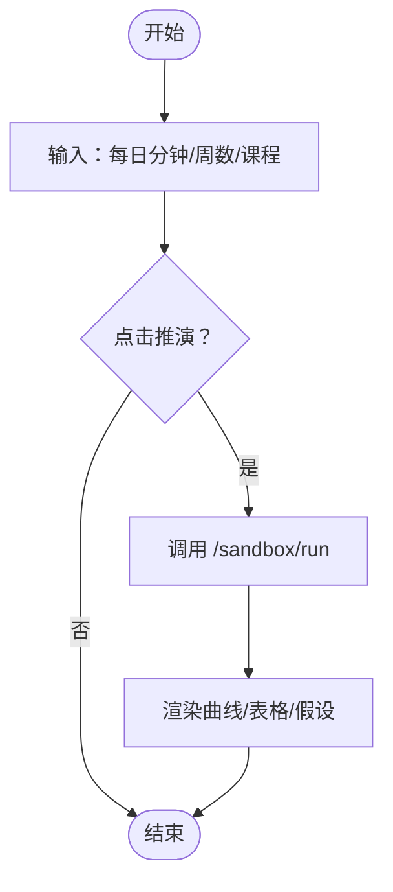
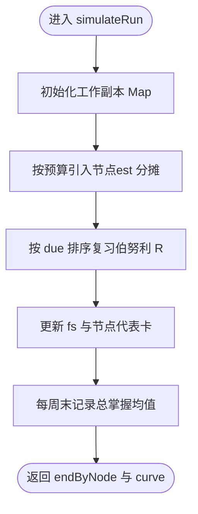
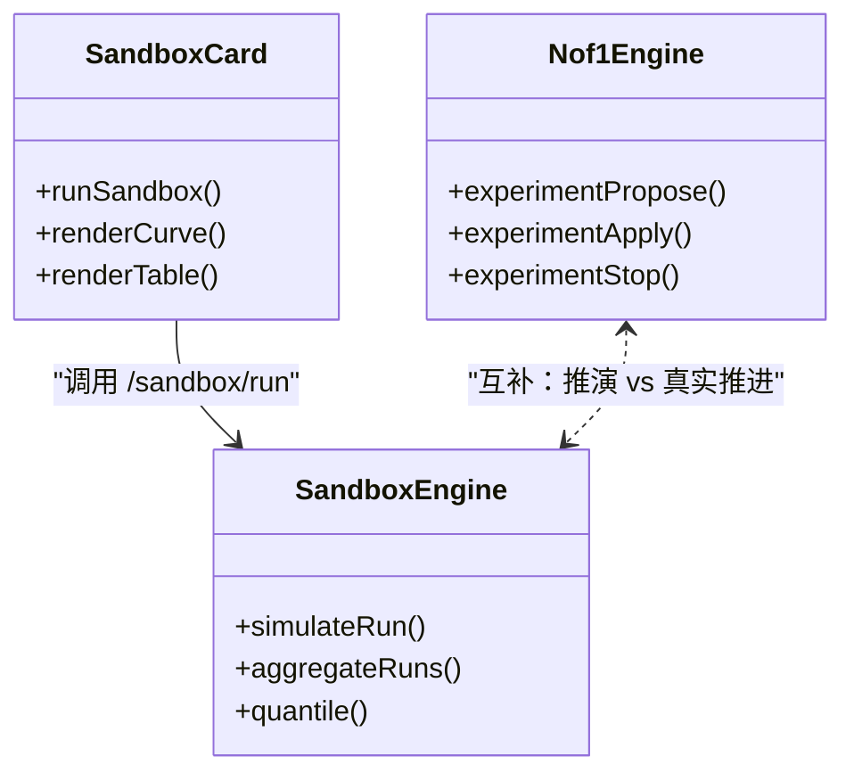
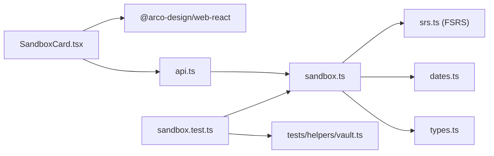

# 沙盘卡片

<cite>
**本文引用的文件**
- [SandboxCard.tsx](file://ui/src/pages/InsightPage/SandboxCard.tsx)
- [sandbox.ts](file://src/engine/sandbox.ts)
- [api.ts](file://ui/src/api.ts)
- [nof1.ts](file://src/engine/nof1.ts)
- [Nof1Card.tsx](file://ui/src/pages/InsightPage/Nof1Card.tsx)
- [实验室.ts](file://src/commands/实验室.ts)
- [CONTEXT.md](file://CONTEXT.md)
- [0023-n-of-1-experiment.md](file://docs/adr/0023-n-of-1-experiment.md)
- [sandbox.test.ts](file://tests/sandbox.test.ts)
</cite>

## 目录
1. [简介](#简介)
2. [项目结构](#项目结构)
3. [核心组件](#核心组件)
4. [架构总览](#架构总览)
5. [详细组件分析](#详细组件分析)
6. [依赖关系分析](#依赖关系分析)
7. [性能考量](#性能考量)
8. [故障排查指南](#故障排查指南)
9. [结论](#结论)
10. [附录](#附录)

## 简介
本文件围绕“沙盘卡片”（SandboxCard）展开，说明其如何基于现有 FSRS+掌握度模型进行蒙特卡洛推演，为学习计划提供只读、分布式的结果视图。它用于：
- 模拟学习场景与假设验证：输入每日分钟目标×周数，可选课程/节点范围，输出逐周掌握度分位带与节点级掌握度地图。
- 实验环境搭建与变量控制：通过 API 传入计划参数；引擎侧以纯函数实现抽样与聚合，RNG 可播种保证可重复性。
- 结果分析方法：关注 p50/p80 分位带、曲线趋势与假设清单；不给出可行性判定或承诺。
- 与 N-of-1 实验的协同：沙盘是“读侧推演”，N-of-1 是“真实推进对照”。两者互补，分别回答“如果按此计划会怎样”和“实际干预是否有效”。

重要约束：
- 措辞锁死：输出始终标注“模型推演，非承诺”，避免将分布误读为预测或承诺。
- 零写侧：推演不进门禁、不进调度、不改账本，不影响任何 canonical 数据。

**章节来源**
- [CONTEXT.md:283-289](file://CONTEXT.md#L283-L289)
- [sandbox.ts:1-24](file://src/engine/sandbox.ts#L1-L24)

## 项目结构
沙盘功能由前端卡片、API 调用、后端引擎与测试共同组成：
- 前端：洞察页中的 SandboxCard 组件负责用户交互与结果可视化。
- API：封装 /sandbox/run 接口，接收每日分钟、周数、课程/节点过滤等参数。
- 引擎：sandbox.ts 提供 simulateRun、aggregateRuns、quantile 等纯函数，复用 FSRS 与掌握度计算。
- 测试：sandbox.test.ts 覆盖确定性、预算引入、复习推进、零写侧等关键行为。

**图表来源**
- [SandboxCard.tsx:33-88](file://ui/src/pages/InsightPage/SandboxCard.tsx#L33-L88)
- [api.ts:259-264](file://ui/src/api.ts#L259-L264)
- [sandbox.ts:81-209](file://src/engine/sandbox.ts#L81-L209)

**章节来源**
- [SandboxCard.tsx:33-88](file://ui/src/pages/InsightPage/SandboxCard.tsx#L33-L88)
- [api.ts:259-264](file://ui/src/api.ts#L259-L264)
- [sandbox.ts:81-209](file://src/engine/sandbox.ts#L81-L209)

## 核心组件
- 前端卡片（SandboxCard）
  - 输入：每日分钟、周数、课程选择（可选）、节点过滤（通过 API）。
  - 动作：点击“推演”调用 api.sandboxRun，展示分布结果与假设清单。
  - 输出：每周 p50/p80 条形图、节点掌握度表、运行次数与范围说明。
- 引擎（sandbox.ts）
  - 纯函数：simulateRun 执行单次推演；aggregateRuns 聚合多次运行得到 p50/p80；quantile 计算分位数。
  - 假设：复习成本常数化、新节点按 est 引入、练习证据冻结、节点代表卡跟随首次推进结果。
  - 约束：与调度同源（复用 srs.retrievabilityBlock/applyRatingBlock/masteryValue），不引入新记忆模型。
- 测试（sandbox.test.ts）
  - 断言：确定性（同种子同结果）、预算决定引入、到期卡复习推进、跳过节点不计入、全链路零写入。

**章节来源**
- [SandboxCard.tsx:33-88](file://ui/src/pages/InsightPage/SandboxCard.tsx#L33-L88)
- [sandbox.ts:32-41](file://src/engine/sandbox.ts#L32-L41)
- [sandbox.ts:81-209](file://src/engine/sandbox.ts#L81-L209)
- [sandbox.test.ts:34-118](file://tests/sandbox.test.ts#L34-L118)

## 架构总览
沙盘从前端到引擎的数据流如下：

**图表来源**
- [SandboxCard.tsx:40-49](file://ui/src/pages/InsightPage/SandboxCard.tsx#L40-L49)
- [api.ts:259-264](file://ui/src/api.ts#L259-L264)
- [sandbox.ts:81-209](file://src/engine/sandbox.ts#L81-L209)

## 详细组件分析

### 前端卡片：SandboxCard
- 职责：收集用户计划参数，发起推演，渲染分布结果。
- 关键点：
  - 使用 InputNumber 控制每日分钟与周数，Select 限定课程范围。
  - 调用 api.sandboxRun 后展示 runs、scope、curve、map、assumptions。
  - 明确提示“模型推演，非承诺”，避免误读。
- 可视化：
  - 曲线条：浅色表示 p80，实色表示 p50，直观呈现不确定性区间。
  - 表格：节点级 p50/p80 掌握度。
  - 假设清单：随输出附带，便于理解推演前提。

**图表来源**
- [SandboxCard.tsx:33-88](file://ui/src/pages/InsightPage/SandboxCard.tsx#L33-L88)

**章节来源**
- [SandboxCard.tsx:33-88](file://ui/src/pages/InsightPage/SandboxCard.tsx#L33-L88)

### 引擎：sandbox.ts
- 纯函数设计：
  - simulateRun(plan, cards, nodes, today, deps)：单次推演，返回 endByNode 与 curve。
  - aggregateRuns(runs, nodeKeys, weeks)：聚合多次运行，计算 p50/p80。
  - quantile(values, q)：线性插值分位数。
- 假设与口径：
  - 复习成本固定为 REVIEW_MIN 分钟；预算耗尽则顺延。
  - 新节点按课程图序引入，学成时合成 Good，休眠题同日入场。
  - 练习证据（EMA/正确率）冻结，仅模拟“记”的维持。
  - 节点代表卡跟随当日首次推进结果。
- 同源约束：
  - 复用 srs.retrievabilityBlock/applyRatingBlock/masteryValue，不引入新记忆模型。
  - RNG 可播种，确保可重复性。

**图表来源**
- [sandbox.ts:81-176](file://src/engine/sandbox.ts#L81-L176)

**章节来源**
- [sandbox.ts:32-41](file://src/engine/sandbox.ts#L32-L41)
- [sandbox.ts:81-209](file://src/engine/sandbox.ts#L81-L209)

### 与 N-of-1 实验的关系
- 沙盘 vs N-of-1：
  - 沙盘：读侧推演，分布输出，不改变任何 canonical 数据。
  - N-of-1：真实推进对照，模板库发起→提案确认→开跑→报告，停=定稿。
- 协同方式：
  - 用沙盘评估计划变更的预期影响（如调整每日分钟/周数/课程范围）。
  - 用 N-of-1 验证具体干预的真实效果（如检索点位置、回执评审模式等）。
- 工具链：
  - 模板库与提案流程在 nof1.ts 中实现，UI 在 Nof1Card.tsx 中暴露。
  - 命令通道在 实验室.ts 中注册，支持 CLI/API/Agent。

**图表来源**
- [SandboxCard.tsx:33-88](file://ui/src/pages/InsightPage/SandboxCard.tsx#L33-L88)
- [sandbox.ts:81-209](file://src/engine/sandbox.ts#L81-L209)
- [nof1.ts:480-679](file://src/engine/nof1.ts#L480-L679)
- [Nof1Card.tsx:1-170](file://ui/src/pages/InsightPage/Nof1Card.tsx#L1-L170)
- [实验室.ts:25-87](file://src/commands/实验室.ts#L25-L87)

**章节来源**
- [nof1.ts:480-679](file://src/engine/nof1.ts#L480-L679)
- [Nof1Card.tsx:1-170](file://ui/src/pages/InsightPage/Nof1Card.tsx#L1-L170)
- [实验室.ts:25-87](file://src/commands/实验室.ts#L25-L87)

## 依赖关系分析
- 前端依赖：
  - @arco-design/web-react 组件（Button、InputNumber、Select、Table、Typography）。
  - 本地 api.ts 封装 HTTP 调用。
- 引擎依赖：
  - ts-fsrs 的 FSRS 调度器（通过 srs.ts 暴露的块函数）。
  - dates.ts 日期处理、types.ts 类型定义。
- 测试依赖：
  - node:test/assert 断言。
  - 辅助 vault.ts 构造题库与课程上下文。

**图表来源**
- [SandboxCard.tsx:1-91](file://ui/src/pages/InsightPage/SandboxCard.tsx#L1-L91)
- [api.ts:259-264](file://ui/src/api.ts#L259-L264)
- [sandbox.ts:26-30](file://src/engine/sandbox.ts#L26-L30)
- [sandbox.test.ts:1-119](file://tests/sandbox.test.ts#L1-L119)

**章节来源**
- [SandboxCard.tsx:1-91](file://ui/src/pages/InsightPage/SandboxCard.tsx#L1-L91)
- [sandbox.ts:26-30](file://src/engine/sandbox.ts#L26-L30)
- [sandbox.test.ts:1-119](file://tests/sandbox.test.ts#L1-L119)

## 性能考量
- 蒙特卡洛次数：默认 SANDBOX_RUNS=200，平衡精度与耗时。
- 每日复习成本：REVIEW_MIN=1 分钟，简化预算分配。
- 聚合开销：aggregateRuns 对 runs 列表进行分位数计算，时间复杂度 O(N log N)。
- 建议：
  - 大课程/多节点时，优先缩小课程/节点范围以减少计算量。
  - 合理设置周数（默认 6 周），过长会增加曲线长度与聚合成本。
  - 利用 RNG 播种保证可重复性，便于对比不同计划。

[本节为通用指导，无需特定文件引用]

## 故障排查指南
- 常见问题：
  - 推演结果为空：检查课程/节点过滤是否正确，确保有可用节点。
  - 曲线异常：确认每日分钟与周数输入合法，预算过小可能导致无法引入节点。
  - 结果不一致：检查 RNG 种子是否一致；不同种子会产生不同抽样。
- 调试步骤：
  - 查看 assumptions 清单，理解推演前提。
  - 逐步缩小范围（单课程/单节点）定位问题。
  - 参考 sandbox.test.ts 的断言思路，验证预期行为。
- 零写侧保障：
  - 推演前后 canonical 数据不变（课程笔记、题库、账本、复习日志、作答流水均不动）。

**章节来源**
- [sandbox.test.ts:76-118](file://tests/sandbox.test.ts#L76-L118)

## 结论
沙盘卡片提供了一套安全、只读的学习计划推演能力，帮助学习者在“不改变现实”的前提下评估计划变更的预期影响。结合 N-of-1 实验，可实现“先推演、再验证”的闭环：沙盘回答“如果……会怎样”，N-of-1 回答“实际是否有效”。遵循“模型推演，非承诺”的措辞约束，避免误读分布为预测或承诺。

[本节为总结性内容，无需特定文件引用]

## 附录

### 实验设计模板与使用指南
- 沙盘模板：
  - 输入：每日分钟、周数、课程/节点范围。
  - 输出：曲线（p50/p80）、节点掌握度地图、假设清单。
  - 用途：计划谈判、预期管理、策略对比。
- N-of-1 模板：
  - 模板库：预置实验变量（如检索点位置、回执评审模式等），白名单校验。
  - 流程：发起提案→收件箱确认→开跑→停止定稿→报告。
  - 统计：臂间比较、置换检验、效应量区间，直白话报告。

**章节来源**
- [Nof1Card.tsx:1-170](file://ui/src/pages/InsightPage/Nof1Card.tsx#L1-L170)
- [nof1.ts:480-679](file://src/engine/nof1.ts#L480-L679)
- [0023-n-of-1-experiment.md:1-9](file://docs/adr/0023-n-of-1-experiment.md#L1-L9)

### 数据收集与分析工具
- 数据收集：
  - 复盘日志、复习日志、练习评分事件（EMA）作为真实推进数据源。
  - 沙盘输出包含 assumptions，便于复现与审计。
- 分析工具：
  - 引擎内置 quantile/aggregateRuns，支持 p50/p80 分位带计算。
  - N-of-1 报告提供臂间差异、置信区间与置换检验结果。

**章节来源**
- [sandbox.ts:178-209](file://src/engine/sandbox.ts#L178-L209)
- [nof1.ts:621-679](file://src/engine/nof1.ts#L621-L679)

### 实验伦理注意事项
- 零写侧原则：沙盘不触碰 canonical 数据，避免污染真实学习轨迹。
- 透明假设：assumptions 随输出走，便于理解与质疑。
- 措辞约束：“模型推演，非承诺”，禁止将分布解读为预测或承诺。
- N-of-1 伦理：
  - 实验变量白名单限制，仅允许内容/课程设计参数。
  - 提案-确认制，学习者知情同意后再开跑。
  - 停=定稿，结局分析如实记录，未达观察窗也保留进度态。

**章节来源**
- [CONTEXT.md:283-289](file://CONTEXT.md#L283-L289)
- [0023-n-of-1-experiment.md:1-9](file://docs/adr/0023-n-of-1-experiment.md#L1-L9)

### 结果解读最佳实践
- 关注分布而非点估计：p50/p80 区间比单一数值更有信息量。
- 结合假设清单：理解推演前提，识别潜在偏差。
- 与真实数据对比：沙盘用于预期管理，N-of-1 用于真实验证。
- 避免过度解读：沙盘不提供可行性判定，仅支持计划谈判。

[本节为通用指导，无需特定文件引用]