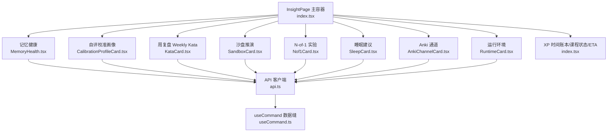
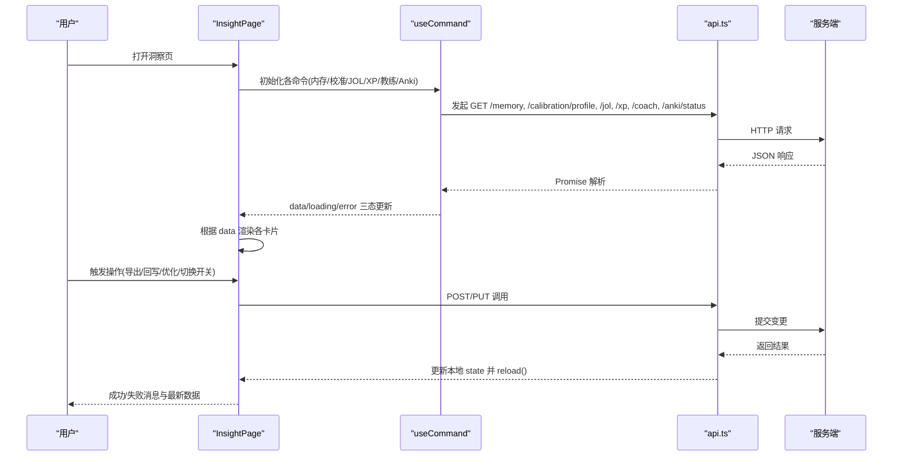
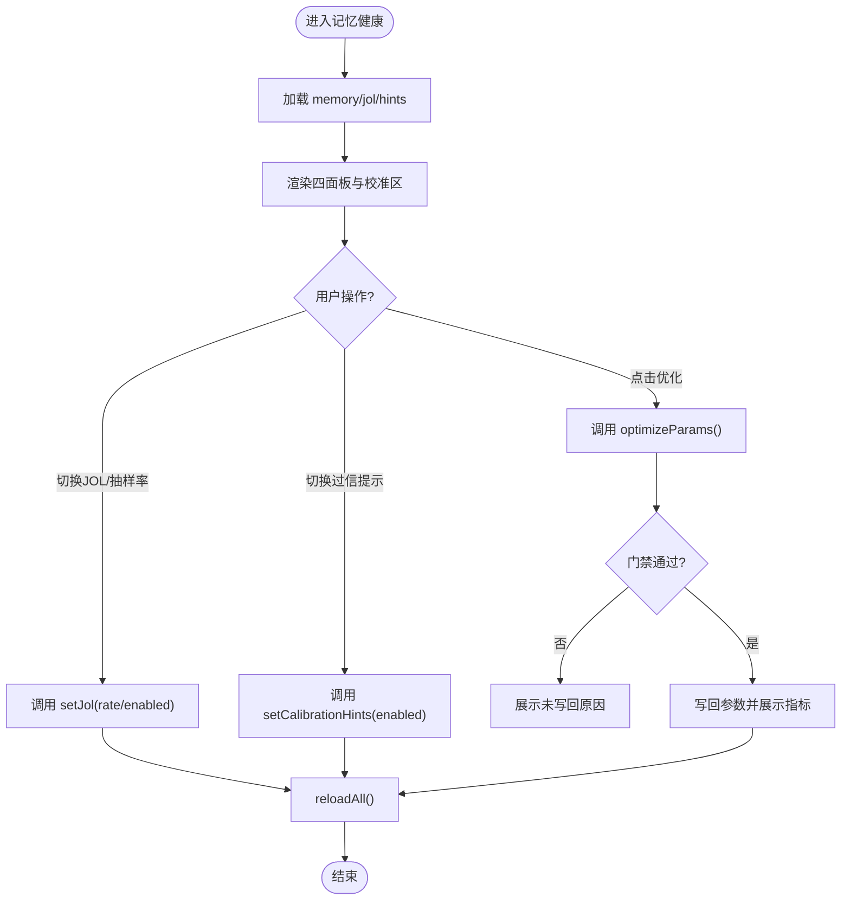
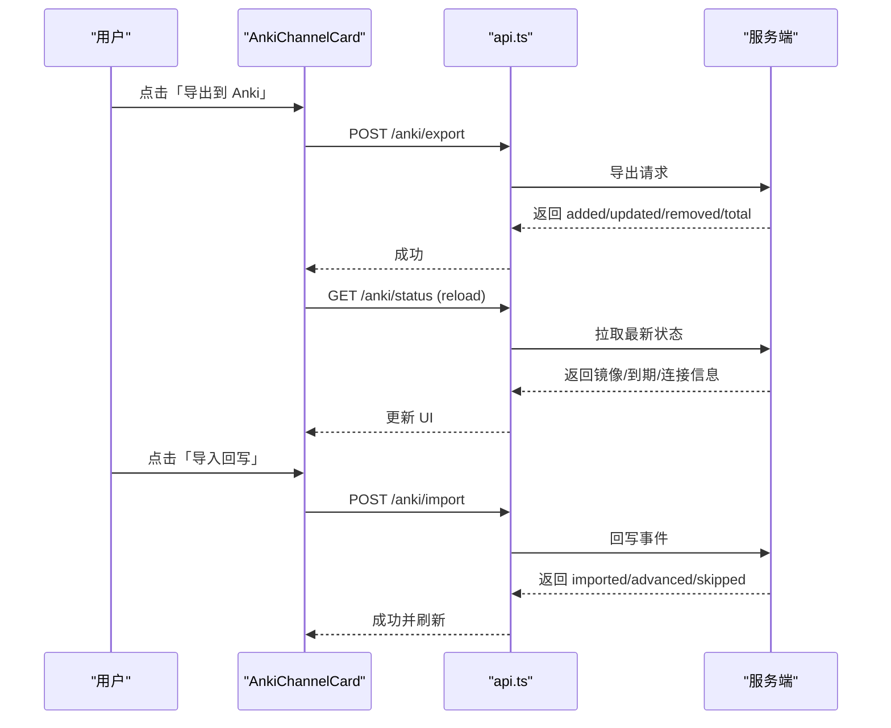
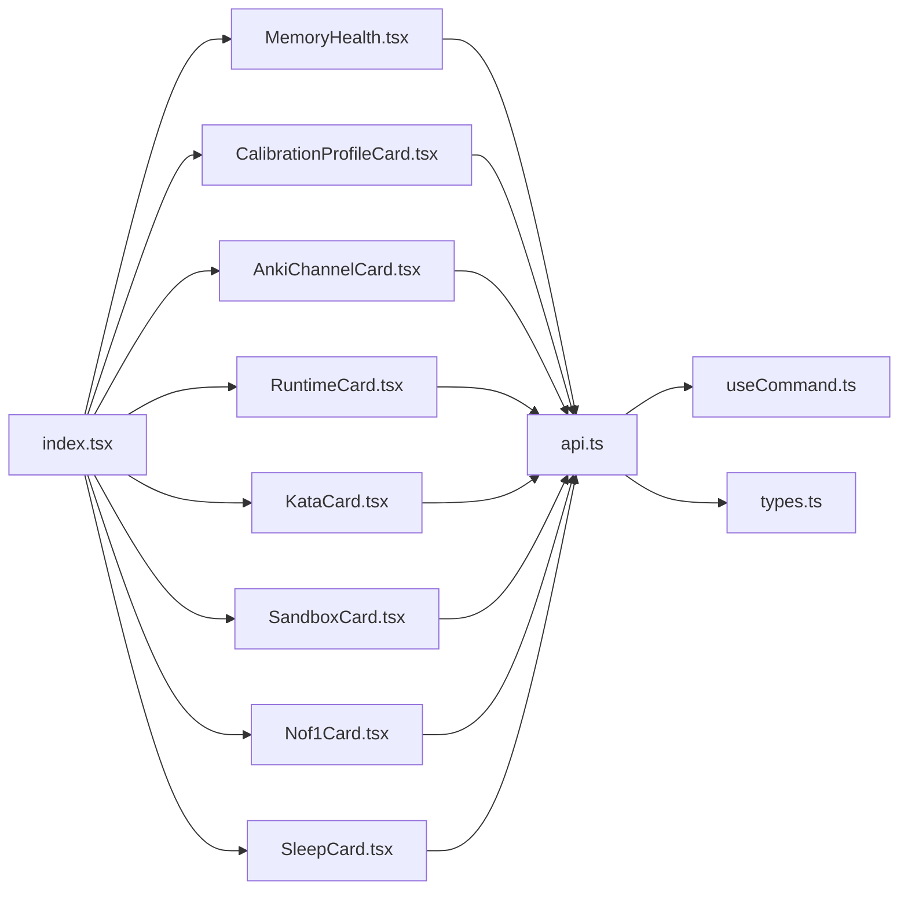

# 洞察页面

<cite>
**本文引用的文件**
- [ui/src/pages/InsightPage/index.tsx](file://ui/src/pages/InsightPage/index.tsx)
- [ui/src/pages/InsightPage/MemoryHealth.tsx](file://ui/src/pages/InsightPage/MemoryHealth.tsx)
- [ui/src/pages/InsightPage/CalibrationProfileCard.tsx](file://ui/src/pages/InsightPage/CalibrationProfileCard.tsx)
- [ui/src/pages/InsightPage/AnkiChannelCard.tsx](file://ui/src/pages/InsightPage/AnkiChannelCard.tsx)
- [ui/src/pages/InsightPage/RuntimeCard.tsx](file://ui/src/pages/InsightPage/RuntimeCard.tsx)
- [ui/src/pages/InsightPage/KataCard.tsx](file://ui/src/pages/InsightPage/KataCard.tsx)
- [ui/src/pages/InsightPage/SandboxCard.tsx](file://ui/src/pages/InsightPage/SandboxCard.tsx)
- [ui/src/pages/InsightPage/Nof1Card.tsx](file://ui/src/pages/InsightPage/Nof1Card.tsx)
- [ui/src/pages/InsightPage/SleepCard.tsx](file://ui/src/pages/InsightPage/SleepCard.tsx)
- [ui/src/api.ts](file://ui/src/api.ts)
- [ui/src/hooks/useCommand.ts](file://ui/src/hooks/useCommand.ts)
- [ui/src/types.ts](file://ui/src/types.ts)
- [src/engine/views/channels.ts](file://src/engine/views/channels.ts)
</cite>

## 目录
1. [简介](#简介)
2. [项目结构](#项目结构)
3. [核心组件](#核心组件)
4. [架构总览](#架构总览)
5. [详细组件分析](#详细组件分析)
6. [依赖关系分析](#依赖关系分析)
7. [性能与刷新策略](#性能与刷新策略)
8. [故障排查指南](#故障排查指南)
9. [结论](#结论)
10. [附录：自定义分析卡片开发指南](#附录自定义分析卡片开发指南)

## 简介
洞察页面是学习系统的观测与自我实验中心，聚合记忆健康、自评校准画像、周复盘、沙盘推演、N-of-1 实验、睡眠建议、Anki 通道与运行环境等能力。它通过统一的命令数据获取缝（useCommand）与 API 客户端（api.ts）与后端交互，使用纯 CSS/HTML 的轻量图表组件进行可视化渲染，并提供手动触发的优化与推演操作。页面强调“提议非指令”的语义：所有实验与推演不直接改变调度或掌握度，确认动作集中在提案收件箱。

## 项目结构
洞察页面由一个主容器与多个子卡片组成，每个卡片负责一个分析主题，并通过 useCommand 管理数据生命周期。



**图示来源**
- [ui/src/pages/InsightPage/index.tsx:31-204](file://ui/src/pages/InsightPage/index.tsx#L31-L204)
- [ui/src/api.ts:43-353](file://ui/src/api.ts#L43-L353)
- [ui/src/hooks/useCommand.ts:55-87](file://ui/src/hooks/useCommand.ts#L55-L87)

**章节来源**
- [ui/src/pages/InsightPage/index.tsx:1-207](file://ui/src/pages/InsightPage/index.tsx#L1-L207)

## 核心组件
- 记忆健康：展示每日负载预报、记忆状态分布、真实保留率、遗忘曲线、预测校准与 FSRS 参数优化入口。
- 自评校准画像：按源（如 JOL×实际作答）展示分箱准确率与过信检测提示，提供全局参考视图。
- Anki 通道：显示镜像规模、到期分布、连接状态，支持导出到 Anki 与导入回写。
- 运行环境：只读展示当前 LLM provider/model 与思考档配置。
- 周复盘：五问复盘，支持保存、转 N-of-1 提案、转执行意图。
- 沙盘推演：蒙特卡洛推演掌握度分布，零写入。
- N-of-1 实验：模板发起、提案确认制、报告查看与停止。
- 睡眠建议：开关实践类节点的睡前/醒后建议。
- XP/课程/ETA：今日 XP、连续天数、目标、课程状态表、预计完成天数。

**章节来源**
- [ui/src/pages/InsightPage/MemoryHealth.tsx:1-301](file://ui/src/pages/InsightPage/MemoryHealth.tsx#L1-L301)
- [ui/src/pages/InsightPage/CalibrationProfileCard.tsx:1-94](file://ui/src/pages/InsightPage/CalibrationProfileCard.tsx#L1-L94)
- [ui/src/pages/InsightPage/AnkiChannelCard.tsx:1-96](file://ui/src/pages/InsightPage/AnkiChannelCard.tsx#L1-L96)
- [ui/src/pages/InsightPage/RuntimeCard.tsx:1-28](file://ui/src/pages/InsightPage/RuntimeCard.tsx#L1-L28)
- [ui/src/pages/InsightPage/KataCard.tsx:1-198](file://ui/src/pages/InsightPage/KataCard.tsx#L1-L198)
- [ui/src/pages/InsightPage/SandboxCard.tsx:1-91](file://ui/src/pages/InsightPage/SandboxCard.tsx#L1-L91)
- [ui/src/pages/InsightPage/Nof1Card.tsx:1-170](file://ui/src/pages/InsightPage/Nof1Card.tsx#L1-L170)
- [ui/src/pages/InsightPage/SleepCard.tsx:1-51](file://ui/src/pages/InsightPage/SleepCard.tsx#L1-L51)
- [ui/src/pages/InsightPage/index.tsx:105-204](file://ui/src/pages/InsightPage/index.tsx#L105-L204)

## 架构总览
洞察页面采用“容器 + 卡片”的组件化架构：
- 容器负责编排数据请求、统一刷新与错误提示。
- 卡片专注单一分析主题的渲染与交互。
- 数据获取通过 useCommand 封装，保证 latest-wins、失败不翻转、空态由调用方派生。
- API 客户端集中定义 HTTP 端点与类型约束。



**图示来源**
- [ui/src/pages/InsightPage/index.tsx:31-58](file://ui/src/pages/InsightPage/index.tsx#L31-L58)
- [ui/src/hooks/useCommand.ts:55-87](file://ui/src/hooks/useCommand.ts#L55-L87)
- [ui/src/api.ts:13-32](file://ui/src/api.ts#L13-L32)

## 详细组件分析

### 记忆健康（MemoryHealthBody）
- 功能：四面板（负载预报、状态分布、真实保留率、遗忘曲线），预测校准（JOL×实际），FSRS 参数优化器。
- 数据流：通过 api.memory() 获取；JOL 与 hints 开关通过 api.jol()/api.calibrationHints() 控制。
- 可视化：纯 div 条形图（HBars/DayBars/RateBars），无第三方图表库依赖。
- 关键逻辑：
  - 预测校准仅统计被抽到的卡，不代表全部复习。
  - 过信轻提示可全局关闭，影响抽查密度与出口提醒。
  - 参数优化需满足门禁（真实推进≥400条且评估更优）才写回。



**图示来源**
- [ui/src/pages/InsightPage/MemoryHealth.tsx:76-131](file://ui/src/pages/InsightPage/MemoryHealth.tsx#L76-L131)
- [ui/src/pages/InsightPage/MemoryHealth.tsx:137-301](file://ui/src/pages/InsightPage/MemoryHealth.tsx#L137-L301)
- [ui/src/api.ts:84-93](file://ui/src/api.ts#L84-L93)
- [ui/src/api.ts:175-177](file://ui/src/api.ts#L175-L177)

**章节来源**
- [ui/src/pages/InsightPage/MemoryHealth.tsx:1-301](file://ui/src/pages/InsightPage/MemoryHealth.tsx#L1-L301)
- [ui/src/api.ts:84-93](file://ui/src/api.ts#L84-L93)
- [ui/src/api.ts:175-177](file://ui/src/api.ts#L175-L177)

### 自评校准画像（CalibrationProfileCard）
- 功能：按源（如 JOL×实际）展示分箱准确率，检测系统性过信并给出证据说明；提供全局聚合参考视图。
- 数据流：api.calibrationProfile() 返回 sources 与 global 视图。
- 可视化：分箱条形图，颜色区分不同视图。
- 关键点：低数据不造假曲线；域特异警告必须随参考视图带出。

```mermaid
classDiagram
class CalibrationProfileCard {
+profile : CalibrationProfileDoc
+renderSources()
+renderGlobal()
}
class CalibrationProfileDoc {
+sources : CalibrationSourceProfile[]
+global : { warning, calibration? }
}
CalibrationProfileCard --> CalibrationProfileDoc : "消费"
```

**图示来源**
- [ui/src/pages/InsightPage/CalibrationProfileCard.tsx:11-94](file://ui/src/pages/InsightPage/CalibrationProfileCard.tsx#L11-L94)
- [ui/src/types.ts:34-52](file://ui/src/types.ts#L34-L52)

**章节来源**
- [ui/src/pages/InsightPage/CalibrationProfileCard.tsx:1-94](file://ui/src/pages/InsightPage/CalibrationProfileCard.tsx#L1-L94)
- [ui/src/types.ts:34-52](file://ui/src/types.ts#L34-L52)

### Anki 通道（AnkiChannelCard）
- 功能：显示镜像规模、到期分布、连接状态；支持导出到 Anki 与导入回写。
- 数据流：api.ankiStatus() 读取状态；导出/回写分别调用 ankiExport()/ankiImport()。
- 可视化：Tag 展示连接状态与到期分布；按钮触发异步操作并刷新。
- 关键点：单向推送+作答回写，不是同步；回写先于下次导出避免重复推送。



**图示来源**
- [ui/src/pages/InsightPage/AnkiChannelCard.tsx:14-96](file://ui/src/pages/InsightPage/AnkiChannelCard.tsx#L14-L96)
- [ui/src/api.ts:167-174](file://ui/src/api.ts#L167-L174)
- [src/engine/views/channels.ts:7-14](file://src/engine/views/channels.ts#L7-L14)

**章节来源**
- [ui/src/pages/InsightPage/AnkiChannelCard.tsx:1-96](file://ui/src/pages/InsightPage/AnkiChannelCard.tsx#L1-L96)
- [ui/src/api.ts:167-174](file://ui/src/api.ts#L167-L174)
- [src/engine/views/channels.ts:7-14](file://src/engine/views/channels.ts#L7-L14)

### 运行环境（RuntimeCard）
- 功能：只读展示当前 LLM provider/model 与思考档配置。
- 数据流：来自 frame.status.llm（宿主附加在 /status）。
- 关键点：切换模型需编辑宿主配置文件并重启，面板不改运行环境。

**章节来源**
- [ui/src/pages/InsightPage/RuntimeCard.tsx:1-28](file://ui/src/pages/InsightPage/RuntimeCard.tsx#L1-L28)
- [ui/src/types.ts:24-27](file://ui/src/types.ts#L24-L27)

### 周复盘（KataCard）
- 功能：五问复盘（现状自动填充，四问学习者作答），支持保存、转 N-of-1 提案、转执行意图。
- 数据流：kataOpen/kataSave；转换动作通过 kataConvertExperiment/kataConvertIntention。
- 关键点：提案-确认制，确认在收件箱；执行意图挂今日偏好，日界后过期。

**章节来源**
- [ui/src/pages/InsightPage/KataCard.tsx:1-198](file://ui/src/pages/InsightPage/KataCard.tsx#L1-L198)
- [ui/src/api.ts:299-313](file://ui/src/api.ts#L299-L313)

### 沙盘推演（SandboxCard）
- 功能：蒙特卡洛推演掌握度分布（p50/p80），输出为分布而非承诺。
- 数据流：sandboxRun(minutesPerDay, weeks?, course?)。
- 关键点：零写入，不进调度与门禁。

**章节来源**
- [ui/src/pages/InsightPage/SandboxCard.tsx:1-91](file://ui/src/pages/InsightPage/SandboxCard.tsx#L1-L91)
- [ui/src/api.ts:260-263](file://ui/src/api.ts#L260-L263)

### N-of-1 实验（Nof1Card）
- 功能：模板发起 → 提案-确认制开跑 → 报告查看与停止。
- 数据流：experiments()/proposals()；experimentPropose()/experimentStop()。
- 关键点：确认动作只在提案收件箱；待确认提案与收件箱同源。

**章节来源**
- [ui/src/pages/InsightPage/Nof1Card.tsx:1-170](file://ui/src/pages/InsightPage/Nof1Card.tsx#L1-L170)
- [ui/src/api.ts:252-259](file://ui/src/api.ts#L252-L259)

### 睡眠建议（SleepCard）
- 功能：开关实践类节点的“睡前练、醒后验”建议。
- 数据流：sleep()/setSleep()。
- 关键点：只读建议，不改调度语义。

**章节来源**
- [ui/src/pages/InsightPage/SleepCard.tsx:1-51](file://ui/src/pages/InsightPage/SleepCard.tsx#L1-L51)
- [ui/src/api.ts:244-247](file://ui/src/api.ts#L244-L247)

## 依赖关系分析
- 组件耦合：InsightPage 作为容器，依赖各卡片组件；卡片之间松耦合，通过 window 事件与 reloadAll 协调。
- 数据依赖：useCommand 统一管理 data/loading/error；api.ts 集中定义端点；types.ts 从引擎视图与命令注册表派生类型，避免手工镜像。
- 外部依赖：Arc Design 组件库用于 UI；无第三方图表库，使用 CSS 条形图。



**图示来源**
- [ui/src/pages/InsightPage/index.tsx:20-27](file://ui/src/pages/InsightPage/index.tsx#L20-L27)
- [ui/src/api.ts:43-353](file://ui/src/api.ts#L43-L353)
- [ui/src/hooks/useCommand.ts:55-87](file://ui/src/hooks/useCommand.ts#L55-L87)
- [ui/src/types.ts:34-93](file://ui/src/types.ts#L34-L93)

**章节来源**
- [ui/src/pages/InsightPage/index.tsx:1-207](file://ui/src/pages/InsightPage/index.tsx#L1-L207)
- [ui/src/api.ts:1-370](file://ui/src/api.ts#L1-L370)
- [ui/src/hooks/useCommand.ts:1-88](file://ui/src/hooks/useCommand.ts#L1-L88)
- [ui/src/types.ts:1-93](file://ui/src/types.ts#L1-L93)

## 性能与刷新策略
- 数据获取：useCommand 每次 run/reload 都真实发请求，latest-wins 丢弃旧响应，失败不翻转保持最近成功值。
- 刷新策略：
  - 页面级 reloadAll 并行刷新 xp/memory/jol/hints/profile/coach。
  - 监听 learnhub:reload 事件以在跨卡事实变化时刷新（如提案落地、实验应用）。
  - 卡片内局部 reload（如 Anki 导出/回写后刷新状态）。
- 渲染优化：纯 CSS 条形图，无重型图表库；低数据场景显示占位提示，避免无效计算。
- 错误处理：errorMessage 单点提取 ApiError 消息，统一提示。

**章节来源**
- [ui/src/hooks/useCommand.ts:1-88](file://ui/src/hooks/useCommand.ts#L1-L88)
- [ui/src/pages/InsightPage/index.tsx:41-58](file://ui/src/pages/InsightPage/index.tsx#L41-L58)
- [ui/src/pages/InsightPage/AnkiChannelCard.tsx:19-44](file://ui/src/pages/InsightPage/AnkiChannelCard.tsx#L19-L44)
- [ui/src/pages/InsightPage/MemoryHealth.tsx:76-131](file://ui/src/pages/InsightPage/MemoryHealth.tsx#L76-L131)

## 故障排查指南
- 数据为空：检查 useCommand 的 loading/error 状态；确认 API 是否返回有效数据。
- 刷新不生效：确认是否触发 learnhub:reload 事件；检查 reloadAll 依赖是否稳定。
- 错误提示：errorMessage 会提取 ApiError.message；若为未知错误，检查网络与后端响应。
- Anki 连接失败：查看 anki.connected 与 error 字段；确保桌面 Anki 在线且 AnkiConnect 可达。
- 参数优化未写回：查看 OptimizeResult.reason，确认真实推进数与评估指标是否满足门禁。

**章节来源**
- [ui/src/hooks/useCommand.ts:15-21](file://ui/src/hooks/useCommand.ts#L15-L21)
- [ui/src/pages/InsightPage/AnkiChannelCard.tsx:46-92](file://ui/src/pages/InsightPage/AnkiChannelCard.tsx#L46-L92)
- [ui/src/pages/InsightPage/MemoryHealth.tsx:76-131](file://ui/src/pages/InsightPage/MemoryHealth.tsx#L76-L131)

## 结论
洞察页面通过模块化卡片与统一的数据缝，提供了完整的学习观测与实验能力。其设计强调透明性（运行环境可见）、安全性（提议非指令、确认收口）、可维护性（类型派生、无手工镜像）与性能（轻量可视化、精准刷新）。未来扩展可通过新增卡片复用 useCommand 与 api.ts 模式，保持架构一致性。

## 附录：自定义分析卡片开发指南
- 步骤：
  1. 新建卡片组件（如 NewCard.tsx），使用 Arc Design 组件构建 UI。
  2. 通过 api.ts 定义或复用现有端点，使用 useCommand 获取数据。
  3. 在 InsightPage 中引入并挂载卡片，必要时加入 reloadAll 刷新。
  4. 遵循“低数据不造假”原则，提供占位提示。
  5. 如需写操作，使用 api.ts 的 POST/PUT 方法，并在成功后 reload。
- 最佳实践：
  - 使用 CommandBoundary 包裹加载态。
  - 错误提示统一使用 errorMessage。
  - 类型从 types.ts 派生，避免手工镜像。
  - 复杂逻辑拆分为子组件（如 HBars/DayBars）。
  - 保持卡片职责单一，避免跨卡片状态耦合。

**章节来源**
- [ui/src/pages/InsightPage/index.tsx:105-204](file://ui/src/pages/InsightPage/index.tsx#L105-L204)
- [ui/src/hooks/useCommand.ts:55-87](file://ui/src/hooks/useCommand.ts#L55-L87)
- [ui/src/api.ts:43-353](file://ui/src/api.ts#L43-L353)
- [ui/src/types.ts:34-93](file://ui/src/types.ts#L34-L93)