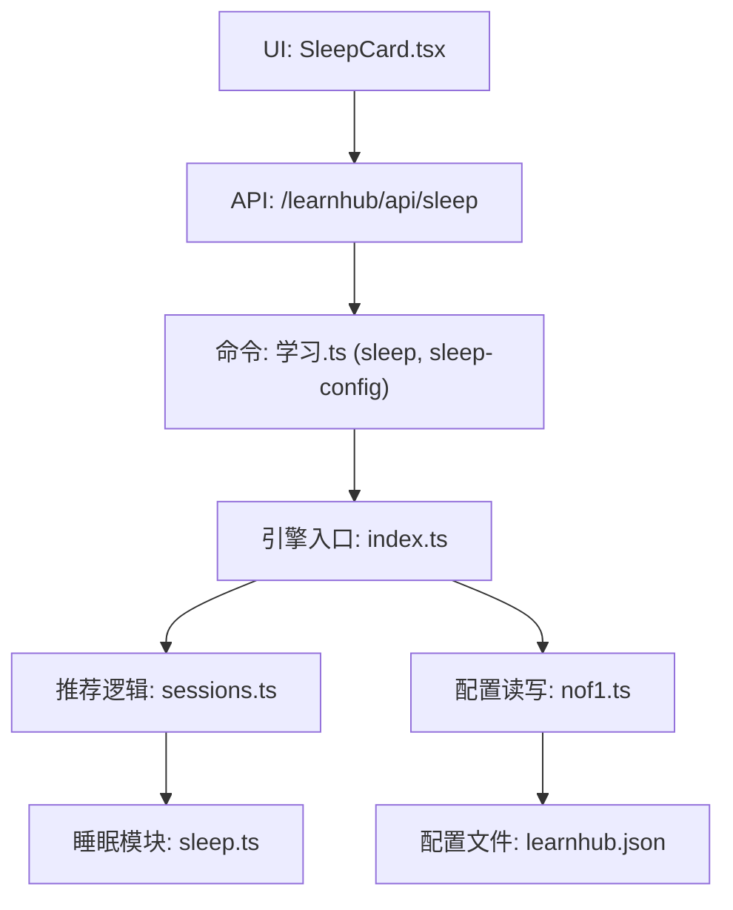
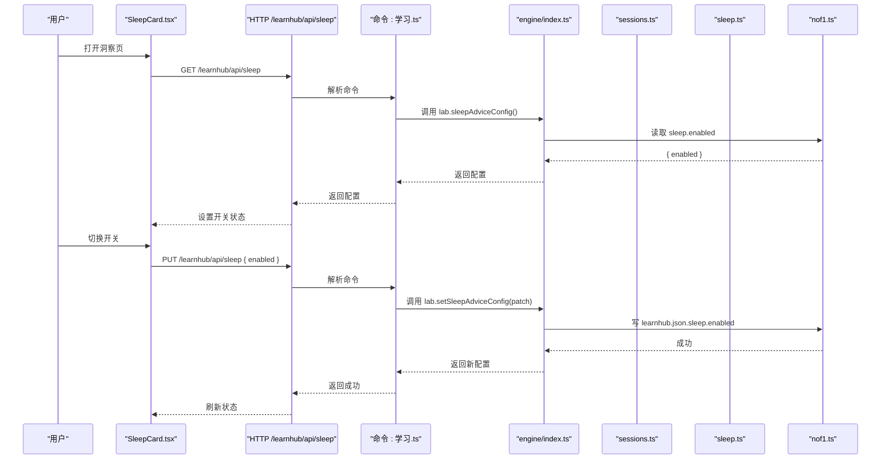
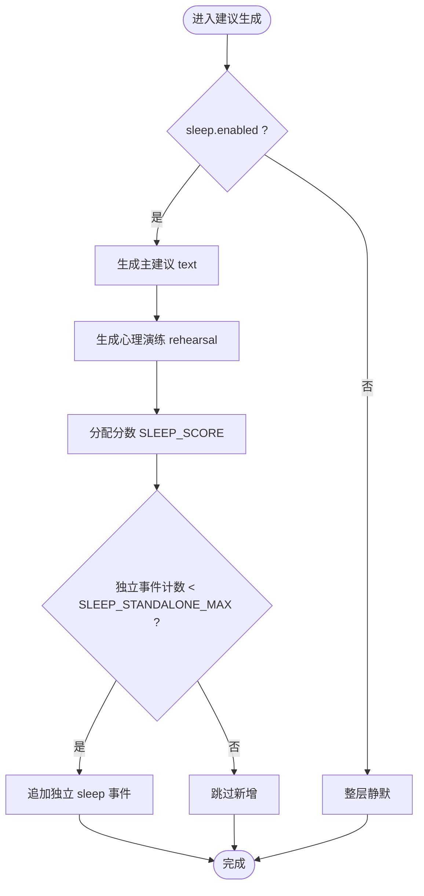
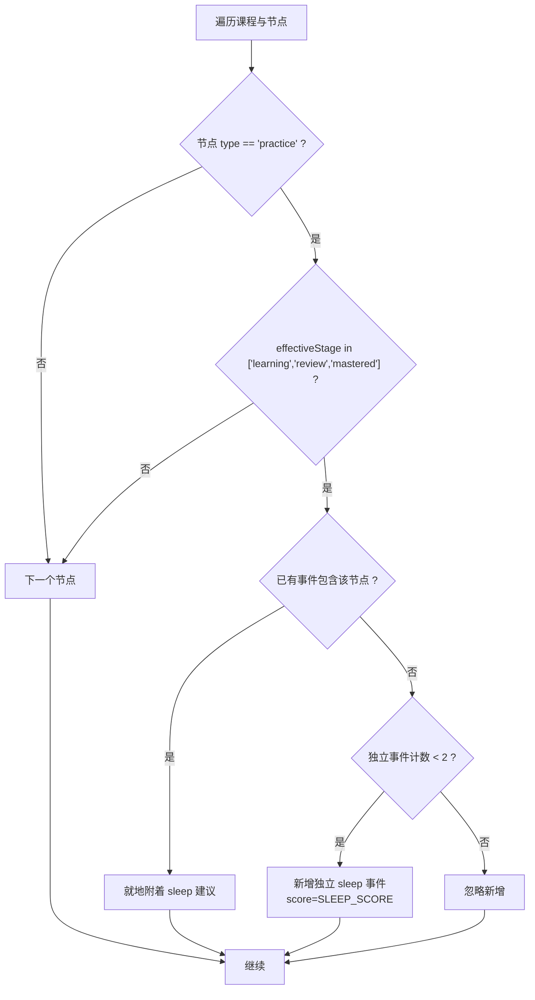
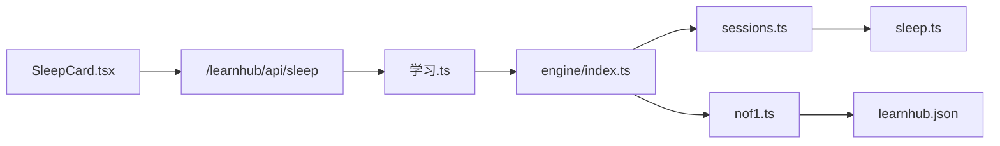

# 睡眠耦合卡片

<cite>
**本文引用的文件**
- [SleepCard.tsx](file://ui/src/pages/InsightPage/SleepCard.tsx)
- [sleep.ts](file://src/engine/sleep.ts)
- [sessions.ts](file://src/engine/sessions.ts)
- [学习.ts](file://src/commands/学习.ts)
- [nof1.ts](file://src/engine/nof1.ts)
- [index.ts](file://src/engine/index.ts)
- [types.ts](file://ui/src/types.ts)
- [host-routes-snapshot.json](file://tests/fixtures/host-routes-snapshot.json)
- [sleep.test.ts](file://tests/sleep.test.ts)
</cite>

## 目录
1. [简介](#简介)
2. [项目结构](#项目结构)
3. [核心组件](#核心组件)
4. [架构总览](#架构总览)
5. [详细组件分析](#详细组件分析)
6. [依赖关系分析](#依赖关系分析)
7. [性能与行为特性](#性能与行为特性)
8. [故障排查指南](#故障排查指南)
9. [结论](#结论)
10. [附录](#附录)

## 简介
睡眠耦合卡片（SleepCard）是“洞察区”的一个可开关建议层，用于在学习推荐中为“重巩固型节点”（如乐器、运动等实践类练习）附加“睡前练、醒后验”的时段建议与可选心理演练附注。该功能遵循“纯读侧建议”原则：不改变调度语义、不产生到期、不修改掌握度或经验值；仅在学习推荐事件上附带可读建议，且可通过全局配置关闭。

本文件聚焦以下目标：
- 说明睡眠建议如何在工作流中生成与呈现
- 解释重巩固型节点的识别方式与建议附着策略
- 描述配置开关与持久化机制
- 提供趋势观察与个性化建议的使用指引（基于系统现有能力）
- 给出睡眠卫生与学习时间安排的通用指导

[本节未直接分析具体文件]

## 项目结构
睡眠耦合功能横跨 UI 层、引擎层与命令路由层：
- UI 层：SleepCard 组件负责展示开关与当前状态
- 引擎层：sleep.ts 定义建议文案与常量；sessions.ts 在推荐流程中注入睡眠建议；nof1.ts 提供配置读写；index.ts 将配置注入推荐流程
- 命令与路由：学习.ts 暴露 sleep 与 sleep-config 命令；测试快照验证 HTTP 路由行为

图表来源
- [SleepCard.tsx:1-51](file://ui/src/pages/InsightPage/SleepCard.tsx#L1-L51)
- [学习.ts:641-672](file://src/commands/学习.ts#L641-L672)
- [index.ts:563-567](file://src/engine/index.ts#L563-L567)
- [sessions.ts:543-568](file://src/engine/sessions.ts#L543-L568)
- [sleep.ts:1-42](file://src/engine/sleep.ts#L1-L42)
- [nof1.ts:944-955](file://src/engine/nof1.ts#L944-L955)

章节来源
- [SleepCard.tsx:1-51](file://ui/src/pages/InsightPage/SleepCard.tsx#L1-L51)
- [学习.ts:641-672](file://src/commands/学习.ts#L641-L672)
- [index.ts:563-567](file://src/engine/index.ts#L563-L567)
- [sessions.ts:543-568](file://src/engine/sessions.ts#L543-L568)
- [sleep.ts:1-42](file://src/engine/sleep.ts#L1-L42)
- [nof1.ts:944-955](file://src/engine/nof1.ts#L944-L955)

## 核心组件
- 睡眠建议模块（sleep.ts）
  - 定义 SleepSuggestion 接口（text、rehearsal），以及默认配置、评分常量与归一化函数
  - 提供 reconsolidationAdvice(nodeName) 生成“睡前练、醒后验”的建议文案与心理演练提示
- 推荐注入器（sessions.ts）
  - 在推荐事件中为“重巩固型节点”（type=practice）附加 sleep 字段
  - 若节点已有推荐事件则就地附着；若无其他事件，则至多新增两条独立 sleep 事件（分数低于新课带）
  - 通过 sleepAdvice 开关控制是否启用
- 配置读写（nof1.ts）
  - 读取/写入 learnhub.json 中的 sleep.enabled 字段，支持缺省回退
- 命令与路由（学习.ts、host 路由快照）
  - GET/PUT /learnhub/api/sleep 暴露开关能力
  - sleep-config 工具命令供 Agent 同步调用
- UI 组件（SleepCard.tsx）
  - 拉取并显示当前 sleep 配置，提供切换开关，错误时提示

章节来源
- [sleep.ts:1-42](file://src/engine/sleep.ts#L1-L42)
- [sessions.ts:543-568](file://src/engine/sessions.ts#L543-L568)
- [nof1.ts:944-955](file://src/engine/nof1.ts#L944-L955)
- [学习.ts:641-672](file://src/commands/学习.ts#L641-L672)
- [host-routes-snapshot.json:6470-6502](file://tests/fixtures/host-routes-snapshot.json#L6470-L6502)
- [SleepCard.tsx:1-51](file://ui/src/pages/InsightPage/SleepCard.tsx#L1-L51)

## 架构总览
睡眠建议层作为“读侧增强层”，嵌入到跨课程推荐流程中，不影响核心调度与数据持久化。整体数据流如下：

图表来源
- [SleepCard.tsx:15-36](file://ui/src/pages/InsightPage/SleepCard.tsx#L15-L36)
- [学习.ts:641-672](file://src/commands/学习.ts#L641-L672)
- [index.ts:563-567](file://src/engine/index.ts#L563-L567)
- [nof1.ts:944-955](file://src/engine/nof1.ts#L944-L955)
- [host-routes-snapshot.json:6470-6502](file://tests/fixtures/host-routes-snapshot.json#L6470-L6502)

## 详细组件分析

### 睡眠建议模块（sleep.ts）
- 职责
  - 定义建议数据结构与默认配置
  - 生成“睡前练、醒后验”的标准化文案与心理演练提示
  - 提供评分常量与独立事件数量上限，确保建议不抢占正事
- 关键设计
  - 纯函数：无副作用，便于测试与复用
  - 预期管理措辞：明确效应量与“别替代真练”的边界
  - 容错归一化：非法或缺失字段回退默认，保证建议层健壮性

图表来源
- [sleep.ts:10-42](file://src/engine/sleep.ts#L10-L42)
- [sessions.ts:543-568](file://src/engine/sessions.ts#L543-L568)

章节来源
- [sleep.ts:1-42](file://src/engine/sleep.ts#L1-L42)

### 推荐注入器（sessions.ts）
- 职责
  - 在推荐事件构建阶段，扫描所有 practice 类型节点
  - 对已开始的节点（learning/review/mastered）附加 sleep 建议
  - 若节点已有事件则就地附着；否则至多新增两条独立 sleep 事件
  - 使用固定低分避免抢占新课带
- 关键点
  - 仅读侧增强：不修改 canonical、XP、掌握度
  - 区域信息保留：region 来自图谱块映射
  - 内容就绪判断：hasReadyContent 用于提示可用性

图表来源
- [sessions.ts:543-568](file://src/engine/sessions.ts#L543-L568)

章节来源
- [sessions.ts:543-568](file://src/engine/sessions.ts#L543-L568)

### 配置读写（nof1.ts）
- 职责
  - 读取 learnhub.json 的 sleep.enabled 字段，缺失时回退默认
  - 更新配置时合并旧配置，仅覆盖 sleep 字段，保持其他键不变
- 特点
  - 幂等：多次写入同一值无副作用
  - 安全：只写 sleep 子对象，不影响 day_cutoff 等其他配置

章节来源
- [nof1.ts:944-955](file://src/engine/nof1.ts#L944-L955)

### 命令与路由（学习.ts、host 路由快照）
- 暴露端点
  - GET /learnhub/api/sleep：获取当前 sleep 配置
  - PUT /learnhub/api/sleep：设置 sleep.enabled
- 工具面
  - sleep-config：Agent 同步工具，用于读取/设置建议层开关
- 行为验证
  - 测试快照确认路由参数与调用链正确

章节来源
- [学习.ts:641-672](file://src/commands/学习.ts#L641-L672)
- [host-routes-snapshot.json:6470-6502](file://tests/fixtures/host-routes-snapshot.json#L6470-L6502)

### UI 组件（SleepCard.tsx）
- 职责
  - 加载当前 sleep 配置并渲染开关
  - 切换时调用 API 更新配置并刷新状态
  - 错误时通过消息提示
- 交互
  - 初始加载：GET /learnhub/api/sleep
  - 切换：PUT /learnhub/api/sleep { enabled }
  - 成功后重新加载以同步最新状态

章节来源
- [SleepCard.tsx:1-51](file://ui/src/pages/InsightPage/SleepCard.tsx#L1-L51)

## 依赖关系分析
- 组件耦合
  - SleepCard 依赖 api 与 types，类型从命令输出派生，避免手工镜像
  - 引擎层通过 index.ts 将 sleepAdviceConfig 注入推荐流程
  - sessions.ts 依赖 sleep.ts 的纯函数与常量
  - nof1.ts 负责配置持久化，被 engine 调用
- 外部依赖
  - 文件系统：learnhub.json 存储配置
  - HTTP 路由：/learnhub/api/sleep
- 潜在循环
  - 未发现循环依赖；各层职责清晰

图表来源
- [SleepCard.tsx:1-51](file://ui/src/pages/InsightPage/SleepCard.tsx#L1-L51)
- [学习.ts:641-672](file://src/commands/学习.ts#L641-L672)
- [index.ts:563-567](file://src/engine/index.ts#L563-L567)
- [sessions.ts:543-568](file://src/engine/sessions.ts#L543-L568)
- [sleep.ts:1-42](file://src/engine/sleep.ts#L1-L42)
- [nof1.ts:944-955](file://src/engine/nof1.ts#L944-L955)

章节来源
- [SleepCard.tsx:1-51](file://ui/src/pages/InsightPage/SleepCard.tsx#L1-L51)
- [学习.ts:641-672](file://src/commands/学习.ts#L641-L672)
- [index.ts:563-567](file://src/engine/index.ts#L563-L567)
- [sessions.ts:543-568](file://src/engine/sessions.ts#L543-L568)
- [sleep.ts:1-42](file://src/engine/sleep.ts#L1-L42)
- [nof1.ts:944-955](file://src/engine/nof1.ts#L944-L955)

## 性能与行为特性
- 纯函数与常量
  - 建议文案生成零开销，评分与上限为常量，避免运行时计算
- 推荐注入成本
  - 仅在推荐构建阶段扫描 practice 节点，数量有限；独立事件上限为 2，控制输出规模
- 读侧增强
  - 不触发任何写操作，不增加 IO 与锁竞争
- 可关闭性
  - 通过 sleep.enabled 全局关闭，减少不必要的数据组装

[本节未直接分析具体文件]

## 故障排查指南
- 现象：开关无效或建议未出现
  - 检查 sleep.enabled 是否为 true（默认开启）
  - 确认节点类型为 practice 且已开始（learning/review/mastered）
  - 查看是否有其他事件已附着 sleep；若无，最多新增两条独立 sleep 事件
- 现象：配置写入失败
  - 检查 learnhub.json 权限与路径
  - 确认 PUT /learnhub/api/sleep 请求体格式正确
- 现象：推荐中出现异常 sleep 事件
  - 核对节点是否在图谱中且标记为 practice
  - 检查 effectiveStage 判定逻辑
- 验证手段
  - 使用测试用例断言：建议文案、事件数量、配置持久化、纯读侧约束

章节来源
- [sleep.test.ts:18-117](file://tests/sleep.test.ts#L18-L117)

## 结论
睡眠耦合卡片是一个轻量、可关闭、纯读侧的学习建议增强层。它针对实践类节点提供“睡前练、醒后验”的时段建议与心理演练提示，并通过固定低分与数量上限避免干扰主要学习任务。该功能不改变调度语义与数据持久化，具备良好的鲁棒性与可维护性。

[本节未直接分析具体文件]

## 附录

### 睡眠数据采集与相关性分析
- 采集方式
  - 系统未内置睡眠时长/质量传感器采集；建议通过外部记录（日记、穿戴设备导出）结合学习日志进行离线关联分析
- 相关性分析方法
  - 时间对齐：将学习表现（复习正确率、练习耗时、错误率）与睡眠指标按日对齐
  - 统计方法：计算相关系数、分组对比（高/低睡眠组）、回归分析（控制年龄、任务难度等协变量）
  - 可视化：绘制每日睡眠与次日学习表现的折线/散点图，标注异常波动
- 注意事项
  - 样本量小易受噪声影响，需多日累积
  - 避免因果推断过度解读，关注趋势而非单点

[本节未直接分析具体文件]

### 睡眠评分算法与趋势分析
- 评分维度（建议方案）
  - 睡眠时长、入睡潜伏期、夜间觉醒次数、主观睡眠质量、日间嗜睡
  - 权重可根据个人基线动态调整
- 趋势分析
  - 滑动窗口（7/14/30 天）观察均值与方差
  - 阈值告警：连续 N 天低于基线时提醒
- 与学习效果的联动
  - 将评分与复习正确率、练习效率做滞后相关（前一日睡眠对当日表现的影响）

[本节未直接分析具体文件]

### 个性化建议机制
- 规则引擎（示例）
  - 若连续两晚睡眠不足 6 小时 → 降低当日新学强度，优先复习
  - 若主观睡眠质量差 → 建议短时回顾与轻练习，避免高强度新内容
- 反馈闭环
  - 根据次日学习表现微调建议强度
  - 允许用户手动修正偏好（如更重视时长 vs 质量）

[本节未直接分析具体文件]

### 睡眠卫生指导
- 固定作息：每天相近时间起床与就寝
- 睡前准备：减少蓝光与刺激性活动，建立放松仪式
- 环境优化：安静、黑暗、适宜温度
- 饮食与运动：避免晚间咖啡因与大量进食；规律运动但不在睡前剧烈运动
- 压力管理：冥想、呼吸训练、写情绪日记

[本节未直接分析具体文件]

### 科学的学习时间安排建议
- 间隔重复：利用遗忘曲线安排复习节奏
- 主动回忆：以自测与讲解为主，减少被动阅读
- 交错练习：混合不同主题提升迁移能力
- 适度挑战：保持在“最近发展区”，错误率约 20–30%
- 休息与恢复：番茄钟、短休与长休结合，避免疲劳累积

[本节未直接分析具体文件]