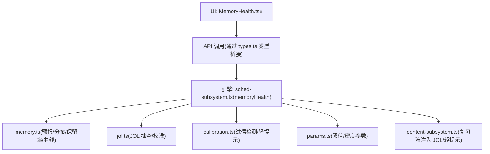
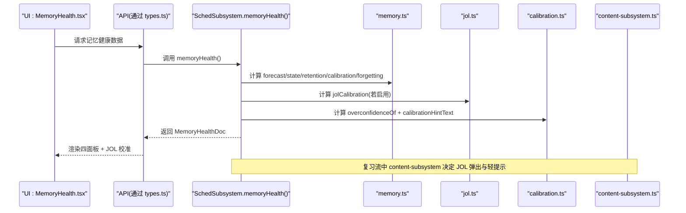
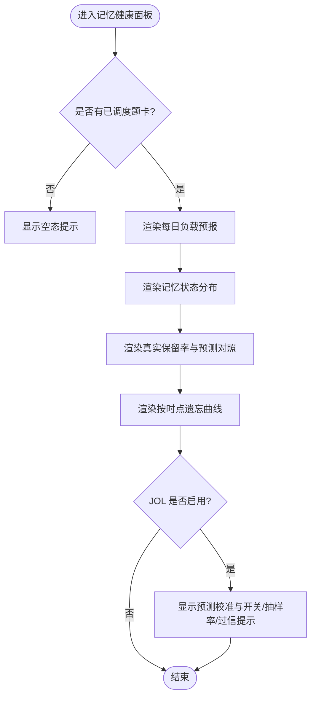
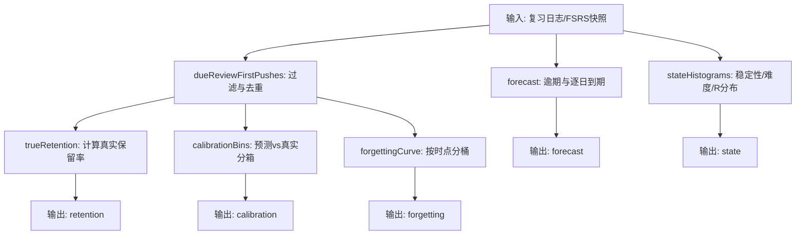
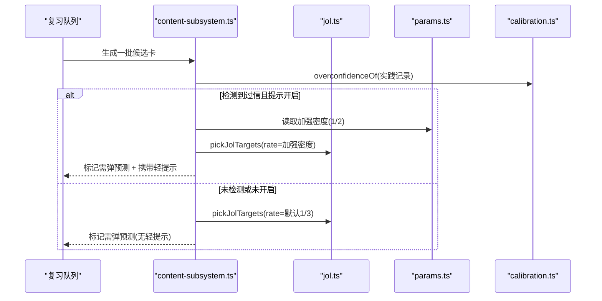
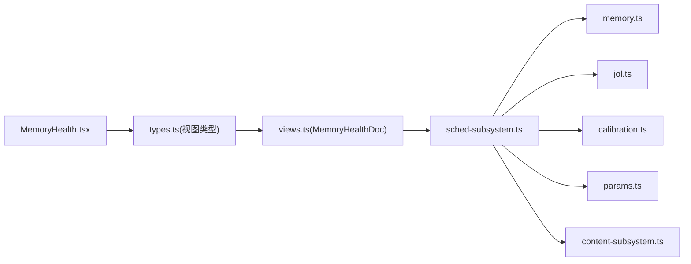

# 记忆健康卡片

<cite>
**本文引用的文件**
- [MemoryHealth.tsx](file://ui/src/pages/InsightPage/MemoryHealth.tsx)
- [memory.ts](file://src/engine/memory.ts)
- [jol.ts](file://src/engine/jol.ts)
- [calibration.ts](file://src/engine/calibration.ts)
- [params.ts](file://src/engine/params.ts)
- [content-subsystem.ts](file://src/engine/content-subsystem.ts)
- [sched-subsystem.ts](file://src/engine/sched-subsystem.ts)
- [views.ts](file://src/engine/views.ts)
- [types.ts](file://ui/src/types.ts)
- [memory-health.test.ts](file://tests/memory-health.test.ts)
</cite>

## 目录
1. [简介](#简介)
2. [项目结构](#项目结构)
3. [核心组件](#核心组件)
4. [架构总览](#架构总览)
5. [详细组件分析](#详细组件分析)
6. [依赖关系分析](#依赖关系分析)
7. [性能考虑](#性能考虑)
8. [故障排查指南](#故障排查指南)
9. [结论](#结论)
10. [附录：指标解释与使用指南](#附录指标解释与使用指南)

## 简介
记忆健康卡片是学习状态监控仪表板，提供“每日负载预报、记忆状态分布、真实保留率、按时点遗忘曲线”四面板，并内置“预测校准（JOL）”与“过信轻提示”控制。它帮助用户理解当前复习压力、记忆质量与预测偏差，从而优化学习节奏与策略。

## 项目结构
记忆健康由 UI 展示层与引擎计算层组成：
- UI 层：InsightPage 下的 MemoryHealth 组件负责渲染图表与控制项（开关、抽样率、轻提示）。
- 引擎层：memory.ts 提供纯函数聚合口径；jol.ts 实现 JOL 抽查与校准；calibration.ts 实现过信检测与轻提示文案；content-subsystem.ts 在复习流中注入 JOL 与轻提示；sched-subsystem.ts 暴露 memoryHealth 门面供上层调用；views.ts 统一导出视图类型；ui/types.ts 将引擎视图类型重导出给 UI 消费。

**图示来源**
- [MemoryHealth.tsx:137-300](file://ui/src/pages/InsightPage/MemoryHealth.tsx#L137-L300)
- [memory.ts:1-119](file://src/engine/memory.ts#L1-L119)
- [jol.ts:1-79](file://src/engine/jol.ts#L1-L79)
- [calibration.ts:45-110](file://src/engine/calibration.ts#L45-L110)
- [params.ts:35-46](file://src/engine/params.ts#L35-L46)
- [content-subsystem.ts:650-671](file://src/engine/content-subsystem.ts#L650-L671)
- [sched-subsystem.ts:1-83](file://src/engine/sched-subsystem.ts#L1-L83)
- [views.ts:155-157](file://src/engine/views.ts#L155-L157)
- [types.ts:34-52](file://ui/src/types.ts#L34-L52)

**章节来源**
- [MemoryHealth.tsx:137-300](file://ui/src/pages/InsightPage/MemoryHealth.tsx#L137-L300)
- [memory.ts:1-119](file://src/engine/memory.ts#L1-L119)
- [jol.ts:1-79](file://src/engine/jol.ts#L1-L79)
- [calibration.ts:45-110](file://src/engine/calibration.ts#L45-L110)
- [params.ts:35-46](file://src/engine/params.ts#L35-L46)
- [content-subsystem.ts:650-671](file://src/engine/content-subsystem.ts#L650-L671)
- [sched-subsystem.ts:1-83](file://src/engine/sched-subsystem.ts#L1-L83)
- [views.ts:155-157](file://src/engine/views.ts#L155-L157)
- [types.ts:34-52](file://ui/src/types.ts#L34-L52)

## 核心组件
- 记忆健康主体组件：MemoryHealthBody，渲染五大部分（负载预报、状态分布、真实保留率+预测对照、遗忘曲线、预测校准），并提供 JOL 开关、抽样率调节与过信轻提示开关。
- 数据计算模块：memory.ts 提供 forecast、stateHistograms、dueReviewFirstPushes、trueRetention、calibrationBins、forgettingCurve 等纯函数。
- 预测校准（JOL）：jol.ts 定义抽样策略、目标选择与校准聚合；calibration.ts 实现过信检测与轻提示文案；params.ts 提供阈值与加强密度。
- 复习流集成：content-subsystem.ts 在复习队列生成时根据配置与检测结果决定是否弹出预测、是否加强抽查密度、是否携带轻提示。
- 调度门面：sched-subsystem.ts 对外暴露 memoryHealth 方法，聚合上述计算结果形成 MemoryHealthDoc。

**章节来源**
- [MemoryHealth.tsx:137-300](file://ui/src/pages/InsightPage/MemoryHealth.tsx#L137-L300)
- [memory.ts:1-119](file://src/engine/memory.ts#L1-L119)
- [jol.ts:1-79](file://src/engine/jol.ts#L1-L79)
- [calibration.ts:45-110](file://src/engine/calibration.ts#L45-L110)
- [params.ts:35-46](file://src/engine/params.ts#L35-L46)
- [content-subsystem.ts:650-671](file://src/engine/content-subsystem.ts#L650-L671)
- [sched-subsystem.ts:1-83](file://src/engine/sched-subsystem.ts#L1-L83)

## 架构总览
记忆健康卡片的数据流从引擎到 UI 的完整路径如下：

**图示来源**
- [MemoryHealth.tsx:137-300](file://ui/src/pages/InsightPage/MemoryHealth.tsx#L137-L300)
- [memory.ts:1-119](file://src/engine/memory.ts#L1-L119)
- [jol.ts:1-79](file://src/engine/jol.ts#L1-L79)
- [calibration.ts:45-110](file://src/engine/calibration.ts#L45-L110)
- [content-subsystem.ts:650-671](file://src/engine/content-subsystem.ts#L650-L671)
- [sched-subsystem.ts:1-83](file://src/engine/sched-subsystem.ts#L1-L83)

## 详细组件分析

### 记忆健康主体组件（MemoryHealthBody）
- 功能要点
  - 每日负载预报：显示未来 N 天到期量与逾期数量。
  - 记忆状态分布：按稳定性、难度、可回忆度三维度直方图。
  - 真实保留率：仅统计真实到期复习的首次推进，给出通过率与样本量。
  - 预测 vs 真实：按 FSRS 自预测 r_pred 分箱对比实际通过率。
  - 按时点遗忘曲线：按间隔分桶的真实保留率。
  - 预测校准（JOL）：显示被抽查预测与实际对错的对照，附带开关与抽样率调节。
  - 过信轻提示：全局开关控制是否在预测出口带出保守提醒与自动加强抽查密度。
- 交互流程
  - 切换 JOL 开关：调用 onToggleJol 保存配置。
  - 调整抽样率：onRateJol 即时保存，影响后续复习中的抽查概率。
  - 切换过信提示：onToggleHints 控制轻提示是否生效。
- 空态处理
  - 无已调度题卡或无足够数据时，显示“暂无足够复习数据，继续学习将自动填充”。

**图示来源**
- [MemoryHealth.tsx:137-300](file://ui/src/pages/InsightPage/MemoryHealth.tsx#L137-L300)

**章节来源**
- [MemoryHealth.tsx:137-300](file://ui/src/pages/InsightPage/MemoryHealth.tsx#L137-L300)

### 记忆健康数据计算（memory.ts）
- 每日负载预报（forecast）
  - 输入：各题 due 列表与今日日期；输出：逾期数与未来 N 日逐日到期量。
  - 窗口：默认未来 30 天；远期 due 不计入逐日条。
- 状态分布直方图（stateHistograms）
  - 稳定性：按数量级分桶（<1, 1–3, 3–7, … ≥365）。
  - 难度：十分位刻（1–3 易至 9–10 难）。
  - 可回忆度：0–100% 十段。
- 真实保留率（trueRetention）
  - 过滤条件：仅 auto/self 评分、有旧卡（stability_before 非空）、每卡每天首次推进。
  - 输出：pass/fail/real/rate（无数据为 null）。
- 预测 vs 真实（calibrationBins）
  - 按 r_pred 分箱，计算箱内实际通过率与样本量。
- 按时点遗忘曲线（forgettingCurve）
  - 按 elapsed_days 分桶，计算各区间保留率。

**图示来源**
- [memory.ts:1-119](file://src/engine/memory.ts#L1-L119)

**章节来源**
- [memory.ts:1-119](file://src/engine/memory.ts#L1-L119)
- [memory-health.test.ts:84-118](file://tests/memory-health.test.ts#L84-L118)

### 预测校准（JOL）与过信轻提示
- JOL 抽样策略（pickJolTargets）
  - 默认抽样率约 1/3；优先选择“有信息价值”的卡：曾有预测-结果偏差、到期边界 R∈[0.5,0.85]、静态难度中段≈2。
  - 同分随机抖动补齐，保证覆盖不同 R/难度段。
- 校准聚合（jolCalibration）
  - 仅统计被抽到的配对；低于门槛（≥10 条）不显示，避免低数据造假曲线。
- 过信检测与轻提示
  - 当“会”档实际正确率持续低于显著阈值且样本充足时，判定系统性过信。
  - 开启轻提示时：在预测出口给一句保守提醒，并自动加强抽查密度（默认 1/3→1/2）。
  - 全局关闭后：轻提示与加强均消失。

**图示来源**
- [content-subsystem.ts:650-671](file://src/engine/content-subsystem.ts#L650-L671)
- [jol.ts:24-45](file://src/engine/jol.ts#L24-L45)
- [params.ts:39-42](file://src/engine/params.ts#L39-L42)
- [calibration.ts:51-67](file://src/engine/calibration.ts#L51-L67)

**章节来源**
- [jol.ts:1-79](file://src/engine/jol.ts#L1-L79)
- [calibration.ts:45-110](file://src/engine/calibration.ts#L45-L110)
- [params.ts:35-46](file://src/engine/params.ts#L35-L46)
- [content-subsystem.ts:650-671](file://src/engine/content-subsystem.ts#L650-L671)

### 调度门面与视图类型
- sched-subsystem.ts 暴露 memoryHealth 方法，聚合 forecast/state/retention/calibration/forgetting/jol 等字段，形成 MemoryHealthDoc。
- views.ts 统一 re-export MemoryHealthDoc 类型，确保 UI 与引擎类型一致。
- ui/types.ts 将引擎视图类型重导出给 UI 消费，避免手工镜像。

**章节来源**
- [sched-subsystem.ts:1-83](file://src/engine/sched-subsystem.ts#L1-L83)
- [views.ts:155-157](file://src/engine/views.ts#L155-L157)
- [types.ts:34-52](file://ui/src/types.ts#L34-L52)

## 依赖关系分析
- 组件耦合
  - MemoryHealth.tsx 依赖 engine 返回的 MemoryHealthDoc 与 JOL/轻提示配置；通过 props 回调更新配置。
  - 引擎侧 memory.ts 与 jol.ts、calibration.ts 解耦为纯函数，便于测试与复用。
  - content-subsystem.ts 作为复习流入口，依赖 jol.ts 与 calibration.ts 动态注入行为。
- 外部依赖
  - FSRS 相关状态来自题库 q.fsrs 快照与复习日志；时间处理依赖 dates.ts。
- 循环依赖
  - 通过 views.ts barrel 与窄面注入避免环引用；UI 仅消费类型与 API。

**图示来源**
- [types.ts:34-52](file://ui/src/types.ts#L34-L52)
- [views.ts:155-157](file://src/engine/views.ts#L155-L157)
- [sched-subsystem.ts:1-83](file://src/engine/sched-subsystem.ts#L1-L83)
- [memory.ts:1-119](file://src/engine/memory.ts#L1-L119)
- [jol.ts:1-79](file://src/engine/jol.ts#L1-L79)
- [calibration.ts:45-110](file://src/engine/calibration.ts#L45-L110)
- [params.ts:35-46](file://src/engine/params.ts#L35-L46)
- [content-subsystem.ts:650-671](file://src/engine/content-subsystem.ts#L650-L671)

**章节来源**
- [types.ts:34-52](file://ui/src/types.ts#L34-L52)
- [views.ts:155-157](file://src/engine/views.ts#L155-L157)
- [sched-subsystem.ts:1-83](file://src/engine/sched-subsystem.ts#L1-L83)
- [memory.ts:1-119](file://src/engine/memory.ts#L1-L119)
- [jol.ts:1-79](file://src/engine/jol.ts#L1-L79)
- [calibration.ts:45-110](file://src/engine/calibration.ts#L45-L110)
- [params.ts:35-46](file://src/engine/params.ts#L35-L46)
- [content-subsystem.ts:650-671](file://src/engine/content-subsystem.ts#L650-L671)

## 性能考虑
- 纯函数聚合：memory.ts 的计算均为 O(n) 扫描与分组，适合批量复习日志与题库快照。
- 抽样策略：JOL 抽样基于打分排序与随机抖动，复杂度 O(k log k)，k 为候选卡数，通常远小于总卡数。
- 空态与门槛：低数据场景静默（如 JOL 校准门槛≥10），避免无效计算与误导展示。
- 实时性：JOL 抽样率与轻提示开关即时保存，下次复习即生效；面板数据随刷新拉取最新聚合。

[本节为通用指导，无需特定文件分析]

## 故障排查指南
- 无数据或数据不足
  - 现象：面板显示“暂无足够复习数据，继续学习将自动填充”。
  - 原因：无已调度题卡或真实到期复习不足；JOL 校准需≥10 条配对。
  - 处理：继续学习积累数据；检查复习日志是否包含 auto/self 评分与旧卡状态。
- 预测校准不显示
  - 可能原因：JOL 未启用；抽样率过低；配对数不足；过滤条件未满足。
  - 处理：开启 JOL；提高抽样率；等待更多配对数据。
- 过信轻提示未出现
  - 可能原因：未检测到过信；全局提示关闭；阈值未触发。
  - 处理：确认提示开关开启；积累足够“会”档配对；查看阈值与样本量。
- 预报与分布不一致
  - 可能原因：远期 due 不计入逐日条；未调度题不入任何面板。
  - 处理：核对题库 fsrs 快照与调度状态；参考测试断言验证口径。

**章节来源**
- [memory-health.test.ts:84-118](file://tests/memory-health.test.ts#L84-L118)
- [memory.ts:60-77](file://src/engine/memory.ts#L60-L77)
- [jol.ts:64-78](file://src/engine/jol.ts#L64-L78)
- [calibration.ts:51-67](file://src/engine/calibration.ts#L51-L67)

## 结论
记忆健康卡片以清晰的四面板呈现学习状态，结合 JOL 校准与过信轻提示，帮助学习者量化预测偏差并自我校准。其计算逻辑透明、门槛明确、实时更新可控，既可用于个人复盘，也可作为教练干预的依据。建议定期关注真实保留率与遗忘曲线，结合 JOL 校准调整复习节奏与预测策略。

[本节为总结，无需特定文件分析]

## 附录：指标解释与使用指南
- 每日负载预报
  - 含义：未来 N 天到期量与逾期数，假设不再学新卡且不遗忘。
  - 使用：规划复习时段，避免集中到期造成压力。
- 记忆状态分布
  - 稳定性：记忆强度（天），分桶反映整体巩固程度。
  - 难度：题目难度分布，识别偏难/偏易区域。
  - 可回忆度：当前 R 值分布，评估即将遗忘的卡比例。
- 真实保留率
  - 含义：到期复习中实际答对的比例（仅真实作答、每卡每天首次推进）。
  - 使用：衡量复习效果；过低需增加间隔或降低难度。
- 预测 vs 真实
  - 含义：按 FSRS 自预测 r_pred 分箱的实际通过率，检验模型校准。
  - 使用：若高预测区实际偏低，说明模型或练习策略需调整。
- 按时点遗忘曲线
  - 含义：按间隔分桶的真实保留率，观察随时间衰减趋势。
  - 使用：识别关键间隔点，优化复习间隔。
- 预测校准（JOL）
  - 含义：翻面前“会/不会/没把握”与实际对错的对照，仅统计被抽查卡。
  - 使用：校准直觉；若“会”档实际偏低，尝试更保守预测。
- 过信轻提示
  - 含义：当“会”档持续偏低时，给出保守提醒并加强抽查密度。
  - 使用：开启后可获得即时反馈；关闭则恢复默认行为。

[本节为概念说明，无需特定文件分析]