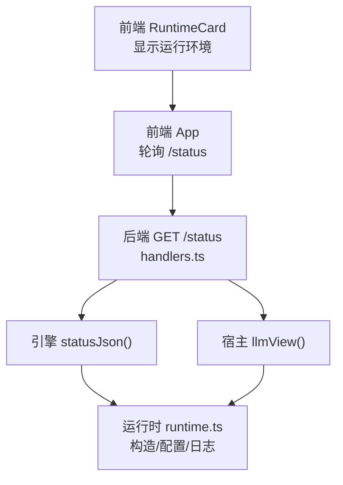
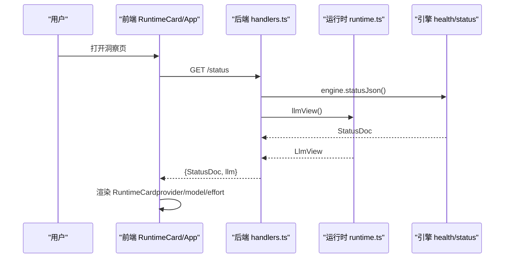
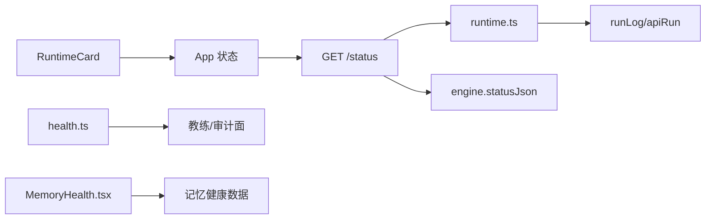

# 运行时卡片

<cite>
**本文引用的文件**
- [RuntimeCard.tsx](file://ui/src/pages/InsightPage/RuntimeCard.tsx)
- [handlers.ts](file://src/host/handlers.ts)
- [runtime.ts](file://src/host/runtime.ts)
- [App.tsx](file://ui/src/App.tsx)
- [types.ts](file://ui/src/types.ts)
- [health.ts](file://src/engine/health.ts)
- [MemoryHealth.tsx](file://ui/src/pages/InsightPage/MemoryHealth.tsx)
- [sleep.ts](file://src/engine/sleep.ts)
- [SleepCard.tsx](file://ui/src/pages/InsightPage/SleepCard.tsx)
</cite>

## 目录
1. [简介](#简介)
2. [项目结构](#项目结构)
3. [核心组件](#核心组件)
4. [架构总览](#架构总览)
5. [详细组件分析](#详细组件分析)
6. [依赖关系分析](#依赖关系分析)
7. [性能考量](#性能考量)
8. [故障诊断与排错指南](#故障诊断与排错指南)
9. [结论](#结论)
10. [附录：指标口径与最佳实践](#附录指标口径与最佳实践)

## 简介
本文件围绕“运行时卡片”（RuntimeCard）展开，系统说明其如何展示当前运行环境、模型配置与相关状态，并扩展到整个系统的监控维度、性能指标收集、异常检测机制、资源使用查看、服务健康检查、日志分析与故障诊断工具。同时提供性能瓶颈识别思路、优化建议与运维最佳实践，帮助读者在面板中快速定位问题并进行调优。

## 项目结构
运行时卡片位于前端洞察区，负责以只读方式展示宿主提供的运行时信息（如 LLM provider/model 与思考档），并通过全局状态轮询获取后端 /status 返回的引擎状态与宿主附加的 llm 视图。后端通过路由处理器聚合引擎状态与宿主侧 llm 视图，统一序列化后返回给前端。

图表来源
- [RuntimeCard.tsx:1-28](file://ui/src/pages/InsightPage/RuntimeCard.tsx#L1-L28)
- [App.tsx:47-81](file://ui/src/App.tsx#L47-L81)
- [handlers.ts:101-107](file://src/host/handlers.ts#L101-L107)
- [runtime.ts:135-193](file://src/host/runtime.ts#L135-L193)

章节来源
- [RuntimeCard.tsx:1-28](file://ui/src/pages/InsightPage/RuntimeCard.tsx#L1-L28)
- [App.tsx:47-81](file://ui/src/App.tsx#L47-L81)
- [handlers.ts:101-107](file://src/host/handlers.ts#L101-L107)
- [runtime.ts:135-193](file://src/host/runtime.ts#L135-L193)

## 核心组件
- 前端运行时卡片：以只读形式展示当前 LLM provider/model 及思考档，提示切换方式与数据来源。
- 前端应用状态：App 层统一轮询 /status，将引擎状态与宿主 llm 视图合并为全局 frame.status，供各页面消费。
- 后端状态接口：GET /status 聚合引擎 statusJson 与宿主 llm 视图，附带会话开始触点节流。
- 运行时装配：创建 HostRuntime，注入引擎、Agent 缝、语料捕获器、任务表、标志位等；记录调用日志与失败信息。
- 健康分与记忆健康：图谱健康分（教学语义质量）、记忆健康（复习负载预报、状态分布、保留率）。
- 睡眠耦合建议：对重巩固型节点给出“睡前练、醒后验”的建议开关与文案。

章节来源
- [RuntimeCard.tsx:1-28](file://ui/src/pages/InsightPage/RuntimeCard.tsx#L1-L28)
- [App.tsx:47-81](file://ui/src/App.tsx#L47-L81)
- [handlers.ts:101-107](file://src/host/handlers.ts#L101-L107)
- [runtime.ts:135-193](file://src/host/runtime.ts#L135-L193)
- [health.ts:49-104](file://src/engine/health.ts#L49-L104)
- [MemoryHealth.tsx:133-195](file://ui/src/pages/InsightPage/MemoryHealth.tsx#L133-L195)
- [sleep.ts:1-42](file://src/engine/sleep.ts#L1-L42)
- [SleepCard.tsx:1-51](file://ui/src/pages/InsightPage/SleepCard.tsx#L1-L51)

## 架构总览
下图展示了从前端到后端的完整数据流：前端 RuntimeCard 依赖 App 的全局状态，App 轮询 /status；后端 handlers 聚合引擎状态与宿主 llm 视图；运行时 runtime 负责装配与日志记录；健康模块提供图谱健康分；记忆健康与睡眠建议提供学习侧的运行洞察。

图表来源
- [App.tsx:62-81](file://ui/src/App.tsx#L62-L81)
- [handlers.ts:101-107](file://src/host/handlers.ts#L101-L107)
- [runtime.ts:163-193](file://src/host/runtime.ts#L163-L193)

## 详细组件分析

### 前端运行时卡片（RuntimeCard）
- 功能：只读展示当前 LLM provider/model 与思考档（fast_effort/deep_effort），并提供切换指引。
- 数据来源：frame.status.llm（由 App 轮询 /status 获得）。
- 交互：无写操作，仅展示；若状态未加载则显示占位文本。

章节来源
- [RuntimeCard.tsx:1-28](file://ui/src/pages/InsightPage/RuntimeCard.tsx#L1-L28)
- [App.tsx:17-38](file://ui/src/App.tsx#L17-L38)
- [types.ts:24-27](file://ui/src/types.ts#L24-L27)

### 后端状态接口（GET /status）
- 职责：返回引擎状态与宿主 llm 视图；触发会话开始触点（防抖节流）。
- 实现要点：
  - 调用 engine.statusJson() 获取引擎状态。
  - 调用 llmView() 获取宿主侧 LLM 配置（provider/model/fastEffort/deepEffort）。
  - 通过 apiRun 包装，确保成功/失败均写入运行日志。

章节来源
- [handlers.ts:101-107](file://src/host/handlers.ts#L101-L107)
- [runtime.ts:217-253](file://src/host/runtime.ts#L217-L253)

### 运行时装配与日志（HostRuntime）
- 职责：集中管理引擎实例、Agent 缝、语料捕获器、任务注册表、标志位与审计率；提供 runLog/apiRun 等通用能力。
- 关键点：
  - 路径校验与新鲜库初始化。
  - Agent 缝 onCall 回调输出调用摘要并落盘运行日志。
  - runLog 截断上限，避免日志过大；apiRun 在失败时记录错误信息。

章节来源
- [runtime.ts:23-133](file://src/host/runtime.ts#L23-L133)
- [runtime.ts:135-193](file://src/host/runtime.ts#L135-L193)
- [runtime.ts:195-253](file://src/host/runtime.ts#L195-L253)

### 图谱健康分（Graph Health Score）
- 目标：将“教学语义上站得住”压缩为 0–100 的可计算分数，辅助教练与审计进行质量基线评估。
- 指标构成（每项 0–20）：
  - 动作句命名比例
  - est 覆盖率
  - 前置完备性（空降节点越少越好）
  - 收敛度（非根节点平均 pre 数）
  - 结构卫生（别名包含、多连通分量、不可达节点扣分）
- 用途：不强制阈值，但低于一定水平会随 findings 返回提示，指导图作者优化。

章节来源
- [health.ts:1-104](file://src/engine/health.ts#L1-L104)

### 记忆健康（Memory Health）
- 能力：提供每日负载预报、记忆状态分布（稳定性/难度/可回忆度）、真实保留率、校准与遗忘曲线等。
- 前端呈现：MemoryHealth 组件可视化关键指标，支持 JOL 开关与校准提示开关。
- 适用场景：评估复习队列压力、预测未来到期量、观察模型校准效果。

章节来源
- [MemoryHealth.tsx:133-195](file://ui/src/pages/InsightPage/MemoryHealth.tsx#L133-L195)

### 睡眠耦合建议（Sleep Advice）
- 能力：对重巩固型节点（乐器/运动等）提供“睡前练、醒后验”的建议与可选心理演练附注。
- 控制：可通过 SleepCard 开关启用/关闭；纯建议层，不影响调度语义。
- 价值：提升实践类技能的巩固效果，配合记忆健康指标观察长期收益。

章节来源
- [sleep.ts:1-42](file://src/engine/sleep.ts#L1-L42)
- [SleepCard.tsx:1-51](file://ui/src/pages/InsightPage/SleepCard.tsx#L1-L51)

## 依赖关系分析
- 前端依赖：
  - RuntimeCard 依赖 App 的 frame.status（含 llm 视图）。
  - App 依赖 api.status 获取后端状态。
- 后端依赖：
  - handlers 依赖 engine.statusJson 与 host llmView。
  - runtime 提供 runLog/apiRun，贯穿所有 API 调用日志。
- 健康模块：
  - health.ts 提供图谱健康分，供教练台与审计面使用。
  - MemoryHealth 组件消费记忆健康数据，用于学习侧监控。

图表来源
- [RuntimeCard.tsx:1-28](file://ui/src/pages/InsightPage/RuntimeCard.tsx#L1-L28)
- [App.tsx:47-81](file://ui/src/App.tsx#L47-L81)
- [handlers.ts:101-107](file://src/host/handlers.ts#L101-L107)
- [runtime.ts:217-253](file://src/host/runtime.ts#L217-L253)
- [health.ts:49-104](file://src/engine/health.ts#L49-L104)
- [MemoryHealth.tsx:133-195](file://ui/src/pages/InsightPage/MemoryHealth.tsx#L133-L195)

章节来源
- [runtime.ts:217-253](file://src/host/runtime.ts#L217-L253)
- [handlers.ts:101-107](file://src/host/handlers.ts#L101-L107)
- [health.ts:49-104](file://src/engine/health.ts#L49-L104)
- [MemoryHealth.tsx:133-195](file://ui/src/pages/InsightPage/MemoryHealth.tsx#L133-L195)

## 性能考量
- 日志开销：
  - runLog 每次调用都会追加文件，存在 I/O 成本；采用截断策略（LOG_LIMIT）降低单行大小。
  - 建议在高频调用路径上谨慎使用或批量落盘，避免磁盘抖动。
- 状态轮询：
  - App 启动时并行请求 /status 与课程树，减少首屏等待；后续可按需刷新。
  - 洞察区可结合心跳或增量更新策略降低无效轮询。
- 健康分计算：
  - graphHealthScore 基于图结构派生指标，复杂度与节点规模相关；大图场景下注意计算耗时。
- 记忆健康：
  - 记忆健康涉及跨课程扫描与统计，适合异步或定时任务；面板展示时应考虑懒加载与分页。

[本节为通用性能讨论，不直接分析具体代码文件]

## 故障诊断与排错指南
- 常见问题定位：
  - 运行时信息为空：检查 /status 是否返回 llm 视图；确认宿主进程已正确装配 runtime 与 llm 配置。
  - 模型切换未生效：按 RuntimeCard 提示编辑配置文件并重启宿主进程。
  - 生成任务失败：查看运行日志（中心状态目录下的运行日志.md），关注 apiRun 记录的失败摘要。
- 健康分偏低：
  - 根据 breakdown 逐项优化：动作句命名、est 覆盖、前置完备、收敛度、结构卫生。
- 记忆健康异常：
  - 观察每日负载预报与真实保留率；调整复习节奏与题目难度分布。
- 睡眠建议无效：
  - 确认 SleepCard 开关已开启；检查重巩固型节点是否存在；建议层为只读，不影响调度。

章节来源
- [handlers.ts:101-107](file://src/host/handlers.ts#L101-L107)
- [runtime.ts:217-253](file://src/host/runtime.ts#L217-L253)
- [health.ts:49-104](file://src/engine/health.ts#L49-L104)
- [MemoryHealth.tsx:133-195](file://ui/src/pages/InsightPage/MemoryHealth.tsx#L133-L195)
- [SleepCard.tsx:1-51](file://ui/src/pages/InsightPage/SleepCard.tsx#L1-L51)

## 结论
运行时卡片提供了当前运行环境的透明视图，结合后端状态接口与运行时装配，形成端到端的监控闭环。通过图谱健康分、记忆健康与睡眠建议，系统在学习侧与工程侧均具备可观测性与可优化空间。运维实践中应重视日志采集、健康指标与负载预报，结合面板进行持续调优与故障排查。

[本节为总结性内容，不直接分析具体代码文件]

## 附录：指标口径与最佳实践
- 监控维度
  - 运行环境：provider/model/思考档（只读）。
  - 服务健康：引擎状态、LLM 可用性、Anki 通道状态（通过 /anki/status）。
  - 学习健康：图谱健康分、记忆健康（负载预报、状态分布、保留率）、睡眠建议。
- 性能指标收集
  - Agent 调用：onCall 回调记录时长、字符数、token 用量（如有）。
  - 运行日志：每次引擎调用与 API 调用均落盘，便于回溯。
- 异常检测机制
  - 参数校验：宿主装配时对非法配置 fail loud。
  - 健康分：低于阈值时随 findings 返回提示。
  - 数据检查：dataCheck 报告缺失/损坏项，辅助数据治理。
- 系统优化建议
  - 合理设置思考档（fast_effort/deep_effort）平衡速度与质量。
  - 控制日志频率与大小，避免 I/O 瓶颈。
  - 定期审视图谱健康分与记忆健康指标，优化内容与调度策略。
- 运维最佳实践
  - 变更配置后重启宿主进程以确保生效。
  - 使用 /status 与运行日志进行日常巡检。
  - 结合 MemoryHealth 与 SleepCard 调整学习节奏与推荐策略。

[本节为通用指导，不直接分析具体代码文件]