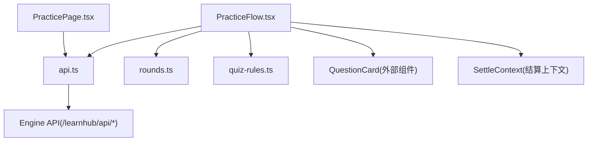
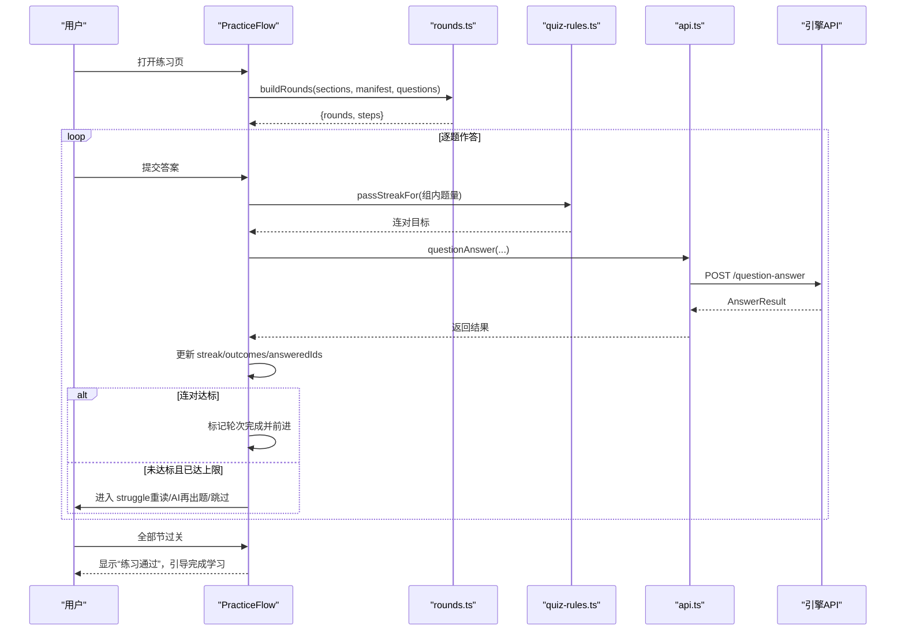
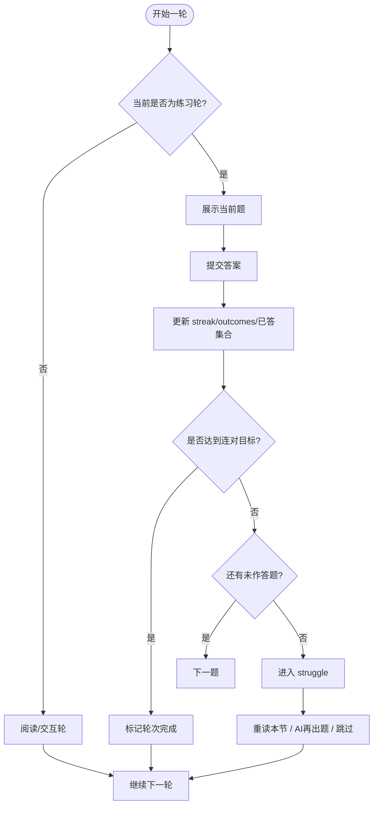
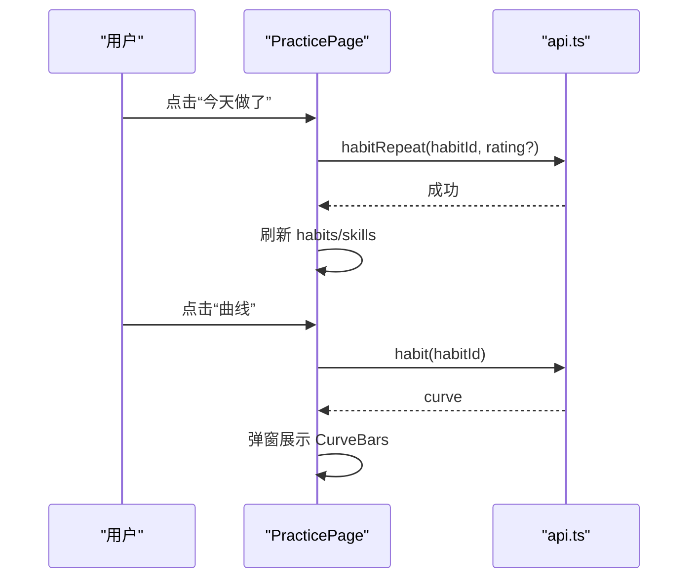
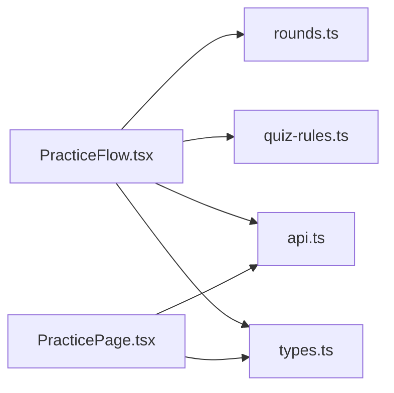

# 练习页面

<cite>
**本文引用的文件**
- [PracticePage.tsx](file://ui/src/pages/PracticePage.tsx)
- [PracticeFlow.tsx](file://ui/src/components/PracticeFlow.tsx)
- [quiz-rules.ts](file://ui/src/lib/quiz-rules.ts)
- [rounds.ts](file://ui/src/lib/rounds.ts)
- [api.ts](file://ui/src/api.ts)
- [types.ts](file://ui/src/types.ts)
</cite>

## 目录
1. [简介](#简介)
2. [项目结构](#项目结构)
3. [核心组件](#核心组件)
4. [架构总览](#架构总览)
5. [详细组件分析](#详细组件分析)
6. [依赖关系分析](#依赖关系分析)
7. [性能考虑](#性能考虑)
8. [故障排查指南](#故障排查指南)
9. [结论](#结论)
10. [附录：使用示例与配置建议](#附录使用示例与配置建议)

## 简介
本文件围绕“练习页面”的学习练习功能进行系统化说明，覆盖题目展示、答题交互、答案验证、学习反馈、状态管理、进度跟踪、结果处理、模式选择、难度调节与个性化设置，并提供可操作的自定义配置与优化建议。内容基于前端 UI 层（React）与引擎 API 的协作实现，重点解析 PracticeFlow 会话流与 PracticePage 习惯/技能区。

## 项目结构
- 页面入口
  - PracticePage：无界实践区（习惯 + 技能条目），提供习惯自报重复、曲线查看与技能 lane 概览。
- 练习会话
  - PracticeFlow：节序列驱动的 mastery 练习流，包含阅读轮、练习轮、交互轮，以及申诉、补题、过关判定等。
- 规则与计划
  - quiz-rules：连对目标、每轮最大作答数、软上限等规则。
  - rounds：根据 manifest/sections/questions 构建轮次与步骤（stepper）。
- 数据与接口
  - api：统一 HTTP 客户端，封装所有引擎 API 调用。
  - types：类型定义集中导出，避免手工镜像。

图表来源
- [PracticePage.tsx:38-238](file://ui/src/pages/PracticePage.tsx#L38-L238)
- [PracticeFlow.tsx:58-462](file://ui/src/components/PracticeFlow.tsx#L58-L462)
- [rounds.ts:44-102](file://ui/src/lib/rounds.ts#L44-L102)
- [quiz-rules.ts:1-19](file://ui/src/lib/quiz-rules.ts#L1-L19)
- [api.ts:43-353](file://ui/src/api.ts#L43-L353)

章节来源
- [PracticePage.tsx:1-238](file://ui/src/pages/PracticePage.tsx#L1-L238)
- [PracticeFlow.tsx:1-462](file://ui/src/components/PracticeFlow.tsx#L1-L462)
- [rounds.ts:1-102](file://ui/src/lib/rounds.ts#L1-L102)
- [quiz-rules.ts:1-19](file://ui/src/lib/quiz-rules.ts#L1-L19)
- [api.ts:1-370](file://ui/src/api.ts#L1-L370)
- [types.ts:1-93](file://ui/src/types.ts#L1-L93)

## 核心组件
- PracticePage
  - 职责：展示习惯列表与技能条目；支持创建习惯、自报重复、查看自动化曲线、归档习惯；展示技能 lane 到期与维持节拍。
  - 关键交互：Modal 确认、Input 输入评分、Table 渲染、Message 提示。
  - 数据源：通过 api.habits()、api.skills()、api.habit(id) 获取数据。
- PracticeFlow
  - 职责：按节清单装配轮次（read/quiz/interactive），驱动单题作答、连对推进、struggle 分支、AI 补题、申诉结算、完成学习。
  - 关键状态：roundIdx、qIdx、streak、asked、answeredIds、outcomes、voidedIds、doneRounds、maxReached。
  - 规则消费：passStreakFor、MAX_ASK_PER_ROUND、QUIZ_SOFT_CAP。
  - 外部集成：SettleContext（交互件结算）、QuestionCard（答题卡片）、QuestionMenu（编辑/归档/重生成/申诉）。

章节来源
- [PracticePage.tsx:38-238](file://ui/src/pages/PracticePage.tsx#L38-L238)
- [PracticeFlow.tsx:58-462](file://ui/src/components/PracticeFlow.tsx#L58-L462)
- [quiz-rules.ts:1-19](file://ui/src/lib/quiz-rules.ts#L1-L19)
- [rounds.ts:44-102](file://ui/src/lib/rounds.ts#L44-L102)

## 架构总览
练习流程由“节清单 → 轮次计划 → 会话状态机”构成，结合规则模块控制过关阈值与出题上限，并通过 API 与引擎交互完成作答、申诉、补题与结算。

图表来源
- [PracticeFlow.tsx:79-222](file://ui/src/components/PracticeFlow.tsx#L79-L222)
- [rounds.ts:44-102](file://ui/src/lib/rounds.ts#L44-L102)
- [quiz-rules.ts:5-14](file://ui/src/lib/quiz-rules.ts#L5-L14)
- [api.ts:52-67](file://ui/src/api.ts#L52-L67)

## 详细组件分析

### PracticeFlow 组件分析
- 轮次构建与步进
  - 依据 manifest 或 sections 构建 read/quiz/interactive 轮，并为每个节生成 step（用于顶部 stepper）。
  - 旧节点回退标题匹配，未落节的题归入“综合”收尾轮。
- 答题与连对机制
  - 每题仅在本会话作答一次；已答过的题不重复出现。
  - 连对目标 = min(基准, 组内题量)，下限为 1，避免在 1 题轮中不可达。
  - 直通卡（advancedToday）不计入连对，仅计入“已看集合”。
- Struggle 分支与 AI 补题
  - 当组内无可作答题或未达标且达到 MAX_ASK_PER_ROUND，进入 struggle。
  - 非练习/交互节可触发 AI 定向补题（入队即返回，新题刷新后并入本题组）。
- 申诉与作废（ADR-0031）
  - 改判对：恢复连对推进；作废/豁免：中性处理（退出预算、不奖不罚），必要时重出同类题。
- 完成学习
  - 全部节过关后，通知父级放行“完成学习”，将本节题目纳入复习循环。

图表来源
- [PracticeFlow.tsx:169-222](file://ui/src/components/PracticeFlow.tsx#L169-L222)
- [quiz-rules.ts:5-14](file://ui/src/lib/quiz-rules.ts#L5-L14)

章节来源
- [PracticeFlow.tsx:58-462](file://ui/src/components/PracticeFlow.tsx#L58-L462)
- [rounds.ts:44-102](file://ui/src/lib/rounds.ts#L44-L102)
- [quiz-rules.ts:1-19](file://ui/src/lib/quiz-rules.ts#L1-L19)

### PracticePage 组件分析
- 习惯区
  - 创建习惯：名称 + 线索 + 行动，无到期、无提醒，仅记录自报重复与曲线。
  - 自报重复：可选自动化程度自评 1-5，立即入账并刷新列表。
  - 曲线查看：最近 24 个点可视化，横轴累计重复次数，纵轴自评等级。
  - 归档：可逆收纳标签，历史保留。
- 技能条目区
  - 展示技能 lane 到期、本次形态（习得推进/维持复活）、维持节拍、执行次数与状态。
- 数据加载与错误处理
  - 并发加载 habits/skills，失败时以 Message.error 提示。

图表来源
- [PracticePage.tsx:56-126](file://ui/src/pages/PracticePage.tsx#L56-L126)
- [api.ts:265-274](file://ui/src/api.ts#L265-L274)

章节来源
- [PracticePage.tsx:38-238](file://ui/src/pages/PracticePage.tsx#L38-L238)
- [api.ts:265-274](file://ui/src/api.ts#L265-L274)

### 规则与计划模块
- quiz-rules
  - PASS_STREAK=2：连对即过基准。
  - MAX_ASK_PER_ROUND=5：每节最多作答数，超过未达标进入 struggle。
  - QUIZ_SOFT_CAP=40：节点未归档题软上限，到达后需显式确认才能补题。
  - passStreakFor(n)：动态计算连对目标，防止 1 题轮不可达。
- rounds
  - buildRounds：根据 manifest/sections 与 questions 组装轮次与步骤；旧节点回退标题匹配；未落节题进“综合”轮。

章节来源
- [quiz-rules.ts:1-19](file://ui/src/lib/quiz-rules.ts#L1-L19)
- [rounds.ts:1-102](file://ui/src/lib/rounds.ts#L1-L102)

## 依赖关系分析
- PracticeFlow 依赖
  - rounds.ts：构建轮次与步骤。
  - quiz-rules.ts：连对目标与上限。
  - api.ts：作答、申诉、补题、交互件结算等。
  - QuestionCard/QuestionMenu/SettleContext：答题与交互件结算。
- PracticePage 依赖
  - api.ts：习惯与技能数据、自报重复、曲线、归档。
  - types.ts：类型集中导出（HabitListItem/SkillLaneItem/HabitCurvePoint 等）。

图表来源
- [PracticeFlow.tsx:58-462](file://ui/src/components/PracticeFlow.tsx#L58-L462)
- [PracticePage.tsx:38-238](file://ui/src/pages/PracticePage.tsx#L38-L238)
- [rounds.ts:44-102](file://ui/src/lib/rounds.ts#L44-L102)
- [quiz-rules.ts:1-19](file://ui/src/lib/quiz-rules.ts#L1-L19)
- [api.ts:43-353](file://ui/src/api.ts#L43-L353)
- [types.ts:34-52](file://ui/src/types.ts#L34-L52)

章节来源
- [PracticeFlow.tsx:58-462](file://ui/src/components/PracticeFlow.tsx#L58-L462)
- [PracticePage.tsx:38-238](file://ui/src/pages/PracticePage.tsx#L38-L238)
- [rounds.ts:44-102](file://ui/src/lib/rounds.ts#L44-L102)
- [quiz-rules.ts:1-19](file://ui/src/lib/quiz-rules.ts#L1-L19)
- [api.ts:43-353](file://ui/src/api.ts#L43-L353)
- [types.ts:34-52](file://ui/src/types.ts#L34-L52)

## 性能考虑
- 并发加载：PracticePage 使用 Promise.all 并发请求 habits/skills，减少首屏等待。
- 本地状态最小化：PracticeFlow 使用 Set/Map 维护已答集合与 outcomes，避免全量重算。
- 节流与上限：MAX_ASK_PER_ROUND 限制单轮作答数，避免过长练习导致卡顿。
- 软上限提示：QUIZ_SOFT_CAP 阻止题库膨胀，降低后续渲染与调度压力。
- 增量刷新：外部题目集变化时，PracticeFlow 仅定位到第一个未作答题，不打断正在进行的作答。

[本节为通用指导，无需具体文件引用]

## 故障排查指南
- 网络与 API 错误
  - 现象：Message.error 提示 HTTP 错误或引擎错误消息。
  - 排查：检查 api.ts 的 http 封装与响应体 error 字段；确认后端路由可用。
- 连对卡在 struggle
  - 现象：组内题量不足或已答完仍未达标。
  - 排查：确认 passStreakFor 返回值；检查是否有 advancedToday 直通题混入；必要时触发 AI 再出题。
- 题目刷新错位
  - 现象：外部题目集变化后，当前题丢失或轮次跳变。
  - 排查：核对 roundsSigRef 签名比较逻辑；确认 gotoRound 重定位到第一个未作答题。
- 申诉后状态异常
  - 现象：改判对或作废后，连对推进不符合预期。
  - 排查：检查 handleDisputeSettled 对 outcomes/voidedIds/asked 的更新；确认 onSettled 回调触发。

章节来源
- [api.ts:13-31](file://ui/src/api.ts#L13-L31)
- [PracticeFlow.tsx:114-146](file://ui/src/components/PracticeFlow.tsx#L114-L146)
- [PracticeFlow.tsx:257-297](file://ui/src/components/PracticeFlow.tsx#L257-L297)

## 结论
练习页面以 PracticeFlow 为核心，结合 rounds 与 quiz-rules 形成稳定的“节→轮→题”学习流；PracticePage 提供习惯与技能的无界实践入口。通过连对机制、struggle 分支、AI 补题与申诉结算，兼顾学习效率与容错性。建议在复杂节点下关注软上限与补题策略，确保题库质量与体验流畅。

[本节为总结，无需具体文件引用]

## 附录：使用示例与配置建议
- 练习场景示例
  - 阅读+练习混合节：先阅读材料，随后进入 quiz 轮，连续答对达到目标即过关。
  - 纯练习节：直接做题，若未达标且达到上限，可选择 AI 再出题或跳过。
  - 交互节：通过 SettleContext 上报交互件成绩，达成目标后推进。
  - 申诉流程：对判错发起申诉，改判对则恢复连对；作废则中性处理并重出同类题。
- 模式选择与难度调节
  - 模式：manifest 决定节类型（内容/练习/交互），旧节点回退标题匹配。
  - 难度：通过 PASS_STREAK、MAX_ASK_PER_ROUND、QUIZ_SOFT_CAP 控制节奏与上限；可在父级任务化入队补题时传入 instruction 定制题目风格。
- 个性化设置
  - 习惯：自报重复时可填自动化程度 1-5，便于长期曲线观察。
  - 技能：设置 maintenance_days 控制维持节拍；lane 到期提醒区分 acquisition/maintenance。
- 优化建议
  - 合理拆分节与题量，避免单轮过大导致 struggle 频繁。
  - 利用 AI 定向补题针对薄弱节补充同类题，提升通过率。
  - 定期清理未归档题，保持在软上限以内，利于维护与调度。

[本节为概念性指导，无需具体文件引用]