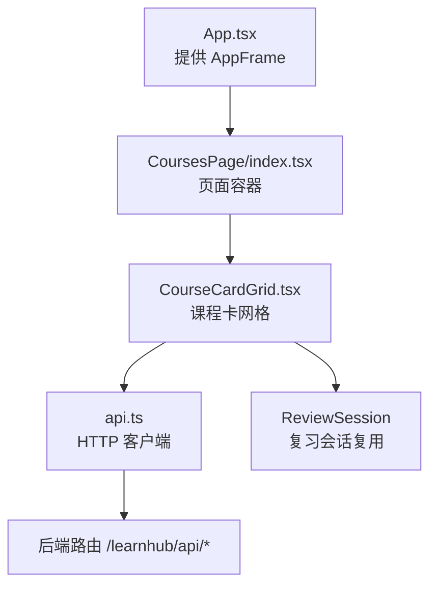
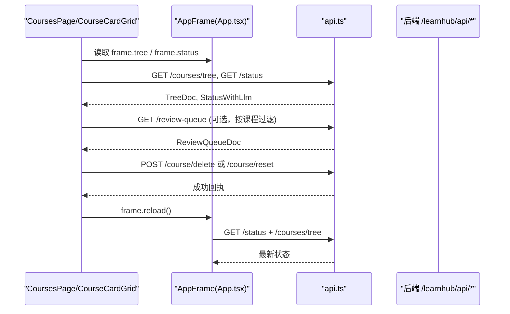
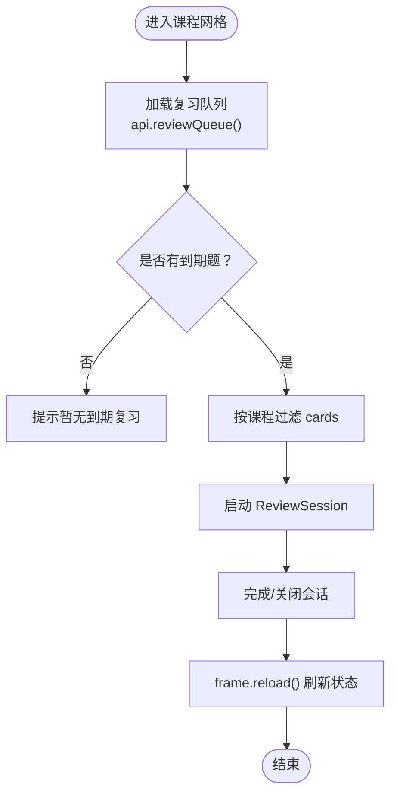
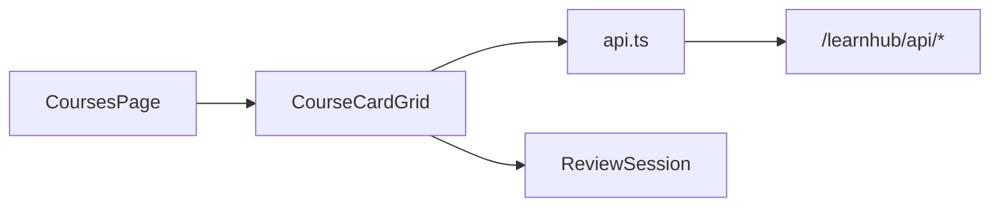

# 课程页面

<cite>
**本文引用的文件**
- [ui/src/pages/CoursesPage/index.tsx](file://ui/src/pages/CoursesPage/index.tsx)
- [ui/src/components/CourseCardGrid.tsx](file://ui/src/components/CourseCardGrid.tsx)
- [ui/src/api.ts](file://ui/src/api.ts)
- [ui/src/types.ts](file://ui/src/types.ts)
- [ui/src/App.tsx](file://ui/src/App.tsx)
- [src/engine/content-subsystem.ts](file://src/engine/content-subsystem.ts)
- [src/engine/sessions.ts](file://src/engine/sessions.ts)
- [src/host/jobs.ts](file://src/host/jobs.ts)
</cite>

## 目录
1. [简介](#简介)
2. [项目结构](#项目结构)
3. [核心组件](#核心组件)
4. [架构总览](#架构总览)
5. [详细组件分析](#详细组件分析)
6. [依赖关系分析](#依赖关系分析)
7. [性能考量](#性能考量)
8. [故障排查指南](#故障排查指南)
9. [结论](#结论)
10. [附录：配置、样式与扩展](#附录配置样式与扩展)

## 简介
本课程页面（CoursesPage）是“我的课程”首屏，负责展示所有已启用课程的概览卡片，提供打开单课工作台、按课程复习、重新生成与删除等管理操作。它通过全局 AppFrame 提供的状态面（status/tree/course）渲染课程列表，并在需要时拉取复习队列数据以支持“按课程复习”。课程卡片内置进度条、状态标签与终点读数，满足学习进度跟踪与筛选入口的需求。

## 项目结构
课程页面由两个主要前端模块组成：
- CoursesPage：页面级容器，处理空态与有课态的分支渲染，并承载 CoachCockpit（建课入口）。
- CourseCardGrid：课程卡网格，自包含复习队列获取、课程管理交互（删除/重置）、以及按课程启动复习会话。

图表来源
- [ui/src/App.tsx:17-38](file://ui/src/App.tsx#L17-L38)
- [ui/src/pages/CoursesPage/index.tsx:12-30](file://ui/src/pages/CoursesPage/index.tsx#L12-L30)
- [ui/src/components/CourseCardGrid.tsx:80-173](file://ui/src/components/CourseCardGrid.tsx#L80-L173)
- [ui/src/api.ts:43-243](file://ui/src/api.ts#L43-L243)

章节来源
- [ui/src/pages/CoursesPage/index.tsx:1-30](file://ui/src/pages/CoursesPage/index.tsx#L1-L30)
- [ui/src/components/CourseCardGrid.tsx:1-174](file://ui/src/components/CourseCardGrid.tsx#L1-L174)
- [ui/src/App.tsx:17-38](file://ui/src/App.tsx#L17-L38)

## 核心组件
- CoursesPage
  - 职责：判断是否存在课程；无课时显示引导文案与教练台（建课入口），有课时渲染课程卡网格。
  - 关键逻辑：基于 frame.tree.courses 长度决定渲染分支；使用 frame.openCourse 进入单课工作台。
- CourseCardGrid
  - 职责：渲染课程卡片网格；自取复习队列；提供删除/重置/复习等操作；监听全局 reload 事件刷新到期数。
  - 关键逻辑：调用 api.reviewQueue 获取跨课程到期题；按课程过滤后启动 ReviewSession；删除/重置走 Modal 确认与 API 调用。

章节来源
- [ui/src/pages/CoursesPage/index.tsx:12-30](file://ui/src/pages/CoursesPage/index.tsx#L12-L30)
- [ui/src/components/CourseCardGrid.tsx:80-173](file://ui/src/components/CourseCardGrid.tsx#L80-L173)

## 架构总览
课程页面的数据流与交互流程如下：
- 初始化：App 在挂载时并行请求 status 与 coursesTree，填充 AppFrame.status 与 AppFrame.tree。
- 渲染：CoursesPage 根据 tree.courses 是否为空选择空态或课程网格。
- 数据：CourseCardGrid 主动拉取 review-queue，用于“按课程复习”和“到期计数”。
- 交互：删除/重置/复习分别触发对应 API；完成后通过 frame.reload() 刷新状态面。

图表来源
- [ui/src/App.tsx:62-79](file://ui/src/App.tsx#L62-L79)
- [ui/src/components/CourseCardGrid.tsx:81-139](file://ui/src/components/CourseCardGrid.tsx#L81-L139)
- [ui/src/api.ts:43-243](file://ui/src/api.ts#L43-L243)

## 详细组件分析

### CoursesPage 组件
- 功能要点
  - 空态：当没有课程时，显示引导文案并提供 CoachCockpit（课程区唯一主动建课入口）。
  - 有课态：渲染 CourseCardGrid，承载课程卡网格。
  - 导航：点击“打开图”通过 frame.openCourse(course, 'graph') 进入单课工作台。
- 关键实现路径
  - 课程存在性判断：frame.tree?.courses.length
  - 空态渲染：Space/Card/Typography 组合提示与 CoachCockpit
  - 有课态渲染：CourseCardGrid 接收 frame 作为 props

章节来源
- [ui/src/pages/CoursesPage/index.tsx:12-30](file://ui/src/pages/CoursesPage/index.tsx#L12-L30)

### CourseCardGrid 组件
- 功能要点
  - 复习队列获取：api.reviewQueue() 获取跨课程到期题，失败时降级为空，避免阻塞翻页。
  - 全局刷新：监听 learnhub:reload 事件，自动补拉复习队列，保证跨页操作后的数据一致性。
  - 课程管理
    - 删除课程：Modal 确认后调用 api.courseDelete，成功后 frame.reload()。
    - 重新生成：Modal 确认后调用 api.resetCourse，后台按拓扑序串行重跑生成管线，成功后 frame.reload()。
  - 按课程复习：从 queueDoc.cards 中按 course 字段过滤，若无到期题则提示；否则启动 ReviewSession。
- 课程卡片（CourseCard）
  - 进度：基于 counts.mastered 与 total 计算百分比。
  - 状态标签：未学、进行、复习、掌握、跳过、到期。
  - 终点读数：completions 统计 sealed/reached 数量，展示“N 个终点 · M 个已铺通”。
  - 操作：打开图、复习、…菜单（重新生成/删除）。

图表来源
- [ui/src/components/CourseCardGrid.tsx:81-139](file://ui/src/components/CourseCardGrid.tsx#L81-L139)
- [ui/src/components/CourseCardGrid.tsx:147-170](file://ui/src/components/CourseCardGrid.tsx#L147-L170)

章节来源
- [ui/src/components/CourseCardGrid.tsx:1-174](file://ui/src/components/CourseCardGrid.tsx#L1-L174)

### 数据模型与类型
- 课程树与状态
  - TreeDoc：课程工作区树（course → region → block → node），用于构建课程列表与导航。
  - StatusCourse：单课程汇总（total、counts、due_today、overdue、ready、gated、blocked、completions、probation）。
- 复习队列
  - ReviewQueueDoc：跨课程到期题扁平队列，支持按 course/node/band 过滤。
- 课程卡片
  - 课程名、总数、到期数、各阶段计数、终点完成读数。

章节来源
- [ui/src/types.ts:34-52](file://ui/src/types.ts#L34-L52)
- [src/engine/sessions.ts:144-162](file://src/engine/sessions.ts#L144-L162)
- [ui/src/components/CourseCardGrid.tsx:18-77](file://ui/src/components/CourseCardGrid.tsx#L18-L77)

### 用户交互流程
- 打开课程图：点击“打开图”→ frame.openCourse(course, 'graph') → 路由跳转至单课工作台。
- 按课程复习：点击“复习”→ 过滤该课程到期题 → 若为空提示 → 否则启动 ReviewSession。
- 删除课程：点击“…”菜单中的“删除课程…”→ Modal 确认 → api.courseDelete → 成功提示 → frame.reload()。
- 重新生成课程：点击“…”菜单中的“重新生成…”→ Modal 确认 → api.resetCourse → 成功提示 → frame.reload()。

章节来源
- [ui/src/components/CourseCardGrid.tsx:91-139](file://ui/src/components/CourseCardGrid.tsx#L91-L139)
- [ui/src/components/CourseCardGrid.tsx:147-170](file://ui/src/components/CourseCardGrid.tsx#L147-L170)

## 依赖关系分析
- 组件耦合
  - CoursesPage 仅依赖 AppFrame 与 CourseCardGrid，职责清晰。
  - CourseCardGrid 依赖 api 与 ReviewSession，内聚复习相关逻辑。
- 外部依赖
  - api.ts 统一封装 HTTP 请求，暴露课程树、复习队列、课程管理等接口。
  - 后端通过 /learnhub/api/* 路由提供服务，如 /courses/tree、/review-queue、/course/delete、/course/reset。
- 潜在循环依赖
  - 前端组件之间单向依赖（CoursesPage → CourseCardGrid），无环。
  - 类型定义集中在 types.ts，避免重复镜像。

图表来源
- [ui/src/pages/CoursesPage/index.tsx:12-30](file://ui/src/pages/CoursesPage/index.tsx#L12-L30)
- [ui/src/components/CourseCardGrid.tsx:80-173](file://ui/src/components/CourseCardGrid.tsx#L80-L173)
- [ui/src/api.ts:43-243](file://ui/src/api.ts#L43-L243)

章节来源
- [ui/src/api.ts:43-243](file://ui/src/api.ts#L43-L243)

## 性能考量
- 复习队列懒加载：仅在需要时调用 api.reviewQueue()，降低初始负载。
- 失败降级：reviewQueue 捕获错误返回 null，避免阻塞课程网格渲染。
- 全局刷新事件：通过 learnhub:reload 精准补拉，减少全量轮询。
- 批量状态更新：删除/重置后统一调用 frame.reload()，合并状态刷新。

[本节为通用指导，不直接分析具体文件]

## 故障排查指南
- 复习队列为空
  - 现象：点击“复习”提示“该课程暂无到期复习”。
  - 可能原因：当前课程无到期题；或复习队列加载失败。
  - 处理：检查网络与后端 /review-queue；查看 console 错误；必要时手动触发 frame.reload()。
- 删除/重置失败
  - 现象：Modal 确认后出现错误提示。
  - 可能原因：后端服务异常；课程存在进行中任务（重置前需无运行任务）。
  - 处理：查看 Message.error 信息；等待任务完成或取消后再试。
- 课程树为空
  - 现象：CoursesPage 显示空态引导。
  - 可能原因：尚未创建课程；或课程被禁用/删除。
  - 处理：通过 CoachCockpit 新建课程；检查注册表与课程状态。

章节来源
- [ui/src/components/CourseCardGrid.tsx:91-139](file://ui/src/components/CourseCardGrid.tsx#L91-L139)
- [ui/src/pages/CoursesPage/index.tsx:12-30](file://ui/src/pages/CoursesPage/index.tsx#L12-L30)

## 结论
课程页面以简洁的卡片网格呈现课程概览，结合复习队列实现按课程复习，并通过删除/重置等管理操作完成课程生命周期维护。其设计遵循低耦合、高内聚原则，借助 AppFrame 统一管理状态，确保数据一致性与用户体验流畅。

[本节为总结性内容，不直接分析具体文件]

## 附录：配置、样式与扩展
- 配置选项
  - 课程树与状态：通过 AppFrame.status 与 AppFrame.tree 提供，无需额外配置。
  - 复习队列过滤：支持按 course/node/band 过滤，便于定向复习。
- 自定义样式
  - 课程卡片使用 Arco Design 的 Card/Tag/Button 等组件，可通过 CSS 类 lh-card、lh-grid-cards 等进行主题化。
  - 进度条与标签颜色可依据业务语义调整（如到期红色、掌握绿色）。
- 扩展方法
  - 新增课程管理操作：在 CourseCardGrid 的 Dropdown Menu 中添加新菜单项，并对接相应 api 方法。
  - 增强课程状态展示：扩展 StatusCourse.completions 或 counts，增加新的状态维度。
  - 集成第三方组件：替换或扩展 ReviewSession，支持更多复习模式。

章节来源
- [ui/src/components/CourseCardGrid.tsx:57-77](file://ui/src/components/CourseCardGrid.tsx#L57-L77)
- [ui/src/api.ts:82-83](file://ui/src/api.ts#L82-L83)