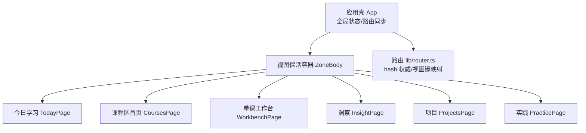
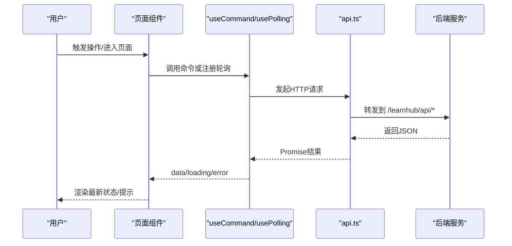
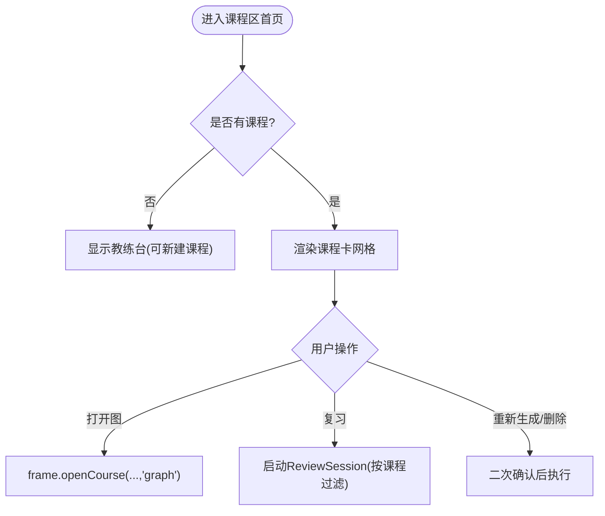
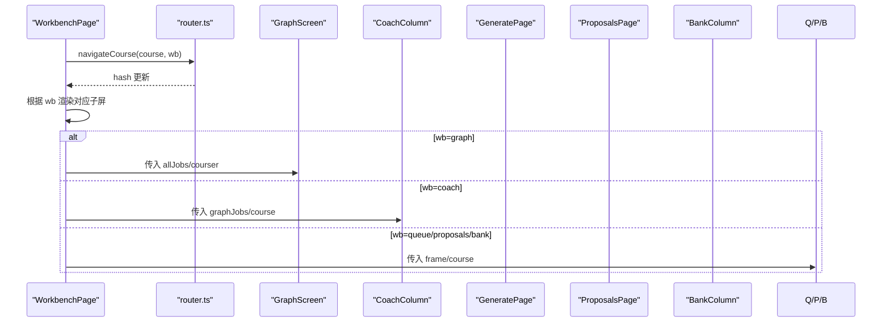
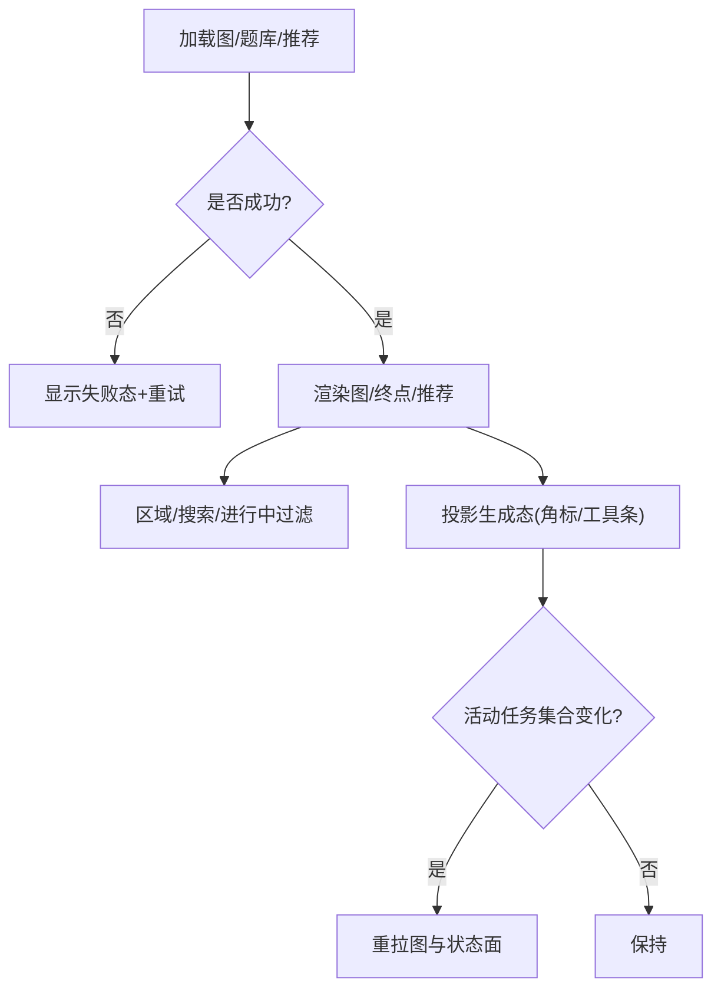
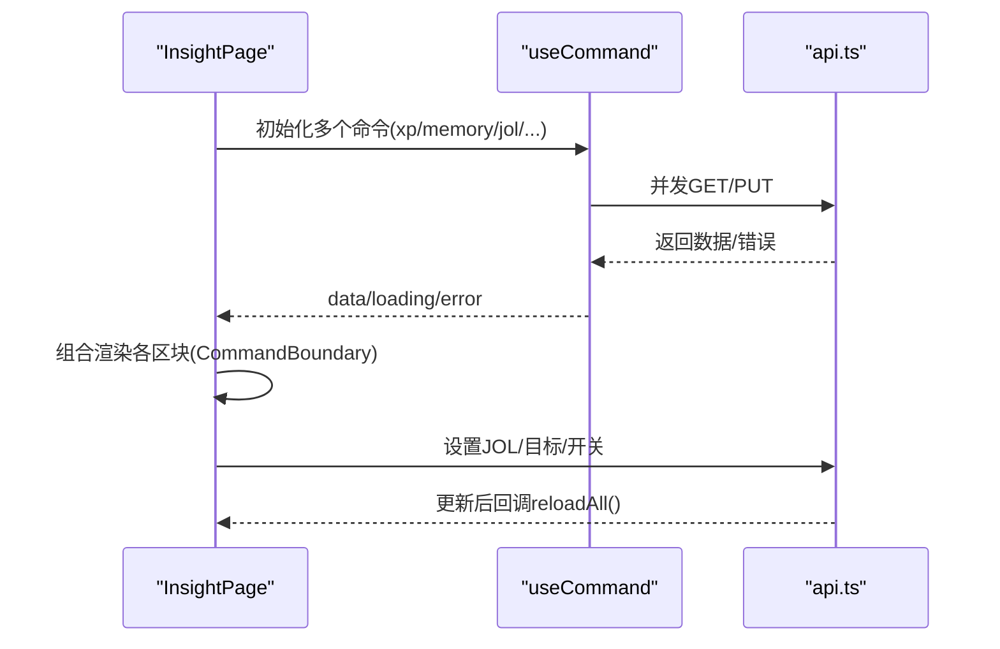
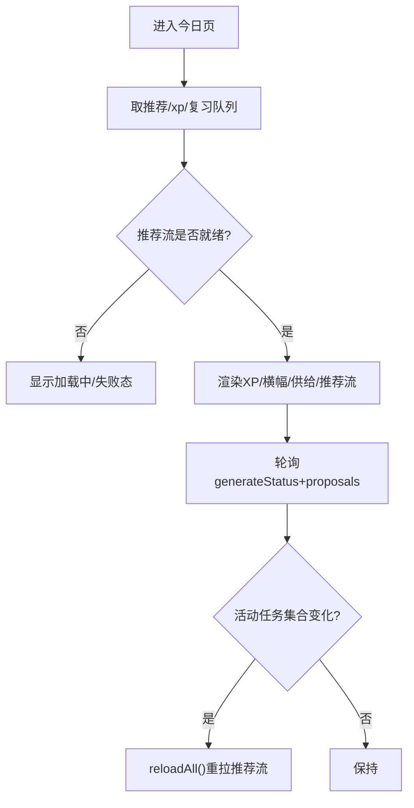
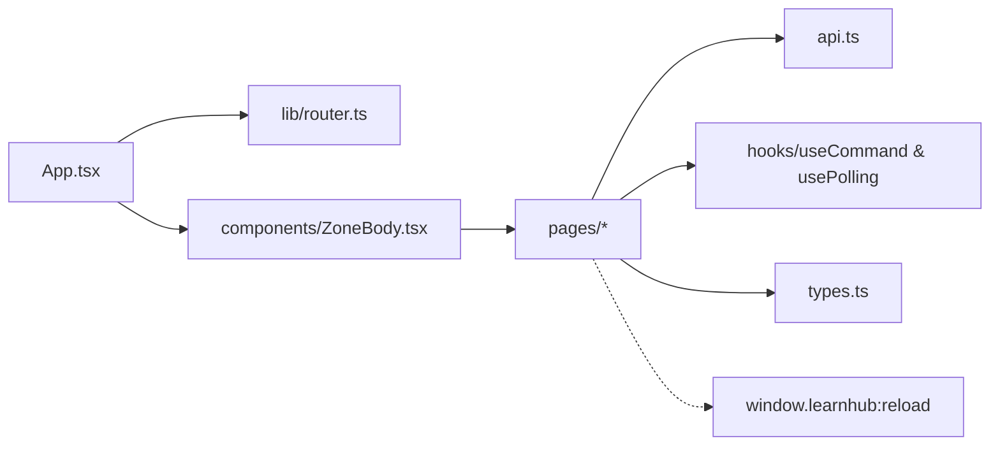

# 页面组件

<cite>
**本文引用的文件**
- [App.tsx](file://ui/src/App.tsx)
- [ZoneBody.tsx](file://ui/src/components/ZoneBody.tsx)
- [router.ts](file://ui/src/lib/router.ts)
- [api.ts](file://ui/src/api.ts)
- [types.ts](file://ui/src/types.ts)
- [useCommand.ts](file://ui/src/hooks/useCommand.ts)
- [usePolling.ts](file://ui/src/hooks/usePolling.ts)
- [CoursesPage/index.tsx](file://ui/src/pages/CoursesPage/index.tsx)
- [CourseCardGrid.tsx](file://ui/src/components/CourseCardGrid.tsx)
- [WorkbenchPage/index.tsx](file://ui/src/pages/WorkbenchPage/index.tsx)
- [WorkbenchPage/GraphScreen.tsx](file://ui/src/pages/WorkbenchPage/GraphScreen.tsx)
- [InsightPage/index.tsx](file://ui/src/pages/InsightPage/index.tsx)
- [TodayPage/index.tsx](file://ui/src/pages/TodayPage/index.tsx)
- [TodayPage/TodayCards.tsx](file://ui/src/pages/TodayPage/TodayCards.tsx)
</cite>

## 目录
1. [简介](#简介)
2. [项目结构](#项目结构)
3. [核心组件](#核心组件)
4. [架构总览](#架构总览)
5. [详细组件分析](#详细组件分析)
6. [依赖关系分析](#依赖关系分析)
7. [性能考量](#性能考量)
8. [故障排查指南](#故障排查指南)
9. [结论](#结论)
10. [附录：页面使用示例与配置选项](#附录页面使用示例与配置选项)

## 简介
本文件面向学习插件的前端页面组件，系统性梳理课程页面（CoursesPage）、工作区页面（WorkbenchPage）、洞察页面（InsightPage）、今日学习页面（TodayPage）等核心页面的职责、数据获取方式、用户交互流程、页面间导航与数据共享机制、页面级状态管理与性能优化策略，并提供自定义页面与最佳实践建议。文档同时给出代码级架构图与时序图，帮助读者快速理解并扩展系统。

## 项目结构
前端采用“区域 + 视图”的两级路由模型：
- 区域键（today、courses、insight、projects、practice）决定顶栏页签与保活容器；
- 课程区进一步展开为三入口（我的课程、生成队列、提案收件箱）以及参数段单课工作台（#/course/<id>/）；
- ZoneBody 作为视图保活容器，首次访问后常驻，非激活隐藏，避免重复挂载导致的状态丢失；
- App 负责全局状态（status、tree、当前课程、学习视图等）与路由同步（hash ↔ 渲染态）。

图表来源
- [App.tsx:47-179](file://ui/src/App.tsx#L47-L179)
- [ZoneBody.tsx:21-42](file://ui/src/components/ZoneBody.tsx#L21-L42)
- [router.ts:1-164](file://ui/src/lib/router.ts#L1-L164)

章节来源
- [App.tsx:47-179](file://ui/src/App.tsx#L47-L179)
- [ZoneBody.tsx:21-42](file://ui/src/components/ZoneBody.tsx#L21-L42)
- [router.ts:1-164](file://ui/src/lib/router.ts#L1-L164)

## 核心组件
- 路由与导航
  - 视图键与区键定义、解析与规范化，单课工作台参数段路由（#/course/<id>/），前进后退与深链直达。
- 数据获取与错误处理
  - useCommand 统一命令式取数：latest-wins 竞态保护、失败不翻转已有数据、错误消息集中提取。
  - usePolling 页签保活轮询：仅激活时拉取，切回补数，支持自定义间隔。
- API 客户端
  - 统一封装 /learnhub/api/* 请求，错误对象携带 HTTP 状态与消息。
- 类型体系
  - 引擎读视图、宿主返回、UI 专有类型集中导出，减少手工镜像。

章节来源
- [router.ts:1-164](file://ui/src/lib/router.ts#L1-L164)
- [useCommand.ts:1-88](file://ui/src/hooks/useCommand.ts#L1-L88)
- [usePolling.ts:1-48](file://ui/src/hooks/usePolling.ts#L1-L48)
- [api.ts:1-370](file://ui/src/api.ts#L1-L370)
- [types.ts:1-93](file://ui/src/types.ts#L1-L93)

## 架构总览
页面通过 AppFrame 共享全局上下文（status、tree、当前课程、学习视图跳转等），各页面以函数组件形式消费 frame 与本地状态。数据流遵循“页面 → useCommand/usePolling → api → 后端”，事件驱动（如 learnhub:reload）用于跨页刷新。

图表来源
- [useCommand.ts:55-87](file://ui/src/hooks/useCommand.ts#L55-L87)
- [usePolling.ts:15-47](file://ui/src/hooks/usePolling.ts#L15-L47)
- [api.ts:13-32](file://ui/src/api.ts#L13-L32)

## 详细组件分析

### 课程页面（CoursesPage）
- 功能职责
  - 展示“我的课程”卡片网格；空 vault 时提供教练台建课入口；有课时显示课程卡列表，点击打开图进入单课工作台。
- 数据获取
  - 依赖 AppFrame.tree/status 提供课程树与状态；复习队列在 CourseCardGrid 内自取（次要数据，失败按空处理）。
- 用户交互
  - 新建课程（教练台空课形态）、打开图、复习、重新生成、删除课程（二次确认）。
- 导航关系
  - 通过 frame.openCourse(course, 'graph') 进入单课工作台首屏。
- 状态与性能
  - 课程卡网格独立维护复习队列缓存，监听 learnhub:reload 补拉；破坏性操作与日常操作视觉隔离。

图表来源
- [CoursesPage/index.tsx:12-30](file://ui/src/pages/CoursesPage/index.tsx#L12-L30)
- [CourseCardGrid.tsx:80-174](file://ui/src/components/CourseCardGrid.tsx#L80-L174)

章节来源
- [CoursesPage/index.tsx:12-30](file://ui/src/pages/CoursesPage/index.tsx#L12-L30)
- [CourseCardGrid.tsx:15-174](file://ui/src/components/CourseCardGrid.tsx#L15-L174)

### 工作区页面（WorkbenchPage）
- 功能职责
  - 单课工作台：罗盘与图首屏，分栏切换（教练台、生长与队列、提案、题库）；整体共享 courses.course 视图键，分栏切换写完整 hash，支持前进后退与深链。
- 数据获取
  - 生成任务注册表单一轮询拍（allJobs），按阶段过滤出 graphJobs 供教练台在途条使用；无效/已删课程回退到“我的课程”。
- 用户交互
  - 分栏切换、返回我的课程；各子屏承载具体业务（GraphScreen、CoachColumn、GeneratePage、ProposalsPage、BankColumn）。
- 导航关系
  - 通过 frame.openCourse(course, wb) 写入 #/course/<id>/<wb>；未知课程显式空态。
- 状态与性能
  - 轮询间隔 5s，避免重复打接口；分栏切换不改视图键，保活门一致。

图表来源
- [WorkbenchPage/index.tsx:33-84](file://ui/src/pages/WorkbenchPage/index.tsx#L33-L84)
- [router.ts:140-143](file://ui/src/lib/router.ts#L140-L143)

章节来源
- [WorkbenchPage/index.tsx:24-84](file://ui/src/pages/WorkbenchPage/index.tsx#L24-L84)
- [router.ts:140-143](file://ui/src/lib/router.ts#L140-L143)

#### 工作区首屏（GraphScreen）
- 功能职责
  - 展示学习图 DAG、终点面板、推荐条、罗盘；支持节点筛选、搜索、只看进行中；图上便捷生成（未生成入队，已生成需确认）。
- 数据获取
  - 主数据：graph；次要数据：questionsAll、recommend（失败按空处理）；生成态由父级 jobs 注入。
- 用户交互
  - 点击节点进入学习视图；添加/删除终点；刷新；在途任务终态边沿触发重拉图与状态面。
- 状态与性能
  - 三态化加载（加载中/失败/空图合法空态）；活动任务集合变化时增量刷新。

图表来源
- [WorkbenchPage/GraphScreen.tsx:149-383](file://ui/src/pages/WorkbenchPage/GraphScreen.tsx#L149-L383)

章节来源
- [WorkbenchPage/GraphScreen.tsx:149-383](file://ui/src/pages/WorkbenchPage/GraphScreen.tsx#L149-L383)

### 洞察页面（InsightPage）
- 功能职责
  - 观测与自我实验中心：周复盘 Weekly Kata、记忆健康仪表盘、自评校准画像、沙盘、N-of-1 实验、睡眠耦合建议、Anki 通道、XP 时间账本、课程状态总览、预计完成天数、运行环境。
- 数据获取
  - 多路 useCommand 并行取数（xp、memory、jol、calibrationHints/profile、coach），统一 reloadAll 刷新；失败走 CommandBoundary 三态。
- 用户交互
  - 开关 JOL 抽查与过信轻提示；调整每日目标；打开周复盘/沙盘/N-of-1；查看 Anki 通道与运行环境。
- 状态与性能
  - 各命令 reload 引用稳定，避免依赖抖动；窗口事件 learnhub:reload 触发全量刷新。

图表来源
- [InsightPage/index.tsx:31-206](file://ui/src/pages/InsightPage/index.tsx#L31-L206)
- [useCommand.ts:55-87](file://ui/src/hooks/useCommand.ts#L55-L87)
- [api.ts:84-98](file://ui/src/api.ts#L84-L98)

章节来源
- [InsightPage/index.tsx:31-206](file://ui/src/pages/InsightPage/index.tsx#L31-L206)

### 今日学习页面（TodayPage）
- 功能职责
  - 学习日主界面：XP/streak/每日目标、复习横幅、推荐流（带进度 chip）、供给卡（在酿/停摆/失败重试）、待审闸门计数、“我的资产”菜单、笔记源抽屉、我的卡管理。
- 数据获取
  - 主数据：recommend(12)、xp、reviewQueue；供给/闸门/进度同源轮询 generateStatus + proposals；会话级 recentArchived 维持。
- 用户交互
  - 开始复习、挖错误卡、跳过节点、生成正文、定向复习、打开笔记源抽屉、管理我的卡；从学习视图返回自动刷新。
- 状态与性能
  - 推荐流失败 = 页面失败态；次要数据失败按空处理；轮询节拍 5s，边沿检测触发推荐流重拉。

图表来源
- [TodayPage/index.tsx:36-287](file://ui/src/pages/TodayPage/index.tsx#L36-L287)
- [TodayPage/TodayCards.tsx:17-232](file://ui/src/pages/TodayPage/TodayCards.tsx#L17-L232)

章节来源
- [TodayPage/index.tsx:36-287](file://ui/src/pages/TodayPage/index.tsx#L36-L287)
- [TodayPage/TodayCards.tsx:17-232](file://ui/src/pages/TodayPage/TodayCards.tsx#L17-L232)

## 依赖关系分析
- 页面与框架
  - App 提供 AppFrame 与路由能力；ZoneBody 按 VIEW_KEYS 保活与渲染；router.ts 提供 parseHash/navigate/navigateCourse/syncHash/onRouteChange。
- 页面与数据
  - 所有页面通过 api.ts 访问后端；useCommand 封装请求生命周期；usePolling 提供页签感知轮询。
- 页面间通信
  - 通过 window 事件 learnhub:reload 触发跨页刷新；AppFrame.goto/openCourse/openLesson 实现跨区/跨视图跳转。

图表来源
- [App.tsx:47-179](file://ui/src/App.tsx#L47-L179)
- [ZoneBody.tsx:21-42](file://ui/src/components/ZoneBody.tsx#L21-L42)
- [router.ts:1-164](file://ui/src/lib/router.ts#L1-L164)
- [api.ts:1-370](file://ui/src/api.ts#L1-L370)
- [useCommand.ts:1-88](file://ui/src/hooks/useCommand.ts#L1-L88)
- [usePolling.ts:1-48](file://ui/src/hooks/usePolling.ts#L1-L48)
- [types.ts:1-93](file://ui/src/types.ts#L1-L93)

章节来源
- [App.tsx:47-179](file://ui/src/App.tsx#L47-L179)
- [ZoneBody.tsx:21-42](file://ui/src/components/ZoneBody.tsx#L21-L42)
- [router.ts:1-164](file://ui/src/lib/router.ts#L1-L164)
- [api.ts:1-370](file://ui/src/api.ts#L1-L370)
- [useCommand.ts:1-88](file://ui/src/hooks/useCommand.ts#L1-L88)
- [usePolling.ts:1-48](file://ui/src/hooks/usePolling.ts#L1-L48)
- [types.ts:1-93](file://ui/src/types.ts#L1-L93)

## 性能考量
- 请求去抖与竞态保护
  - useCommand 的 latest-wins 保证旧响应丢弃，避免闪烁与不一致。
- 轮询节流
  - usePolling 仅在激活页签拉取，非激活时 idleMs 心跳；不同页面可定制 intervalMs/idleMs。
- 主/次数据分层
  - 主数据失败影响页面可用性（如 TodayPage 推荐流），次数据失败按空处理（如复习队列、题库），提升鲁棒性。
- 视图保活
  - ZoneBody 对已访问视图常驻，避免重复挂载带来的状态丢失与重复请求。
- 批量刷新
  - InsightPage/TodaysPage 使用 Promise.all 聚合 reloadAll，减少多次往返。

[本节为通用指导，无需特定文件引用]

## 故障排查指南
- 页面加载失败
  - GraphScreen/TodayPage 等具备三态化：加载中/失败/内容；失败态提供重试按钮。
- 网络错误
  - api.ts 抛出 ApiError，useCommand 统一转换为可展示消息；Message.error 提示。
- 轮询不生效
  - 检查 isActiveTab 与 tab 参数是否正确；确认 onRouteChange 与 syncHash 正常。
- 深链跳转异常
  - 校验 router.parseHash 与 navigateCourse 编码；非法 hash 会被规范为默认形。

章节来源
- [WorkbenchPage/GraphScreen.tsx:276-305](file://ui/src/pages/WorkbenchPage/GraphScreen.tsx#L276-L305)
- [TodayPage/index.tsx:218-259](file://ui/src/pages/TodayPage/index.tsx#L218-L259)
- [useCommand.ts:15-21](file://ui/src/hooks/useCommand.ts#L15-L21)
- [api.ts:13-32](file://ui/src/api.ts#L13-L32)
- [router.ts:72-104](file://ui/src/lib/router.ts#L72-L104)

## 结论
本页面体系以“区域 + 视图”路由为核心，配合 AppFrame 全局上下文、useCommand/usePolling 数据层与 ZoneBody 保活容器，实现了高内聚、低耦合、易扩展的页面架构。课程区与工作区聚焦学习与生产，洞察区提供观测与实验，今日页串联学习主线。通过三态化、主/次数据分层、轮询节流与事件驱动刷新，兼顾了用户体验与系统稳定性。

[本节为总结，无需特定文件引用]

## 附录：页面使用示例与配置选项
- 页面级配置
  - 轮询间隔：usePolling 的 intervalMs/idleMs；例如工作台生成状态轮询 5s。
  - 视图键：VIEW_KEYS 控制保活与渲染分支；新增页面需在此登记。
  - 路由：navigate/navigateCourse 程序化跳转；parseHash/syncHash 保障 URL 一致性。
- 页面使用要点
  - 课程页面：无课程时进入教练台建课；有课时通过 CourseCardGrid 打开图/复习。
  - 工作区页面：通过 frame.openCourse(course, wb) 进入指定分栏；未知课程回退到“我的课程”。
  - 洞察页面：使用 CommandBoundary 包裹各区块；reloadAll 聚合刷新。
  - 今日页：推荐流为主数据；供给/闸门/进度同源轮询；会话结束后 reloadAll。
- 自定义页面指南
  - 在 ZoneBody 中注册新视图键并渲染组件；
  - 使用 useCommand 获取数据，usePolling 做轮询；
  - 通过 api.ts 暴露的端点与 types.ts 的类型保持一致；
  - 如需跨页刷新，派发 learnhub:reload 事件；
  - 如需深链直达，使用 navigateCourse 或 navigate 并保证 parseHash 兼容。

章节来源
- [ZoneBody.tsx:21-42](file://ui/src/components/ZoneBody.tsx#L21-L42)
- [router.ts:49-58](file://ui/src/lib/router.ts#L49-L58)
- [router.ts:134-156](file://ui/src/lib/router.ts#L134-L156)
- [usePolling.ts:15-47](file://ui/src/hooks/usePolling.ts#L15-L47)
- [api.ts:1-370](file://ui/src/api.ts#L1-L370)
- [types.ts:1-93](file://ui/src/types.ts#L1-L93)