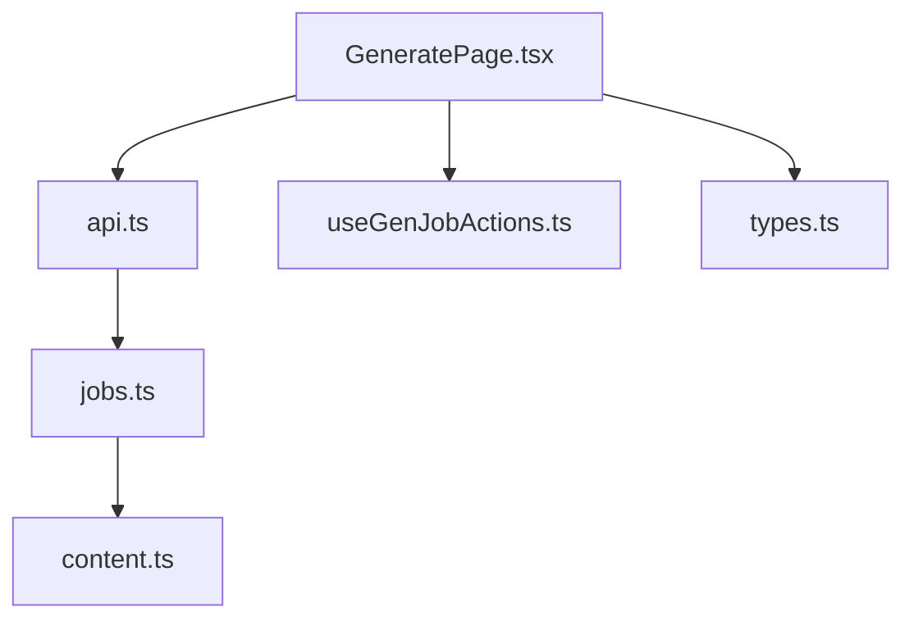
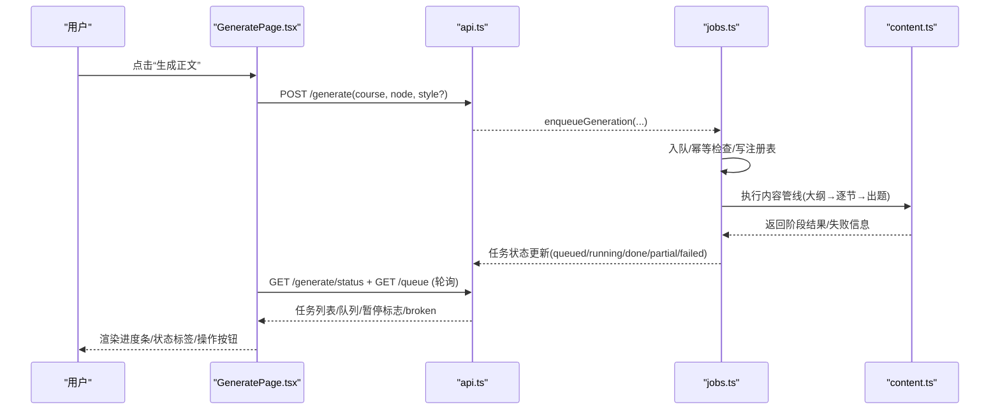
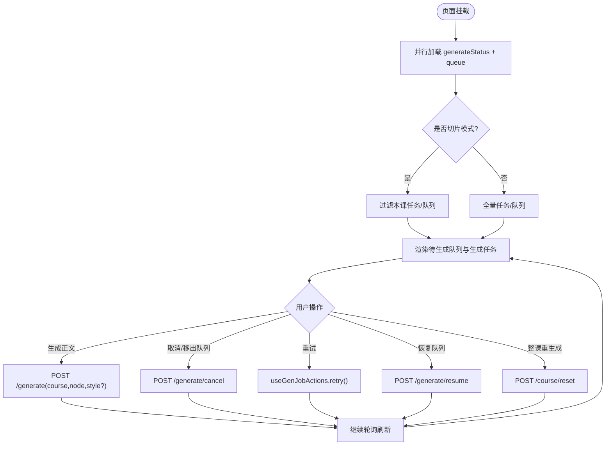
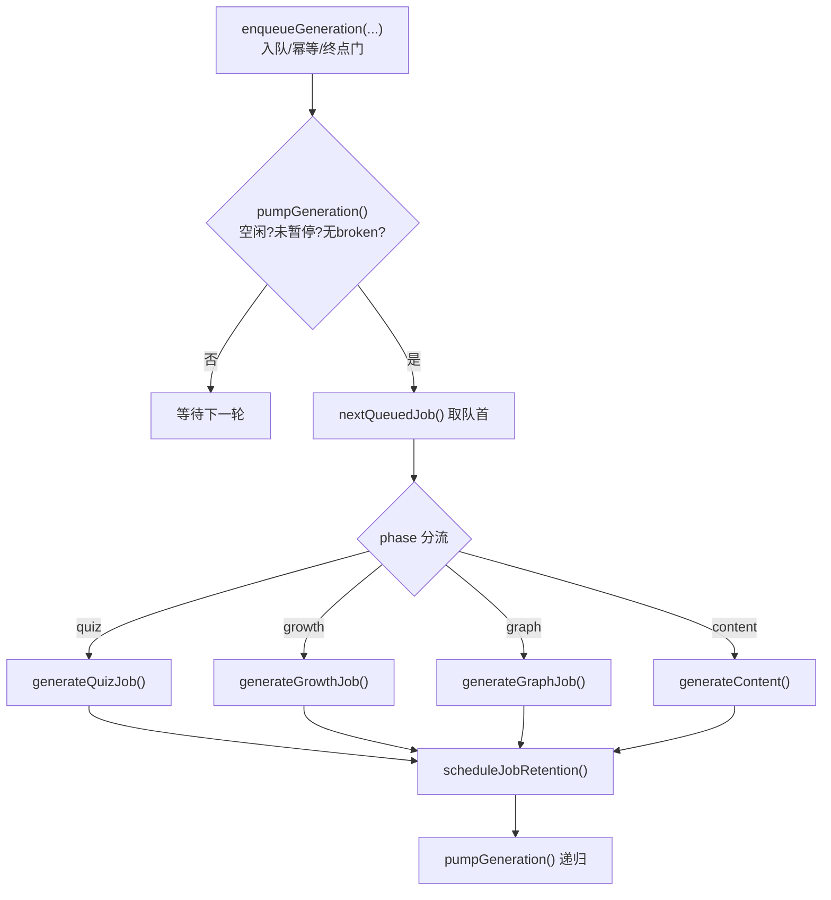
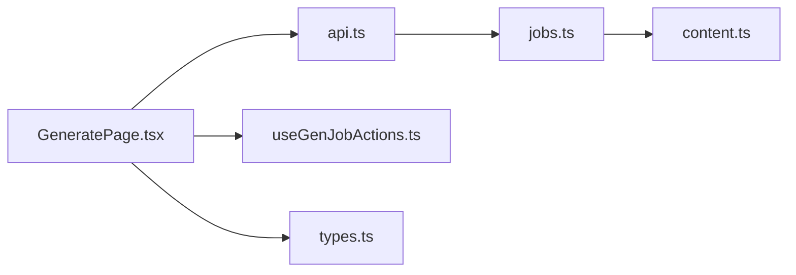

# 内容生成页面（GeneratePage）

<cite>
**本文引用的文件**
- [GeneratePage.tsx](file://ui/src/pages/GeneratePage.tsx)
- [useGenJobActions.ts](file://ui/src/hooks/useGenJobActions.ts)
- [types.ts](file://ui/src/types.ts)
- [api.ts](file://ui/src/api.ts)
- [jobs.ts](file://src/host/jobs.ts)
- [content.ts](file://src/engine/content.ts)
</cite>

## 目录
1. [简介](#简介)
2. [项目结构](#项目结构)
3. [核心组件](#核心组件)
4. [架构总览](#架构总览)
5. [详细组件分析](#详细组件分析)
6. [依赖关系分析](#依赖关系分析)
7. [性能与并发特性](#性能与并发特性)
8. [故障排除指南](#故障排除指南)
9. [结论](#结论)
10. [附录：参数调优与质量控制](#附录参数调优与质量控制)

## 简介
本页面聚焦“内容生成页面”（GeneratePage），围绕其工作流、任务队列管理、生成进度监控与结果展示进行系统化说明。文档同时覆盖不同类型内容的生成配置、参数调优与质量控制机制，解释任务的优先级调度、并发控制与错误重试策略，并提供最佳实践、性能调优与故障排除建议，以及生成结果的预览、编辑与导出相关能力。

## 项目结构
GeneratePage 位于前端 UI 层，负责：
- 展示待生成队列（来自生成队列.md 的 agent 补内容与反馈自动入队）
- 展示进行中/近期生成任务（服务端任务注册表为事实源）
- 支持按课程切片视图或全局视图
- 提供风格选择、整课重生成、取消/重试、恢复队列等操作
- 通过轮询刷新任务状态与队列

后端由宿主 jobs.ts 维护全局串行队列与任务注册表，引擎 content.ts 提供上下文包、大纲与节生成、门禁修复等能力。

图表来源
- [GeneratePage.tsx:1-270](file://ui/src/pages/GeneratePage.tsx#L1-L270)
- [api.ts:108-210](file://ui/src/api.ts#L108-L210)
- [jobs.ts:292-740](file://src/host/jobs.ts#L292-L740)
- [content.ts:141-200](file://src/engine/content.ts#L141-L200)

章节来源
- [GeneratePage.tsx:1-270](file://ui/src/pages/GeneratePage.tsx#L1-L270)
- [api.ts:108-210](file://ui/src/api.ts#L108-L210)
- [jobs.ts:292-740](file://src/host/jobs.ts#L292-L740)
- [content.ts:141-200](file://src/engine/content.ts#L141-L200)

## 核心组件
- GeneratePage：页面主入口，聚合队列与任务视图，驱动生成、取消、重试、恢复、整课重生成等交互。
- useGenJobActions：统一的任务动作封装（重试、恢复队列），复用失败重试三路由（生长批/出题/内容断点续跑）。
- api：HTTP 客户端，映射到 /generate、/queue、/prompts、/course/reset 等接口。
- jobs：宿主侧生成队列与任务注册表，执行泵、入队/出队、终态保留与清扫、重启恢复、broken 态保护。
- content：引擎侧内容管线（上下文包、大纲、逐节正文、门禁修复、拆节、出题收尾）。

章节来源
- [GeneratePage.tsx:1-270](file://ui/src/pages/GeneratePage.tsx#L1-L270)
- [useGenJobActions.ts:1-64](file://ui/src/hooks/useGenJobActions.ts#L1-L64)
- [api.ts:108-210](file://ui/src/api.ts#L108-L210)
- [jobs.ts:292-740](file://src/host/jobs.ts#L292-L740)
- [content.ts:141-200](file://src/engine/content.ts#L141-L200)

## 架构总览
GeneratePage 通过轮询获取任务注册表与队列数据；用户操作经 api 调用宿主接口，进入全局串行队列执行泵；内容生成由引擎完成，最终落盘并更新注册表；页面实时渲染进度与状态。

图表来源
- [GeneratePage.tsx:75-109](file://ui/src/pages/GeneratePage.tsx#L75-L109)
- [api.ts:108-210](file://ui/src/api.ts#L108-L210)
- [jobs.ts:292-740](file://src/host/jobs.ts#L292-L740)
- [jobs.ts:791-986](file://src/host/jobs.ts#L791-L986)

## 详细组件分析

### GeneratePage 工作流与界面
- 双形态：不带 course 的全局面；带 course 的本课切片（仅过滤显示，不裁剪账面）。
- 待生成队列：来自生成队列.md（agent 补内容/反馈自动入队），可一键生成正文，生成后落盘 Obsidian 并勾掉条目。
- 生成任务：从服务端注册表拉取，排序优先 running/cancelling > queued > 其他，显示 phase、进度、消息、操作。
- 风格选择：加载 prompts 中“课程节生成”及“课程节生成-<style>”，用于替换节模板。
- 整课重生成：删除旧正文/题目/交互件/图片（备份至 .trash），按拓扑序串行重新生成，进度在本页可见。
- 轮询：5s 间隔，非激活页签跳过，切回即补；切片形态使用特定 tab 门控。

图表来源
- [GeneratePage.tsx:75-109](file://ui/src/pages/GeneratePage.tsx#L75-L109)
- [GeneratePage.tsx:133-144](file://ui/src/pages/GeneratePage.tsx#L133-L144)
- [GeneratePage.tsx:182-266](file://ui/src/pages/GeneratePage.tsx#L182-L266)
- [api.ts:108-210](file://ui/src/api.ts#L108-L210)

章节来源
- [GeneratePage.tsx:1-270](file://ui/src/pages/GeneratePage.tsx#L1-L270)

### 任务队列管理与执行泵
- 全局串行队列：同一时刻只执行一个节点管线，FIFO 顺序，入队即返回。
- 入队幂等：重复入队提示已在队列中；同节点 running/cancelling 拒绝。
- 终点恒拒：锚定的终点不被学习调度，生成门恒拒，避免误生成。
- 执行泵：空闲且未暂停时取队首执行；phase=quiz/growth/图域任务分流；完成后继续泵下一个。
- 终态保留期：失败/取消/部分完成留 24h 供排查与重试，成功留 30 分钟；之后清出注册表。
- 清扫：课程删除/节点删改导致悬空记录清理；broken 态下写回闸拒绝落盘。
- 重启恢复：进程重启后 running/cancelling 标失败；queued 置暂停，需用户一键恢复。

图表来源
- [jobs.ts:292-350](file://src/host/jobs.ts#L292-L350)
- [jobs.ts:690-740](file://src/host/jobs.ts#L690-L740)
- [jobs.ts:742-789](file://src/host/jobs.ts#L742-L789)
- [jobs.ts:791-986](file://src/host/jobs.ts#L791-L986)

章节来源
- [jobs.ts:292-740](file://src/host/jobs.ts#L292-L740)
- [jobs.ts:742-986](file://src/host/jobs.ts#L742-L986)

### 生成进度监控与结果展示
- 进度字段：progress.done/total/current，running 时实时更新；phase 标签（seed/growth/compass/decompile/plan/milestone/quiz/sections/outline）。
- 状态标签：queued/running/cancelling/done/partial/failed/cancelled。
- 消息字段：包含先验检索、第二意见抽样、多样性指标、失败原因等。
- 失败处理：失败/部分完成可重试；失败详情含语料引用，便于定位。
- 切片视图：仅显示本课任务，但全局暂停/恢复语义不变。

章节来源
- [GeneratePage.tsx:19-27](file://ui/src/pages/GeneratePage.tsx#L19-L27)
- [GeneratePage.tsx:214-264](file://ui/src/pages/GeneratePage.tsx#L214-L264)
- [jobs.ts:1077-1101](file://src/host/jobs.ts#L1077-L1101)

### 不同类型内容的生成配置
- 内容正文：大纲 → 逐节正文（每节一次模型调用）→ 逐节出题 + 综合题。
- 纯出题：phase=quiz，定向补节/指令/题量随任务携带，走全局队列。
- 生长批：教练回合裁决 → kind=edit 提案 → 罗盘随批写入单元重写。
- 图域任务：seed/compass/decompile/plan/milestone，产物走提案人审通道。
- 风格变体：节模板支持“课程节生成-<style>”，style 仅替换节模板。

章节来源
- [jobs.ts:791-986](file://src/host/jobs.ts#L791-L986)
- [jobs.ts:546-638](file://src/host/jobs.ts#L546-L638)
- [jobs.ts:640-688](file://src/host/jobs.ts#L640-L688)
- [GeneratePage.tsx:99-105](file://ui/src/pages/GeneratePage.tsx#L99-L105)

### 参数调优与质量控制
- 档位（effort）：高复杂度节点使用 deep 档，否则 fast；大纲/正文/出题均显式声明 effort。
- 门禁修复：块级局部修补 → 整节压缩修复一轮（deep 档）→ 溢出则尝试大纲拆节。
- 多样性与第二意见：题库累计范围测量多样性指标；第二意见抽样率可配置。
- 先验检索审计：零命中/截断/命中清单随任务消息带出，提升可观测性。
- 质量审计：失败路径标注语料站与 outcome，便于回溯与训练。

章节来源
- [jobs.ts:169-248](file://src/host/jobs.ts#L169-L248)
- [jobs.ts:831-930](file://src/host/jobs.ts#L831-L930)
- [jobs.ts:959-986](file://src/host/jobs.ts#L959-L986)
- [content.ts:141-200](file://src/engine/content.ts#L141-L200)

### 错误重试策略
- 失败/部分完成：支持重试，语义在服务端区分（growth 重新裁决；quiz 重新入队；内容断点续跑）。
- 取消：排队任务直接移出；运行中标 cancelling，下次检查点中止。
- 恢复队列：重启后遗留排队任务不自动开跑，需用户一键恢复（影响整条全局队列）。
- broken 态：任务档损坏时写回闸拒绝一切落盘，生成页显式报错与修复指引。

章节来源
- [useGenJobActions.ts:26-63](file://ui/src/hooks/useGenJobActions.ts#L26-L63)
- [jobs.ts:1103-1124](file://src/host/jobs.ts#L1103-L1124)
- [jobs.ts:1127-1219](file://src/host/jobs.ts#L1127-L1219)

### 预览、编辑与导出
- 预览：生成完成后正文落盘 Obsidian，可在对应课程/节点查看；失败时可“与 AI 讨论”发起新会话。
- 编辑：单节重写入口（/generate/section）支持定点重写本节，不走大纲结构变更。
- 导出：Anki 导出/导入（/anki/export、/anki/import）；题库清理（/bank-cleanup/apply）；问题归档/更新/新增等。

章节来源
- [GeneratePage.tsx:257-260](file://ui/src/pages/GeneratePage.tsx#L257-L260)
- [api.ts:167-174](file://ui/src/api.ts#L167-L174)
- [api.ts:185-192](file://ui/src/api.ts#L185-L192)
- [api.ts:231-239](file://ui/src/api.ts#L231-L239)

## 依赖关系分析
- 前端依赖：GeneratePage 依赖 api、useGenJobActions、types；轮询与状态同步。
- 宿主依赖：jobs 依赖 engine content、agent、corpus、runtime；维护队列、执行泵、恢复与清扫。
- 引擎依赖：content 提供上下文包、大纲、节生成、门禁修复、拆节、出题收尾等。

图表来源
- [GeneratePage.tsx:1-270](file://ui/src/pages/GeneratePage.tsx#L1-L270)
- [api.ts:108-210](file://ui/src/api.ts#L108-L210)
- [jobs.ts:292-740](file://src/host/jobs.ts#L292-L740)
- [content.ts:141-200](file://src/engine/content.ts#L141-L200)

章节来源
- [GeneratePage.tsx:1-270](file://ui/src/pages/GeneratePage.tsx#L1-L270)
- [api.ts:108-210](file://ui/src/api.ts#L108-L210)
- [jobs.ts:292-740](file://src/host/jobs.ts#L292-L740)
- [content.ts:141-200](file://src/engine/content.ts#L141-L200)

## 性能与并发特性
- 并发控制：全局串行队列，同一时刻仅一个节点管线执行，避免资源竞争与写冲突。
- 轮询优化：5s 间隔，非激活页签跳过，减少无效请求；切片模式使用独立 tab 门控。
- 批量与节流：生长批自动触发有阻尼；会话开始检查点节流 30 分钟；复诊结算在队列空闲时执行。
- 成本闸：综合题生成受 quizCount 限制；两路出题显式 effort，日志留痕供对照。
- I/O 安全：broken 态写回闸拒绝落盘，防止坏档覆盖；终态保留期定时清理，降低注册表膨胀。

章节来源
- [jobs.ts:528-544](file://src/host/jobs.ts#L528-L544)
- [jobs.ts:690-740](file://src/host/jobs.ts#L690-L740)
- [jobs.ts:959-986](file://src/host/jobs.ts#L959-L986)
- [jobs.ts:1127-1219](file://src/host/jobs.ts#L1127-L1219)

## 故障排除指南
- 任务档损坏（broken 态）：生成页显式报错与修复指引；写回闸拒绝一切落盘；需修复任务档后重启宿主。
- 队列暂停：进程重启后排队任务不自动开跑，需点击“恢复队列”。
- 终点被拒绝：生成门恒拒，提示“终点是方向标记，不被学习调度”；需调整图结构或目标节点。
- 失败重试：失败/部分完成可重试；失败详情含语料引用，定位最近捕获样本。
- 超时等待：waitForGenJob 默认 15 分钟超时，适合工具同步场景；面板以轮询为主。

章节来源
- [jobs.ts:271-286](file://src/host/jobs.ts#L271-L286)
- [jobs.ts:1116-1124](file://src/host/jobs.ts#L1116-L1124)
- [jobs.ts:353-376](file://src/host/jobs.ts#L353-L376)
- [jobs.ts:1127-1219](file://src/host/jobs.ts#L1127-L1219)

## 结论
GeneratePage 将“待生成队列”和“生成任务”统一呈现，配合宿主全局串行队列与引擎内容管线，实现了稳定、可观测、可恢复的内容生成流程。通过档位控制、门禁修复、多样性与第二意见、先验检索审计等手段，保障生成质量；通过 broken 态保护、终态保留期、清扫与恢复机制，提升系统鲁棒性。结合预览、编辑与导出能力，形成完整的内容生产闭环。

## 附录：参数调优与质量控制
- 档位策略：高复杂度节点使用 deep 档；大纲/正文/出题均显式声明 effort，日志留痕。
- 门禁修复：块级局部修补 → 整节压缩修复 → 溢出拆节；失败路径标注语料站与 outcome。
- 多样性与第二意见：题库累计范围测量多样性指标；第二意见抽样率可配置，失败路径标注。
- 先验检索审计：零命中/截断/命中清单随任务消息带出，提升可观测性与可诊断性。
- 成本控制：综合题生成受 quizCount 限制；两路出题 effort 一致口径，避免过度消耗。
- 最佳实践：
  - 优先使用“课程节生成-<style>”微调风格，避免改变大纲结构。
  - 对失败任务优先“重试续跑”，必要时“与 AI 讨论”定位问题。
  - 整课重生成前确认备份已生效（.trash），避免误删风险。
  - 队列暂停期间不要频繁入队，避免阻塞恢复后的批量执行。

章节来源
- [jobs.ts:169-248](file://src/host/jobs.ts#L169-L248)
- [jobs.ts:831-930](file://src/host/jobs.ts#L831-L930)
- [jobs.ts:959-986](file://src/host/jobs.ts#L959-L986)
- [GeneratePage.tsx:99-105](file://ui/src/pages/GeneratePage.tsx#L99-L105)
- [GeneratePage.tsx:182-266](file://ui/src/pages/GeneratePage.tsx#L182-L266)