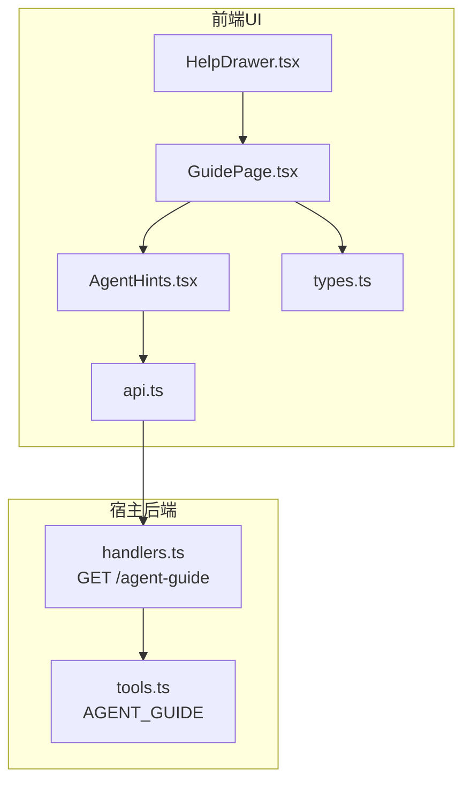
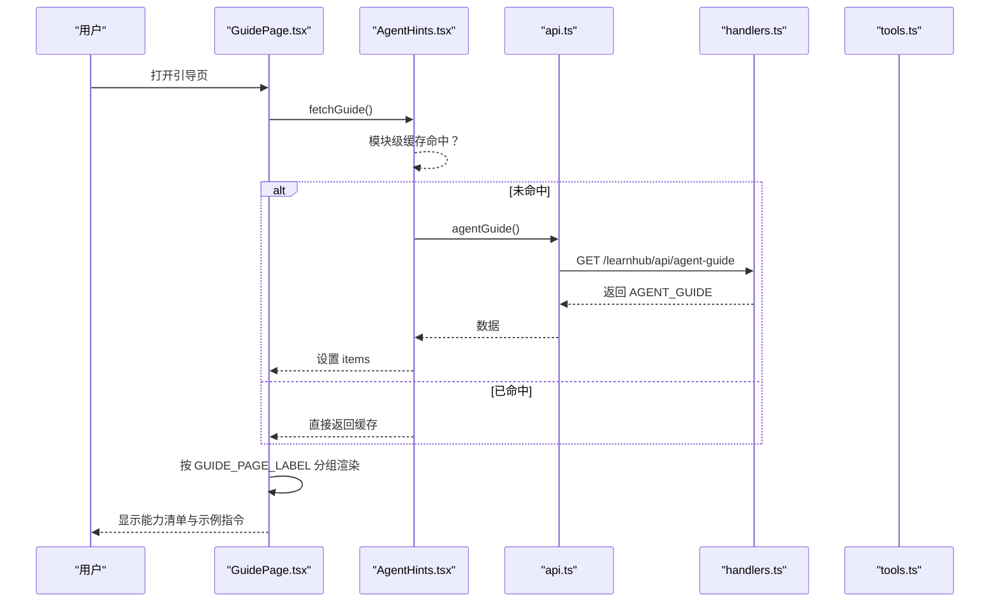
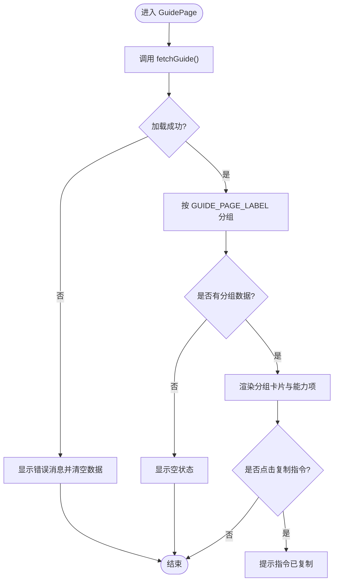
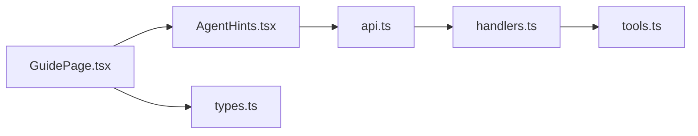

# 引导页面（GuidePage）

<cite>
**本文引用的文件**
- [ui/src/pages/GuidePage.tsx](file://ui/src/pages/GuidePage.tsx)
- [ui/src/components/AgentHints.tsx](file://ui/src/components/AgentHints.tsx)
- [ui/src/types.ts](file://ui/src/types.ts)
- [ui/src/api.ts](file://ui/src/api.ts)
- [src/host/tools.ts](file://src/host/tools.ts)
- [src/host/handlers.ts](file://src/host/handlers.ts)
- [ui/src/components/HelpDrawer.tsx](file://ui/src/components/HelpDrawer.tsx)
</cite>

## 目录
1. [简介](#简介)
2. [项目结构](#项目结构)
3. [核心组件](#核心组件)
4. [架构总览](#架构总览)
5. [详细组件分析](#详细组件分析)
6. [依赖关系分析](#依赖关系分析)
7. [性能与可扩展性](#性能与可扩展性)
8. [故障排查指南](#故障排查指南)
9. [结论](#结论)
10. [附录：自定义与扩展](#附录自定义与扩展)

## 简介
本文件面向“能力指南”引导页面 GuidePage，说明其用户引导流程、功能介绍与新手教程路径；解释引导内容的结构化组织、交互式学习路径与进度跟踪机制；并给出如何自定义引导内容、新增引导步骤、配置引导规则的方法，以及扩展方式与主题定制建议。同时提供用户体验优化与可访问性支持建议。

GuidePage 是一个“能力清单式”的引导页：它从宿主提供的单一事实源 AGENT_GUIDE 拉取“只能通过与 agent 对话实现的能力”，按页面维度分组展示，并为每条能力附带可直接复制到 dsh 会话执行的示例指令，帮助学习者快速上手。

## 项目结构
GuidePage 位于前端 UI 层，数据来源于宿主 API，并通过统一的类型定义约束前后端契约。关键文件职责如下：
- ui/src/pages/GuidePage.tsx：引导页主视图，负责加载、分组与渲染能力清单。
- ui/src/components/AgentHints.tsx：能力提示块与模块级缓存，提供 GUIDE_PAGE_LABEL 映射与 fetchGuide。
- ui/src/types.ts：AgentGuideItem 等类型定义，确保前后端数据结构一致。
- ui/src/api.ts：agentGuide 客户端方法，封装 GET /learnhub/api/agent-guide。
- src/host/tools.ts：AGENT_GUIDE 常量（单一事实源），维护所有能力条目及其归属页面、文案与示例指令。
- src/host/handlers.ts：路由处理 GET /agent-guide，直接返回 AGENT_GUIDE。
- ui/src/components/HelpDrawer.tsx：将 GuidePage 作为抽屉复用，便于在顶栏入口打开。

图表来源
- [ui/src/pages/GuidePage.tsx:13-24](file://ui/src/pages/GuidePage.tsx#L13-L24)
- [ui/src/components/AgentHints.tsx:17-24](file://ui/src/components/AgentHints.tsx#L17-L24)
- [ui/src/api.ts:193-194](file://ui/src/api.ts#L193-L194)
- [src/host/handlers.ts:251-253](file://src/host/handlers.ts#L251-L253)
- [src/host/tools.ts:25-69](file://src/host/tools.ts#L25-L69)

章节来源
- [ui/src/pages/GuidePage.tsx:1-78](file://ui/src/pages/GuidePage.tsx#L1-L78)
- [ui/src/components/AgentHints.tsx:1-57](file://ui/src/components/AgentHints.tsx#L1-L57)
- [ui/src/types.ts:29-30](file://ui/src/types.ts#L29-L30)
- [ui/src/api.ts:193-194](file://ui/src/api.ts#L193-L194)
- [src/host/tools.ts:25-69](file://src/host/tools.ts#L25-L69)
- [src/host/handlers.ts:251-253](file://src/host/handlers.ts#L251-L253)
- [ui/src/components/HelpDrawer.tsx:1-14](file://ui/src/components/HelpDrawer.tsx#L1-L14)

## 核心组件
- GuidePage：页面入口，发起一次请求获取全部能力项，按页面标签分组后渲染卡片列表；包含错误提示、空状态与加载态。
- AgentHints：提供模块级缓存的 fetchGuide，避免重复请求；同时提供页面键到展示名的映射 GUIDE_PAGE_LABEL，并在各页面内以折叠面板形式展示“这些事可以找 agent 做”。
- types.ts：定义 AgentGuideItem{tool, page, text, prompt?}，保证前后端一致性。
- api.ts：暴露 agentGuide() 调用 GET /learnhub/api/agent-guide。
- tools.ts：维护 AGENT_GUIDE 常量，是能力的唯一事实源，包含工具名、所属页面、说明文案与可选示例指令。
- handlers.ts：路由 GET /agent-guide 直接返回 AGENT_GUIDE，不触达引擎，响应稳定且轻量。
- HelpDrawer：将 GuidePage 嵌入抽屉，作为顶栏“？”入口的低频参考。

章节来源
- [ui/src/pages/GuidePage.tsx:13-78](file://ui/src/pages/GuidePage.tsx#L13-L78)
- [ui/src/components/AgentHints.tsx:11-57](file://ui/src/components/AgentHints.tsx#L11-L57)
- [ui/src/types.ts:29-30](file://ui/src/types.ts#L29-L30)
- [ui/src/api.ts:193-194](file://ui/src/api.ts#L193-L194)
- [src/host/tools.ts:25-69](file://src/host/tools.ts#L25-L69)
- [src/host/handlers.ts:251-253](file://src/host/handlers.ts#L251-L253)
- [ui/src/components/HelpDrawer.tsx:1-14](file://ui/src/components/HelpDrawer.tsx#L1-L14)

## 架构总览
引导页的数据流遵循“前端请求 → 宿主路由 → 常量数据返回”的简洁路径，确保低延迟与高稳定性。

图表来源
- [ui/src/pages/GuidePage.tsx:15-23](file://ui/src/pages/GuidePage.tsx#L15-L23)
- [ui/src/components/AgentHints.tsx:17-24](file://ui/src/components/AgentHints.tsx#L17-L24)
- [ui/src/api.ts:193-194](file://ui/src/api.ts#L193-L194)
- [src/host/handlers.ts:251-253](file://src/host/handlers.ts#L251-L253)
- [src/host/tools.ts:25-69](file://src/host/tools.ts#L25-L69)

## 详细组件分析

### GuidePage 组件
- 生命周期与状态：组件挂载时调用 fetchGuide，成功后设置 items；失败时通过 Message.error 展示错误信息，并将 items 置为空数组以触发空状态。
- 分组逻辑：使用 GUIDE_PAGE_LABEL 对 items 按 page 字段分组，仅保留有数据的分组。
- 交互细节：每条能力展示工具名 Tag、说明文本；若存在 prompt，则提供可复制的示例指令，复制成功会弹出成功提示。
- 底部说明：提供“怎么跟 agent 协作”的三段式说明，包括自然语言需求、变更确认通道、模型查看与切换位置。

图表来源
- [ui/src/pages/GuidePage.tsx:15-23](file://ui/src/pages/GuidePage.tsx#L15-L23)
- [ui/src/pages/GuidePage.tsx:42-56](file://ui/src/pages/GuidePage.tsx#L42-L56)

章节来源
- [ui/src/pages/GuidePage.tsx:13-78](file://ui/src/pages/GuidePage.tsx#L13-L78)

### AgentHints 与类型
- 模块级缓存：fetchGuide 首次请求后将结果缓存于模块变量，后续调用直接返回，减少网络开销。
- 页面映射：GUIDE_PAGE_LABEL 定义了页面键与展示名，需与宿主侧 page 词表保持一致。
- 类型约束：AgentGuideItem 限定 tool/page/text/prompt?，确保数据完整性与可渲染性。

章节来源
- [ui/src/components/AgentHints.tsx:11-57](file://ui/src/components/AgentHints.tsx#L11-L57)
- [ui/src/types.ts:29-30](file://ui/src/types.ts#L29-L30)

### 宿主端数据源与路由
- 单一事实源：AGENT_GUIDE 在 tools.ts 中集中维护，包含工具名、页面、说明与示例指令。
- 路由处理：handlers.ts 的 GET /agent-guide 直接返回该常量，不经过引擎，保证响应稳定。
- 测试保障：测试用例校验条目数量、page 取值范围、tool 与命令通道的一致性，防止漂移。

章节来源
- [src/host/tools.ts:25-69](file://src/host/tools.ts#L25-L69)
- [src/host/handlers.ts:251-253](file://src/host/handlers.ts#L251-L253)

### 帮助抽屉复用
- HelpDrawer 将 GuidePage 作为抽屉内容复用，标题为“能力指南”，宽度自适应，适合低频参考场景。

章节来源
- [ui/src/components/HelpDrawer.tsx:1-14](file://ui/src/components/HelpDrawer.tsx#L1-L14)

## 依赖关系分析
- 前端依赖：GuidePage 依赖 AgentHints 的 fetchGuide 与 GUIDE_PAGE_LABEL；AgentHints 依赖 api.agentGuide；两者共同依赖 types.ts 中的 AgentGuideItem。
- 后端依赖：handlers.ts 依赖 tools.ts 的 AGENT_GUIDE；路由直接返回常量。
- 外部库：使用 @arco-design/web-react 的 Card、Tag、Message、Spin、Typography、Collapse 等组件进行布局与交互。

图表来源
- [ui/src/pages/GuidePage.tsx:13-24](file://ui/src/pages/GuidePage.tsx#L13-L24)
- [ui/src/components/AgentHints.tsx:17-24](file://ui/src/components/AgentHints.tsx#L17-L24)
- [ui/src/api.ts:193-194](file://ui/src/api.ts#L193-L194)
- [src/host/handlers.ts:251-253](file://src/host/handlers.ts#L251-L253)
- [src/host/tools.ts:25-69](file://src/host/tools.ts#L25-L69)
- [ui/src/types.ts:29-30](file://ui/src/types.ts#L29-L30)

章节来源
- [ui/src/pages/GuidePage.tsx:13-24](file://ui/src/pages/GuidePage.tsx#L13-L24)
- [ui/src/components/AgentHints.tsx:17-24](file://ui/src/components/AgentHints.tsx#L17-L24)
- [ui/src/api.ts:193-194](file://ui/src/api.ts#L193-L194)
- [src/host/handlers.ts:251-253](file://src/host/handlers.ts#L251-L253)
- [src/host/tools.ts:25-69](file://src/host/tools.ts#L25-L69)
- [ui/src/types.ts:29-30](file://ui/src/types.ts#L29-L30)

## 性能与可扩展性
- 性能特性
  - 模块级缓存：AgentHints.fetchGuide 缓存一次请求结果，GuidePage 与各页面提示共享，避免重复网络请求。
  - 轻量响应：/agent-guide 直接返回常量，无引擎调用，首屏加载快。
  - 分组渲染：按 GUIDE_PAGE_LABEL 分组，仅渲染有数据的分组，减少无效 DOM。
- 可扩展性
  - 新增能力：在 tools.ts 的 AGENT_GUIDE 中添加一条 {tool, page, text, prompt?} 即可生效，无需改动前端。
  - 新增页面分组：在 AgentHints.tsx 的 GUIDE_PAGE_LABEL 增加新键值，并确保与宿主侧 page 词表一致。
  - 复用能力：HelpDrawer 已复用 GuidePage，可在其他容器（如弹窗、抽屉）中再次复用。

[本节为通用指导，不直接分析具体文件]

## 故障排查指南
- 加载失败
  - 现象：页面显示错误消息并呈现空状态。
  - 原因：fetchGuide 抛出异常或 HTTP 非 2xx。
  - 处理：检查 /learnhub/api/agent-guide 可达性与响应体；确认宿主路由与 AGENT_GUIDE 是否存在。
- 内容为空
  - 现象：显示“指南清单为空”。
  - 原因：AGENT_GUIDE 为空或未返回任何条目。
  - 处理：检查 tools.ts 中 AGENT_GUIDE 是否被误删或过滤；确认 page 值是否在 GUIDE_PAGE_LABEL 中。
- 指令复制无效
  - 现象：点击复制无反馈或失败。
  - 原因：浏览器剪贴板权限限制或环境不支持。
  - 处理：在受信任域内操作；必要时提示用户手动复制。

章节来源
- [ui/src/pages/GuidePage.tsx:15-20](file://ui/src/pages/GuidePage.tsx#L15-L20)
- [ui/src/pages/GuidePage.tsx:34-38](file://ui/src/pages/GuidePage.tsx#L34-L38)
- [ui/src/components/AgentHints.tsx:17-24](file://ui/src/components/AgentHints.tsx#L17-L24)
- [src/host/handlers.ts:251-253](file://src/host/handlers.ts#L251-L253)
- [src/host/tools.ts:25-69](file://src/host/tools.ts#L25-L69)

## 结论
GuidePage 以“能力清单 + 示例指令”的方式，为学习者提供了清晰、可操作的入门路径。其设计强调单一事实源、模块级缓存与轻量响应，既保证了性能，又便于扩展与维护。通过 AGENT_GUIDE 的集中管理，新增能力与页面分组成本低，且与宿主路由解耦，易于长期演进。

[本节为总结性内容，不直接分析具体文件]

## 附录：自定义与扩展

### 自定义引导内容
- 编辑单一事实源：在 tools.ts 的 AGENT_GUIDE 中添加或修改条目，字段包括 tool、page、text、prompt。
- 同步页面映射：如需新增页面分组，请在 AgentHints.tsx 的 GUIDE_PAGE_LABEL 中增加对应键值，并确保与宿主侧 page 词表一致。
- 验证：运行相关测试，确保 tool 与命令通道一致、page 合法、文案与 prompt 不为空。

章节来源
- [src/host/tools.ts:25-69](file://src/host/tools.ts#L25-L69)
- [ui/src/components/AgentHints.tsx:11-15](file://ui/src/components/AgentHints.tsx#L11-L15)

### 添加新的引导步骤
- 步骤即条目：每个 AGENT_GUIDE 条目即为一个“引导步骤”，包含工具名、说明与示例指令。
- 归属页面：通过 page 字段决定该步骤出现在哪个分组下。
- 示例指令：prompt 字段用于在 dsh 会话中一键粘贴执行，提升上手效率。

章节来源
- [src/host/tools.ts:25-69](file://src/host/tools.ts#L25-L69)
- [ui/src/pages/GuidePage.tsx:42-56](file://ui/src/pages/GuidePage.tsx#L42-L56)

### 配置引导规则
- 页面词表：GUIDE_PAGE_LABEL 控制分组展示顺序与名称，需与宿主侧保持一致。
- 路由契约：/agent-guide 始终返回 AGENT_GUIDE，不随引擎状态变化，确保稳定。
- 类型约束：AgentGuideItem 强制要求 tool、page、text 存在，prompt 可选，保障渲染安全。

章节来源
- [ui/src/components/AgentHints.tsx:11-15](file://ui/src/components/AgentHints.tsx#L11-L15)
- [src/host/handlers.ts:251-253](file://src/host/handlers.ts#L251-L253)
- [ui/src/types.ts:29-30](file://ui/src/types.ts#L29-L30)

### 扩展方法与主题定制
- 复用组件：HelpDrawer 已将 GuidePage 作为抽屉内容复用，可在任意容器（弹窗、抽屉、侧边栏）中再次使用。
- 样式定制：基于 @arco-design/web-react 的 Card、Tag、Typography 等组件，可通过全局 CSS 类名（如 lh-*）调整间距、字号与颜色。
- 交互增强：可结合 Message 提示、Spin 加载、Empty 空状态，提升反馈体验。

章节来源
- [ui/src/components/HelpDrawer.tsx:1-14](file://ui/src/components/HelpDrawer.tsx#L1-L14)
- [ui/src/pages/GuidePage.tsx:24-75](file://ui/src/pages/GuidePage.tsx#L24-L75)

### 用户体验优化建议
- 首屏速度：利用模块级缓存减少重复请求；保持 /agent-guide 响应轻量。
- 可读性：分组标题清晰，每条能力附工具名与说明；示例指令可一键复制。
- 容错性：加载失败时明确提示；空数据时友好提示；复制失败时给出指引。
- 可访问性：为可复制文本提供明确的复制按钮与成功提示；确保键盘可达与屏幕阅读器友好。

[本节为通用指导，不直接分析具体文件]