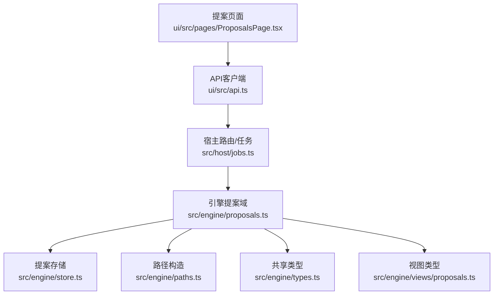
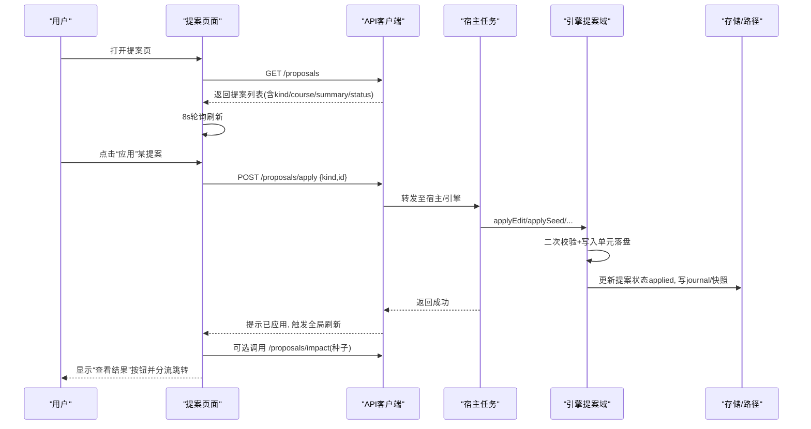
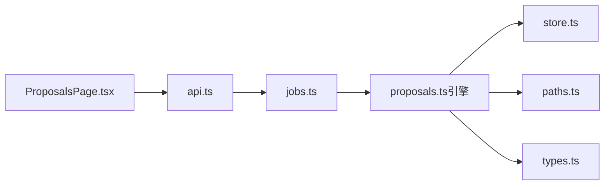
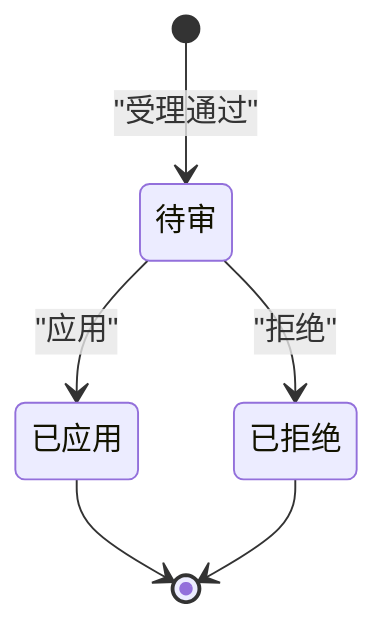
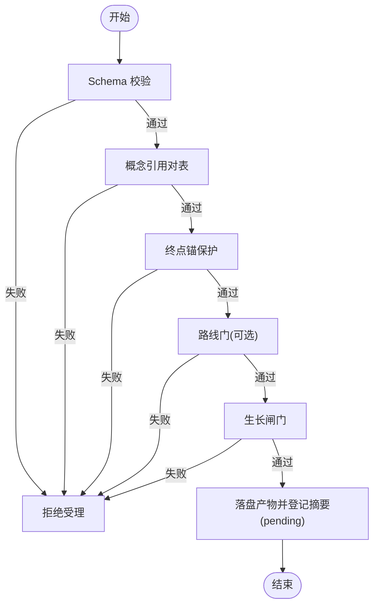

# 提案页面 (ProposalsPage)

<cite>
**本文引用的文件**
- [ProposalsPage.tsx](file://ui/src/pages/ProposalsPage.tsx)
- [api.ts](file://ui/src/api.ts)
- [proposals.ts（引擎）](file://src/engine/proposals.ts)
- [proposals.ts（视图类型）](file://src/engine/views/proposals.ts)
- [types.ts（引擎共享类型）](file://src/engine/types.ts)
- [store.ts](file://src/engine/store.ts)
- [paths.ts](file://src/engine/paths.ts)
- [jobs.ts（宿主任务）](file://src/host/jobs.ts)
- [项目命令.ts](file://src/commands/项目.ts)
</cite>

## 目录
1. [简介](#简介)
2. [项目结构](#项目结构)
3. [核心组件](#核心组件)
4. [架构总览](#架构总览)
5. [详细组件分析](#详细组件分析)
6. [依赖关系分析](#依赖关系分析)
7. [性能与可用性](#性能与可用性)
8. [故障排查指南](#故障排查指南)
9. [结论](#结论)
10. [附录：操作指南](#附录操作指南)

## 简介
本文件面向“提案页面”的完整使用与实现说明，覆盖以下目标：
- 提案审批工作流、列表管理、人审界面与状态跟踪
- 提案生命周期、版本控制与回滚机制
- 提案与项目、计划、里程碑的关联关系
- 创建、编辑、审核、应用的完整操作指南
- 质量检查、冲突解决与批量操作能力

该页面是面板侧的人审入口：所有由 agent/教练回合/工具面产生的图变更、种子图、富化回填、项目计划与里程碑产物等，均汇聚为“待审提案”，经人工确认后应用或拒绝，并全留痕。

## 项目结构
- 前端页面：位于 ui/src/pages/ProposalsPage.tsx，负责展示提案列表、轮询刷新、应用/拒绝交互、结果跳转
- 前端 API：位于 ui/src/api.ts，封装 /learnhub/api/* 请求，提供 proposals、proposalApply、proposalReject、proposalImpact 等接口
- 引擎层：位于 src/engine/proposals.ts，实现提案受理、校验、应用、拒绝、影响预览、清单查询等核心逻辑
- 视图类型：位于 src/engine/views/proposals.ts，定义提案结果与影响预览的数据形状
- 共享类型：位于 src/engine/types.ts，定义提案 kind/status、生长算子、记录结构等
- 存储与路径：位于 src/engine/store.ts 与 paths.ts，负责提案元数据持久化与产物路径构造
- 宿主任务：位于 src/host/jobs.ts 与 src/commands/项目.ts，暴露项目计划/里程碑生成与提案通道

图表来源
- [ProposalsPage.tsx:1-202](file://ui/src/pages/ProposalsPage.tsx#L1-L202)
- [api.ts:223-229](file://ui/src/api.ts#L223-L229)
- [proposals.ts（引擎）:559-605](file://src/engine/proposals.ts#L559-L605)
- [store.ts:213-228](file://src/engine/store.ts#L213-L228)
- [paths.ts:124-140](file://src/engine/paths.ts#L124-L140)
- [types.ts:202-211](file://src/engine/types.ts#L202-L211)
- [proposals.ts（视图类型）:7-58](file://src/engine/views/proposals.ts#L7-L58)

章节来源
- [ProposalsPage.tsx:1-202](file://ui/src/pages/ProposalsPage.tsx#L1-L202)
- [api.ts:223-229](file://ui/src/api.ts#L223-L229)

## 核心组件
- 提案页面（UI）：展示提案列表、按课程切片过滤、8秒轮询、应用/拒绝弹窗、查看结果跳转
- 引擎提案域：受理 edit/seed/enrich/project_plan/project_milestone/experiment 提案；执行多道门禁；应用时写入单元落盘；支持拒绝联动
- 存储与路径：提案元数据 JSON 持久化；产物 YAML 落盘；路径含自增 id，避免空态窗口
- 视图类型：统一前后端对提案结果与影响预览的结构约定
- 宿主任务：项目计划/里程碑生成走任务化流程，产出提案进入人审队列

章节来源
- [ProposalsPage.tsx:71-202](file://ui/src/pages/ProposalsPage.tsx#L71-L202)
- [proposals.ts（引擎）:559-605](file://src/engine/proposals.ts#L559-L605)
- [store.ts:213-228](file://src/engine/store.ts#L213-L228)
- [proposals.ts（视图类型）:7-58](file://src/engine/views/proposals.ts#L7-L58)

## 架构总览
提案从产生到生效的全链路如下：
- 产生：agent/教练回合/工具面生成草案，经轻量门后以“提案”形式入队
- 受理：引擎进行 schema 校验、概念引用对表、终点锚保护、路线门、生长闸门等
- 待审：提案产物 YAML 与元数据落盘，状态 pending，出现在面板列表
- 应用：引擎二次校验 + 写入单元顺序落盘（铸名→图区→锚维护→笔记→罗盘→边实验账本→快照→journal→标记 applied）
- 拒绝：状态置 rejected，决策时间/备注留痕；同源双提案可联动拒绝

图表来源
- [ProposalsPage.tsx:99-162](file://ui/src/pages/ProposalsPage.tsx#L99-L162)
- [api.ts:223-229](file://ui/src/api.ts#L223-L229)
- [proposals.ts（引擎）:686-764](file://src/engine/proposals.ts#L686-L764)
- [store.ts:213-228](file://src/engine/store.ts#L213-L228)

## 详细组件分析

### 提案页面（UI）
- 列表展示：表格列包含编号、类型标签、课程、摘要、状态、创建时间、操作
- 状态标签：pending=待审、applied=已应用、rejected=已拒绝
- 轮询：挂载即拉取，8秒周期；在工作台切片模式下仅拉取当前课程
- 应用流程：
  - 种子提案先获取影响预览（新建节点、现有锚保留、重名冲突提示、罗盘是否脚手架初建）
  - 确认弹窗显示摘要与影响信息
  - 成功后提示并刷新，记录最近一次应用的提案用于“查看结果”
- 拒绝流程：一键拒绝并留痕，刷新列表
- 结果跳转：根据提案类型分流到工作台图/题库、项目页、洞察页等

章节来源
- [ProposalsPage.tsx:18-69](file://ui/src/pages/ProposalsPage.tsx#L18-L69)
- [ProposalsPage.tsx:71-202](file://ui/src/pages/ProposalsPage.tsx#L71-L202)

### 引擎提案域（受理与应用）
- 受理 edit 提案：
  - schema 校验（字段、枚举、必填、键名统一、概念字段组）
  - 概念引用对表（登记表在册名或提案铸名块命中）
  - 终点锚保护（禁止直改锚定终点、禁以终点为 pre、主线批必声明朝向并接线）
  - 巩固门（operator=巩固 只引已教概念）
  - 生长闸门（插入积极性调速，超限拒收）
  - 罗盘重写预检（route 非空时校验内容）
  - 落盘产物 YAML 并登记摘要，状态 pending
- 应用 edit 提案：
  - 审计 ok 前置
  - 再次 schema 校验与概念对表复验
  - 模拟执行 ops 二次校验
  - 终点锚保护/巩固门/生长闸门复验
  - 写入单元顺序落盘：铸名→图区→终点锚 sealed 维护→笔记联动→罗盘批内重写→边实验账本→快照→journal(graph_edit)→标记 applied
- 拒绝提案：
  - 状态置 rejected，记录决策时间与备注
  - 若存在 pair（同源双提案），联动拒绝另一半（如计划+种子）

章节来源
- [proposals.ts（引擎）:126-341](file://src/engine/proposals.ts#L126-L341)
- [proposals.ts（引擎）:559-605](file://src/engine/proposals.ts#L559-L605)
- [proposals.ts（引擎）:686-764](file://src/engine/proposals.ts#L686-L764)
- [proposals.ts（引擎）:1574-1589](file://src/engine/proposals.ts#L1574-L1589)

### 种子提案影响预览
- 仅对 seed 提案开放
- 计算新建节点、与现图重名的节点、现有图节点总数、当前锚集合、罗盘是否缺席需脚手架初建
- 在应用确认弹窗中展示，帮助知情决策

章节来源
- [proposals.ts（引擎）:972-993](file://src/engine/proposals.ts#L972-L993)
- [proposals.ts（视图类型）:40-58](file://src/engine/views/proposals.ts#L40-L58)
- [ProposalsPage.tsx:18-46](file://ui/src/pages/ProposalsPage.tsx#L18-L46)

### 项目计划与里程碑（与提案的关系）
- 项目计划生成：通过宿主任务生成 YAML，提交为 project_plan 提案，等待人审；应用后旧计划被快照，不静默覆盖
- 里程碑产物生成：首生直落；已存在则自动转生成提案（project_milestone），应用后旧文快照
- 过点结算：milestone_settle 记录 XP 与定价锁定，重复过点拒绝

章节来源
- [jobs.ts（宿主任务）:1016-1033](file://src/host/jobs.ts#L1016-L1033)
- [项目命令.ts:254-341](file://src/commands/项目.ts#L254-L341)
- [tests/project-domain.test.ts:220-234](file://tests/project-domain.test.ts#L220-L234)

### 提案状态与种类
- 种类：edit、seed、enrich、project_plan、project_milestone、experiment
- 状态：pending、applied、rejected
- 记录：ProposalRec 包含 id、kind、course、status、summary、artifact、created、decided、decision_note、pair

章节来源
- [types.ts:202-211](file://src/engine/types.ts#L202-L211)
- [types.ts:243-259](file://src/engine/types.ts#L243-L259)

## 依赖关系分析
- 页面依赖 api.ts 提供的 proposals/apply/reject/impact 方法
- api.ts 通过 /learnhub/api/* 与宿主通信，最终交由引擎处理
- 引擎依赖 store.ts 读写提案元数据，依赖 paths.ts 构造产物路径
- 引擎依赖 types.ts 中的常量与类型约束
- 项目相关功能通过 jobs.ts 与 commands/项目.ts 接入提案通道

图表来源
- [ProposalsPage.tsx:71-202](file://ui/src/pages/ProposalsPage.tsx#L71-L202)
- [api.ts:223-229](file://ui/src/api.ts#L223-L229)
- [jobs.ts（宿主任务）:1016-1033](file://src/host/jobs.ts#L1016-L1033)
- [proposals.ts（引擎）:559-605](file://src/engine/proposals.ts#L559-L605)
- [store.ts:213-228](file://src/engine/store.ts#L213-L228)
- [paths.ts:124-140](file://src/engine/paths.ts#L124-L140)
- [types.ts:202-211](file://src/engine/types.ts#L202-L211)

章节来源
- [ProposalsPage.tsx:71-202](file://ui/src/pages/ProposalsPage.tsx#L71-L202)
- [api.ts:223-229](file://ui/src/api.ts#L223-L229)
- [jobs.ts（宿主任务）:1016-1033](file://src/host/jobs.ts#L1016-L1033)
- [proposals.ts（引擎）:559-605](file://src/engine/proposals.ts#L559-L605)
- [store.ts:213-228](file://src/engine/store.ts#L213-L228)
- [paths.ts:124-140](file://src/engine/paths.ts#L124-L140)
- [types.ts:202-211](file://src/engine/types.ts#L202-L211)

## 性能与可用性
- 列表轮询：默认 8 秒间隔，减少频繁请求；在非激活页签跳过取数，切回补拉
- 应用闭环：应用成功后触发全局刷新（课程树、推荐、统计等），无需强制跳转，支持连续处理
- 影响预览：种子提案应用前提供只读影响计算，提升决策效率
- 写入单元：应用过程采用顺序步骤，失败上抛中止，不回滚但 journal 未写，便于重试与排障

[本节为通用指导，不直接分析具体文件]

## 故障排查指南
- 受理失败（schema/概念/锚/路线/生长闸）：
  - 检查错误行定位到具体 op 或字段，修正后重提
  - 关注“终点锚保护”“主线批必接线”“巩固门”“生长闸门”等规则
- 应用失败（二次校验/概念对表/锚保护/路线门/生长闸）：
  - 可能因受理与 apply 之间图/锚变化导致“提案已不适用当前图”
  - 建议拒绝后重提
- 拒绝联动：
  - 同源双提案（如计划+种子）任一半拒绝将联动拒绝另一半
- 项目里程碑：
  - 已存在产物再生成会转提案；结构门未过会带错误码与修复轮
  - 过点重复入账会被拒绝（定价锁定）

章节来源
- [proposals.ts（引擎）:559-605](file://src/engine/proposals.ts#L559-L605)
- [proposals.ts（引擎）:686-764](file://src/engine/proposals.ts#L686-L764)
- [proposals.ts（引擎）:1574-1589](file://src/engine/proposals.ts#L1574-L1589)
- [jobs.ts（宿主任务）:1016-1033](file://src/host/jobs.ts#L1016-L1033)
- [项目命令.ts:254-341](file://src/commands/项目.ts#L254-L341)

## 结论
提案页面作为人审中枢，串联了 agent/教练回合/工具面的各类变更，通过严格的受理与应用门禁保障图结构与学习体验的稳定性。其设计强调：
- 全留痕：产物 YAML、journal、快照、决策备注
- 强一致：受理与 apply 双门校验、写入单元顺序落盘
- 可追溯：提案状态机、同源联动、影响预览
- 易用性：轮询刷新、影响预览、结果分流跳转

## 附录：操作指南

### 提案生命周期
- 产生 → 受理（schema/概念/锚/路线/生长闸）→ pending（待审）→ 应用/拒绝 → applied/rejected（留痕）

[本节为概念图示，不映射具体源码]

### 审批流程（编辑类提案）

图表来源
- [proposals.ts（引擎）:126-341](file://src/engine/proposals.ts#L126-L341)
- [proposals.ts（引擎）:559-605](file://src/engine/proposals.ts#L559-L605)

### 版本控制与回滚机制
- 版本控制：
  - 产物 YAML 按自增 id 落盘，提案元数据记录 artifact 路径
  - 应用时写序包含“快照”步骤，旧计划/旧里程碑文本被快照保存
- 回滚机制：
  - 应用失败不上抛回滚（写入单元失败中止且不写 journal）
  - 拒绝后可重提；同源双提案联动拒绝保证一致性
  - 边实验账本（插入边）到期自动裁决 proven 或剪除，零人审

章节来源
- [store.ts:213-228](file://src/engine/store.ts#L213-L228)
- [paths.ts:124-140](file://src/engine/paths.ts#L124-L140)
- [proposals.ts（引擎）:764-800](file://src/engine/proposals.ts#L764-L800)

### 提案与项目、计划、里程碑的关联
- 项目计划：生成 YAML 后以 project_plan 提案入队，应用后旧计划快照
- 里程碑产物：首生直落；已存在则转生成提案，应用后旧文快照
- 过点结算：milestone_settle 记录 XP，重复过点拒绝

章节来源
- [jobs.ts（宿主任务）:1016-1033](file://src/host/jobs.ts#L1016-L1033)
- [项目命令.ts:254-341](file://src/commands/项目.ts#L254-L341)

### 创建、编辑、审核、应用指南
- 创建：
  - 通过 agent/工具面发起生成任务，产出草案经轻量门后入提案队列
  - 种子提案需先注册课程（名称即空图）
- 编辑：
  - 使用 edit 提案描述增删改边、节点属性、概念字段组等
  - 注意键名统一（add_node 用 name，其他 op 用 node）、整体替换语义（set_pre/set_enc 必须显式传数组）
- 审核：
  - 在提案页面查看列表，点击“应用”前可预览种子提案影响
  - 拒绝会留痕并可联动拒绝同源提案
- 应用：
  - 应用成功后刷新全局，按类型跳转到图/题库/项目/洞察等结果页

章节来源
- [ProposalsPage.tsx:71-202](file://ui/src/pages/ProposalsPage.tsx#L71-L202)
- [proposals.ts（引擎）:559-605](file://src/engine/proposals.ts#L559-L605)
- [proposals.ts（引擎）:686-764](file://src/engine/proposals.ts#L686-L764)

### 质量检查、冲突解决与批量操作
- 质量检查：
  - 受理阶段的多道门禁（schema/概念/锚/路线/生长闸）
  - 应用阶段的二次校验与写入单元顺序落盘
- 冲突解决：
  - 概念引用对表失败、终点锚保护失败、主线批接线缺失等均有明确错误行
  - 种子提案影响预览提前示警重名冲突
- 批量操作：
  - 页面支持列表刷新与连续处理；批量拒绝/应用可通过多次点击完成
  - 同源双提案联动拒绝保证成对一致性

章节来源
- [proposals.ts（引擎）:126-341](file://src/engine/proposals.ts#L126-L341)
- [proposals.ts（引擎）:686-764](file://src/engine/proposals.ts#L686-L764)
- [ProposalsPage.tsx:71-202](file://ui/src/pages/ProposalsPage.tsx#L71-L202)