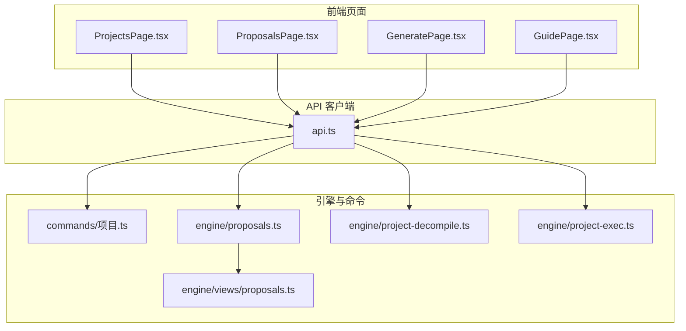
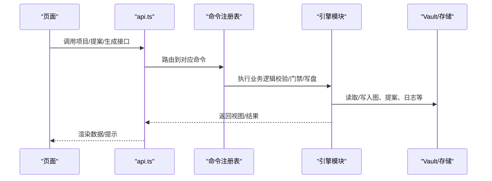
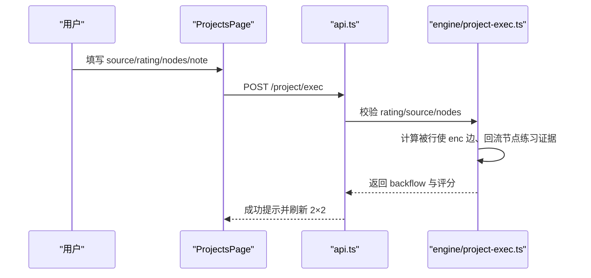
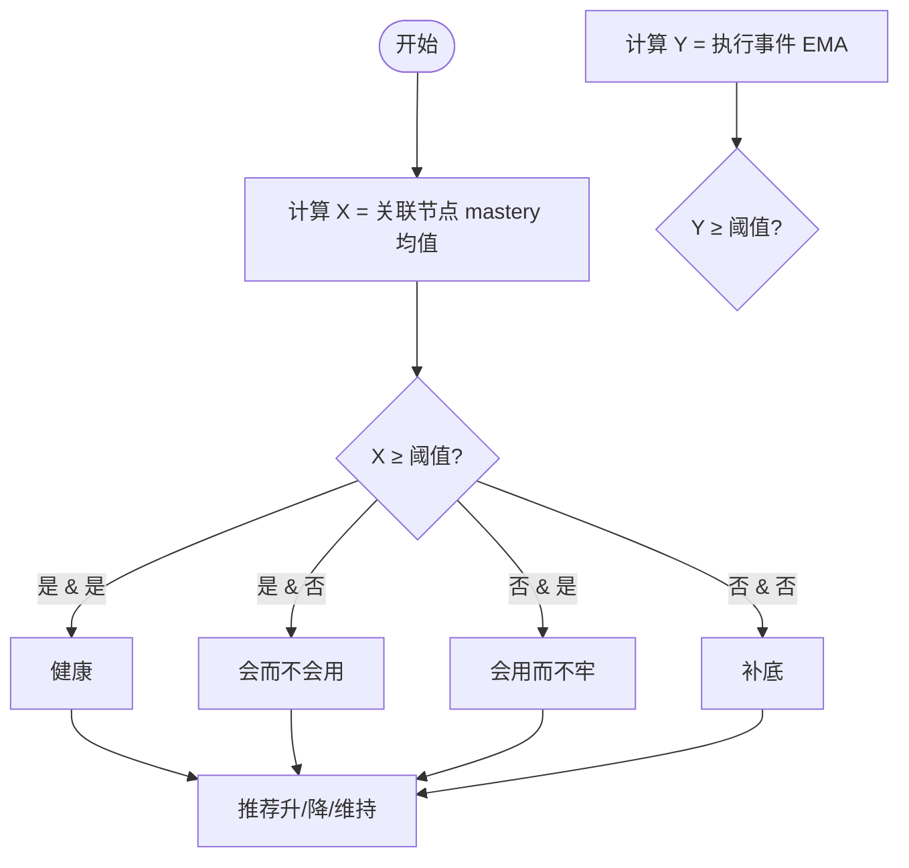
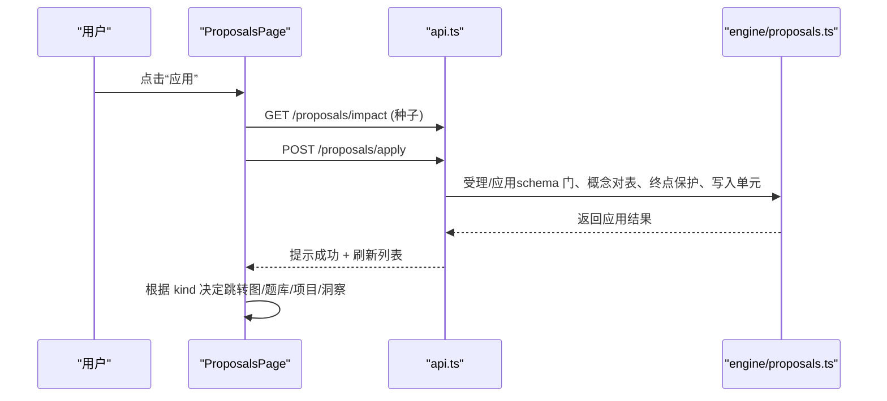
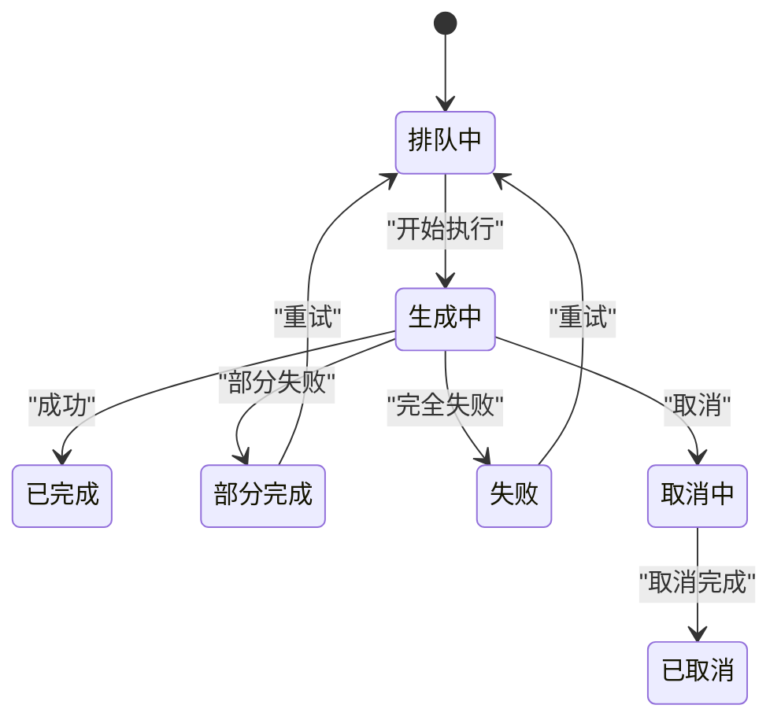
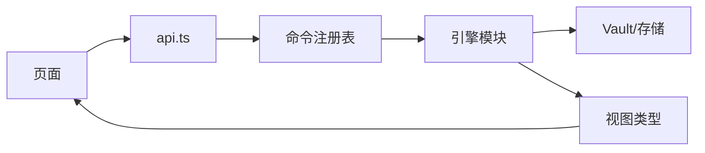

# 项目相关页面

<cite>
**本文引用的文件**
- [ProjectsPage.tsx](file://ui/src/pages/ProjectsPage.tsx)
- [ProposalsPage.tsx](file://ui/src/pages/ProposalsPage.tsx)
- [GeneratePage.tsx](file://ui/src/pages/GeneratePage.tsx)
- [GuidePage.tsx](file://ui/src/pages/GuidePage.tsx)
- [api.ts](file://ui/src/api.ts)
- [proposals.ts（引擎提案域）](file://src/engine/proposals.ts)
- [project-decompile.ts](file://src/engine/project-decompile.ts)
- [project-exec.ts](file://src/engine/project-exec.ts)
- [views/proposals.ts](file://src/engine/views/proposals.ts)
- [commands/项目.ts](file://src/commands/项目.ts)
</cite>

## 目录
1. [简介](#简介)
2. [项目结构](#项目结构)
3. [核心组件](#核心组件)
4. [架构总览](#架构总览)
5. [详细组件分析](#详细组件分析)
6. [依赖关系分析](#依赖关系分析)
7. [性能考虑](#性能考虑)
8. [故障排查指南](#故障排查指南)
9. [结论](#结论)
10. [附录：配置与扩展](#附录配置与扩展)

## 简介
本文件面向“项目相关页面”的综合文档，覆盖以下四个前端页面及其与后端引擎的协作：
- ProjectsPage：项目管理、执行事件记录、2×2 掌握交叉诊断、入档建议与改档。
- ProposalsPage：提案收件箱，统一人审（应用/拒绝），含种子提案影响预览与应用闭环跳转。
- GeneratePage：生成队列与进行中任务管理，支持整课重生成、失败重试、与 AI 讨论。
- GuidePage：能力指南，聚合宿主 AGENT_GUIDE，提供可复制指令与协作说明。

同时解释：
- 项目生命周期管理（创建→计划→里程碑产物→执行证据→入档建议）。
- 提案审批流程（起草→待审→应用/拒绝→结果联动刷新）。
- 内容生成工作流（队列化生成、进度展示、失败处理）。
- 页面扩展方法与项目配置自定义方式。

## 项目结构
四个页面均位于 ui/src/pages，通过统一的 api.ts 调用 /learnhub/api/* 路由；引擎侧在 src/engine 中实现领域逻辑（提案、项目反编译、执行事件等），并通过命令注册表暴露给面板与 agent。

图表来源
- [ProjectsPage.tsx:1-350](file://ui/src/pages/ProjectsPage.tsx#L1-L350)
- [ProposalsPage.tsx:1-202](file://ui/src/pages/ProposalsPage.tsx#L1-L202)
- [GeneratePage.tsx:1-270](file://ui/src/pages/GeneratePage.tsx#L1-L270)
- [GuidePage.tsx:1-78](file://ui/src/pages/GuidePage.tsx#L1-L78)
- [api.ts:43-353](file://ui/src/api.ts#L43-L353)
- [commands/项目.ts:254-397](file://src/commands/项目.ts#L254-L397)
- [proposals.ts（引擎提案域）:1-800](file://src/engine/proposals.ts#L1-L800)
- [project-decompile.ts:1-212](file://src/engine/project-decompile.ts#L1-L212)
- [project-exec.ts:1-262](file://src/engine/project-exec.ts#L1-L262)
- [views/proposals.ts:1-58](file://src/engine/views/proposals.ts#L1-L58)

章节来源
- [ProjectsPage.tsx:1-350](file://ui/src/pages/ProjectsPage.tsx#L1-L350)
- [ProposalsPage.tsx:1-202](file://ui/src/pages/ProposalsPage.tsx#L1-L202)
- [GeneratePage.tsx:1-270](file://ui/src/pages/GeneratePage.tsx#L1-L270)
- [GuidePage.tsx:1-78](file://ui/src/pages/GuidePage.tsx#L1-L78)
- [api.ts:43-353](file://ui/src/api.ts#L43-L353)

## 核心组件
- ProjectsPage：负责项目清单、目标反编译入口、AI 起草（计划/里程碑）、2×2 诊断视图、执行事件落流、入档建议与改档。
- ProposalsPage：提案列表、轮询刷新、影响预览（种子）、应用/拒绝、应用后全局刷新与结果跳转。
- GeneratePage：待生成队列、生成任务状态、整课重生成、失败重试、与 AI 讨论、队列暂停/恢复。
- GuidePage：加载 AGENT_GUIDE，按页面分组展示工具能力与示例指令，提供协作说明。

章节来源
- [ProjectsPage.tsx:1-350](file://ui/src/pages/ProjectsPage.tsx#L1-L350)
- [ProposalsPage.tsx:1-202](file://ui/src/pages/ProposalsPage.tsx#L1-L202)
- [GeneratePage.tsx:1-270](file://ui/src/pages/GeneratePage.tsx#L1-L270)
- [GuidePage.tsx:1-78](file://ui/src/pages/GuidePage.tsx#L1-L78)

## 架构总览
页面通过 api.ts 发起 HTTP 请求到 /learnhub/api/*，由宿主路由分发至引擎命令或处理器。引擎侧对数据做严格校验、门禁与持久化，并返回视图类型供前端渲染。

图表来源
- [api.ts:43-353](file://ui/src/api.ts#L43-L353)
- [commands/项目.ts:254-397](file://src/commands/项目.ts#L254-L397)
- [proposals.ts（引擎提案域）:1-800](file://src/engine/proposals.ts#L1-L800)

## 详细组件分析

### ProjectsPage（项目管理）
职责
- 项目清单与选择、目标反编译（创建项目 + 双提案草稿）。
- AI 起草：计划草案、里程碑任务卡草案（全部入队，产物走提案人审）。
- 2×2 诊断：X=关联节点 masteryOfFm 均值，Y=执行事件 EMA，阈值统一。
- 执行事件落流：source（self/ai/auto）、rating（1-4）、nodes（关联节点）、note。
- 入档建议与改档：引擎提议，学习者显式改档。

关键交互流程（记一次执行事件）

图表来源
- [ProjectsPage.tsx:87-109](file://ui/src/pages/ProjectsPage.tsx#L87-L109)
- [api.ts:280-292](file://ui/src/api.ts#L280-L292)
- [project-exec.ts:70-104](file://src/engine/project-exec.ts#L70-L104)

2×2 分类与入档建议

图表来源
- [project-exec.ts:155-178](file://src/engine/project-exec.ts#L155-L178)
- [project-exec.ts:189-247](file://src/engine/project-exec.ts#L189-L247)

项目反编译与计划草案
- 输入：项目名 + 目标描述；输出：计划半区 YAML（仅 plan，seed 已退役）。
- 静态门：validatePlanArtifact + 名字对账门（reconcilePlanNodes），引用节点必须落在既有课程图内。
- 产物：进入提案队列，待人审；apply 时带旧计划快照，避免静默覆盖。

章节来源
- [ProjectsPage.tsx:126-161](file://ui/src/pages/ProjectsPage.tsx#L126-L161)
- [project-decompile.ts:19-59](file://src/engine/project-decompile.ts#L19-L59)
- [project-decompile.ts:72-108](file://src/engine/project-decompile.ts#L72-L108)
- [commands/项目.ts:318-339](file://src/commands/项目.ts#L318-L339)

### ProposalsPage（提案管理）
职责
- 提案列表常驻新鲜（8s 轮询），支持切片（单课工作台分栏）。
- 种子提案影响预览：新建节点、现有锚保留、罗盘缺席初建等。
- 应用/拒绝：应用成功后触发全局刷新（frame.reload + learnhub:reload），并按类型分流“查看结果”。

应用闭环时序

图表来源
- [ProposalsPage.tsx:99-162](file://ui/src/pages/ProposalsPage.tsx#L99-L162)
- [api.ts:223-229](file://ui/src/api.ts#L223-L229)
- [proposals.ts（引擎提案域）:556-605](file://src/engine/proposals.ts#L556-L605)

章节来源
- [ProposalsPage.tsx:1-202](file://ui/src/pages/ProposalsPage.tsx#L1-L202)
- [views/proposals.ts:40-58](file://src/engine/views/proposals.ts#L40-L58)

### GeneratePage（内容生成）
职责
- 待生成队列：来自 agent 建议/反馈自动入队，一键生成正文。
- 生成任务：显示运行中/排队/失败/部分完成等状态，支持取消、重试、与 AI 讨论。
- 整课重生成：删除节正文/题目/交互件/图片（备份 .trash），按拓扑序串行重新生成。
- 双形态：全局 vs 单课切片（过滤同一注册表）。

队列与任务状态流转

图表来源
- [GeneratePage.tsx:19-27](file://ui/src/pages/GeneratePage.tsx#L19-L27)
- [GeneratePage.tsx:123-144](file://ui/src/pages/GeneratePage.tsx#L123-L144)
- [api.ts:205-213](file://ui/src/api.ts#L205-L213)

章节来源
- [GeneratePage.tsx:1-270](file://ui/src/pages/GeneratePage.tsx#L1-L270)
- [api.ts:205-213](file://ui/src/api.ts#L205-L213)

### GuidePage（用户引导）
职责
- 从宿主 AGENT_GUIDE 拉取能力清单，按页面分组展示工具与示例指令。
- 提供与 agent 协作说明：自然语言需求 → agent 调用 learnhub 工具 → 全量留痕。

章节来源
- [GuidePage.tsx:1-78](file://ui/src/pages/GuidePage.tsx#L1-L78)

## 依赖关系分析
- 页面依赖 api.ts 提供的统一客户端方法，所有后端路径集中在 /learnhub/api/*。
- 引擎侧通过命令注册表将能力暴露给面板与 agent，保证单一事实源。
- 提案域强依赖 schema 校验、概念对表、终点锚保护、写入单元顺序，确保变更安全。
- 项目域执行事件与 2×2 诊断解耦于节点练习证据通道，但支持单向回流。

图表来源
- [api.ts:43-353](file://ui/src/api.ts#L43-L353)
- [commands/项目.ts:254-397](file://src/commands/项目.ts#L254-L397)
- [proposals.ts（引擎提案域）:1-800](file://src/engine/proposals.ts#L1-L800)

章节来源
- [api.ts:43-353](file://ui/src/api.ts#L43-L353)
- [commands/项目.ts:254-397](file://src/commands/项目.ts#L254-L397)

## 性能考虑
- 轮询策略：提案页 8s 轮询、生成页 5s 轮询，非激活页签跳过取数，切回即补，减少无效请求。
- 生成队列串行执行：同一时刻只跑一个节点管线，避免资源争用。
- 2×2 诊断使用 EMA 与阈值，避免频繁波动；证据缺失按低侧处理，防止误判。
- 整课重生成前确认并备份，避免误删导致的数据丢失。

[本节为通用指导，不直接分析具体文件]

## 故障排查指南
常见问题与定位
- 提案未受理：检查 schema 校验错误、概念引用对表、终点锚保护、路线门/巩固门。
- 执行事件报错：确认 rating 为 1-4 整数、source 枚举合法、nodes 为非空字符串列表。
- 生成失败：查看失败原因，使用“重试”或“与 AI 讨论”，必要时整课重生成。
- 轮询无数据：检查网络与权限，确认页签激活状态与轮询门设置。

章节来源
- [project-exec.ts:70-104](file://src/engine/project-exec.ts#L70-L104)
- [proposals.ts（引擎提案域）:556-605](file://src/engine/proposals.ts#L556-L605)
- [GeneratePage.tsx:195-207](file://ui/src/pages/GeneratePage.tsx#L195-L207)

## 结论
四个页面形成完整的学习实践闭环：项目规划与执行、提案审批与落地、内容生成与质量保障、能力指南与协作。通过严格的 schema 门、写入单元与轮询机制，确保数据一致性与用户体验。扩展时遵循“单一事实源”与“命令注册表”原则，新增能力应先在引擎实现，再暴露给面板与 agent。

[本节为总结性内容，不直接分析具体文件]

## 附录：配置与扩展
- 项目配置自定义
  - 项目渐退档：骨架/补全/独立，影响里程碑产物支持度；可通过页面手动改档或引擎建议驱动。
  - 项目生命周期：active/paused/delivered/archived，反映项目阶段。
  - 执行事件来源：auto/self/ai，其中 auto 需可观测证据映射。
- 页面扩展指南
  - 新增页面：在 ui/src/pages 下创建组件，复用 api.ts 客户端方法。
  - 新增能力：在 src/commands 注册命令，引擎实现逻辑，视图类型在 src/engine/views 导出。
  - 提案扩展：遵循 schema 校验与写入单元顺序，确保变更安全。
  - 生成队列：复用 useGenJobActions 与轮询机制，保持状态同步。

章节来源
- [project-exec.ts:189-247](file://src/engine/project-exec.ts#L189-L247)
- [project-decompile.ts:19-59](file://src/engine/project-decompile.ts#L19-L59)
- [api.ts:280-353](file://ui/src/api.ts#L280-L353)