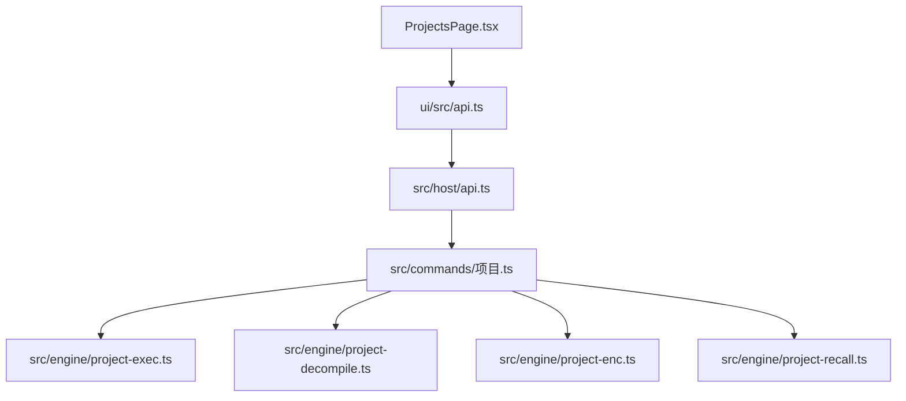
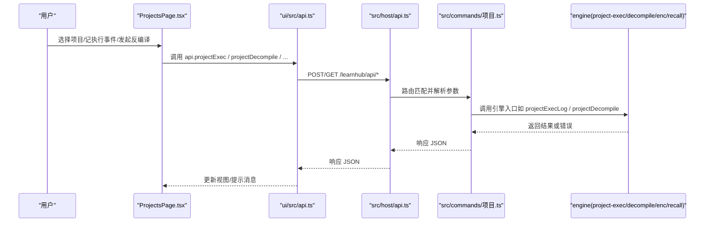
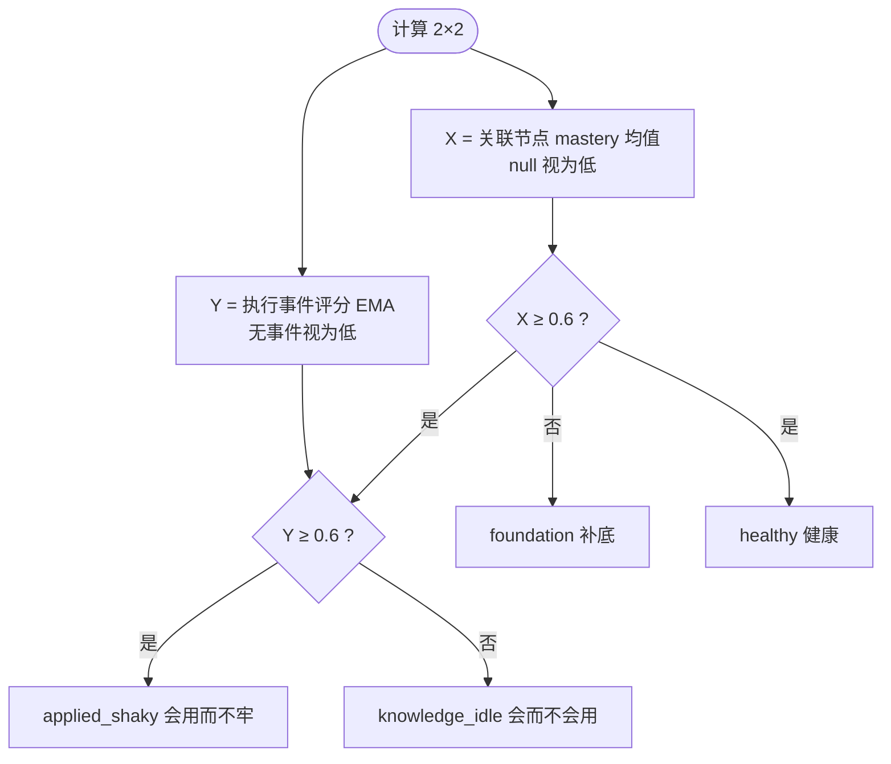
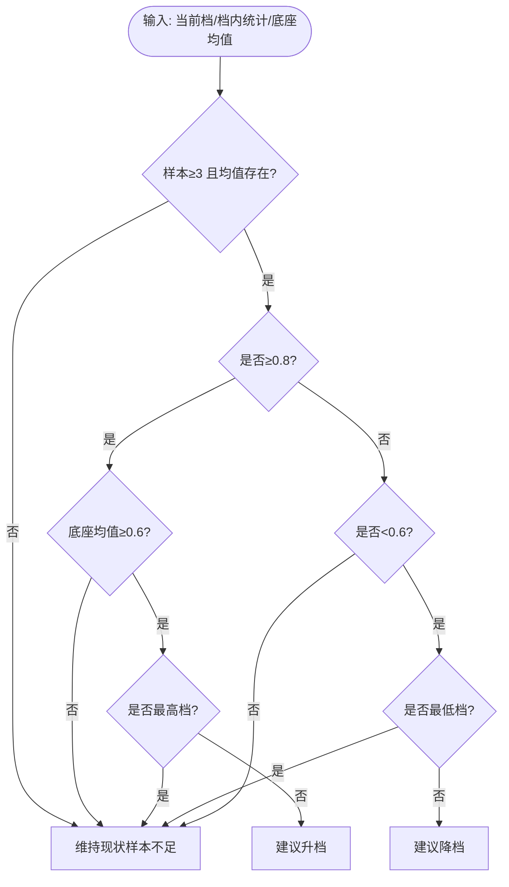
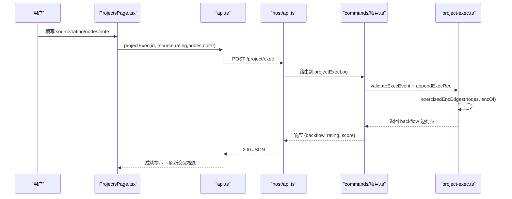
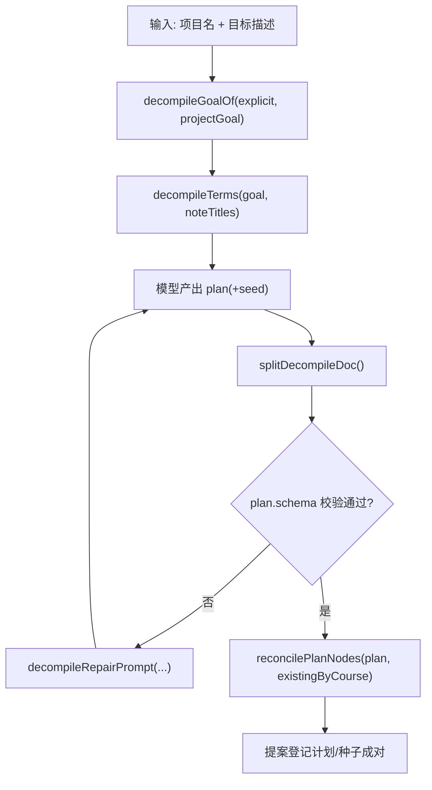
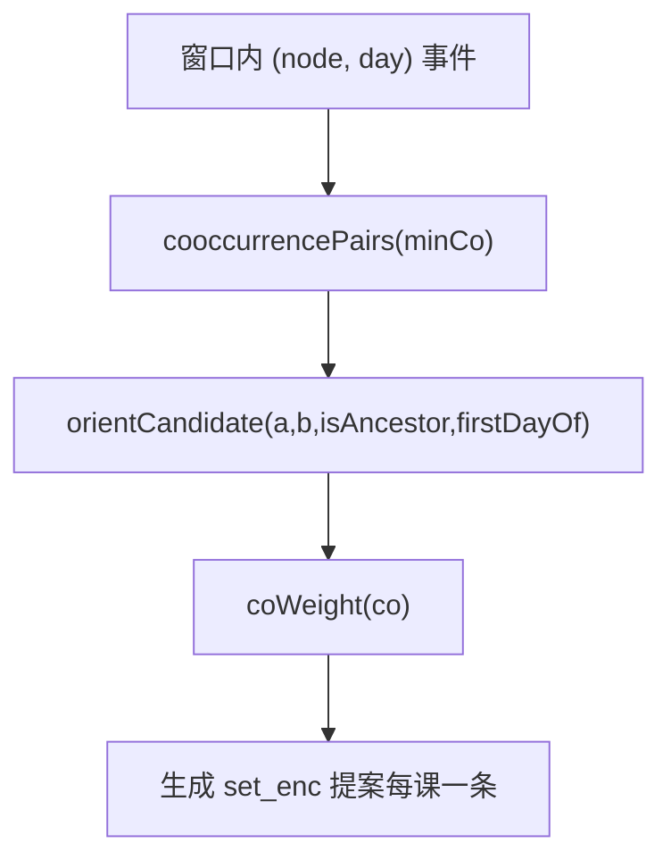
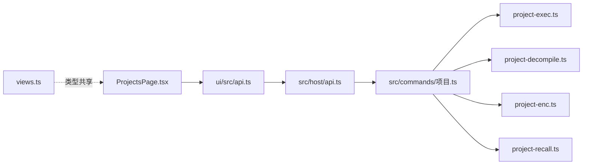

# 项目页面（ProjectsPage）

<cite>
**本文引用的文件**
- [ui/src/pages/ProjectsPage.tsx](file://ui/src/pages/ProjectsPage.tsx)
- [ui/src/api.ts](file://ui/src/api.ts)
- [src/engine/project-exec.ts](file://src/engine/project-exec.ts)
- [src/engine/project-decompile.ts](file://src/engine/project-decompile.ts)
- [src/engine/project-enc.ts](file://src/engine/project-enc.ts)
- [src/engine/project-recall.ts](file://src/engine/project-recall.ts)
- [src/engine/views.ts](file://src/engine/views.ts)
- [src/commands/项目.ts](file://src/commands/项目.ts)
- [src/host/api.ts](file://src/host/api.ts)
- [src/engine/params.ts](file://src/engine/params.ts)
</cite>

## 目录
1. [简介](#简介)
2. [项目结构](#项目结构)
3. [核心组件](#核心组件)
4. [架构总览](#架构总览)
5. [详细组件分析](#详细组件分析)
6. [依赖关系分析](#依赖关系分析)
7. [性能考虑](#性能考虑)
8. [故障排查指南](#故障排查指南)
9. [结论](#结论)
10. [附录：API 调用模式与交互示例](#附录api-调用模式与交互示例)

## 简介
本项目页面（ProjectsPage）是“有界项目区”的核心界面，围绕“项目管理 + 2×2 掌握交叉诊断 + 执行事件记录 + AI 起草”展开。它提供：
- 项目清单与生命周期管理（进行中/暂停/已交付/已归档）
- 2×2 四象限诊断（X 轴陈述性掌握、Y 轴项目执行证据），阈值统一为 0.6
- 入档推荐（挑战点）只读展示，改档由学习者显式操作
- 执行事件记录（评级 1–4、来源 self/ai/auto、行使节点、备注），零 XP、零调度写入
- 目标反编译：从项目描述生成“里程碑计划草案 + 知识种子簇提案”，走队列与人审通道
- 既有项目的 AI 起草：计划草案、里程碑任务卡草案，全部入队即返回，产物经提案人审

## 项目结构
前端页面位于 ui/src/pages/ProjectsPage.tsx，通过 ui/src/api.ts 暴露的客户端方法访问后端路由；后端路由在 src/host/api.ts 中分发到命令注册表（src/commands/项目.ts），最终落到引擎模块（project-exec、project-decompile、project-enc、project-recall）。

图表来源
- [ui/src/pages/ProjectsPage.tsx:1-350](file://ui/src/pages/ProjectsPage.tsx#L1-L350)
- [ui/src/api.ts:279-353](file://ui/src/api.ts#L279-L353)
- [src/host/api.ts:48-83](file://src/host/api.ts#L48-L83)
- [src/commands/项目.ts:26-417](file://src/commands/项目.ts#L26-L417)

章节来源
- [ui/src/pages/ProjectsPage.tsx:1-350](file://ui/src/pages/ProjectsPage.tsx#L1-L350)
- [ui/src/api.ts:279-353](file://ui/src/api.ts#L279-L353)
- [src/host/api.ts:48-83](file://src/host/api.ts#L48-L83)
- [src/commands/项目.ts:26-417](file://src/commands/项目.ts#L26-L417)

## 核心组件
- 2×2 掌握交叉诊断：X=关联节点 masteryOfFm 均值，Y=执行事件分 EMA（0.7/0.3），阈值 0.6；四象限：健康、会用而不牢、会而不会用、补底
- 入档推荐（challenge point）：基于当前档内表现与知识底座均值给出升/降/维持建议，仅提议不门禁
- 执行事件流：追加到 projects/<id>/exec.jsonl，支持被行使 enc 边两端节点的单向练习证据回流
- 目标反编译：从目标描述派生检索词，产出“里程碑计划草案 + 知识种子簇提案”，名字对账门校验 plan.nodes 引用
- 行为推断 enc 候选边：窗口内共现 → 置信度权重 → 单提案人审
- 里程碑检索点会话：跨课程题池抽题，零 XP/FSRS/调度，仅落 recall.jsonl

章节来源
- [src/engine/project-exec.ts:1-32](file://src/engine/project-exec.ts#L1-L32)
- [src/engine/project-decompile.ts:1-13](file://src/engine/project-decompile.ts#L1-L13)
- [src/engine/project-enc.ts:1-13](file://src/engine/project-enc.ts#L1-L13)
- [src/engine/project-recall.ts:1-12](file://src/engine/project-recall.ts#L1-L12)

## 架构总览

图表来源
- [ui/src/pages/ProjectsPage.tsx:65-161](file://ui/src/pages/ProjectsPage.tsx#L65-L161)
- [ui/src/api.ts:279-353](file://ui/src/api.ts#L279-L353)
- [src/host/api.ts:48-83](file://src/host/api.ts#L48-L83)
- [src/commands/项目.ts:26-417](file://src/commands/项目.ts#L26-L417)

## 详细组件分析

### 2×2 掌握交叉诊断与四象限模型
- X 轴：关联节点 masteryOfFm 均值（无关联节点视为 null，按低侧处理）
- Y 轴：执行事件评分映射（1→0.2, 2→0.55, 3→0.8, 4→0.95）后 nextEma 滚动（首证取分，之后 0.7/0.3）
- 阈值：两轴统一使用 CROSS_AXIS_THRESHOLD = 0.6
- 分类：healthy（高×高）、applied_shaky（低×高）、knowledge_idle（高×低）、foundation（低×低）

图表来源
- [src/engine/project-exec.ts:155-178](file://src/engine/project-exec.ts#L155-L178)
- [src/engine/params.ts:33-35](file://src/engine/params.ts#L33-L35)

章节来源
- [src/engine/project-exec.ts:155-178](file://src/engine/project-exec.ts#L155-L178)
- [src/engine/params.ts:33-35](file://src/engine/params.ts#L33-L35)

### 入档推荐（挑战点）机制
- 升档条件：当前档内样本数≥3 且均分≥0.8，且知识底座均值≥0.6（避免推成“会用而不牢”）
- 降档条件：当前档内样本数≥3 且均分<0.6
- 样本不足或处于目标带：维持现状
- 永不参与任何门禁，改档需学习者显式调用 projectSetTier

图表来源
- [src/engine/project-exec.ts:189-247](file://src/engine/project-exec.ts#L189-L247)

章节来源
- [src/engine/project-exec.ts:189-247](file://src/engine/project-exec.ts#L189-L247)

### 执行事件记录流程
- 入口：面板提交 source(self/ai)、rating(1–4)、nodes（逗号分隔）、note
- 校验：validateExecEvent 严格检查 rating/source/nodes/note
- 存储：appendExecRec 追加到 projects/<id>/exec.jsonl
- 上行回流：若 nodes 包含图上的既有 enc 边两端节点，则对两端各调用 applyPracticeEvidence（单向复制、去重、零新存储形态）
- 观测：返回被行使 enc 边列表（计数用于观测，粗 pre 边不回流）

图表来源
- [ui/src/pages/ProjectsPage.tsx:87-109](file://ui/src/pages/ProjectsPage.tsx#L87-L109)
- [ui/src/api.ts:284-289](file://ui/src/api.ts#L284-L289)
- [src/commands/项目.ts:136-161](file://src/commands/项目.ts#L136-L161)
- [src/engine/project-exec.ts:70-128](file://src/engine/project-exec.ts#L70-L128)

章节来源
- [ui/src/pages/ProjectsPage.tsx:87-109](file://ui/src/pages/ProjectsPage.tsx#L87-L109)
- [src/engine/project-exec.ts:70-128](file://src/engine/project-exec.ts#L70-L128)

### 目标反编译（从项目描述到里程碑计划与知识种子簇）
- 输入：项目名 + 目标描述（显式 goal 优先，否则回落到项目档案 goal）
- 检索面：priorTerms 派生检索词（结合注册笔记标题/名）
- 产物拆分与校验：splitDecompileDoc 拒绝 seed 半区（ADR-0076），仅接受 plan 半区；validatePlanArtifact 校验 plan.schema
- 名字对账门：reconcilePlanNodes 确保 plan[].nodes 引用的是已注册课程的既有图节点（裸名必须唯一着落）
- 修复轮：decompileRepairPrompt 将原材料+上次输出+错误行回灌，要求整体重出完整 YAML
- 流程：创建项目 → 反编译（入队）→ 提案收件箱联合人审 → apply 时先落地种子再写计划（成对应用）

图表来源
- [src/engine/project-decompile.ts:24-121](file://src/engine/project-decompile.ts#L24-L121)
- [src/commands/项目.ts:73-115](file://src/commands/项目.ts#L73-L115)

章节来源
- [src/engine/project-decompile.ts:24-121](file://src/engine/project-decompile.ts#L24-L121)
- [src/commands/项目.ts:73-115](file://src/commands/项目.ts#L73-L115)

### 行为推断 enc 候选边
- 窗口内行为事件（node + day）→ cooccurrencePairs 提取共现对（minCo 过滤）
- 方向裁决：orientCandidate 依据 pre 传递闭包确定 skill/holder；若无 pre，退回 no_pre 信号并给出启发式
- 置信度：coWeight(co) 按共现天数赋权（≥3天=1.0，2天=0.8，1天=0.6）
- 产出：每个课程一个 pending edit 提案（set_enc 整体替换），人审通过后生效

图表来源
- [src/engine/project-enc.ts:21-72](file://src/engine/project-enc.ts#L21-L72)

章节来源
- [src/engine/project-enc.ts:21-72](file://src/engine/project-enc.ts#L21-L72)

### 里程碑检索点会话
- 抽题：drawRecallQuestions 跨池轮转，从未作答优先，同序级内 FSRS due 最早优先，洗牌避免固定批次
- 流水：recall.jsonl 记录 draw/reflect，零 XP/FSRS/调度
- 用途：服务知识底座连接，非项目验收标准

章节来源
- [src/engine/project-recall.ts:35-78](file://src/engine/project-recall.ts#L35-L78)

### 渐退档调整机制
- 三档：骨架/补全/独立，影响里程碑任务卡的给定/待办/验收清单/支持的粒度
- 变更入口：projectSetTier（面板或 agent），仅状态变更，不影响 XP/调度
- 推荐：仅读纯函数 recommendTier，不改状态

章节来源
- [src/commands/项目.ts:393-416](file://src/commands/项目.ts#L393-L416)
- [src/engine/project-exec.ts:189-247](file://src/engine/project-exec.ts#L189-L247)

## 依赖关系分析
- ProjectsPage 依赖 ui/src/api.ts 暴露的项目域接口
- 后端路由由 src/host/api.ts 统一分发至命令注册表（src/commands/项目.ts）
- 命令注册表声明 engine 入口，实际逻辑在 engine 模块（project-exec/decompile/enc/recall）
- 类型定义集中在 src/engine/views.ts，UI 通过 ui/src/types.ts re-export

图表来源
- [ui/src/pages/ProjectsPage.tsx:1-350](file://ui/src/pages/ProjectsPage.tsx#L1-L350)
- [ui/src/api.ts:279-353](file://ui/src/api.ts#L279-L353)
- [src/host/api.ts:48-83](file://src/host/api.ts#L48-L83)
- [src/commands/项目.ts:26-417](file://src/commands/项目.ts#L26-L417)
- [src/engine/views.ts:1-200](file://src/engine/views.ts#L1-L200)

章节来源
- [ui/src/pages/ProjectsPage.tsx:1-350](file://ui/src/pages/ProjectsPage.tsx#L1-L350)
- [ui/src/api.ts:279-353](file://ui/src/api.ts#L279-L353)
- [src/host/api.ts:48-83](file://src/host/api.ts#L48-L83)
- [src/commands/项目.ts:26-417](file://src/commands/项目.ts#L26-L417)
- [src/engine/views.ts:1-200](file://src/engine/views.ts#L1-L200)

## 性能考虑
- 执行事件追加采用 JSONL 一次整行追加，读侧遵循 readJsonlLines 原语（缺失=空态、撕裂尾行豁免、中段坏行报错）
- 2×2 诊断纯函数化（masteryAggregate/execEvidenceScore/classifyCross），避免重复计算
- 行为推断 enc 候选边使用 Map/Set 优化共现统计与去重，排序稳定可回放
- 抽题算法跨池轮转，FSRS due 早者优先，减少无效重复
- 所有生成类动作（反编译/计划/里程碑）入队即返回，避免阻塞 UI

[本节为通用指导，无需具体文件引用]

## 故障排查指南
- 路由未命中：src/host/api.ts 返回 404 并附带 method+route 信息
- 参数守卫错误：ParamError 携带中文消息与路由名，便于定位
- 执行事件校验失败：validateExecEvent 对 rating/source/nodes/note 严格校验，越界直接抛错
- 反编译名字对账失败：reconcilePlanNodes 报告悬空/歧义引用，需修正 plan.nodes
- 提案申请限制：decompile 成对提案需 joint apply，单边 reject 不可恢复，需重新反编译

章节来源
- [src/host/api.ts:48-83](file://src/host/api.ts#L48-L83)
- [src/engine/project-exec.ts:70-104](file://src/engine/project-exec.ts#L70-L104)
- [src/engine/project-decompile.ts:72-108](file://src/engine/project-decompile.ts#L72-L108)
- [src/commands/项目.ts:98-115](file://src/commands/项目.ts#L98-L115)

## 结论
ProjectsPage 以“项目为中心”组织学习实践，通过 2×2 诊断与执行事件流形成闭环反馈；目标反编译与 AI 起草将意图转化为可执行的里程碑计划与知识种子簇，并通过提案人审保障质量。入档推荐作为挑战点调节器，既提供数据驱动建议，又尊重学习者决策权。整体设计强调零侵入（零 XP/FSRS/调度写入）、可审计（JSONL 流水）、可扩展（行为推断 enc 候选边）。

[本节为总结，无需具体文件引用]

## 附录：API 调用模式与交互示例

- 获取项目清单
  - GET /projects
  - 前端调用：api.projects()
  - 用途：渲染项目表格，默认选中首个

- 获取 2×2 交叉视图
  - GET /project/cross?id={id}
  - 前端调用：api.projectCross(id)
  - 用途：显示四象限、两轴读数、入档推荐、最近事件

- 记录执行事件
  - POST /project/exec
  - 请求体：{ id, source:'self'|'ai', rating:1..4, nodes?:string[], note?:string }
  - 前端调用：api.projectExec(id, body)
  - 用途：落流 exec.jsonl，触发上行回流与诊断更新

- 修改渐退档
  - POST /project/tier
  - 请求体：{ id, tier:'骨架'|'补全'|'独立' }
  - 前端调用：api.projectSetTier(id, tier)
  - 用途：显式改档（引擎推荐仅提议）

- 创建项目并反编译
  - POST /project/create
  - 请求体：{ name, goal }
  - 前端调用：api.projectCreate(name, goal)
  - 随后：POST /project/decompile{id}
  - 前端调用：api.projectDecompile(id)
  - 用途：生成计划/种子提案，进入人审

- 既有项目 AI 起草
  - POST /project/plan/generate{id}
  - 前端调用：api.projectPlanGenerate(id)
  - POST /project/milestone/generate{id,milestone}
  - 前端调用：api.projectMilestoneGenerate(id, milestoneId)
  - 用途：入队生成计划/任务卡，产物走提案人审

章节来源
- [ui/src/api.ts:279-353](file://ui/src/api.ts#L279-L353)
- [src/commands/项目.ts:26-417](file://src/commands/项目.ts#L26-L417)