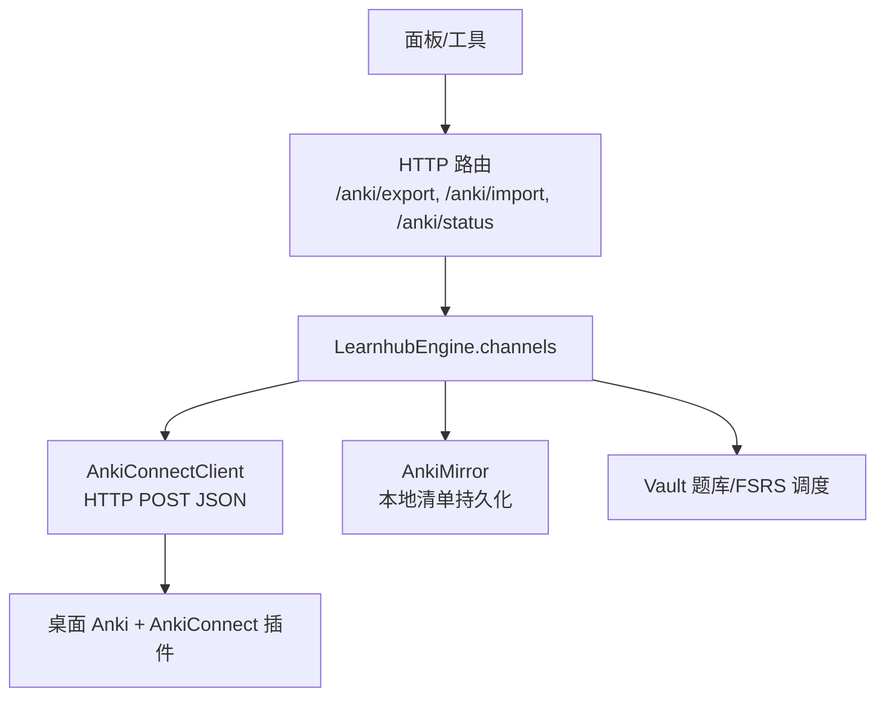
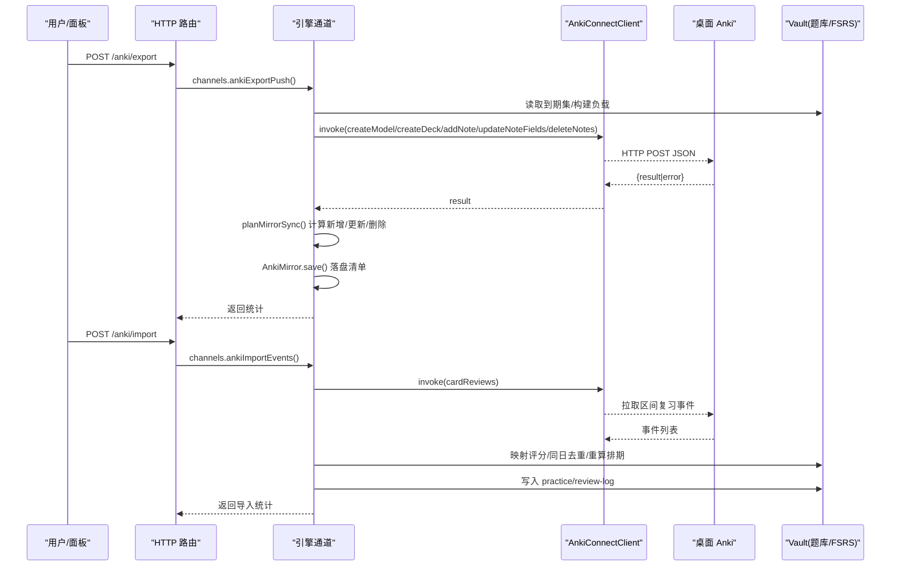
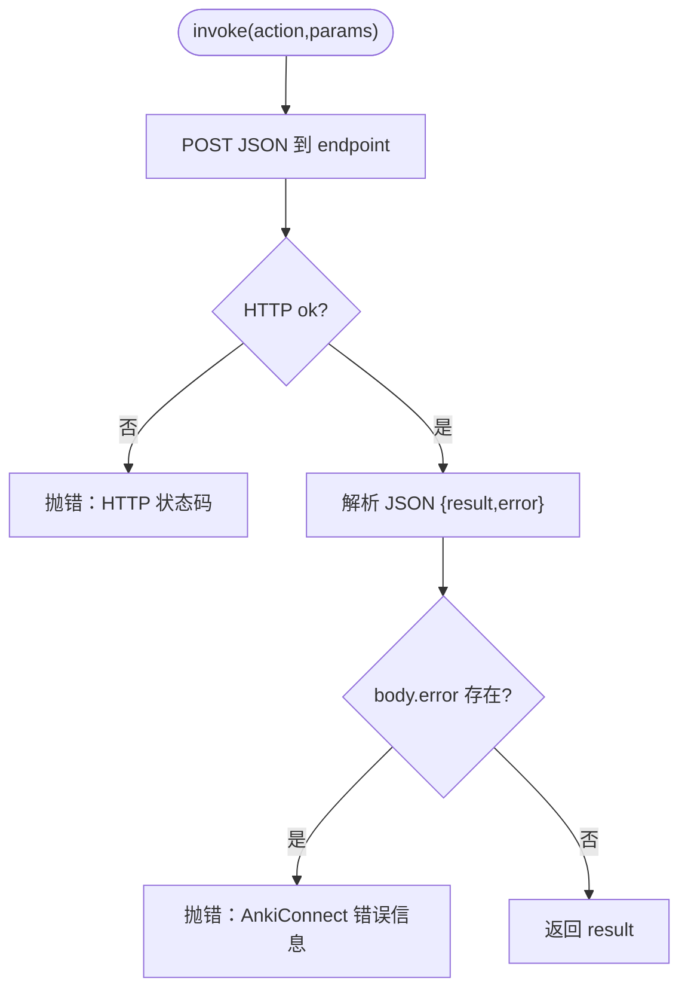
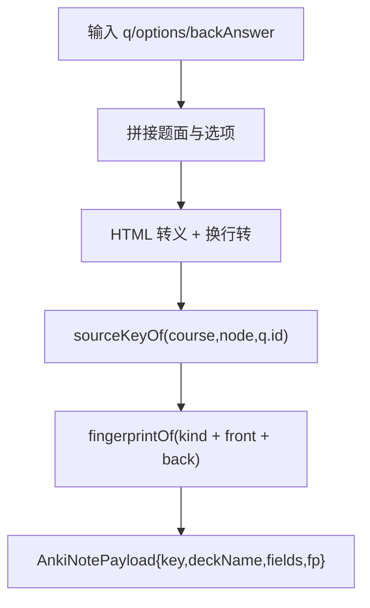
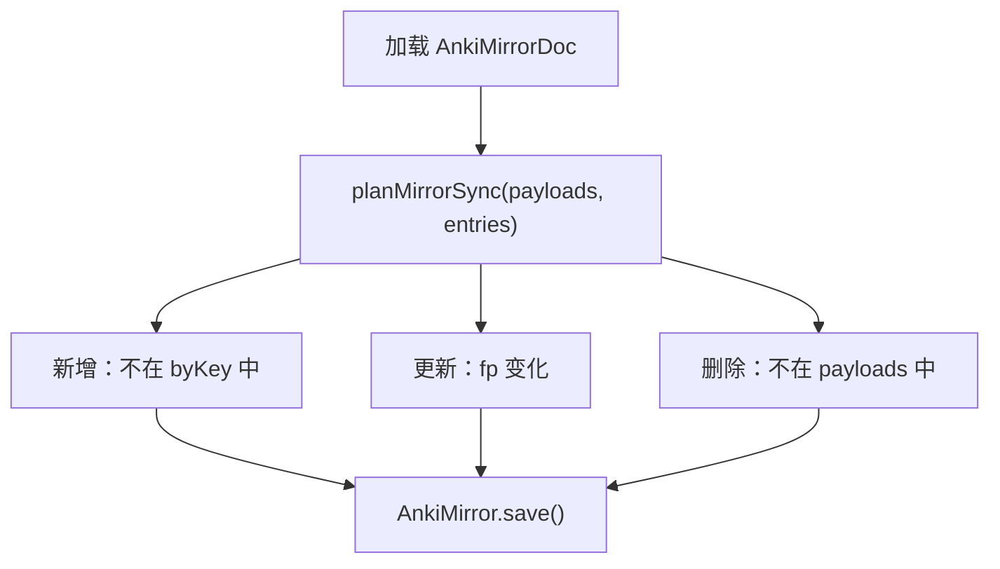
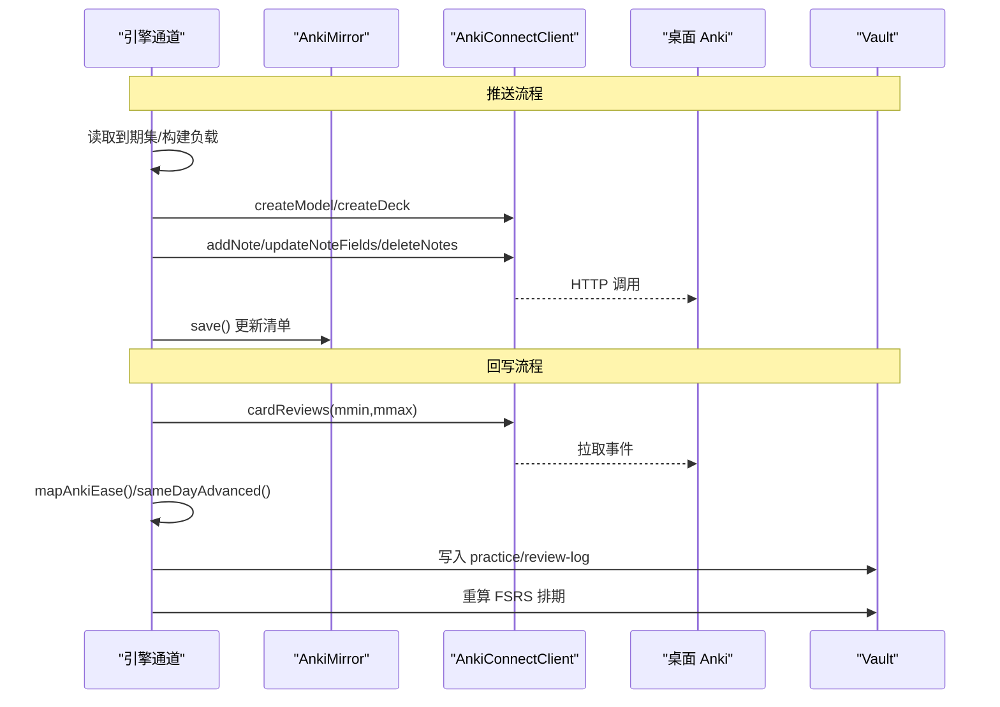
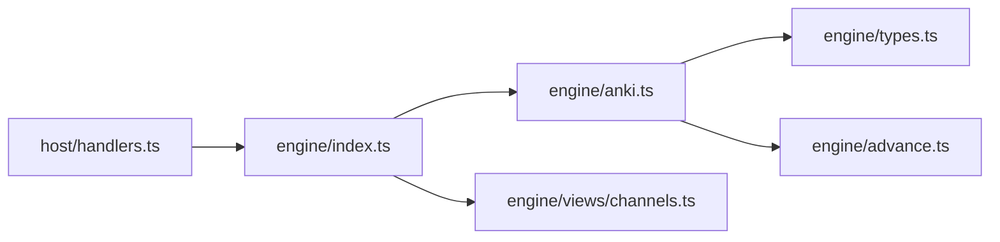

# Anki 同步机制

<cite>
**本文引用的文件**
- [anki.ts](file://src/engine/anki.ts)
- [通道.ts](file://src/commands/通道.ts)
- [handlers.ts](file://src/host/handlers.ts)
- [index.ts](file://src/engine/index.ts)
- [channels.ts](file://src/engine/views/channels.ts)
- [anki.test.ts](file://tests/anki.test.ts)
</cite>

## 目录
1. [简介](#简介)
2. [项目结构](#项目结构)
3. [核心组件](#核心组件)
4. [架构总览](#架构总览)
5. [详细组件分析](#详细组件分析)
6. [依赖关系分析](#依赖关系分析)
7. [性能考虑](#性能考虑)
8. [故障排除指南](#故障排除指南)
9. [结论](#结论)
10. [附录：API 参考与配置示例](#附录api-参考与配置示例)

## 简介
本文件系统性说明 LearnHub 与桌面端 Anki 的双向同步机制。核心原则是：Anki 仅作为“作答通道”，Vault（学习中心）是唯一调度源；所有排期由 Vault 的 ts-fsrs 重算，Anki 侧排期输出被丢弃。双向数据流包括：
- 从 LearnHub 到 Anki：按 Vault 到期集推送卡片至可丢弃的镜像卡组，使用 AnkiConnect 协议。
- 从 Anki 到 LearnHub：拉取复习事件并回写为原始作答证据，触发 Vault 重算与日志落盘。

文档涵盖 HTTP 通信、错误处理与重试策略、卡片格式转换、镜像管理与差异计算、冲突解决策略、模型/卡组/笔记 API 参考，以及配置与故障排除。

## 项目结构
围绕 Anki 同步的关键代码分布在以下位置：
- 引擎层：anki.ts 提供 AnkiConnect 客户端、纯函数（事件映射、指纹、镜象 diff）、镜像清单持久化、卡片负载组装等。
- 命令注册：通道.ts 声明 anki-export/import/status 三个命令及其路由绑定。
- 宿主路由：handlers.ts 暴露 /anki/export、/anki/import、/anki/status 接口，构造 AnkiConnectClient 并调用引擎通道。
- 门面与视图：engine/index.ts 导出 ANKI_ENDPOINT、AnkiConnectClient；views/channels.ts 定义状态视图类型。
- 测试：tests/anki.test.ts 覆盖端到端行为（推送、导入、同日去重、归档移除、状态探测、错误提示）。

图表来源
- [handlers.ts:175-180](file://src/host/handlers.ts#L175-L180)
- [handlers.ts:453-463](file://src/host/handlers.ts#L453-L463)
- [anki.ts:186-212](file://src/engine/anki.ts#L186-L212)
- [anki.ts:147-184](file://src/engine/anki.ts#L147-L184)

章节来源
- [anki.ts:1-324](file://src/engine/anki.ts#L1-L324)
- [通道.ts:9-72](file://src/commands/通道.ts#L9-L72)
- [handlers.ts:175-180](file://src/host/handlers.ts#L175-L180)
- [handlers.ts:453-463](file://src/host/handlers.ts#L453-L463)
- [channels.ts:7-14](file://src/engine/views/channels.ts#L7-L14)

## 核心组件
- AnkiConnect 传输层：封装 HTTP POST 请求，统一 action/version/params 格式，解析 result/error 并抛出可读错误。
- 卡片负载与格式转换：将题目、选项、答案、解析拼装为 Anki 字段，进行 HTML 转义与换行处理，生成内容指纹用于增量更新。
- 镜像管理：维护 key↔note_id+fp 的本地清单，支持加载/保存、坏档静默重建；基于 Vault 到期集计算 add/update/remove 计划。
- 事件映射与同日去重：将 Again/Hard/Good/Easy 映射为 Vault 语义评分，结合 Vault 当日是否已推进避免重复调度。
- 模型/卡组/笔记操作：创建 learnhub 模型与 learnhub::课程 卡组，增删改查笔记，查询复习日志。

章节来源
- [anki.ts:22-28](file://src/engine/anki.ts#L22-L28)
- [anki.ts:30-49](file://src/engine/anki.ts#L30-L49)
- [anki.ts:58-104](file://src/engine/anki.ts#L58-L104)
- [anki.ts:106-143](file://src/engine/anki.ts#L106-L143)
- [anki.ts:147-184](file://src/engine/anki.ts#L147-L184)
- [anki.ts:186-212](file://src/engine/anki.ts#L186-L212)
- [anki.ts:214-324](file://src/engine/anki.ts#L214-L324)

## 架构总览
双向同步通过“命令→路由→引擎通道→AnkiConnect”链路完成。导出时以 Vault 到期集为准校准镜像卡组；导入时拉取复习事件并写入 practice/review-log，由 Vault 重算排期。

图表来源
- [handlers.ts:453-463](file://src/host/handlers.ts#L453-L463)
- [anki.ts:186-212](file://src/engine/anki.ts#L186-L212)
- [anki.ts:129-143](file://src/engine/anki.ts#L129-L143)
- [anki.ts:311-316](file://src/engine/anki.ts#L311-L316)

## 详细组件分析

### AnkiConnect 客户端与 HTTP 协议
- 默认端点：http://127.0.0.1:8765。
- 请求体：{ action, version: 6, params }，Content-Type: application/json。
- 响应：若存在 error 字段则抛错；否则返回 result。
- 连接失败：包装为带指引的错误消息，便于定位“未打开 Anki 或未安装插件”。

图表来源
- [anki.ts:193-212](file://src/engine/anki.ts#L193-L212)

章节来源
- [anki.ts:22-28](file://src/engine/anki.ts#L22-L28)
- [anki.ts:193-212](file://src/engine/anki.ts#L193-L212)

### 卡片格式转换与选项格式化
- 正面：题面 + 选项（A/B/C…），不泄露答案；HTML 转义 & < > 与换行转  。
- 背面：答案 + 解析；同样进行 HTML 转义与换行处理。
- 来源字段：携带课程/节点/题 id，用于回写归属与去重。
- 内容指纹：FNV-1a 32 位十六进制，用于判断是否需要 update。

图表来源
- [anki.ts:75-104](file://src/engine/anki.ts#L75-L104)

章节来源
- [anki.ts:75-104](file://src/engine/anki.ts#L75-L104)

### 镜像管理机制：指纹、差异检测与同步计划
- 清单条目：{ key, note_id, fp, deck }，记录本地镜像与 Anki 笔记的对应关系。
- 差异算法：对比 Vault 到期集与现有清单，产出 add/update/remove 计划；vault 为权威，不一致即校准。
- 清单持久化：atomicWrite 落盘；读取失败或损坏时静默重建为空清单（可丢弃镜象，永不判 Broken）。

图表来源
- [anki.ts:106-143](file://src/engine/anki.ts#L106-L143)
- [anki.ts:147-184](file://src/engine/anki.ts#L147-L184)

章节来源
- [anki.ts:106-143](file://src/engine/anki.ts#L106-L143)
- [anki.ts:147-184](file://src/engine/anki.ts#L147-L184)

### 双向数据流：推送与回写
- 推送（LearnHub → Anki）：按 Vault 到期集构建负载，创建模型/卡组，添加/更新/删除笔记，更新本地清单。
- 回写（Anki → LearnHub）：拉取 cardReviews 区间事件，映射评分，同日去重，写入 practice 与 review-log，由 Vault 重算排期。

图表来源
- [anki.ts:219-316](file://src/engine/anki.ts#L219-L316)
- [anki.ts:30-49](file://src/engine/anki.ts#L30-L49)

章节来源
- [anki.ts:219-316](file://src/engine/anki.ts#L219-L316)
- [anki.ts:30-49](file://src/engine/anki.ts#L30-L49)

### 冲突解决策略与一致性保证
- 权威源：Vault 唯一调度者；Anki 仅为作答通道，其排期输出不作数。
- 不一致处理：每次导出重新校准镜像卡组，缺失/变更/归档均按 Vault 为准调整。
- 同日不变量：同一题一天只推进一次；若 Vault 已在当天推进，Anki 事件仅留档不重算。
- 镜象可丢弃：清单丢失或损坏时静默重建，依靠来源字段恢复归属。

章节来源
- [anki.ts:1-13](file://src/engine/anki.ts#L1-L13)
- [anki.ts:120-143](file://src/engine/anki.ts#L120-L143)
- [anki.ts:154-184](file://src/engine/anki.ts#L154-L184)

### 完整 API 参考（模型、卡组、笔记、复习）
- 模型与卡组
  - 获取模型名：modelNames
  - 创建模型：createModel（learnhub，字段：题目/答案/来源，模板前/后）
  - 获取卡组名：deckNames
  - 创建卡组：createDeck（learnhub::课程）
- 笔记操作
  - 添加笔记：addNote（allowDuplicate=false；重复返回 null）
  - 更新字段：updateNoteFields
  - 删除笔记：deleteNotes
  - 查找笔记：findNotes（可按卡组过滤）
  - 笔记详情：notesInfo
  - 卡片详情：cardsInfo
- 复习日志
  - 区间拉取：cardReviews(mmin, mmax)
- 辅助
  - 时间戳转换：isoFromMs(ms)
  - 内容指纹：fingerprintOf(text)
  - 负载组装：ankiCardPayload(course, node, q, backAnswer)
  - 事件映射：mapAnkiEase(ease)
  - 同日判定：sameDayAdvanced(q, day)

章节来源
- [anki.ts:214-324](file://src/engine/anki.ts#L214-L324)
- [anki.ts:75-104](file://src/engine/anki.ts#L75-L104)
- [anki.ts:30-49](file://src/engine/anki.ts#L30-L49)

### 命令与路由
- 命令注册：anki-export、anki-import、anki-status，分别绑定 engine 方法与面板路由。
- 路由实现：/anki/export 与 /anki/import 调用引擎通道；/anki/status 返回镜像规模、到期分布与可达性。

章节来源
- [通道.ts:9-72](file://src/commands/通道.ts#L9-L72)
- [handlers.ts:175-180](file://src/host/handlers.ts#L175-L180)
- [handlers.ts:453-463](file://src/host/handlers.ts#L453-L463)

## 依赖关系分析
- 模块耦合
  - handlers.ts 依赖 engine/index.ts 导出的 ANKI_ENDPOINT 与 AnkiConnectClient。
  - engine/index.ts 聚合 ChannelsSubsystem，并通过门面暴露能力。
  - anki.ts 依赖 types.ts 的来源键编解码与 advance.ts 的同日推进判定。
  - views/channels.ts 提供状态视图类型，供上层消费。
- 外部依赖
  - 桌面 Anki + AnkiConnect 插件（端口 8765）。
  - 文件系统（VaultFs）用于镜像清单持久化。

图表来源
- [handlers.ts:175-180](file://src/host/handlers.ts#L175-L180)
- [index.ts:61-77](file://src/engine/index.ts#L61-L77)
- [anki.ts:14-20](file://src/engine/anki.ts#L14-L20)
- [channels.ts:7-14](file://src/engine/views/channels.ts#L7-L14)

章节来源
- [handlers.ts:175-180](file://src/host/handlers.ts#L175-L180)
- [index.ts:61-77](file://src/engine/index.ts#L61-L77)
- [anki.ts:14-20](file://src/engine/anki.ts#L14-L20)
- [channels.ts:7-14](file://src/engine/views/channels.ts#L7-L14)

## 性能考虑
- 增量更新：通过内容指纹减少不必要的 update 调用。
- 批量操作：删除/更新仅在必要时执行，避免频繁网络往返。
- 清单持久化：原子写入降低损坏风险；读取失败静默降级。
- 事件拉取：按毫秒区间拉取，避免全量扫描。

[本节为通用指导，无需具体文件引用]

## 故障排除指南
- 连接问题
  - 现象：无法连接 AnkiConnect。
  - 排查：确认桌面 Anki 已启动且安装了 AnkiConnect 插件；检查端口 8765 可达性。
  - 错误提示：包含端点与原因，便于快速定位。
- 重复卡片
  - 现象：addNote 返回 null。
  - 处理：按来源字段检索并复用已有笔记；避免重复推送。
- 数据恢复
  - 现象：镜像清单丢失或损坏。
  - 处理：静默重建空清单；后续通过来源字段恢复归属；下次导出补全清单。
- 归档/重生成的卡
  - 现象：Vault 已归档或重生成导致旧卡不再有效。
  - 处理：导出时自动删除镜像中的无效卡，保持与 Vault 一致。

章节来源
- [anki.ts:193-212](file://src/engine/anki.ts#L193-L212)
- [anki.ts:252-264](file://src/engine/anki.ts#L252-L264)
- [anki.ts:154-184](file://src/engine/anki.ts#L154-L184)
- [anki.ts:120-143](file://src/engine/anki.ts#L120-L143)

## 结论
本方案将 Anki 定位为“作答通道”，Vault 作为唯一调度与事实源，确保跨设备一致性与数据可靠性。通过严格的格式转换、镜像差异计算与事件回写，实现了稳健的双向同步。配合清晰的 API 与诊断能力，便于部署与维护。

[本节为总结，无需具体文件引用]

## 附录：API 参考与配置示例

### HTTP 路由与命令
- POST /anki/export：导出到期卡到 Anki（创建模型/卡组、增删改笔记、更新清单）。
- POST /anki/import：导入 Anki 复习事件并回写 Vault（映射评分、同日去重、写入实践与复习日志）。
- GET /anki/status：返回镜像规模、最近推送/导入时间、当前到期分布与可达性。

章节来源
- [通道.ts:9-72](file://src/commands/通道.ts#L9-L72)
- [handlers.ts:175-180](file://src/host/handlers.ts#L175-L180)
- [handlers.ts:453-463](file://src/host/handlers.ts#L453-L463)

### 配置要点
- AnkiConnect 端点：默认 http://127.0.0.1:8765。
- 模型与卡组：模型名为 learnhub；卡组名为 learnhub::课程。
- 标签：所有镜像笔记带 learnhub 标签，便于搜索与清理。

章节来源
- [anki.ts:22-28](file://src/engine/anki.ts#L22-L28)
- [anki.ts:233-244](file://src/engine/anki.ts#L233-L244)

### 典型场景与验证
- 导出推送：到期卡入镜像，重复推送零变更，清单落盘。
- 导入回写：Again/Hard/Good/Easy 映射评分，Vault 重算排期，practice/review-log 落盘。
- 同日去重：同一天已在 Vault 推进的题，Anki 事件仅留档不重算。
- 归档移除：Vault 归档/消费的卡从镜像删除。
- 状态探测：连接失败不抛异常，返回 connected=false 与错误原因。

章节来源
- [anki.test.ts:214-393](file://tests/anki.test.ts#L214-L393)