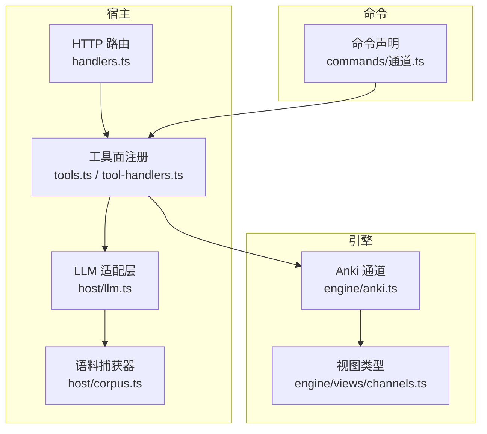
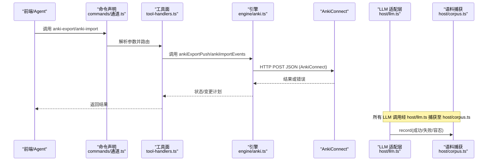
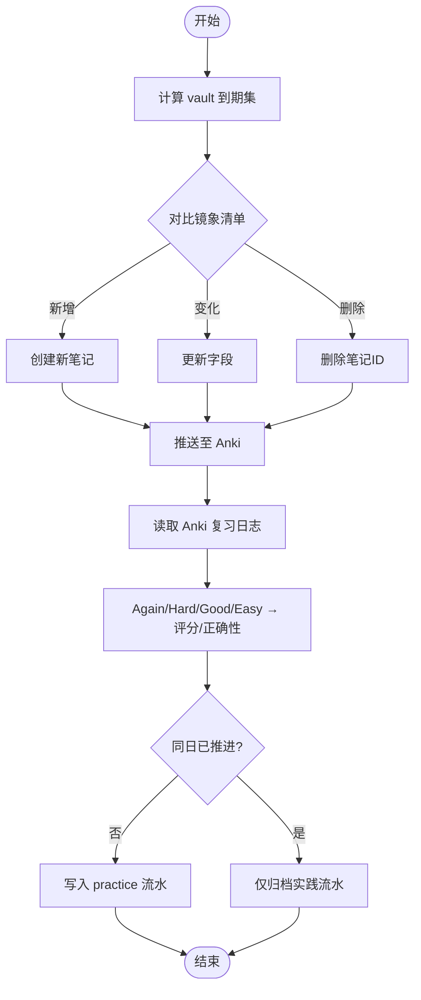
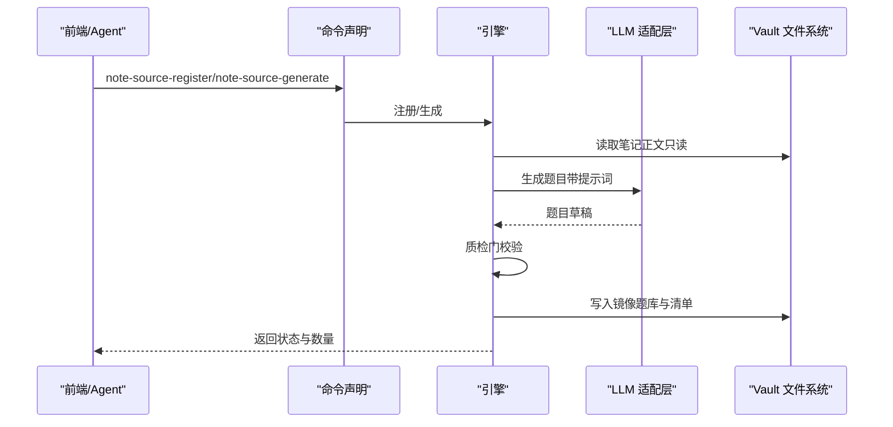
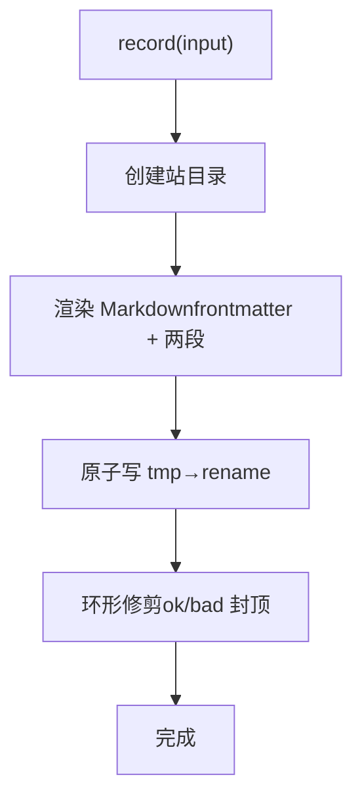
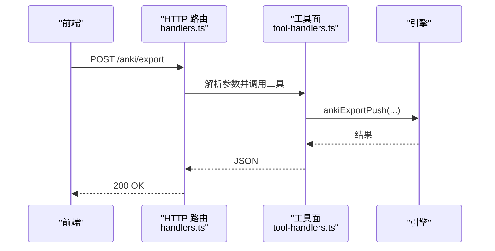
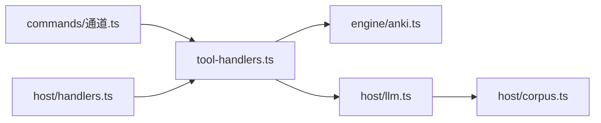

# 外部集成

<cite>
**本文引用的文件**
- [src/engine/anki.ts](file://src/engine/anki.ts)
- [src/host/llm.ts](file://src/host/llm.ts)
- [src/host/corpus.ts](file://src/host/corpus.ts)
- [src/host/tools.ts](file://src/host/tools.ts)
- [src/host/tool-handlers.ts](file://src/host/tool-handlers.ts)
- [src/engine/views/channels.ts](file://src/engine/views/channels.ts)
- [src/commands/通道.ts](file://src/commands/通道.ts)
- [src/host/http.ts](file://src/host/http.ts)
- [src/host/handlers.ts](file://src/host/handlers.ts)
- [src/host/runtime.ts](file://src/host/runtime.ts)
</cite>

## 目录
1. [简介](#简介)
2. [项目结构](#项目结构)
3. [核心组件](#核心组件)
4. [架构总览](#架构总览)
5. [详细组件分析](#详细组件分析)
6. [依赖关系分析](#依赖关系分析)
7. [性能与可靠性](#性能与可靠性)
8. [故障排除指南](#故障排除指南)
9. [结论](#结论)
10. [附录：API 与配置速查](#附录api-与配置速查)

## 简介
本文件面向“外部集成”主题，系统性说明以下能力：
- 与 Anki 的双向同步机制（卡片格式转换、双向事件回写、数据冲突解决）
- 笔记源系统集成（多格式导入导出、注册与镜像题库管理）
- 大语言模型（LLM）适配器设计（多供应商接入、语义档位、工具回路、语料捕获）
- 语料库管理系统（采集、处理、分发与环形归档）
- 与其他学习工具的集成方案与 API 接口
- 第三方服务配置与认证流程
- 集成错误处理与重试机制
- 具体集成示例与排障指引

## 项目结构
外部集成的关键代码分布在宿主层（host）、引擎层（engine）与命令/路由层（commands）。整体组织方式如下：
- 引擎层提供领域能力与纯函数接缝（如 Anki 事件映射、镜象 diff、来源键编解码）
- 宿主层负责与外部系统对接（AnkiConnect、LLM 提供商、HTTP 路由、工具面）
- 命令层声明对外暴露的 agent/面板/HTTP 端点，驱动引擎执行



图表来源
- [src/host/handlers.ts:103-144](file://src/host/handlers.ts#L103-L144)
- [src/host/tools.ts:101-126](file://src/host/tools.ts#L101-L126)
- [src/host/tool-handlers.ts:252-263](file://src/host/tool-handlers.ts#L252-L263)
- [src/host/llm.ts:167-222](file://src/host/llm.ts#L167-L222)
- [src/host/corpus.ts:186-342](file://src/host/corpus.ts#L186-L342)
- [src/engine/anki.ts:1-324](file://src/engine/anki.ts#L1-L324)
- [src/engine/views/channels.ts:1-56](file://src/engine/views/channels.ts#L1-L56)
- [src/commands/通道.ts:9-72](file://src/commands/通道.ts#L9-L72)

章节来源
- [src/host/handlers.ts:103-144](file://src/host/handlers.ts#L103-L144)
- [src/host/tools.ts:101-126](file://src/host/tools.ts#L101-L126)
- [src/host/tool-handlers.ts:252-263](file://src/host/tool-handlers.ts#L252-L263)
- [src/host/llm.ts:167-222](file://src/host/llm.ts#L167-L222)
- [src/host/corpus.ts:186-342](file://src/host/corpus.ts#L186-L342)
- [src/engine/anki.ts:1-324](file://src/engine/anki.ts#L1-L324)
- [src/engine/views/channels.ts:1-56](file://src/engine/views/channels.ts#L1-L56)
- [src/commands/通道.ts:9-72](file://src/commands/通道.ts#L9-L72)

## 核心组件
- Anki 双向通道：将 vault 到期题导出为 Anki 卡片，并将 Anki 作答事件回写至 vault；以 vault 为唯一调度者，Anki 仅作为作答通道。
- LLM 适配器：统一封装不同 AI 提供商调用，支持补全与工具回路两种形态，内置空闲超时、截断重试、语义档位翻译与语料捕获。
- 语料库管理：记录每次 LLM 调用的前后文、输出、工具调用与计量指标，按站名分桶环形归档，支持失败/容忍补标。
- 工具面与命令：通过命令声明暴露 agent/面板/HTTP 端点，驱动引擎执行外部集成操作（如 Anki 导出/导入、笔记源生成等）。

章节来源
- [src/engine/anki.ts:1-324](file://src/engine/anki.ts#L1-L324)
- [src/host/llm.ts:1-390](file://src/host/llm.ts#L1-L390)
- [src/host/corpus.ts:1-342](file://src/host/corpus.ts#L1-L342)
- [src/commands/通道.ts:9-199](file://src/commands/通道.ts#L9-L199)

## 架构总览
下图展示从 UI/Agent 到外部系统的端到端路径：命令→工具面→引擎→外部系统（Anki/LLM），以及语料捕获落盘。



图表来源
- [src/commands/通道.ts:9-72](file://src/commands/通道.ts#L9-L72)
- [src/host/tool-handlers.ts:252-263](file://src/host/tool-handlers.ts#L252-L263)
- [src/engine/anki.ts:186-324](file://src/engine/anki.ts#L186-L324)
- [src/host/llm.ts:106-222](file://src/host/llm.ts#L106-L222)
- [src/host/corpus.ts:287-342](file://src/host/corpus.ts#L287-L342)

## 详细组件分析

### Anki 双向同步
- 卡片格式转换
  - 字段对齐：题目、答案、来源；正面包含题干与选项，背面包含答案与解析；HTML 转义与换行处理。
  - 内容指纹：基于 FNV-1a 的轻量哈希，用于判断是否需要更新。
- 双向同步
  - 导出：计算 vault 到期集，生成新增/更新/移除计划，写入 Anki 卡组（每课程子牌组），标记 learnhub 标签。
  - 导入：读取 Anki 复习日志，映射 Again/Hard/Good/Easy 为评分与正确性，写入 practice 流水；同日已推进的事件去重。
- 数据冲突解决
  - 原则：vault 是唯一事实源与调度者；Anki 侧排期输出不作数，不一致时以 vault 为准重建镜象。
  - 镜象清单可丢弃：坏档静默重建，不判 Broken；孤儿卡通过来源字段回补归属。



图表来源
- [src/engine/anki.ts:58-143](file://src/engine/anki.ts#L58-L143)
- [src/engine/anki.ts:186-324](file://src/engine/anki.ts#L186-L324)

章节来源
- [src/engine/anki.ts:1-324](file://src/engine/anki.ts#L1-L324)
- [src/engine/views/channels.ts:1-56](file://src/engine/views/channels.ts#L1-L56)
- [src/commands/通道.ts:9-72](file://src/commands/通道.ts#L9-L72)

### 笔记源系统集成
- 注册与扫描
  - 支持单篇 .md 或文件夹批量登记；跳过学习中心内部路径与用户排除清单；生成镜像题库与指纹清单。
- 出题与刷新
  - 读笔记正文（只读）→ 提示词 → 模型 → 质检门 → 追加到镜像题库；新题初始化 FSRS 调度。
  - 漂移检测：当源文件被编辑后，题库清单指纹刷新；旧题不会自动归档，需显式归档。
- 列表与排除
  - 列出所有笔记源状态（ok/missing/drifted/inconsistent）与题库规模；维护用户排除清单。



图表来源
- [src/commands/通道.ts:73-199](file://src/commands/通道.ts#L73-L199)
- [src/host/tool-handlers.ts:252-257](file://src/host/tool-handlers.ts#L252-L257)

章节来源
- [src/commands/通道.ts:73-199](file://src/commands/通道.ts#L73-L199)
- [src/host/tool-handlers.ts:252-257](file://src/host/tool-handlers.ts#L252-L257)

### 大语言模型（LLM）适配器
- 多供应商接入
  - 通过宿主配置指定 provider/model；运行时注入 dsh llm 流式调用；支持思考档（fast/deep）与温度参数。
- 调用形态
  - 补全（complete）：一次性文本输出；工具回路（loop）：消息历史 + 工具白名单，返回助手轮与工具调用。
- 策略与容错
  - 空闲超时：无新输出则中止；截断重试：max-tokens 超限提高上限重试一次；不支持的思考档自动降级。
- 语料捕获
  - 成功/失败/容忍三态；记录 prompt、output、工具调用、usage 与耗时；按站名分桶环形归档。

```mermaid
classDiagram
class LlmAdapter {
+llmComplete(prompt, system, opts) Promise<string>
+llmStream(req) Promise<{text, toolCalls, usage}>
-streamWithPolicies(run, effort) Promise<any>
-streamDshTurn(ctx, req) Promise<any>
}
class CorpusCapture {
+record(input) void
+annotate(ref, patch) void
+annotateLast(station, patch) string?
+lastRef(station) string?
+flush() Promise<void>
}
LlmAdapter --> CorpusCapture : "记录调用"
```

图表来源
- [src/host/llm.ts:75-222](file://src/host/llm.ts#L75-L222)
- [src/host/corpus.ts:186-342](file://src/host/corpus.ts#L186-L342)

章节来源
- [src/host/llm.ts:1-390](file://src/host/llm.ts#L1-L390)
- [src/host/corpus.ts:1-342](file://src/host/corpus.ts#L1-L342)

### 语料库管理系统
- 采集
  - 在 LLM 适配层出口记录每次调用：时间戳、站点、形态、语义档、结果、失败码、截断、时长、usage、provider/model、prompt/output、工具调用。
- 处理
  - frontmatter 解析、段落切分（提示词/原始输出/工具调用段）；空输出占位还原；Windows 换行归一化。
- 分发
  - 按站名分目录；成功 ok 桶保留最近 25 条；失败/容忍 bad 桶保留最近 200 条；原子写（tmp+rename）；异步 fire-and-forget。
- 补标
  - 支持按相对 ref 或最近一条记录补标 outcome/code，并在 ok/bad 桶间迁移文件名。



图表来源
- [src/host/corpus.ts:226-342](file://src/host/corpus.ts#L226-L342)

章节来源
- [src/host/corpus.ts:1-342](file://src/host/corpus.ts#L1-L342)

### 与其他学习工具的集成方案与 API 接口
- Agent/面板/HTTP 三通道
  - 命令声明中为每个能力定义 agent/panel/route，统一由工具面路由到引擎实现。
- 典型端点
  - Anki：POST /anki/export、POST /anki/import、GET /anki/status
  - 笔记源：GET /note-sources、POST /note-source/register、POST /note-source/generate
  - 状态：GET /status（含 LLM 配置视图）
- 请求/响应
  - JSON 序列化；参数校验在 handlers/params 层；错误以异常形式上抛并被统一包装。



图表来源
- [src/host/handlers.ts:103-144](file://src/host/handlers.ts#L103-L144)
- [src/host/tool-handlers.ts:252-263](file://src/host/tool-handlers.ts#L252-L263)
- [src/commands/通道.ts:9-72](file://src/commands/通道.ts#L9-L72)

章节来源
- [src/commands/通道.ts:9-199](file://src/commands/通道.ts#L9-L199)
- [src/host/handlers.ts:103-144](file://src/host/handlers.ts#L103-L144)
- [src/host/http.ts:26-55](file://src/host/http.ts#L26-L55)

### 第三方服务配置与认证流程
- AnkiConnect
  - 默认端点 http://127.0.0.1:8765；需在桌面 Anki 安装 AnkiConnect 插件；连接失败抛出明确错误信息。
- LLM 提供商
  - 通过宿主配置指定 provider/model/fastEffort/deepEffort；运行时注入 dsh llm；失败携带稳定错误码（如 AUTH/RATE_LIMIT/MISSING_CREDENTIAL）。
- 配置位置
  - 宿主运行时装配 LearnhubConfig（vault/provider/model/effort 等）；LLM 配置视图可通过 /status 查看。

章节来源
- [src/engine/anki.ts:22-28](file://src/engine/anki.ts#L22-L28)
- [src/host/llm.ts:34-55](file://src/host/llm.ts#L34-L55)
- [src/host/runtime.ts:23-39](file://src/host/runtime.ts#L23-L39)

### 集成错误处理与重试机制
- AnkiConnect
  - 连接失败/HTTP 非 200/业务 error 字段均抛错；重复添加返回 null 走来源检索回补；缺失笔记识别特定错误模式。
- LLM
  - 空闲超时：固定阈值内无新输出即中止；截断重试：max-tokens 超限提高上限重试一次；不支持的思考档自动降级重试。
- 语料捕获
  - 成功记 ok（含 truncated/usage），失败记 failed 并附带稳定错误码；容忍命中由宿主 catch 点补标。

章节来源
- [src/engine/anki.ts:196-277](file://src/engine/anki.ts#L196-L277)
- [src/host/llm.ts:277-390](file://src/host/llm.ts#L277-L390)
- [src/host/corpus.ts:106-165](file://src/host/corpus.ts#L106-L165)

### 具体集成示例
- 导出到期题到 Anki
  - 调用 learnhub_anki_export（agent）或 POST /anki/export（面板），传入 endpoint（可选）；引擎计算镜象差异并推送。
- 导入 Anki 作答
  - 调用 learnhub_anki_import（agent）或 POST /anki/import（面板）；引擎拉取复习日志并回写 practice 流水。
- 生成笔记源题目
  - 调用 learnhub_note_source_generate（agent）或 POST /note-source/generate（面板）；引擎读取笔记、调用 LLM、质检并写入题库。

章节来源
- [src/commands/通道.ts:9-199](file://src/commands/通道.ts#L9-L199)
- [src/host/tool-handlers.ts:252-263](file://src/host/tool-handlers.ts#L252-L263)

## 依赖关系分析
- 耦合与内聚
  - 引擎层专注领域逻辑与纯函数接缝；宿主层聚合外部依赖（AnkiConnect、dsh llm、HTTP）；命令层声明契约，降低耦合。
- 直接依赖
  - tool-handlers 依赖 engine/anki、host/llm、host/jobs；llm 适配层依赖 dsh llm 与 corpus；corpus 独立于引擎状态。
- 外部依赖
  - AnkiConnect（HTTP JSON）；AI 提供商（通过 dsh llm）；Vault 文件系统（node:fs/promises）。



图表来源
- [src/host/tool-handlers.ts:1-288](file://src/host/tool-handlers.ts#L1-L288)
- [src/engine/anki.ts:1-324](file://src/engine/anki.ts#L1-L324)
- [src/host/llm.ts:1-390](file://src/host/llm.ts#L1-L390)
- [src/host/corpus.ts:1-342](file://src/host/corpus.ts#L1-L342)
- [src/commands/通道.ts:1-199](file://src/commands/通道.ts#L1-L199)
- [src/host/handlers.ts:103-144](file://src/host/handlers.ts#L103-L144)

章节来源
- [src/host/tool-handlers.ts:1-288](file://src/host/tool-handlers.ts#L1-L288)
- [src/engine/anki.ts:1-324](file://src/engine/anki.ts#L1-L324)
- [src/host/llm.ts:1-390](file://src/host/llm.ts#L1-L390)
- [src/host/corpus.ts:1-342](file://src/host/corpus.ts#L1-L342)
- [src/commands/通道.ts:1-199](file://src/commands/通道.ts#L1-L199)
- [src/host/handlers.ts:103-144](file://src/host/handlers.ts#L103-L144)

## 性能与可靠性
- 并发与串行
  - 语料捕获按站串行写入，避免同站竞态；异步 fire-and-forget 不阻塞主流程。
- 存储与修剪
  - 环形归档限制 ok/bad 桶大小，防止磁盘无限增长；原子写保证文件一致性。
- 网络与超时
  - AnkiConnect 直连本地，失败快速报错；LLM 空闲超时与截断重试提升鲁棒性。
- 调度一致性
  - Anki 仅作作答通道，vault 统一调度，避免双写冲突。

[本节为通用指导，无需引用具体文件]

## 故障排除指南
- AnkiConnect 无法连接
  - 确认桌面 Anki 已打开且安装 AnkiConnect 插件；检查 endpoint 是否为 http://127.0.0.1:8765；查看错误信息中的 HTTP 状态码与 error 字段。
- 卡片重复或缺失
  - 重复添加会返回 null，引擎通过来源字段检索回补；若笔记不存在，更新失败时可安全重建。
- LLM 调用失败
  - 关注稳定错误码（AUTH/RATE_LIMIT/MISSING_CREDENTIAL）；检查 provider/model 配置；必要时降低思考档或提高 max-tokens。
- 语料缺失或格式异常
  - 检查 frontmatter 是否完整；Windows 换行可能导致解析问题（已做归一化处理）；使用 annotateLast 补标最近一条记录。

章节来源
- [src/engine/anki.ts:196-277](file://src/engine/anki.ts#L196-L277)
- [src/host/llm.ts:304-390](file://src/host/llm.ts#L304-L390)
- [src/host/corpus.ts:106-165](file://src/host/corpus.ts#L106-L165)

## 结论
本插件通过清晰的层次划分与纯函数接缝，实现了与 Anki 的双向同步、笔记源的多格式集成、LLM 的多供应商适配与语料的可观测性。以 vault 为唯一事实源的原则确保了数据一致性与可恢复性；工具面与命令声明提供了统一的集成入口；完善的错误处理与重试机制保障了稳定性。建议在生产环境中结合 /status 与语料桶进行持续监控与诊断。

[本节为总结，无需引用具体文件]

## 附录：API 与配置速查
- Anki 相关
  - 导出：learnhub_anki_export（agent）/ POST /anki/export（面板）
  - 导入：learnhub_anki_import（agent）/ POST /anki/import（面板）
  - 状态：learnhub_anki_status（agent）/ GET /anki/status（面板）
- 笔记源相关
  - 列表：learnhub_note_source_list（agent）/ GET /note-sources（面板）
  - 注册：learnhub_note_source_register（agent）/ POST /note-source/register（面板）
  - 生成：learnhub_note_source_generate（agent）/ POST /note-source/generate（面板）
- 状态与配置
  - 状态：GET /status（含 LLM 配置视图）
  - 配置：LearnhubConfig（vault/provider/model/fastEffort/deepEffort/quizAuditRate/corpusDir）

章节来源
- [src/commands/通道.ts:9-199](file://src/commands/通道.ts#L9-L199)
- [src/host/handlers.ts:103-144](file://src/host/handlers.ts#L103-L144)
- [src/host/runtime.ts:23-39](file://src/host/runtime.ts#L23-L39)
- [src/host/llm.ts:47-55](file://src/host/llm.ts#L47-L55)