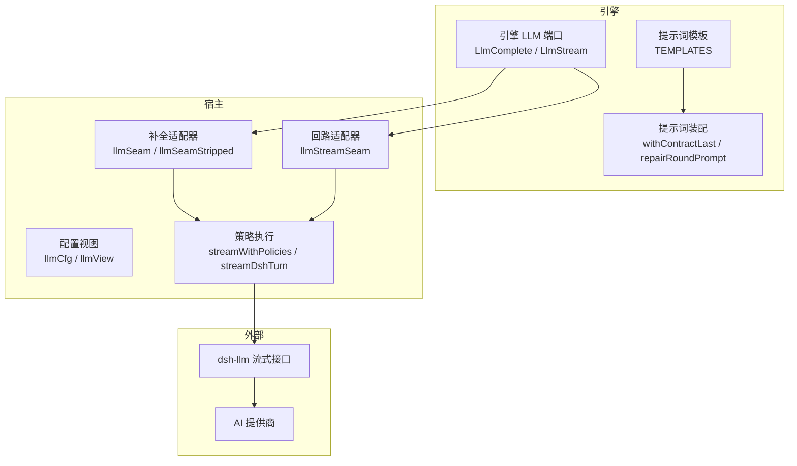
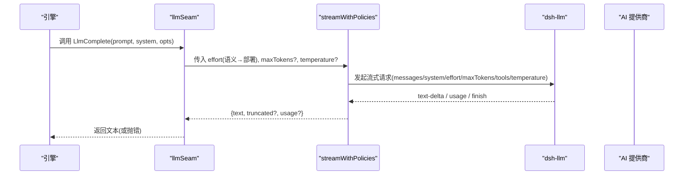
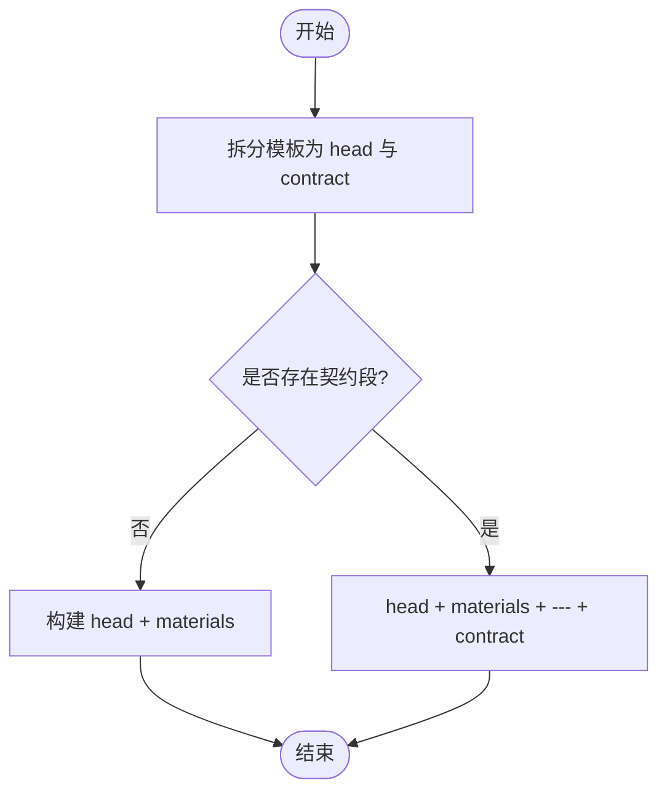
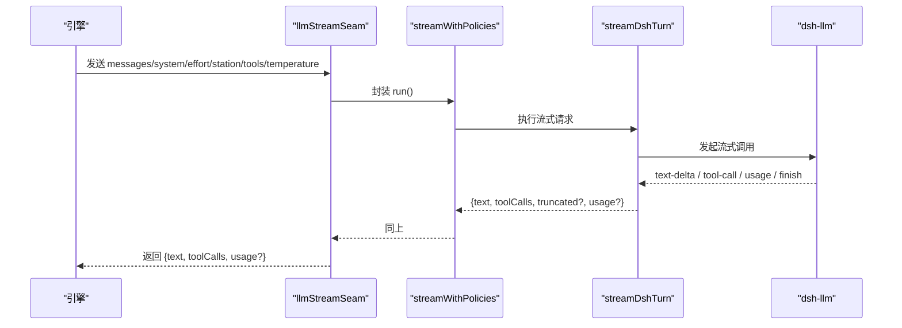
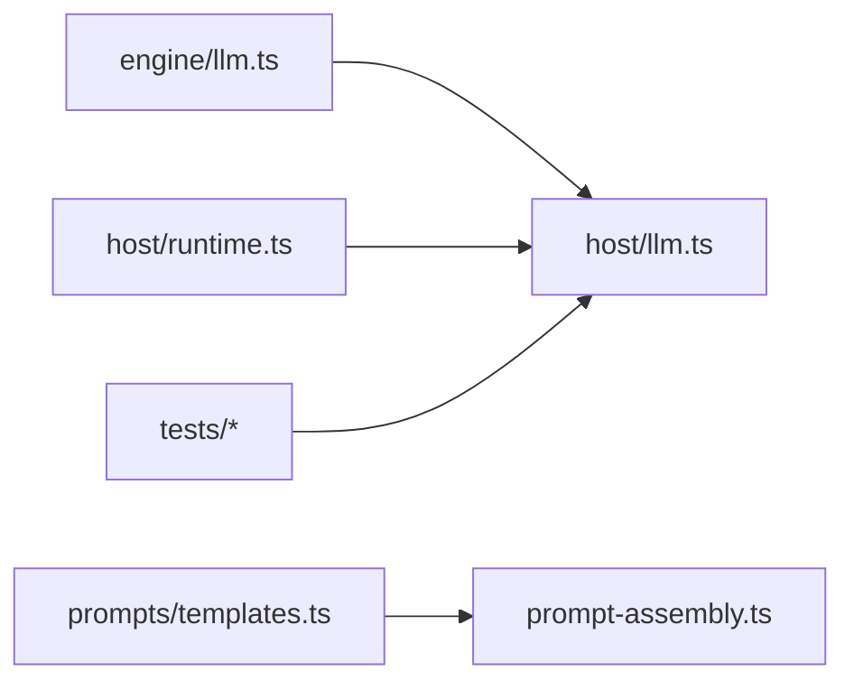

# 大语言模型适配器

<cite>
**本文引用的文件**
- [src/engine/llm.ts](file://src/engine/llm.ts)
- [src/host/llm.ts](file://src/host/llm.ts)
- [src/engine/prompt-assembly.ts](file://src/engine/prompt-assembly.ts)
- [src/engine/prompts/templates.ts](file://src/engine/prompts/templates.ts)
- [src/engine/index.ts](file://src/engine/index.ts)
- [src/host/runtime.ts](file://src/host/runtime.ts)
- [tests/llm-seam.test.ts](file://tests/llm-seam.test.ts)
- [tests/llm-temperature.test.ts](file://tests/llm-temperature.test.ts)
</cite>

## 目录
1. [简介](#简介)
2. [项目结构](#项目结构)
3. [核心组件](#核心组件)
4. [架构总览](#架构总览)
5. [详细组件分析](#详细组件分析)
6. [依赖关系分析](#依赖关系分析)
7. [性能与可靠性](#性能与可靠性)
8. [故障排查指南](#故障排查指南)
9. [结论](#结论)
10. [附录：集成新提供商示例](#附录：集成新提供商示例)

## 简介
本仓库实现了一套“宿主→引擎”的大语言模型（LLM）适配层，通过纯类型端口将引擎与具体 AI 服务提供商解耦。引擎侧只依赖接口定义，运行时由宿主注入真实实现，从而支持统一调用、提示词组装、温度参数透传、多模型切换、负载均衡与重试降级等能力。同时提供完整的提示词模板与契约后置拼装机制，确保生成质量与可观测性。

## 项目结构
- 引擎侧（engine）：定义 LLM 端口类型、提示词装配与模板管理，不包含任何外部依赖。
- 宿主侧（host）：实现 LLM 适配器，负责配置读取、策略执行（超时/重试/降级）、与 dsh-llm 的流式调用、语料捕获与 token 计量。
- 测试（tests）：覆盖温度透传、补全缝注入、回放确定性等关键不变量。

**图表来源**
- [src/engine/llm.ts:14-83](file://src/engine/llm.ts#L14-L83)
- [src/host/llm.ts:34-55, 173-222, 281-390:34-55](file://src/host/llm.ts#L34-L55)
- [src/engine/prompt-assembly.ts:14-43](file://src/engine/prompt-assembly.ts#L14-L43)
- [src/engine/prompts/templates.ts:16-602](file://src/engine/prompts/templates.ts#L16-L602)

**章节来源**
- [src/engine/llm.ts:14-83](file://src/engine/llm.ts#L14-L83)
- [src/host/llm.ts:34-55, 173-222, 281-390:34-55](file://src/host/llm.ts#L34-L55)
- [src/engine/prompt-assembly.ts:14-43](file://src/engine/prompt-assembly.ts#L14-L43)
- [src/engine/prompts/templates.ts:16-602](file://src/engine/prompts/templates.ts#L16-L602)

## 核心组件
- 引擎 LLM 端口
  - LlmComplete：单发补全（prompt/system + 可选 effort/station/kind/usageSink/temperature）。
  - LlmStream：工具回路流式请求（messages/system/effort/station/tools/temperature），返回文本、工具调用与可选 token 用量。
  - LlmTokenUsage：inputTokens/outputTokens/reasoningTokens（可选）。
- 宿主适配器
  - llmSeam / llmSeamStripped：将引擎语义档 fast/deep 翻译为部署档 off/low，并处理捕获、站标签、温度透传。
  - llmStreamSeam：将端口中立消息转换为 dsh 消息，透传 tools 与 temperature，复用同一策略。
  - streamWithPolicies / streamDshTurn：空闲超时、截断重试、不支持档位自动降级、token 计量投影。
- 提示词系统
  - TEMPLATES：集中管理的生成站模板集合。
  - withContractLast / splitContractSection：将“输出契约段”置于最终 prompt 末尾，避免“中间丢失”。
  - repairRoundPrompt：修复轮提示词构造（材料+校验清单+契约置尾）。

**章节来源**
- [src/engine/llm.ts:14-83](file://src/engine/llm.ts#L14-L83)
- [src/host/llm.ts:34-55, 173-222, 281-390:34-55](file://src/host/llm.ts#L34-L55)
- [src/engine/prompt-assembly.ts:14-43](file://src/engine/prompt-assembly.ts#L14-L43)
- [src/engine/prompts/templates.ts:16-602](file://src/engine/prompts/templates.ts#L16-L602)

## 架构总览
适配器采用“引擎纯类型 + 宿主实现”的分层设计：
- 引擎仅声明 LlmComplete/LlmStream 端口，不感知 provider/model/effort 的具体值。
- 宿主在运行时注入实现，负责：
  - 配置读取与视图暴露（provider/model/fastEffort/deepEffort）。
  - 语义档到部署档的翻译。
  - 流式调用、空闲超时、截断重试、不支持档位降级。
  - 温度参数透传（缺省不传，保持宿主默认）。
  - 语料捕获与 token 计量回调。

**图表来源**
- [src/host/llm.ts:75-104, 281-390:75-104](file://src/host/llm.ts#L75-L104)
- [src/host/llm.ts:318-390](file://src/host/llm.ts#L318-L390)

**章节来源**
- [src/host/llm.ts:75-104, 281-390:75-104](file://src/host/llm.ts#L75-L104)

## 详细组件分析

### 提示词组装系统
- 模板集中管理：TEMPLATES 键为站点名，值为惰性字符串（不含插值），由运行时注入上下文包。
- 契约后置：splitContractSection 定位最后一个“## 输出…”标题至末尾作为契约段；withContractLast 将材料置于 head 之后、契约之前，保证模型最后读到“只输出 X”的强约束。
- 修复轮：repairRoundPrompt 将上次产出与校验清单插入材料区，契约仍置尾，避免被覆盖。

**图表来源**
- [src/engine/prompt-assembly.ts:14-43](file://src/engine/prompt-assembly.ts#L14-L43)

**章节来源**
- [src/engine/prompt-assembly.ts:14-43](file://src/engine/prompt-assembly.ts#L14-L43)
- [src/engine/prompts/templates.ts:16-602](file://src/engine/prompts/templates.ts#L16-L602)

### 模型调用流程（补全与回路）
- 补全流程（LlmComplete）
  - 入口：llmSeam → llmComplete → withCapture → streamWithPolicies → streamDshTurn。
  - 策略：
    - 空闲超时：无新 chunk 达到阈值则中止。
    - 截断重试：finish reason 为 max-tokens 时提高 maxTokens 重试一次。
    - 档位降级：若路由不支持 reasoningEffort，捕获错误码后以部署默认重试一次。
  - 温度透传：opts.temperature 存在即原样传入；缺失则不传，走宿主默认。
- 回流程（LlmStream）
  - 入口：llmStreamSeam → withCapture → streamWithPolicies → streamDshTurn。
  - 消息转换：端口中立 LlmLoopTurn → dsh Message（user/assistant/tool-result）。
  - 工具白名单：tools 直通 provider function calling。
  - 温度透传：req.temperature 存在即传入；缺失不传。

**图表来源**
- [src/host/llm.ts:201-222, 318-390:201-222](file://src/host/llm.ts#L201-L222)
- [src/host/llm.ts:281-390](file://src/host/llm.ts#L281-L390)

**章节来源**
- [src/host/llm.ts:75-104, 201-222, 281-390:75-104](file://src/host/llm.ts#L75-L104)

### 温度参数传递机制与采样策略
- 引擎端口允许 temperature 可选；默认不传，保持宿主默认行为。
- 适配器在 llmComplete 与 llmStreamSeam 中检测 presence 再决定是否传入 provider。
- 测试保障：未显式设置 temperature 时，下游请求不应出现该键；显式设置时应原样透传。

**章节来源**
- [src/engine/llm.ts:29-45, 70-83:29-45](file://src/engine/llm.ts#L29-L45)
- [src/host/llm.ts:75-104, 201-222:75-104](file://src/host/llm.ts#L75-L104)
- [tests/llm-temperature.test.ts:1-120](file://tests/llm-temperature.test.ts#L1-L120)

### 多模型切换与负载均衡
- 模型切换：通过宿主配置 llmCfg.provider/model 控制；llmView 暴露当前配置供面板只读展示。
- 负载均衡：仓库内未见针对 LLM 调用的多 provider 轮询/权重分配逻辑；当前为单 provider 模式。如需扩展，可在 streamDshTurn 上游增加选择器与重试策略。

**章节来源**
- [src/host/llm.ts:34-55](file://src/host/llm.ts#L34-L55)
- [src/host/runtime.ts:23-41](file://src/host/runtime.ts#L23-L41)

### 支持的模型提供商、API 密钥与认证
- 当前实现绑定 dsh-llm 的 provider 与 model 字段，默认使用 deepseek-official 与 deepseek-v4-flash。
- 认证与凭据由 dsh-llm 与宿主环境管理；插件侧不直接持有 API Key。
- 可通过编辑宿主 profile patch 调整 provider/model/effort 后重启生效。

**章节来源**
- [src/host/llm.ts:34-55](file://src/host/llm.ts#L34-L55)
- [src/host/runtime.ts:23-41](file://src/host/runtime.ts#L23-L41)

### 错误处理与重试策略
- 空闲超时：LLM_IDLE_TIMEOUT_MS 内无新输出则中止并抛出明确错误。
- 截断重试：当 finish reason 为 max-tokens 时，提高 maxTokens 并重试一次。
- 档位降级：若路由不支持 reasoningEffort，捕获特定错误码后以部署默认重试一次。
- 失败记录：withCapture 对成功/失败均落语料，包含 station/kind/effort/provider/model/duration/truncated/usage 等。

**章节来源**
- [src/host/llm.ts:64-68, 281-390:64-68](file://src/host/llm.ts#L64-L68)

## 依赖关系分析
- 引擎模块仅依赖自身类型与提示词装配函数，零外部耦合。
- 宿主适配器依赖 cordis Context 与 dsh-llm，承担所有外部交互。
- 运行时（runtime）装配 llmSeam/llmStreamSeam 并注入到宿主服务。

**图表来源**
- [src/engine/llm.ts:14-83](file://src/engine/llm.ts#L14-L83)
- [src/host/llm.ts:1-390](file://src/host/llm.ts#L1-L390)
- [src/host/runtime.ts:18-41](file://src/host/runtime.ts#L18-L41)

**章节来源**
- [src/engine/index.ts:88-88](file://src/engine/index.ts#L88-L88)
- [src/host/runtime.ts:18-41](file://src/host/runtime.ts#L18-L41)

## 性能与可靠性
- 流式处理：按 chunk 累积文本与工具调用，降低首字节延迟。
- 空闲超时：防止长时无响应阻塞资源。
- 截断重试：缓解 max-tokens 导致的 JSON/YAML 不完整问题。
- 档位降级：在不支持 reasoningEffort 的路由上自动回退，提升兼容性。
- 语料捕获：每次调用记录完整上下文与结果，便于离线评审与回溯。

[本节为通用指导，无需特定文件引用]

## 故障排查指南
- 常见问题定位
  - 无输出：检查是否触发“没有返回内容”异常。
  - 超时：确认空闲超时阈值与网络状况。
  - 截断：观察 truncated 标记与日志中的“提高输出上限重试”提示。
  - 档位不支持：捕获 UNSUPPORTED_REASONING_EFFORT 并确认已降级重试。
  - 认证/配额：查看 failure.code（如 AUTH/RATE_LIMIT）与状态码。
- 调试建议
  - 启用语料捕获，核对 station/kind/effort/provider/model 与 prompt/output。
  - 使用测试假实现进行金样本回放，确保链路确定性。
  - 通过 llmView 确认当前 provider/model/effort 配置。

**章节来源**
- [src/host/llm.ts:106-165, 318-390:106-165](file://src/host/llm.ts#L106-L165)
- [tests/llm-seam.test.ts:1-25](file://tests/llm-seam.test.ts#L1-L25)

## 结论
本适配器通过清晰的端口抽象与宿主实现分离，实现了统一的 LLM 调用面，支持提示词契约后置、温度透传、流式工具回路、空闲超时、截断重试与档位降级等关键能力。当前为单 provider 模式，模型切换通过宿主配置完成。建议在需要时在上游引入多 provider 选择与负载均衡策略，并结合语料捕获与测试回放完善可观测性与稳定性。

[本节为总结性内容，无需特定文件引用]

## 附录：集成新提供商示例
目标：在不改动引擎代码的前提下，接入新的 AI 提供商。

步骤
- 修改宿主配置
  - 在宿主配置中更新 provider 与 model（例如改为新提供商的标识与模型名）。
  - 根据需要调整 fastEffort/deepEffort 以匹配新提供商的思考档位支持。
- 验证温度透传
  - 确保调用点不显式设置 temperature 时，下游请求不携带该键；显式设置时原样透传。
- 验证重试与降级
  - 模拟截断与不支持档位场景，确认自动重试与降级逻辑生效。
- 验证语料捕获
  - 检查捕获记录中的 provider/model/effort/station/kind 是否正确。
- 回归测试
  - 运行现有测试（如温度透传、补全缝注入）确保不变量不被破坏。

参考位置
- 配置视图与默认值：[src/host/llm.ts:34-55](file://src/host/llm.ts#L34-L55)
- 补全与回路适配器：[src/host/llm.ts:173-222](file://src/host/llm.ts#L173-L222)
- 策略执行与重试：[src/host/llm.ts:281-390](file://src/host/llm.ts#L281-L390)
- 温度透传测试：[tests/llm-temperature.test.ts:1-120](file://tests/llm-temperature.test.ts#L1-L120)

**章节来源**
- [src/host/llm.ts:34-55, 173-222, 281-390:34-55](file://src/host/llm.ts#L34-L55)
- [tests/llm-temperature.test.ts:1-120](file://tests/llm-temperature.test.ts#L1-L120)