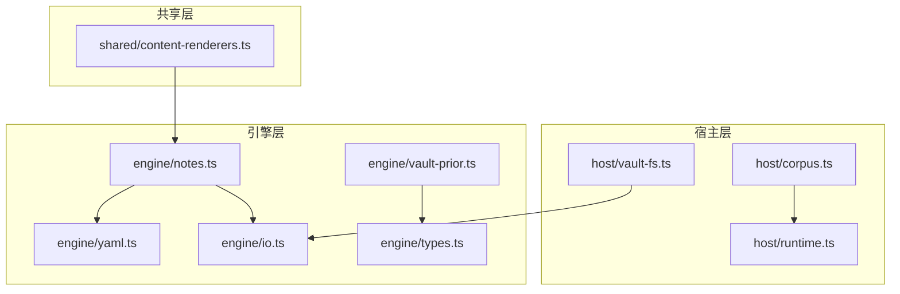
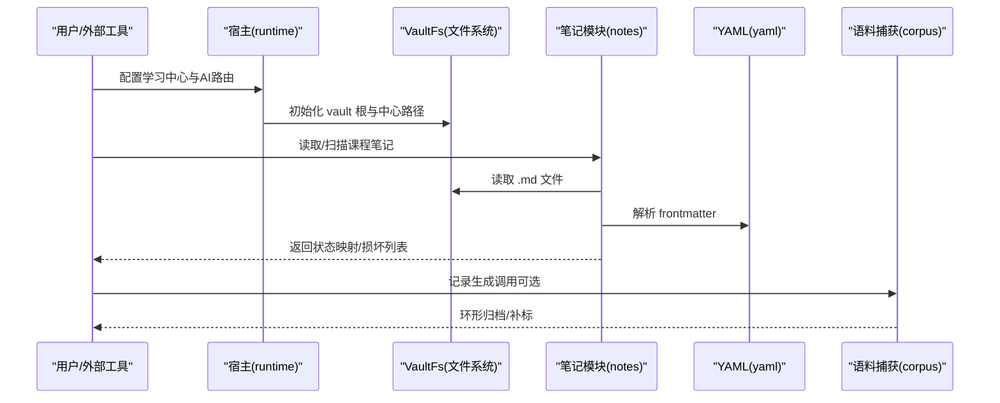
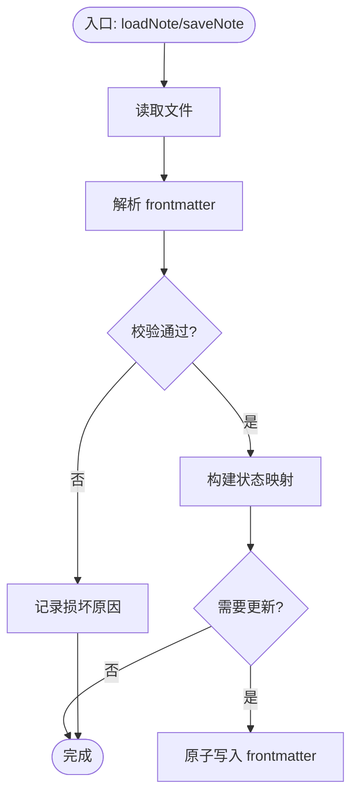
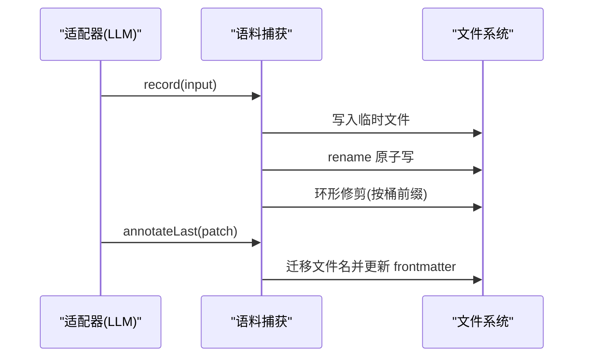
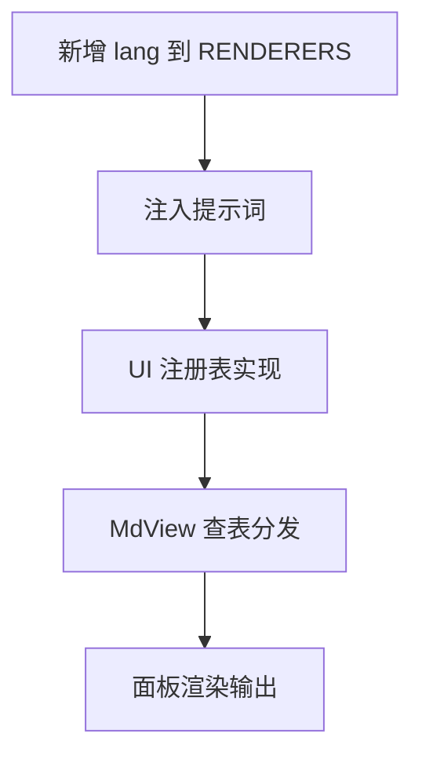
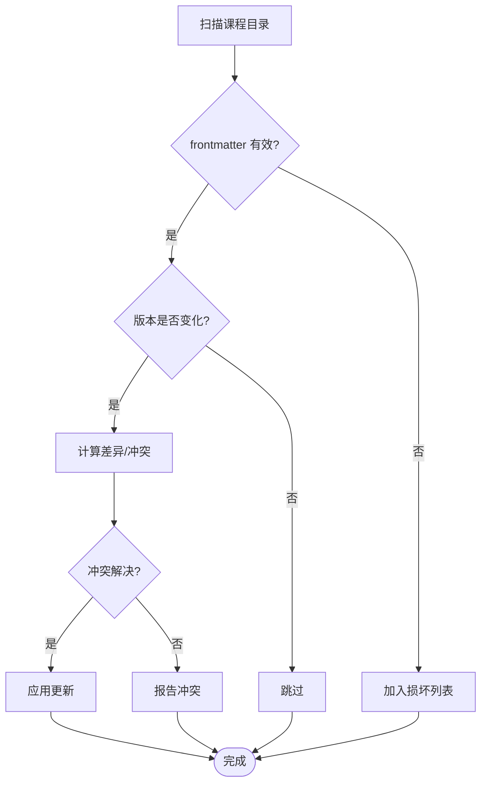
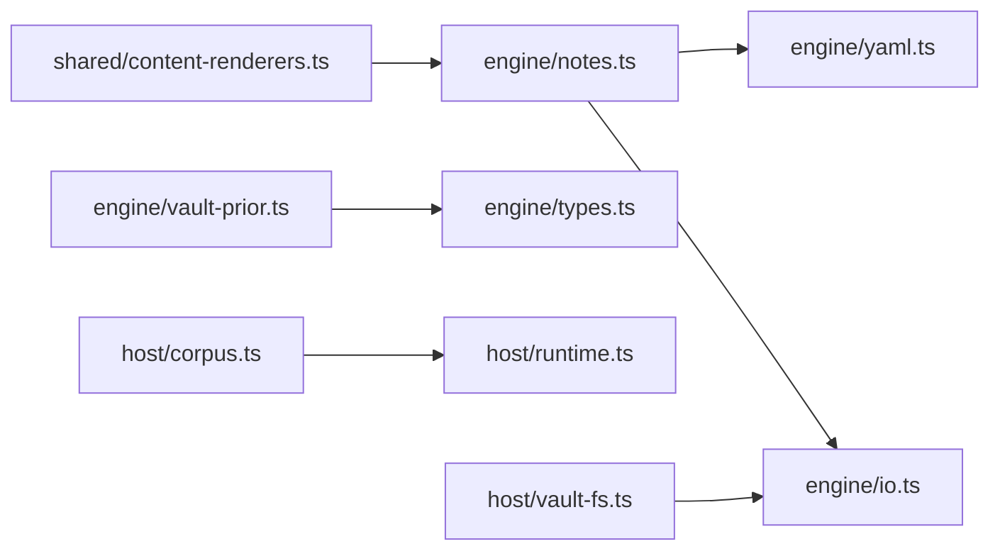

# 笔记系统集成

<cite>
**本文引用的文件**
- [notes.ts](file://src/engine/notes.ts)
- [vault-fs.ts](file://src/host/vault-fs.ts)
- [yaml.ts](file://src/engine/yaml.ts)
- [io.ts](file://src/engine/io.ts)
- [types.ts](file://src/engine/types.ts)
- [content-renderers.ts](file://shared/content-renderers.ts)
- [corpus.ts](file://src/host/corpus.ts)
- [runtime.ts](file://src/host/runtime.ts)
- [vault-prior.ts](file://src/engine/vault-prior.ts)
- [0010-c1-note-source-mirror-readonly.md](file://docs/adr/0010-c1-note-source-mirror-readonly.md)
- [2026-09-learning-expansion-requirements.md](file://docs/design/2026-09-learning-expansion-requirements.md)
</cite>

## 目录
1. [简介](#简介)
2. [项目结构](#项目结构)
3. [核心组件](#核心组件)
4. [架构总览](#架构总览)
5. [详细组件分析](#详细组件分析)
6. [依赖关系分析](#依赖关系分析)
7. [性能考虑](#性能考虑)
8. [故障排除指南](#故障排除指南)
9. [结论](#结论)
10. [附录](#附录)

## 简介
本文件系统性地说明“笔记系统集成”的设计与实现，覆盖以下目标：
- 笔记源系统架构：以 Vault 为事实源，引擎通过抽象存储端口访问文件系统，确保可替换与可测试。
- 多格式导入导出：基于 YAML frontmatter 的 Markdown 课程笔记读写、校验与渲染；统一 YAML 解析出口，兼容模型输出围栏与 HTML 注释等噪声。
- Obsidian 集成方案：Vault 文件系统操作、frontmatter 处理、元数据同步策略（只读镜像、零写用户笔记）。
- 语料库管理：生成调用全量落盘、环形封顶、补标迁移、工具调用载荷保留。
- 内容渲染器扩展：共享渲染能力清单，注入提示词与 UI 渲染表，支持自定义格式输出。
- 双向同步策略：增量更新、冲突检测、版本控制（frontmatter 作为调度事实源，原子写保障一致性）。
- 配置与环境：学习中心路径、AI 路由、语料目录等关键配置项。
- 常见集成场景：与 Notion、Roam Research 等工具的对接思路与约束。
- 故障排除与性能优化：常见问题定位与优化建议。

## 项目结构
仓库采用“引擎-宿主-共享-前端”分层组织：
- engine：领域逻辑（笔记 frontmatter、YAML、内容子系统、先验检索、类型定义等）
- host：运行时装配、文件系统适配、语料捕获、HTTP/工具路由
- shared：跨端共享的渲染器与节类型清单
- ui：面板与交互
- docs/adr、design：架构决策与设计需求
- scripts：构建与运维脚本



图表来源
- [vault-fs.ts:1-25](file://src/host/vault-fs.ts#L1-L25)
- [notes.ts:1-35](file://src/engine/notes.ts#L1-L35)
- [yaml.ts:1-54](file://src/engine/yaml.ts#L1-L54)
- [io.ts:1-103](file://src/engine/io.ts#L1-L103)
- [types.ts:1-61](file://src/engine/types.ts#L1-L61)
- [vault-prior.ts:1-40](file://src/engine/vault-prior.ts#L1-L40)
- [content-renderers.ts:1-67](file://shared/content-renderers.ts#L1-L67)
- [corpus.ts:1-30](file://src/host/corpus.ts#L1-L30)
- [runtime.ts:23-41](file://src/host/runtime.ts#L23-L41)

章节来源
- [vault-fs.ts:1-25](file://src/host/vault-fs.ts#L1-L25)
- [notes.ts:1-35](file://src/engine/notes.ts#L1-L35)
- [yaml.ts:1-54](file://src/engine/yaml.ts#L1-L54)
- [io.ts:1-103](file://src/engine/io.ts#L1-L103)
- [types.ts:1-61](file://src/engine/types.ts#L1-L61)
- [vault-prior.ts:1-40](file://src/engine/vault-prior.ts#L1-L40)
- [content-renderers.ts:1-67](file://shared/content-renderers.ts#L1-L67)
- [corpus.ts:1-30](file://src/host/corpus.ts#L1-L30)
- [runtime.ts:23-41](file://src/host/runtime.ts#L23-L41)

## 核心组件
- 笔记 frontmatter 读写与校验：提供默认 frontmatter、拆分 frontmatter/正文、状态扫描、原子写入与就地更新。
- 统一 YAML 出口：集中 parse/stringify，对模型输出做围栏剥离与 HTML 注释容忍。
- Vault 文件系统适配：将 node:fs 暴露为 VaultFs 接口，引擎侧零直接依赖文件系统。
- 内容渲染器清单：声明支持的代码块语言、节类型、预测门解析，供引擎与 UI 共享。
- 语料捕获：记录 LLM 调用前后文、结果、工具调用，环形归档与补标迁移。
- 运行时配置：学习中心路径、AI provider/model、语料目录等装配参数。
- Vault 先验检索：BM25 式打分、概念登记表扩展、审计可观测，注入生成上下文。

章节来源
- [notes.ts:18-63](file://src/engine/notes.ts#L18-L63)
- [notes.ts:88-219](file://src/engine/notes.ts#L88-L219)
- [yaml.ts:20-53](file://src/engine/yaml.ts#L20-L53)
- [vault-fs.ts:11-24](file://src/host/vault-fs.ts#L11-L24)
- [content-renderers.ts:24-67](file://shared/content-renderers.ts#L24-L67)
- [corpus.ts:27-72](file://src/host/corpus.ts#L27-L72)
- [runtime.ts:23-41](file://src/host/runtime.ts#L23-L41)
- [vault-prior.ts:1-40](file://src/engine/vault-prior.ts#L1-L40)

## 架构总览
系统围绕“Vault 即事实源”的原则设计：
- 引擎通过 VaultFs 抽象访问文件系统，避免耦合具体实现。
- 笔记 frontmatter 是调度状态唯一事实源，所有变更原子写回同一份文件。
- 宿主负责装配运行时、注册文件系统适配、挂载语料捕获与 HTTP 路由。
- 共享渲染器清单在引擎与 UI 间保持一致，扩展新格式只需两处登记。



图表来源
- [runtime.ts:145-162](file://src/host/runtime.ts#L145-L162)
- [vault-fs.ts:11-24](file://src/host/vault-fs.ts#L11-L24)
- [notes.ts:66-74](file://src/engine/notes.ts#L66-L74)
- [yaml.ts:20-53](file://src/engine/yaml.ts#L20-L53)
- [corpus.ts:287-340](file://src/host/corpus.ts#L287-L340)

## 详细组件分析

### 笔记 frontmatter 与课程状态
- 默认 frontmatter：包含节点名、阶段、FSRS、内容版本与练习统计。
- 拆分 frontmatter/正文：兼容 CRLF，宽容解析失败，返回正文与结构化 frontmatter。
- 校验与规范化：严格校验 stage、content.status、sections、practice 字段，保留未知顶层键。
- 扫描与状态映射：递归遍历课程目录，分类合法状态与损坏文件（含原因）。
- 原子写入与就地更新：保证调度事实源一致性，正文不动仅 patch frontmatter。



图表来源
- [notes.ts:37-74](file://src/engine/notes.ts#L37-L74)
- [notes.ts:88-219](file://src/engine/notes.ts#L88-L219)
- [notes.ts:247-319](file://src/engine/notes.ts#L247-L319)
- [io.ts:30-39](file://src/engine/io.ts#L30-L39)

章节来源
- [notes.ts:18-63](file://src/engine/notes.ts#L18-L63)
- [notes.ts:88-219](file://src/engine/notes.ts#L88-L219)
- [notes.ts:247-319](file://src/engine/notes.ts#L247-L319)
- [io.ts:30-39](file://src/engine/io.ts#L30-L39)

### Obsidian 集成方案（Vault 文件系统与只读纪律）
- 文件系统适配：通过 VaultFs 封装 node:fs，引擎侧不直接 import 文件系统。
- 只读镜像：个人笔记注册为复习源时，引擎零写入用户笔记，派生物落在学习中心镜像区。
- 链接与导航：产物内插入 Obsidian 链接指向个人笔记；个人笔记通过 backlink 看到关联卡池状态。
- 漂移治理：笔记删除/改名导致 Missing（合法空态），正文编辑触发内容漂移提示。

```mermaid
classDiagram
class VaultFs {
+readFile(path) Promise<string>
+readdirTypes(path) Promise<Array<{name,directory}>>
+statIsFile(path) Promise<boolean>
+statMtimeMs(path) Promise<number>
}
class NodeVaultFs {
+readFile()
+readdirTypes()
+statIsFile()
+statMtimeMs()
}
VaultFs <|.. NodeVaultFs : "实现"
```

图表来源
- [vault-fs.ts:11-24](file://src/host/vault-fs.ts#L11-L24)
- [io.ts:9-28](file://src/engine/io.ts#L9-L28)

章节来源
- [vault-fs.ts:1-25](file://src/host/vault-fs.ts#L1-L25)
- [0010-c1-note-source-mirror-readonly.md:1-8](file://docs/adr/0010-c1-note-source-mirror-readonly.md#L1-L8)
- [2026-09-learning-expansion-requirements.md:29-40](file://docs/design/2026-09-learning-expansion-requirements.md#L29-L40)

### 语料库管理系统（采集、预处理、分发）
- 采集：每次 LLM 调用记录 prompt、output、toolCalls、usage、duration、provider/model。
- 预处理：标准化行尾、解析 frontmatter、提取提示词与原始输出段、工具调用段。
- 分发：按站分目录、环形封顶（ok/bad）、补标迁移（outcome/code 变更）、站内串行写链。



图表来源
- [corpus.ts:28-72](file://src/host/corpus.ts#L28-L72)
- [corpus.ts:112-184](file://src/host/corpus.ts#L112-L184)
- [corpus.ts:287-340](file://src/host/corpus.ts#L287-L340)

章节来源
- [corpus.ts:28-72](file://src/host/corpus.ts#L28-L72)
- [corpus.ts:112-184](file://src/host/corpus.ts#L112-L184)
- [corpus.ts:287-340](file://src/host/corpus.ts#L287-L340)

### 内容渲染器扩展机制
- 渲染器清单：声明支持的代码块语言（mermaid、math、media、interactive、svg、plot、chart），并提供示例与提示。
- 节类型：概念、例题、演示、小结、练习、交互、思维轨迹，用于生成与解析。
- 预测门：解析 learnhub-predict 围栏块，支持“先预测再揭晓”的阅读流。
- 扩展方式：新增 lang 到 RENDERERS，并在 UI 注册表添加实现，两侧自动同步。



图表来源
- [content-renderers.ts:24-67](file://shared/content-renderers.ts#L24-L67)
- [content-renderers.ts:77-108](file://shared/content-renderers.ts#L77-L108)
- [content-renderers.ts:117-197](file://shared/content-renderers.ts#L117-L197)

章节来源
- [content-renderers.ts:24-67](file://shared/content-renderers.ts#L24-L67)
- [content-renderers.ts:77-108](file://shared/content-renderers.ts#L77-L108)
- [content-renderers.ts:117-197](file://shared/content-renderers.ts#L117-L197)

### 双向同步策略（增量、冲突、版本控制）
- 增量更新：frontmatter 中 content.version 与 sections.version 追踪重写次数；stateMap 扫描识别 ready/draft/flagged。
- 冲突检测：笔记正文指纹与题库镜像比对，内容漂移提示重新出题或归档旧题。
- 版本控制：原子写保障 frontmatter 一致性；缺失/损坏文件进入 broken 列表，便于修复。



图表来源
- [notes.ts:247-319](file://src/engine/notes.ts#L247-L319)
- [notes.ts:315-328](file://src/engine/notes.ts#L315-L328)
- [io.ts:30-39](file://src/engine/io.ts#L30-L39)

章节来源
- [notes.ts:247-319](file://src/engine/notes.ts#L247-L319)
- [notes.ts:315-328](file://src/engine/notes.ts#L315-L328)
- [io.ts:30-39](file://src/engine/io.ts#L30-L39)

### 配置文件结构与环境变量
- 学习中心路径：centerRel 相对 vault 的路径，缺省“学习中心”。
- AI 路由：provider 与 model 指定 LLM 服务与模型。
- 思考档档位：fastEffort/deepEffort 控制机械调用与高复杂度节点的思考深度。
- 语料目录：可覆盖生成语料落盘目录，便于离线评审抽样。
- 新鲜库初始化：首次启动自动创建 schema 版本戳与基础结构。

章节来源
- [runtime.ts:23-41](file://src/host/runtime.ts#L23-L41)
- [runtime.ts:145-162](file://src/host/runtime.ts#L145-L162)

### 常见集成场景（Notion、Roam Research 等）
- 导入思路：将外部平台内容转换为 Markdown + YAML frontmatter，放入 Vault 对应目录，通过 notes.ts 扫描与校验纳入学习中心。
- 导出思路：使用 content-renderers.ts 的渲染器清单，将学习产物输出为 Markdown/HTML/SVG/图表等格式，便于在外部平台展示。
- 约束与纪律：遵循只读镜像原则，引擎不直接修改用户笔记；产物落在学习中心输出区，并通过 Obsidian 链接引用个人笔记。

章节来源
- [0010-c1-note-source-mirror-readonly.md:1-8](file://docs/adr/0010-c1-note-source-mirror-readonly.md#L1-L8)
- [2026-09-learning-expansion-requirements.md:29-40](file://docs/design/2026-09-learning-expansion-requirements.md#L29-L40)
- [content-renderers.ts:24-67](file://shared/content-renderers.ts#L24-L67)

## 依赖关系分析
- 引擎与宿主解耦：engine 通过 VaultFs 接口与 host 实现分离，便于替换存储后端。
- YAML 统一出口：所有 YAML 解析/序列化集中在 yaml.ts，避免分散实现导致不一致。
- 渲染器共享：shared/content-renderers.ts 同时服务于引擎提示词与 UI 渲染，减少维护成本。
- 语料捕获与运行时：host/corpus.ts 与 host/runtime.ts 协作，确保生成过程可观测与可回放。



图表来源
- [notes.ts:1-15](file://src/engine/notes.ts#L1-L15)
- [yaml.ts:1-9](file://src/engine/yaml.ts#L1-L9)
- [io.ts:1-28](file://src/engine/io.ts#L1-L28)
- [vault-prior.ts:41-47](file://src/engine/vault-prior.ts#L41-L47)
- [corpus.ts:23-25](file://src/host/corpus.ts#L23-L25)
- [runtime.ts:18-22](file://src/host/runtime.ts#L18-L22)
- [content-renderers.ts:1-9](file://shared/content-renderers.ts#L1-L9)

章节来源
- [notes.ts:1-15](file://src/engine/notes.ts#L1-L15)
- [yaml.ts:1-9](file://src/engine/yaml.ts#L1-L9)
- [io.ts:1-28](file://src/engine/io.ts#L1-L28)
- [vault-prior.ts:41-47](file://src/engine/vault-prior.ts#L41-L47)
- [corpus.ts:23-25](file://src/host/corpus.ts#L23-L25)
- [runtime.ts:18-22](file://src/host/runtime.ts#L18-L22)
- [content-renderers.ts:1-9](file://shared/content-renderers.ts#L1-L9)

## 性能考虑
- 原子写：使用临时文件+rename 避免部分写入导致的损坏，提升可靠性。
- 环形归档：语料按桶前缀分组并限制数量，防止磁盘无限增长。
- 扫描优化：Vault 先验检索使用 BM25 式打分与 mtime 优先，减少无关文件扫描。
- 并发控制：站内写链串行，避免同站并发写冲突。

章节来源
- [io.ts:30-39](file://src/engine/io.ts#L30-L39)
- [corpus.ts:264-278](file://src/host/corpus.ts#L264-L278)
- [vault-prior.ts:96-101](file://src/engine/vault-prior.ts#L96-L101)
- [corpus.ts:191-204](file://src/host/corpus.ts#L191-L204)

## 故障排除指南
- frontmatter 解析失败：检查 YAML 语法与 CRLF 兼容性，确认 frontmatter 闭合标记。
- 损坏文件：查看 scanCourseNotes 返回的 broken 列表，根据原因修复或删除。
- 语料缺失：确认 corpusDir 存在且可写，检查环形归档是否被误删。
- 渲染器未注册：新增 lang 需同时在 shared/content-renderers.ts 与 UI 注册表添加实现。
- 配置错误：验证 centerRel、provider、model 等必填项，确保学习中心目录存在。

章节来源
- [notes.ts:37-74](file://src/engine/notes.ts#L37-L74)
- [notes.ts:247-319](file://src/engine/notes.ts#L247-L319)
- [corpus.ts:287-340](file://src/host/corpus.ts#L287-L340)
- [content-renderers.ts:24-67](file://shared/content-renderers.ts#L24-L67)
- [runtime.ts:145-162](file://src/host/runtime.ts#L145-L162)

## 结论
本系统集成以 Vault 为核心事实源，通过抽象存储端口、统一 YAML 出口、共享渲染器清单与语料捕获机制，实现了可扩展、可观测、可维护的笔记学习与内容生成流水线。Obsidian 集成遵循只读镜像原则，确保用户数据主权；双向同步策略保障内容一致性与版本可控。配置与环境设置清晰，常见集成场景具备可操作性。通过故障排除与性能优化建议，系统可在实际使用中保持稳定高效。

## 附录
- 术语表：
  - Vault：个人笔记仓库（如 Obsidian Vault）
  - 学习中心：引擎管理的课程内容与状态目录
  - frontmatter：Markdown 文件开头的 YAML 元数据块
  - 语料：LLM 调用的输入输出记录，用于评审与回放
- 参考文档：
  - ADR-0010：个人笔记复习源只读镜像
  - 设计需求：Vault 全域集成要求