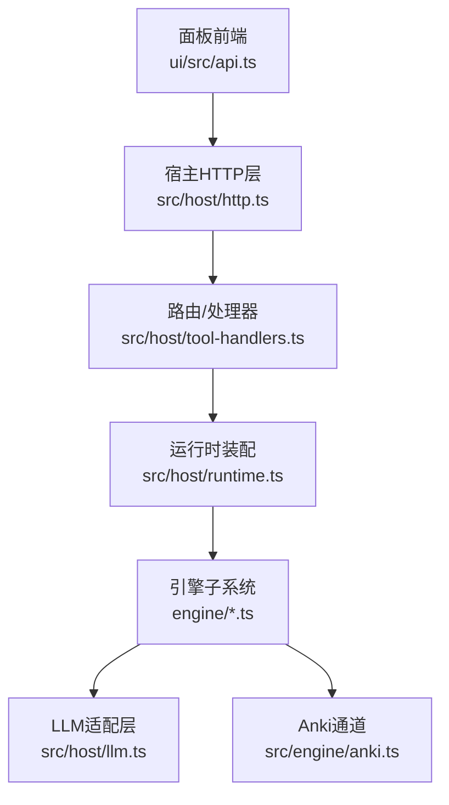
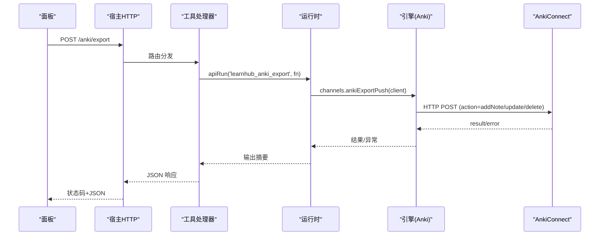
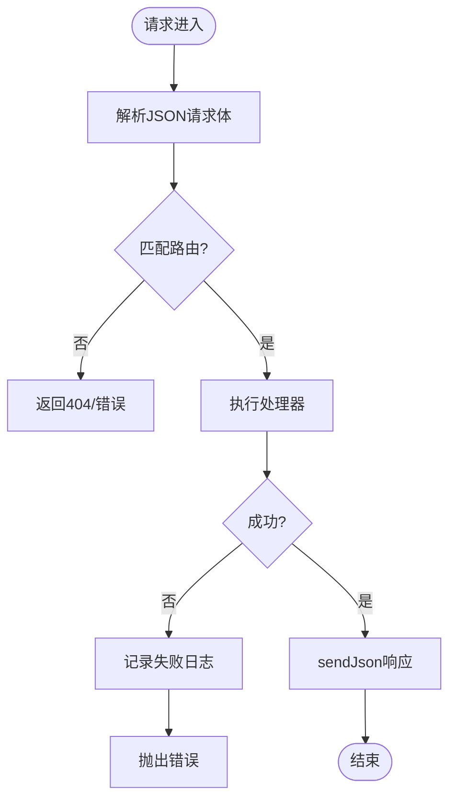
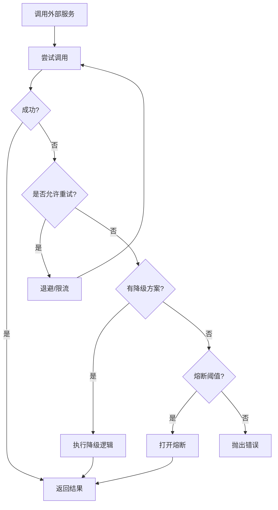
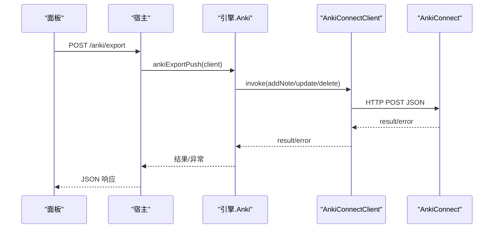
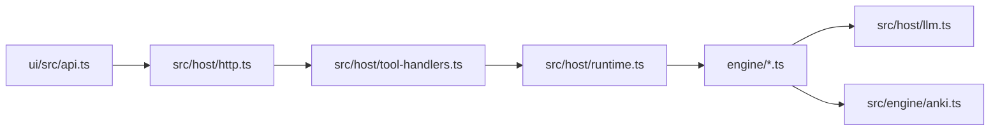

# 第三方服务集成

<cite>
**本文引用的文件**
- [src/host/http.ts](file://src/host/http.ts)
- [ui/src/api.ts](file://ui/src/api.ts)
- [src/host/llm.ts](file://src/host/llm.ts)
- [src/host/runtime.ts](file://src/host/runtime.ts)
- [src/engine/anki.ts](file://src/engine/anki.ts)
- [src/commands/通道.ts](file://src/commands/通道.ts)
- [src/host/tool-handlers.ts](file://src/host/tool-handlers.ts)
- [src/engine/audit.ts](file://src/engine/audit.ts)
- [src/engine/sched-subsystem.ts](file://src/engine/sched-subsystem.ts)
- [scripts/gen-smoke.mjs](file://scripts/gen-smoke.mjs)
</cite>

## 目录
1. [简介](#简介)
2. [项目结构](#项目结构)
3. [核心组件](#核心组件)
4. [架构总览](#架构总览)
5. [详细组件分析](#详细组件分析)
6. [依赖关系分析](#依赖关系分析)
7. [性能与可靠性](#性能与可靠性)
8. [故障诊断指南](#故障诊断指南)
9. [结论](#结论)
10. [附录：配置模板与安全实践](#附录：配置模板与安全实践)

## 简介
本文件面向“第三方服务集成”主题，基于仓库现有实现，梳理外部服务抽象层、统一调用接口、认证与令牌管理、服务发现与注册、错误处理（重试/熔断/降级）、缓存策略、监控与日志记录，并给出常见第三方服务（如本地桌面应用 Anki）的集成示例。同时提供配置模板与安全最佳实践，以及故障诊断与性能调优建议。

## 项目结构
本项目采用“宿主 + 引擎 + 面板”的分层组织：
- 宿主层负责 HTTP 路由、请求解析、运行期装配、任务队列、LLM 适配与语料捕获、运行日志等。
- 引擎层封装领域逻辑（调度、审计、Anki 通道等），通过端口注入时钟、随机源、文件系统，便于测试与替换。
- 面板层通过统一的 API 客户端访问宿主暴露的 /learnhub/api/* 端点。

图表来源
- [ui/src/api.ts:1-32](file://ui/src/api.ts#L1-L32)
- [src/host/http.ts:26-40](file://src/host/http.ts#L26-L40)
- [src/host/tool-handlers.ts:257-271](file://src/host/tool-handlers.ts#L257-L271)
- [src/host/runtime.ts:138-193](file://src/host/runtime.ts#L138-L193)
- [src/host/llm.ts:34-55](file://src/host/llm.ts#L34-L55)
- [src/engine/anki.ts:22-28](file://src/engine/anki.ts#L22-L28)

章节来源
- [src/host/http.ts:1-55](file://src/host/http.ts#L1-L55)
- [ui/src/api.ts:1-370](file://ui/src/api.ts#L1-L370)
- [src/host/runtime.ts:1-255](file://src/host/runtime.ts#L1-L255)

## 核心组件
- 统一 HTTP 客户端与服务端响应器
  - 面板侧通过 ui/src/api.ts 的 http 方法统一发起 JSON 请求，非 2xx 抛出 ApiError；服务端通过 src/host/http.ts 的 sendJson/readJson 统一序列化与解析。
- 宿主 LLM 适配层
  - src/host/llm.ts 将引擎侧 LlmComplete/LlmStream 端口适配到 dsh-llm，提供空闲超时、截断重试、语义档翻译、usage 计量与语料捕获。
- 运行时装配与运行日志
  - src/host/runtime.ts 构造 HostRuntime，注入 engine、agent、corpus、jobs、flags，并提供 runLog/apiRun 统一记录每次引擎调用与失败。
- 第三方通道（以 Anki 为例）
  - src/engine/anki.ts 定义 AnkiConnect 传输缝、镜象同步、事件映射与回写；命令注册在 src/commands/通道.ts，工具面由 src/host/tool-handlers.ts 桥接。

章节来源
- [ui/src/api.ts:13-32](file://ui/src/api.ts#L13-L32)
- [src/host/http.ts:26-40](file://src/host/http.ts#L26-L40)
- [src/host/llm.ts:75-104](file://src/host/llm.ts#L75-L104)
- [src/host/runtime.ts:138-193](file://src/host/runtime.ts#L138-L193)
- [src/engine/anki.ts:186-212](file://src/engine/anki.ts#L186-L212)
- [src/commands/通道.ts:9-72](file://src/commands/通道.ts#L9-L72)
- [src/host/tool-handlers.ts:257-271](file://src/host/tool-handlers.ts#L257-L271)

## 架构总览
下图展示一次“面板 → 宿主 → 引擎 → 第三方服务”的典型调用链，并以 Anki 导出为例。

图表来源
- [ui/src/api.ts:167-174](file://ui/src/api.ts#L167-L174)
- [src/host/tool-handlers.ts:257-263](file://src/host/tool-handlers.ts#L257-L263)
- [src/host/runtime.ts:243-253](file://src/host/runtime.ts#L243-L253)
- [src/engine/anki.ts:193-212](file://src/engine/anki.ts#L193-L212)

## 详细组件分析

### 统一服务调用接口（HTTP 门面）
- 面板侧
  - 所有端点统一走 BASE=/learnhub/api，http() 封装 fetch，非 2xx 抛 ApiError，错误消息优先取响应体 error 字段。
- 服务端
  - sendJson/readJson 统一 JSON 序列化与请求体解析，避免重复编码与格式不一致。

图表来源
- [ui/src/api.ts:13-32](file://ui/src/api.ts#L13-L32)
- [src/host/http.ts:26-40](file://src/host/http.ts#L26-L40)
- [src/host/runtime.ts:243-253](file://src/host/runtime.ts#L243-L253)

章节来源
- [ui/src/api.ts:1-370](file://ui/src/api.ts#L1-L370)
- [src/host/http.ts:1-55](file://src/host/http.ts#L1-L55)

### 认证机制与令牌管理
- 当前实现未内置通用 OAuth/API Key 中间件；各第三方服务按自身方式鉴权：
  - Anki：通过本地 HTTP 端点（默认 127.0.0.1:8765）通信，无额外 token；连接失败或 HTTP 非 200 会报错。
  - LLM：通过宿主 dsh-llm 上下文进行调用，provider/model/effort 来自部署配置；失败时携带稳定错误码（如 AUTH/RATE_LIMIT）。
- 建议
  - 对需要密钥的服务，建议在宿主层集中读取环境变量或安全存储，并在适配器中注入；对外不暴露密钥细节。
  - 对远程服务增加重试与熔断（见下节），并对敏感信息做脱敏日志。

章节来源
- [src/engine/anki.ts:193-212](file://src/engine/anki.ts#L193-L212)
- [src/host/llm.ts:34-55](file://src/host/llm.ts#L34-L55)
- [src/host/llm.ts:304-380](file://src/host/llm.ts#L304-L380)

### 服务发现与注册
- 当前仓库未实现通用服务发现/注册中心；Anki 为本地直连，地址可配置或通过默认值。
- 可扩展点
  - 在宿主运行时装配阶段加载服务清单（如 YAML/JSON），维护可用实例列表与健康检查。
  - 在工具处理器中根据服务名动态选择端点，结合健康检查与负载均衡策略。

章节来源
- [src/engine/anki.ts:22-28](file://src/engine/anki.ts#L22-L28)
- [src/host/runtime.ts:138-193](file://src/host/runtime.ts#L138-L193)

### 错误处理策略（重试、熔断、降级）
- 重试
  - LLM 层：支持 max-tokens 截断后提高上限原题重试一次；不支持的 effort 自动降级重试一次。
  - Anki 层：连接失败/HTTP 非 200 直接抛错，可在上层加重试。
- 熔断
  - 当前未实现显式熔断器；可在宿主层对频繁失败的外部调用实施熔断（例如滑动窗口失败率阈值）。
- 降级
  - LLM 层：当 effort 不被支持时降级到部署默认；Anki 镜象坏档静默重建，不影响主流程。
- 统一日志
  - 所有引擎调用通过 runtime.runLog/apiRun 记录成功/失败摘要，便于定位。

图表来源
- [src/host/llm.ts:281-298](file://src/host/llm.ts#L281-L298)
- [src/engine/anki.ts:193-212](file://src/engine/anki.ts#L193-L212)
- [src/host/runtime.ts:243-253](file://src/host/runtime.ts#L243-L253)

章节来源
- [src/host/llm.ts:281-298](file://src/host/llm.ts#L281-L298)
- [src/engine/anki.ts:193-212](file://src/engine/anki.ts#L193-L212)
- [src/host/runtime.ts:243-253](file://src/host/runtime.ts#L243-L253)

### 缓存策略（本地、分布式、失效）
- 本地缓存
  - 引擎内对 FSRS 调度器按课程根路径缓存实例，减少重复初始化成本。
- 分布式缓存
  - 当前未见分布式缓存实现；可在宿主层引入 Redis/Memcached 作为共享缓存层。
- 缓存失效
  - 参数优化落盘后显式失效对应缓存；Anki 镜象坏档静默重建，保证一致性。

章节来源
- [src/engine/index.ts:198-210](file://src/engine/index.ts#L198-L210)
- [src/engine/sched-subsystem.ts:402-423](file://src/engine/sched-subsystem.ts#L402-L423)
- [src/engine/anki.ts:154-183](file://src/engine/anki.ts#L154-L183)

### 监控与日志记录
- 指标收集
  - LLM 调用带 usage 计量（输入/输出/token），通过 withCapture 记录并回调 usageSink。
- 错误追踪
  - 失败记录包含稳定错误码（如 LLM_ERROR、AUTH、RATE_LIMIT），便于分类统计。
- 审计日志
  - 结构化审计（图健康、schema、enc 边等）生成报告并落盘；运行日志记录每次引擎调用与失败摘要。

章节来源
- [src/host/llm.ts:106-165](file://src/host/llm.ts#L106-L165)
- [src/host/llm.ts:304-380](file://src/host/llm.ts#L304-L380)
- [src/engine/audit.ts:35-316](file://src/engine/audit.ts#L35-L316)
- [src/host/runtime.ts:217-231](file://src/host/runtime.ts#L217-L231)

### 常见第三方服务集成示例：Anki
- 角色定位
  - Anki 仅作为作答通道，vault 是唯一调度者；导出/导入均围绕“镜象同步 + 事件回写”。
- 关键流程
  - 导出：计算到期集 → 构建卡片负载 → diff 镜象 → 增删改 Anki 笔记 → 更新镜象清单。
  - 导入：拉取复习事件 → 映射为 vault 语义 → 写入 practice/review 流水 → 重算调度。
- 配置与可达性
  - 默认端点 127.0.0.1:8765；可通过命令参数覆盖；不可达时明确报错。

图表来源
- [src/commands/通道.ts:9-72](file://src/commands/通道.ts#L9-L72)
- [src/host/tool-handlers.ts:257-263](file://src/host/tool-handlers.ts#L257-L263)
- [src/engine/anki.ts:193-212](file://src/engine/anki.ts#L193-L212)

章节来源
- [src/engine/anki.ts:1-324](file://src/engine/anki.ts#L1-L324)
- [src/commands/通道.ts:9-72](file://src/commands/通道.ts#L9-L72)
- [src/host/tool-handlers.ts:257-271](file://src/host/tool-handlers.ts#L257-L271)

## 依赖关系分析
- 耦合点
  - 面板与宿主通过 REST 解耦；宿主与引擎通过运行时对象解耦；引擎与外部服务通过传输缝（如 AnkiTransport）解耦。
- 外部依赖
  - dsh-llm（LLM 流式调用）、AnkiConnect（本地 HTTP）。
- 风险点
  - 外部服务不可用时的错误传播与重试策略需完善；缺少统一熔断与限流。

图表来源
- [ui/src/api.ts:1-32](file://ui/src/api.ts#L1-L32)
- [src/host/http.ts:26-40](file://src/host/http.ts#L26-L40)
- [src/host/tool-handlers.ts:257-271](file://src/host/tool-handlers.ts#L257-L271)
- [src/host/runtime.ts:138-193](file://src/host/runtime.ts#L138-L193)
- [src/host/llm.ts:34-55](file://src/host/llm.ts#L34-L55)
- [src/engine/anki.ts:186-212](file://src/engine/anki.ts#L186-L212)

章节来源
- [src/host/runtime.ts:1-255](file://src/host/runtime.ts#L1-L255)
- [src/host/llm.ts:1-390](file://src/host/llm.ts#L1-L390)
- [src/engine/anki.ts:1-324](file://src/engine/anki.ts#L1-L324)

## 性能与可靠性
- 性能
  - LLM 调用使用流式传输与空闲超时，降低长尾延迟；usage 计量用于成本与容量评估。
  - FSRS 调度器按课程缓存，避免重复初始化。
- 可靠性
  - LLM 层具备截断重试与 effort 降级；Anki 镜象坏档静默重建；运行日志与审计报告辅助排障。
- 建议
  - 增加统一熔断器与限流器；对高频外部调用增加指数退避与幂等键；对关键路径增加健康检查探针。

章节来源
- [src/host/llm.ts:281-298](file://src/host/llm.ts#L281-L298)
- [src/engine/index.ts:198-210](file://src/engine/index.ts#L198-L210)
- [src/engine/anki.ts:154-183](file://src/engine/anki.ts#L154-L183)

## 故障诊断指南
- 常见问题
  - AnkiConnect 不可达：确认桌面 Anki 已启动且插件安装；查看错误信息中的端点与 HTTP 状态。
  - LLM 调用失败：关注稳定错误码（如 AUTH/RATE_LIMIT），必要时调整 provider/model/effort。
- 诊断步骤
  - 查看运行日志（运行日志.md）与审计报告（审计报告），定位失败环节。
  - 使用冒烟脚本汇总站点调用情况与失败原因，快速验证链路。
- 恢复策略
  - 对临时故障启用重试与降级；对持续失败触发熔断；对数据不一致（如镜象）执行重建。

章节来源
- [src/host/runtime.ts:217-231](file://src/host/runtime.ts#L217-L231)
- [src/engine/audit.ts:35-316](file://src/engine/audit.ts#L35-L316)
- [scripts/gen-smoke.mjs:123-155](file://scripts/gen-smoke.mjs#L123-L155)

## 结论
本项目通过清晰的宿主/引擎/面板分层与传输缝设计，实现了对外部服务的解耦与可控接入。当前已具备 LLM 流式调用、Anki 双向通道、运行日志与审计能力。后续可在认证统一化、服务发现与注册、熔断与限流、分布式缓存等方面增强，以提升系统的可运维性与弹性。

## 附录：配置模板与安全实践
- 配置模板（示例）
  - 宿主配置项（LearnhubConfig）
    - vault: string（必填）
    - centerRel: string（可选，默认“学习中心”）
    - provider: string（LLM provider）
    - model: string（LLM 模型）
    - fastEffort: 'off'|'low'（机械调用思考档）
    - deepEffort: 'off'|'low'（高复杂度节点思考档）
    - quizAuditRate: number（0–1，第二意见门抽样率）
    - corpusDir: string（生成语料落盘目录）
- 安全最佳实践
  - 密钥与凭据：集中管理于安全存储，不在代码与日志中明文出现。
  - 最小权限：对外部服务仅授予必要权限；对本地服务（如 Anki）限制监听地址。
  - 传输安全：对外部 HTTP 调用启用 TLS；对内部服务限制网络访问范围。
  - 日志脱敏：对敏感字段进行脱敏；控制日志保留周期。
  - 变更审计：关键配置变更纳入版本管理与审计。

章节来源
- [src/host/runtime.ts:23-44](file://src/host/runtime.ts#L23-L44)
- [src/host/llm.ts:34-55](file://src/host/llm.ts#L34-L55)
- [src/engine/anki.ts:22-28](file://src/engine/anki.ts#L22-L28)