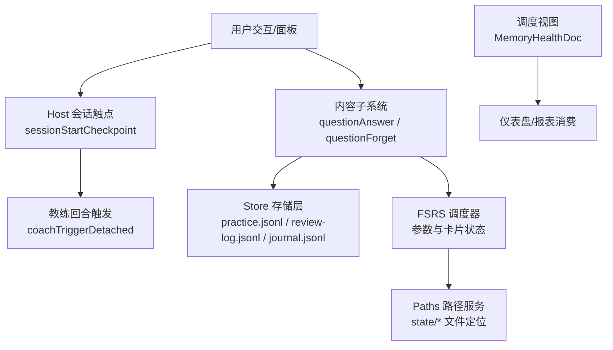
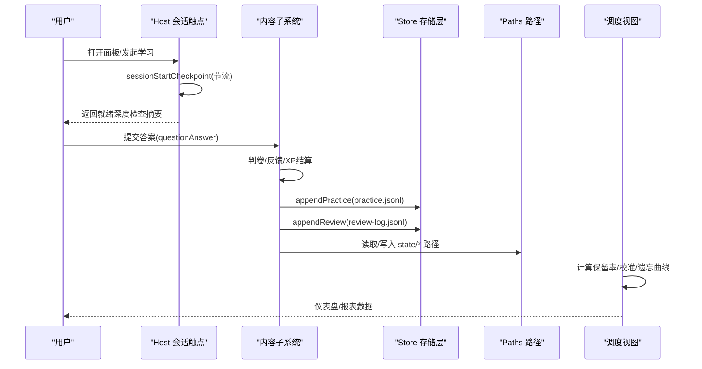
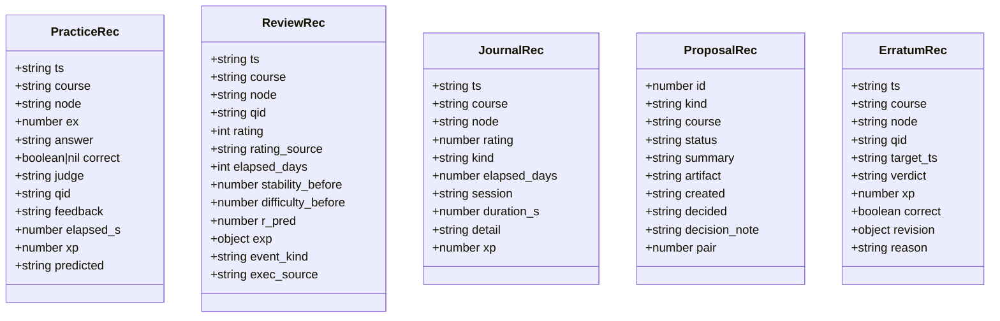
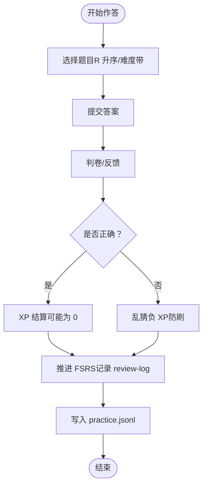
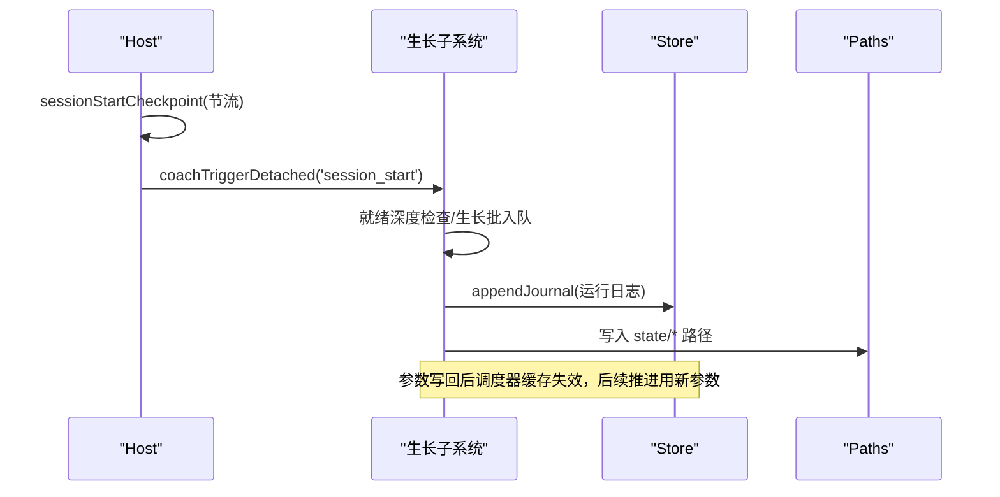
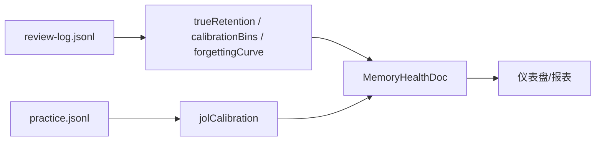
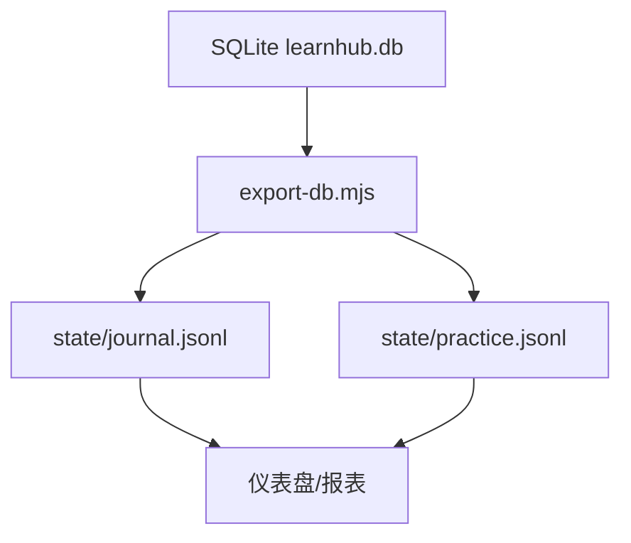
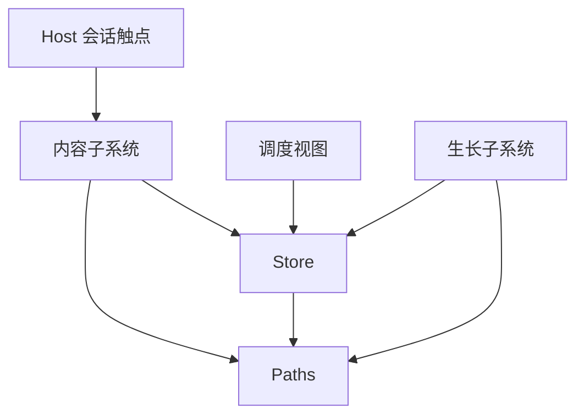

# 会话记录

<cite>
**本文引用的文件**
- [sessions.ts](file://src/engine/sessions.ts)
- [types.ts](file://src/engine/types.ts)
- [store.ts](file://src/engine/store.ts)
- [paths.ts](file://src/engine/paths.ts)
- [content-subsystem.ts](file://src/engine/content-subsystem.ts)
- [sched-subsystem.ts](file://src/engine/sched-subsystem.ts)
- [views-sched.ts](file://src/engine/views/sched.ts)
- [jobs.ts](file://src/host/jobs.ts)
- [export-db.mjs](file://scripts/export-db.mjs)
</cite>

## 目录
1. [简介](#简介)
2. [项目结构](#项目结构)
3. [核心组件](#核心组件)
4. [架构总览](#架构总览)
5. [详细组件分析](#详细组件分析)
6. [依赖关系分析](#依赖关系分析)
7. [性能考量](#性能考量)
8. [故障排查指南](#故障排查指南)
9. [结论](#结论)
10. [附录](#附录)

## 简介
本文件面向“学习会话记录”的完整文档，覆盖数据结构、存储格式、作答追踪、生命周期管理、查询与分析接口、隐私与数据安全策略、导出与可视化方法，并给出示例与分析报告生成指引。目标是让非技术读者也能理解系统如何记录一次学习会话从开始到结束的全过程，以及如何基于这些数据进行统计分析与可视化。

## 项目结构
学习会话相关的数据流贯穿多个子系统：
- 会话触发与节流：host 层在会话开始时进行节流检查并触发教练回合（用于后续生长批等）。
- 内容作答与评测：内容子系统负责题目上下文、判卷、XP 结算与 FSRS 推进。
- 存储层：统一以 JSONL 追加方式落盘作答流水、复习日志、日志条目等；提案、快照等采用原子写。
- 路径与定位：集中管理中心级与课程级路径，确保所有数据写入位置一致且可追溯。
- 视图与分析：调度域视图提供记忆健康、保留率、校准、遗忘曲线等聚合指标。

**图表来源**
- [jobs.ts:539-544](file://src/host/jobs.ts#L539-L544)
- [content-subsystem.ts:733-752](file://src/engine/content-subsystem.ts#L733-L752)
- [store.ts:51-149](file://src/engine/store.ts#L51-L149)
- [paths.ts:40-85](file://src/engine/paths.ts#L40-L85)
- [views-sched.ts:11-25](file://src/engine/views/sched.ts#L11-L25)

**章节来源**
- [jobs.ts:539-544](file://src/host/jobs.ts#L539-L544)
- [paths.ts:40-85](file://src/engine/paths.ts#L40-L85)

## 核心组件
- 会话与会话事件：
  - 会话开始由 host 层节流触发教练回合，作为会话生命周期的起点信号。
  - 推荐与状态聚合由 sessions 模块提供，支撑“今天学什么”和节点建议。
- 作答与评测：
  - 内容子系统处理题目作答、判分、反馈、XP 结算与 FSRS 推进。
  - 支持 JOL 预测字段（会/不会/没把握）用于校准展示。
- 存储与持久化：
  - Store 统一写入 practice.jsonl、review-log.jsonl、journal.jsonl 等 JSONL 文件。
  - 提案、快照、pin 等使用原子写保证一致性。
- 路径与定位：
  - Paths 集中定义中心级与课程级路径，确保数据落盘位置稳定。
- 视图与分析：
  - 调度视图提供 MemoryHealthDoc，包含预报、状态分布、真实保留率、校准、遗忘曲线、JOL 校准等。

**章节来源**
- [sessions.ts:31-173](file://src/engine/sessions.ts#L31-L173)
- [content-subsystem.ts:733-752](file://src/engine/content-subsystem.ts#L733-L752)
- [store.ts:51-149](file://src/engine/store.ts#L51-L149)
- [paths.ts:40-85](file://src/engine/paths.ts#L40-L85)
- [views-sched.ts:11-25](file://src/engine/views/sched.ts#L11-L25)

## 架构总览
下图展示了会话从开始到结束的端到端流程，包括作答、评测、FSRS 推进、日志与沉淀层更新。

**图表来源**
- [jobs.ts:539-544](file://src/host/jobs.ts#L539-L544)
- [content-subsystem.ts:733-752](file://src/engine/content-subsystem.ts#L733-L752)
- [store.ts:100-149](file://src/engine/store.ts#L100-L149)
- [paths.ts:40-85](file://src/engine/paths.ts#L40-L85)
- [views-sched.ts:11-25](file://src/engine/views/sched.ts#L11-L25)

## 详细组件分析

### 数据结构与存储格式
- 作答流水 PracticeRec：
  - 关键字段：时间戳、课程、节点、题号、答案、对错、判卷来源、耗时、XP、预测（JOL）。
  - 存储：JSONL 追加至 practice.jsonl。
- 复习日志 ReviewRec：
  - 关键字段：时间戳、课程、节点、题号、评分、评分来源、间隔天数、复习前快照（稳定性/难度/预测回忆率）、实验臂标注、执行事件种类与来源。
  - 存储：JSONL 追加至 review-log.jsonl。
- 日志条目 JournalRec：
  - 关键字段：时间戳、课程、节点、评分、行为类型、间隔天数、会话标识、时长、详情、XP。
  - 存储：JSONL 追加至 journal.jsonl。
- 提案 ProposalRec：
  - 关键字段：ID、类型、课程、状态、摘要、产物路径、创建时间、决策时间与备注、联动提案 ID。
  - 存储：单文件 proposals.json（原子写）。
- 快照 Snapshot：
  - 按课程与版本保存整图 YAML 文档序列，用于审计与回滚。
- 其他：
  - 勘误冲正 ErratumRec：对已落盘作答的抵消记录，读侧净值聚合。
  - E 档案 EArchiveRec：学习者产出判词存档，不产生 XP 或 canonical 写入。
  - 回执 ReceiptLogRec、习惯重复 HabitRepeatRec：证据账本与自报重复。

**图表来源**
- [types.ts:132-200](file://src/engine/types.ts#L132-L200)
- [types.ts:243-281](file://src/engine/types.ts#L243-L281)

**章节来源**
- [types.ts:132-200](file://src/engine/types.ts#L132-L200)
- [types.ts:243-281](file://src/engine/types.ts#L243-L281)
- [store.ts:51-149](file://src/engine/store.ts#L51-L149)
- [store.ts:168-206](file://src/engine/store.ts#L168-L206)
- [store.ts:280-293](file://src/engine/store.ts#L280-L293)
- [store.ts:450-471](file://src/engine/store.ts#L450-L471)

### 答题行为的追踪机制
- 题目选择与顺序：
  - 复习队列按预测遗忘风险 R 升序排序，同档内难度渐进；单节点会话采用自适应难度带（A1），根据连续正确/错误调整难度带并重新选卡。
- 作答时间：
  - 作答流水记录 elapsed_s（秒），用于乱猜判定与自动性分析。
- 错误分析与反馈：
  - 判卷结果 correct、judge、feedback 写入 practice 流水；勘误冲正允许修正历史作答的 XP 与对错，读侧按净值聚合。
- 反馈处理：
  - 内容子系统在 questionAnswer 中完成判卷与反馈，同时决定是否推进 FSRS 与是否记账 XP（同日重复作答为 0，乱猜负 XP）。

**图表来源**
- [content-subsystem.ts:733-752](file://src/engine/content-subsystem.ts#L733-L752)
- [store.ts:100-149](file://src/engine/store.ts#L100-L149)

**章节来源**
- [content-subsystem.ts:733-752](file://src/engine/content-subsystem.ts#L733-L752)
- [store.ts:100-149](file://src/engine/store.ts#L100-L149)

### 学习会话的生命周期管理
- 会话开始：
  - Host 层通过 sessionStartCheckpoint 进行节流（30 分钟窗口），触发教练回合（coachTriggerDetached），用于就绪深度检查与可能的生长批入队。
- 进行中：
  - 内容子系统持续接收作答，写入 practice/review-log/journal；FSRS 参数优化与缓存失效在 sched-subsystem 中处理。
- 结束与持久化：
  - 每次真实推进 FSRS 卡时落 review-log；提案与快照使用原子写；沉淀层追加正典事件并重建学习者档案投影。

**图表来源**
- [jobs.ts:539-544](file://src/host/jobs.ts#L539-L544)
- [sched-subsystem.ts:420-476](file://src/engine/sched-subsystem.ts#L420-L476)
- [paths.ts:40-85](file://src/engine/paths.ts#L40-L85)

**章节来源**
- [jobs.ts:539-544](file://src/host/jobs.ts#L539-L544)
- [sched-subsystem.ts:420-476](file://src/engine/sched-subsystem.ts#L420-L476)

### 会话数据的查询与分析接口
- 记忆健康视图 MemoryHealthDoc：
  - 包含每日负载预报、状态分布（稳定性/难度/可回忆度直方图）、真实保留率、校准（r_pred vs 实际）、遗忘曲线、JOL 校准。
- 查询口径：
  - 复习日志仅计 auto/self 的真实到期复习；空态时 rate=null，避免造假数据。
  - 校准分箱与遗忘曲线按 r_pred/elapsed_days 分桶统计。
- 消费方：
  - 仪表盘与 FSRS 参数优化器消费 review-log；练习侧 JOL 校准来自 practice 流水。

**图表来源**
- [views-sched.ts:11-25](file://src/engine/views/sched.ts#L11-L25)
- [store.ts:145-149](file://src/engine/store.ts#L145-L149)

**章节来源**
- [views-sched.ts:11-25](file://src/engine/views/sched.ts#L11-L25)
- [store.ts:145-149](file://src/engine/store.ts#L145-L149)

### 隐私保护与数据安全策略
- 数据最小化与只增原则：
  - 多数流水采用 JSONL 追加（practice/review-log/journal），不覆盖历史；勘误冲正显式抵消，读侧净值聚合。
- 原子写与一致性：
  - 提案、快照、pin 等关键文件使用原子写，避免中间态损坏。
- 权限与隔离：
  - 笔记源镜像区与输出区位于学习中心下，个人笔记零写入；技能/习惯/项目数据分区明确。
- 审计与留痕：
  - 生成语料、质量评审报告、运行日志、判卷失败专项留档，便于回溯与问题定位。

**章节来源**
- [store.ts:168-206](file://src/engine/store.ts#L168-L206)
- [paths.ts:92-117](file://src/engine/paths.ts#L92-L117)
- [paths.ts:112-117](file://src/engine/paths.ts#L112-L117)

### 会话数据导出与可视化
- 旧数据库导出：
  - 脚本 export-db.mjs 将 SQLite 中的 journal/practice 表迁移至 JSONL，追加到 state 目录，不覆盖现有行。
- 可视化方法：
  - 消费 review-log 与 practice 计算 MemoryHealthDoc，仪表盘渲染预报、保留率、校准、遗忘曲线；ECharts chart 块可用于自定义图表。

**图表来源**
- [export-db.mjs:1-60](file://scripts/export-db.mjs#L1-L60)

**章节来源**
- [export-db.mjs:1-60](file://scripts/export-db.mjs#L1-L60)

## 依赖关系分析
- 会话触发依赖 host 层的节流与教练回合触发。
- 内容子系统依赖 store 进行作答与复习日志写入，依赖 paths 定位文件。
- 调度视图依赖 review-log 与 practice 进行统计计算。
- 生长子系统依赖 store 与 paths 进行参数写回与档案重建。

**图表来源**
- [jobs.ts:539-544](file://src/host/jobs.ts#L539-L544)
- [content-subsystem.ts:733-752](file://src/engine/content-subsystem.ts#L733-L752)
- [store.ts:51-149](file://src/engine/store.ts#L51-L149)
- [paths.ts:40-85](file://src/engine/paths.ts#L40-L85)
- [sched-subsystem.ts:420-476](file://src/engine/sched-subsystem.ts#L420-L476)

**章节来源**
- [jobs.ts:539-544](file://src/host/jobs.ts#L539-L544)
- [content-subsystem.ts:733-752](file://src/engine/content-subsystem.ts#L733-L752)
- [store.ts:51-149](file://src/engine/store.ts#L51-L149)
- [paths.ts:40-85](file://src/engine/paths.ts#L40-L85)
- [sched-subsystem.ts:420-476](file://src/engine/sched-subsystem.ts#L420-L476)

## 性能考量
- JSONL 追加写入适合高并发场景，避免锁竞争；读侧按需扫描，量级小可全读。
- 节流机制防止高频触发教练回合，降低 loadView 开销。
- 自适应难度带与 R 排序减少挫败感，提升学习效率。
- 原子写保障关键文件一致性，避免部分写入导致的读侧异常。

[本节为通用指导，无需特定文件引用]

## 故障排查指南
- 文件缺失与损坏：
  - 提案、pin、实验定义等文件缺失视为合法空态；损坏则抛出 Broken 错误，需修复或删除后重试。
- 读侧契约：
  - readJsonlLines 对中段坏行报错，撕裂尾行豁免；仪表盘/优化器不得消费带病数据。
- 常见错误：
  - 提案 pair 悬空、JSON 非法、数组形态不符；实验定义字段不满足契约。
- 解决步骤：
  - 检查对应 JSONL/JSON 文件完整性；修复或重建；必要时清空并重新生成。

**章节来源**
- [store.ts:168-206](file://src/engine/store.ts#L168-L206)
- [store.ts:295-321](file://src/engine/store.ts#L295-L321)
- [store.ts:386-420](file://src/engine/store.ts#L386-L420)

## 结论
本系统通过清晰的职责划分与严格的存储契约，实现了学习会话的全链路记录与分析。作答行为被精确追踪，FSRS 推进与日志落盘保证了数据的一致性与可审计性；调度视图提供了丰富的统计指标，支持仪表盘与报表消费。隐私与安全策略通过只增、原子写与分区隔离得到保障。导出脚本与可视化能力使得数据易于迁移与呈现。

[本节为总结性内容，无需特定文件引用]

## 附录
- 示例：一次会话的记录片段
  - 作答流水：包含 ts、course、node、answer、correct、elapsed_s、xp、predicted。
  - 复习日志：包含 ts、course、node、qid、rating、rating_source、elapsed_days、stability_before、difficulty_before、r_pred。
  - 日志条目：包含 ts、course、node、kind、elapsed_days、session、duration_s、detail、xp。
- 分析报告生成：
  - 基于 review-log 与 practice 计算 trueRetention、calibrationBins、forgettingCurve、jolCalibration，输出 MemoryHealthDoc 供仪表盘消费。

[本节为概念性说明，无需特定文件引用]