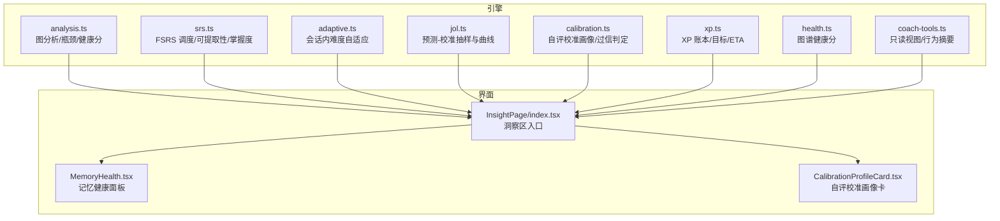
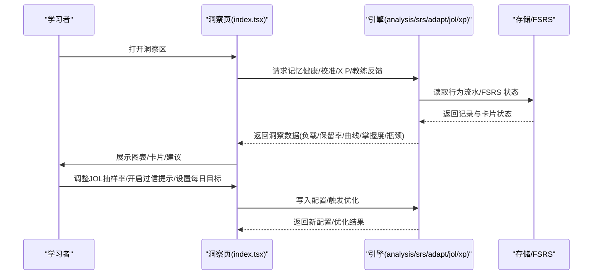
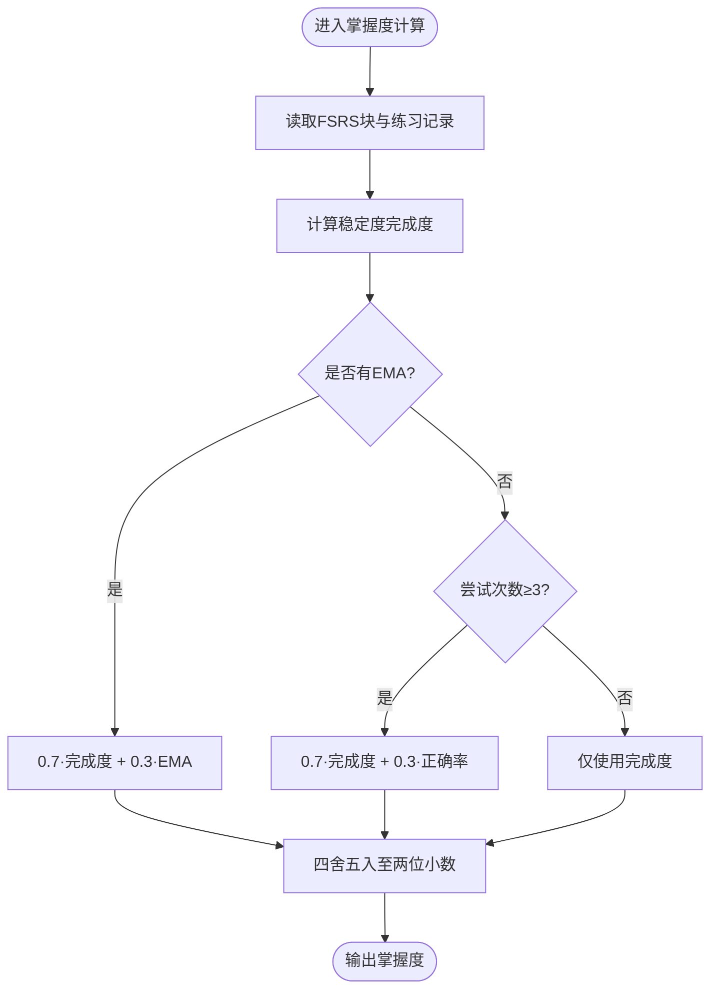
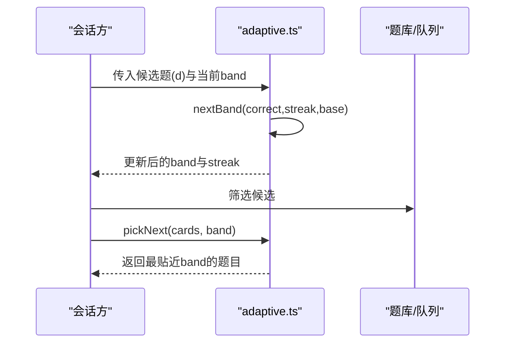
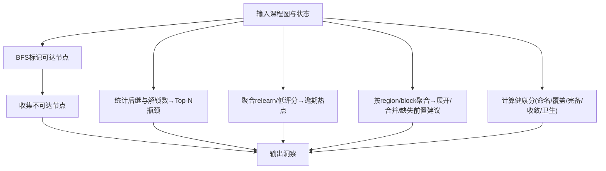
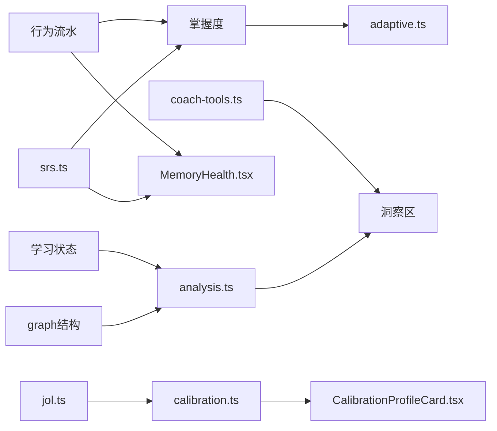

# 学习洞察

<cite>
**本文引用的文件**
- [analysis.ts](file://src/engine/analysis.ts)
- [adaptive.ts](file://src/engine/adaptive.ts)
- [calibration.ts](file://src/engine/calibration.ts)
- [xp.ts](file://src/engine/xp.ts)
- [srs.ts](file://src/engine/srs.ts)
- [jol.ts](file://src/engine/jol.ts)
- [health.ts](file://src/engine/health.ts)
- [coach-tools.ts](file://src/engine/coach-tools.ts)
- [index.tsx](file://ui/src/pages/InsightPage/index.tsx)
- [MemoryHealth.tsx](file://ui/src/pages/InsightPage/MemoryHealth.tsx)
- [CalibrationProfileCard.tsx](file://ui/src/pages/InsightPage/CalibrationProfileCard.tsx)
- [2026-09-big-directions.md](file://docs/research/2026-09-big-directions.md)
</cite>

## 目录
1. [简介](#简介)
2. [项目结构](#项目结构)
3. [核心组件](#核心组件)
4. [架构总览](#架构总览)
5. [详细组件分析](#详细组件分析)
6. [依赖关系分析](#依赖关系分析)
7. [性能与实时性](#性能与实时性)
8. [故障诊断与排错](#故障诊断与排错)
9. [结论](#结论)
10. [附录：指标、阈值与示例报告](#附录指标阈值与示例报告)

## 简介
本文件面向“学习洞察系统”的算法模型、评估指标、瓶颈识别、建议生成、可视化展示、更新频率与自定义配置，提供从代码到用户界面的完整说明。系统围绕课程知识图谱、FSRS 间隔重复、作答行为流水与学习者自评校准，构建掌握度预测、学习趋势分析与个性化推荐能力，并通过仪表盘与卡片式视图呈现洞察结果。

## 项目结构
- 引擎层（src/engine）：实现图分析、SRS 调度、掌握度计算、自适应难度、JOL 预测-校准、XP 时间账本、健康分与教练工具等。
- 界面层（ui/src/pages/InsightPage）：洞察区页面聚合记忆健康、自评校准画像、每周复盘、Anki 通道、N-of-1 实验、睡眠耦合、运行环境等子模块。
- 文档与研究（docs）：包含方向规划、研究综述与设计决策，为算法与产品演进提供依据。

图表来源
- [analysis.ts:87-246](file://src/engine/analysis.ts#L87-L246)
- [srs.ts:94-183](file://src/engine/srs.ts#L94-L183)
- [adaptive.ts:19-81](file://src/engine/adaptive.ts#L19-L81)
- [jol.ts:28-79](file://src/engine/jol.ts#L28-L79)
- [calibration.ts:53-111](file://src/engine/calibration.ts#L53-L111)
- [xp.ts:26-183](file://src/engine/xp.ts#L26-L183)
- [health.ts:53-104](file://src/engine/health.ts#L53-L104)
- [coach-tools.ts:60-216](file://src/engine/coach-tools.ts#L60-L216)
- [index.tsx:31-206](file://ui/src/pages/InsightPage/index.tsx#L31-L206)
- [MemoryHealth.tsx:137-301](file://ui/src/pages/InsightPage/MemoryHealth.tsx#L137-L301)
- [CalibrationProfileCard.tsx:11-94](file://ui/src/pages/InsightPage/CalibrationProfileCard.tsx#L11-L94)

章节来源
- [index.tsx:31-206](file://ui/src/pages/InsightPage/index.tsx#L31-L206)

## 核心组件
- 掌握度预测：基于 FSRS 稳定度完成度与练习证据（EMA/正确率）合成节点掌握度，用于图谱渲染与推荐排序。
- 学习趋势分析：通过每日负载预报、真实保留率、遗忘曲线、JOL 校准曲线刻画学习轨迹与记忆状态分布。
- 个性化推荐：会话内按当前难度带与连对数流式选题；全局复习队列按可提取性 R 排序并考虑难度渐进。
- 学习效果评估：学习效率（XP/日）、记忆保持率（真实保留率/遗忘曲线）、知识迁移能力（enc 边与跨步候选）。
- 瓶颈识别与问题诊断：不可达节点、高扇出枢纽、逾期热点、块连接不足、空降节点与健康分分项。
- 建议生成：分批构建建议（扩展块、合并块、缺失前置、跨步候选）、过信轻提示、挑战点恒温器（规划中）。
- 可视化展示：记忆健康四面板、自评校准画像、课程状态总览、预计完成天数、运行环境信息。
- 更新频率与实时性：页面监听 reload 事件刷新数据；JOL 抽查与过信提示开关即时生效；参数优化手动触发。
- 自定义配置与阈值调优：每日 XP 目标、JOL 抽样率、过信提示开关、FSRS 参数优化门禁与指标。

章节来源
- [srs.ts:165-183](file://src/engine/srs.ts#L165-L183)
- [analysis.ts:100-246](file://src/engine/analysis.ts#L100-L246)
- [adaptive.ts:19-81](file://src/engine/adaptive.ts#L19-L81)
- [jol.ts:28-79](file://src/engine/jol.ts#L28-L79)
- [calibration.ts:53-111](file://src/engine/calibration.ts#L53-L111)
- [xp.ts:26-183](file://src/engine/xp.ts#L26-L183)
- [health.ts:53-104](file://src/engine/health.ts#L53-L104)
- [MemoryHealth.tsx:137-301](file://ui/src/pages/InsightPage/MemoryHealth.tsx#L137-L301)
- [index.tsx:31-206](file://ui/src/pages/InsightPage/index.tsx#L31-L206)

## 架构总览
系统以“课程图 + FSRS 题卡 + 行为流水”为核心事实源，引擎层负责派生洞察（掌握度、健康分、瓶颈、趋势），界面层以洞察区聚合呈现并提供交互控制（JOL 开关、抽样率、每日目标、参数优化）。

图表来源
- [index.tsx:31-206](file://ui/src/pages/InsightPage/index.tsx#L31-L206)
- [MemoryHealth.tsx:137-301](file://ui/src/pages/InsightPage/MemoryHealth.tsx#L137-L301)
- [calibration.ts:53-111](file://src/engine/calibration.ts#L53-L111)
- [xp.ts:86-183](file://src/engine/xp.ts#L86-L183)
- [srs.ts:94-183](file://src/engine/srs.ts#L94-L183)

## 详细组件分析

### 掌握度预测与学习趋势
- 掌握度：由 FSRS 稳定度完成度与练习证据（EMA 或正确率）加权合成，确保一次全对不会饱和，体现持续练习证据。
- 学习趋势：通过每日负载预报、记忆状态分布（稳定性/难度/可提取性）、真实保留率与按时点遗忘曲线，形成多维趋势视图。
- 关键函数路径参考：
  - 掌握度合成：[srs.ts:165-183](file://src/engine/srs.ts#L165-L183)
  - 可提取性计算：[srs.ts:94-105](file://src/engine/srs.ts#L94-L105)
  - 记忆健康面板：[MemoryHealth.tsx:137-301](file://ui/src/pages/InsightPage/MemoryHealth.tsx#L137-L301)

图表来源
- [srs.ts:165-183](file://src/engine/srs.ts#L165-L183)

章节来源
- [srs.ts:94-183](file://src/engine/srs.ts#L94-L183)
- [MemoryHealth.tsx:137-301](file://ui/src/pages/InsightPage/MemoryHealth.tsx#L137-L301)

### 自适应难度与个性化推荐
- 会话内自适应：根据起点先验带（随节点掌握度单调上行）、连对升档与答错降档，选择最贴近目标难度的下一题。
- 全局复习队列：按可提取性 R 升序（最可能忘的先刷），同 R 内难度渐进；单节点会话走 A1 自适应。
- 关键函数路径参考：
  - 难度合用口径与起点带：[adaptive.ts:19-32](file://src/engine/adaptive.ts#L19-L32)
  - 连对升档与选下一题：[adaptive.ts:54-81](file://src/engine/adaptive.ts#L54-L81)
  - 复习队列排序语义（R 为主）：[content-subsystem.ts:514-525](file://src/engine/content-subsystem.ts#L514-L525)

图表来源
- [adaptive.ts:54-81](file://src/engine/adaptive.ts#L54-L81)

章节来源
- [adaptive.ts:19-81](file://src/engine/adaptive.ts#L19-L81)
- [content-subsystem.ts:514-525](file://src/engine/content-subsystem.ts#L514-L525)

### 学习瓶颈识别与问题诊断
- 不可达节点：从根出发 BFS 标记可达，未访问即不可达。
- 瓶颈节点：后继数多且解锁未学者多的节点优先关注。
- 逾期热点：journal 中 relearn/rating=1 的高频节点。
- 块级问题：小块的展开/合并建议、平均前置不足、空降节点。
- 健康分：动作句命名比例、est 覆盖率、前置完备、收敛度、结构卫生五项打分。
- 关键函数路径参考：
  - 图分析（不可达/瓶颈/热点/建议）：[analysis.ts:100-246](file://src/engine/analysis.ts#L100-L246)
  - 健康分计算：[health.ts:53-104](file://src/engine/health.ts#L53-L104)

图表来源
- [analysis.ts:100-246](file://src/engine/analysis.ts#L100-L246)
- [health.ts:53-104](file://src/engine/health.ts#L53-L104)

章节来源
- [analysis.ts:100-246](file://src/engine/analysis.ts#L100-L246)
- [health.ts:53-104](file://src/engine/health.ts#L53-L104)

### 学习建议生成逻辑
- 分批构建建议：扩展小块、合并过小块、补齐缺失前置、跨步候选（质量评估后给出认可/修改建议）。
- 过信轻提示：当「会」档实际正确率低于阈值时，在预测出口给保守提醒并加强抽查密度。
- 关键函数路径参考：
  - 建议生成：[analysis.ts:176-234](file://src/engine/analysis.ts#L176-L234)
  - 过信判定与提示文案：[calibration.ts:53-111](file://src/engine/calibration.ts#L53-L111)

章节来源
- [analysis.ts:176-234](file://src/engine/analysis.ts#L176-L234)
- [calibration.ts:53-111](file://src/engine/calibration.ts#L53-L111)

### 可视化展示方式
- 记忆健康四面板：每日负载预报、记忆状态分布、真实保留率、按时点遗忘曲线。
- 自评校准画像：分源视图为主，全局聚合折叠并标注域特异警戒；过信检出附证据说明。
- 课程状态总览与预计完成天数：表格化展示各课程阶段计数与 ETA。
- 关键组件路径参考：
  - 洞察区入口：[index.tsx:31-206](file://ui/src/pages/InsightPage/index.tsx#L31-L206)
  - 记忆健康面板：[MemoryHealth.tsx:137-301](file://ui/src/pages/InsightPage/MemoryHealth.tsx#L137-L301)
  - 自评校准画像卡：[CalibrationProfileCard.tsx:11-94](file://ui/src/pages/InsightPage/CalibrationProfileCard.tsx#L11-L94)

章节来源
- [index.tsx:31-206](file://ui/src/pages/InsightPage/index.tsx#L31-L206)
- [MemoryHealth.tsx:137-301](file://ui/src/pages/InsightPage/MemoryHealth.tsx#L137-L301)
- [CalibrationProfileCard.tsx:11-94](file://ui/src/pages/InsightPage/CalibrationProfileCard.tsx#L11-L94)

### 更新频率与实时性要求
- 页面监听 learnhub:reload 事件，刷新所有洞察数据（XP/记忆健康/JOL/校准/教练反馈）。
- JOL 抽样率与过信提示开关即时保存并立即影响后续复习流程。
- FSRS 参数优化需手动触发，满足门禁条件才写回。
- 关键路径参考：
  - 刷新机制：[index.tsx:41-58](file://ui/src/pages/InsightPage/index.tsx#L41-L58)
  - JOL 开关与抽样率：[MemoryHealth.tsx:238-264](file://ui/src/pages/InsightPage/MemoryHealth.tsx#L238-L264)
  - 参数优化按钮与门禁：[MemoryHealth.tsx:76-131](file://ui/src/pages/InsightPage/MemoryHealth.tsx#L76-L131)

章节来源
- [index.tsx:41-58](file://ui/src/pages/InsightPage/index.tsx#L41-L58)
- [MemoryHealth.tsx:76-131](file://ui/src/pages/InsightPage/MemoryHealth.tsx#L76-L131)
- [MemoryHealth.tsx:238-264](file://ui/src/pages/InsightPage/MemoryHealth.tsx#L238-L264)

### 自定义配置与阈值调优
- 每日 XP 目标：可在洞察区直接编辑并保存，范围钳制在合理区间。
- JOL 抽样率：支持 0.05–1 的步进调节，默认约 1/3。
- 过信轻提示：全局开关，关闭后不再提醒且恢复默认抽查密度。
- FSRS 参数优化：从真实复习日志重训个人参数，门禁包括真实推进条数与评估更优。
- 关键路径参考：
  - 每日目标读写：[xp.ts:86-101](file://src/engine/xp.ts#L86-L101)
  - JOL 抽样率与阈值：[jol.ts:15-19](file://src/engine/jol.ts#L15-L19)
  - 过信阈值与判定：[calibration.ts:53-67](file://src/engine/calibration.ts#L53-L67)
  - 参数优化门禁：[MemoryHealth.tsx:76-131](file://ui/src/pages/InsightPage/MemoryHealth.tsx#L76-L131)

章节来源
- [xp.ts:86-101](file://src/engine/xp.ts#L86-L101)
- [jol.ts:15-19](file://src/engine/jol.ts#L15-L19)
- [calibration.ts:53-67](file://src/engine/calibration.ts#L53-L67)
- [MemoryHealth.tsx:76-131](file://ui/src/pages/InsightPage/MemoryHealth.tsx#L76-L131)

## 依赖关系分析
- 掌握度依赖 FSRS 调度器与练习 EMA/正确率。
- 自适应难度依赖节点掌握度与题目难度标量。
- 图分析依赖课程图结构与学习状态（阶段、掌握度）。
- 记忆健康依赖 FSRS 状态与行为流水（复习日志/PracticeRec）。
- 教练工具提供只读视图，支撑生长裁决与行为摘要。

图表来源
- [srs.ts:94-183](file://src/engine/srs.ts#L94-L183)
- [analysis.ts:100-246](file://src/engine/analysis.ts#L100-L246)
- [adaptive.ts:19-81](file://src/engine/adaptive.ts#L19-L81)
- [jol.ts:28-79](file://src/engine/jol.ts#L28-L79)
- [calibration.ts:53-111](file://src/engine/calibration.ts#L53-L111)
- [coach-tools.ts:60-216](file://src/engine/coach-tools.ts#L60-L216)
- [MemoryHealth.tsx:137-301](file://ui/src/pages/InsightPage/MemoryHealth.tsx#L137-L301)
- [CalibrationProfileCard.tsx:11-94](file://ui/src/pages/InsightPage/CalibrationProfileCard.tsx#L11-L94)

章节来源
- [srs.ts:94-183](file://src/engine/srs.ts#L94-L183)
- [analysis.ts:100-246](file://src/engine/analysis.ts#L100-L246)
- [adaptive.ts:19-81](file://src/engine/adaptive.ts#L19-L81)
- [jol.ts:28-79](file://src/engine/jol.ts#L28-L79)
- [calibration.ts:53-111](file://src/engine/calibration.ts#L53-L111)
- [coach-tools.ts:60-216](file://src/engine/coach-tools.ts#L60-L216)

## 性能与实时性
- 计算复杂度：
  - 图分析中的不可达检测为 BFS O(V+E)，瓶颈与热点聚合为线性扫描与排序。
  - 掌握度计算为常数时间（每个节点一次合成）。
  - 自适应选题为线性扫描候选集取最小差距。
- 实时性：
  - 洞察区通过事件驱动刷新，避免轮询开销。
  - JOL 抽样与过信提示开关即时生效，不影响既有数据。
  - 参数优化为手动触发，满足门禁后才写回，保证安全。
- 优化建议：
  - 大图场景下建议限制预览上限（如教练工具中的 GRAPH_NAMES_CAP/LIST_CAP）。
  - 批量建议条目 cap 随图规模伸缩，避免过多噪声。

章节来源
- [analysis.ts:100-246](file://src/engine/analysis.ts#L100-L246)
- [coach-tools.ts:37-44](file://src/engine/coach-tools.ts#L37-L44)
- [MemoryHealth.tsx:76-131](file://ui/src/pages/InsightPage/MemoryHealth.tsx#L76-L131)

## 故障诊断与排错
- 常见异常：
  - 无复习数据：记忆健康显示空提示，等待数据积累。
  - 数据门槛不足：JOL 校准与过信判定在配对数不足时静默不显示，避免造假。
  - 配置非法：日界/目标值非法时提示或回落默认。
- 排查步骤：
  - 检查是否已产生 PracticeRec 与复习日志。
  - 确认 JOL 开关与抽样率设置是否正确。
  - 查看健康分与图分析输出，定位结构问题（环、断边、不可达）。
- 关键路径参考：
  - 空数据提示：[MemoryHealth.tsx:12-13](file://ui/src/pages/InsightPage/MemoryHealth.tsx#L12-L13)
  - 数据门槛：[jol.ts:18-19](file://src/engine/jol.ts#L18-L19)
  - 配置校验：[xp.ts:112-119](file://src/engine/xp.ts#L112-L119)

章节来源
- [MemoryHealth.tsx:12-13](file://ui/src/pages/InsightPage/MemoryHealth.tsx#L12-L13)
- [jol.ts:18-19](file://src/engine/jol.ts#L18-L19)
- [xp.ts:112-119](file://src/engine/xp.ts#L112-L119)

## 结论
学习洞察系统以课程图与 FSRS 为基础，结合行为流水与自评校准，提供掌握度预测、学习趋势分析、个性化推荐与瓶颈诊断。界面层将复杂算法转化为直观面板与卡片，支持实时配置与手动优化。未来可进一步引入 n-of-1 实验、挑战点恒温器与预测沙盘，增强个体化学习与期望管理。

## 附录：指标、阈值与示例报告

### 指标体系
- 学习效率：XP/日、连续学习天数、每日目标达成率。
- 记忆保持率：真实保留率、按时点遗忘曲线、预测 vs 真实校准曲线。
- 知识迁移能力：enc 边覆盖、跨步候选数量与质量、健康分中的收敛度与前置完备。

章节来源
- [xp.ts:26-183](file://src/engine/xp.ts#L26-L183)
- [MemoryHealth.tsx:137-301](file://ui/src/pages/InsightPage/MemoryHealth.tsx#L137-L301)
- [analysis.ts:176-246](file://src/engine/analysis.ts#L176-L246)

### 阈值与调优方法
- JOL 校准最小配对数：10 条（低于门槛不显示）。
- 过信阈值：CALIBRATION_OVERCONF_THRESHOLD（低于则判定系统性过信）。
- 每日 XP 目标范围：5–1000，非法值回落默认。
- FSRS 参数优化门禁：真实推进 ≥400 条且评估更优才写回。

章节来源
- [jol.ts:18-19](file://src/engine/jol.ts#L18-L19)
- [calibration.ts:53-67](file://src/engine/calibration.ts#L53-L67)
- [xp.ts:86-101](file://src/engine/xp.ts#L86-L101)
- [MemoryHealth.tsx:76-131](file://ui/src/pages/InsightPage/MemoryHealth.tsx#L76-L131)

### 示例报告与应用场景
- 示例一：某课程本周回顾
  - 记忆健康：负载预报显示明日到期较多；真实保留率 82%；遗忘曲线在 3–7 天段下降明显。
  - 瓶颈：发现 2 个不可达节点与 1 个高扇出枢纽；建议扩展小块并补齐缺失前置。
  - 建议：开启过信轻提示，提高 JOL 抽样率至 0.5，观察校准曲线改善。
- 示例二：个人自测校准
  - 自评校准画像：「会」档实际正确率 60%，低于阈值；提示更保守预测。
  - 行动：在复习翻面前更多选择「没把握」，减少高估带来的无效复习。
- 示例三：计划谈判与 ETA
  - 预计完成天数基于剩余节点×每节点 XP÷每日目标；若目标过低则 ETA 拉长，可调高目标或增加练习密度。

章节来源
- [MemoryHealth.tsx:137-301](file://ui/src/pages/InsightPage/MemoryHealth.tsx#L137-L301)
- [analysis.ts:100-246](file://src/engine/analysis.ts#L100-L246)
- [calibration.ts:53-111](file://src/engine/calibration.ts#L53-L111)
- [xp.ts:173-183](file://src/engine/xp.ts#L173-L183)