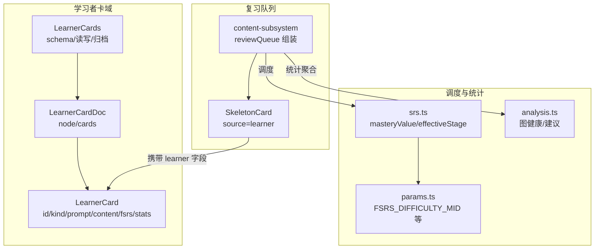
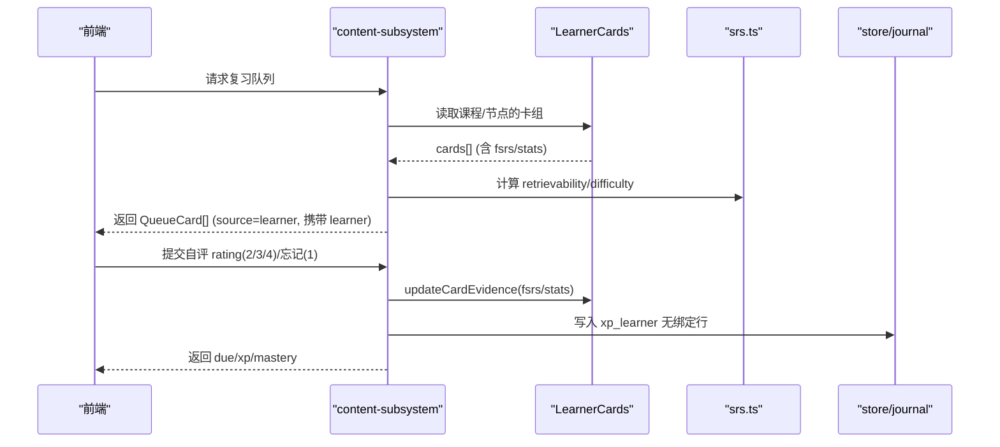
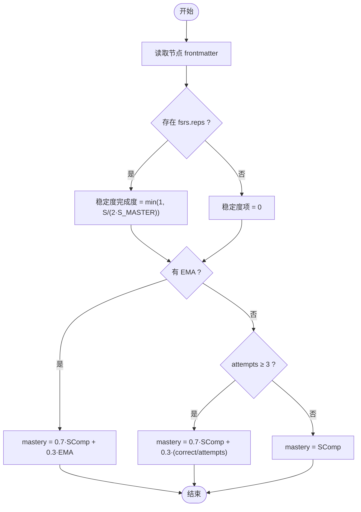
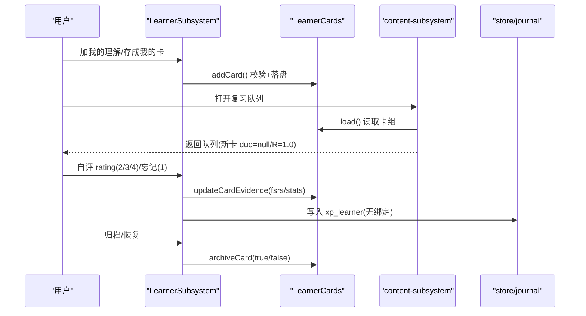
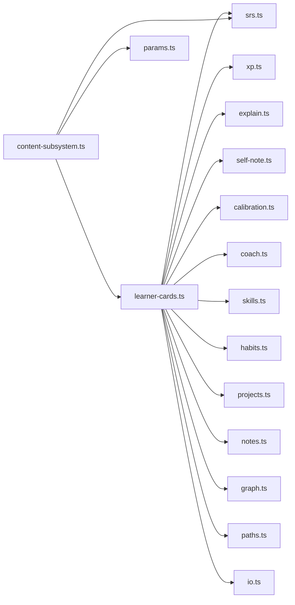

# 学习者模型

<cite>
**本文引用的文件**
- [learner-cards.ts](file://src/engine/learner-cards.ts)
- [views/learner.ts](file://src/engine/views/learner.ts)
- [content-subsystem.ts](file://src/engine/content-subsystem.ts)
- [srs.ts](file://src/engine/srs.ts)
- [params.ts](file://src/engine/params.ts)
- [analysis.ts](file://src/engine/analysis.ts)
- [memory-health.test.ts](file://tests/memory-health.test.ts)
- [learner-cards.test.ts](file://tests/learner-cards.test.ts)
</cite>

## 目录
1. [简介](#简介)
2. [项目结构](#项目结构)
3. [核心组件](#核心组件)
4. [架构总览](#架构总览)
5. [详细组件分析](#详细组件分析)
6. [依赖关系分析](#依赖关系分析)
7. [性能考量](#性能考量)
8. [故障排查指南](#故障排查指南)
9. [结论](#结论)
10. [附录：数据模型与示例](#附录数据模型与示例)

## 简介
本文件系统性说明“学习者模型”的设计与实现，覆盖以下目标：
- LearnerCard 数据结构的完整定义与字段含义（卡片类型 recall_cue、cloze_rewrite、self_explain）。
- 学习者能力画像构建机制：掌握度计算、学习状态跟踪、进度评估算法。
- 学习者卡片的生命周期管理：从创建到归档的完整流程。
- 统计信息收集与分析：答题正确率、尝试次数、学习效率指标。
- 配置选项与自定义扩展点。
- 具体数据模型示例与使用场景。

## 项目结构
学习者模型由“独立卡域 + 复习队列汇入 + 调度/统计复用”构成：
- 独立卡域：课程根/我的卡/<节点>.yaml，独立 schema 与门禁，不入题库九题型，不进入 nodeMastery/完成门禁/节点定价消费面。
- 复习队列汇入：我的卡并入统一复习队列（source='learner'），UI 通过 learner 字段分面渲染。
- 调度/统计复用：复用 FSRS 调度内核与复习日志口径；但“测量面零掺入”，不写 practice/reviewLog，XP 走无绑定行。



图表来源
- [learner-cards.ts:81-97](file://src/engine/learner-cards.ts#L81-L97)
- [content-subsystem.ts:558-599](file://src/engine/content-subsystem.ts#L558-L599)
- [srs.ts:165-183](file://src/engine/srs.ts#L165-L183)
- [params.ts:57](file://src/engine/params.ts#L57)
- [analysis.ts:208-235](file://src/engine/analysis.ts#L208-L235)

章节来源
- [learner-cards.ts:1-15](file://src/engine/learner-cards.ts#L1-L15)
- [content-subsystem.ts:558-599](file://src/engine/content-subsystem.ts#L558-L599)

## 核心组件
- 学习者卡数据结构与校验：LearnerCard、LearnerCardDoc、validateLearnerCards。
- 学习者子系统门面：LearnerSubsystem（E1/E2/E3/E4/E5/U区聚合）。
- 复习队列汇入：content-subsystem 将我的卡以 SkeletonCard(source='learner') 形式并入队列。
- 掌握度与阶段：srs.ts 提供 masteryValue/masteryOfFm/effectiveStage。
- 参数与默认难度：params.ts 提供 FSRS_DIFFICULTY_MID 等。
- 统计与健康：analysis.ts 提供图健康与建议；memory-health.test.ts 验证真实保留率/校准分箱。

章节来源
- [learner-cards.ts:81-97](file://src/engine/learner-cards.ts#L81-L97)
- [learner-cards.ts:113-182](file://src/engine/learner-cards.ts#L113-L182)
- [views/learner.ts:89-117](file://src/engine/views/learner.ts#L89-L117)
- [content-subsystem.ts:558-599](file://src/engine/content-subsystem.ts#L558-L599)
- [srs.ts:165-191](file://src/engine/srs.ts#L165-L191)
- [params.ts:46-58](file://src/engine/params.ts#L46-L58)
- [analysis.ts:208-235](file://src/engine/analysis.ts#L208-L235)
- [memory-health.test.ts:44-75](file://tests/memory-health.test.ts#L44-L75)

## 架构总览
学习者模型采用“隔离卡域 + 统一队列呈现 + 复用调度/统计”的架构：
- 数据隔离：我的卡独立存储于课程根/我的卡/<节点>.yaml，独立 schema 与门禁。
- 队列呈现：content-subsystem 扫描我的卡文件，按 FSRS due 与 retrievability 排序，以 source='learner' 的 SkeletonCard 并入复习队列，UI 通过 learner 字段渲染。
- 调度/统计：复用 srs.applyRatingBlock 推进 FSRS；但“测量面零掺入”，不写 practice/reviewLog，XP 写入 journal 无绑定行。
- 掌握度：节点级 mastery 由 srs.masteryOfFm 派生（稳定度完成度 + 练习证据）；我的卡不直接改变节点 frontmatter。



图表来源
- [content-subsystem.ts:558-599](file://src/engine/content-subsystem.ts#L558-L599)
- [learner-cards.ts:273-294](file://src/engine/learner-cards.ts#L273-L294)
- [learner-cards.test.ts:394-441](file://tests/learner-cards.test.ts#L394-L441)

## 详细组件分析

### 学习者卡数据结构与校验
- 卡片类型：recall_cue（提示重述）、cloze_rewrite（挖空重述）、self_explain（自注讲解）。
- 关键字段：
  - id：唯一标识（自动 c1/c2…）。
  - kind：三选一。
  - prompt：正面提示（非空、长度上限、控制字符限制）。
  - content：学习者表述（非空、长度上限；cloze 必须包含 {{...}}）。
  - source_node：关联节点（必填）。
  - source_section：可选节锚点。
  - archived：归档标记。
  - fsrs：隔离调度块（due/stability/difficulty/reps/lapses）。
  - stats：尝试与正确计数、last（一卡一天一次推进门禁）。
- 校验规则：白名单 kind、prompt/content 非空与长度、控制字符、挖空标记、source_node 非空、node 一致性、空卡组拒绝。

```mermaid
classDiagram
class LearnerCard {
+string id
+string kind
+string prompt
+string content
+string source_node
+string? source_section
+boolean? archived
+FsrsBlock? fsrs
+{ attempts : number; correct : number; last : string }? stats
}
class LearnerCardDoc {
+string node
+LearnerCard[] cards
}
class validateLearnerCards {
+validate(doc, expectedNode?) { errors?, spec? }
}
LearnerCardDoc --> LearnerCard : "包含"
validateLearnerCards --> LearnerCardDoc : "产出"
```

图表来源
- [learner-cards.ts:81-97](file://src/engine/learner-cards.ts#L81-L97)
- [learner-cards.ts:113-182](file://src/engine/learner-cards.ts#L113-L182)

章节来源
- [learner-cards.ts:81-97](file://src/engine/learner-cards.ts#L81-L97)
- [learner-cards.ts:113-182](file://src/engine/learner-cards.ts#L113-L182)
- [learner-cards.test.ts:68-109](file://tests/learner-cards.test.ts#L68-L109)

### 能力画像构建机制（掌握度、状态跟踪、进度评估）
- 掌握度计算：
  - 公式：mastery = 0.7·稳定度完成度 + 0.3·练习证据。
  - 稳定度项：min(1, S/(2·S_MASTER))；无卡时该项为 0。
  - 练习证据：优先 EMA；否则当 attempts≥3 时用准确率替代。
  - 入口：masteryOfFm(fm) 统一从节点 frontmatter 派生。
- 学习状态跟踪：
  - 节点 stage：effectiveStage(state, n) 安全回退 unseen。
  - 代表卡回刷：复习后刷新节点 fsrs 快照，保证 mastery 随复习前进。
- 进度评估：
  - 图健康：nodes/edges/leaves/max_depth/components/hasCycle。
  - 建议：expand_blocks/missing_pre/unconverged/jump_candidates/merge_blocks/vault_links。



图表来源
- [srs.ts:165-183](file://src/engine/srs.ts#L165-L183)
- [content-subsystem.ts:1017-1046](file://src/engine/content-subsystem.ts#L1017-L1046)

章节来源
- [srs.ts:165-191](file://src/engine/srs.ts#L165-L191)
- [content-subsystem.ts:1017-1046](file://src/engine/content-subsystem.ts#L1017-L1046)
- [analysis.ts:208-235](file://src/engine/analysis.ts#L208-L235)

### 学习者卡片生命周期管理（创建→调度→作答→归档）
- 创建：
  - explainArchiveCard/learnerNoteAdd：生成 prompt/content，校验通过后落盘 my-card.yaml。
  - 去重：同内容活跃卡拒绝。
- 调度：
  - 首次未调度：due=null，R=1.0，队尾首推；已有 fsrs.due 则按到期情况入队。
  - 复习队列：content-subsystem 扫描并合并，source='learner'，携带 learner 字段。
- 作答：
  - learnerCardRate(2/3/4)/learnerCardForget(1)：更新 fsrs/stats，一卡一天一次推进；XP 写入 journal 无绑定行；不写 reviewLog/practice。
- 归档/恢复：
  - archiveCard(true/false)：archived=true 出队，false 恢复。



图表来源
- [learner-cards.ts:241-308](file://src/engine/learner-cards.ts#L241-L308)
- [content-subsystem.ts:558-599](file://src/engine/content-subsystem.ts#L558-L599)
- [learner-cards.test.ts:350-441](file://tests/learner-cards.test.ts#L350-L441)

章节来源
- [learner-cards.ts:241-308](file://src/engine/learner-cards.ts#L241-L308)
- [content-subsystem.ts:558-599](file://src/engine/content-subsystem.ts#L558-L599)
- [learner-cards.test.ts:350-441](file://tests/learner-cards.test.ts#L350-L441)

### 统计信息收集与分析（正确率、尝试次数、效率指标）
- 节点级统计：
  - accuracy = correct / attempts（无尝试时为 null）。
  - due/count：基于 fsrs.due ≤ today 的题数。
- 真实保留率与校准：
  - dueReviewFirstPushes：每卡每天取第一条，排除 synthetic 与首学推进。
  - trueRetention：rating≥2 记成功，rate=pass/real。
  - calibrationBins/forgettingCurve：按 r_pred/elapsed_days 分桶统计通过率。
- 图健康与建议：
  - nodes/edges/leaves/max_depth/components/hasCycle。
  - suggestions：expand_blocks/missing_pre/unconverged/jump_candidates/merge_blocks/vault_links。

章节来源
- [learner-cards.ts:520-549](file://src/engine/learner-cards.ts#L520-L549)
- [memory-health.test.ts:44-75](file://tests/memory-health.test.ts#L44-L75)
- [analysis.ts:208-235](file://src/engine/analysis.ts#L208-L235)

### 配置选项与自定义扩展点
- JOL 抽查配置：
  - enabled：全局开关（false 关闭预测弹出）。
  - rate：抽样率（0~1，默认 JOL_SAMPLE_RATE）。
  - 读写接口：jolConfig()/setJolConfig(patch)。
- 默认难度与阈值：
  - FSRS_DIFFICULTY_MID：我的卡默认难度（用于 retrievability/difficulty 计算）。
  - 其他增长/复诊阈值在 params.ts 中集中管理。
- 扩展点：
  - 视图层：views/learner.ts 暴露 LearnerCardKind/LearnerCardItem/LearnerQueueDoc/CalibrationProfileDoc 等视图类型，便于 UI 与外部消费。
  - 子系统聚合：LearnerDeps 结构化窄面注入，便于替换/扩展各子系统能力（如 sched/store/bank 等）。

章节来源
- [learner-cards.ts:551-570](file://src/engine/learner-cards.ts#L551-L570)
- [params.ts:46-58](file://src/engine/params.ts#L46-L58)
- [views/learner.ts:89-147](file://src/engine/views/learner.ts#L89-L147)

## 依赖关系分析
- 模块耦合：
  - learner-cards.ts 依赖 types.ts（LearnerCardKind/FsrsBlock）、paths.ts、io.ts、dates.ts、grading.ts、advance.ts、srs.ts、xp.ts、explain.ts、self-note.ts、calibration.ts、coach.ts、skills.ts、habits.ts、projects.ts、note-source.ts、graph.ts、notes.ts、sessions.ts、sediment.ts、compass.ts、receipts.ts、output.ts、project-exec.ts。
  - content-subsystem.ts 依赖 sched(null) 通道、errorCardTriples、retrievabilityBlock、FSRS_DIFFICULTY_MID。
  - srs.ts 提供 masteryValue/masteryOfFm/effectiveStage。
- 外部集成：
  - 复习队列：content-subsystem 将我的卡与错误对比卡并入统一队列。
  - 存储：journal 记录 xp_learner；practice/reviewLog 不被修改（测量面零掺入）。



图表来源
- [learner-cards.ts:1-74](file://src/engine/learner-cards.ts#L1-L74)
- [content-subsystem.ts:558-599](file://src/engine/content-subsystem.ts#L558-L599)
- [srs.ts:165-191](file://src/engine/srs.ts#L165-L191)
- [params.ts:46-58](file://src/engine/params.ts#L46-L58)

章节来源
- [learner-cards.ts:1-74](file://src/engine/learner-cards.ts#L1-L74)
- [content-subsystem.ts:558-599](file://src/engine/content-subsystem.ts#L558-L599)

## 性能考量
- 卫生约束防膨胀：LEARNER_PROMPT_MAX/LEARNER_CONTENT_MAX 限制单卡大小，避免全库扫描拖慢。
- 独立目录扫描：仅扫描课程根/我的卡/*.yaml，Broken 卡组不阻塞队列。
- 调度复用：复用 srs.applyRatingBlock，避免重复实现；复习日志零掺入减少 I/O。
- 掌握度计算：masteryValue 分支判断（EMA/准确率/仅稳定度）降低不必要计算。

[本节为通用指导，无需特定文件引用]

## 故障排查指南
- 常见校验失败：
  - kind 非法、prompt/content 为空或超长、含控制字符、挖空缺失、source_node 为空、node 不一致、空卡组。
- 操作异常：
  - 同日重复推进：今日已推进过。
  - 未知卡：没有 xxx。
  - 解析失败：判词不可解析导致零副作用（ADR-0004 事务性）。
- 数据一致性：
  - 真实保留率空态 rate=null（无数据不造假）。
  - 代表卡回刷：只有真实推进才重写 fsrs 快照。

章节来源
- [learner-cards.ts:113-182](file://src/engine/learner-cards.ts#L113-L182)
- [learner-cards.test.ts:316-332](file://tests/learner-cards.test.ts#L316-L332)
- [memory-health.test.ts:44-75](file://tests/memory-health.test.ts#L44-L75)
- [content-subsystem.ts:1017-1046](file://src/engine/content-subsystem.ts#L1017-L1046)

## 结论
学习者模型通过“独立卡域 + 统一队列呈现 + 复用调度/统计”实现了高内聚、低耦合的学习者产出体系。它在不干扰 canonical 与节点掌握度的前提下，提供可解释、可审计、可扩展的学习路径，并通过严格的 schema 门禁与“测量面零掺入”保障系统稳定性与数据一致性。

[本节为总结，无需特定文件引用]

## 附录：数据模型与示例
- 数据模型
  - LearnerCardKind：'recall_cue' | 'cloze_rewrite' | 'self_explain'
  - LearnerCardItem：course/node/id/kind/prompt/content/source_section/due/attempts
  - LearnerQueueDoc：date/total/due_count/cards
  - CalibrationSourceProfile/CalibrationProfileDoc：分源校准画像与全局视图
- 使用场景
  - 自注讲解：learnerNoteAdd → AI 对照要点给定位反馈 → 判词入 E 档案 + 成卡。
  - 复习队列：reviewQueue 返回 source='learner' 的 SkeletonCard，携带 learner 字段供 UI 渲染。
  - 自评结算：learnerCardRate/learnerCardForget → 更新 fsrs/stats → 写入 xp_learner 无绑定行。
- 示例参考（路径）
  - 校验与行为断言：tests/learner-cards.test.ts
  - 真实保留率与校准：tests/memory-health.test.ts
  - 队列汇入与 XP 入账：src/engine/content-subsystem.ts

章节来源
- [views/learner.ts:89-147](file://src/engine/views/learner.ts#L89-L147)
- [learner-cards.test.ts:204-232](file://tests/learner-cards.test.ts#L204-L232)
- [learner-cards.test.ts:394-441](file://tests/learner-cards.test.ts#L394-L441)
- [memory-health.test.ts:44-75](file://tests/memory-health.test.ts#L44-L75)
- [content-subsystem.ts:558-599](file://src/engine/content-subsystem.ts#L558-L599)