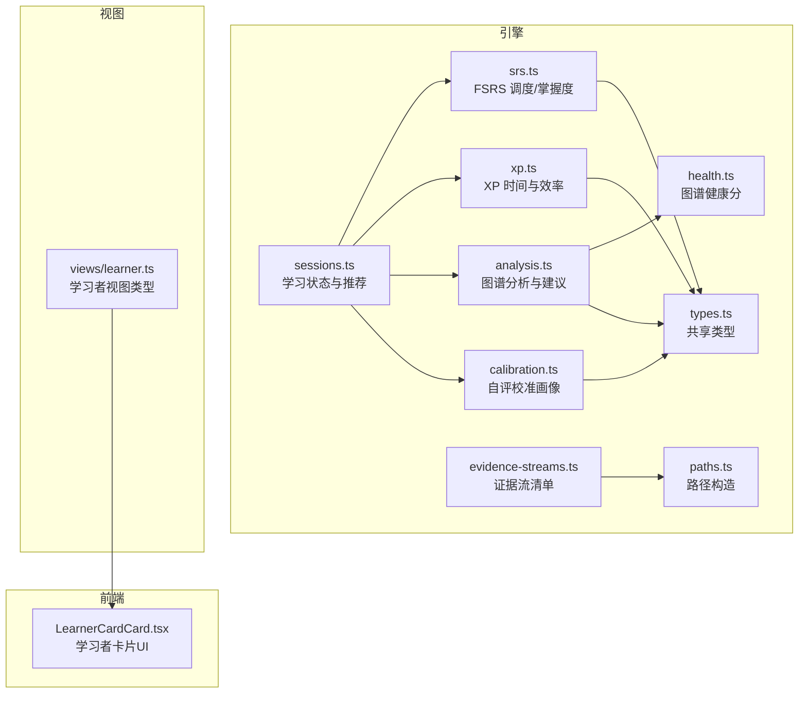
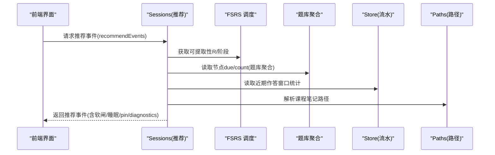
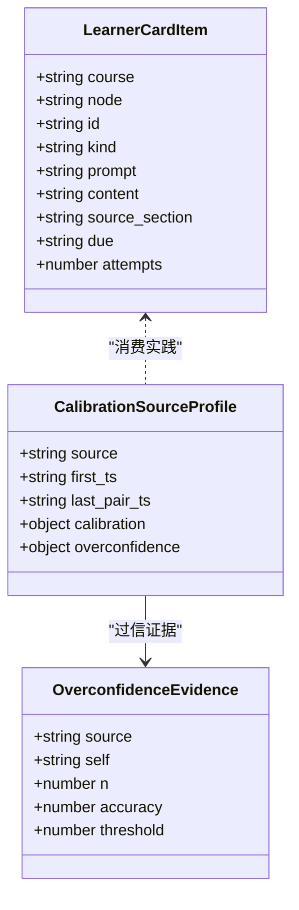
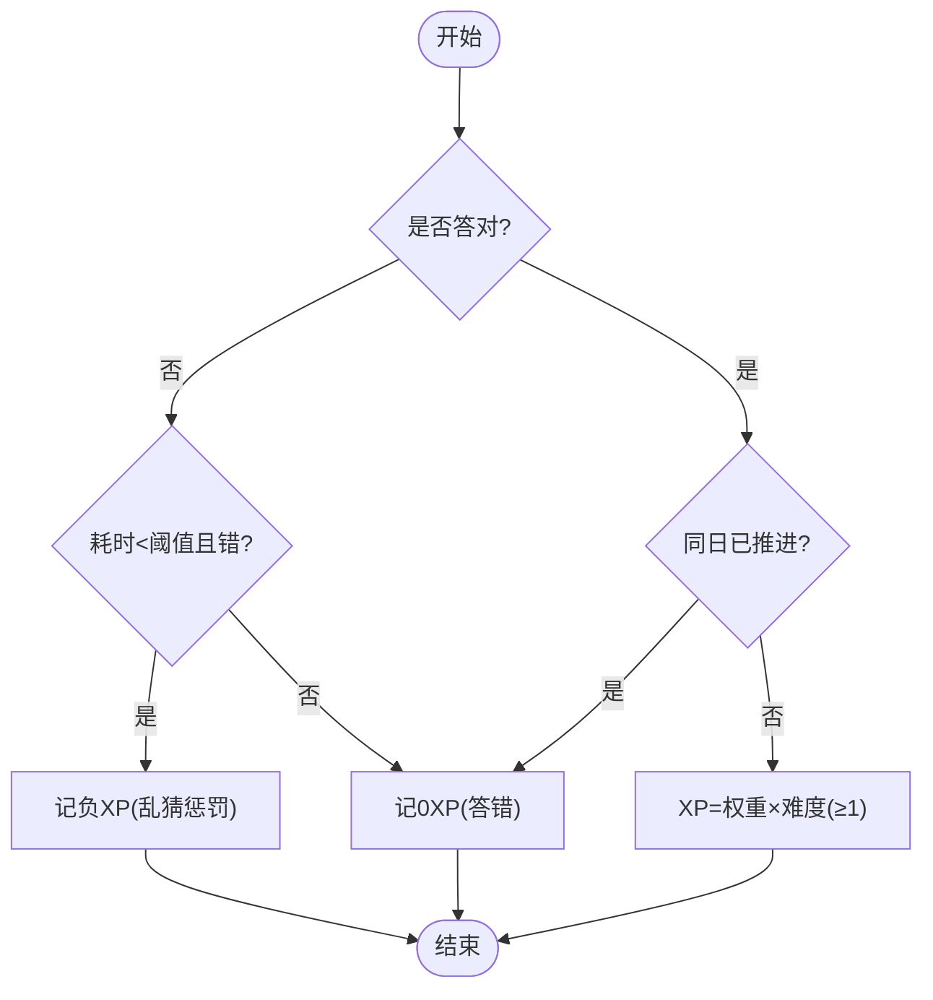
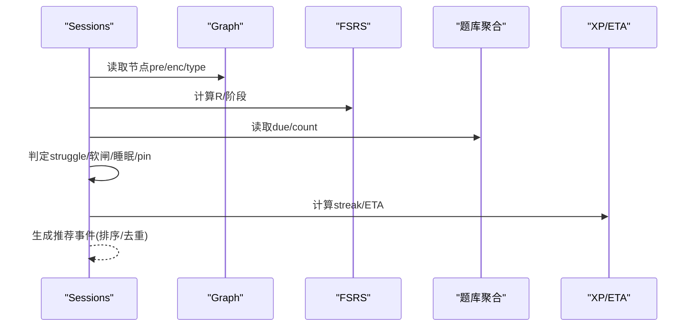
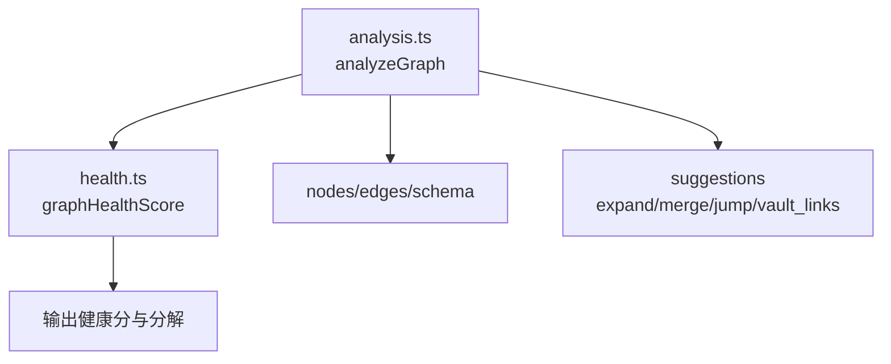
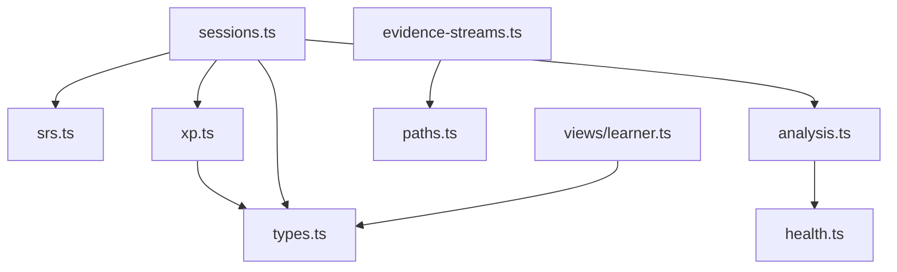

# 学习者追踪

<cite>
**本文引用的文件**
- [evidence-streams.ts](file://src/engine/evidence-streams.ts)
- [sessions.ts](file://src/engine/sessions.ts)
- [analysis.ts](file://src/engine/analysis.ts)
- [xp.ts](file://src/engine/xp.ts)
- [types.ts](file://src/engine/types.ts)
- [srs.ts](file://src/engine/srs.ts)
- [health.ts](file://src/engine/health.ts)
- [calibration.ts](file://src/engine/calibration.ts)
- [learner.ts](file://src/engine/views/learner.ts)
- [paths.ts](file://src/engine/paths.ts)
- [LearnerCardCard.tsx](file://ui/src/components/LearnerCardCard.tsx)
</cite>

## 目录
1. [简介](#简介)
2. [项目结构](#项目结构)
3. [核心组件](#核心组件)
4. [架构总览](#架构总览)
5. [详细组件分析](#详细组件分析)
6. [依赖关系分析](#依赖关系分析)
7. [性能考量](#性能考量)
8. [故障排查指南](#故障排查指南)
9. [结论](#结论)
10. [附录](#附录)

## 简介
本文件面向“学习者追踪系统”的完整说明，覆盖以下目标：
- 学习者卡片的数据结构与能力画像构建机制
- 学习会话记录与分析（答题行为、时间统计、学习效率评估）
- 证据流系统（收集与分析学习过程中的信号）
- 学习分析算法模型（掌握度计算、学习趋势预测、个性化建议生成）
- 可视化展示与报告生成
- 学习者行为监控与预警机制
- 隐私保护与数据安全策略
- 数据分析示例与洞察报告生成方法

该系统以“事实源分离”为核心：课程笔记 frontmatter 是调度状态唯一事实源；题库 YAML 是题目调度事实源；state 下 JSONL/JSON 承载追加型流水（日志/作答）与人审产物。所有指标与画像均为派生值，不直接改写 canonical 数据，保证可审计与可回溯。

## 项目结构
- 引擎层（engine）：负责学习调度、FSRS 复习、证据流、XP 账本、图谱分析、健康分、校准画像等
- 视图层（views）：对外暴露学习者相关视图类型（周复盘、习惯、技能 lane、“我的卡”、自评校准画像）
- 前端 UI（ui）：学习者卡片渲染、练习流程、工作台图视、洞察页等
- 路径与配置（paths、params）：统一路径构造、日界与默认参数
- 测试（tests）：覆盖关键行为与契约

图表来源
- [sessions.ts:1-642](file://src/engine/sessions.ts#L1-L642)
- [srs.ts:1-192](file://src/engine/srs.ts#L1-L192)
- [xp.ts:1-184](file://src/engine/xp.ts#L1-L184)
- [analysis.ts:1-254](file://src/engine/analysis.ts#L1-L254)
- [health.ts:1-105](file://src/engine/health.ts#L1-L105)
- [calibration.ts:1-111](file://src/engine/calibration.ts#L1-L111)
- [evidence-streams.ts:1-40](file://src/engine/evidence-streams.ts#L1-L40)
- [types.ts:1-369](file://src/engine/types.ts#L1-L369)
- [paths.ts:1-160](file://src/engine/paths.ts#L1-L160)
- [learner.ts:1-147](file://src/engine/views/learner.ts#L1-L147)
- [LearnerCardCard.tsx:1-129](file://ui/src/components/LearnerCardCard.tsx#L1-L129)

章节来源
- [sessions.ts:1-642](file://src/engine/sessions.ts#L1-L642)
- [types.ts:1-369](file://src/engine/types.ts#L1-L369)
- [paths.ts:1-160](file://src/engine/paths.ts#L1-L160)

## 核心组件
- 学习会话与推荐（sessions.ts）：聚合节点状态、到期题数、struggle 判定、软闸建议、睡眠耦合建议、pin 置顶等，输出推荐事件
- FSRS 调度与掌握度（srs.ts）：卡片映射、评分推进、阶段机、可提取性 R、掌握度公式
- XP 时间与效率（xp.ts）：作答 XP 结算、预算制定价、每日目标、连续打卡 streak、ETA 估算
- 图谱分析与健康（analysis.ts, health.ts）：不可达、瓶颈、逾期热点、健康分、分批构建建议
- 证据流（evidence-streams.ts）：集中登记所有有读侧的追加流水（journal/practice/review-log/band-log/receipts/e-archive/erratum/habit-repeats/sediment/probation/exec/recall），配合守卫对账
- 学习者视图（views/learner.ts）：“我的卡”、周复盘、习惯、技能 lane、自评校准画像
- 学习者卡片 UI（LearnerCardCard.tsx）：三段式复习交互（提示重述/挖空重述/自注讲解）、忘记门控、自评快捷键

章节来源
- [sessions.ts:1-642](file://src/engine/sessions.ts#L1-L642)
- [srs.ts:1-192](file://src/engine/srs.ts#L1-L192)
- [xp.ts:1-184](file://src/engine/xp.ts#L1-L184)
- [analysis.ts:1-254](file://src/engine/analysis.ts#L1-L254)
- [health.ts:1-105](file://src/engine/health.ts#L1-L105)
- [evidence-streams.ts:1-40](file://src/engine/evidence-streams.ts#L1-L40)
- [learner.ts:1-147](file://src/engine/views/learner.ts#L1-L147)
- [LearnerCardCard.tsx:1-129](file://ui/src/components/LearnerCardCard.tsx#L1-L129)

## 架构总览
系统围绕“事实源 + 派生视图”展开：
- 事实源：课程笔记 frontmatter（节点 stage/fsrs/content）、题库 YAML（题目 due/count）、state 下的 JSONL 追加流水（practice/journal/review-log 等）
- 调度与推荐：基于 FSRS 与题库聚合，结合 graph 前置/enc 边、R-gate、区域轮转、pin、睡眠建议，产出推荐事件
- 分析与画像：从图谱与流水派生健康分、瓶颈、逾期热点、自评校准画像
- 证据流：集中登记所有可消费的追加流水，确保新增流与守卫对账一致
- 可视化：前端通过视图类型渲染“我的卡”、推荐列表、图视、洞察面板

图表来源
- [sessions.ts:361-572](file://src/engine/sessions.ts#L361-L572)
- [srs.ts:94-105](file://src/engine/srs.ts#L94-L105)
- [paths.ts:141-160](file://src/engine/paths.ts#L141-L160)

## 详细组件分析

### 学习者卡片与能力画像
- “我的卡”数据结构（views/learner.ts）：包含课程、节点、卡 id、类型（recall_cue/cloze_rewrite/self_explain）、提示、内容、来源节、到期、尝试次数
- 卡片 UI（LearnerCardCard.tsx）：正面按类型出题，翻面对照学习者自述，支持 Hard/Good/Easy 自评与“忘记”门控（5秒）
- 能力画像（calibration.ts）：基于 practice 流水中 predicted 与 correct 的配对，进行 JOL 校准分箱与过信检测；提供分源切片与全局参考视图，并附带域特异警戒文案

图表来源
- [learner.ts:89-147](file://src/engine/views/learner.ts#L89-L147)
- [calibration.ts:25-111](file://src/engine/calibration.ts#L25-L111)

章节来源
- [learner.ts:89-147](file://src/engine/views/learner.ts#L89-L147)
- [LearnerCardCard.tsx:1-129](file://ui/src/components/LearnerCardCard.tsx#L1-L129)
- [calibration.ts:1-111](file://src/engine/calibration.ts#L1-L111)

### 学习会话记录与分析
- 会话状态与推荐（sessions.ts）：
  - statusJson：汇总课程计数、今日到期、逾期、就绪、软闸阻塞与建议项
  - recommendEvents：综合复习/逾期/学习中/新课/诊断/睡眠/pin 等事件，排序后输出
  - struggle 判定：基于近期窗口正确率阈值与作答量下限，低数据静默
  - enc 回退建议：按 w×(1−R) 降序给出成分技能定向复习入口
- 作答与时间（xp.ts）：
  - xpForAnswer：答对=权重×难度；答错=0；乱猜（耗时短且错）负 XP；同日重复=0
  - 预算制定价：nominalBudget = est 或 Σ(权重×难度) 或默认；difficultyCalibration 用 FSRS difficulty 加权平均
  - streak：宽容口径（漏天容忍），从 today 往回数
  - ETA：剩余节点 × 每节点 XP ÷ 每日目标
- 复习日志（types.ts ReviewRec）：区分 auto/self/synthetic/execution，保留快照字段用于优化器与健康仪表盘

图表来源
- [xp.ts:20-34](file://src/engine/xp.ts#L20-L34)

章节来源
- [sessions.ts:1-642](file://src/engine/sessions.ts#L1-L642)
- [xp.ts:1-184](file://src/engine/xp.ts#L1-L184)
- [types.ts:168-200](file://src/engine/types.ts#L168-L200)

### 证据流系统
- 证据流清单（evidence-streams.ts）：集中登记所有有读侧的追加流水（center/course/project 三级作用域），与 paths.ts 的 .jsonl 成员对账，新增流必须在此登记，否则守卫报错
- 路径构造（paths.ts）：提供中心级与课程级路径，如 journalPath/practicePath/reviewLogPath/bandLogPath/receiptLogPath/eArchivePath/erratumLogPath/habitRepeatLogPath/sedimentPath/probationLedgerPath/projectExecPath/projectRecallPath 等
- 守卫与盘点：dataCheck 的 evidence_streams area 逐流盘点，确保 inventory 与实际一致，缺失合法空态不报

图表来源
- [evidence-streams.ts:1-40](file://src/engine/evidence-streams.ts#L1-L40)
- [paths.ts:141-160](file://src/engine/paths.ts#L141-L160)

章节来源
- [evidence-streams.ts:1-40](file://src/engine/evidence-streams.ts#L1-L40)
- [paths.ts:1-160](file://src/engine/paths.ts#L1-L160)

### 学习分析算法模型
- 掌握度计算（srs.ts）：masteryValue = 0.7·稳定度完成度 + 0.3·练习证据（EMA 或准确率）；无卡时稳定度项为 0；masteryOfFm 为唯一入口
- 学习趋势预测：
  - 可提取性 R（retrievability/retrievabilityBlock）：基于 FSRS 当前状态与日期计算
  - ETA（etaDays）：剩余节点 × 每节点 XP ÷ 每日目标
  - streak：宽容口径连续天数
- 个性化建议生成（sessions.ts）：
  - 软闸建议（gateAdvice）：被 R-gate 拦下的候选 → 弱前置清单（含到期题数与直达入口）
  - enc 回退建议（encRemedialAdvice）：struggle 且有 enc 边时，按 w×(1−R) 排序给出定向复习
  - 睡眠耦合建议（D-4）：重巩固型节点附“睡前练、醒后验”时段建议
  - pin 置顶（E3）：当日有效，带执行意图（C-5）
  - 内容诊断（B1）：节点已有事件则附着，否则独立 diagnostic 事件

图表来源
- [sessions.ts:198-572](file://src/engine/sessions.ts#L198-L572)
- [srs.ts:94-105](file://src/engine/srs.ts#L94-L105)
- [xp.ts:147-183](file://src/engine/xp.ts#L147-L183)

章节来源
- [srs.ts:165-183](file://src/engine/srs.ts#L165-L183)
- [sessions.ts:198-572](file://src/engine/sessions.ts#L198-L572)
- [xp.ts:147-183](file://src/engine/xp.ts#L147-L183)

### 可视化展示与报告生成
- 图谱分析（analysis.ts）：输出 stats、unreachable、bottlenecks、lapse_hotspots、nodes/edges（含 mastery/hasContent/isEndpoint）、schema、suggestions（expand_blocks/missing_pre/unconverged/jump_candidates/merge_blocks/vault_link_candidates）
- 健康分（health.ts）：动作句比例、est 覆盖率、前置完备、收敛度、结构卫生五项（每项 0–20），总分 0–100；est 分布压缩提示
- 洞察页（ui/pages/InsightPage）：结合上述分析结果渲染记忆健康、N-of-1、睡眠、运行时等卡片（具体实现位于 ui 层）

图表来源
- [analysis.ts:87-245](file://src/engine/analysis.ts#L87-L245)
- [health.ts:53-105](file://src/engine/health.ts#L53-L105)

章节来源
- [analysis.ts:1-254](file://src/engine/analysis.ts#L1-L254)
- [health.ts:1-105](file://src/engine/health.ts#L1-L105)

### 学习者行为监控与预警
- struggle 预警（sessions.ts）：基于近期窗口正确率阈值与作答量下限，触发 enc 回退建议
- 逾期热点（analysis.ts）：从 journal 聚合 relearn/rating=1 的次数，识别高频遗忘节点
- 健康分下降（health.ts）：结构卫生扣分（别名包含、多连通分量、无根）、收敛度不足、est 分布压缩等
- 过信预警（calibration.ts）：JOL “会”档实际正确率持续低于阈值时，给出轻提示文案

章节来源
- [sessions.ts:211-237](file://src/engine/sessions.ts#L211-L237)
- [analysis.ts:121-132](file://src/engine/analysis.ts#L121-L132)
- [health.ts:77-105](file://src/engine/health.ts#L77-L105)
- [calibration.ts:51-111](file://src/engine/calibration.ts#L51-L111)

### 隐私保护与数据安全策略
- 事实源分离：frontmatter 与题库 YAML 为权威事实源；state 仅追加流水，派生指标不落盘 canonical
- 证据流守卫：新增流必须登记，避免未受控数据扩散
- 零写侧画像：calibration 只读派生，永不折扣自评对 canonical 的驱动，不进 Mastery/XP
- 日界与配置安全：day_cutoff 读写归一化，非法值 fail loud；daily_xp_goal 钳制范围
- 通道排除：note-source-exclude 支持将私人笔记/同步噪声加入排除清单，避免批量注册吸收

章节来源
- [types.ts:1-6](file://src/engine/types.ts#L1-L6)
- [evidence-streams.ts:1-40](file://src/engine/evidence-streams.ts#L1-L40)
- [calibration.ts:15-19](file://src/engine/calibration.ts#L15-L19)
- [xp.ts:81-120](file://src/engine/xp.ts#L81-L120)
- [commands/通道.ts:70-97](file://src/commands/通道.ts#L70-L97)

### 数据分析示例与洞察报告生成方法
- 示例步骤：
  1) 调用 analyzeGraph 获取图谱健康分、瓶颈、逾期热点、建议项
  2) 调用 sessions.statusJson/recommendEvents 获取课程状态与推荐事件
  3) 调用 xp.sumXp/sumXpByCourse 计算累计与按课程 XP，streakFrom 计算连续天数，etaDays 估算完成天数
  4) 调用 calibration.calibrationProfileView 获取自评校准画像与过信提示
  5) 组合以上结果生成洞察报告（健康分分解、瓶颈节点、逾期热点、struggle 节点、睡眠建议、pin 覆盖、过信提示）
- 报告要点：
  - 健康分与分解（动作句命名、est 覆盖率、前置完备、收敛度、结构卫生）
  - 瓶颈与不可达节点（解锁数、后继数）
  - 逾期热点（relearn 与 rating=1 频次）
  - 推荐事件优先级（overdue/review/learning/new/diagnostic/sleep/pin）
  - 过信预警（“会”档实际正确率与阈值对比）

章节来源
- [analysis.ts:87-245](file://src/engine/analysis.ts#L87-L245)
- [sessions.ts:318-572](file://src/engine/sessions.ts#L318-L572)
- [xp.ts:122-183](file://src/engine/xp.ts#L122-L183)
- [calibration.ts:69-111](file://src/engine/calibration.ts#L69-L111)

## 依赖关系分析
- 模块耦合：
  - sessions.ts 依赖 srs.ts（R/阶段）、xp.ts（streak/ETA）、analysis.ts（健康分/建议）、types.ts（Stage/Fm/JournalRec/PracticeRec）
  - analysis.ts 依赖 health.ts（健康分）、types.ts（Stage/Fm）
  - xp.ts 依赖 types.ts（PracticeRec/JournalRec）、paths.ts（配置路径）
  - evidence-streams.ts 依赖 paths.ts（路径成员名）
  - views/learner.ts 依赖 jol.ts（JOL 分箱）与 types.ts
- 外部依赖：
  - ts-fsrs（FSRS 调度库）
  - 文件系统接口 VaultFs（io.ts）

图表来源
- [sessions.ts:1-642](file://src/engine/sessions.ts#L1-L642)
- [analysis.ts:1-254](file://src/engine/analysis.ts#L1-L254)
- [xp.ts:1-184](file://src/engine/xp.ts#L1-L184)
- [evidence-streams.ts:1-40](file://src/engine/evidence-streams.ts#L1-L40)
- [types.ts:1-369](file://src/engine/types.ts#L1-L369)
- [paths.ts:1-160](file://src/engine/paths.ts#L1-L160)
- [learner.ts:1-147](file://src/engine/views/learner.ts#L1-L147)

章节来源
- [sessions.ts:1-642](file://src/engine/sessions.ts#L1-L642)
- [analysis.ts:1-254](file://src/engine/analysis.ts#L1-L254)
- [xp.ts:1-184](file://src/engine/xp.ts#L1-L184)
- [evidence-streams.ts:1-40](file://src/engine/evidence-streams.ts#L1-L40)
- [types.ts:1-369](file://src/engine/types.ts#L1-L369)
- [paths.ts:1-160](file://src/engine/paths.ts#L1-L160)
- [learner.ts:1-147](file://src/engine/views/learner.ts#L1-L147)

## 性能考量
- 单遍会话与无 fuzz：FSRS 使用日粒度、关闭短期学习与 fuzz，降低计算开销
- 低数据静默：struggle/diagnostics/suggestions 在数据不足时静默，避免误判与噪音
- 流守卫与对账：证据流新增必须登记，减少维护成本与不一致风险
- 预算制定价：nominalBudget 与 difficultyCalibration 基于客观证据，避免人工干预导致的偏差
- 宽容 streak：漏天容忍，提升用户粘性同时保持统计稳健

[本节为通用指导，无需特定文件引用]

## 故障排查指南
- 课程状态 Broken：assertNoBrokenNotes 在存在损坏笔记时 fail loud，需修复笔记 frontmatter
- 证据流缺失：新增 .jsonl 路径未在 EVIDENCE_STREAMS 登记会导致守卫报错，需补充登记
- 配置非法：day_cutoff 非 'HH:mm' 会抛错；daily_xp_goal 超出范围会被钳制
- 过信检测：若 JOL 配对不足门槛，画像与过信提示为 null，属正常静默
- 终点剔除：健康分与建议项剔除终点节点，避免方向标记被误判为缺陷

章节来源
- [sessions.ts:36-40](file://src/engine/sessions.ts#L36-L40)
- [evidence-streams.ts:1-40](file://src/engine/evidence-streams.ts#L1-L40)
- [xp.ts:105-120](file://src/engine/xp.ts#L105-L120)
- [calibration.ts:51-67](file://src/engine/calibration.ts#L51-L67)
- [health.ts:53-105](file://src/engine/health.ts#L53-L105)

## 结论
本系统以严谨的事实源与派生视图设计，实现了学习者追踪的全链路能力：从卡片与画像、到会话记录与分析、证据流治理、算法模型与可视化、再到监控预警与隐私保护。通过低数据静默、宽容 streak、预算制定价与守卫对账，系统在准确性与用户体验之间取得平衡，并为教练与学习者提供可操作的洞察与建议。

[本节为总结，无需特定文件引用]

## 附录
- 关键术语
  - 掌握度（Mastery）：0.7·稳定度完成度 + 0.3·练习证据（EMA 或准确率）
  - 可提取性（R）：FSRS 当前状态下的回忆概率
  - 软闸（R-gate）：前置 R 低于门槛时的建议性拦截
  - enc 回退：成分技能定向复习建议
  - 证据流：追加型流水清单，集中登记与守卫对账
  - 健康分：图谱质量的可计算指标（0–100）
  - 过信：自评“会”但实际正确率偏低的现象

[本节为术语表，无需特定文件引用]