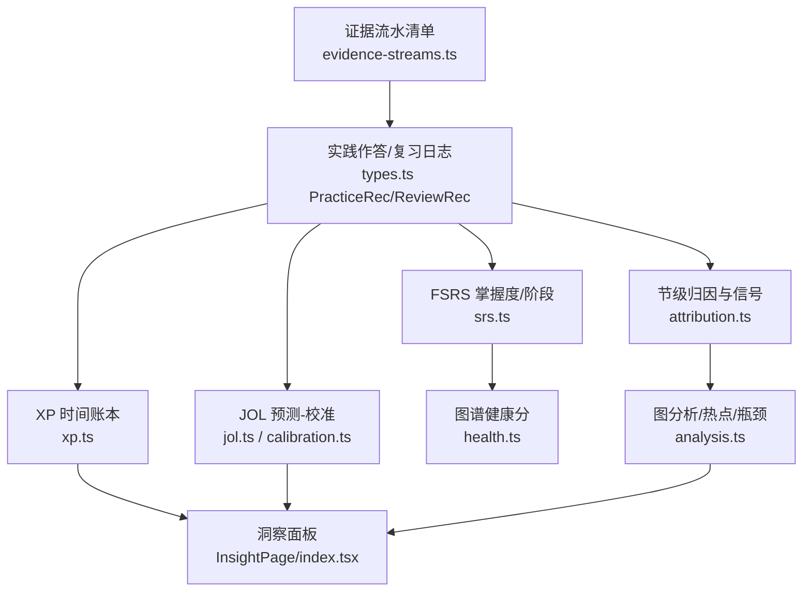
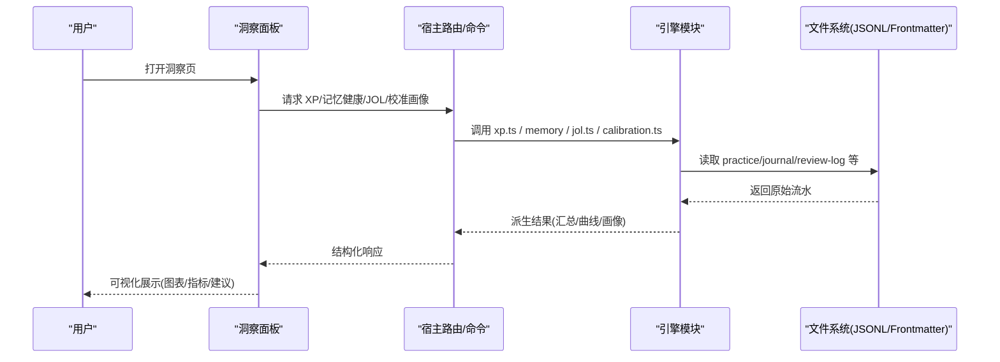
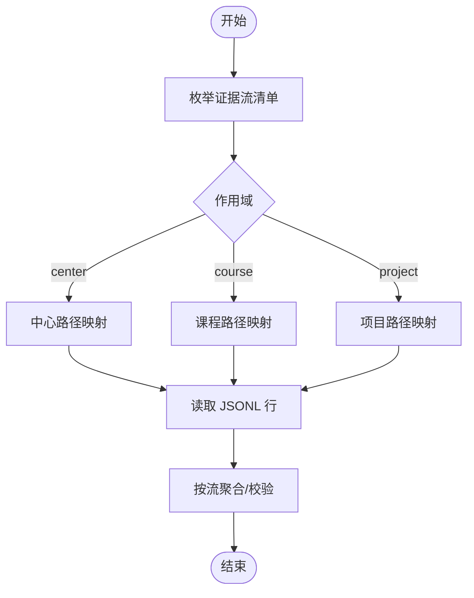
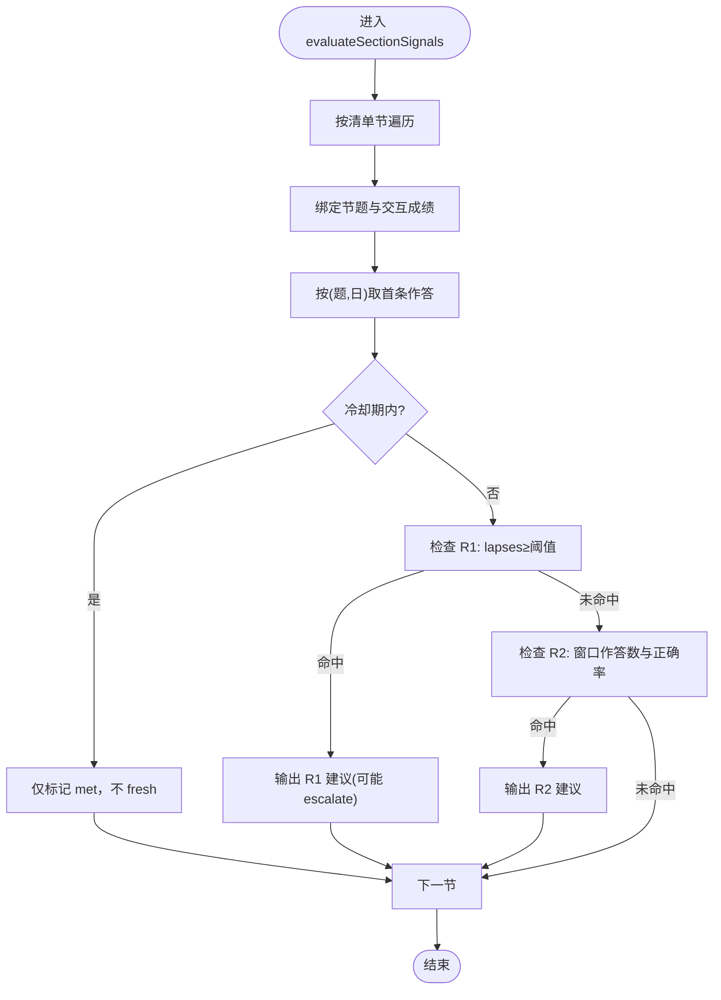
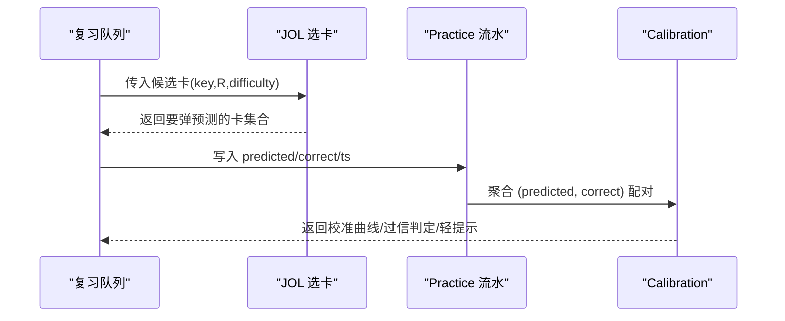
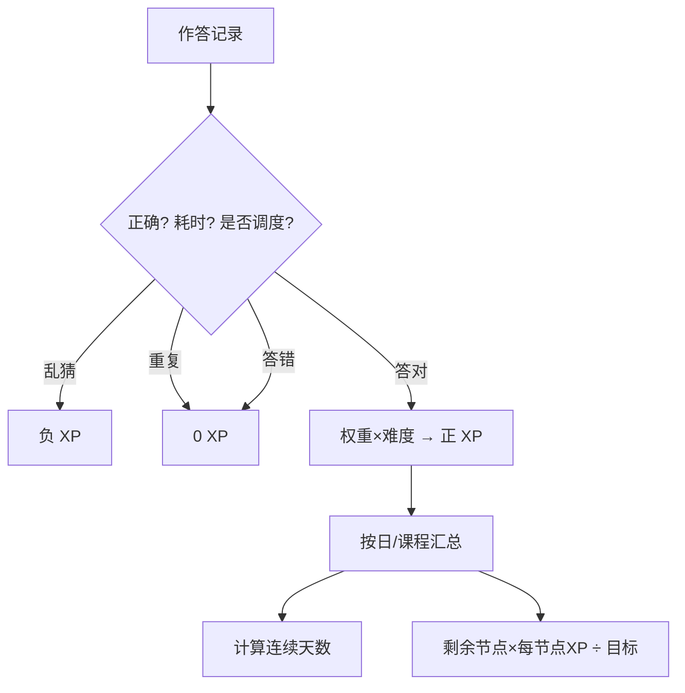
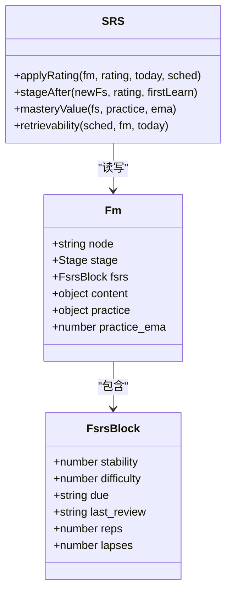
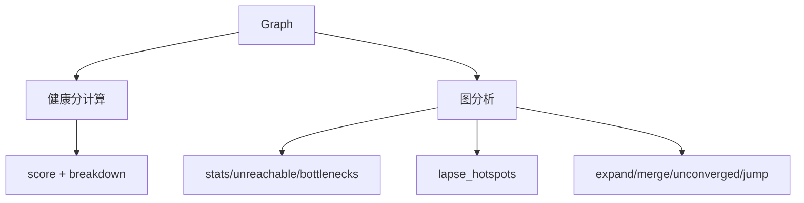
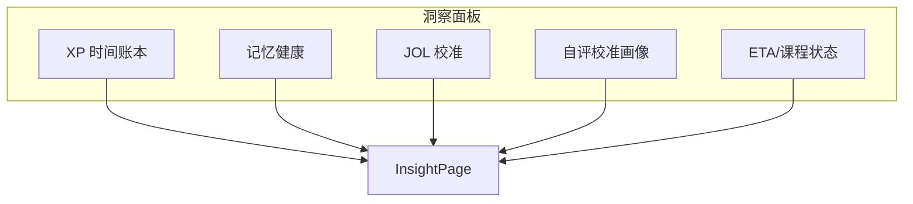
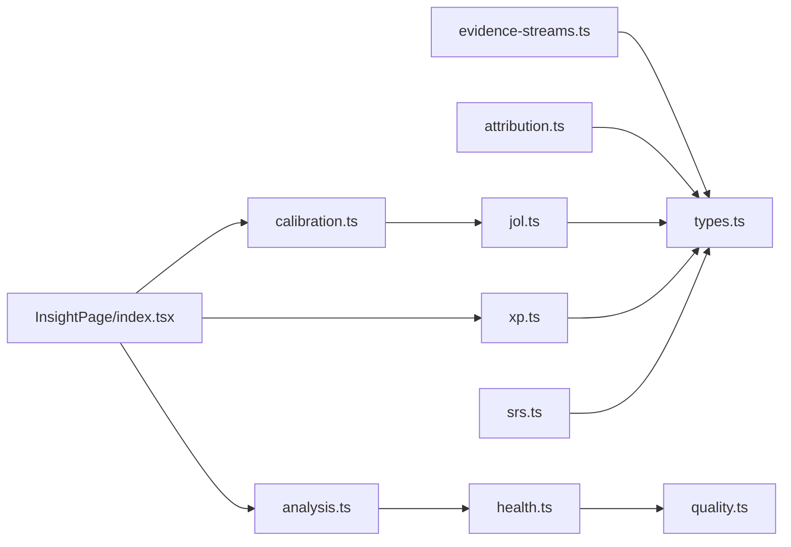

# 证据分析

<cite>
**本文引用的文件**
- [src/engine/evidence-streams.ts](file://src/engine/evidence-streams.ts)
- [src/engine/analysis.ts](file://src/engine/analysis.ts)
- [src/engine/xp.ts](file://src/engine/xp.ts)
- [src/engine/attribution.ts](file://src/engine/attribution.ts)
- [src/engine/calibration.ts](file://src/engine/calibration.ts)
- [src/engine/srs.ts](file://src/engine/srs.ts)
- [src/engine/jol.ts](file://src/engine/jol.ts)
- [src/engine/health.ts](file://src/engine/health.ts)
- [src/engine/types.ts](file://src/engine/types.ts)
- [ui/src/pages/InsightPage/index.tsx](file://ui/src/pages/InsightPage/index.tsx)
- [src/host/handlers.ts](file://src/host/handlers.ts)
- [tests/README.md](file://tests/README.md)
</cite>

## 目录
1. [简介](#简介)
2. [项目结构](#项目结构)
3. [核心组件](#核心组件)
4. [架构总览](#架构总览)
5. [详细组件分析](#详细组件分析)
6. [依赖关系分析](#依赖关系分析)
7. [性能考量](#性能考量)
8. [故障排查指南](#故障排查指南)
9. [结论](#结论)
10. [附录](#附录)

## 简介
本文件面向“证据分析系统”的设计与实现，聚焦以下目标：
- 解释证据流的数据管道：从收集、处理到聚合的完整链路。
- 说明学习信号的识别与分类：答题模式、时间分布、错误类型等。
- 阐述证据权重计算与置信度评估：用于判断学习行为有效性。
- 描述证据与学习者能力的关联分析：技能掌握度推断与学习障碍识别。
- 覆盖实时处理能力与批量分析能力。
- 提供可视化展示与洞察报告生成方法，并给出示例与个性化建议生成路径。

## 项目结构
证据分析系统由“证据流水清单 + 多源信号解析 + 图谱健康与掌握度 + 可视化面板”构成。关键组织方式如下：
- 证据流水清单：集中登记所有可被读侧消费的追加型 JSONL 流（如练习、复习日志、执行事件等），并提供按中心/课程/项目的路径映射。
- 信号识别与归因：基于 practice/journal/bank/fsrs 等既有数据，派生出节级诊断信号（R1/R2）、JOL 校准、过信检测等。
- 掌握度与调度：FSRS 卡片模型驱动复习与掌握度；Mastery 为纯派生值，不直接落盘。
- 可视化与洞察：前端洞察区聚合 XP、记忆健康、自评校准画像、ETA、课程状态等。

图表来源
- [src/engine/evidence-streams.ts:13-39](file://src/engine/evidence-streams.ts#L13-L39)
- [src/engine/types.ts:132-200](file://src/engine/types.ts#L132-L200)
- [src/engine/attribution.ts:141-223](file://src/engine/attribution.ts#L141-L223)
- [src/engine/jol.ts:21-79](file://src/engine/jol.ts#L21-L79)
- [src/engine/calibration.ts:51-103](file://src/engine/calibration.ts#L51-L103)
- [src/engine/xp.ts:20-184](file://src/engine/xp.ts#L20-L184)
- [src/engine/srs.ts:63-183](file://src/engine/srs.ts#L63-L183)
- [src/engine/health.ts:49-104](file://src/engine/health.ts#L49-L104)
- [src/engine/analysis.ts:87-245](file://src/engine/analysis.ts#L87-L245)
- [ui/src/pages/InsightPage/index.tsx:1-207](file://ui/src/pages/InsightPage/index.tsx#L1-L207)

章节来源
- [src/engine/evidence-streams.ts:1-39](file://src/engine/evidence-streams.ts#L1-L39)
- [src/engine/types.ts:132-200](file://src/engine/types.ts#L132-L200)

## 核心组件
- 证据流水清单：统一声明所有有读侧的追加型 JSONL 流，绑定作用域（中心/课程/项目）与路径访问器，便于审计与盘点。
- 节级归因与信号：将题目作答证据经 q.section 绑定到节段，按 R1（单题持续失败）与 R2（节内正确率低且样本足够）触发诊断建议，含冷却与升级策略。
- JOL 预测-校准与过信检测：对复习前预测进行抽样与校准曲线构建，检测系统性过信并提供轻提示。
- XP 时间账本：以“1 XP ≈ 1 分钟有效专注”语义结算作答 XP，支持每日目标、连续天数、ETA 估算。
- FSRS 掌握度与阶段：卡片模型驱动复习与阶段机；Mastery 为稳定度完成度与练习证据的加权派生值。
- 图谱健康分：从图结构维度（命名、est 覆盖率、前置完备、收敛度、结构卫生）输出 0-100 的健康分与分解项。
- 图分析：统计不可达节点、瓶颈、逾期热点，产出渲染元素与建议（扩块、空降、合并、跨步）。
- 洞察面板：聚合 XP、记忆健康、自评校准、ETA、课程状态等，提供可视化与交互入口。

章节来源
- [src/engine/evidence-streams.ts:13-39](file://src/engine/evidence-streams.ts#L13-L39)
- [src/engine/attribution.ts:26-35](file://src/engine/attribution.ts#L26-L35)
- [src/engine/jol.ts:11-79](file://src/engine/jol.ts#L11-L79)
- [src/engine/calibration.ts:25-111](file://src/engine/calibration.ts#L25-L111)
- [src/engine/xp.ts:1-184](file://src/engine/xp.ts#L1-L184)
- [src/engine/srs.ts:1-192](file://src/engine/srs.ts#L1-L192)
- [src/engine/health.ts:1-105](file://src/engine/health.ts#L1-L105)
- [src/engine/analysis.ts:1-254](file://src/engine/analysis.ts#L1-L254)
- [ui/src/pages/InsightPage/index.tsx:1-207](file://ui/src/pages/InsightPage/index.tsx#L1-L207)

## 架构总览
证据分析系统采用“追加型事实源 + 纯函数派生 + 视图层聚合”的分层架构：
- 事实源层：practice.jsonl、journal.jsonl、review-log.jsonl、exec/recall 等 JSONL 流水，以及 frontmatter 中的 FSRS 状态。
- 派生层：各模块以纯函数读取事实源，计算信号、掌握度、健康分、ETA 等，零副作用。
- 视图层：API/命令暴露聚合结果，UI 面板负责可视化与交互。

图表来源
- [ui/src/pages/InsightPage/index.tsx:31-50](file://ui/src/pages/InsightPage/index.tsx#L31-L50)
- [src/host/handlers.ts:701-727](file://src/host/handlers.ts#L701-L727)
- [src/engine/xp.ts:122-184](file://src/engine/xp.ts#L122-L184)
- [src/engine/jol.ts:21-79](file://src/engine/jol.ts#L21-L79)
- [src/engine/calibration.ts:69-103](file://src/engine/calibration.ts#L69-L103)

## 详细组件分析

### 证据流清单与数据管道
- 证据流清单集中登记所有可消费流，包括 journal、practice、review-log、band-log、receipts、e-archive、erratum、habit-repeats、sediment、probation、exec、recall 等，并按 scope 区分中心/课程/项目。
- 每个流定义 stream、scope、getter、pathOf，确保与 paths.ts 的路径成员对账，避免漂移。

图表来源
- [src/engine/evidence-streams.ts:13-39](file://src/engine/evidence-streams.ts#L13-L39)

章节来源
- [src/engine/evidence-streams.ts:1-39](file://src/engine/evidence-streams.ts#L1-L39)

### 学习信号识别与分类（节级归因）
- 输入：题库 manifest、未归档题目（带 fsrs.lapses）、该节点的作答流水投影（按日去重）、既往信号快照、重写落盘记录、今日日期。
- 规则：
  - R1：单题持续失败（lapses≥阈值），若此前已触发则升级为人工处理。
  - R2：自节最近一次重写以来的（题,日）首条作答量≥阈值且正确率低于阈值。
- 冷却：同节上次触发或重写后 N 天内不再产生新触发（建议仍可见）。
- 输出：诊断建议项（含信号类型、是否新鲜、原因、证据、直达动作定位）。

图表来源
- [src/engine/attribution.ts:141-223](file://src/engine/attribution.ts#L141-L223)

章节来源
- [src/engine/attribution.ts:20-35](file://src/engine/attribution.ts#L20-L35)
- [src/engine/attribution.ts:141-223](file://src/engine/attribution.ts#L141-L223)

### JOL 预测-校准与过信检测
- 预测-校准：对复习前预测（会/不会/没把握）进行抽样选卡，优先信息价值（曾有偏差、到期边界 R、难度中段），构建校准曲线（每档的正确率与忘记数）。
- 过信检测：在“会”档配对数达到门槛时，若实际正确率低于显著阈值，判定系统性过信，并生成轻提示文案。
- 全局参考视图：分源自省面 + 全局聚合（标注域特异警戒）。

图表来源
- [src/engine/jol.ts:21-79](file://src/engine/jol.ts#L21-L79)
- [src/engine/calibration.ts:51-111](file://src/engine/calibration.ts#L51-L111)

章节来源
- [src/engine/jol.ts:11-79](file://src/engine/jol.ts#L11-L79)
- [src/engine/calibration.ts:25-111](file://src/engine/calibration.ts#L25-L111)

### XP 时间账本与 ETA
- 作答 XP：答对=题型权重×难度；答错=0；乱猜（耗时短且答错）负 XP；同日重复作答=0。
- 预算制：节点预算=标称 N₀×客观难度校准 k；里程碑过点一次性入账并锁定。
- 每日目标与 streak：从配置读取目标，按日界折叠；streak 宽容漏天。
- ETA：剩余节点×每节点 XP÷每日目标，向上取整。

图表来源
- [src/engine/xp.ts:20-184](file://src/engine/xp.ts#L20-L184)

章节来源
- [src/engine/xp.ts:1-184](file://src/engine/xp.ts#L1-L184)

### FSRS 掌握度与阶段
- 卡片模型：frontmatter fsrs 字段与 ts-fsrs Card 双向转换；评分推进阶段机（learning/review/mastered）。
- 可提取性 R：按 FSRS 计算当前可提取性。
- Mastery：稳定度完成度与练习证据（EMA/正确率）加权；无卡时退化为练习证据。
- 阶段判定：根据稳定性与首次学习标志决定新阶段。

图表来源
- [src/engine/srs.ts:63-183](file://src/engine/srs.ts#L63-L183)
- [src/engine/types.ts:30-61](file://src/engine/types.ts#L30-L61)

章节来源
- [src/engine/srs.ts:1-192](file://src/engine/srs.ts#L1-L192)
- [src/engine/types.ts:30-61](file://src/engine/types.ts#L30-L61)

### 图谱健康分与图分析
- 健康分：动作句比例、est 覆盖率、前置完备、收敛度、结构卫生五项，每项 0-20，总分 0-100。
- 图分析：不可达节点、瓶颈（高扇出解锁）、逾期热点（journal 聚合）、渲染元素（pre/enc 边）、建议（扩块、空降、合并、跨步）。

图表来源
- [src/engine/health.ts:49-104](file://src/engine/health.ts#L49-L104)
- [src/engine/analysis.ts:87-245](file://src/engine/analysis.ts#L87-L245)

章节来源
- [src/engine/health.ts:1-105](file://src/engine/health.ts#L1-L105)
- [src/engine/analysis.ts:1-254](file://src/engine/analysis.ts#L1-L254)

### 可视化与洞察报告
- 洞察区聚合：XP 时间账本、记忆健康仪表盘、自评校准画像、沙盘/N-of-1、睡眠建议、Anki 通道、运行环境、课程状态总览、预计完成天数。
- 交互：开启/关闭 JOL 抽查、调整抽样率、设置每日目标、查看各课程阶段统计。

图表来源
- [ui/src/pages/InsightPage/index.tsx:1-207](file://ui/src/pages/InsightPage/index.tsx#L1-L207)

章节来源
- [ui/src/pages/InsightPage/index.tsx:1-207](file://ui/src/pages/InsightPage/index.tsx#L1-L207)

## 依赖关系分析
- 证据流清单依赖 paths.ts 的路径成员，并通过守卫对账，防止新增流未登记。
- 节级归因依赖 types.ts 的 SectionManifest、PracticeRec、JournalRec 等类型，以及 dates/grading 工具。
- JOL/校准依赖 PracticeRec 的 predicted/correct/ts 字段，复用 jol.ts 的数学口径。
- XP 依赖 params、dates、types，并与 journal/practice 流水解耦但协同。
- FSRS 依赖 ts-fsrs 库与 params（DESIRED_RETENTION、S_MASTER），通过 resolveFsrsParams 统一参数来源。
- 健康分与图分析依赖 graph.ts 的结构与 quality.ts 的辅助函数。
- 洞察面板通过 API 调用各引擎模块，组合展示。

图表来源
- [src/engine/evidence-streams.ts:11-39](file://src/engine/evidence-streams.ts#L11-L39)
- [src/engine/types.ts:132-200](file://src/engine/types.ts#L132-L200)
- [src/engine/attribution.ts:15-18](file://src/engine/attribution.ts#L15-L18)
- [src/engine/jol.ts:8-9](file://src/engine/jol.ts#L8-L9)
- [src/engine/calibration.ts:20-23](file://src/engine/calibration.ts#L20-L23)
- [src/engine/xp.ts:13-18](file://src/engine/xp.ts#L13-L18)
- [src/engine/srs.ts:9-19](file://src/engine/srs.ts#L9-L19)
- [src/engine/health.ts:9-11](file://src/engine/health.ts#L9-L11)
- [src/engine/analysis.ts:6-17](file://src/engine/analysis.ts#L6-L17)
- [ui/src/pages/InsightPage/index.tsx:31-50](file://ui/src/pages/InsightPage/index.tsx#L31-L50)

章节来源
- [src/engine/evidence-streams.ts:11-39](file://src/engine/evidence-streams.ts#L11-L39)
- [src/engine/types.ts:132-200](file://src/engine/types.ts#L132-L200)

## 性能考量
- 纯函数派生：各模块以纯函数形式消费事实源，避免副作用与锁竞争，利于批处理与复算。
- 低数据静默：JOL 校准、教练反馈、过信检测等在数据不足时静默，避免噪声与误判。
- 采样与上限：JOL 抽样率默认约 1/3，列表视图限制 LIST_CAP，防止 UI 膨胀。
- 日界与窗口：streak、窗口聚合使用日界与窗口裁剪，减少不必要计算。
- 健康分与图分析：按图规模动态伸缩建议条目 cap，避免大图的过度输出。

[本节为通用指导，无需具体文件引用]

## 故障排查指南
- 证据流清单对账：新增 .jsonl 路径必须登记到 EVIDENCE_STREAMS，否则守卫报错，便于快速定位遗漏。
- 节级归因冷却：若建议频繁出现，检查冷却期与 base 比较逻辑，确认是否真实有新证据。
- JOL 校准门槛：当配对数不足 JOL_CALIBRATION_MIN 时，曲线与过信判定为 null，属正常静默。
- XP 乱猜惩罚：提交过快且答错记负 XP，需结合 elapsed_s 与 scheduled 判断。
- FSRS 参数来源：resolveFsrsParams 优先沉淀正典，其次课程缓存，最后默认；参数不一致会导致调度差异。
- 健康分异常：检查 est 分布压缩提示与结构卫生扣分项，定位命名/连接问题。

章节来源
- [src/engine/evidence-streams.ts:1-10](file://src/engine/evidence-streams.ts#L1-L10)
- [src/engine/attribution.ts:175-182](file://src/engine/attribution.ts#L175-L182)
- [src/engine/jol.ts:64-79](file://src/engine/jol.ts#L64-L79)
- [src/engine/xp.ts:26-34](file://src/engine/xp.ts#L26-L34)
- [src/engine/srs.ts:29-49](file://src/engine/srs.ts#L29-L49)
- [src/engine/health.ts:31-47](file://src/engine/health.ts#L31-L47)

## 结论
本证据分析系统以“事实源 + 纯函数派生 + 视图聚合”为核心，实现了从证据收集、信号识别、权重计算、置信度评估到可视化展示的完整闭环。通过节级归因、JOL 校准、XP 账本、FSRS 掌握度与健康分等模块，系统能够准确识别学习行为的有效性，推断技能掌握度与学习障碍，并提供实时与批量分析能力。洞察面板将复杂指标转化为可读可视化的洞察报告，支持个性化建议生成与干预。

[本节为总结，无需具体文件引用]

## 附录
- 证据流清单与守卫：新增流需同步登记，保证审计一致性。
- 节级归因阈值：R1_LAPSES、R2_MIN_ATTEMPTS、R2_ACCURACY、SIGNAL_COOLDOWN_DAYS 可调。
- JOL 抽样率与门槛：JOL_SAMPLE_RATE、JOL_CALIBRATION_MIN 控制体验与精度。
- XP 参数：XP_BASE、XP_GUESS_SECONDS、XP_PER_NODE_DEFAULT、DAILY_XP_GOAL_DEFAULT 等。
- FSRS 参数：DESIRED_RETENTION、S_MASTER、FSRS6_PARAM_COUNT。
- 健康分指标：action_naming、est_coverage、pre_completeness、convergence、structure_hygiene。

章节来源
- [src/engine/attribution.ts:26-35](file://src/engine/attribution.ts#L26-L35)
- [src/engine/jol.ts:15-19](file://src/engine/jol.ts#L15-L19)
- [src/engine/xp.ts:15-16](file://src/engine/xp.ts#L15-L16)
- [src/engine/srs.ts:16-18](file://src/engine/srs.ts#L16-L18)
- [src/engine/health.ts:95-104](file://src/engine/health.ts#L95-L104)