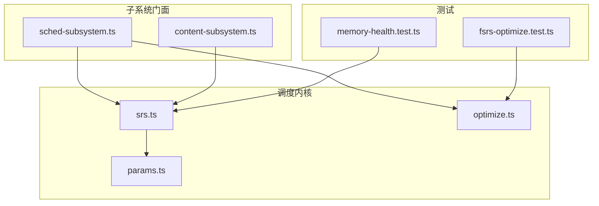
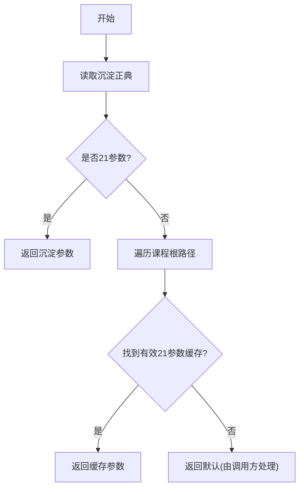
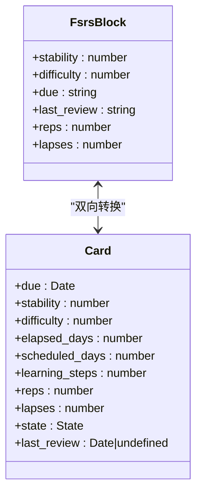
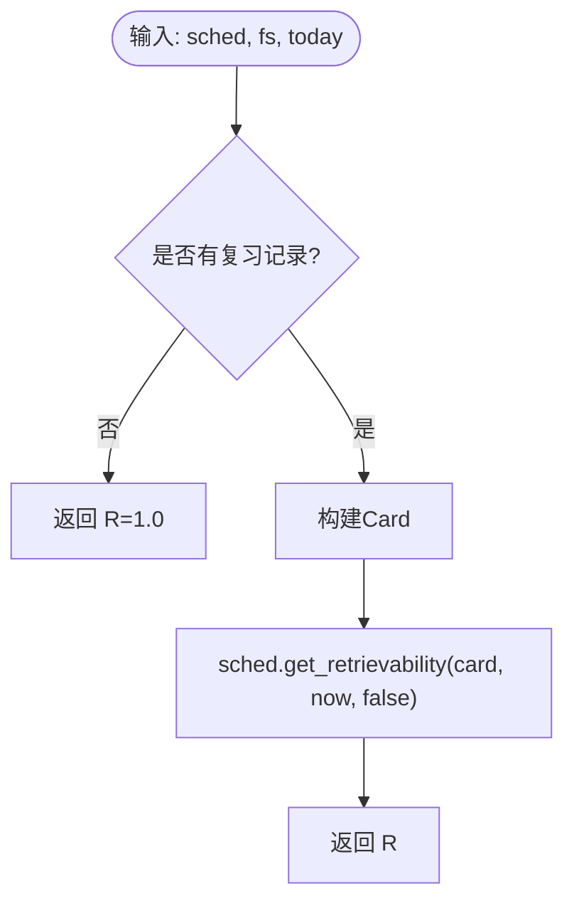
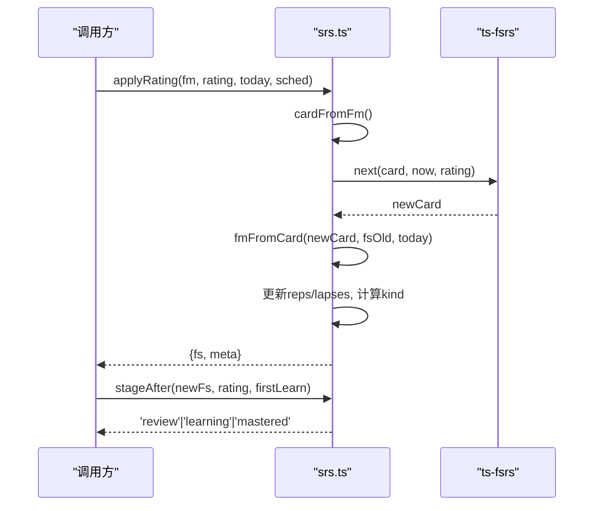
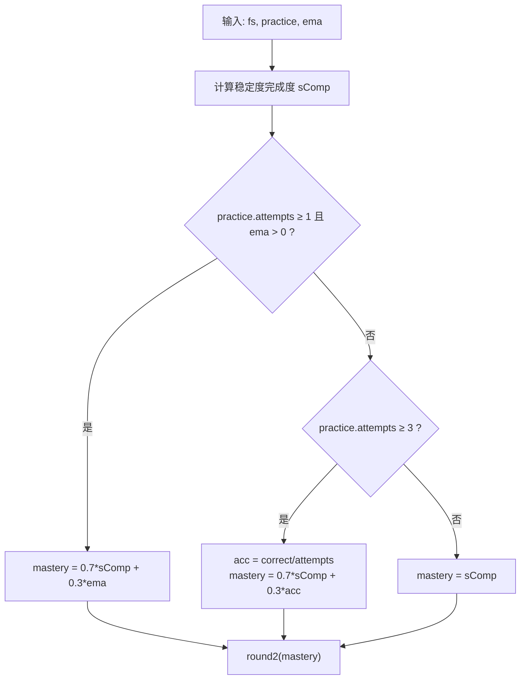
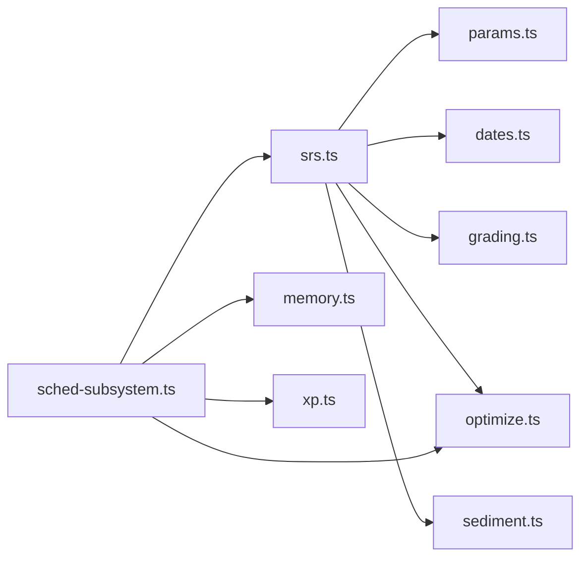

# FSRS算法核心

<cite>
**本文引用的文件**
- [srs.ts](file://src/engine/srs.ts)
- [params.ts](file://src/engine/params.ts)
- [optimize.ts](file://src/engine/optimize.ts)
- [sched-subsystem.ts](file://src/engine/sched-subsystem.ts)
- [content-subsystem.ts](file://src/engine/content-subsystem.ts)
- [memory-health.test.ts](file://tests/memory-health.test.ts)
- [fsrs-optimize.test.ts](file://tests/fsrs-optimize.test.ts)
</cite>

## 目录
1. [简介](#简介)
2. [项目结构](#项目结构)
3. [核心组件](#核心组件)
4. [架构总览](#架构总览)
5. [详细组件分析](#详细组件分析)
6. [依赖关系分析](#依赖关系分析)
7. [性能考虑](#性能考虑)
8. [故障排查指南](#故障排查指南)
9. [结论](#结论)
10. [附录：配置示例与使用场景](#附录配置示例与使用场景)

## 简介
本文件聚焦于仓库中的FSRS-6调度内核实现，围绕记忆曲线计算、可提取性预测、复习时间优化、参数解析机制、卡片状态管理、评分应用逻辑以及掌握度计算进行系统化说明。目标是让读者在不深入源码的情况下，也能理解并正确使用该调度系统，同时提供性能优化建议与调试方法。

## 项目结构
FSRS-6调度相关代码集中在 engine 子系统中，关键文件职责如下：
- srs.ts：FSRS-6调度内核（参数解析、卡片转换、可提取性、评分推进、阶段机、掌握度）。
- params.ts：可调参数集中表（期望保留率、稳定度阈值等）。
- optimize.ts：FSRS-6参数优化器（从真实复习日志重训21参数，含门禁与评估）。
- sched-subsystem.ts：调度子系统门面（参数优化写回、记忆健康仪表盘、沉淀层交互）。
- content-subsystem.ts：内容子系统（练习证据回流、题目级FSRS推进、代表卡刷新）。
- tests/*：覆盖参数优化、记忆健康、训练序列等行为的测试用例。



图表来源
- [srs.ts:1-192](file://src/engine/srs.ts#L1-L192)
- [params.ts:1-59](file://src/engine/params.ts#L1-L59)
- [optimize.ts:1-141](file://src/engine/optimize.ts#L1-L141)
- [sched-subsystem.ts:350-450](file://src/engine/sched-subsystem.ts#L350-L450)
- [content-subsystem.ts:771-793](file://src/engine/content-subsystem.ts#L771-L793)
- [memory-health.test.ts:50-118](file://tests/memory-health.test.ts#L50-L118)
- [fsrs-optimize.test.ts:1-181](file://tests/fsrs-optimize.test.ts#L1-L181)

章节来源
- [srs.ts:1-192](file://src/engine/srs.ts#L1-L192)
- [params.ts:1-59](file://src/engine/params.ts#L1-L59)
- [optimize.ts:1-141](file://src/engine/optimize.ts#L1-L141)
- [sched-subsystem.ts:350-450](file://src/engine/sched-subsystem.ts#L350-L450)
- [content-subsystem.ts:771-793](file://src/engine/content-subsystem.ts#L771-L793)
- [memory-health.test.ts:50-118](file://tests/memory-health.test.ts#L50-L118)
- [fsrs-optimize.test.ts:1-181](file://tests/fsrs-optimize.test.ts#L1-L181)

## 核心组件
- 参数解析与调度器构造：resolveFsrsParams、getScheduler
- 卡片状态转换：cardFromFm、fmFromCard
- 可提取性预测：retrievability、retrievabilityBlock
- 评分推进与阶段机：applyRating、stageAfter、applyRatingBlock、previewDue
- 掌握度计算：masteryValue、masteryOfFm
- 参数优化：trainingSequences、trainAndEvaluate、evaluateParams、optimizeFsrsParams

章节来源
- [srs.ts:29-61](file://src/engine/srs.ts#L29-L61)
- [srs.ts:63-105](file://src/engine/srs.ts#L63-L105)
- [srs.ts:107-163](file://src/engine/srs.ts#L107-L163)
- [srs.ts:165-183](file://src/engine/srs.ts#L165-L183)
- [optimize.ts:44-131](file://src/engine/optimize.ts#L44-L131)
- [sched-subsystem.ts:361-450](file://src/engine/sched-subsystem.ts#L361-L450)

## 架构总览
FSRS-6调度内核以“日粒度、无fuzz、关闭短期学习步”的方式运行，通过ts-fsrs库实现记忆曲线与下次到期日计算。参数来源遵循“沉淀正典→课程缓存→官方默认”的优先级；评分推进将frontmatter fsrs块与ts-fsrs Card双向转换；掌握度由稳定度完成度与练习证据加权组合；参数优化器基于真实复习日志重训21参数，并通过严格门禁与评估决定是否写回。

```mermaid
sequenceDiagram
participant UI as "调用方"
participant SCHED as "sched-subsystem.ts"
participant SRS as "srs.ts"
participant OPT as "optimize.ts"
participant STORE as "store.ts"
participant FS as "VaultFs"
UI->>SCHED : 触发优化或查询记忆健康
SCHED->>STORE : 读取复习日志/练习记录
SCHED->>OPT : trainingSequences(过滤+归一化)
OPT-->>SCHED : 训练序列
SCHED->>OPT : trainAndEvaluate / evaluateParams
OPT-->>SCHED : 新参数 + 指标
SCHED->>SRS : getScheduler(按优先级取参)
SRS->>SRS : resolveFsrsParams(沉淀→缓存→默认)
SCHED->>SCHED : 评估对比基线(logLoss)
alt 优于基线
SCHED->>FS : 写沉淀正典 + 逐课程缓存镜像
SCHED->>SCHED : 失效调度器缓存 + 重建学习者档案
else 不优于基线
SCHED-->>UI : 跳过并返回原因
end
```

图表来源
- [sched-subsystem.ts:361-450](file://src/engine/sched-subsystem.ts#L361-L450)
- [srs.ts:29-61](file://src/engine/srs.ts#L29-L61)
- [optimize.ts:44-131](file://src/engine/optimize.ts#L44-L131)

## 详细组件分析

### 参数解析机制（resolveFsrsParams）
- 优先级：沉淀正典（latestFsrsParams）→ 课程参数缓存（按传入顺序逐个查找）→ 官方默认（undefined，由调用方决定省略w或用defaultParams对照）。
- 长度校验：仅当参数长度为FSRS-6的21个时才视为有效。
- 用途：getScheduler据此构造调度器，确保调度与优化器基线口径一致。



图表来源
- [srs.ts:29-49](file://src/engine/srs.ts#L29-L49)
- [optimize.ts:31-32](file://src/engine/optimize.ts#L31-L32)

章节来源
- [srs.ts:29-61](file://src/engine/srs.ts#L29-L61)
- [optimize.ts:31-32](file://src/engine/optimize.ts#L31-L32)

### 卡片状态管理（cardFromFm、fmFromCard）
- cardFromFm：将frontmatter中的fsrs块转换为ts-fsrs Card；若无复习记录则创建空卡。
- fmFromCard：将Card写回fsrs块，保留累计reps/lapses，更新due与last_review。
- 作用：统一前端/题库/调度之间的状态表示，避免时钟直读，日期由调用方传入today。



图表来源
- [srs.ts:63-92](file://src/engine/srs.ts#L63-L92)

章节来源
- [srs.ts:63-92](file://src/engine/srs.ts#L63-L92)

### 可提取性预测（retrievability、retrievabilityBlock）
- retrievability：基于当前fsrs块与今日日期，调用调度器计算R；无复习记录时视为1.0。
- retrievabilityBlock：题卡级便捷入口，直接对fsrs块计算R，省去伪Fm包装。
- 用途：复习队列排序、负载预报、校准分箱等。



图表来源
- [srs.ts:94-105](file://src/engine/srs.ts#L94-L105)

章节来源
- [srs.ts:94-105](file://src/engine/srs.ts#L94-L105)

### 评分应用逻辑（applyRating、stageAfter、applyRatingBlock、previewDue）
- applyRating：一次评分推进fsrs块，计算elapsed_days，标记kind（learn/review/relearn），更新reps/lapses。
- stageAfter：根据新稳定度与首次学习标志判定节点阶段（review/learning/mastered）。
- applyRatingBlock：题卡级评分推进（无节点stage）。
- previewDue：预览某评分后的下次到期日（不落盘）。



图表来源
- [srs.ts:107-163](file://src/engine/srs.ts#L107-L163)

章节来源
- [srs.ts:107-163](file://src/engine/srs.ts#L107-L163)

### 掌握度计算算法（masteryValue、masteryOfFm）
- 公式：mastery = 0.7·稳定度完成度 + 0.3·练习证据
- 稳定度完成度：min(1, S/(2·S_MASTER))；无复习记录时为0。
- 练习证据：优先使用EMA（若存在且>0），否则使用正确率（attempts≥3时）。
- masteryOfFm：节点级唯一入口，聚合fsrs/practice/practice_ema。



图表来源
- [srs.ts:165-183](file://src/engine/srs.ts#L165-L183)
- [params.ts:4-6](file://src/engine/params.ts#L4-L6)

章节来源
- [srs.ts:165-183](file://src/engine/srs.ts#L165-L183)
- [params.ts:4-6](file://src/engine/params.ts#L4-L6)

### 参数优化流程（trainingSequences → trainAndEvaluate → 写回门禁）
- 数据准备：排除synthetic，每卡每天只取第一条，首条delta_t=0。
- 训练：调用binding.computeParameters生成21参数向量。
- 评估：in-sample logLoss对比基线（现参/默认），时序切分评估作为泛化估计（小数据可能为null）。
- 写回：仅当新参数优于基线且长度为21时，写入沉淀正典与课程缓存，失效调度器缓存并重建学习者档案。

```mermaid
sequenceDiagram
participant SCHED as "sched-subsystem.ts"
participant OPT as "optimize.ts"
participant BIND as "@open-spaced-repetition/binding"
participant FS as "VaultFs"
SCHED->>OPT : trainingSequences(reviewLog)
OPT-->>SCHED : seqs
SCHED->>OPT : trainAndEvaluate(seqs)
OPT->>BIND : computeParameters(items)
BIND-->>OPT : parameters(21)
OPT-->>SCHED : parameters + splitEval?
SCHED->>OPT : evaluate(baselineParams, seqs)
OPT-->>SCHED : baselineMetrics
SCHED->>OPT : evaluate(parameters, seqs)
OPT-->>SCHED : newMetrics
alt 新参数更优
SCHED->>FS : 写沉淀正典 + 课程缓存镜像
SCHED->>SCHED : 失效缓存 + 重建档案
else 不优于基线
SCHED-->>SCHED : 跳过并记录原因
end
```

图表来源
- [optimize.ts:44-131](file://src/engine/optimize.ts#L44-L131)
- [sched-subsystem.ts:361-450](file://src/engine/sched-subsystem.ts#L361-L450)

章节来源
- [optimize.ts:44-131](file://src/engine/optimize.ts#L44-L131)
- [sched-subsystem.ts:361-450](file://src/engine/sched-subsystem.ts#L361-L450)

### 内容子系统与题目级FSRS推进
- 练习证据回流：根据作答对错映射rating（对=3、错=1），推进题目级FSRS并写回题库。
- 代表卡刷新：节点聚合代表卡为全部未归档题中due最早那张的快照，用于展示与审计。
- 幂等与门控：每题每天最多推进一次；复习流答对时挂起自评档位，背面自评经questionRate落盘。

章节来源
- [content-subsystem.ts:771-793](file://src/engine/content-subsystem.ts#L771-L793)
- [content-subsystem.ts:1017-1046](file://src/engine/content-subsystem.ts#L1017-L1046)

## 依赖关系分析
- srs.ts依赖params.ts（DESIRED_RETENTION、S_MASTER）、dates.ts、grading.ts、optimize.ts（FSRS6_PARAM_COUNT）、sediment.ts（latestFsrsParams）。
- sched-subsystem.ts依赖srs.ts、optimize.ts、memory.ts、xp.ts、notes.ts、store.ts、registry.ts、bank.ts等。
- optimize.ts封装@open-spaced-repetition/binding，隔离原生模块引用。



图表来源
- [srs.ts:1-192](file://src/engine/srs.ts#L1-L192)
- [sched-subsystem.ts:1-200](file://src/engine/sched-subsystem.ts#L1-L200)
- [optimize.ts:1-141](file://src/engine/optimize.ts#L1-L141)

章节来源
- [srs.ts:1-192](file://src/engine/srs.ts#L1-L192)
- [sched-subsystem.ts:1-200](file://src/engine/sched-subsystem.ts#L1-L200)
- [optimize.ts:1-141](file://src/engine/optimize.ts#L1-L141)

## 性能考虑
- 日粒度与短学期关闭：减少不必要的分钟级学习步，降低计算开销。
- 参数缓存失效策略：优化后清空调度器缓存，避免旧参数污染后续推进。
- 训练数据门限：≥400条真实复习日志才训练，避免小数据过拟合与无效写回。
- 批量操作原子写：使用runWriteUnit保证正典与缓存镜像的一致性，失败不回滚但可追踪。
- 可提取性计算复用：retrievabilityBlock避免重复包装Fm，提升队列扫描效率。

[本节为通用指导，无需特定文件来源]

## 故障排查指南
- 参数长度不符：优化产出非21参数将被拒绝写回；检查binding版本与训练输入形状。
- 数据不足：真实复习日志少于400条将跳过训练；确认rating_source为auto/self，排除synthetic。
- 基线评估未改善：新参数logLoss不低于基线则不写回；检查baselineSource（沉淀/缓存/默认）与评估协议一致性。
- 调度器缓存未失效：优化后需清空schedCache；确认write unit步骤执行完整。
- 可提取性异常：确认today由learningDay贯穿，日期解析无误；无复习记录时R=1.0属预期。

章节来源
- [sched-subsystem.ts:361-450](file://src/engine/sched-subsystem.ts#L361-L450)
- [optimize.ts:25-32](file://src/engine/optimize.ts#L25-L32)
- [srs.ts:94-105](file://src/engine/srs.ts#L94-L105)

## 结论
本FSRS-6调度内核以严谨的参数优先级、清晰的卡片状态转换、稳定的评分推进与掌握度计算为核心，结合参数优化器的门禁与评估机制，实现了可解释、可验证、可扩展的记忆调度系统。通过日粒度、无fuzz的设计，兼顾了准确性与性能；通过沉淀正典与课程缓存的双写策略，保证了事实源的唯一性与容错性。

[本节为总结性内容，无需特定文件来源]

## 附录：配置示例与使用场景
- 期望保留率：DESIRED_RETENTION=0.9（影响下次到期日计算）。
- 掌握阈值：S_MASTER=30天（达到该稳定度标记为mastered）。
- 中性难度：FSRS_DIFFICULTY_MID=5（用于难度因子k校准）。
- 复习占比：REVIEW_RATIO=0.6（任务包中复习时间占比）。
- 日均能力：DAILY_CAPACITY=20（防过载基准）。
- 软重启间隔：SOFT_RESTART_GAP=3天（空窗≥N天进入软重启）。
- 复诊期默认：RECHECK_DAYS_DEFAULT=10天（可被note.recheck.days覆盖）。

使用场景演示
- 复习队列排序：按retrievabilityBlock计算R，结合题目难度排序，优先刷低R高难度题。
- 自评预览：调用previewDue查看Hard/Good/Easy后的下次到期日，辅助用户决策。
- 参数优化：积累≥400条真实复习日志后触发优化，评估优于基线则写回沉淀正典与课程缓存。
- 记忆健康面板：统计预测保留率vs真实保留率、遗忘曲线、每日复习负载预报，辅助校准与调参。

章节来源
- [params.ts:4-17](file://src/engine/params.ts#L4-L17)
- [srs.ts:156-163](file://src/engine/srs.ts#L156-L163)
- [memory-health.test.ts:50-118](file://tests/memory-health.test.ts#L50-L118)
- [fsrs-optimize.test.ts:96-181](file://tests/fsrs-optimize.test.ts#L96-L181)