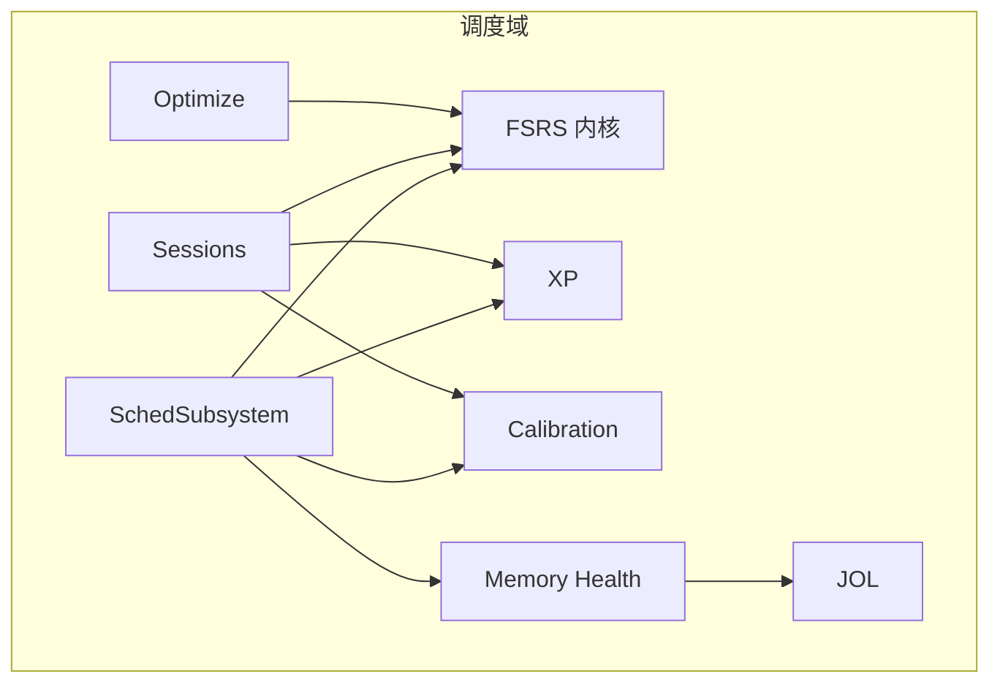
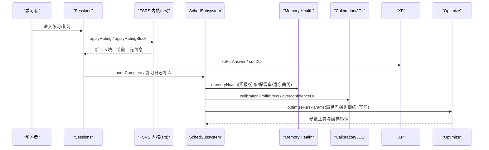
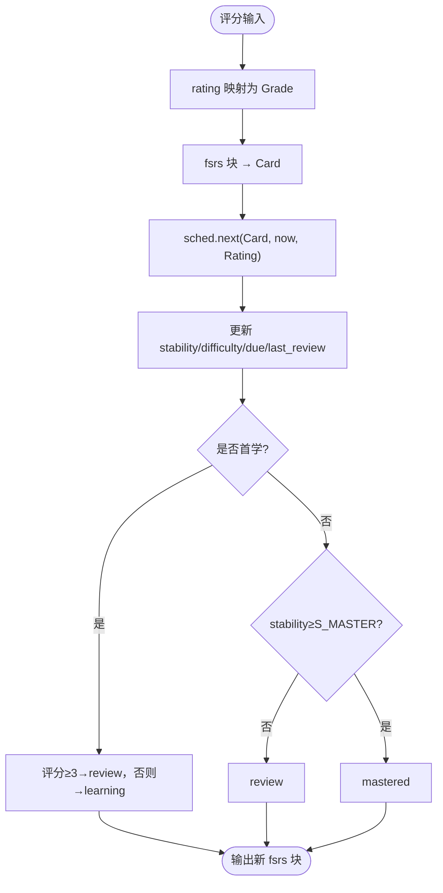
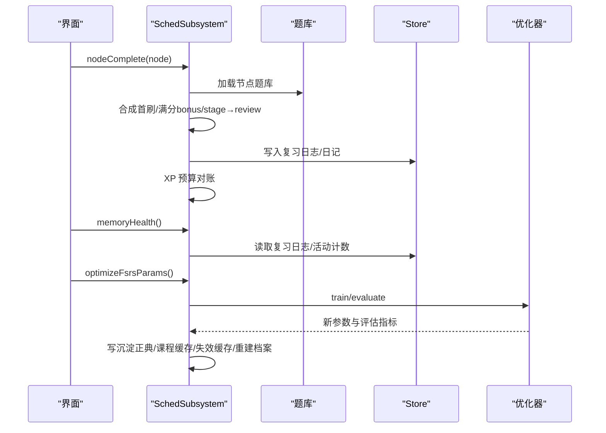
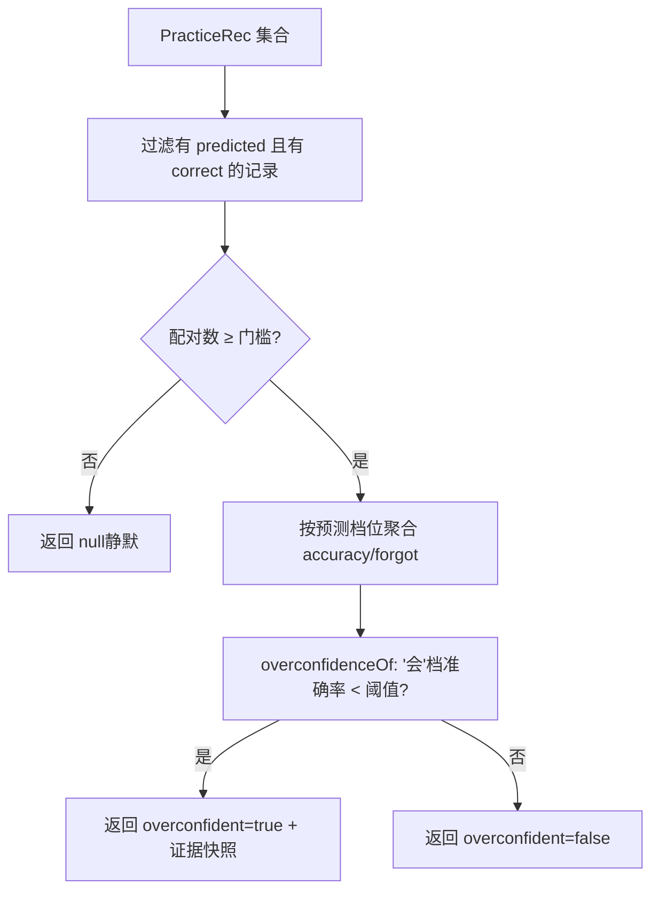
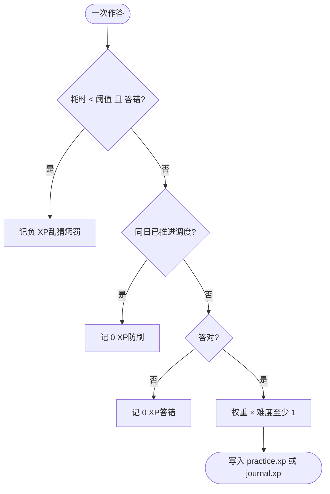
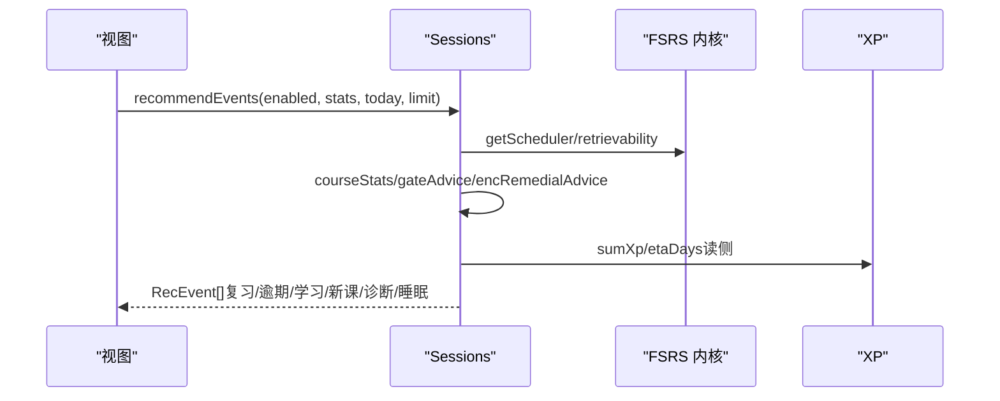
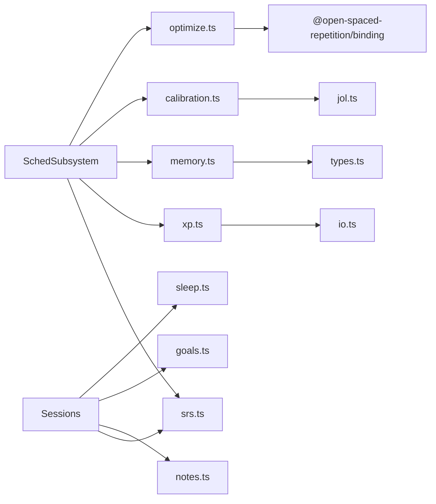

# 学习调度系统

<cite>
**本文引用的文件**
- [sched-subsystem.ts](file://src/engine/sched-subsystem.ts)
- [srs.ts](file://src/engine/srs.ts)
- [calibration.ts](file://src/engine/calibration.ts)
- [xp.ts](file://src/engine/xp.ts)
- [sessions.ts](file://src/engine/sessions.ts)
- [memory.ts](file://src/engine/memory.ts)
- [jol.ts](file://src/engine/jol.ts)
- [params.ts](file://src/engine/params.ts)
- [optimize.ts](file://src/engine/optimize.ts)
- [0022-self-calibration-profile.md](file://docs/adr/0022-self-calibration-profile.md)
</cite>

## 目录
1. [简介](#简介)
2. [项目结构](#项目结构)
3. [核心组件](#核心组件)
4. [架构总览](#架构总览)
5. [详细组件分析](#详细组件分析)
6. [依赖关系分析](#依赖关系分析)
7. [性能考量](#性能考量)
8. [故障排查指南](#故障排查指南)
9. [结论](#结论)
10. [附录：配置示例与使用场景](#附录配置示例与使用场景)

## 简介
本文件面向“学习调度系统”的学习者、教练与开发者，系统性阐述基于 FSRS（Free Spaced Repetition Scheduler）的智能复习计划生成机制。内容覆盖记忆曲线计算、复习时间预测、掌握度评估、校准系统、经验值（XP）与成就机制、学习会话管理、调度策略自定义与算法优化选项，以及学习数据的统计分析与可视化方案，并给出具体配置示例与使用场景演示。

## 项目结构
学习调度系统位于 engine 层，围绕“调度域”组织代码：
- 调度子系统：节点跳过/完成确认、XP 时间账本、记忆健康仪表盘、FSRS 参数优化器、沉淀层
- FSRS 内核：卡片状态转换、评分推进、可提取性计算、阶段机
- 校准系统：自评（JOL）与实际表现配对画像、过信检测
- XP 系统：作答计分、预算制定价、每日目标与连续打卡
- 会话与推荐：课程状态、动态推荐事件、学习包
- 记忆健康聚合：负载预报、状态分布、真实保留率、遗忘曲线
- JOL 抽样与校准：预测-校准曲线、偏差识别
- 参数表：全局可调阈值与默认值
- 优化器：从真实复习日志重训 FSRS-6 参数

图表来源
- [sched-subsystem.ts:83-546](file://src/engine/sched-subsystem.ts#L83-L546)
- [sessions.ts:293-572](file://src/engine/sessions.ts#L293-L572)
- [xp.ts:20-184](file://src/engine/xp.ts#L20-L184)
- [calibration.ts:20-111](file://src/engine/calibration.ts#L20-L111)
- [memory.ts:1-119](file://src/engine/memory.ts#L1-L119)
- [jol.ts:1-79](file://src/engine/jol.ts#L1-L79)
- [optimize.ts:1-141](file://src/engine/optimize.ts#L1-L141)
- [srs.ts:1-192](file://src/engine/srs.ts#L1-L192)

章节来源
- [sched-subsystem.ts:83-546](file://src/engine/sched-subsystem.ts#L83-L546)
- [sessions.ts:293-572](file://src/engine/sessions.ts#L293-L572)

## 核心组件
- FSRS 内核（srs.ts）：提供参数解析、卡片构建/回写、评分推进、阶段判定、可提取性与掌握度计算
- 调度子系统（sched-subsystem.ts）：节点跳过/完成、XP 对账、记忆健康、FSRS 参数优化、沉淀事件
- 会话与推荐（sessions.ts）：课程状态、动态推荐事件、学习包、软闸建议与睡眠耦合
- XP 系统（xp.ts）：作答计分、预算定价、每日目标、连续打卡、ETA
- 校准系统（calibration.ts + jol.ts）：自评（会/不会/没把握）与实际结果配对、过信检测、提示文案
- 记忆健康（memory.ts）：负载预报、状态直方图、真实保留率、预测-真实对照、遗忘曲线
- 优化器（optimize.ts）：从真实复习日志训练 FSRS-6 参数，门禁与写回流程
- 参数表（params.ts）：全局阈值与默认值（期望保留率、R_gate、mastered 阈值等）

章节来源
- [srs.ts:1-192](file://src/engine/srs.ts#L1-L192)
- [sched-subsystem.ts:83-546](file://src/engine/sched-subsystem.ts#L83-L546)
- [sessions.ts:293-572](file://src/engine/sessions.ts#L293-L572)
- [xp.ts:20-184](file://src/engine/xp.ts#L20-L184)
- [calibration.ts:20-111](file://src/engine/calibration.ts#L20-L111)
- [memory.ts:1-119](file://src/engine/memory.ts#L1-L119)
- [jol.ts:1-79](file://src/engine/jol.ts#L1-L79)
- [optimize.ts:1-141](file://src/engine/optimize.ts#L1-L141)
- [params.ts:1-59](file://src/engine/params.ts#L1-L59)

## 架构总览
下图展示学习调度的关键数据流与控制流：用户作答触发 FSRS 评分推进，更新卡片与阶段；调度子系统汇总复习日志生成记忆健康视图；校准系统对比自评与实际表现；XP 系统记录时间与预算；优化器在满足门槛后重训参数并写回正典与缓存。

图表来源
- [sessions.ts:361-572](file://src/engine/sessions.ts#L361-L572)
- [srs.ts:107-154](file://src/engine/srs.ts#L107-L154)
- [sched-subsystem.ts:328-450](file://src/engine/sched-subsystem.ts#L328-L450)
- [memory.ts:17-119](file://src/engine/memory.ts#L17-L119)
- [calibration.ts:53-111](file://src/engine/calibration.ts#L53-L111)
- [xp.ts:20-184](file://src/engine/xp.ts#L20-L184)
- [optimize.ts:44-141](file://src/engine/optimize.ts#L44-L141)

## 详细组件分析

### FSRS 内核（记忆曲线、复习时间预测、掌握度）
- 参数解析与调度器构造：统一从沉淀正典→课程缓存→官方默认取参，保证口径一致
- 卡片构建与回写：frontmatter 的 fsrs 块与 ts-fsrs Card 双向转换，维护 reps/lapses 累计
- 评分推进：按 rating 映射到 Again/Hard/Good/Easy，计算 elapsed_days、更新稳定性/难度/到期日
- 阶段机：首学根据评分决定 review/learning；复习中达到 master 阈值即 mastered
- 可提取性 R：按当前卡与 today 计算，用于推荐排序与软闸
- 掌握度：综合稳定度完成度与练习证据（EMA 或正确率），仅展示不驱动调度

图表来源
- [srs.ts:107-154](file://src/engine/srs.ts#L107-L154)
- [srs.ts:135-141](file://src/engine/srs.ts#L135-L141)
- [params.ts:4-17](file://src/engine/params.ts#L4-L17)

章节来源
- [srs.ts:29-192](file://src/engine/srs.ts#L29-L192)
- [params.ts:4-17](file://src/engine/params.ts#L4-L17)

### 调度子系统（节点完成、XP 对账、记忆健康、参数优化、沉淀）
- 节点跳过/完成：跳过即归档题库；完成时合成首刷、满分 bonus、stage→review、T1/T2 入队、XP 预算对账
- XP 视图：今日 XP、streak、每日目标、每课程 ETA（剩余预算 ÷ 每日目标）
- 记忆健康：跨课程 due 扫描、状态直方图、真实保留率、预测-真实对照、遗忘曲线、JOL 校准
- FSRS 参数优化：收集真实复习序列，训练后评估优于基线才写回正典与课程缓存，失效调度器缓存并重建学习者档案投影
- 沉淀层：追加事件、折叠、重建学习者档案

图表来源
- [sched-subsystem.ts:98-270](file://src/engine/sched-subsystem.ts#L98-L270)
- [sched-subsystem.ts:328-450](file://src/engine/sched-subsystem.ts#L328-L450)
- [optimize.ts:44-141](file://src/engine/optimize.ts#L44-L141)

章节来源
- [sched-subsystem.ts:83-546](file://src/engine/sched-subsystem.ts#L83-L546)

### 校准系统（自评画像与过信检测）
- 配对契约：同一事件同时携带自评档与客观判分即落一条配对（源枚举与时间戳）
- 聚合视图：分源自省面（v1 为 JOL），全局参考视图带域特异警告
- 过信检测：「会」档实际正确率持续低于阈值且样本足够时检出，给出轻提示并加强 JOL 抽查密度
- 红线：画像只读派生，不改变 canonical 写入，不影响 Mastery/XP

图表来源
- [calibration.ts:53-111](file://src/engine/calibration.ts#L53-L111)
- [jol.ts:64-79](file://src/engine/jol.ts#L64-L79)
- [0022-self-calibration-profile.md:1-27](file://docs/adr/0022-self-calibration-profile.md#L1-L27)

章节来源
- [calibration.ts:20-111](file://src/engine/calibration.ts#L20-L111)
- [jol.ts:1-79](file://src/engine/jol.ts#L1-L79)
- [0022-self-calibration-profile.md:1-27](file://docs/adr/0022-self-calibration-profile.md#L1-L27)

### XP 系统与成就机制
- 计分规则：答对=权重×难度；答错=0；乱猜（耗时短且错）负 XP；同日重复=0
- 预算定价：节点预算 = 标称 N₀ × 客观难度校准 k；完成时对账锁定定价
- 里程碑定价：N₀ 来自 est 申报或常量，k 复用节点题池难度校准
- 每日目标与连续打卡：read/write daily goal；streak 宽容天数不断链
- ETA：剩余预算 ÷ 每日目标

图表来源
- [xp.ts:20-34](file://src/engine/xp.ts#L20-L34)
- [xp.ts:45-79](file://src/engine/xp.ts#L45-L79)
- [xp.ts:124-184](file://src/engine/xp.ts#L124-L184)

章节来源
- [xp.ts:20-184](file://src/engine/xp.ts#L20-L184)

### 学习会话管理（安排、进度跟踪、效果分析）
- 课程状态：就绪/软闸/逾期/进行中/已完成，结合 R_gate 前置检查
- 动态推荐：复习/逾期/学习中/新课/诊断/睡眠耦合事件，按分数排序
- 软闸建议：被 R-gate 拦下的候选节点附带衰减前置清单与直达入口
- 学习包：正文分节、前置、推荐下一步（剔除终点）
- 进度跟踪：通过复习日志、活动计数、作业窗口统计（struggle）

图表来源
- [sessions.ts:361-572](file://src/engine/sessions.ts#L361-L572)
- [srs.ts:94-105](file://src/engine/srs.ts#L94-L105)
- [xp.ts:124-184](file://src/engine/xp.ts#L124-L184)

章节来源
- [sessions.ts:293-572](file://src/engine/sessions.ts#L293-L572)

### 调度策略自定义与算法优化
- 策略开关：期望保留率、R_gate、mastered 阈值、复习占比、任务估时、过载因子、软重启空窗等
- 软闸与补强：R_gate 前置可提取性门槛；enc 成分技能定向回补建议
- 睡眠耦合：重巩固型节点的睡前练、醒后验建议（纯读侧）
- 参数优化：真实复习日志≥门槛后训练 FSRS-6 参数，评估优于基线才写回；支持执行事件混训门限

章节来源
- [params.ts:1-59](file://src/engine/params.ts#L1-L59)
- [sessions.ts:175-237](file://src/engine/sessions.ts#L175-L237)
- [optimize.ts:25-32](file://src/engine/optimize.ts#L25-L32)
- [sched-subsystem.ts:368-450](file://src/engine/sched-subsystem.ts#L368-L450)

### 学习数据统计与可视化
- 负载预报：未来 N 天逐日到期量与逾期存量
- 状态分布：稳定性/难度/可提取性直方图
- 真实保留率：到期复习中实际答对比例
- 预测-真实对照：按 r_pred 分箱的通过率
- 遗忘曲线：按时点间隔的保留率下降
- JOL 校准：自评预测与实际正确率的配对曲线与过信检测

章节来源
- [memory.ts:17-119](file://src/engine/memory.ts#L17-L119)
- [calibration.ts:69-111](file://src/engine/calibration.ts#L69-L111)
- [jol.ts:28-79](file://src/engine/jol.ts#L28-L79)

## 依赖关系分析
- 模块耦合：
  - sched-subsystem 依赖 srs、xp、memory、calibration、optimize、store、bank、content、registry、paths、io
  - sessions 依赖 srs、notes、goals、sleep、probation、seed、coach-round
  - memory 依赖 dates、types
  - calibration 依赖 jol、params、types
  - xp 依赖 io、dates、params、types、paths
  - optimize 依赖 dates、types、ts-fsrs、binding
- 外部依赖：
  - ts-fsrs：FSRS 调度与参数生成
  - @open-spaced-repetition/binding：原生/WASI 优化器实现（隔离在本文件）

图表来源
- [sched-subsystem.ts:12-83](file://src/engine/sched-subsystem.ts#L12-L83)
- [sessions.ts:9-30](file://src/engine/sessions.ts#L9-L30)
- [memory.ts:10-12](file://src/engine/memory.ts#L10-L12)
- [calibration.ts:20-24](file://src/engine/calibration.ts#L20-L24)
- [xp.ts:13-19](file://src/engine/xp.ts#L13-L19)
- [optimize.ts:20-23](file://src/engine/optimize.ts#L20-L23)

章节来源
- [sched-subsystem.ts:12-83](file://src/engine/sched-subsystem.ts#L12-L83)
- [sessions.ts:9-30](file://src/engine/sessions.ts#L9-L30)
- [memory.ts:10-12](file://src/engine/memory.ts#L10-L12)
- [calibration.ts:20-24](file://src/engine/calibration.ts#L20-L24)
- [xp.ts:13-19](file://src/engine/xp.ts#L13-L19)
- [optimize.ts:20-23](file://src/engine/optimize.ts#L20-L23)

## 性能考量
- 单遍会话与无 fuzz：FSRS 以日粒度运行，关闭短期学习与模糊，降低计算开销
- 批量聚合：记忆健康与推荐采用一次性遍历与 Map 聚合，避免重复 IO
- 低数据静默：JOL 校准、保留率、遗忘曲线在样本不足时返回空态，避免无效计算
- 参数优化门禁：真实复习日志≥门槛才训练，减少不必要的高成本计算
- 缓存失效：参数写回后清空调度器缓存，确保后续调用使用最新参数

[本节为通用指导，无需特定文件引用]

## 故障排查指南
- Broken 笔记阻断：课程任一必需笔记损坏将 fail loud，阻止生成可能掩盖损坏的学习汇总
- 日界与学习日：日界可配置，所有日期计算基于学习日；异常时间戳会被过滤
- 参数写回失败：若训练产出参数数量不符或评估未优于基线，将跳过写回并返回原因
- 乱猜惩罚：短时作答且错误将记负 XP，需检查计时与作答逻辑
- 软闸拦截：前置可提取性低于 R_gate 时，推荐会附带衰减前置建议，先复习再前进

章节来源
- [sessions.ts:36-40](file://src/engine/sessions.ts#L36-L40)
- [sched-subsystem.ts:368-450](file://src/engine/sched-subsystem.ts#L368-L450)
- [xp.ts:20-34](file://src/engine/xp.ts#L20-L34)
- [sessions.ts:175-237](file://src/engine/sessions.ts#L175-L237)

## 结论
学习调度系统以 FSRS 为核心，结合自校准画像、XP 预算与动态推荐，形成闭环的学习体验。通过沉淀正典与参数优化，系统在个性化与稳定性之间取得平衡；通过软闸与睡眠耦合，提升学习效率与可持续性。建议在数据充足时定期优化参数，并结合校准提示调整自评习惯，以获得更准确的复习节奏与更好的长期保持。

[本节为总结，无需特定文件引用]

## 附录：配置示例与使用场景

### 常用配置项（取自参数表）
- 期望保留率：0.9
- 前置解锁可提取性门槛：0.85
- mastered 稳定性阈值：30 天
- 复习占比：0.6
- 单个复习任务估时：3 分钟
- 新节点首学预算：12 分钟
- 日均处理能力：20
- 过载因子：2
- 软重启空窗：3 天
- 恢复模式清偿率：0.7
- 复诊期默认：10 天
- 三率滚动窗：30 学习日
- 每日 XP 目标缺省：30
- 日界缺省：02:00
- 连续打卡宽容天数：1 天

章节来源
- [params.ts:1-59](file://src/engine/params.ts#L1-L59)

### 典型使用场景
- 新用户冷启动：启用课程后，系统自动扫描题库 due，生成复习/新课推荐；首次完成节点时合成首刷并进入 review
- 高负荷复习债：当复习债超过日均×过载因子，系统暂停推送新课，优先清债
- 自评过信干预：检测到「会」档实际正确率持续偏低时，给出轻提示并提高 JOL 抽查密度
- 参数优化：真实复习日志≥400 条后，训练 FSRS-6 参数，评估优于基线则写回正典与课程缓存
- 睡眠耦合：对重巩固型节点建议睡前练、醒后验，提升巩固效果

章节来源
- [sched-subsystem.ts:328-450](file://src/engine/sched-subsystem.ts#L328-L450)
- [calibration.ts:53-111](file://src/engine/calibration.ts#L53-L111)
- [optimize.ts:25-32](file://src/engine/optimize.ts#L25-L32)
- [sessions.ts:543-568](file://src/engine/sessions.ts#L543-L568)