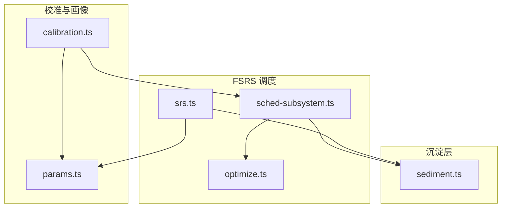
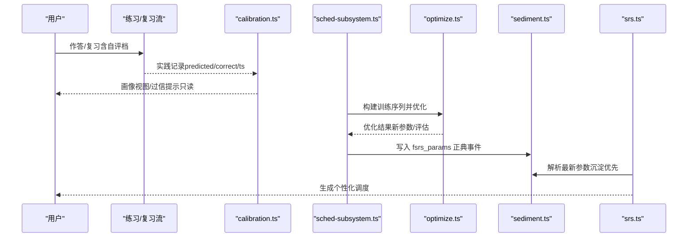
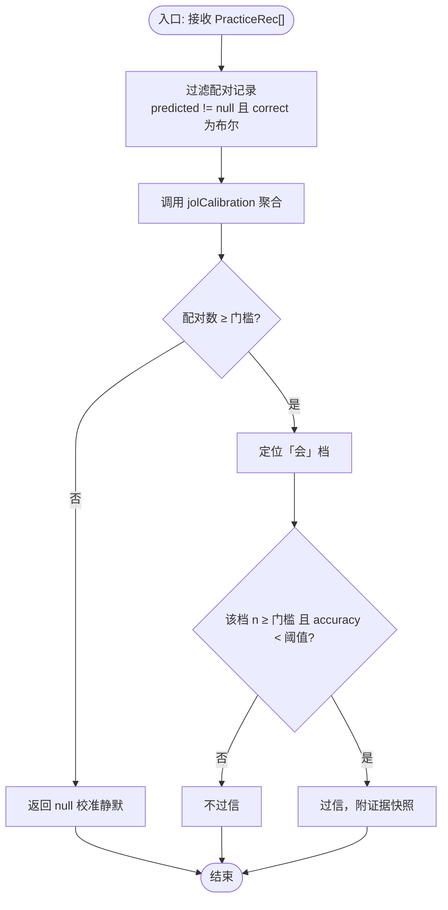
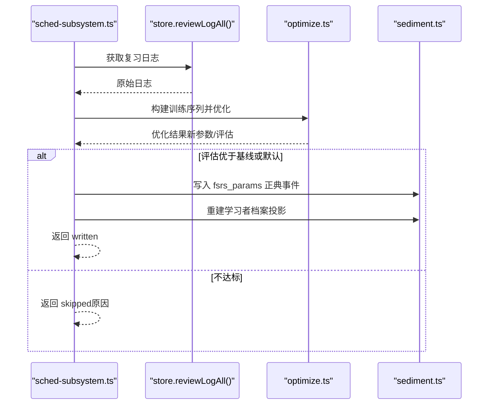
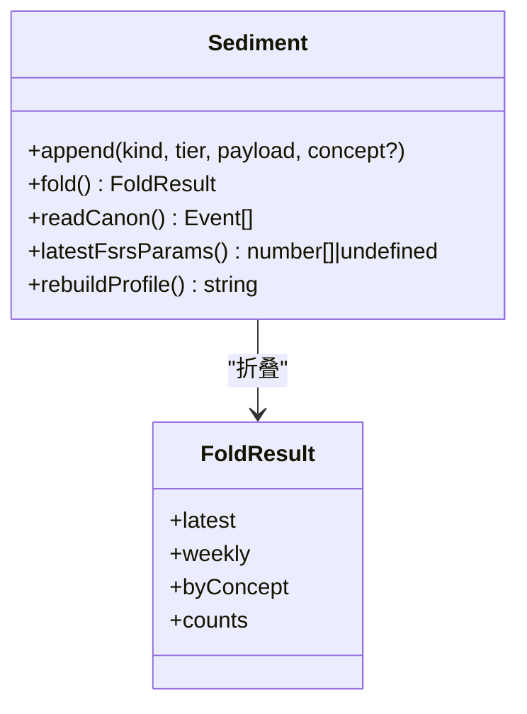
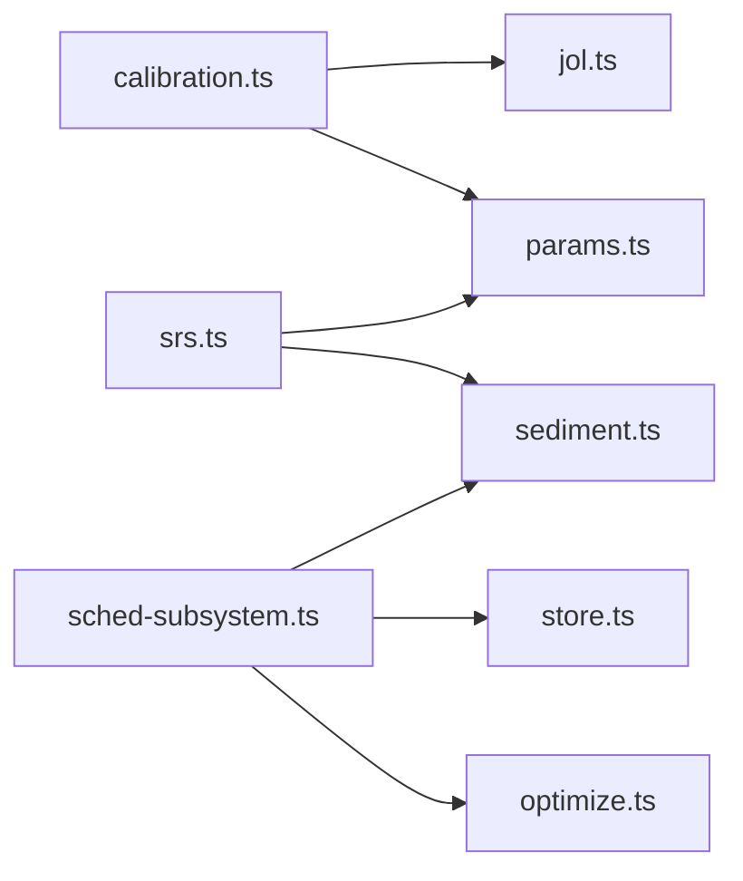

# 校准系统

<cite>
**本文引用的文件**
- [calibration.ts](file://src/engine/calibration.ts)
- [params.ts](file://src/engine/params.ts)
- [srs.ts](file://src/engine/srs.ts)
- [optimize.ts](file://src/engine/optimize.ts)
- [sched-subsystem.ts](file://src/engine/sched-subsystem.ts)
- [sediment.ts](file://src/engine/sediment.ts)
- [0022-self-calibration-profile.md](file://docs/adr/0022-self-calibration-profile.md)
- [calibration.test.ts](file://tests/calibration.test.ts)
- [sediment.test.ts](file://tests/sediment.test.ts)
</cite>

## 目录
1. [简介](#简介)
2. [项目结构](#项目结构)
3. [核心组件](#核心组件)
4. [架构总览](#架构总览)
5. [详细组件分析](#详细组件分析)
6. [依赖关系分析](#依赖关系分析)
7. [性能考量](#性能考量)
8. [故障排查指南](#故障排查指南)
9. [结论](#结论)
10. [附录](#附录)

## 简介
本文件面向学习系统的“校准子系统”，围绕以下目标展开：
- 解释学习参数的自适应调整机制，包括用户表现数据的收集与分析。
- 说明校准算法如何根据用户的答题历史优化 FSRS 参数，实现个性化学习体验。
- 介绍沉淀参数（sediment）的管理机制，包括参数版本控制与回滚策略。
- 解释校准过程中的数据验证与质量控制措施。
- 描述校准结果的评估方法与效果监控。
- 提供校准配置的自定义选项与调优指南。
- 包含常见校准问题的诊断与解决方案。

## 项目结构
校准相关能力由多个模块协作完成：
- 自评画像与过信检测：位于 calibration.ts，基于 JOL（预测-实际）配对进行分源自省画像与全局参考视图输出。
- 参数与阈值：位于 params.ts，集中管理可调参数与阈值（如期望保留率、过信阈值等）。
- FSRS 调度与参数解析：位于 srs.ts，负责构造调度器与统一参数来源（沉淀→缓存→默认）。
- 参数优化与训练序列：位于 optimize.ts 与 sched-subsystem.ts，负责从复习日志构建训练序列、执行优化并结算正典。
- 沉淀层（sediment）：位于 sediment.ts，作为第四存储域的追加正典、读侧折叠与档案投影，承载参数正典化与事件归档。
- ADR 决策：docs/adr/0022-self-calibration-profile.md 明确自评校准画像的边界与红线。

图表来源
- [calibration.ts:25-103](file://src/engine/calibration.ts#L25-L103)
- [params.ts:1-59](file://src/engine/params.ts#L1-L59)
- [srs.ts:29-49](file://src/engine/srs.ts#L29-L49)
- [sched-subsystem.ts:358-381](file://src/engine/sched-subsystem.ts#L358-L381)
- [sediment.ts](file://src/engine/sediment.ts)

章节来源
- [calibration.ts:25-103](file://src/engine/calibration.ts#L25-L103)
- [params.ts:1-59](file://src/engine/params.ts#L1-L59)
- [srs.ts:29-49](file://src/engine/srs.ts#L29-L49)
- [sched-subsystem.ts:358-381](file://src/engine/sched-subsystem.ts#L358-L381)
- [sediment.ts](file://src/engine/sediment.ts)

## 核心组件
- 自评校准画像与过信检测
  - 通过 practice 流水中“自评档 × 客观判分”的配对记录，计算各源（当前为 jol）的校准曲线与正确率，并在数据充足时判定是否存在系统性过信。
  - 输出分源自省面与全局参考视图；全局视图附带域特异警戒文案。
- FSRS 参数优化与结算
  - 从复习日志构建训练序列，满足样本门槛后执行优化；优化结果写入沉淀正典，并重建学习者档案投影。
  - 参数解析遵循“沉淀优先”的统一口径，确保调度器与优化器基线一致。
- 沉淀层（sediment）
  - 以追加正典形式持久化 fsrs_params 等事件；支持 latest/weekly/byConcept 三读法；首写即落盘 legacy 分区但不参与折叠读取。
  - 断裂不变性：内容层清空不影响沉淀先验的连续性。

章节来源
- [calibration.ts:25-103](file://src/engine/calibration.ts#L25-L103)
- [sched-subsystem.ts:358-381](file://src/engine/sched-subsystem.ts#L358-L381)
- [srs.ts:29-49](file://src/engine/srs.ts#L29-L49)
- [sediment.test.ts:1-306](file://tests/sediment.test.ts#L1-L306)

## 架构总览
校准系统的关键流程如下：
- 数据采集：practice/review 流水产生“自评档 + 客观判分”的配对记录。
- 画像生成：calibration.ts 对配对数据进行聚合，产出分源与全局视图，并检测过信证据。
- 参数优化：sched-subsystem.ts 调用 optimize.ts 构建训练序列并执行优化；成功后将参数写入沉淀正典。
- 参数解析：srs.ts 在构造调度器时按“沉淀→缓存→默认”的顺序解析参数，保证一致性。
- 沉淀归档：sediment.ts 维护事件正典、折叠与档案投影，支撑可追溯与回滚。

图表来源
- [calibration.ts:53-103](file://src/engine/calibration.ts#L53-L103)
- [sched-subsystem.ts:358-381](file://src/engine/sched-subsystem.ts#L358-L381)
- [srs.ts:29-49](file://src/engine/srs.ts#L29-L49)
- [sediment.ts](file://src/engine/sediment.ts)

## 详细组件分析

### 自评校准画像与过信检测（calibration.ts）
- 功能要点
  - 仅使用 practice 流水中同时具备 predicted 与 correct 的记录作为配对点。
  - 复用 jol.ts 的聚合口径，静默沿用数据门槛（JOL_CALIBRATION_MIN），不足则不展示校准曲线。
  - 针对“会”档进行系统性过信检测：当该档配对数达到门槛且实际正确率低于阈值（CALIBRATION_OVERCONF_THRESHOLD），返回过信证据。
  - 输出 sources（分源）与 global（全局参考视图，带域特异警戒文案）。
- 关键接口
  - overconfidenceOf(recs): 返回是否过信及证据快照。
  - calibrationProfileView(recs): 返回分源与全局视图（含配对区间时间戳、bins、overconfidence）。
  - calibrationHintText(verdict): 仅在检出过信时给出轻提示文案。
- 设计约束
  - 画像为只读派生，零 canonical 写入；不改变复习自评档对 FSRS 的驱动，不进 Mastery/XP。
  - 名词边界：不与 memory.ts 的 FSRS 自校准（r_pred × 实际保留率）混用。

图表来源
- [calibration.ts:53-103](file://src/engine/calibration.ts#L53-L103)
- [params.ts:39-41](file://src/engine/params.ts#L39-L41)

章节来源
- [calibration.ts:25-103](file://src/engine/calibration.ts#L25-L103)
- [params.ts:39-41](file://src/engine/params.ts#L39-L41)
- [calibration.test.ts:35-109](file://tests/calibration.test.ts#L35-L109)

### FSRS 参数优化与结算（sched-subsystem.ts / optimize.ts）
- 功能要点
  - 从复习日志构建训练序列，排除 synthetic 与每卡每天第一条重复，统计真实复习条数。
  - 若真实复习条数不足 OPTIMIZE_MIN_REVIEWS，跳过优化并返回原因。
  - 优化成功后，将 fsrs_params 事件写入沉淀正典，并重建学习者档案投影。
  - 优化基线与参数解析统一通过 srs.ts 的参数解析口径，避免分歧。
- 关键流程
  - 收集训练序列 → 校验样本量 → 执行优化 → 比较评估（in-sample logLoss 等）→ 达标则写沉淀 → 重建档案。

图表来源
- [sched-subsystem.ts:358-381](file://src/engine/sched-subsystem.ts#L358-L381)
- [optimize.ts](file://src/engine/optimize.ts)
- [sediment.ts](file://src/engine/sediment.ts)

章节来源
- [sched-subsystem.ts:358-381](file://src/engine/sched-subsystem.ts#L358-L381)
- [optimize.ts](file://src/engine/optimize.ts)
- [sediment.test.ts:145-174](file://tests/sediment.test.ts#L145-L174)

### 沉淀层（sediment.ts）：参数正典化、版本与回滚
- 功能要点
  - 追加正典：fsrs_params 事件以 JSONL 形式追加；首次写时创建 legacy 分区但不参与折叠读取。
  - 读侧折叠：foldSediment 确定性折叠，latest/weekly/byConcept 三种读法；周级事件按学习周分组。
  - 参数正典化：优化即结算，最新参数可从沉淀取回；删除课程参数缓存后，getScheduler 仍能从沉淀恢复。
  - 断裂不变性：内容层清空不影响沉淀先验连续性。
- 版本与回滚
  - 通过事件追加与折叠的幂等性保障一致性；如需回滚，可通过选择历史事件或覆盖正典的方式实现（测试覆盖“删缓存不丢事实”）。

图表来源
- [sediment.test.ts:1-306](file://tests/sediment.test.ts#L1-L306)
- [srs.ts:29-49](file://src/engine/srs.ts#L29-L49)

章节来源
- [sediment.test.ts:1-306](file://tests/sediment.test.ts#L1-L306)
- [srs.ts:29-49](file://src/engine/srs.ts#L29-L49)

### 参数解析与调度器构造（srs.ts）
- 功能要点
  - resolveFsrsParams 统一参数来源：沉淀正典 → 课程参数缓存 → 官方默认。
  - getScheduler 基于该口径构造日粒度、无 fuzz 的调度器，确保与优化器基线一致。
- 影响
  - 优化后的参数立即生效于后续调度；即使缓存丢失，仍可回退到沉淀正典。

章节来源
- [srs.ts:29-49](file://src/engine/srs.ts#L29-L49)

### 配置与阈值（params.ts）
- 可调参数
  - DESIRED_RETENTION、R_GATE、S_MASTER、REVIEW_RATIO、MIN_PER_REVIEW、MIN_PER_NEW、DAILY_CAPACITY、OVERLOAD_FACTOR、SOFT_RESTART_GAP、RECOVERY_CLEAR_RATIO、QUIZ_ITEMS_PER_CANDIDATE、SCAN_INIT_S、SCAN_INIT_D、FSRS_DIFFICULTY_MID。
  - XP 时间账本相关：XP_BASE、XP_GUESS_SECONDS、XP_GUESS_PENALTY、XP_PERFECT_BONUS、XP_PER_NODE_DEFAULT、XP_PER_MILESTONE_DEFAULT、DAILY_XP_GOAL_DEFAULT、DAY_CUTOFF_DEFAULT、XP_STREAK_GRACE_DAYS。
  - Mastery 交叉与推荐：CROSS_AXIS_THRESHOLD、TIER_REC_MIN_EVENTS、TIER_REC_PROMOTE_SCORE、TIER_REC_DEMOTE_SCORE。
  - 自评校准：CALIBRATION_OVERCONF_THRESHOLD、CALIBRATION_BOOST_SAMPLE_RATE。
  - 复诊与插入调速：RECHECK_DAYS_*、RECHECK_CONCENTRATION_DROP、RECHECK_RETENTION_RECOVER、RECHECK_RETENTION_MIN_SAMPLES。
  - 三率与韧性分映射闸门：GROWTH_RATES_WINDOW_DAYS、GROWTH_RATE_MIN_SAMPLE、GROWTH_RECHECK_PASS_FLOOR、GROWTH_INSERT_RATE_CAP、GROWTH_SIDEBRANCH_CAP、GROWTH_SIDEBRANCH_CAP_RESILIENT、GROWTH_RESILIENCE_HIGH。

章节来源
- [params.ts:1-59](file://src/engine/params.ts#L1-L59)

## 依赖关系分析
- 模块耦合
  - calibration.ts 依赖 params.ts 的阈值与 jol.ts 的聚合逻辑（通过外部引用），输出只读画像。
  - sched-subsystem.ts 依赖 optimize.ts 与 store，并将结果写入 sediment.ts。
  - srs.ts 依赖 sediment.ts 与 params.ts，统一参数来源。
- 外部依赖
  - ts-fsrs 用于 FSRS 调度与参数生成。
- 循环依赖
  - 未见直接循环导入；通过接口与函数解耦。

图表来源
- [calibration.ts:25-103](file://src/engine/calibration.ts#L25-L103)
- [sched-subsystem.ts:358-381](file://src/engine/sched-subsystem.ts#L358-L381)
- [srs.ts:29-49](file://src/engine/srs.ts#L29-L49)

章节来源
- [calibration.ts:25-103](file://src/engine/calibration.ts#L25-L103)
- [sched-subsystem.ts:358-381](file://src/engine/sched-subsystem.ts#L358-L381)
- [srs.ts:29-49](file://src/engine/srs.ts#L29-L49)

## 性能考量
- 数据门槛与静默策略
  - 校准曲线与过信检测均受 JOL_CALIBRATION_MIN 限制，数据不足时静默处理，避免噪声干扰。
- 优化门禁
  - 优化需满足 OPTIMIZE_MIN_REVIEWS 的真实复习条数门槛，防止小样本导致的过拟合。
- 参数解析效率
  - 沉淀优先的解析路径减少 I/O 次数；缓存命中后可快速构造调度器。
- 只读画像
  - 画像与提示均为只读派生，零 canonical 写入，降低运行时开销与副作用风险。

[本节为通用指导，无需特定文件来源]

## 故障排查指南
- 校准曲线为空或过信未检出
  - 检查 practice 流水是否包含 predicted 与 correct 的配对记录；确认配对数量是否达到 JOL_CALIBRATION_MIN。
  - 确认阈值设置（CALIBRATION_OVERCONF_THRESHOLD）是否符合预期。
- 优化被跳过
  - 检查真实复习日志条数是否达到 OPTIMIZE_MIN_REVIEWS；确认已排除 synthetic 与重复条目。
  - 查看优化评估指标（logLoss、rmseBins）是否优于基线或默认参数。
- 参数未生效或回滚
  - 确认沉淀正典是否写入成功；检查 latestFsrsParams 返回值。
  - 若课程参数缓存缺失，确认 getScheduler 是否能从沉淀恢复参数。
- 内容层重置后行为异常
  - 验证沉淀层不受影响；确认合成初始化时能取回沉淀先验。

章节来源
- [calibration.test.ts:130-192](file://tests/calibration.test.ts#L130-L192)
- [sediment.test.ts:145-239](file://tests/sediment.test.ts#L145-L239)
- [sched-subsystem.ts:358-381](file://src/engine/sched-subsystem.ts#L358-L381)

## 结论
校准系统通过“自评画像 + 参数优化 + 沉淀正典”的闭环，实现了：
- 对用户表现数据的持续采集与分析，形成分源自省画像与全局参考视图。
- 基于真实复习日志的 FSRS 参数优化，并以沉淀层作为唯一正典，确保一致性与可追溯。
- 严格的阈值与门禁机制，保障校准质量与稳定性。
- 清晰的边界与红线，避免画像对 canonical 路径的隐性干预。

[本节为总结性内容，无需特定文件来源]

## 附录
- 自定义与调优建议
  - 调整期望保留率（DESIRED_RETENTION）与难度中性值（FSRS_DIFFICULTY_MID）以匹配课程难度分布。
  - 根据业务需求调节过信阈值（CALIBRATION_OVERCONF_THRESHOLD）与抽查加强密度（CALIBRATION_BOOST_SAMPLE_RATE）。
  - 结合复诊期与韧性闸门（RECHECK_*、GROWTH_*）微调插入节奏与增长策略。
- 效果监控
  - 关注优化评估指标（logLoss、rmseBins）与沉淀事件计数（fsrs_params 次数）。
  - 观察队列中的 JOL 加强比例与提示出现频率，验证画像干预的有效性。

[本节为通用指导，无需特定文件来源]