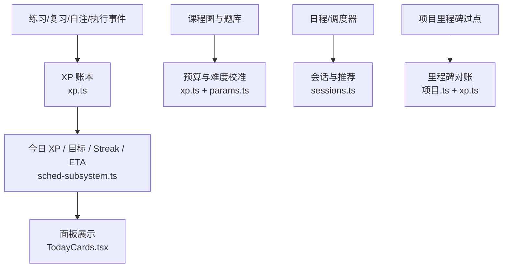
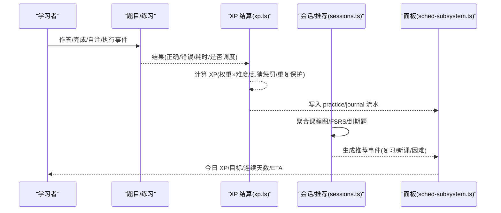
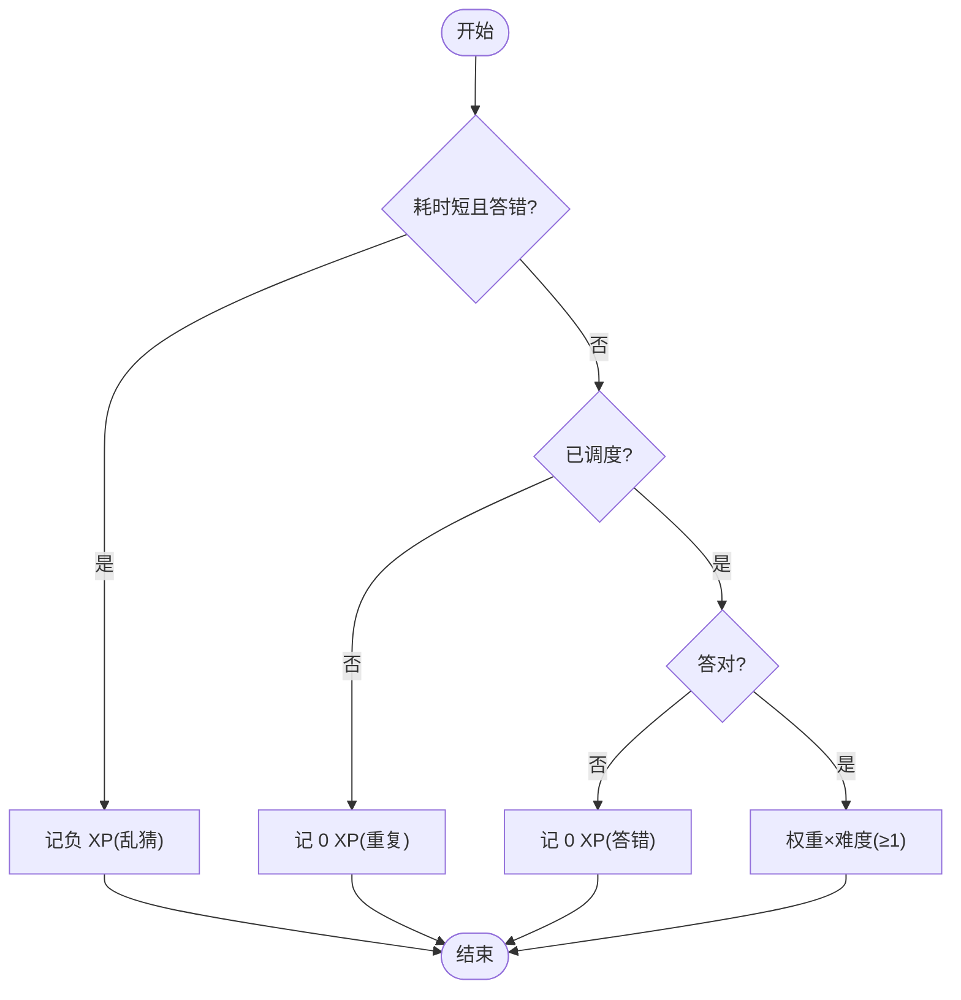
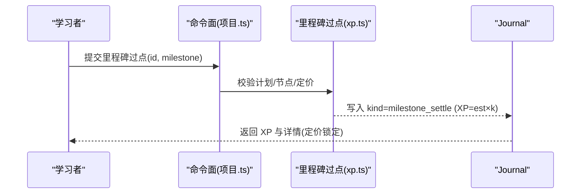
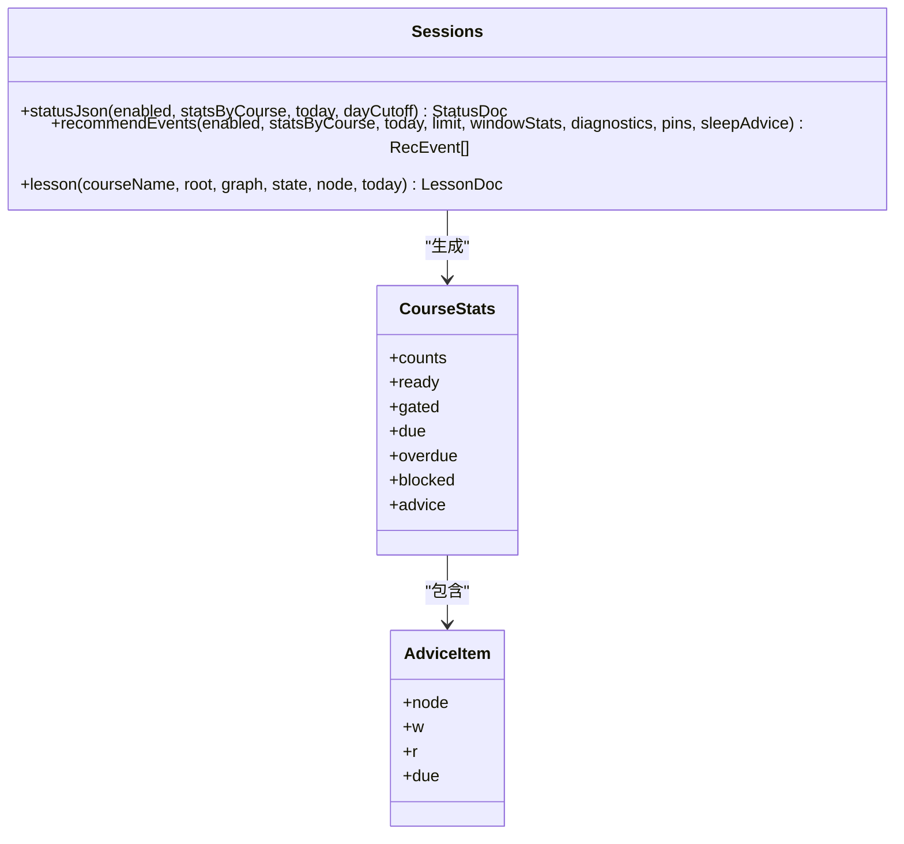
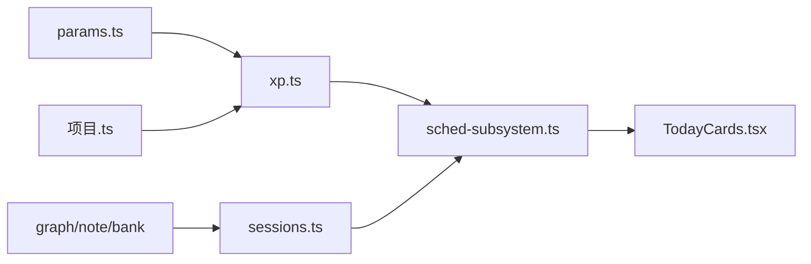

# 经验值系统

<cite>
**本文引用的文件**
- [xp.ts](file://src/engine/xp.ts)
- [params.ts](file://src/engine/params.ts)
- [sessions.ts](file://src/engine/sessions.ts)
- [sched-subsystem.ts](file://src/engine/sched-subsystem.ts)
- [types.ts](file://src/engine/types.ts)
- [content.ts](file://src/engine/views/content.ts)
- [项目.ts](file://src/commands/项目.ts)
- [0019-execution-event-xp-duration-credibility.md](file://docs/adr/0019-execution-event-xp-duration-credibility.md)
- [milestone-settle.test.ts](file://tests/milestone-settle.test.ts)
- [TodayCards.tsx](file://ui/src/pages/TodayPage/TodayCards.tsx)
</cite>

## 目录
1. [简介](#简介)
2. [项目结构](#项目结构)
3. [核心组件](#核心组件)
4. [架构总览](#架构总览)
5. [详细组件分析](#详细组件分析)
6. [依赖关系分析](#依赖关系分析)
7. [性能与可扩展性](#性能与可扩展性)
8. [故障排查指南](#故障排查指南)
9. [结论](#结论)
10. [附录：配置项与扩展建议](#附录配置项与扩展建议)

## 简介
本文件系统性阐述学习平台的“经验值（XP）系统”，覆盖以下目标：
- XP 计算模型：从学习行为到经验值的转换规则、预算制定价、乱猜惩罚、重复作答保护。
- 成就与等级提升：里程碑过点定价、奖励触发条件、与 streak/ETA 的联动。
- 学习会话管理：会话记录、进度跟踪、统计聚合与推荐事件。
- 激励与游戏化：XP 在用户动机中的作用与设计原理。
- 学习效果关联分析：投入产出评估思路与数据口径。
- 配置与扩展：可调参数、接入点与最佳实践。
- 用户体验优化与数据分析方案。

## 项目结构
XP 系统由“引擎层”与“视图/门面层”共同构成：
- 引擎层负责计算、结算、派生统计与配置读写。
- 视图/门面层负责将状态暴露给前端面板、命令通道与工具接口。

图表来源
- [xp.ts:1-184](file://src/engine/xp.ts#L1-L184)
- [params.ts:1-59](file://src/engine/params.ts#L1-L59)
- [sessions.ts:293-572](file://src/engine/sessions.ts#L293-L572)
- [sched-subsystem.ts:288-309](file://src/engine/sched-subsystem.ts#L288-L309)
- [项目.ts:281-298](file://src/commands/项目.ts#L281-L298)
- [TodayCards.tsx:21-35](file://ui/src/pages/TodayPage/TodayCards.tsx#L21-L35)

章节来源
- [xp.ts:1-184](file://src/engine/xp.ts#L1-L184)
- [params.ts:1-59](file://src/engine/params.ts#L1-L59)
- [sessions.ts:293-572](file://src/engine/sessions.ts#L293-L572)
- [sched-subsystem.ts:288-309](file://src/engine/sched-subsystem.ts#L288-L309)
- [项目.ts:281-298](file://src/commands/项目.ts#L281-L298)
- [TodayCards.tsx:21-35](file://ui/src/pages/TodayPage/TodayCards.tsx#L21-L35)

## 核心组件
- XP 计算与结算：按题型权重×难度，答错为 0，乱猜负分，同日重复为 0；支持节点预算与里程碑定价。
- 每日目标与日界：可配置的 daily_xp_goal 与 day_cutoff，影响当日 XP 汇总与 streak。
- 会话与推荐：基于课程图、FSRS 可提取性与到期题，生成复习/新课/困难节点等事件。
- 里程碑过点：显式声明达成，写入 journal 并计入 XP、streak 与今日目标完成度。
- 面板展示：今日 XP、连续天数、目标完成度与调整入口。

章节来源
- [xp.ts:20-79](file://src/engine/xp.ts#L20-L79)
- [xp.ts:81-120](file://src/engine/xp.ts#L81-L120)
- [xp.ts:122-183](file://src/engine/xp.ts#L122-L183)
- [sessions.ts:96-130](file://src/engine/sessions.ts#L96-L130)
- [项目.ts:281-298](file://src/commands/项目.ts#L281-L298)
- [TodayCards.tsx:21-35](file://ui/src/pages/TodayPage/TodayCards.tsx#L21-L35)

## 架构总览
XP 系统以“时间账本”为核心：1 XP ≈ 1 分钟有效专注。所有学习行为通过 practice/journal 流水沉淀，派生出 streak、ETA、每日目标完成度等指标。里程碑过点作为“真实投入”的显式陈述，同样进入账本与 streak。

图表来源
- [xp.ts:20-79](file://src/engine/xp.ts#L20-L79)
- [xp.ts:122-183](file://src/engine/xp.ts#L122-L183)
- [sessions.ts:361-572](file://src/engine/sessions.ts#L361-L572)
- [sched-subsystem.ts:288-309](file://src/engine/sched-subsystem.ts#L288-L309)

## 详细组件分析

### XP 计算模型与转换规则
- 单次作答 XP：
  - 乱猜：耗时低于阈值且答错 → 负 XP（保持账本诚实）。
  - 未调度：同日重复 → 0 XP（防刷）。
  - 答错：0 XP。
  - 答对：题型基础权重 × 难度（最小 1），四舍五入取整。
- 预算制定价：
  - 节点预算 N₀：优先使用 est（内容定价），否则回退为 Σ(权重×难度)，再缺省用默认每节点常量。
  - 难度校准 k：基于 FSRS difficulty 加权平均，夹取 [0.5, 3]；无证据时取中性 1。
  - 里程碑价格：N₀ × k，锁定一次，重复过点拒绝。
- 每日目标与日界：
  - daily_xp_goal 可配置，范围钳制；day_cutoff 决定学习日边界。
- 派生统计：
  - sumXp/sumXpByCourse：按日或课程聚合。
  - streakFrom：宽容漏天，空窗截断。
  - etaDays/perNodeXp：剩余节点×每节点 XP ÷ 每日目标，历史估算。

图表来源
- [xp.ts:20-34](file://src/engine/xp.ts#L20-L34)
- [params.ts:20-31](file://src/engine/params.ts#L20-L31)

章节来源
- [xp.ts:20-79](file://src/engine/xp.ts#L20-L79)
- [params.ts:20-31](file://src/engine/params.ts#L20-L31)

### 成就系统与等级提升机制（里程碑）
- 里程碑过点：
  - 显式动作写入 journal（kind=milestone_settle），对齐节点 xp_settle 先例。
  - 定价 = est 申报 × 关联节点题池难度校准（k 锁定于计划），无 est/nodes 时回落默认。
  - 重复过点被守卫拒绝（定价锁定），修订需新里程碑 id。
  - 仅此一行允许项目域写 journal，计入 XP、streak 与今日目标完成度。
- 触发条件：
  - 无需清单门禁与题目门禁（避免严格门降低完成率）。
  - 计划中声明的节点集合用于难度校准，不可在过点时临时扩展。

图表来源
- [项目.ts:281-298](file://src/commands/项目.ts#L281-L298)
- [xp.ts:70-79](file://src/engine/xp.ts#L70-L79)
- [milestone-settle.test.ts:75-108](file://tests/milestone-settle.test.ts#L75-L108)

章节来源
- [项目.ts:281-298](file://src/commands/项目.ts#L281-L298)
- [xp.ts:70-79](file://src/engine/xp.ts#L70-L79)
- [milestone-settle.test.ts:1-149](file://tests/milestone-settle.test.ts#L1-L149)

### 学习会话管理与进度跟踪
- 会话素材与状态：
  - 课程图（region/block/node）、前置边 pre、成分技能 enc。
  - 节点阶段 effectiveStage（unseen/ready/learning/review/mastered/skipped）。
- 推荐事件：
  - 复习/逾期：按到期题数与逾期天数评分。
  - 学习中：结合可提取性 R 与近期 struggle 判定，给出定向回补建议。
  - 新课：解锁后继数 + 区域轮转；软闸（R-gate）提示先复习弱前置。
  - Pin/睡眠耦合：当日置顶与睡前练醒后验建议。
- 统计聚合：
  - courseStats：计数、就绪/软闸、到期/逾期、阻塞与可执行建议。
  - WindowStat：近期窗口内尝试次数与正确率，驱动 struggle 判定。

图表来源
- [sessions.ts:293-572](file://src/engine/sessions.ts#L293-L572)
- [sessions.ts:258-287](file://src/engine/sessions.ts#L258-L287)
- [sessions.ts:96-130](file://src/engine/sessions.ts#L96-L130)

章节来源
- [sessions.ts:96-130](file://src/engine/sessions.ts#L96-L130)
- [sessions.ts:258-287](file://src/engine/sessions.ts#L258-L287)
- [sessions.ts:293-572](file://src/engine/sessions.ts#L293-L572)

### 经验值在用户激励中的作用（游戏化设计）
- 时间账本语义：1 XP ≈ 1 分钟有效专注，使“投入”可度量、可比对。
- 每日目标与连续天数：提供短期目标感与习惯养成反馈。
- 里程碑过点：阶段性成果可视化，增强成就感与自我效能。
- 乱猜惩罚与重复保护：防止“刷分”，鼓励真实投入。
- 面板即时反馈：今日 XP、目标进度、连续天数一目了然，便于自我调节。

章节来源
- [xp.ts:1-12](file://src/engine/xp.ts#L1-L12)
- [xp.ts:81-120](file://src/engine/xp.ts#L81-L120)
- [xp.ts:147-177](file://src/engine/xp.ts#L147-L177)
- [TodayCards.tsx:21-35](file://ui/src/pages/TodayPage/TodayCards.tsx#L21-L35)

### 经验值与学习效果的关联分析
- 投入产出评估：
  - 以“节点预算 N₀×k”衡量单节预期投入，对比实际 XP 与掌握度变化，评估效率。
  - 通过 perNodeXp 历史估算，识别高投入低产出的节点，指导内容或题库优化。
- 会话质量信号：
  - struggle 判定（正确率阈值与样本下限）提示回补成分技能，减少无效投入。
  - 推荐事件中的“软闸”与“enc 回退”引导先修巩固，提高后续学习效率。
- 执行事件与 XP：
  - 决议明确：执行事件按其原生专注时长入 XP 账本，与节点学习时间同权，计入 streak。

章节来源
- [xp.ts:45-79](file://src/engine/xp.ts#L45-L79)
- [xp.ts:173-183](file://src/engine/xp.ts#L173-L183)
- [sessions.ts:211-237](file://src/engine/sessions.ts#L211-L237)
- [0019-execution-event-xp-duration-credibility.md:1-13](file://docs/adr/0019-execution-event-xp-duration-credibility.md#L1-L13)

## 依赖关系分析
- 参数集中表：所有 XP 相关常量与阈值集中在 params.ts，便于统一调参与审计。
- 数据源：
  - 课程图与笔记 frontmatter：节点阶段、前置/成分技能、est/difficulty。
  - 题库 YAML：每题一张 FSRS 卡，驱动 due/count/accuracy/attempts。
  - 流水（practice/journal）：事实源，派生 XP、streak、ETA。
- 消费方：
  - 面板 TodayCards：展示今日 XP、目标、连续天数。
  - 会话推荐：基于 sessions.ts 的事件生成。
  - 里程碑过点：项目域唯一允许写 journal 的动作。

图表来源
- [params.ts:1-59](file://src/engine/params.ts#L1-L59)
- [xp.ts:1-184](file://src/engine/xp.ts#L1-L184)
- [sessions.ts:293-572](file://src/engine/sessions.ts#L293-L572)
- [sched-subsystem.ts:288-309](file://src/engine/sched-subsystem.ts#L288-L309)
- [项目.ts:281-298](file://src/commands/项目.ts#L281-L298)
- [TodayCards.tsx:21-35](file://ui/src/pages/TodayPage/TodayCards.tsx#L21-L35)

章节来源
- [params.ts:1-59](file://src/engine/params.ts#L1-L59)
- [xp.ts:1-184](file://src/engine/xp.ts#L1-L184)
- [sessions.ts:293-572](file://src/engine/sessions.ts#L293-L572)
- [sched-subsystem.ts:288-309](file://src/engine/sched-subsystem.ts#L288-L309)
- [项目.ts:281-298](file://src/commands/项目.ts#L281-L298)
- [TodayCards.tsx:21-35](file://ui/src/pages/TodayPage/TodayCards.tsx#L21-L35)

## 性能与可扩展性
- 计算复杂度：
  - 单次作答 XP：O(1)。
  - 节点预算与难度校准：O(Q)，Q 为节点题数。
  - 会话推荐：遍历节点与题库聚合，整体 O(N+ΣQ)。
- 可扩展点：
  - 题型权重与阈值：集中于 params.ts，新增题型或调整阈值无需改动业务逻辑。
  - 里程碑定价：支持 est/nodes 可选字段，灵活适配不同任务粒度。
  - 会话建议：enc 回退与软闸策略可按课程特性定制。
- 存储与一致性：
  - 行为流水即事实，派生零新增数据文件；里程碑过点仅一行 journal 写入，保证一致性。

[本节为通用性能讨论，不直接分析具体文件]

## 故障排查指南
- 乱猜负 XP：检查 elapsedS 与阈值 XP_GUESS_SECONDS，确认计时与判错逻辑。
- 重复作答 0 XP：确认 scheduled 标志与调度推进逻辑，避免误判重复。
- 里程碑重复过点：检查计划中里程碑 id 是否重复，过点守卫会拒绝重复入账。
- 日界与 streak：核对 day_cutoff 配置与学习日划分，确保 streak 宽容机制生效。
- 面板显示异常：确认 practice/journal 流水是否写入，以及 sched-subsystem 的汇总逻辑。

章节来源
- [xp.ts:20-34](file://src/engine/xp.ts#L20-L34)
- [xp.ts:81-120](file://src/engine/xp.ts#L81-L120)
- [milestone-settle.test.ts:75-108](file://tests/milestone-settle.test.ts#L75-L108)

## 结论
XP 系统以“时间账本”为核心，将学习行为转化为可度量、可比较的经验值，并通过每日目标、连续天数与里程碑过点形成正向激励闭环。会话推荐与 struggle 判定帮助学习者聚焦薄弱环节，提升投入产出比。系统通过集中参数与纯函数结算，具备良好的可维护性与可扩展性。

[本节为总结性内容，不直接分析具体文件]

## 附录：配置项与扩展建议
- 关键配置（params.ts）：
  - 题型权重 XP_BASE：single_choice/true_false/fill_in_blank/reflection/multi_choice/numeric/ordering/matching/open_question。
  - 乱猜阈值 XP_GUESS_SECONDS、惩罚 XP_GUESS_PENALTY。
  - 默认值：XP_PERFECT_BONUS、XP_PER_NODE_DEFAULT、XP_PER_MILESTONE_DEFAULT、DAILY_XP_GOAL_DEFAULT、DAY_CUTOFF_DEFAULT、XP_STREAK_GRACE_DAYS。
- 用户配置（state/learnhub.json）：
  - daily_xp_goal：每日 XP 目标（可配置）。
  - day_cutoff：日界（HH:mm），影响当日 XP 汇总与 streak。
- 扩展建议：
  - 新增题型：在 XP_BASE 中添加权重，并在结算逻辑中自然生效。
  - 调整阈值：修改 XP_GUESS_* 与 XP_STREAK_GRACE_DAYS，观察 streak 与公平性变化。
  - 里程碑策略：为不同任务类设置合理 est 与 nodes，利用 k 校准反映真实难度。
  - 会话建议：结合 enc 边与 R-gate，为薄弱节点提供定向回补路径。

章节来源
- [params.ts:20-31](file://src/engine/params.ts#L20-L31)
- [xp.ts:81-120](file://src/engine/xp.ts#L81-L120)
- [xp.ts:70-79](file://src/engine/xp.ts#L70-L79)