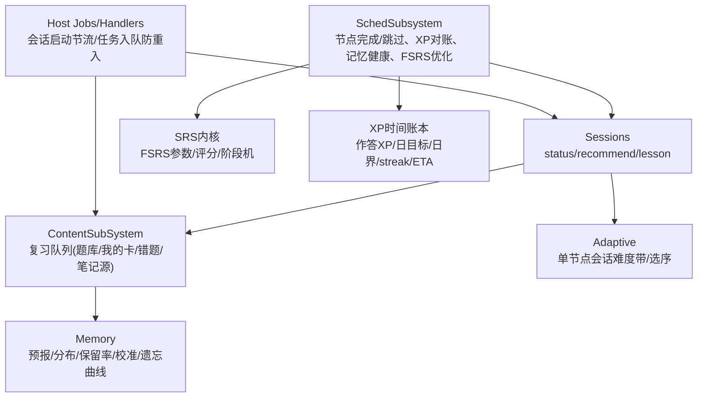
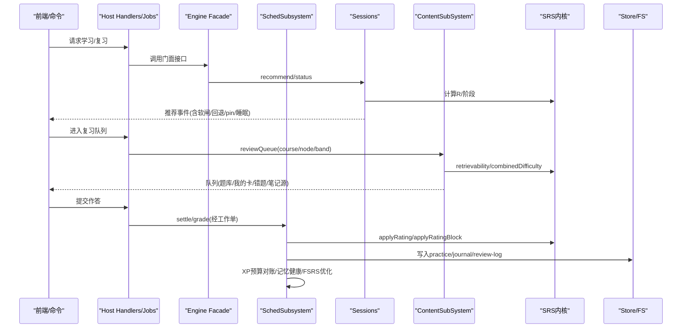
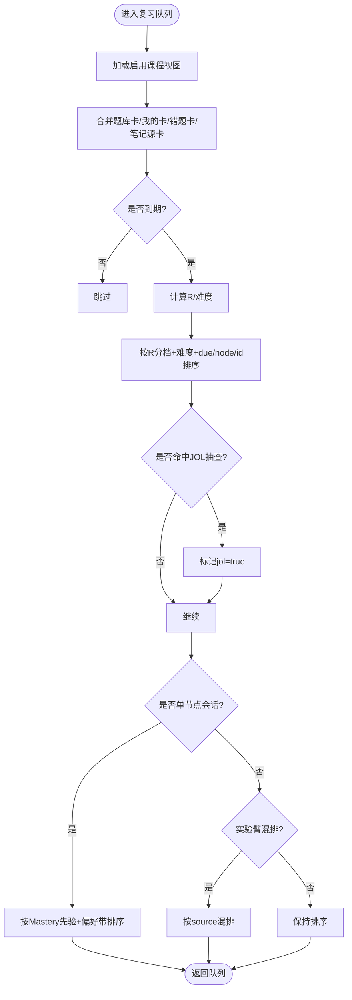
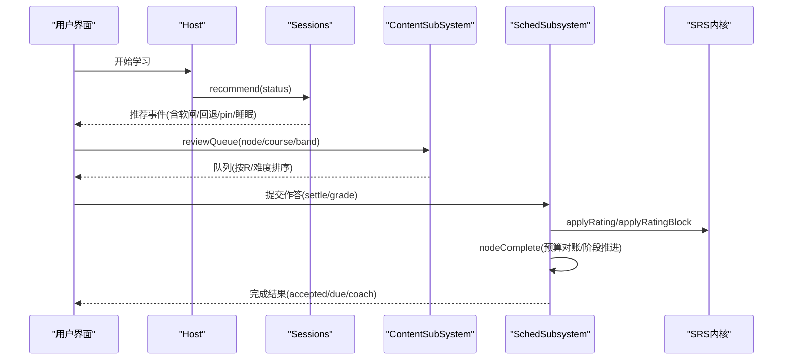
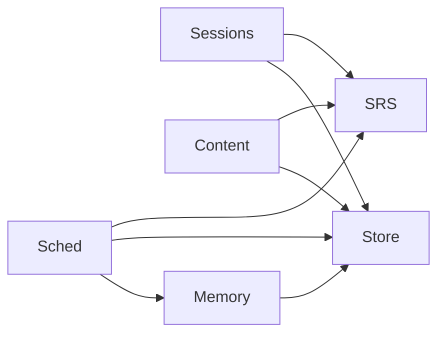

# 调度策略

<cite>
**本文引用的文件**
- [sched-subsystem.ts](file://src/engine/sched-subsystem.ts)
- [sessions.ts](file://src/engine/sessions.ts)
- [srs.ts](file://src/engine/srs.ts)
- [content-subsystem.ts](file://src/engine/content-subsystem.ts)
- [memory.ts](file://src/engine/memory.ts)
- [xp.ts](file://src/engine/xp.ts)
- [params.ts](file://src/engine/params.ts)
- [adaptive.ts](file://src/engine/adaptive.ts)
- [views/sched.ts](file://src/engine/views/sched.ts)
- [jobs.ts](file://src/host/jobs.ts)
- [handlers.ts](file://src/host/handlers.ts)
</cite>

## 目录
1. [简介](#简介)
2. [项目结构](#项目结构)
3. [核心组件](#核心组件)
4. [架构总览](#架构总览)
5. [详细组件分析](#详细组件分析)
6. [依赖关系分析](#依赖关系分析)
7. [性能考量](#性能考量)
8. [故障排查指南](#故障排查指南)
9. [结论](#结论)
10. [附录](#附录)

## 简介
本文件系统化阐述学习任务的智能调度策略，覆盖优先级排序与时间分配、复习队列管理（任务筛选、批量处理、冲突解决）、学习会话生命周期（启动、执行监控、结果处理）、可配置性与自定义选项（不同学习模式适配）、性能优化（缓存与并发）、监控与调优方法，以及异常处理与恢复机制。目标是让读者在不深入代码的前提下理解“如何安排学什么、何时学、学到什么程度”，并能定位到具体实现位置以便二次开发或排障。

## 项目结构
调度相关能力分布在引擎层多个模块：
- 调度子系统：节点跳过/完成确认、XP 预算与对账、记忆健康仪表盘、FSRS 参数优化、沉淀事件与学习者档案重建。
- 会话与推荐：课程状态聚合、动态推荐事件生成、A3 软闸/回退建议、睡眠耦合建议。
- SRS 内核：FSRS-6 参数解析、卡片转换、评分推进、阶段机、掌握度计算。
- 内容子系统：复习队列构建（题库卡、我的卡、错误对比卡、笔记源卡），JOL 抽查标记，N-of-1 实验臂混排。
- 记忆健康：负载预报、状态分布、真实保留率、预测校准、遗忘曲线。
- XP 时间账本：作答 XP 结算、每日目标与日界、streak/ETA。
- 自适应难度：单节点会话内难度带选择与流式调整。
- 主机作业与处理器：会话启动节流、图域任务入队防重入。

图表来源
- [sched-subsystem.ts:83-546](file://src/engine/sched-subsystem.ts#L83-L546)
- [sessions.ts:293-641](file://src/engine/sessions.ts#L293-L641)
- [srs.ts:29-191](file://src/engine/srs.ts#L29-L191)
- [content-subsystem.ts:538-717](file://src/engine/content-subsystem.ts#L538-L717)
- [memory.ts:17-118](file://src/engine/memory.ts#L17-L118)
- [xp.ts:20-183](file://src/engine/xp.ts#L20-L183)
- [adaptive.ts:19-81](file://src/engine/adaptive.ts#L19-L81)
- [jobs.ts:539-559](file://src/host/jobs.ts#L539-L559)
- [handlers.ts:554-572](file://src/host/handlers.ts#L554-L572)

章节来源
- [sched-subsystem.ts:83-546](file://src/engine/sched-subsystem.ts#L83-L546)
- [sessions.ts:293-641](file://src/engine/sessions.ts#L293-L641)
- [srs.ts:29-191](file://src/engine/srs.ts#L29-L191)
- [content-subsystem.ts:538-717](file://src/engine/content-subsystem.ts#L538-L717)
- [memory.ts:17-118](file://src/engine/memory.ts#L17-L118)
- [xp.ts:20-183](file://src/engine/xp.ts#L20-L183)
- [adaptive.ts:19-81](file://src/engine/adaptive.ts#L19-L81)
- [jobs.ts:539-559](file://src/host/jobs.ts#L539-L559)
- [handlers.ts:554-572](file://src/host/handlers.ts#L554-L572)

## 核心组件
- 调度子系统（SchedSubsystem）：负责节点级推进（跳过/完成）、XP 预算与对账、记忆健康四面板、FSRS 个人参数优化与写回、沉淀事件与学习者档案重建。
- 会话与推荐（Sessions）：提供 statusJson、recommendEvents、lesson 等能力，输出按分数排序的推荐事件，支持软闸/回退建议、pin、睡眠建议。
- SRS 内核（srs.ts）：FSRS-6 参数解析（沉淀正典→课程缓存→默认）、卡片转换、评分推进、阶段机、掌握度计算、可提取性 R。
- 内容子系统（ContentSubSystem）：构建复习队列，合并题库卡、我的卡、错误对比卡、笔记源卡；支持 JOL 抽查标记与 N-of-1 实验臂混排。
- 记忆健康（memory.ts）：负载预报、状态直方图、真实保留率、预测校准、遗忘曲线。
- XP 时间账本（xp.ts）：作答 XP 结算、每日目标与日界、streak/ETA。
- 自适应难度（adaptive.ts）：单节点会话内难度带先验与流式升降档、初始顺序。
- 主机作业与处理器（jobs.ts/handlers.ts）：会话启动节流、图域任务入队防重入。

章节来源
- [sched-subsystem.ts:83-546](file://src/engine/sched-subsystem.ts#L83-L546)
- [sessions.ts:293-641](file://src/engine/sessions.ts#L293-L641)
- [srs.ts:29-191](file://src/engine/srs.ts#L29-L191)
- [content-subsystem.ts:538-717](file://src/engine/content-subsystem.ts#L538-L717)
- [memory.ts:17-118](file://src/engine/memory.ts#L17-L118)
- [xp.ts:20-183](file://src/engine/xp.ts#L20-L183)
- [adaptive.ts:19-81](file://src/engine/adaptive.ts#L19-L81)
- [jobs.ts:539-559](file://src/host/jobs.ts#L539-L559)
- [handlers.ts:554-572](file://src/host/handlers.ts#L554-L572)

## 架构总览
调度系统以“课程图 + 题卡 FSRS”为事实源，通过多通道汇聚复习需求，形成统一队列与推荐流，驱动学习会话执行，并将结果回写至练习流水、复习日志与 FSRS 状态。

图表来源
- [sessions.ts:318-571](file://src/engine/sessions.ts#L318-L571)
- [content-subsystem.ts:538-717](file://src/engine/content-subsystem.ts#L538-L717)
- [srs.ts:107-163](file://src/engine/srs.ts#L107-L163)
- [sched-subsystem.ts:124-270](file://src/engine/sched-subsystem.ts#L124-L270)
- [memory.ts:17-118](file://src/engine/memory.ts#L17-L118)
- [xp.ts:20-183](file://src/engine/xp.ts#L20-L183)

## 详细组件分析

### 学习任务优先级排序与时间分配
- 优先级维度
  - 到期风险：按可提取性 R 分档（5% 档宽），档内再按难度由易到难，最后稳定键 due/node/id。
  - 逾期加权：逾期天数越多，推荐分数越高；今日到期次之；学习中节点结合保持率与 struggle 信号提升优先级。
  - 解锁收益：新课优先解锁后继数多的节点；区域轮转（LRU）加分避免长期忽略某区。
  - 软闸/回退：被 R-gate 拦下的候选附带前置衰减清单，引导先复习弱前置。
  - Pin/意图：当日 pin 置顶并附执行意图（只读展示）。
  - 睡眠建议：实践型节点附加睡前练/醒后验时段建议。
- 时间分配
  - 预算制：节点预算 = 标称 N₀ × 客观难度校准 k；完成时一次性对账锁定定价。
  - ETA：剩余预算 ÷ 每日目标，向上取整；每节点估算随历史作答证据自动校准。
  - 日界与宽容：日界可配置；streak 宽容天数允许短期断链不断线。

章节来源
- [content-subsystem.ts:697-716](file://src/engine/content-subsystem.ts#L697-L716)
- [sessions.ts:361-571](file://src/engine/sessions.ts#L361-L571)
- [xp.ts:45-79](file://src/engine/xp.ts#L45-L79)
- [xp.ts:124-183](file://src/engine/xp.ts#L124-L183)
- [params.ts:4-17](file://src/engine/params.ts#L4-L17)

### 复习队列管理机制（筛选、批量、冲突解决）
- 任务筛选
  - 题库卡：仅包含未归档且已到期的题目；按 R 分档与难度排序。
  - 我的卡/错误对比卡：独立调度（sched(null)，不参与优化器训练），同队列呈现但隔离数据面。
  - 笔记源卡：并入全局队列，Missing/镜像 Broken 挂起并提示，漂移不阻塞。
  - JOL 抽查：按抽样率标记，过信检测时可提高密度；我的卡/错题不参与。
- 批量处理
  - 跨课程一次遍历汇总，按课程/节点过滤后可定向复习。
  - 单节点会话：基于 Mastery 先验与显式难度偏好，按距先验带距离升序排列，后续流式升降档。
- 冲突解决
  - 同键去重：seen Set 保证同一节点在推荐中唯一。
  - 任务入队防重入：同 course/node 任务在途不重复入队，返回 queued=false 供 UI 诚实反馈。
  - 会话启动节流：防止频繁触发教练回合。

图表来源
- [content-subsystem.ts:538-717](file://src/engine/content-subsystem.ts#L538-L717)
- [sessions.ts:361-571](file://src/engine/sessions.ts#L361-L571)
- [jobs.ts:546-559](file://src/host/jobs.ts#L546-L559)

章节来源
- [content-subsystem.ts:538-717](file://src/engine/content-subsystem.ts#L538-L717)
- [sessions.ts:361-571](file://src/engine/sessions.ts#L361-L571)
- [jobs.ts:546-559](file://src/host/jobs.ts#L546-L559)

### 学习会话生命周期管理（启动、执行监控、结果处理）
- 启动
  - 会话入口：learnhub_status / 面板 /api/status 作为会话开工触点，触发就绪深度检查（读侧感知）。
  - 启动节流：sessionStartCheckpoint 限制频率，避免过载。
- 执行监控
  - 推荐事件：按分数排序输出复习/逾期/学习/诊断/pin/睡眠等事件，附带软闸/回退建议。
  - 队列呈现：支持 N-of-1 实验臂（band_default/session_composition），显式学习者选择优先。
- 结果处理
  - 评分推进：applyRating/applyRatingBlock 更新 FSRS 状态，阶段机决定 stage。
  - 预算对账：节点完成时进行 XP 预算对账，锁定定价；满分 bonus 计入 journal。
  - 教练回合：完成落定后拉起就绪深度检查（读侧），生长批裁决归后续流程。

图表来源
- [sched-subsystem.ts:124-270](file://src/engine/sched-subsystem.ts#L124-L270)
- [sessions.ts:318-571](file://src/engine/sessions.ts#L318-L571)
- [content-subsystem.ts:538-717](file://src/engine/content-subsystem.ts#L538-L717)
- [srs.ts:107-163](file://src/engine/srs.ts#L107-L163)

章节来源
- [sched-subsystem.ts:124-270](file://src/engine/sched-subsystem.ts#L124-L270)
- [sessions.ts:318-571](file://src/engine/sessions.ts#L318-L571)
- [content-subsystem.ts:538-717](file://src/engine/content-subsystem.ts#L538-L717)
- [srs.ts:107-163](file://src/engine/srs.ts#L107-L163)

### 可配置性与自定义选项（不同学习模式适配）
- 学习模式
  - 单节点会话：基于 Mastery 先验与显式难度偏好（easy/standard/hard），流式升降档。
  - 全局队列：按 R 分档+难度+due/node/id 排序；支持 N-of-1 实验臂（band_default/session_composition）。
- 可调参数
  - 期望保留率、R-gate、mastered 阈值、复习占比、最小估时、日均容量、过载因子、软重启间隔、恢复清偿率、抽测题数、扫描初值、FSRS 中性难度等。
  - XP 时间账本：题型权重、乱猜判定、满分 bonus、默认节点/里程碑定价、每日目标、日界、streak 宽容。
  - 复诊/插入调速：复诊期、浓度降幅、保留率恢复门槛、三率滚动窗、闸门阈值。
- 自定义扩展
  - 沉淀事件：出生即写，不可逆操作不写这里；消费方一律从折叠读取。
  - 教练回合：读侧感知，零写副作用；生长批裁决归后续流程。

章节来源
- [adaptive.ts:19-81](file://src/engine/adaptive.ts#L19-L81)
- [params.ts:4-59](file://src/engine/params.ts#L4-L59)
- [sched-subsystem.ts:361-449](file://src/engine/sched-subsystem.ts#L361-L449)

### 调度性能优化（缓存与并发）
- 缓存策略
  - 课程调度器实例缓存：参数写回后失效，避免重复构造 FSRS 调度器。
  - 参数解析统一口径：沉淀正典→课程缓存→默认，杜绝分叉。
- 并发处理
  - 推荐/状态聚合使用 Promise.all 并行读取 practice/journal/activity/goal。
  - 复习队列跨课程一次遍历汇总，减少 I/O 次数。
  - 测试套件并发上限设为 3，避免内存峰值过高。
- 其他优化
  - 负载预报与状态分布纯函数聚合，无额外写开销。
  - 队列排序采用稳定键，避免不稳定导致的抖动。

章节来源
- [sched-subsystem.ts:53-54](file://src/engine/sched-subsystem.ts#L53-L54)
- [sched-subsystem.ts:272-309](file://src/engine/sched-subsystem.ts#L272-L309)
- [content-subsystem.ts:538-717](file://src/engine/content-subsystem.ts#L538-L717)
- [memory.ts:17-118](file://src/engine/memory.ts#L17-L118)
- [tests/README.md:1-5](file://tests/README.md#L1-L5)

### 监控与调优方法
- 记忆健康仪表盘
  - 每日负载预报：未来 N 天逐日到期量与逾期存量。
  - 记忆状态分布：Stability/Difficulty/R 直方图。
  - 真实保留率：到期复习中实际答对比例（排除 synthetic 与首学推进）。
  - 预测校准：按 r_pred 分箱对照实际通过率。
  - 遗忘曲线：按时点分桶的保留率下降。
- 参数优化
  - 手动触发 FSRS-6 个人参数重训：数据来自中心级跨课程复习日志（排除 synthetic、每卡每天第一条），门禁≥400条；评估优于基线才写回；写回后重建学习者档案投影。
- 行为观测
  - 教练回合：会话开工触点触发就绪深度检查（读侧）。
  - 沉淀事件：周档结算（校准画像、速度韧性）重建学习者档案。

章节来源
- [sched-subsystem.ts:323-449](file://src/engine/sched-subsystem.ts#L323-L449)
- [memory.ts:17-118](file://src/engine/memory.ts#L17-L118)
- [sched-subsystem.ts:472-546](file://src/engine/sched-subsystem.ts#L472-L546)

### 异常处理与恢复机制
- 失败上抛中止
  - 节点完成与参数优化均使用“写入单元”步骤化执行，失败上抛中止，不回滚不续跑，失败不写 journal（保证一致性）。
- 幂等守卫
  - 节点 frontmatter 已是 review 则跳过重复写入；合成首刷在步骤内幂等。
- 降级与兜底
  - 参数解析：沉淀正典缺失时回退课程缓存，再缺省官方默认。
  - 队列构建：Broken 卡组不阻塞队列；笔记源 Missing/镜像 Broken 挂起并提示，漂移不阻塞。
- 恢复路径
  - 参数优化失败：返回 skipped 原因与元数据，便于重试或人工干预。
  - 任务入队防重入：拒绝重复入队并返回消息，UI 按旗标着色。

章节来源
- [sched-subsystem.ts:178-265](file://src/engine/sched-subsystem.ts#L178-L265)
- [sched-subsystem.ts:417-449](file://src/engine/sched-subsystem.ts#L417-L449)
- [content-subsystem.ts:538-717](file://src/engine/content-subsystem.ts#L538-L717)
- [jobs.ts:546-559](file://src/host/jobs.ts#L546-L559)

## 依赖关系分析
- 松耦合设计
  - 调度子系统通过窄面注入依赖（clock/fs/store/paths/registry/bank/content/schedCache 等），避免紧耦合。
  - SRS 内核集中卡片转换与评分逻辑，被多处复用。
- 关键依赖链
  - 推荐/状态 → Sessions → SRS（R/阶段）→ 题库/笔记视图。
  - 复习队列 → ContentSubSystem → SRS（retrievability/combinedDifficulty）→ 题库/我的卡/错题/笔记源。
  - 结果处理 → SchedSubsystem → SRS（applyRating）→ Store（practice/journal/review-log）。
- 外部依赖
  - ts-fsrs：FSRS-6 调度算法。
  - VaultFs：文件系统抽象，用于读写笔记与参数文件。

图表来源
- [sessions.ts:293-641](file://src/engine/sessions.ts#L293-L641)
- [content-subsystem.ts:538-717](file://src/engine/content-subsystem.ts#L538-L717)
- [sched-subsystem.ts:83-546](file://src/engine/sched-subsystem.ts#L83-L546)
- [srs.ts:29-191](file://src/engine/srs.ts#L29-L191)
- [memory.ts:17-118](file://src/engine/memory.ts#L17-L118)

章节来源
- [sessions.ts:293-641](file://src/engine/sessions.ts#L293-L641)
- [content-subsystem.ts:538-717](file://src/engine/content-subsystem.ts#L538-L717)
- [sched-subsystem.ts:83-546](file://src/engine/sched-subsystem.ts#L83-L546)
- [srs.ts:29-191](file://src/engine/srs.ts#L29-L191)
- [memory.ts:17-118](file://src/engine/memory.ts#L17-L118)

## 性能考量
- 缓存：课程调度器实例缓存，参数写回后失效；参数解析统一口径避免重复计算。
- 并发：推荐/状态聚合并行读取；复习队列一次遍历汇总；测试并发上限控制内存。
- 纯函数聚合：记忆健康指标均为纯函数，无写开销，便于复用与测试。
- 稳定排序：队列排序使用稳定键，避免抖动与重复计算。

[本节为通用指导，无需特定文件引用]

## 故障排查指南
- 常见问题
  - 节点不在图内：检查课程注册与图构建；报错会明确指出节点名。
  - 课程状态 Broken：任一必需笔记损坏将 fail loud，需修复笔记后再聚合。
  - 参数优化跳过：数据不足或评估未优于基线，查看返回 reason 与 meta。
  - 任务重复入队：同键在途不重入，检查 jobs 状态与 UI 反馈。
- 定位方法
  - 查看推荐事件与队列：确认优先级与 JOL 标记是否符合预期。
  - 检查记忆健康仪表盘：负载预报、保留率、校准曲线是否异常。
  - 审查沉淀事件：确认参数优化与周档结算是否成功。
- 恢复步骤
  - 修复 Broken 笔记后重试聚合。
  - 重新触发参数优化（满足数据门槛）。
  - 清理在途任务或等待终态覆盖。

章节来源
- [sessions.ts:318-357](file://src/engine/sessions.ts#L318-L357)
- [sched-subsystem.ts:361-449](file://src/engine/sched-subsystem.ts#L361-L449)
- [content-subsystem.ts:538-717](file://src/engine/content-subsystem.ts#L538-L717)
- [jobs.ts:546-559](file://src/host/jobs.ts#L546-L559)

## 结论
本调度策略以 FSRS 为核心，结合课程图、题卡状态与行为流水，实现了智能优先级排序、灵活的时间分配、健壮的复习队列管理与会话生命周期控制。通过可配置参数与实验臂，系统能适配不同学习模式；通过缓存与并发优化保障性能；通过记忆健康仪表盘与参数优化提供持续调优能力；通过写入单元与幂等守卫确保一致性与可恢复性。

[本节为总结，无需特定文件引用]

## 附录
- 关键类型与文档
  - 记忆健康文档：[views/sched.ts:11-38](file://src/engine/views/sched.ts#L11-L38)
  - 参数表：[params.ts:4-59](file://src/engine/params.ts#L4-L59)
  - XP 时间账本：[xp.ts:20-183](file://src/engine/xp.ts#L20-L183)
  - 自适应难度：[adaptive.ts:19-81](file://src/engine/adaptive.ts#L19-L81)

章节来源
- [views/sched.ts:11-38](file://src/engine/views/sched.ts#L11-L38)
- [params.ts:4-59](file://src/engine/params.ts#L4-L59)
- [xp.ts:20-183](file://src/engine/xp.ts#L20-L183)
- [adaptive.ts:19-81](file://src/engine/adaptive.ts#L19-L81)