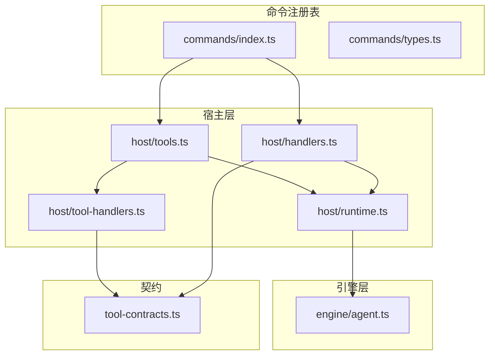
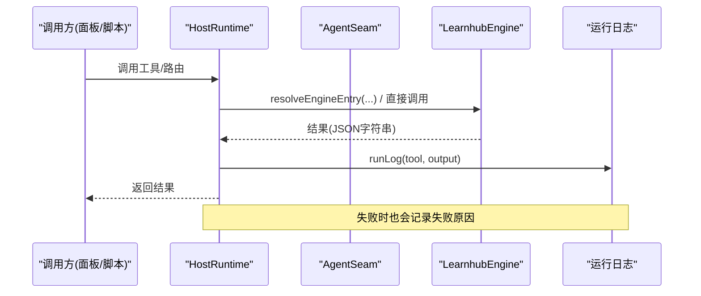
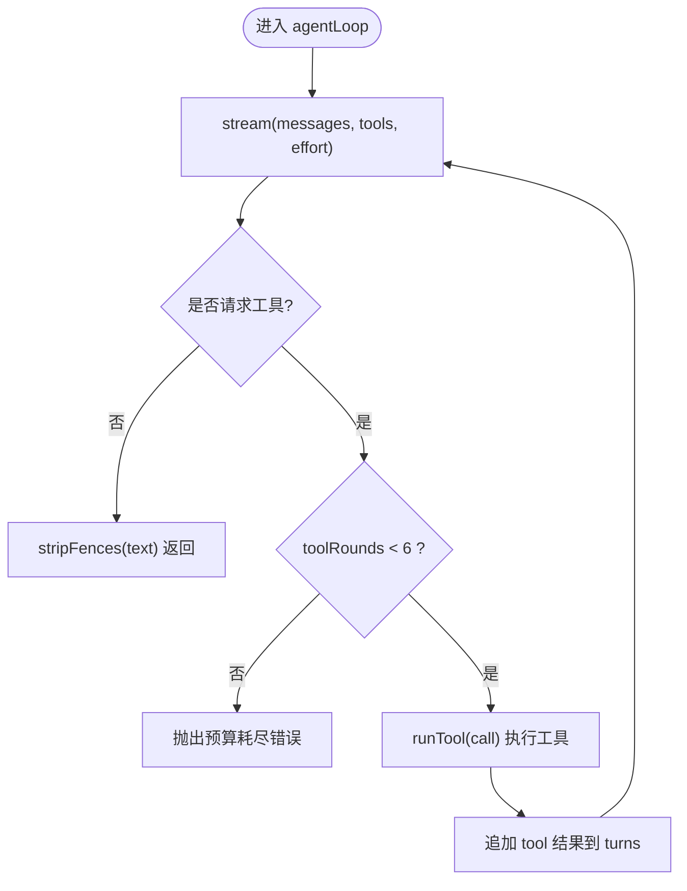
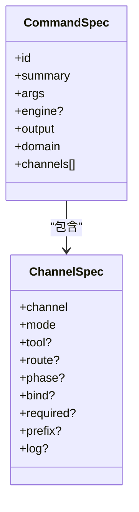
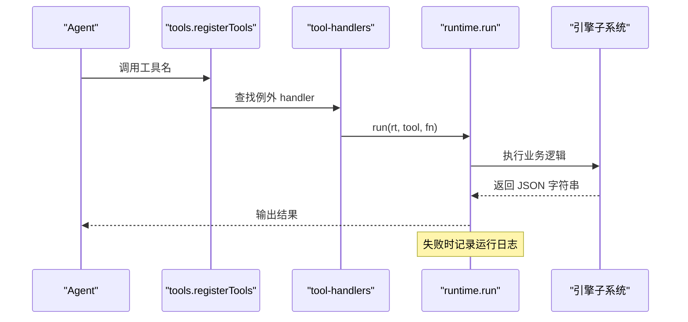
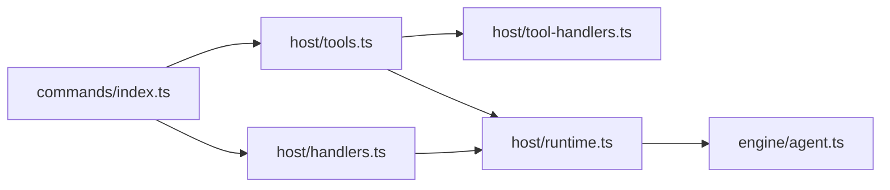

# Agent工具系统

<cite>
**本文引用的文件**
- [src/host/tool-handlers.ts](file://src/host/tool-handlers.ts)
- [src/host/tools.ts](file://src/host/tools.ts)
- [src/commands/index.ts](file://src/commands/index.ts)
- [src/commands/types.ts](file://src/commands/types.ts)
- [src/engine/agent.ts](file://src/engine/agent.ts)
- [src/host/runtime.ts](file://src/host/runtime.ts)
- [src/host/handlers.ts](file://src/host/handlers.ts)
- [src/tool-contracts.ts](file://src/tool-contracts.ts)
- [tests/agent-seam-stations.test.ts](file://tests/agent-seam-stations.test.ts)
- [tests/explicit-tool-contracts.test.ts](file://tests/explicit-tool-contracts.test.ts)
</cite>

## 目录
1. [简介](#简介)
2. [项目结构](#项目结构)
3. [核心组件](#核心组件)
4. [架构总览](#架构总览)
5. [详细组件分析](#详细组件分析)
6. [依赖关系分析](#依赖关系分析)
7. [性能与监控](#性能与监控)
8. [故障排查指南](#故障排查指南)
9. [结论](#结论)
10. [附录：自定义工具开发指南](#附录自定义工具开发指南)

## 简介
本仓库实现了一个“统一 Agent 缝”的工具系统，将学习、图谱、题库、项目、学习者产出、实验室、通道、维护等八大域的 111 个内置工具，通过声明式命令注册表，统一暴露给 Agent（LLM）与面板（Web API）两条通道。Agent 侧采用有界多轮工具回路（最多 6 轮），并支持“门错修复轮”；面板侧提供同步/队列化路由。所有工具调用均经过参数校验、运行日志记录与可观测的 LLM 调用追踪。

## 项目结构
- 命令注册表集中定义在 commands 域文件中，按领域拆分（学习、图谱、题库、项目、学习者产出、实验室、通道、维护）。
- 宿主层负责把命令注册表装配为 Agent 工具面与面板路由面。
- 引擎层提供统一的 Agent 缝（AgentSeam），封装 LLM 调用、工具回路预算、门错修复轮、观测记录。
- 运行时（runtime）承载宿主可变态（engine、agent、jobs、flags），并提供 run/apiRun 包装以落盘运行日志。

**图表来源**
- [src/commands/index.ts:25-46](file://src/commands/index.ts#L25-L46)
- [src/host/tools.ts:101-125](file://src/host/tools.ts#L101-L125)
- [src/host/handlers.ts:101-742](file://src/host/handlers.ts#L101-L742)
- [src/host/runtime.ts:138-193](file://src/host/runtime.ts#L138-L193)
- [src/engine/agent.ts:85-221](file://src/engine/agent.ts#L85-L221)
- [src/tool-contracts.ts:9-55](file://src/tool-contracts.ts#L9-L55)

**章节来源**
- [src/commands/index.ts:25-46](file://src/commands/index.ts#L25-L46)
- [src/host/tools.ts:101-125](file://src/host/tools.ts#L101-L125)
- [src/host/handlers.ts:101-742](file://src/host/handlers.ts#L101-L742)
- [src/host/runtime.ts:138-193](file://src/host/runtime.ts#L138-L193)
- [src/engine/agent.ts:85-221](file://src/engine/agent.ts#L85-L221)
- [src/tool-contracts.ts:9-55](file://src/tool-contracts.ts#L9-L55)

## 核心组件
- 命令注册表（commands/*）：单点装配，声明每个工具的 id、summary、args、engine、domain、channels（agent/panel）、bind、phase 等。
- 工具装配器（host/tools.ts）：遍历 COMMAND_LIST，为 agent 通道注册 defineTool，为 panel 通道由 handlers 分发。
- 例外处理器（host/tool-handlers.ts）：对无法走生成路径的工具（形状需加工/实参需换算/无单一入口）提供手写 handler。
- 面板路由（host/handlers.ts）：对无法走生成路径的路由提供手写 handler，其余由注册表驱动。
- 运行时（host/runtime.ts）：构造 HostRuntime，注入 AgentSeam，提供 run/apiRun 包装落盘运行日志。
- 统一 Agent 缝（engine/agent.ts）：complete/repair/agentLoop，带 K≤6 工具轮预算、轨迹记录、门错修复轮。
- 参数契约（tool-contracts.ts）：显式参数解析（如 skip 方向、question count、apply/reject id、graph kind、band 偏好）。

**章节来源**
- [src/commands/types.ts:1-129](file://src/commands/types.ts#L1-L129)
- [src/host/tools.ts:1-126](file://src/host/tools.ts#L1-L126)
- [src/host/tool-handlers.ts:1-288](file://src/host/tool-handlers.ts#L1-L288)
- [src/host/handlers.ts:1-742](file://src/host/handlers.ts#L1-L742)
- [src/host/runtime.ts:1-255](file://src/host/runtime.ts#L1-L255)
- [src/engine/agent.ts:1-227](file://src/engine/agent.ts#L1-L227)
- [src/tool-contracts.ts:1-55](file://src/tool-contracts.ts#L1-L55)

## 架构总览
- 声明即实现：COMMANDS 是单一事实源，UI 类型与响应类型从 engine 返回类型派生。
- 双通道分发：
  - Agent 通道：通过 tools.ts 注册 defineTool，execute 走“生成路径”（resolveEngineEntry + run）或“例外 handler”。
  - Panel 通道：通过 handlers.ts 路由分发，同样优先走生成路径，否则手写 handler。
- 运行时包装：run/apiRun 统一落盘运行日志，失败也留痕。
- Agent 缝：统一 complete/repair/loop，带预算与轨迹，适配不同站点（种子起草、教练生长、罗盘、目标反编译、计划草案、里程碑草案）。

**图表来源**
- [src/host/runtime.ts:198-255](file://src/host/runtime.ts#L198-L255)
- [src/host/tools.ts:101-125](file://src/host/tools.ts#L101-L125)
- [src/host/handlers.ts:101-742](file://src/host/handlers.ts#L101-L742)

**章节来源**
- [src/host/runtime.ts:198-255](file://src/host/runtime.ts#L198-L255)
- [src/host/tools.ts:101-125](file://src/host/tools.ts#L101-L125)
- [src/host/handlers.ts:101-742](file://src/host/handlers.ts#L101-L742)

## 详细组件分析

### 统一 Agent 缝与六策略站
- 统一缝提供三种模式：
  - complete：单发补全，剥围栏，记录调用日志。
  - repair：门错修复轮，仅一次回灌重产。
  - agentLoop：有界工具回路（K≤6），每轮可请求白名单工具，执行后继续，直到模型不再请求工具或达到预算上限。
- 六策略站经缝调用（测试覆盖）：
  - 种子起草、教练生长、罗盘、目标反编译、计划草案、里程碑草案。
- 语义档（effort）与 token 用量沿缝贯通，onCall 回调可观测。

**图表来源**
- [src/engine/agent.ts:122-186](file://src/engine/agent.ts#L122-L186)
- [tests/agent-seam-stations.test.ts:1-27](file://tests/agent-seam-stations.test.ts#L1-L27)

**章节来源**
- [src/engine/agent.ts:1-227](file://src/engine/agent.ts#L1-L227)
- [tests/agent-seam-stations.test.ts:1-27](file://tests/agent-seam-stations.test.ts#L1-L27)

### 工具注册机制与分类体系（111 个内置工具）
- 分类域：学习、图谱、题库、项目、学习者产出、实验室、通道、维护。
- 装配流程：
  - 遍历 COMMAND_LIST，筛选 channel=agent 且存在 tool 的命令。
  - 若声明了 engine 且有 bind，则 execute 走“生成路径”：resolveEngineEntry(...bind) → run(rt, tool, ...)。
  - 否则使用 tool-handlers.ts 中的例外 handler。
- 参数 schema：
  - sdkParameters 将 CommandSpec.args 投影为 SDK 的 parameters 形态，剥离 read 等投递层扩展键，保持与历史快照一致。
- 工具名与命令 id 解耦：BY_TOOL 索引工具名到命令，确保唯一性。

**图表来源**
- [src/commands/types.ts:54-129](file://src/commands/types.ts#L54-L129)
- [src/commands/index.ts:25-72](file://src/commands/index.ts#L25-L72)
- [src/host/tools.ts:78-125](file://src/host/tools.ts#L78-L125)

**章节来源**
- [src/commands/types.ts:1-129](file://src/commands/types.ts#L1-L129)
- [src/commands/index.ts:1-72](file://src/commands/index.ts#L1-L72)
- [src/host/tools.ts:1-126](file://src/host/tools.ts#L1-L126)

### 工具处理器 tool-handlers 工作流程与错误处理
- 角色定位：存放“走不了生成路径”的工具（66/111 条），包括形状需加工、实参需换算、无单一入口等。
- 工厂模式：handler 体依赖 registerTools 闭包内的 rt 与 ctx，避免模块级状态。
- 错误处理：
  - 显式参数校验失败抛错（如 archived 必须布尔、skip 方向必填）。
  - 异步任务（如出题、图作业）入队后等待终态，取消/失败会返回结构化消息。
  - 写侧联动（如 apply 后清理任务、课程删除后扫任务）。

**图表来源**
- [src/host/tool-handlers.ts:23-287](file://src/host/tool-handlers.ts#L23-L287)
- [src/host/runtime.ts:217-238](file://src/host/runtime.ts#L217-L238)

**章节来源**
- [src/host/tool-handlers.ts:1-288](file://src/host/tool-handlers.ts#L1-L288)
- [src/host/runtime.ts:217-238](file://src/host/runtime.ts#L217-L238)

### 工具契约 tool-contracts 的定义规范与版本管理
- 设计原则：可选参数只允许“缺省”与“合法值”，非法输入不静默改写；缺失必需参数即报错。
- 常用校验：
  - requireSkipDirection：跳过方向必须显式布尔。
  - questionCount：缺省默认数量，给出时必须为正整数。
  - applyId/rejectId：提案 id 必须正整数或缺省表示最新 pending。
  - graphKind：限制 edit/seed/enrich。
  - bandPref：难度带偏好 easy/standard/hard，非法视为 undefined。
- 版本管理：通过 tests/explicit-tool-contracts.test.ts 断言行为不变，保证契约稳定。

**章节来源**
- [src/tool-contracts.ts:1-55](file://src/tool-contracts.ts#L1-L55)
- [tests/explicit-tool-contracts.test.ts:63-81](file://tests/explicit-tool-contracts.test.ts#L63-L81)

### 工具调用的参数验证、权限控制与执行监控
- 参数验证：
  - 工具面 schema 由 sdkParameters 从 CommandSpec.args 投影，SDK 负责必填与类型校验。
  - 例外 handler 内再做强约束（如 archived 必须布尔、content 非空）。
- 权限控制：
  - 当前代码未实现细粒度权限控制；可通过宿主层在路由/工具前加鉴权中间件（未在现有文件体现）。
- 执行监控：
  - Agent 缝 onCall 记录 station/mode/effort/callNo/promptChars/replyChars/durationMs/usage。
  - runtime.runLog 写入中心状态目录的运行日志，失败也记录。
  - 面板路由 apiRun 捕获异常并记录失败原因。

**章节来源**
- [src/host/tools.ts:78-125](file://src/host/tools.ts#L78-L125)
- [src/host/tool-handlers.ts:29-287](file://src/host/tool-handlers.ts#L29-L287)
- [src/host/runtime.ts:170-193](file://src/host/runtime.ts#L170-L193)
- [src/host/runtime.ts:217-255](file://src/host/runtime.ts#L217-L255)

## 依赖关系分析
- 低耦合高内聚：
  - 命令注册表零运行时依赖，仅 import type，便于 UI 跨包消费类型。
  - 宿主层通过 runtime 注入依赖，函数纯参数化，利于测试。
- 关键依赖链：
  - commands/index.ts → host/tools.ts → host/tool-handlers.ts → host/runtime.ts → engine/agent.ts
  - commands/index.ts → host/handlers.ts → host/runtime.ts
- 外部依赖：
  - @deepseek-ai/cordis（Context）
  - @deepseek-ai/dsh-tools（defineTool）
  - AnkiConnectClient（Anki 通道）

**图表来源**
- [src/commands/index.ts:25-72](file://src/commands/index.ts#L25-L72)
- [src/host/tools.ts:101-125](file://src/host/tools.ts#L101-L125)
- [src/host/handlers.ts:101-742](file://src/host/handlers.ts#L101-L742)
- [src/host/runtime.ts:138-193](file://src/host/runtime.ts#L138-L193)
- [src/engine/agent.ts:85-221](file://src/engine/agent.ts#L85-L221)

**章节来源**
- [src/commands/index.ts:25-72](file://src/commands/index.ts#L25-L72)
- [src/host/tools.ts:101-125](file://src/host/tools.ts#L101-L125)
- [src/host/handlers.ts:101-742](file://src/host/handlers.ts#L101-L742)
- [src/host/runtime.ts:138-193](file://src/host/runtime.ts#L138-L193)
- [src/engine/agent.ts:85-221](file://src/engine/agent.ts#L85-L221)

## 性能与监控
- 工具回路预算：K≤6 轮，防止自激循环；超过预算立即中止。
- 语义档分层：fast/deep 档位用于不同复杂度节点，降低 token 成本。
- 观测面：onCall 记录每次底层调用耗时、字符数、token 用量；控制台与运行日志双写。
- 任务队列：生成类操作入队后台串行执行，HTTP 立即返回，避免阻塞。
- 建议优化：
  - 合理设置 quizAuditRate 与 effort，平衡质量与成本。
  - 利用 agentLoop 的 isCancelled 支持任务取消传导，避免空烧。

**章节来源**
- [src/engine/agent.ts:36-40](file://src/engine/agent.ts#L36-L40)
- [src/host/runtime.ts:170-193](file://src/host/runtime.ts#L170-L193)
- [src/host/runtime.ts:217-255](file://src/host/runtime.ts#L217-L255)

## 故障排查指南
- 常见错误：
  - 参数非法：如 skipped 未显式、count 非正整数、archived 非布尔等，会在 tool-contracts 或 handler 中抛错。
  - 工具回路预算耗尽：模型持续请求工具超过 6 轮，抛出错误。
  - 任务取消：agentLoop 检查 isCancelled，提前中止。
- 排查步骤：
  - 查看运行日志（中心状态目录下的运行日志.md），确认工具名与输出摘要。
  - 检查 Agent 缝 onCall 记录，确认 station/mode/effort/callNo/时长/token。
  - 对于队列任务，查看任务注册表与终态消息。

**章节来源**
- [src/tool-contracts.ts:9-55](file://src/tool-contracts.ts#L9-L55)
- [src/engine/agent.ts:167-169](file://src/engine/agent.ts#L167-L169)
- [src/host/runtime.ts:217-255](file://src/host/runtime.ts#L217-L255)

## 结论
本系统通过“声明即实现”的命令注册表，统一了 Agent 与面板的双通道工具调用，借助统一 Agent 缝实现了有界工具回路、门错修复轮与完整观测。111 个内置工具按八大域分类，参数契约严格校验，运行时统一落盘日志，具备良好的可维护性与可观测性。

## 附录：自定义工具开发指南

### 1. 工具定义
- 在对应域的 commands 文件中新增 command 声明，填写 id、summary、args、engine（可选）、domain、channels（agent/panel）。
- 若需 Agent 工具，设置 channel=agent，指定 tool 名；若需面板路由，设置 route。
- 若走生成路径，填写 engine 与 bind（顺序对应引擎实参位置）。

**章节来源**
- [src/commands/types.ts:54-129](file://src/commands/types.ts#L54-L129)
- [src/commands/index.ts:25-72](file://src/commands/index.ts#L25-L72)

### 2. 处理器实现
- 若工具能走生成路径：无需额外实现，tools.ts 会自动绑定。
- 若需例外处理：在 tool-handlers.ts 中添加 handler，注意使用 run(rt, tool, fn) 包装以落盘日志。
- 参数校验：使用 tool-contracts.ts 中的校验函数，或在 handler 内做强约束。

**章节来源**
- [src/host/tools.ts:101-125](file://src/host/tools.ts#L101-L125)
- [src/host/tool-handlers.ts:23-287](file://src/host/tool-handlers.ts#L23-L287)
- [src/tool-contracts.ts:9-55](file://src/tool-contracts.ts#L9-L55)

### 3. 测试方法
- 参数契约测试：参考 explicit-tool-contracts.test.ts，断言校验行为。
- Agent 缝测试：参考 agent-seam-stations.test.ts，验证六策略站经缝调用、语义档与修复轮。
- 面板路由测试：参考 host-routes.test.ts，断言路由清单与探针快照。

**章节来源**
- [tests/explicit-tool-contracts.test.ts:63-81](file://tests/explicit-tool-contracts.test.ts#L63-L81)
- [tests/agent-seam-stations.test.ts:1-27](file://tests/agent-seam-stations.test.ts#L1-L27)