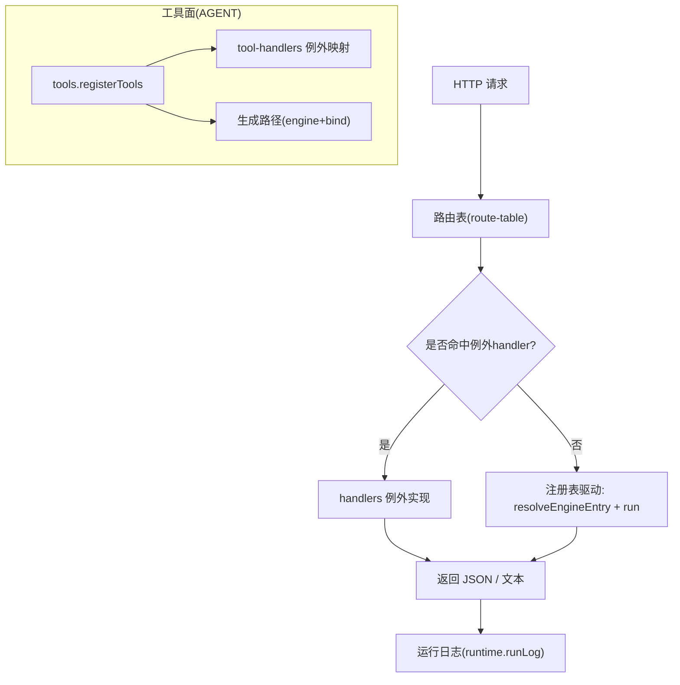
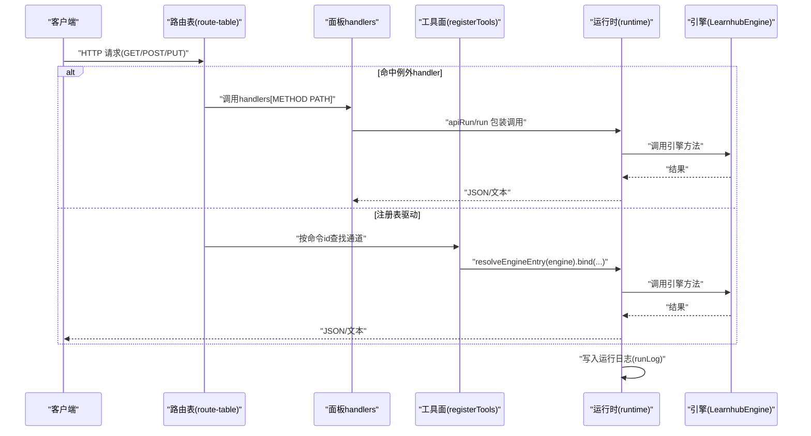
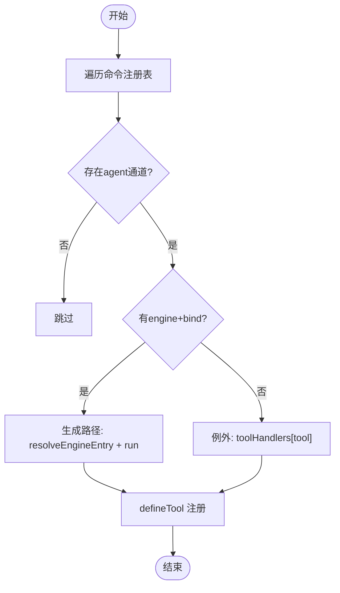
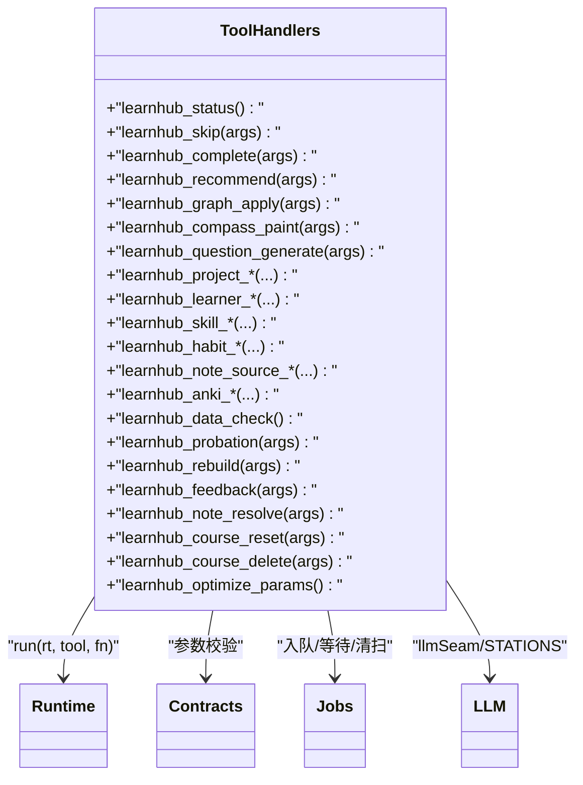
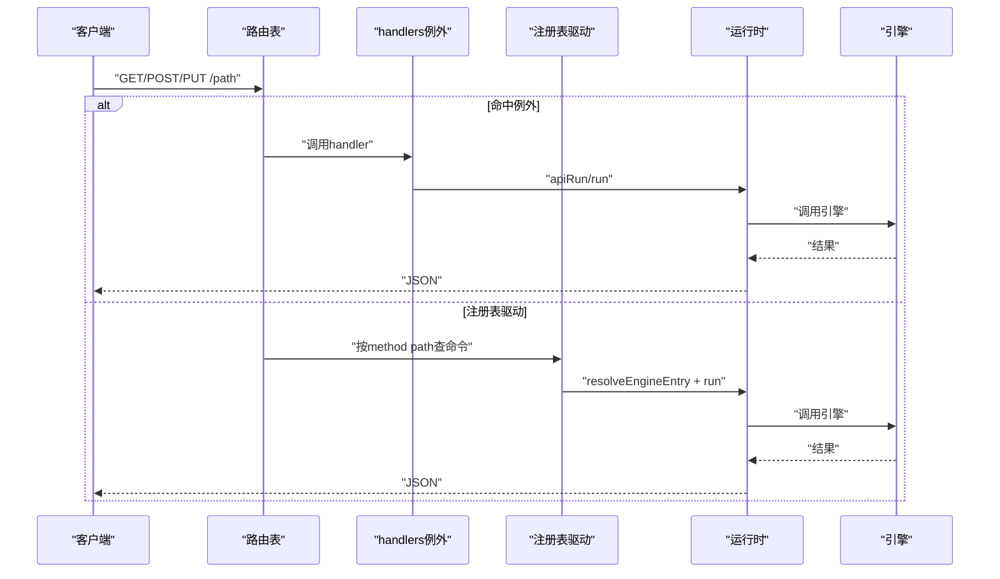
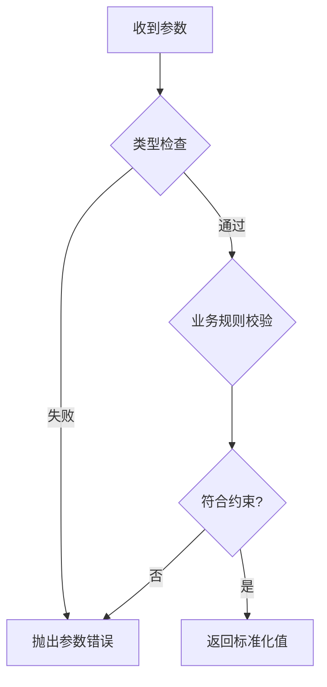
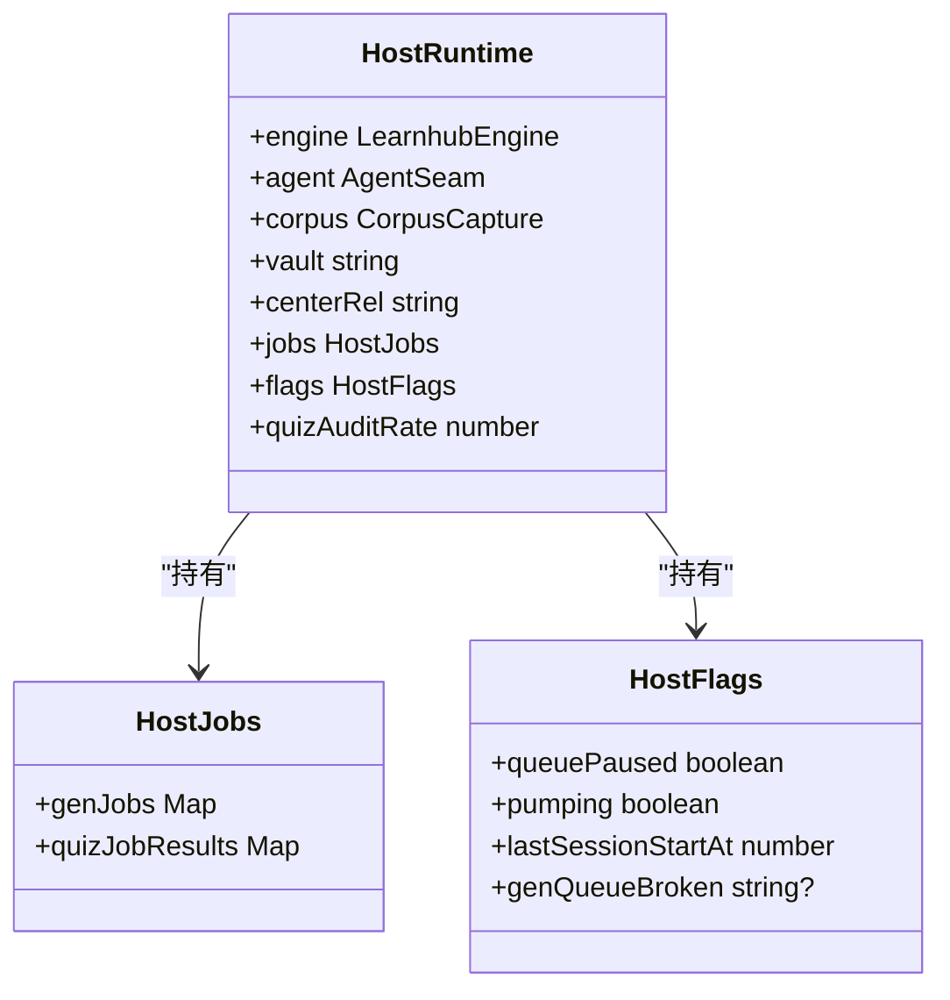
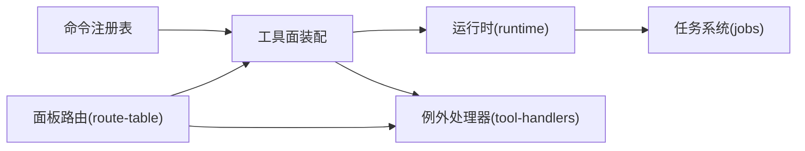

# 工具处理器

<cite>
**本文引用的文件**
- [src/host/tool-handlers.ts](file://src/host/tool-handlers.ts)
- [src/host/tools.ts](file://src/host/tools.ts)
- [src/host/runtime.ts](file://src/host/runtime.ts)
- [src/host/handlers.ts](file://src/host/handlers.ts)
- [src/host/route-table.ts](file://src/host/route-table.ts)
- [src/host/http.ts](file://src/host/http.ts)
- [src/commands/index.ts](file://src/commands/index.ts)
- [src/commands/学习.ts](file://src/commands/学习.ts)
- [src/commands/图谱.ts](file://src/commands/图谱.ts)
- [src/commands/题库.ts](file://src/commands/题库.ts)
- [src/commands/项目.ts](file://src/commands/项目.ts)
- [src/tool-contracts.ts](file://src/tool-contracts.ts)
</cite>

## 目录
1. [简介](#简介)
2. [项目结构](#项目结构)
3. [核心组件](#核心组件)
4. [架构总览](#架构总览)
5. [详细组件分析](#详细组件分析)
6. [依赖关系分析](#依赖关系分析)
7. [性能考虑](#性能考虑)
8. [故障排除指南](#故障排除指南)
9. [结论](#结论)
10. [附录：自定义工具处理器开发指南](#附录自定义工具处理器开发指南)

## 简介
本文件围绕“工具处理器”模块，系统性说明请求从 HTTP 路由到 agent 工具再到引擎入口的完整分发机制；解释学习、图谱、项目、题库等类别的处理模式；详述参数解析、验证与类型转换；描述执行上下文与状态维护；说明权限与访问控制要点；并提供自定义工具处理器的开发规范、错误处理与日志记录方式，以及性能优化与排障建议。

## 项目结构
- 命令注册表集中声明（按域分文件），提供统一的 id、summary、args、engine、channels 等元数据，并暴露 COMMAND_LIST、BY_TOOL、BY_ROUTE 等索引。
- 工具面装配：遍历命令注册表，为每个 agent 通道生成 defineTool；若存在 engine+bind，则走“生成路径”（通过 runtime.resolveEngineEntry 调用引擎）；否则回退到 tool-handlers 中的例外 handler。
- 面板路由：以 route-table 构造器定义 GET/POST/PUT 路由项；handlers 中登记例外 handler；其余由注册表驱动直接调用引擎。
- 运行时与日志：run/apiRun 统一封装引擎调用与运行日志；HostRuntime 承载 engine、agent、jobs、flags 等可测试注入的运行态。

图表来源
- [src/host/route-table.ts:16-75](file://src/host/route-table.ts#L16-L75)
- [src/host/handlers.ts:101-200](file://src/host/handlers.ts#L101-L200)
- [src/host/tools.ts:101-126](file://src/host/tools.ts#L101-L126)
- [src/host/runtime.ts:198-238](file://src/host/runtime.ts#L198-L238)

章节来源
- [src/commands/index.ts:1-72](file://src/commands/index.ts#L1-L72)
- [src/host/tools.ts:1-126](file://src/host/tools.ts#L1-L126)
- [src/host/route-table.ts:1-75](file://src/host/route-table.ts#L1-L75)
- [src/host/handlers.ts:1-200](file://src/host/handlers.ts#L1-L200)
- [src/host/runtime.ts:1-255](file://src/host/runtime.ts#L1-L255)

## 核心组件
- 命令注册表（COMMANDS/CMD_LIST/BY_TOOL/BY_ROUTE）：单点声明所有命令的 id、摘要、参数 schema、引擎入口、通道与绑定关系。
- 工具面装配（registerTools）：将命令注册表转为 dsh-tools 的 defineTool；根据是否存在 engine+bind 选择“生成路径”或“例外 handler”。
- 例外处理器（tool-handlers）：对需要形状加工、实参换算、无单一入口的工具提供显式实现；键集合与注册表中未 bind 的 agent 通道一一对应（门④）。
- 运行时（runtime）：HostRuntime 聚合 engine、agent、jobs、flags；resolveEngineEntry 支持“子系统.方法”或裸名；run/apiRun 统一输出日志与失败记录。
- 面板路由（route-table + handlers）：GET/POST/PUT 路由表与例外 handler；其余走注册表驱动。

章节来源
- [src/commands/index.ts:25-72](file://src/commands/index.ts#L25-L72)
- [src/host/tools.ts:72-126](file://src/host/tools.ts#L72-L126)
- [src/host/tool-handlers.ts:1-288](file://src/host/tool-handlers.ts#L1-L288)
- [src/host/runtime.ts:115-255](file://src/host/runtime.ts#L115-L255)
- [src/host/route-table.ts:16-75](file://src/host/route-table.ts#L16-L75)
- [src/host/handlers.ts:1-200](file://src/host/handlers.ts#L1-L200)

## 架构总览
下图展示从 HTTP 请求到工具执行的端到端流程，包括 agent 工具与面板路由两条通道，以及“生成路径”和“例外 handler”的分发策略。

图表来源
- [src/host/route-table.ts:16-75](file://src/host/route-table.ts#L16-L75)
- [src/host/handlers.ts:101-200](file://src/host/handlers.ts#L101-L200)
- [src/host/tools.ts:101-126](file://src/host/tools.ts#L101-L126)
- [src/host/runtime.ts:198-238](file://src/host/runtime.ts#L198-L238)

## 详细组件分析

### 工具面装配与分发（tools.ts）
- 参数投影：sdkParameters 将命令 args 转换为 SDK 的 parameters schema，剥离非 SDK 键，保持与历史快照一致。
- 绑定参数：boundArgs 按 bind 顺序从入参取同名键，缺失时传 undefined。
- 注册循环：遍历 COMMAND_LIST，找到 agent 通道；若存在 engine+bind，则 execute 走生成路径（resolveEngineEntry + run）；否则使用 tool-handlers 中的例外 handler。
- 工具描述与指南：AGENT_GUIDE 提供面向 agent 的提示词与页面跳转文案。

图表来源
- [src/host/tools.ts:72-126](file://src/host/tools.ts#L72-L126)
- [src/host/runtime.ts:198-238](file://src/host/runtime.ts#L198-L238)

章节来源
- [src/host/tools.ts:1-126](file://src/host/tools.ts#L1-L126)
- [src/commands/index.ts:25-72](file://src/commands/index.ts#L25-L72)

### 例外处理器（tool-handlers.ts）
- 设计原则：仅放置“走不了生成路径”的工具（形状需加工、实参需换算、无单一入口等）。
- 常见模式：
  - 会话触点：如 learnhub_status 调用 sessionStartCheckpoint。
  - 参数校验：使用 tool-contracts 中的 requireSkipDirection、questionCount、applyId、rejectId、graphKind、bandPref。
  - 队列任务：如 learnhub_compass_paint、learnhub_question_generate 入队后等待终态。
  - 写侧联动：如 graph apply 后 afterGraphApply；project apply 后 triggerPlanGrowth；课程删除后 sweepGenJobs。
  - LLM 缝注入：多处通过 llmSeam/llmSeamStripped 注入 STATIONS 站点。
- 返回值：统一 JSON.stringify 字符串，便于运行日志记录。

图表来源
- [src/host/tool-handlers.ts:23-288](file://src/host/tool-handlers.ts#L23-L288)
- [src/tool-contracts.ts:1-55](file://src/tool-contracts.ts#L1-L55)
- [src/host/runtime.ts:198-238](file://src/host/runtime.ts#L198-L238)

章节来源
- [src/host/tool-handlers.ts:1-288](file://src/host/tool-handlers.ts#L1-L288)
- [src/tool-contracts.ts:1-55](file://src/tool-contracts.ts#L1-L55)

### 面板路由与例外（route-table.ts + handlers.ts）
- 路由表：RouteSpec 包含 method、route、handler，以及预留的 RegistrySlots（id/summary/args/engine/output/channels）。
- 例外 handler：handlers 中登记无法走生成路径的路由（形状加工、队列受理、无引擎、面板独有键等）。
- 注册表驱动：其余路由通过 BY_ROUTE 匹配命令，再走 engine+bind 直调。

图表来源
- [src/host/route-table.ts:16-75](file://src/host/route-table.ts#L16-L75)
- [src/host/handlers.ts:101-200](file://src/host/handlers.ts#L101-L200)
- [src/host/runtime.ts:198-238](file://src/host/runtime.ts#L198-L238)

章节来源
- [src/host/route-table.ts:1-75](file://src/host/route-table.ts#L1-L75)
- [src/host/handlers.ts:1-200](file://src/host/handlers.ts#L1-L200)

### 参数解析、验证与类型转换（tool-contracts.ts）
- 设计原则：可选参数只允许“缺省”或“合法值”，非法输入不静默改写；必须显式的参数缺失即报错。
- 常用校验：
  - requireSkipDirection：skipped 必须布尔。
  - questionCount：正整数，缺省用默认。
  - applyId/rejectId：提案 id 为正整数，省略表示最新 pending。
  - graphKind：限定 edit/seed/enrich。
  - bandPref：easy/standard/hard，非法返回 undefined（A1 不偏移）。

图表来源
- [src/tool-contracts.ts:1-55](file://src/tool-contracts.ts#L1-L55)

章节来源
- [src/tool-contracts.ts:1-55](file://src/tool-contracts.ts#L1-L55)

### 执行上下文与状态维护（runtime.ts）
- HostRuntime：集中 engine、agent、corpus、vault、centerRel、jobs、flags、quizAuditRate。
- 任务注册表：genJobs 与 quizJobResults 用于生成任务状态与出题结果；持久化与恢复逻辑在 jobs 层。
- 运行日志：runLog 追加到中心状态目录的“运行日志.md”，run/apiRun 统一包裹引擎调用与失败记录。
- 会话节流：sessionStartCheckpoint 在多个入口触发，避免重复计算。

图表来源
- [src/host/runtime.ts:46-133](file://src/host/runtime.ts#L46-L133)
- [src/host/runtime.ts:135-193](file://src/host/runtime.ts#L135-L193)

章节来源
- [src/host/runtime.ts:1-255](file://src/host/runtime.ts#L1-L255)

### 各类工具处理器的实现模式

#### 学习工具（学习域）
- 典型能力：复习队列、节点完成/跳过、今日 pin、目标意图、教练建议、校准档案、睡眠配置、错题卡生成、学习者卡片归档、技能/习惯管理、回执提交与评审模式、实验模板、沙箱模拟等。
- 参数模式：大量使用 tool-contracts 进行严格校验；LLM 缝注入使用 STATIONS 站点。
- 状态联动：部分操作触发生成队列或后续处理（如重置课程链、清扫任务）。

章节来源
- [src/commands/学习.ts:1-200](file://src/commands/学习.ts#L1-L200)
- [src/host/tool-handlers.ts:25-246](file://src/host/tool-handlers.ts#L25-L246)

#### 图谱工具（图谱域）
- 典型能力：罗盘读取/重画、概念合并、图分析/浏览/路径查询、enc/backfill、链接回填、提案应用/拒绝、节点深查等。
- 参数模式：kind 限制为 edit/seed/enrich；提案 id 通过 applyId/rejectId 校验。
- 状态联动：apply 后 afterGraphApply；compass 重画走生成队列并等待终态。

章节来源
- [src/commands/图谱.ts:1-200](file://src/commands/图谱.ts#L1-L200)
- [src/host/tool-handlers.ts:55-80](file://src/host/tool-handlers.ts#L55-L80)

#### 项目工具（项目域）
- 典型能力：项目创建/列表/生命周期、里程碑计划/回溯、执行日志、反编译（goal decompile）、候选边推断、联合 apply（plan+seed）。
- 参数模式：严格区分 plan/seed 的 apply 语义；执行日志要求 source/evidence/rating 等字段。
- 状态联动：apply 后 triggerPlanGrowth；decompile 产生成对提案，需联合 apply。

章节来源
- [src/commands/项目.ts:1-200](file://src/commands/项目.ts#L1-L200)
- [src/host/tool-handlers.ts:120-155](file://src/host/tool-handlers.ts#L120-L155)

#### 题库工具（题库域）
- 典型能力：题库清理预览/应用、难度建议、题目审计、题目增删改归档、争议处理、遗忘记录等。
- 参数模式：count 为正整数；archived 必须显式布尔；course/node/qid 必填。
- 状态联动：清理应用会归档题目；审计只读不写。

章节来源
- [src/commands/题库.ts:1-200](file://src/commands/题库.ts#L1-L200)
- [src/host/tool-handlers.ts:116-119](file://src/host/tool-handlers.ts#L116-L119)

## 依赖关系分析
- 命令注册表 → 工具面装配：COMMAND_LIST 驱动 registerTools，生成 defineTool。
- 工具面装配 → 运行时：resolveEngineEntry 解析引擎入口；run/apiRun 统一日志。
- 工具面装配 → 例外处理器：当无 engine+bind 时，回退到 toolHandlers 中的具体实现。
- 面板路由 → 例外处理器：handlers 中登记例外；其余走注册表驱动。
- 运行时 → 任务系统：jobs 提供入队、等待、清扫等能力。

图表来源
- [src/commands/index.ts:25-72](file://src/commands/index.ts#L25-L72)
- [src/host/tools.ts:101-126](file://src/host/tools.ts#L101-L126)
- [src/host/tool-handlers.ts:23-288](file://src/host/tool-handlers.ts#L23-L288)
- [src/host/route-table.ts:16-75](file://src/host/route-table.ts#L16-L75)
- [src/host/runtime.ts:198-238](file://src/host/runtime.ts#L198-L238)

章节来源
- [src/commands/index.ts:1-72](file://src/commands/index.ts#L1-L72)
- [src/host/tools.ts:1-126](file://src/host/tools.ts#L1-L126)
- [src/host/tool-handlers.ts:1-288](file://src/host/tool-handlers.ts#L1-L288)
- [src/host/route-table.ts:1-75](file://src/host/route-table.ts#L1-L75)
- [src/host/runtime.ts:1-255](file://src/host/runtime.ts#L1-L255)

## 性能考虑
- 生成队列化：长耗时任务（如 compass 重画、出题）统一入队，避免阻塞请求；通过 waitForGenJob 等待终态。
- 会话节流：sessionStartCheckpoint 在多入口共用，减少重复计算。
- 日志截断：runLog 对输出进行长度限制，避免日志过大影响 IO。
- 模型透明：任务注册表携带 model 字段，便于审计与优化。
- 批量与抽样：出题第二意见门支持 quizAuditRate 配置，平衡质量与成本。

[本节为通用指导，无需特定文件引用]

## 故障排除指南
- 参数错误：tool-contracts 会在非法输入时抛出明确错误信息；检查必填与类型约束。
- 引擎入口不存在：resolveEngineEntry 会报“门面没有引擎入口/引擎入口不存在”；确认 engine 字段拼写与绑定。
- 任务失败：查看运行日志与任务注册表；broken 期间写回闸拒绝全量落盘，防止覆盖坏档。
- LLM 调用失败：观察 agent 缝日志与 corpus 捕获；必要时调整 effort 或重试。
- 权限与访问控制：当前实现未见显式鉴权中间件；如需限制，应在路由层或前置网关增加认证与授权校验。

章节来源
- [src/host/runtime.ts:198-255](file://src/host/runtime.ts#L198-L255)
- [src/tool-contracts.ts:1-55](file://src/tool-contracts.ts#L1-L55)

## 结论
工具处理器模块通过“命令注册表 + 工具面装配 + 例外处理器 + 运行时日志”的组合，实现了清晰、可测试、可扩展的请求分发机制。学习、图谱、项目、题库等域遵循一致的参数校验与状态联动模式；长耗时任务通过队列化解耦；运行日志贯穿始终，便于审计与排障。未来可在路由层引入更完善的权限控制，并持续优化队列与 LLM 调用成本。

[本节为总结性内容，无需特定文件引用]

## 附录：自定义工具处理器开发指南

### 新增命令（推荐优先）
- 在对应域的 commands 文件中新增 command 声明，填写 id、summary、args、engine、channels（含 agent 或 panel 路由）。
- 若走生成路径：确保 engine 指向引擎方法，并在 channels 中声明 bind（按顺序映射参数）。
- 若需例外处理：在 tool-handlers 或 handlers 中添加对应实现，并确保键集合与注册表未 bind 的通道一致（门④）。

章节来源
- [src/commands/index.ts:25-72](file://src/commands/index.ts#L25-L72)
- [src/host/tools.ts:101-126](file://src/host/tools.ts#L101-L126)
- [src/host/tool-handlers.ts:1-288](file://src/host/tool-handlers.ts#L1-L288)
- [src/host/handlers.ts:1-200](file://src/host/handlers.ts#L1-L200)

### 参数解析与验证
- 使用 tool-contracts 提供的校验函数，保证强类型与明确错误信息。
- 对于面板独有键，不要放入命令 args；仅在 handlers 中解析。

章节来源
- [src/tool-contracts.ts:1-55](file://src/tool-contracts.ts#L1-L55)

### 上下文与状态
- 通过 HostRuntime 访问 engine、agent、jobs、flags 等；避免模块级可变状态。
- 长耗时任务入队并通过 waitForGenJob 等待终态；必要时触发 afterGraphApply/triggerPlanGrowth/sweepGenJobs 等联动。

章节来源
- [src/host/runtime.ts:115-255](file://src/host/runtime.ts#L115-L255)
- [src/host/tool-handlers.ts:55-80](file://src/host/tool-handlers.ts#L55-L80)

### 错误处理与日志
- 统一通过 run/apiRun 包装引擎调用，自动记录成功/失败输出。
- 参数错误抛错即可；业务错误尽量结构化，便于日志与面板展示。

章节来源
- [src/host/runtime.ts:198-255](file://src/host/runtime.ts#L198-L255)

### 权限与访问控制
- 当前未内置鉴权；建议在 HTTP 层或网关层增加认证与授权校验，或在 handlers 中基于 ctx/req 做细粒度控制。

[本节为通用指导，无需特定文件引用]

### 性能优化建议
- 尽可能走生成路径（engine+bind），减少例外分支。
- 合理设置 quizAuditRate、effort 等开关，平衡质量与成本。
- 利用队列化与节流，避免热点路径阻塞。

[本节为通用指导，无需特定文件引用]