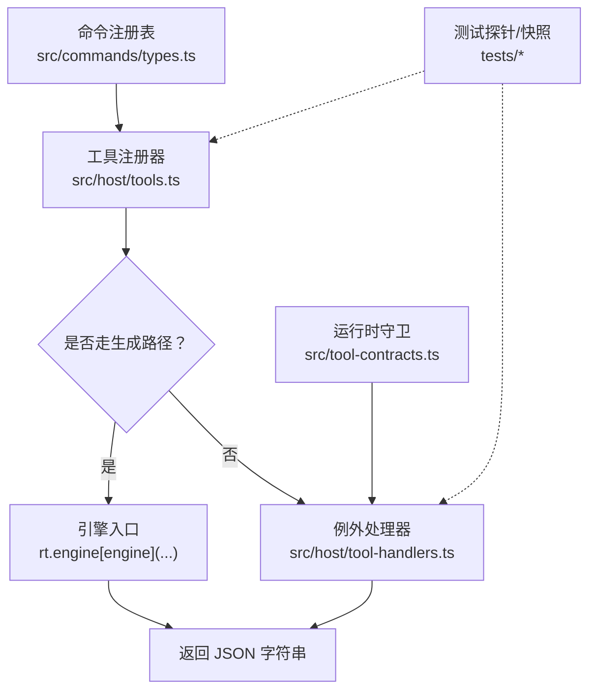
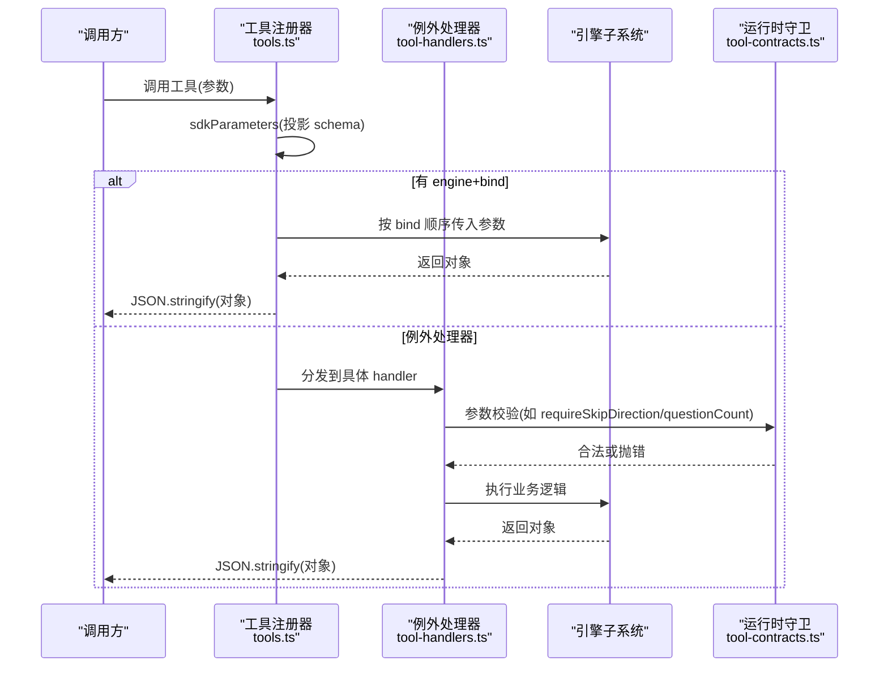
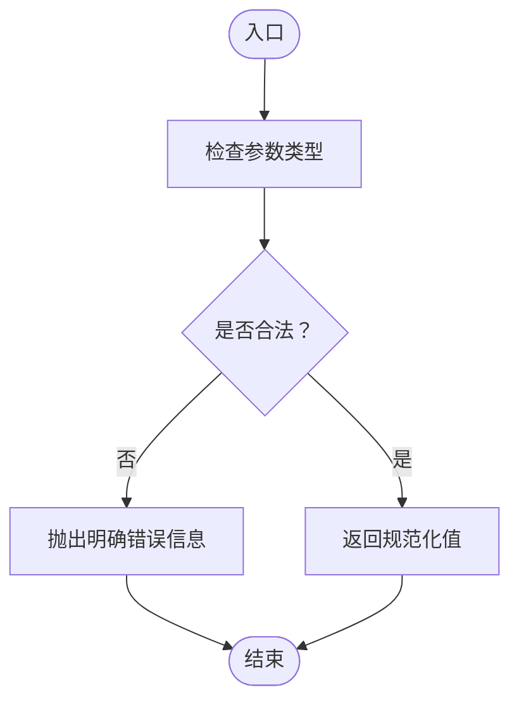
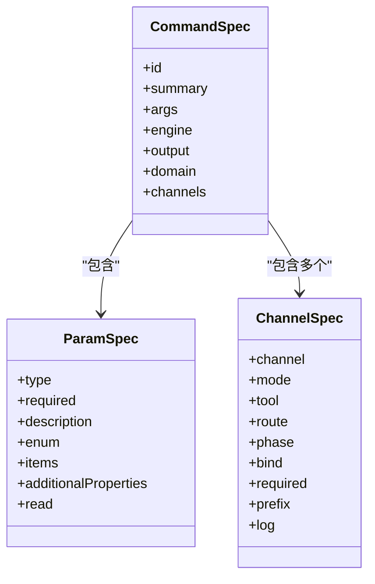
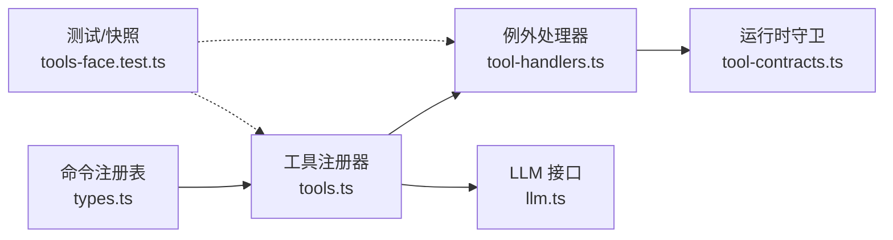

# 工具契约

<cite>
**本文引用的文件**
- [src/tool-contracts.ts](file://src/tool-contracts.ts)
- [src/host/tools.ts](file://src/host/tools.ts)
- [src/host/tool-handlers.ts](file://src/host/tool-handlers.ts)
- [src/commands/types.ts](file://src/commands/types.ts)
- [tests/explicit-tool-contracts.test.ts](file://tests/explicit-tool-contracts.test.ts)
- [tests/tools-face.test.ts](file://tests/tools-face.test.ts)
- [tests/helpers/tools-probe.ts](file://tests/helpers/tools-probe.ts)
- [src/engine/llm.ts](file://src/engine/llm.ts)
- [src/engine/schema.ts](file://src/engine/schema.ts)
- [tests/schema-cutover.test.ts](file://tests/schema-cutover.test.ts)
- [docs/adr/0045-command-registry-and-channel-discipline.md](file://docs/adr/0045-command-registry-and-channel-discipline.md)
</cite>

## 目录
1. [简介](#简介)
2. [项目结构](#项目结构)
3. [核心组件](#核心组件)
4. [架构总览](#架构总览)
5. [详细组件分析](#详细组件分析)
6. [依赖关系分析](#依赖关系分析)
7. [性能考量](#性能考量)
8. [故障排查指南](#故障排查指南)
9. [结论](#结论)
10. [附录](#附录)

## 简介
本文件系统化说明“工具契约”的定义规范、版本管理与演进策略，覆盖输入输出参数类型与约束、向后兼容保证、数据格式（JSON Schema）与验证规则、返回值标准化与错误约定、废弃工具的过渡方案，以及新工具契约的开发指南、契约验证工具与调试方法。目标是让非技术读者也能理解并安全地扩展工具面。

## 项目结构
工具契约由“声明—注册—执行—验证—测试”五层构成：
- 声明层：命令注册表定义工具名、描述、参数 schema、引擎入口绑定与通道模式。
- 注册层：宿主将声明投影为 SDK 工具定义（名称/描述/parameters），并装配 execute。
- 执行层：走生成路径（engine + bind）或例外 handler（tool-handlers）。
- 验证层：运行时守卫函数对关键参数进行强校验；测试提供行为快照与契约断言。
- 版本层：schema 版本硬门与迁移脚本确保库版本一致性。

**图示来源**
- [src/commands/types.ts:100-129](file://src/commands/types.ts#L100-L129)
- [src/host/tools.ts:72-125](file://src/host/tools.ts#L72-L125)
- [src/host/tool-handlers.ts:23-287](file://src/host/tool-handlers.ts#L23-L287)
- [src/tool-contracts.ts:9-55](file://src/tool-contracts.ts#L9-L55)
- [tests/tools-face.test.ts:1-38](file://tests/tools-face.test.ts#L1-L38)

**章节来源**
- [src/commands/types.ts:100-129](file://src/commands/types.ts#L100-L129)
- [src/host/tools.ts:72-125](file://src/host/tools.ts#L72-L125)
- [src/host/tool-handlers.ts:23-287](file://src/host/tool-handlers.ts#L23-L287)
- [src/tool-contracts.ts:9-55](file://src/tool-contracts.ts#L9-L55)
- [tests/tools-face.test.ts:1-38](file://tests/tools-face.test.ts#L1-L38)

## 核心组件
- 命令注册表（CommandSpec/ChannelSpec/ParamSpec）：集中声明工具元数据、参数 schema、引擎入口绑定、通道模式与必填清单。
- 工具注册器（registerTools/sdkParameters）：把声明投影为 SDK 工具定义，剥离投递层扩展键，保持工具面 schema 逐字不变。
- 例外处理器（toolHandlers）：处理需要形状加工或实参换算的工具，统一通过 run(rt, tool, ...) 包装执行。
- 运行时守卫（tool-contracts）：对关键参数做显式校验（如 skip 方向、题目数量、提案 id、图 kind 等），非法输入直接抛错。
- LLM 工具回路接口（LlmToolSpec/LlmLoopTurn/LlmStream）：定义模型侧工具调用消息形态与回路的统一接口。
- Schema 版本门（assertSchemaVersion）：强制课程库 schema 版本匹配，不兼容时拒绝加载并提示迁移。

**章节来源**
- [src/commands/types.ts:19-129](file://src/commands/types.ts#L19-L129)
- [src/host/tools.ts:72-125](file://src/host/tools.ts#L72-L125)
- [src/host/tool-handlers.ts:23-287](file://src/host/tool-handlers.ts#L23-L287)
- [src/tool-contracts.ts:9-55](file://src/tool-contracts.ts#L9-L55)
- [src/engine/llm.ts:51-82](file://src/engine/llm.ts#L51-L82)
- [src/engine/schema.ts:60-79](file://src/engine/schema.ts#L60-L79)

## 架构总览
工具契约的端到端流程如下：
- 声明：在命令注册表中以 ParamSpec 描述参数（type/required/description/enum/items/additionalProperties），并通过 ChannelSpec 指定 agent/panel 通道、bind、phase、required 等。
- 注册：宿主遍历 COMMAND_LIST，按 channel 是否为 agent 选择执行路径；agent 通道使用 sdkParameters 投影出 parameters，并注册 defineTool。
- 执行：若存在 engine+bind，则按 bind 顺序取同名参数调用引擎；否则进入例外处理器。
- 验证：tool-contracts 中的解析器在入口处严格校验参数，避免静默改写。
- 返回：所有工具统一返回 JSON 字符串；LLM 工具回路通过 LlmStream 传递工具调用与结果。

**图示来源**
- [src/host/tools.ts:72-125](file://src/host/tools.ts#L72-L125)
- [src/host/tool-handlers.ts:23-287](file://src/host/tool-handlers.ts#L23-L287)
- [src/tool-contracts.ts:9-55](file://src/tool-contracts.ts#L9-L55)

**章节来源**
- [src/host/tools.ts:72-125](file://src/host/tools.ts#L72-L125)
- [src/host/tool-handlers.ts:23-287](file://src/host/tool-handlers.ts#L23-L287)
- [src/tool-contracts.ts:9-55](file://src/tool-contracts.ts#L9-L55)

## 详细组件分析

### 参数契约与验证（tool-contracts）
- 设计原则：可选参数仅允许“缺省”与“合法值”，非法输入必须显式报错，禁止静默改写。
- 关键解析器：
  - requireSkipDirection：跳过方向必须显式布尔，省略即拒绝。
  - questionCount：缺省使用默认值；给出时必须为正整数。
  - applyId/rejectId：提案 id 必须为正整数；applyId 可省略表示最新 pending。
  - graphKind：只受理 edit/seed/enrich，其余值拒绝。
  - bandPref：难度带偏好 easy/standard/hard；非法或缺省视为 undefined。
- 测试覆盖：explicit-tool-contracts.test.ts 对各类非法输入进行断言，确保边界行为稳定。

**图示来源**
- [src/tool-contracts.ts:9-55](file://src/tool-contracts.ts#L9-L55)
- [tests/explicit-tool-contracts.test.ts:63-122](file://tests/explicit-tool-contracts.test.ts#L63-L122)

**章节来源**
- [src/tool-contracts.ts:9-55](file://src/tool-contracts.ts#L9-L55)
- [tests/explicit-tool-contracts.test.ts:63-122](file://tests/explicit-tool-contracts.test.ts#L63-L122)

### 工具注册与参数投影（tools.ts）
- sdkParameters：从 CommandSpec.args 投影出 SDK 的 parameters，剥离 read 等投递层扩展键，确保工具面 schema 与历史快照逐字一致。
- registerTools：遍历命令列表，为每个 agent 通道注册 defineTool；若存在 engine+bind，则按 bind 顺序取同名参数调用引擎；否则使用例外处理器。
- 输出：统一 textOutput（schema: string），execute 返回 JSON 字符串。

**图示来源**
- [src/commands/types.ts:54-129](file://src/commands/types.ts#L54-L129)
- [src/host/tools.ts:72-125](file://src/host/tools.ts#L72-L125)

**章节来源**
- [src/commands/types.ts:54-129](file://src/commands/types.ts#L54-L129)
- [src/host/tools.ts:72-125](file://src/host/tools.ts#L72-L125)

### 例外处理器（tool-handlers.ts）
- 职责：处理无法走生成路径的工具（形状需加工/实参需换算），统一通过 run(rt, tool, ...) 包装执行。
- 典型场景：
  - learnhub_skip：使用 requireSkipDirection 强制显式方向。
  - learnhub_question_generate：使用 questionCount 限制题数，入队出题任务并等待终态。
  - learnhub_graph_apply：使用 graphKind 与 applyId/rejectId 校验后执行 apply/reject，并联动 afterGraphApply。
- 错误处理：对非法参数或状态进行 fail loud 抛错，确保调用方可感知。

**章节来源**
- [src/host/tool-handlers.ts:23-287](file://src/host/tool-handlers.ts#L23-L287)

### LLM 工具回路接口（llm.ts）
- LlmToolSpec：name/description/parameters，用于向模型暴露工具能力。
- LlmLoopTurn：一轮对话消息（user/assistant/tool），tool 轮携带 callId、text、isError。
- LlmStream：一次流式请求，接收 messages/system/effort/station/tools/temperature，返回文本、工具调用列表与 token 用量。
- 作用：统一工具回路的消息形态与传输协议，便于捕获、回放与审计。

**章节来源**
- [src/engine/llm.ts:51-82](file://src/engine/llm.ts#L51-L82)

### Schema 版本管理（schema.ts）
- assertSchemaVersion：读取 learnhub.json 的 schema.version，与当前期望版本比对；不一致则拒绝加载并提示迁移脚本。
- 策略：宣告式断裂，旧库整体移入存档，零兼容代码；迁移脚本负责版本戳与 breaks 记录。
- 测试：schema-cutover.test.ts 验证正常构造与旧库拒载行为。

**章节来源**
- [src/engine/schema.ts:60-79](file://src/engine/schema.ts#L60-L79)
- [tests/schema-cutover.test.ts:1-25](file://tests/schema-cutover.test.ts#L1-L25)

## 依赖关系分析
- 命令注册表驱动工具注册：COMMAND_LIST 中的每条命令决定工具名、描述、参数 schema 与执行路径。
- 运行时守卫依赖工具契约：tool-handlers 在入口处调用 tool-contracts 解析器，确保参数合法性。
- 测试依赖行为快照：tools-face.test.ts 与 tools-probe.ts 维护工具行为基线，防止重构导致漂移。
- LLM 接口解耦实现：llm.ts 定义统一接口，屏蔽底层 provider 差异。

**图示来源**
- [src/commands/types.ts:100-129](file://src/commands/types.ts#L100-L129)
- [src/host/tools.ts:72-125](file://src/host/tools.ts#L72-L125)
- [src/host/tool-handlers.ts:23-287](file://src/host/tool-handlers.ts#L23-L287)
- [src/tool-contracts.ts:9-55](file://src/tool-contracts.ts#L9-L55)
- [src/engine/llm.ts:51-82](file://src/engine/llm.ts#L51-L82)
- [tests/tools-face.test.ts:1-38](file://tests/tools-face.test.ts#L1-L38)

**章节来源**
- [src/commands/types.ts:100-129](file://src/commands/types.ts#L100-L129)
- [src/host/tools.ts:72-125](file://src/host/tools.ts#L72-L125)
- [src/host/tool-handlers.ts:23-287](file://src/host/tool-handlers.ts#L23-L287)
- [src/tool-contracts.ts:9-55](file://src/tool-contracts.ts#L9-L55)
- [src/engine/llm.ts:51-82](file://src/engine/llm.ts#L51-L82)
- [tests/tools-face.test.ts:1-38](file://tests/tools-face.test.ts#L1-L38)

## 性能考量
- 参数投影开销低：sdkParameters 仅过滤已知键，时间复杂度 O(n)，n 为参数个数。
- 工具执行路径短：生成路径直调引擎，例外处理器集中处理复杂逻辑，减少分支判断。
- 队列型工具异步化：如出题任务入队并等待终态，避免阻塞主线程。
- 日志与捕获：run 包装与语料捕获不影响核心逻辑，但需注意 I/O 成本。

## 故障排查指南
- 参数错误：查看 tool-contracts 解析器抛出的错误信息，确认参数类型与取值范围。
- 工具行为漂移：运行 tests/tools-face.test.ts，对比行为快照，定位变更点。
- Schema 版本不匹配：根据 assertSchemaVersion 的错误提示，执行迁移脚本升级库版本。
- LLM 工具调用失败：检查 LlmStream 的 messages 与 tools 配置，确认工具白名单与参数结构。

**章节来源**
- [src/tool-contracts.ts:9-55](file://src/tool-contracts.ts#L9-L55)
- [tests/tools-face.test.ts:1-38](file://tests/tools-face.test.ts#L1-L38)
- [src/engine/schema.ts:60-79](file://src/engine/schema.ts#L60-L79)
- [src/engine/llm.ts:51-82](file://src/engine/llm.ts#L51-L82)

## 结论
本项目的工具契约以“声明驱动、运行时守卫、行为快照”为核心，确保工具面的稳定性与可演进性。通过严格的参数校验、统一的返回格式与清晰的版本管理，实现了向后兼容与平滑迁移。开发者可基于此规范快速扩展新工具，并利用测试与调试工具保障质量。

## 附录

### 输入输出参数类型与约束规则
- 参数类型：string/number/boolean/object/array，支持 enum 与 items 嵌套。
- 必填规则：通过 ChannelSpec.required 与 ParamSpec.required 共同表达，工具面 schema 逐字不变。
- 约束规则：tool-contracts 对关键参数进行强校验，非法输入立即抛错。

**章节来源**
- [src/commands/types.ts:54-129](file://src/commands/types.ts#L54-L129)
- [src/tool-contracts.ts:9-55](file://src/tool-contracts.ts#L9-L55)

### 向后兼容性保证与迁移策略
- 向后兼容：工具面 schema 与行为快照锁定，任何变更需通过测试门。
- 迁移策略：schema 版本硬门 + 迁移脚本，旧库整体归档，零兼容代码。

**章节来源**
- [tests/tools-face.test.ts:1-38](file://tests/tools-face.test.ts#L1-L38)
- [src/engine/schema.ts:60-79](file://src/engine/schema.ts#L60-L79)

### 数据格式规范（JSON Schema）与验证规则
- JSON Schema：基于 ParamSpec 投影，支持 type/required/description/enum/items/additionalProperties。
- 验证规则：SDK 校验必填与类型，tool-contracts 进行业务级校验。

**章节来源**
- [src/host/tools.ts:72-95](file://src/host/tools.ts#L72-L95)
- [src/tool-contracts.ts:9-55](file://src/tool-contracts.ts#L9-L55)

### 返回值标准化与错误码约定
- 返回值：统一 JSON 字符串，便于序列化与传输。
- 错误码：fail loud 抛错，错误信息包含上下文，便于定位。

**章节来源**
- [src/host/tools.ts:101-125](file://src/host/tools.ts#L101-L125)
- [src/host/tool-handlers.ts:23-287](file://src/host/tool-handlers.ts#L23-L287)

### 版本演进策略与废弃工具过渡方案
- 版本演进：通过命令注册表与测试快照控制变更，确保零漂移。
- 废弃过渡：保留旧工具名与行为，逐步引导至新工具，直至完全退役。

**章节来源**
- [docs/adr/0045-command-registry-and-channel-discipline.md:96-101](file://docs/adr/0045-command-registry-and-channel-discipline.md#L96-L101)
- [tests/tools-face.test.ts:1-38](file://tests/tools-face.test.ts#L1-L38)

### 新工具契约开发指南
- 接口设计：在命令注册表中声明工具，定义参数 schema 与引擎入口绑定。
- 文档生成：通过 sdkParameters 自动生成工具描述与参数说明。
- 测试用例：编写行为探针，纳入快照基线，确保后续变更不破坏契约。

**章节来源**
- [src/commands/types.ts:100-129](file://src/commands/types.ts#L100-L129)
- [src/host/tools.ts:72-125](file://src/host/tools.ts#L72-L125)
- [tests/helpers/tools-probe.ts:31-63](file://tests/helpers/tools-probe.ts#L31-L63)

### 契约验证工具与调试方法
- 验证工具：tests/explicit-tool-contracts.test.ts 验证参数契约；tests/tools-face.test.ts 验证工具行为。
- 调试方法：查看 tool-contracts 抛错信息；使用 LlmStream 捕获工具调用；检查 schema 版本。

**章节来源**
- [tests/explicit-tool-contracts.test.ts:63-122](file://tests/explicit-tool-contracts.test.ts#L63-L122)
- [tests/tools-face.test.ts:1-38](file://tests/tools-face.test.ts#L1-L38)
- [src/engine/llm.ts:51-82](file://src/engine/llm.ts#L51-L82)
- [src/engine/schema.ts:60-79](file://src/engine/schema.ts#L60-L79)